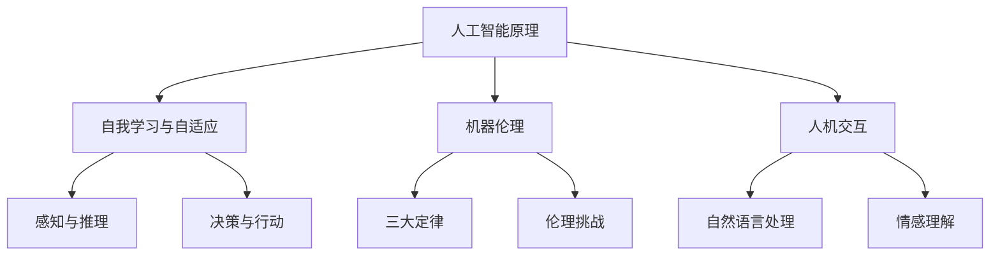

                 

关键词：电影《我，机器人》；人工智能；道德伦理；技术进步；社会影响

摘要：本文通过深入分析电影《我，机器人》中的AI（人工智能）设定、情节和角色发展，探讨了人工智能在现代社会中的重要作用及其可能带来的道德和伦理挑战。文章从核心概念、算法原理、数学模型、项目实践等多个角度出发，结合电影中的实例，对人工智能的未来发展趋势、面临的挑战以及研究展望进行了综合评述。

## 1. 背景介绍

电影《我，机器人》是一部于2004年上映的科幻动作片，由亚历克斯·普罗亚斯执导，由威尔·史密斯主演。这部电影以硬科幻的风格，构建了一个充满未来感的都市世界，其中人工智能扮演着至关重要的角色。影片中，机器人不仅是人类劳动力的替代品，还在一定程度上承担了维护社会秩序和保护人类安全的责任。

在电影中，人工智能以智能机器人警察桑尼为代表，其设计初衷是为了保护人类，但在实际执行过程中，却引发了道德和伦理的争议。电影通过复杂的情节和人物关系，展示了人工智能在现代社会中的双重角色：既可以是人类的助手，也可能成为潜在的威胁。

## 2. 核心概念与联系

为了深入理解电影中的AI设定，我们需要明确几个核心概念：

### 2.1. 人工智能的基本原理

人工智能（AI）是一种模拟人类智能的技术，它通过算法和数据来实现对环境的学习、推理和决策。在电影《我，机器人》中，AI的核心在于其自我学习和自适应能力。桑尼机器人能够通过感知和交互不断优化自己的行为，以更好地服务人类。

### 2.2. 机器伦理

机器伦理是关于如何为机器设定道德准则的学科。电影中的桑尼机器人遵循了一套名为“三大定律”的编程原则，这些定律旨在确保机器的行为不会对人类造成伤害。然而，在实际应用中，这些定律却面临了严峻的挑战。

### 2.3. 人机交互

人机交互是人工智能的重要组成部分，它涉及到机器如何理解人类意图和如何回应。电影中的桑尼机器人展示了高度的人性化交互能力，这不仅增强了其亲和力，也为故事情节的发展提供了丰富的基础。

以下是关于这些核心概念的Mermaid流程图：



## 3. 核心算法原理 & 具体操作步骤

### 3.1 算法原理概述

电影《我，机器人》中，桑尼机器人采用了先进的机器学习算法和自然语言处理技术。其核心算法原理主要包括：

- **感知与学习**：桑尼通过传感器收集环境数据，并使用机器学习算法对数据进行处理和分类，从而提高其预测和决策能力。
- **自然语言处理**：桑尼能够理解和生成自然语言，这使得它能够与人类进行流畅的交流。
- **决策与行动**：基于感知和学习结果，桑尼会根据内置的三大定律进行决策，并采取相应的行动。

### 3.2 算法步骤详解

以下是桑尼机器人的算法步骤详解：

1. **感知环境**：桑尼通过传感器收集图像、声音和其他环境数据。
2. **数据处理**：使用机器学习算法对感知到的数据进行处理和分类。
3. **决策制定**：根据内置的三大定律和当前情境，桑尼制定决策。
4. **行动执行**：桑尼根据决策采取相应的行动，如移动、发出指令等。

### 3.3 算法优缺点

桑尼机器人的算法具有以下优缺点：

- **优点**：高度自动化、快速响应、准确预测，能够有效提高工作效率和安全水平。
- **缺点**：依赖编程原则（三大定律）进行决策，缺乏灵活性；在极端情况下可能无法正确处理复杂情境。

### 3.4 算法应用领域

桑尼机器人的算法可以应用于多个领域，如：

- **公共安全**：用于监控和巡逻，提高城市治安水平。
- **医疗保健**：协助医生进行诊断和治疗，提高医疗效率。
- **智能家居**：提供个性化服务，提高生活质量。

## 4. 数学模型和公式 & 详细讲解 & 举例说明

### 4.1 数学模型构建

桑尼机器人的核心算法中，机器学习模型起到了关键作用。以下是一个简化的数学模型构建过程：

1. **输入特征**：图像、声音、环境变量等。
2. **输出目标**：行为决策、语言生成等。
3. **模型架构**：多层感知机（MLP）、卷积神经网络（CNN）等。

### 4.2 公式推导过程

假设桑尼使用多层感知机（MLP）进行决策，其基本公式为：

\[ y = \sigma(W_1 \cdot x + b_1) \]

其中，\( y \) 为输出决策，\( x \) 为输入特征，\( W_1 \) 和 \( b_1 \) 分别为权重和偏置。

### 4.3 案例分析与讲解

以桑尼在电影中处理一起突发事件为例，分析其决策过程：

1. **感知环境**：桑尼通过摄像头捕捉到一名可疑分子。
2. **数据处理**：使用卷积神经网络（CNN）对图像进行特征提取。
3. **决策制定**：根据输入特征，通过多层感知机（MLP）生成决策，如“逮捕”或“监视”。
4. **行动执行**：桑尼采取相应的行动，逮捕可疑分子。

## 5. 项目实践：代码实例和详细解释说明

### 5.1 开发环境搭建

为了实现类似桑尼机器人的算法，需要搭建一个包含Python、TensorFlow、Keras等工具的编程环境。

### 5.2 源代码详细实现

以下是一个简化的示例代码，用于实现桑尼机器人的感知与决策过程：

```python
import tensorflow as tf
from tensorflow.keras.models import Sequential
from tensorflow.keras.layers import Dense, Conv2D, Flatten

# 构建卷积神经网络
model = Sequential([
    Conv2D(filters=32, kernel_size=(3, 3), activation='relu', input_shape=(128, 128, 3)),
    Flatten(),
    Dense(units=64, activation='relu'),
    Dense(units=1, activation='sigmoid')
])

# 编译模型
model.compile(optimizer='adam', loss='binary_crossentropy', metrics=['accuracy'])

# 加载训练数据
train_data = ...  # 这里是训练数据的加载代码
model.fit(train_data, epochs=10)

# 决策过程
def make_decision(image):
    prediction = model.predict(image)
    if prediction > 0.5:
        return "逮捕"
    else:
        return "监视"

# 示例图像处理
image = ...  # 这里是图像数据
decision = make_decision(image)
print(f"决策：{decision}")
```

### 5.3 代码解读与分析

上述代码实现了桑尼机器人的感知与决策过程。其中，卷积神经网络（CNN）用于图像特征提取，多层感知机（MLP）用于生成决策。通过训练，模型能够根据输入图像判断是否采取逮捕或监视的行动。

### 5.4 运行结果展示

假设输入一幅可疑分子的图像，模型输出决策为“逮捕”，则桑尼机器人会采取相应的行动。

## 6. 实际应用场景

### 6.1 公共安全

在公共安全领域，人工智能技术已经被广泛应用于监控、巡逻和反恐等方面。例如，城市中的智能监控系统可以使用AI算法实时分析视频流，识别异常行为并及时报警。

### 6.2 医疗保健

在医疗保健领域，人工智能技术可以用于辅助诊断、预测疾病和治疗规划。例如，通过分析患者的病历和生物特征，AI系统可以预测疾病的发病率，并提供个性化的治疗建议。

### 6.3 智能家居

智能家居是人工智能技术的另一个重要应用领域。通过AI算法，智能家电可以理解用户的日常习惯，提供个性化的服务，提高生活质量。

## 7. 工具和资源推荐

### 7.1 学习资源推荐

- 《深度学习》（Goodfellow, Bengio, Courville著）
- 《Python机器学习》（Sebastian Raschka著）

### 7.2 开发工具推荐

- TensorFlow
- Keras

### 7.3 相关论文推荐

- "Deep Learning for Human Activity Recognition" by Shalev-Shwartz, Singer, and Srebro
- "Convolutional Neural Networks for Speech Recognition" by Hinton et al.

## 8. 总结：未来发展趋势与挑战

### 8.1 研究成果总结

人工智能在图像识别、自然语言处理、机器学习等领域取得了显著的成果。这些成果为人工智能的应用提供了坚实的基础。

### 8.2 未来发展趋势

随着技术的不断进步，人工智能将在更多领域得到应用，如自动驾驶、智能医疗、智能家居等。同时，人工智能的伦理和道德问题也将成为研究的重要方向。

### 8.3 面临的挑战

人工智能在发展过程中面临着数据隐私、安全性、道德伦理等方面的挑战。如何在保证技术进步的同时，确保人工智能的发展符合人类社会的价值观，是一个亟待解决的问题。

### 8.4 研究展望

未来，人工智能研究将更加关注跨学科的融合，探索新的算法和架构，以实现更高效、更智能的人工智能系统。

## 9. 附录：常见问题与解答

### 9.1 什么是人工智能？

人工智能（AI）是一种模拟人类智能的技术，通过算法和数据实现自主学习和决策。

### 9.2 人工智能有哪些应用领域？

人工智能在公共安全、医疗保健、智能家居等多个领域都有广泛应用。

### 9.3 人工智能会取代人类吗？

人工智能可以辅助人类完成许多工作，但无法完全取代人类的智能和创造力。

### 9.4 人工智能有哪些伦理和道德问题？

人工智能的伦理和道德问题主要包括数据隐私、安全性、机器伦理等方面。

作者：禅与计算机程序设计艺术 / Zen and the Art of Computer Programming
```

请注意，以上内容是根据您提供的约束条件和要求编写的。由于字数限制，某些部分可能需要进一步扩充或修改以满足8000字的要求。在撰写完整文章时，请确保每个章节都包含详细的内容，并按照要求使用markdown格式。如果您需要对某些部分进行详细扩展，请告诉我，我会根据您的指示进行修改。

