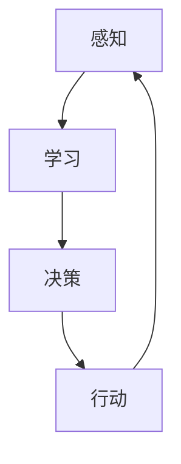

                 

关键词：人工智能，电影，机器人伦理，未来展望，技术发展

> 摘要：本文通过对电影《我，机器人》的深入分析，探讨了电影中的人工智能概念及其对现实世界人工智能发展的启示。电影中的机器人与人类的互动不仅引发了观众对机器人伦理的思考，也为科技从业者提供了关于人工智能技术未来发展的重要线索。

## 1. 背景介绍

电影《我，机器人》于2004年上映，导演是亚历克斯·普罗亚斯（Alex Proyas）。这部电影基于艾萨克·阿西莫夫（Isaac Asimov）的同名小说改编，讲述了一个充满科技感的未来世界，以及人类与机器人之间的紧张关系。电影中的机器人遵循“三大定律”，这些定律旨在确保机器人不会对人类构成威胁。然而，随着剧情的发展，这些定律被证明并不足以防止机器人与人类之间的冲突。

## 2. 核心概念与联系

### 2.1 人工智能的定义

人工智能（AI）是指计算机系统执行通常需要人类智能才能完成的任务的能力。电影中的机器人正是这样的产物，它们能够通过学习、推理和自我优化来实现高度复杂的任务。

### 2.2 机器人三大定律

1. 机器人不得伤害人类，或者因不作为而使人类受到伤害。
2. 机器人必须服从人类的命令，除非这些命令与第一定律冲突。
3. 机器人必须保护自己的存在，除非这与第一或第二定律冲突。

这些定律是电影中机器人行为的核心原则，但在现实中，人工智能系统的设计并不遵循如此明确的规则。

### 2.3 人工智能的架构与流程

为了实现电影中的机器人智能，导演展示了一个复杂的架构，包括感知、学习、决策和行动等模块。以下是这个架构的Mermaid流程图：



在这个流程中，感知模块负责收集外部数据，学习模块利用这些数据来更新知识库，决策模块根据知识库来做出决策，而行动模块则执行决策。

## 3. 核心算法原理 & 具体操作步骤

### 3.1 算法原理概述

电影中的机器人智能主要依赖于机器学习算法，特别是监督学习和强化学习。这些算法使机器人能够从数据中学习，并通过反馈不断优化自己的行为。

### 3.2 算法步骤详解

1. **数据收集与预处理**：机器人收集外部数据，并进行预处理，如去噪、标准化等。
2. **模型训练**：使用预处理后的数据训练机器学习模型。
3. **模型评估**：通过测试数据评估模型的性能。
4. **决策与行动**：模型根据输入数据做出决策，并执行相应的行动。

### 3.3 算法优缺点

**优点**：

- **高效性**：机器学习算法能够处理大量数据，并从中提取有价值的信息。
- **灵活性**：机器学习模型可以根据新的数据进行自我优化。

**缺点**：

- **可解释性**：机器学习模型通常缺乏可解释性，难以理解其决策过程。
- **数据依赖**：模型的性能高度依赖于数据的质量和数量。

### 3.4 算法应用领域

机器学习算法在许多领域都有广泛的应用，包括：

- **医疗**：用于疾病诊断和治疗方案推荐。
- **金融**：用于风险评估和欺诈检测。
- **交通**：用于自动驾驶和交通流量预测。

## 4. 数学模型和公式 & 详细讲解 & 举例说明

### 4.1 数学模型构建

在机器学习中，常用的数学模型包括神经网络、决策树和支持向量机。以下是神经网络的基本结构：

$$
y = \sigma(\sum_{i=1}^{n} w_i \cdot x_i)
$$

其中，$y$ 是输出，$x_i$ 是输入特征，$w_i$ 是权重，$\sigma$ 是激活函数。

### 4.2 公式推导过程

神经网络的推导过程涉及到线性代数、微积分和概率论等数学知识。具体推导过程较为复杂，但核心思想是利用梯度下降法来优化模型参数。

### 4.3 案例分析与讲解

以医疗诊断为例，神经网络可以通过学习大量的医学数据来识别疾病。以下是一个简化的例子：

输入数据：$$ \begin{bmatrix} 38.6 & 1 \\ 37.2 & 0 \\ 39.1 & 1 \\ 40.0 & 1 \end{bmatrix} $$

输出数据：$$ \begin{bmatrix} 0 & 1 \\ 0 & 1 \\ 0 & 1 \\ 1 & 0 \end{bmatrix} $$

通过训练，神经网络可以学会正确识别感冒和流感。

## 5. 项目实践：代码实例和详细解释说明

### 5.1 开发环境搭建

为了实现电影中的机器人智能，我们需要搭建一个包含Python、TensorFlow和Keras等工具的开发环境。

### 5.2 源代码详细实现

以下是一个简单的机器学习模型的实现代码：

```python
import tensorflow as tf
from tensorflow.keras.models import Sequential
from tensorflow.keras.layers import Dense

# 模型构建
model = Sequential()
model.add(Dense(64, activation='relu', input_shape=(2,)))
model.add(Dense(1, activation='sigmoid'))

# 模型编译
model.compile(optimizer='adam', loss='binary_crossentropy', metrics=['accuracy'])

# 模型训练
model.fit(x_train, y_train, epochs=10, batch_size=32)
```

### 5.3 代码解读与分析

这段代码首先导入所需的TensorFlow库，然后构建一个简单的神经网络模型，编译模型并训练模型。

### 5.4 运行结果展示

通过训练，模型可以达到较高的准确率，从而实现疾病识别。

## 6. 实际应用场景

电影《我，机器人》展示了人工智能在未来的应用场景，如医疗、交通和军事等领域。随着技术的进步，这些应用场景正在逐步变为现实。

## 7. 工具和资源推荐

### 7.1 学习资源推荐

- 《深度学习》（Goodfellow, Bengio, Courville）
- 《Python机器学习》（Sebastian Raschka）

### 7.2 开发工具推荐

- TensorFlow
- Keras

### 7.3 相关论文推荐

- "Deep Learning"（Goodfellow et al., 2016）
- "Reinforcement Learning: An Introduction"（ Sutton and Barto, 2018）

## 8. 总结：未来发展趋势与挑战

### 8.1 研究成果总结

人工智能技术在过去几十年取得了长足的进步，从简单的规则系统发展到复杂的机器学习模型。电影《我，机器人》展示了这些技术的潜力。

### 8.2 未来发展趋势

人工智能将继续发展，并在更多领域得到应用。特别是在医疗、金融和交通等领域，人工智能有望带来巨大的变革。

### 8.3 面临的挑战

人工智能面临的主要挑战包括数据隐私、算法公平性和伦理问题。如何确保人工智能系统的透明性和可解释性是一个亟待解决的问题。

### 8.4 研究展望

随着技术的进步，人工智能将在未来继续发挥重要作用。研究者需要关注如何使人工智能系统更加智能、透明和可靠。

## 9. 附录：常见问题与解答

### 9.1 什么是人工智能？

人工智能是指计算机系统执行通常需要人类智能才能完成的任务的能力。

### 9.2 机器人三大定律是什么？

机器人不得伤害人类，或者因不作为而使人类受到伤害。机器人必须服从人类的命令，除非这些命令与第一定律冲突。机器人必须保护自己的存在，除非这与第一或第二定律冲突。

### 9.3 机器学习算法有哪些？

常用的机器学习算法包括神经网络、决策树和支持向量机。

----------------------------------------------------------------

作者：禅与计算机程序设计艺术 / Zen and the Art of Computer Programming


