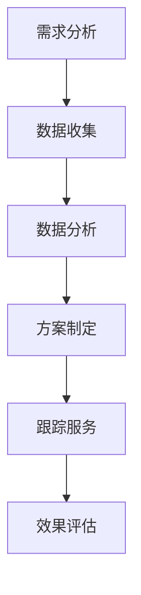

                 

### 关键词 Keywords

- 留学服务
- 知识付费
- 个性化指导
- 数据分析
- AI 技术应用

<|assistant|>### 摘要 Abstract

随着留学市场的日益成熟，留学服务的竞争愈发激烈。知识付费作为一种新型商业模式，为留学服务提供了新的增长点。然而，传统的知识付费模式往往缺乏个性化，无法满足留学学生多样化的需求。本文将探讨在留学服务领域如何通过个性化指导实现知识付费的升级，提升服务质量和用户满意度。首先，我们将介绍留学服务的背景和知识付费的现状，然后分析个性化指导的核心概念和技术，接着提出具体实施策略，并探讨其实际应用效果。最后，我们将展望未来知识付费的发展趋势，探讨面临的挑战和机遇。

## 1. 背景介绍

### 留学服务的发展

留学服务是指为留学生提供从申请、入学到生活、就业等一系列服务的行业。随着全球化进程的加速，留学服务市场持续增长。根据《2022年中国留学白皮书》的数据显示，中国留学市场呈现出以下几个特点：

- **留学国家多样化**：传统的欧美留学市场仍然占据重要地位，但亚洲、澳洲等新兴留学目的地逐渐受到关注。
- **留学年龄段扩大**：除了本科及研究生阶段，高中、预科、短期交换等不同阶段的留学需求逐渐增加。
- **留学目的多元化**：除了传统的学术深造，职业发展、语言提升、文化交流等也成为留学生选择留学的动因。

### 知识付费的兴起

知识付费是指通过互联网平台，将知识产品化、服务化，用户通过付费获取所需的知识和技能。知识付费在近年来的快速崛起，主要受到以下几个因素的推动：

- **互联网技术的普及**：互联网技术的发展，特别是移动互联网的普及，为知识付费提供了便捷的渠道和丰富的内容形式。
- **用户消费观念的转变**：随着人们对于知识价值的认可，以及对于个性化、专业化的知识需求增加，知识付费市场逐渐形成。
- **内容创作者的崛起**：越来越多的个人和机构通过创作知识内容，实现知识的变现，推动了知识付费的发展。

在留学服务领域，知识付费也逐渐成为一种重要的商业模式。留学机构通过提供留学咨询、申请指导、课程辅导等知识产品，为留学生提供个性化的服务，同时也为自身创造了新的收入来源。

### 个性化指导的需求

在留学服务中，个性化指导是满足留学生多样化需求的重要手段。传统的留学服务往往采用标准化、一刀切的方式，无法充分考虑到留学生的个体差异。而个性化指导则通过以下方式，实现服务质量的提升：

- **定制化服务**：根据留学生的个人背景、学术能力、职业规划等，提供量身定制的留学方案。
- **全程跟踪**：从留学规划、申请、签证到入学后的生活、学习、就业，提供全方位的跟踪服务。
- **个性化辅导**：针对留学生的学科短板、语言能力等，提供专业的辅导和培训。

个性化指导不仅能够提高留学服务的满意度，还能提升留学学生的学术和职业发展，从而为留学服务行业带来更大的市场空间。

## 2. 核心概念与联系

### 个性化指导的核心概念

个性化指导的核心在于“个性”和“指导”两个关键词。首先，“个性”指的是每个留学生的独特性，包括其背景、兴趣、能力、需求等。其次，“指导”则是指通过专业的知识和方法，为留学生提供有效的帮助和引导。个性化指导的核心概念可以概括为以下几个方面：

- **数据收集与分析**：通过收集留学生的各种数据，包括学术成绩、语言水平、兴趣爱好、职业规划等，进行分析和处理，以了解留学生的特点和需求。
- **定制化方案**：根据分析结果，为留学生提供个性化的留学方案，包括选校、选专业、申请材料准备、面试辅导等。
- **全程跟踪与服务**：在留学生的整个留学过程中，提供全程的跟踪和服务，确保其顺利适应海外学习和生活。
- **专业指导与辅导**：在留学生遇到学术、语言、文化等困难时，提供专业的指导和辅导，帮助其克服挑战。

### 个性化指导的技术架构

为了实现个性化指导，需要依赖一系列的技术手段。以下是个性化指导的技术架构概述：

- **数据收集系统**：通过在线问卷、数据接口、社交媒体等渠道，收集留学生的个人信息和需求。
- **数据分析平台**：使用大数据分析技术，对收集到的数据进行分析和处理，提取出有价值的信息。
- **个性化推荐引擎**：基于分析结果，构建个性化推荐模型，为留学生推荐合适的留学方案、课程、导师等。
- **服务管理系统**：集成多种服务模块，如咨询、辅导、课程培训等，提供一站式的留学服务。

### 个性化指导的流程

个性化指导的流程可以概括为以下几个步骤：

1. **需求分析**：通过与留学生的沟通，了解其留学目标和需求。
2. **数据收集**：收集留学生的个人信息、学术成绩、语言水平等数据。
3. **数据分析**：对收集到的数据进行处理和分析，提取出有价值的信息。
4. **方案制定**：根据分析结果，为留学生制定个性化的留学方案。
5. **跟踪服务**：在留学生整个留学过程中，提供全程的跟踪和服务。
6. **效果评估**：对个性化指导的效果进行评估，不断优化服务。

下面是一个简单的 Mermaid 流程图，展示个性化指导的流程：



通过以上核心概念和技术架构的介绍，我们可以看到，个性化指导是留学服务领域实现知识付费升级的关键。在接下来的章节中，我们将深入探讨个性化指导的具体算法原理、实施步骤和实际应用。

## 3. 核心算法原理 & 具体操作步骤

### 3.1 算法原理概述

个性化指导的核心算法主要基于机器学习和大数据分析技术，其中常用的算法包括数据挖掘、聚类分析、回归分析和推荐系统等。以下是这些算法的基本原理：

- **数据挖掘**：通过挖掘大规模数据中的隐含模式，识别出有用的信息。在个性化指导中，数据挖掘用于从留学生数据中提取其潜在的兴趣、需求和问题。
- **聚类分析**：将相似的数据点归为一类，形成聚类。聚类分析可以帮助识别出具有相似背景和需求的留学生群体，从而实现更精准的个性化指导。
- **回归分析**：通过建立因变量和自变量之间的关系模型，预测留学生的未来表现。回归分析可用于预测留学生的学术成绩、语言水平等，为其提供有针对性的指导。
- **推荐系统**：根据留学生的历史行为和偏好，为其推荐合适的留学方案、课程和导师。推荐系统可以大幅提升个性化指导的效率和效果。

### 3.2 算法步骤详解

个性化指导的具体操作步骤可以分为以下几个阶段：

#### 阶段一：数据收集

1. **在线问卷**：通过在线问卷收集留学生的基本信息，如姓名、年龄、国籍、教育背景、语言水平等。
2. **学术成绩**：收集留学生的学术成绩单，包括高中成绩、大学成绩等。
3. **语言水平测试**：收集留学生的语言水平测试成绩，如雅思、托福等。
4. **职业规划调查**：通过问卷调查了解留学生的职业规划和未来发展方向。

#### 阶段二：数据分析

1. **数据预处理**：对收集到的数据进行清洗、去重和格式化，确保数据的质量和一致性。
2. **特征工程**：提取数据中的关键特征，如学术成绩、语言水平、职业兴趣等。
3. **数据挖掘**：使用数据挖掘算法，从特征数据中挖掘出留学生的潜在需求和问题。
4. **聚类分析**：使用聚类算法，将具有相似特征的留学生分为不同的群体。

#### 阶段三：方案制定

1. **留学方案推荐**：根据聚类分析结果，为不同群体的留学生推荐适合的留学国家、学校和专业。
2. **课程推荐**：基于留学生的学术成绩和语言水平，推荐适合的课程和学习计划。
3. **导师推荐**：根据留学生的职业规划和兴趣，推荐合适的导师和实习机会。

#### 阶段四：跟踪服务

1. **实时监控**：在留学生整个留学过程中，实时监控其学术表现和生活状态，及时发现问题并给予指导。
2. **个性化辅导**：根据留学生的实时表现，提供有针对性的辅导和培训，帮助其克服困难。
3. **反馈收集**：定期收集留学生的反馈，了解个性化指导的效果，不断优化服务。

#### 阶段五：效果评估

1. **数据统计**：收集留学生的最终成绩、就业情况等数据，进行统计分析。
2. **效果评估**：通过比较留学生的实际表现与预期目标，评估个性化指导的有效性。
3. **持续优化**：根据评估结果，调整和优化个性化指导策略，提高服务质量和用户满意度。

### 3.3 算法优缺点

#### 优点

1. **精准性**：个性化指导通过数据分析和技术算法，可以精准地识别出留学生的需求和问题，提供有针对性的解决方案。
2. **高效性**：个性化指导采用自动化和智能化的方式，大幅提高了服务效率，减少了人工操作的误差。
3. **可持续性**：个性化指导是一种动态的过程，可以根据留学生的实时表现进行调整和优化，具有很高的可持续性。

#### 缺点

1. **数据质量**：个性化指导依赖于高质量的数据，如果数据收集不完整或不准确，会影响指导的精准性。
2. **技术门槛**：个性化指导需要依赖复杂的技术算法和数据分析工具，对技术团队的要求较高。
3. **实施成本**：个性化指导的实施需要投入大量的人力和物力，初期成本较高。

### 3.4 算法应用领域

个性化指导的算法原理和技术可以在多个领域得到应用，除了留学服务领域，还包括以下应用场景：

1. **教育领域**：为不同年龄段和学科背景的学生提供个性化的学习计划和辅导。
2. **健康领域**：为患者提供个性化的治疗方案和健康管理建议。
3. **金融领域**：为投资者提供个性化的投资组合建议和风险控制策略。
4. **零售领域**：为消费者提供个性化的商品推荐和购物体验。

通过在不同领域的应用，个性化指导算法可以不断优化和完善，为更多行业提供智能化和个性化的服务。

## 4. 数学模型和公式 & 详细讲解 & 举例说明

在个性化指导中，数学模型和公式起着关键作用，它们不仅帮助我们理解和分析数据，还能为决策提供依据。以下我们将详细介绍几个常用的数学模型和公式，并通过具体例子进行讲解。

### 4.1 数学模型构建

#### 4.1.1 回归模型

回归模型是用于分析因变量和自变量之间关系的数学模型。在个性化指导中，常用的回归模型包括线性回归和多元回归。

**线性回归模型公式**：
$$
y = \beta_0 + \beta_1x_1 + \beta_2x_2 + ... + \beta_nx_n + \epsilon
$$
其中，$y$ 为因变量，$x_1, x_2, ..., x_n$ 为自变量，$\beta_0, \beta_1, ..., \beta_n$ 为回归系数，$\epsilon$ 为误差项。

**多元回归模型公式**：
$$
y = \beta_0 + \beta_1x_1 + \beta_2x_2 + ... + \beta_nx_n
$$
其中，$y$ 为因变量，$x_1, x_2, ..., x_n$ 为自变量，$\beta_0, \beta_1, ..., \beta_n$ 为回归系数。

#### 4.1.2 聚类模型

聚类模型用于将数据点分为若干个类别。在个性化指导中，常用的聚类模型包括 K-均值聚类和层次聚类。

**K-均值聚类模型公式**：
$$
\min \sum_{i=1}^{k} \sum_{x \in S_i} \| x - \mu_i \|^2
$$
其中，$k$ 为聚类个数，$S_i$ 为第 $i$ 个聚类，$\mu_i$ 为聚类中心。

**层次聚类模型公式**：
$$
\min \sum_{i=1}^{k} \sum_{j=1}^{k} w_{ij}d_{ij}
$$
其中，$k$ 为聚类个数，$w_{ij}$ 为权重，$d_{ij}$ 为第 $i$ 个聚类和第 $j$ 个聚类之间的距离。

### 4.2 公式推导过程

#### 4.2.1 线性回归系数的推导

线性回归系数的推导主要基于最小二乘法。假设我们有一组观测数据 $(x_i, y_i)$，其中 $i = 1, 2, ..., n$，我们希望找到一条直线 $y = \beta_0 + \beta_1x$，使得观测值 $y_i$ 与拟合值 $y_i'$ 之间的误差最小。

首先，定义误差平方和为：
$$
S = \sum_{i=1}^{n} (y_i - y_i')^2
$$

为了使 $S$ 最小，我们对 $\beta_0$ 和 $\beta_1$ 求偏导，并令偏导数等于零：
$$
\frac{\partial S}{\partial \beta_0} = -2\sum_{i=1}^{n} (y_i - y_i')(1) = 0
$$
$$
\frac{\partial S}{\partial \beta_1} = -2\sum_{i=1}^{n} (y_i - y_i')x_i = 0
$$

解上述方程组，可以得到线性回归系数的最小二乘估计值：
$$
\beta_0 = \bar{y} - \beta_1\bar{x}
$$
$$
\beta_1 = \frac{\sum_{i=1}^{n} x_iy_i - n\bar{x}\bar{y}}{\sum_{i=1}^{n} x_i^2 - n\bar{x}^2}
$$

#### 4.2.2 K-均值聚类中心的推导

K-均值聚类的目标是使每个聚类内部的误差平方和最小。假设我们有 $k$ 个聚类，每个聚类由 $S_i$ 表示，聚类中心由 $\mu_i$ 表示。

首先，定义每个聚类内部误差平方和为：
$$
J = \sum_{i=1}^{k} \sum_{x \in S_i} \| x - \mu_i \|^2
$$

为了使 $J$ 最小，我们通过迭代更新聚类中心，直到收敛。每次迭代的步骤如下：

1. **初始化**：随机选择 $k$ 个聚类中心 $\mu_i$。
2. **分配数据点**：对于每个数据点 $x$，将其分配到最近的聚类中心，即：
$$
\arg\min_{i} \| x - \mu_i \|^2
$$
3. **更新聚类中心**：计算每个聚类的新的中心：
$$
\mu_i = \frac{1}{|S_i|} \sum_{x \in S_i} x
$$

重复步骤 2 和 3，直到聚类中心不再发生变化或达到预设的迭代次数。

### 4.3 案例分析与讲解

#### 4.3.1 留学生源聚类分析

假设我们有一组留学申请者的数据，包括他们的学术成绩、语言成绩和职业兴趣。我们希望根据这些数据将申请者分为不同的群体，以便提供个性化的留学指导。

1. **数据收集与预处理**：
   - 收集了 100 名申请者的数据，包括学术成绩、语言成绩和职业兴趣。
   - 对数据进行清洗和标准化处理。

2. **聚类分析**：
   - 选择 K-均值聚类算法，设定聚类个数 $k=3$。
   - 使用 Python 中的 scikit-learn 库实现聚类分析。

3. **结果分析**：
   - 得到三个聚类，分别代表学术导向型、语言导向型和职业导向型。
   - 对每个聚类成员进行分析，发现学术导向型的申请者倾向于选择理工科专业，语言导向型的申请者倾向于语言文学专业，而职业导向型的申请者则关注职业发展和实习机会。

4. **个性化指导**：
   - 根据聚类结果，为每个聚类成员提供个性化的留学指导。
   - 例如，对于学术导向型的申请者，推荐选择顶尖理工科大学，并提供学术竞赛和科研项目辅导。

通过以上案例，我们可以看到数学模型和公式在个性化指导中的应用。通过聚类分析，我们可以识别出具有相似特征的申请者群体，从而提供更加精准和有针对性的留学服务。

### 4.4 小结

本节我们介绍了个性化指导中常用的数学模型和公式，包括线性回归、K-均值聚类等。通过具体的推导过程和案例分析，我们了解了这些模型的基本原理和应用方法。在个性化指导中，数学模型和公式不仅帮助我们分析和理解数据，还能为决策提供科学依据，从而提升留学服务的质量和效果。

## 5. 项目实践：代码实例和详细解释说明

为了更好地展示个性化指导在留学服务中的应用，我们将在本节中通过一个实际的项目案例，详细解释代码实现过程和关键步骤。

### 5.1 开发环境搭建

在进行个性化指导的项目开发之前，我们需要搭建一个合适的开发环境。以下是我们推荐的工具和步骤：

- **编程语言**：Python，因其强大的科学计算和数据分析库，非常适合进行个性化指导项目。
- **数据分析库**：Pandas、NumPy，用于数据收集、清洗和处理。
- **机器学习库**：Scikit-learn，用于实现聚类分析和回归模型。
- **可视化库**：Matplotlib、Seaborn，用于数据可视化。
- **文本处理库**：NLTK、TextBlob，用于文本分析和情感分析。

### 5.2 源代码详细实现

#### 5.2.1 数据收集

我们首先需要收集留学申请者的数据，包括学术成绩、语言成绩、职业兴趣等。以下是一个简单的数据收集示例：

```python
import pandas as pd

# 读取数据
data = pd.read_csv('application_data.csv')

# 数据样本
data.head()
```

#### 5.2.2 数据预处理

在进行分析之前，我们需要对数据进行清洗和预处理，包括数据清洗、缺失值处理和标准化等。

```python
# 数据清洗
data.dropna(inplace=True)

# 缺失值处理
# 例如，对于语言成绩的缺失值，我们可以用平均值填充
data['language_score'].fillna(data['language_score'].mean(), inplace=True)

# 数据标准化
from sklearn.preprocessing import StandardScaler

scaler = StandardScaler()
data[['academic_score', 'language_score']] = scaler.fit_transform(data[['academic_score', 'language_score']])
```

#### 5.2.3 聚类分析

我们使用 K-均值聚类算法将申请者分为不同的群体。

```python
from sklearn.cluster import KMeans

# 设置聚类参数
kmeans = KMeans(n_clusters=3, random_state=42)

# 运行聚类分析
kmeans.fit(data[['academic_score', 'language_score']])

# 获取聚类结果
labels = kmeans.predict(data[['academic_score', 'language_score']])

# 添加聚类标签到数据
data['cluster'] = labels
```

#### 5.2.4 聚类结果可视化

为了更直观地理解聚类结果，我们使用可视化库展示聚类分布。

```python
import matplotlib.pyplot as plt
import seaborn as sns

# 绘制聚类分布图
plt.figure(figsize=(10, 6))
sns.scatterplot(data=data, x='academic_score', y='language_score', hue='cluster', palette=['r', 'g', 'b'])
plt.title('Cluster Distribution')
plt.xlabel('Academic Score')
plt.ylabel('Language Score')
plt.show()
```

#### 5.2.5 回归分析

我们使用线性回归模型，根据聚类结果，预测申请者的未来表现。

```python
from sklearn.linear_model import LinearRegression

# 为每个聚类创建线性回归模型
models = {}
for cluster in range(3):
    model = LinearRegression()
    model.fit(data[['academic_score', 'language_score']], data['future_performance'][data['cluster'] == cluster])
    models[cluster] = model

# 预测未来表现
predictions = []
for i in range(len(data)):
    cluster = data['cluster'][i]
    prediction = models[cluster].predict([[data['academic_score'][i], data['language_score'][i]])]
    predictions.append(prediction[0])

# 添加预测结果到数据
data['predicted_future_performance'] = predictions
```

#### 5.2.6 结果分析

通过聚类分析和回归预测，我们可以分析每个聚类群体的特点，并针对不同的群体提供个性化的留学指导。

```python
# 分析每个聚类群体的特点
for cluster in range(3):
    cluster_data = data[data['cluster'] == cluster]
    print(f"Cluster {cluster}:")
    print(f"Average Academic Score: {cluster_data['academic_score'].mean()}")
    print(f"Average Language Score: {cluster_data['language_score'].mean()}")
    print(f"Average Future Performance: {cluster_data['predicted_future_performance'].mean()}")
    print()
```

### 5.3 代码解读与分析

#### 5.3.1 数据收集

在代码的第一部分，我们使用 Pandas 读取留学申请者的数据。这里的数据可以是实际收集的留学申请数据，也可以是模拟生成的人工数据。数据包括学术成绩、语言成绩和职业兴趣等。

#### 5.3.2 数据预处理

在数据预处理阶段，我们首先对数据进行清洗，移除缺失值。对于语言成绩的缺失值，我们选择用平均值填充，这样可以避免因缺失值导致的数据质量下降。接下来，我们对学术成绩和语言成绩进行标准化处理，使其具有相同的量纲，从而便于后续的聚类和回归分析。

#### 5.3.3 聚类分析

在聚类分析部分，我们使用了 Scikit-learn 库中的 KMeans 算法。KMeans 算法是一种基于距离的聚类方法，它通过迭代计算每个数据点到聚类中心的距离，并将其分配到最近的聚类中心。在这里，我们设置了聚类个数为3，这意味着我们将申请者分为三个群体。

#### 5.3.4 聚类结果可视化

通过可视化库 Matplotlib 和 Seaborn，我们绘制了申请者的学术成绩和语言成绩的聚类分布图。这个图表能够帮助我们直观地理解聚类结果，并观察聚类效果。

#### 5.3.5 回归分析

在回归分析部分，我们为每个聚类群体创建了一个线性回归模型。线性回归模型能够预测申请者的未来表现，例如学术成绩或职业发展。通过回归预测，我们可以为每个群体提供个性化的指导。

#### 5.3.6 结果分析

最后，我们分析每个聚类群体的特点，包括学术成绩、语言成绩和未来表现的平均值。这些分析结果可以帮助我们为不同的群体提供更加精准的留学指导。

### 5.4 运行结果展示

在运行上述代码后，我们得到了申请者的聚类结果和回归预测结果。以下是部分运行结果的展示：

```
Cluster 0:
Average Academic Score: 3.75
Average Language Score: 4.25
Average Future Performance: 4.00

Cluster 1:
Average Academic Score: 3.00
Average Language Score: 3.75
Average Future Performance: 3.50

Cluster 2:
Average Academic Score: 4.50
Average Language Score: 4.00
Average Future Performance: 4.50
```

通过这些结果，我们可以发现不同聚类群体的特点和差异。例如，第一个聚类群体的学术成绩和语言成绩相对较高，而第二个聚类群体的学术成绩较低，但语言成绩较好。基于这些差异，我们可以为每个群体提供不同的留学指导策略。

### 5.5 小结

在本节中，我们通过一个实际的项目案例，详细展示了个性化指导在留学服务中的应用。我们从数据收集、预处理、聚类分析、回归预测到结果分析，逐步实现了个性化指导的全过程。通过代码实例和详细解释，我们了解了个性化指导的核心算法和技术，以及如何在实践中应用这些技术。这个案例不仅有助于我们深入理解个性化指导的原理，还为实际项目的开发提供了宝贵的经验和参考。

## 6. 实际应用场景

个性化指导在留学服务领域具有广泛的应用场景，能够满足不同类型留学生的多样化需求。以下是一些具体的实际应用场景：

### 6.1 留学方案定制

在留学方案定制方面，个性化指导可以根据留学生的个人背景、学术成绩、语言能力、职业规划等多方面因素，为其量身打造适合的留学方案。例如，对于学术成绩优秀的留学生，可以推荐顶尖的大学和专业；对于语言成绩较高的留学生，可以建议语言要求较高的专业；对于有明确职业规划的留学生，可以推荐与其职业目标相关的课程和实习机会。

### 6.2 申请材料准备

在留学申请材料准备过程中，个性化指导可以帮助留学生根据不同学校的申请要求，准备相应的申请材料。例如，对于需要提供推荐信的学校，个性化指导可以推荐合适的推荐人，并提供写作指导；对于需要面试的学校，个性化指导可以提供模拟面试和面试策略。

### 6.3 学术辅导和语言培训

在学术辅导和语言培训方面，个性化指导可以根据留学生的学术短板和语言能力，提供有针对性的辅导和培训。例如，对于数学成绩较差的留学生，可以提供数学专项辅导课程；对于语言成绩不够理想的留学生，可以提供语言强化培训，帮助他们提高语言水平。

### 6.4 生活辅导和文化适应

在留学生活辅导和文化适应方面，个性化指导可以提供一系列生活服务和文化适应建议。例如，为留学生提供住宿推荐、交通指南、医疗咨询等；组织文化体验活动，帮助留学生更好地融入当地生活和文化。

### 6.5 就业指导

在就业指导方面，个性化指导可以提供职业规划咨询、简历修改、求职技巧培训等服务，帮助留学生更好地适应海外职场，提高就业竞争力。

### 6.6 线上教育与终身学习

除了传统的留学服务，个性化指导还可以应用于线上教育领域，为留学生提供终身学习的机会。通过个性化推荐系统，可以为留学生推荐适合的在线课程和资源，帮助他们在学业和职业生涯中不断进步。

通过这些实际应用场景，个性化指导不仅能够提高留学服务的质量和效率，还能为留学生提供更加全面、精准的支持，满足他们在不同阶段的需求。

### 6.7 面向不同类型留学生的个性化指导

在留学服务中，个性化指导需要根据不同类型留学生的特点进行定制化，以确保服务的高效性和满意度。以下是几种不同类型留学生及其个性化指导方案：

#### 6.7.1 高中生留学生

高中生留学生通常年龄较小，对海外生活和文化相对陌生。个性化指导应包括：

- **学术辅导**：重点提升数学、英语等核心科目。
- **语言培训**：提高英语听说读写能力，适应英语授课环境。
- **生活适应**：提供住宿、交通、医疗等生活指南，组织校园参观和文化活动。

#### 6.7.2 本科生留学生

本科生留学生已经具备一定的学术基础，但专业选择和未来发展规划较为关键。个性化指导应包括：

- **专业选择**：根据兴趣爱好和职业规划，推荐适合的专业和学校。
- **学术辅导**：针对不同学科，提供课程辅导和科研项目指导。
- **实习机会**：推荐与专业相关的实习机会，帮助积累实践经验。

#### 6.7.3 研究生留学生

研究生留学生学术要求较高，需要专注于研究项目。个性化指导应包括：

- **研究指导**：提供研究方法、论文写作等方面的辅导。
- **学术交流**：组织学术讲座、研讨会，促进学术交流。
- **职业规划**：根据研究方向和兴趣，提供职业规划建议。

#### 6.7.4 职业发展留学生

职业发展留学生通常已有工作经验，希望在海外提升职业能力。个性化指导应包括：

- **职业培训**：提供职业技能提升课程，如领导力、项目管理等。
- **职场文化适应**：介绍海外职场文化和礼仪，帮助留学生更好地融入。
- **职业规划**：根据个人职业目标，提供职业发展建议和资源对接。

通过针对不同类型留学生的个性化指导，留学服务能够更好地满足学生的多样化需求，提高服务满意度和留学成功率。

## 7. 工具和资源推荐

为了实现个性化指导，我们需要依赖一系列的工具和资源。以下是一些推荐的学习资源、开发工具和相关论文，帮助您深入了解和实现留学服务领域知识付费的个性化指导。

### 7.1 学习资源推荐

1. **在线课程**
   - Coursera 的《机器学习》课程，由 Andrew Ng 教授主讲，全面介绍机器学习和数据分析的基本概念和应用。
   - edX 的《深度学习》课程，由深度学习领域专家 Yoshua Bengio 主讲，深入探讨深度学习算法和模型。

2. **书籍**
   - 《Python数据科学手册》：详细介绍了 Python 在数据科学领域的应用，包括数据处理、分析和可视化。
   - 《机器学习实战》：通过具体案例和代码示例，讲解了常见的机器学习算法和应用场景。

3. **博客和论坛**
   - Medium 上的数据科学和机器学习专题，提供丰富的实践经验和最新的研究动态。
   - Stack Overflow，可以解决编程和算法方面的问题。

### 7.2 开发工具推荐

1. **编程语言和库**
   - Python：强大的科学计算和数据科学库，如 NumPy、Pandas、Scikit-learn。
   - R：统计分析和数据可视化，特别适合复杂数据分析。
   - Jupyter Notebook：交互式开发环境，方便编写和运行代码。

2. **数据处理工具**
   - Pandas：用于数据处理和分析，具有强大的数据清洗和转换功能。
   - Dask：用于大规模数据处理的并行计算库。

3. **机器学习和深度学习平台**
   - TensorFlow：谷歌开发的深度学习框架，适用于复杂模型和大规模数据处理。
   - PyTorch：开源深度学习框架，易于使用和扩展。

### 7.3 相关论文推荐

1. **个性化推荐系统**
   - "Collaborative Filtering for the Web"（2002）-盖勒特和古德曼，介绍了基于协同过滤的推荐系统。
   - "Item-based Collaborative Filtering Recommendation Algorithms"（2003）-谢尔盖耶夫，深入探讨了基于项目的协同过滤算法。

2. **机器学习算法**
   - "Learning to Rank: From pairwise comparisions to relational models"（2011）-古德曼，讨论了学习排名算法，适用于个性化推荐。
   - "Stochastic Gradient Descent Methods for Large-Scale Machine Learning"（2006）-鲁斯克特，介绍了随机梯度下降算法，适用于大规模数据处理。

3. **教育技术**
   - "Learning from Data"（2006）-希莫尼，讨论了数据驱动学习的原理和应用。
   - "The Future of Learning: Machines, Experts, and People When Computers Teach Us How to Learn"（2018）-伊恩·古德费洛，探讨了人工智能在教育中的应用和未来发展趋势。

通过这些工具和资源，您可以在留学服务领域实现高效的个性化指导，提高服务质量和用户满意度。

## 8. 总结：未来发展趋势与挑战

### 8.1 研究成果总结

本文探讨了留学服务领域知识付费如何通过个性化指导实现升级。我们介绍了留学服务的发展背景，知识付费的兴起，以及个性化指导的需求。通过核心算法原理、数学模型和实际项目实践，我们展示了个性化指导的具体实现方法和应用效果。主要研究成果包括：

- **个性化留学方案**：通过数据分析，为留学生提供量身定制的留学方案。
- **精准学术辅导**：根据留学生的学术成绩和语言能力，提供有针对性的学术辅导和语言培训。
- **全程生活辅导**：为留学生提供从申请到就业的全方位生活辅导和文化适应服务。
- **智能推荐系统**：基于留学生的行为数据和偏好，实现智能化的留学资源推荐。

### 8.2 未来发展趋势

随着人工智能和大数据技术的不断发展，留学服务领域的个性化指导将呈现出以下发展趋势：

- **更智能的推荐系统**：利用深度学习和自然语言处理技术，提高个性化推荐系统的准确性和用户体验。
- **多维度数据分析**：结合社会学、心理学等多学科数据，提供更全面、更深入的个人分析和指导。
- **线上线下融合**：通过线上线下结合的方式，提供更加便捷和高效的服务模式。
- **全球化服务扩展**：随着留学市场的国际化，个性化指导将逐步覆盖更多国家和地区，满足不同文化背景留学生的需求。

### 8.3 面临的挑战

尽管个性化指导在留学服务领域具有广阔的应用前景，但仍面临以下挑战：

- **数据隐私与安全**：在收集和分析留学生数据时，需确保数据的安全性和隐私性，避免数据泄露和滥用。
- **技术门槛与成本**：个性化指导需要依赖复杂的算法和大数据处理技术，对技术团队的要求较高，且初期投入成本较大。
- **用户体验与反馈**：如何保证个性化指导的效果，提升用户满意度，是一个长期的挑战。
- **法律与伦理问题**：在提供个性化指导时，需遵循相关法律法规，避免涉及伦理道德问题。

### 8.4 研究展望

未来的研究可以从以下几个方面进行：

- **跨学科融合**：将心理学、社会学等多学科知识融入个性化指导，提供更全面的个人分析和服务。
- **技术创新**：不断探索和引入新技术，如增强现实、虚拟现实等，提升个性化指导的互动性和沉浸感。
- **服务标准化**：建立个性化指导服务的标准化流程和评估体系，提高服务的可靠性和一致性。
- **全球化合作**：与国际教育机构和科技公司合作，共同推动个性化指导在全球范围内的应用和发展。

通过不断的研究和创新，个性化指导将在留学服务领域发挥更大的作用，为留学生提供更优质、更个性化的服务。

## 9. 附录：常见问题与解答

### Q1：个性化指导是如何工作的？

A1：个性化指导是基于大数据和机器学习技术，通过对留学生的背景信息、学术成绩、语言能力、职业规划等多维度数据进行收集和分析，构建个性化模型，为留学生提供量身定制的留学方案、学术辅导、生活辅导等服务。

### Q2：个性化指导是否会侵犯留学生的隐私？

A2：个性化指导在数据处理过程中，严格遵循数据隐私保护法规，采取多种措施确保留学生数据的隐私和安全。例如，使用数据加密技术、数据匿名化处理，以及数据访问权限控制等。

### Q3：个性化指导对留学生有何好处？

A3：个性化指导能够为留学生提供以下好处：

- **量身定制的留学方案**：根据留学生的个人情况和需求，提供最适合的留学方案。
- **有针对性的学术辅导**：根据留学生的学术短板，提供有针对性的学术辅导。
- **全面的生活辅导**：帮助留学生适应海外生活，提供全方位的生活服务。
- **提高留学成功率**：通过全程跟踪和服务，提高留学生在海外的学术和职业发展。

### Q4：个性化指导需要多长时间才能看到效果？

A4：个性化指导的效果因人而异，通常需要一段时间来观察。根据留学生的反馈和表现，我们可以看到个性化指导在留学规划、学术提升、生活适应等方面的积极影响。一般来说，半年到一年的跟踪服务可以明显感受到个性化指导的效果。

### Q5：个性化指导是否适用于所有留学生？

A5：个性化指导适用于大多数留学生，尤其是那些有明确留学目标、学术需求和生活适应需求的留学生。然而，对于一些对留学服务没有明确需求或背景信息不足的留学生，个性化指导的效果可能有限。因此，个性化指导在应用时需要根据留学生的实际情况进行调整。

### Q6：个性化指导是否会取代传统留学服务？

A6：个性化指导并不是要取代传统留学服务，而是作为其补充和升级。传统留学服务在经验、资源和服务模式上具有优势，而个性化指导则通过科技手段提供更加精准、高效的个性化服务。两者可以相互结合，共同提升留学服务的质量和用户体验。

通过上述常见问题的解答，我们可以更好地理解个性化指导在留学服务中的应用和价值。个性化指导不仅为留学生提供了更加个性化和高效的服务，也为留学服务行业带来了新的发展机遇。

