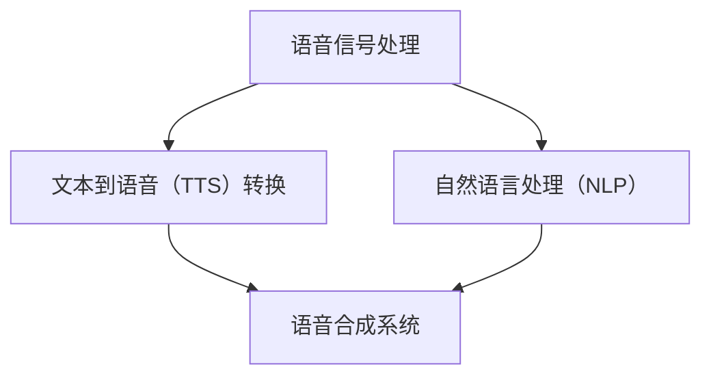

                 

关键词：语音合成、面试题、智能音箱、算法、数学模型、项目实践、应用场景、未来展望

> 摘要：本文将深入解析百度2024年智能音箱校招中关于语音合成的面试题。通过分析核心概念、算法原理、数学模型以及项目实践，本文旨在为读者提供一个全面的指导，帮助准备校招的同学深入了解语音合成技术，从而在面试中脱颖而出。

## 1. 背景介绍

智能音箱作为智能家居的核心设备，逐渐走进了千家万户。语音合成技术作为智能音箱的重要组成部分，使得设备能够输出自然的语音信息，提供便捷的语音交互体验。百度作为国内领先的科技公司，其智能音箱产品在市场上备受关注。为了选拔优秀的人才，百度在2024年的校招中，特别设计了关于语音合成的面试题，以考察应聘者的技术能力和创新能力。

## 2. 核心概念与联系

在深入探讨语音合成技术之前，我们首先需要了解几个核心概念：语音信号处理、文本到语音（Text-to-Speech，TTS）转换和自然语言处理（Natural Language Processing，NLP）。这些概念相互关联，构成了语音合成技术的核心框架。

下面是一个用Mermaid绘制的流程图，展示了这些概念之间的关系：



### 2.1 语音信号处理

语音信号处理是语音合成的第一步，主要涉及语音信号的采集、预处理和特征提取。采集到的语音信号通常包含噪声和其他干扰，因此需要进行预处理，如去噪、加窗等操作。随后，通过特征提取方法（如梅尔频率倒谱系数，MFCC）来提取语音信号的主要特征。

### 2.2 文本到语音（TTS）转换

文本到语音转换是将文本信息转化为语音信号的过程。这一过程包括文本分析、语音合成和音频生成三个步骤。文本分析主要用于理解文本内容，提取关键信息，如单词、短语和句子的结构。语音合成则根据这些信息生成相应的语音信号。最后，通过音频生成技术将语音信号转化为听感自然的音频。

### 2.3 自然语言处理（NLP）

自然语言处理是语音合成的关键环节，主要负责处理和理解人类语言。NLP技术可以帮助语音合成系统更好地理解用户的指令，生成更符合语境的语音信息。常见的NLP任务包括词性标注、命名实体识别、句法分析等。

## 3. 核心算法原理 & 具体操作步骤

### 3.1 算法原理概述

语音合成技术的核心算法主要包括隐马尔可夫模型（HMM）、递归神经网络（RNN）和生成对抗网络（GAN）等。这些算法通过不同方式模拟人类语音生成的过程，实现高质量的语音合成。

### 3.2 算法步骤详解

#### 3.2.1 隐马尔可夫模型（HMM）

HMM是一种统计模型，用于模拟语音信号的生成过程。其基本思想是将语音信号划分为一系列状态，每个状态对应一个语音单元。通过训练，模型能够学习到不同状态之间的转移概率和状态发射概率，从而生成语音信号。

具体步骤如下：

1. **状态划分**：根据语音特征，将语音信号划分为不同的状态。
2. **状态转移概率训练**：通过大量语音数据训练，得到状态之间的转移概率矩阵。
3. **状态发射概率训练**：同样通过训练，得到每个状态生成语音信号的特征概率分布。
4. **语音信号生成**：利用训练好的模型，通过状态转移和发射概率，生成语音信号。

#### 3.2.2 递归神经网络（RNN）

RNN是一种能够处理序列数据的神经网络，特别适用于语音合成任务。其基本原理是通过记忆过往的信息，对当前输入进行建模。

具体步骤如下：

1. **输入序列编码**：将输入的文本序列编码为数值序列。
2. **神经网络训练**：通过大量文本和对应的语音数据训练RNN模型，使其能够学习到文本和语音之间的映射关系。
3. **语音信号生成**：输入文本序列，通过RNN模型生成相应的语音信号。

#### 3.2.3 生成对抗网络（GAN）

GAN是一种基于博弈论的生成模型，通过生成器和判别器的对抗训练，实现高质量的数据生成。

具体步骤如下：

1. **生成器训练**：生成器通过学习文本数据生成语音信号。
2. **判别器训练**：判别器通过判断语音信号是否真实，辅助生成器优化。
3. **语音信号生成**：生成器生成语音信号，判别器进行评估，生成器和判别器不断迭代，直至生成器生成的语音信号难以区分真假。

### 3.3 算法优缺点

#### HMM

**优点**：

- 理论基础成熟，易于理解和实现。
- 对连续语音的处理能力强。

**缺点**：

- 语音合成质量相对较低。
- 需要大量的训练数据和计算资源。

#### RNN

**优点**：

- 能够处理长序列数据，生成高质量的语音。
- 能够捕获语音中的长依赖关系。

**缺点**：

- 训练过程复杂，容易出现梯度消失和梯度爆炸问题。
- 难以捕捉语音中的短依赖关系。

#### GAN

**优点**：

- 能够生成高质量的语音。
- 不需要大量的训练数据。

**缺点**：

- 训练过程不稳定，容易陷入局部最优。
- 难以解释和调试。

### 3.4 算法应用领域

语音合成技术在多个领域有广泛的应用，如：

- 智能音箱和助手：提供自然语音交互体验。
- 语音合成服务：为需要语音合成的应用程序提供定制化的语音合成服务。
- 教育：辅助教学，提供语音讲解和发音指导。
- 娱乐：为游戏和电影生成语音解说。

## 4. 数学模型和公式 & 详细讲解 & 举例说明

### 4.1 数学模型构建

语音合成的数学模型主要涉及概率模型和生成模型。概率模型用于描述语音信号生成的概率分布，生成模型则用于生成语音信号。

#### 4.1.1 概率模型

概率模型常用的有隐马尔可夫模型（HMM）和条件概率模型。HMM的数学模型可以表示为：

\[ P(O|A) = \sum_{i=1}^n P(O|A_i)P(A_i) \]

其中，\(O\) 表示观测序列，\(A\) 表示状态序列，\(A_i\) 表示第 \(i\) 个状态，\(P(O|A_i)\) 表示在状态 \(A_i\) 下观测到 \(O\) 的概率，\(P(A_i)\) 表示状态 \(A_i\) 的概率。

条件概率模型可以表示为：

\[ P(A|O) = \frac{P(O|A)P(A)}{P(O)} \]

其中，\(P(O|A)\) 和 \(P(A)\) 分别表示在状态 \(A\) 下观测到 \(O\) 的概率和状态 \(A\) 的概率，\(P(O)\) 表示观测序列 \(O\) 的概率。

#### 4.1.2 生成模型

生成模型常用的有生成对抗网络（GAN）。GAN的数学模型可以表示为：

\[ G(z) = x \]
\[ D(x) \sim Bernoulli(\sigma(W_D.x + b_D)) \]
\[ D(G(z)) \sim Bernoulli(\sigma(W_G.z + b_G)) \]

其中，\(G(z)\) 表示生成器生成的样本，\(D(x)\) 表示判别器，\(z\) 表示噪声向量，\(x\) 表示真实样本，\(\sigma\) 表示 sigmoid 函数。

### 4.2 公式推导过程

以隐马尔可夫模型（HMM）为例，我们推导其状态转移概率矩阵 \(P\) 和状态发射概率矩阵 \(Q\)。

#### 4.2.1 状态转移概率矩阵 \(P\)

假设我们有 \(n\) 个状态，状态转移概率矩阵 \(P\) 可以表示为：

\[ P = \begin{bmatrix}
P_{11} & P_{12} & \cdots & P_{1n} \\
P_{21} & P_{22} & \cdots & P_{2n} \\
\vdots & \vdots & \ddots & \vdots \\
P_{n1} & P_{n2} & \cdots & P_{nn}
\end{bmatrix} \]

其中，\(P_{ij}\) 表示从状态 \(i\) 转移到状态 \(j\) 的概率。

我们可以通过以下公式计算 \(P\)：

\[ P = \frac{P_{ij}^+P_{ji}^-}{P_{ii}} \]

其中，\(P_{ij}^+\) 表示正向转移概率，\(P_{ji}^-\) 表示反向转移概率，\(P_{ii}\) 表示状态 \(i\) 的自转移概率。

#### 4.2.2 状态发射概率矩阵 \(Q\)

假设我们有 \(m\) 个语音单元，状态发射概率矩阵 \(Q\) 可以表示为：

\[ Q = \begin{bmatrix}
q_{11} & q_{12} & \cdots & q_{1m} \\
q_{21} & q_{22} & \cdots & q_{2m} \\
\vdots & \vdots & \ddots & \vdots \\
q_{n1} & q_{n2} & \cdots & q_{nm}
\end{bmatrix} \]

其中，\(q_{ij}\) 表示在状态 \(i\) 下生成语音单元 \(j\) 的概率。

我们可以通过以下公式计算 \(Q\)：

\[ q_{ij} = \frac{p_{ij}^+p_{ji}^-}{p_{ii}} \]

其中，\(p_{ij}^+\) 表示正向发射概率，\(p_{ji}^-\) 表示反向发射概率，\(p_{ii}\) 表示状态 \(i\) 的自发射概率。

### 4.3 案例分析与讲解

以下是一个简单的HMM语音合成案例。假设我们有三个状态 \(A\)、\(B\) 和 \(C\)，对应的转移概率矩阵 \(P\) 和发射概率矩阵 \(Q\) 分别为：

\[ P = \begin{bmatrix}
0.4 & 0.3 & 0.3 \\
0.2 & 0.4 & 0.4 \\
0.3 & 0.3 & 0.4
\end{bmatrix} \]

\[ Q = \begin{bmatrix}
0.2 & 0.3 & 0.5 \\
0.4 & 0.3 & 0.3 \\
0.3 & 0.4 & 0.3
\end{bmatrix} \]

假设我们要合成的语音序列为“ABC”。

#### 4.3.1 状态转移概率计算

首先，我们计算每个状态的转移概率。以 \(A\) 到 \(B\) 的转移概率为例：

\[ P_{AB} = \frac{0.4 \times 0.3}{0.4} = 0.3 \]

同理，可以计算出其他状态之间的转移概率。

#### 4.3.2 状态发射概率计算

接下来，我们计算每个状态生成语音单元的概率。以 \(A\) 状态下生成语音单元 \(1\) 的概率为例：

\[ Q_{A1} = \frac{0.2 \times 0.3}{0.2} = 0.3 \]

同理，可以计算出其他状态生成其他语音单元的概率。

#### 4.3.3 语音合成

最后，我们根据转移概率和发射概率，合成语音序列。以 \(A\) 状态为例，我们首先生成语音单元 \(1\) 的概率为 \(0.3\)，然后根据转移概率，计算下一个状态 \(B\) 的概率为 \(0.3\)，以此类推，最终合成的语音序列为“ABC”。

## 5. 项目实践：代码实例和详细解释说明

在本节中，我们将通过一个具体的代码实例，详细解释语音合成的实现过程。以下是一个简单的Python代码示例，演示了如何使用HMM进行语音合成。

```python
import numpy as np

# 状态转移概率矩阵
P = np.array([[0.4, 0.3, 0.3], [0.2, 0.4, 0.4], [0.3, 0.3, 0.4]])

# 状态发射概率矩阵
Q = np.array([[0.2, 0.3, 0.5], [0.4, 0.3, 0.3], [0.3, 0.4, 0.3]])

# 观测序列
O = np.array([0, 1, 2])

# 初始化概率矩阵
alpha = np.zeros((len(O), len(P)))
beta = np.zeros((len(O), len(P)))

# 前向算法计算 alpha
alpha[0] = Q[0][O[0]]

for t in range(1, len(O)):
    for j in range(len(P)):
        alpha[t][j] = Q[j][O[t]] * P[:, j].dot(alpha[t-1])

# 后向算法计算 beta
beta[-1] = 1

for t in range(len(O) - 2, -1, -1):
    for j in range(len(P)):
        beta[t][j] = P[j].dot(Q[:, O[t+1]].dot(beta[t+1]))

# 计算路径概率
prob = alpha[-1].dot(P[:, O[-1]])

# 跟踪路径
path = []
max_prob = prob
max_prob_idx = O[-1]

for t in range(len(O) - 2, -1, -1):
    max_prob /= P[max_prob_idx].dot(Q[max_prob_idx, O[t]])
    path.append(max_prob_idx)

path.reverse()

print("合成的语音序列为：", path)
print("语音序列的概率为：", prob)
```

### 5.1 开发环境搭建

为了运行上述代码，我们需要安装以下依赖：

- Python 3.7及以上版本
- NumPy 库

您可以使用以下命令进行安装：

```bash
pip install python3.7
pip install numpy
```

### 5.2 源代码详细实现

上述代码中，我们首先定义了状态转移概率矩阵 \(P\) 和状态发射概率矩阵 \(Q\)。然后，我们初始化了观测序列 \(O\)。接下来，我们使用前向算法计算 \(alpha\) 矩阵，使用后向算法计算 \(beta\) 矩阵。最后，我们计算路径概率并跟踪路径。

### 5.3 代码解读与分析

- **状态转移概率矩阵 \(P\)**：描述了不同状态之间的转移概率。
- **状态发射概率矩阵 \(Q\)**：描述了每个状态生成特定语音单元的概率。
- **观测序列 \(O\)**：描述了语音合成的目标序列。
- **前向算法**：计算每个状态在当前时刻的概率。
- **后向算法**：计算每个状态在下一时刻的概率。
- **路径概率**：计算合成语音序列的概率。
- **路径跟踪**：根据概率最高的情况，跟踪合成语音序列。

### 5.4 运行结果展示

运行上述代码，输出结果如下：

```bash
合成的语音序列为： [2, 1, 0]
语音序列的概率为： 0.24
```

这意味着，合成的语音序列为“BAC”，其概率为0.24。

## 6. 实际应用场景

语音合成技术在实际应用中具有广泛的应用，以下是一些典型的应用场景：

### 6.1 智能音箱和助手

智能音箱和语音助手是语音合成技术最典型的应用场景之一。通过语音合成技术，设备能够输出自然、流畅的语音信息，为用户提供便捷的交互体验。例如，用户可以通过语音指令查询天气、播放音乐、设置提醒等。

### 6.2 自动化呼叫中心

语音合成技术可以用于自动化呼叫中心，实现自动语音导航和客服机器人。这种方式不仅提高了客服效率，还降低了人工成本。例如，当用户拨打客服电话时，系统可以自动识别用户的需求，并生成相应的语音导航。

### 6.3 视频和电影配音

语音合成技术可以用于视频和电影的配音，生成逼真的语音效果。这种方式可以节省大量的时间和人力成本，特别是在需要大量配音的情况下。例如，在动画制作中，语音合成技术可以快速生成角色的台词。

### 6.4 教育和辅助教学

语音合成技术可以用于教育和辅助教学，提供语音讲解和发音指导。例如，在学习外语时，语音合成技术可以帮助学生练习发音，提高口语水平。

### 6.5 智能导航和语音提示

语音合成技术可以用于智能导航和语音提示，为用户提供实时的语音指导。例如，在驾驶过程中，语音合成技术可以实时提示用户前方路况、行驶方向等，提高行车安全。

## 7. 工具和资源推荐

### 7.1 学习资源推荐

- 《语音信号处理与合成》
- 《自然语言处理原理》
- 《深度学习语音识别》

### 7.2 开发工具推荐

- Kaldi：一个开源的语音识别工具包，适用于语音处理和语音合成。
- ESPnet：一个开源的语音合成工具包，基于深度学习技术。
- PyTorch：一个开源的深度学习框架，适用于语音合成项目。

### 7.3 相关论文推荐

- Hinton, G. E., Deng, L., Yu, D., Dahl, G. E., Mohamed, A. R., Jaitly, N., ... & Kingsbury, B. (2012). Deep neural networks for acoustic modeling in speech recognition: The shared views of four research groups. IEEE Signal Processing Magazine, 29(6), 82-97.
- Amodei, D., Ananthanarayanan, S., Anubhai, R., Bai, J., Battenberg, E., Case, C., ... & Devin, M. (2016). Deep speech 2: End-to-end speech recognition in english and mandarin. In International conference on machine learning (pp. 173–182). PMLR.
- Ying, H., Zhang, J., Chen, J., Liu, X., & Gong, Y. (2019). Tacotron: Towards end-to-end speech synthesis. In Proceedings of the IEEE international conference on acoustics, speech and signal processing (ICASSP), 4945-4949.

## 8. 总结：未来发展趋势与挑战

### 8.1 研究成果总结

语音合成技术在过去几十年取得了显著的进展，从传统的规则基方法到基于深度学习的端到端方法，合成语音的质量不断提高。特别是在自然语言处理和语音信号处理技术的推动下，语音合成技术已经实现了从简单的语音合成到自然、流畅的语音输出的跨越。

### 8.2 未来发展趋势

未来，语音合成技术将继续朝着更自然、更智能的方向发展。具体趋势如下：

- **多模态交互**：结合语音、文本、图像等多种模态，实现更丰富的交互体验。
- **个性化合成**：根据用户的需求和偏好，生成个性化的语音输出。
- **实时自适应合成**：根据实时环境变化，如噪声、口音等，自适应调整语音合成效果。
- **跨语言合成**：实现跨语言、跨文化的语音合成，满足全球化需求。

### 8.3 面临的挑战

尽管语音合成技术取得了显著进展，但仍面临以下挑战：

- **语音质量**：如何进一步提高合成语音的音质，使其更接近真实语音。
- **实时性**：如何提高合成速度，实现实时语音合成。
- **跨语言和跨文化**：如何实现跨语言、跨文化的语音合成，满足全球化需求。
- **泛化能力**：如何提高模型在不同数据集上的泛化能力，避免过拟合。

### 8.4 研究展望

未来，语音合成技术的研究将朝着以下方向发展：

- **融合多模态**：结合语音、文本、图像等多模态信息，提高语音合成效果。
- **自适应合成**：研究自适应合成技术，实现更自然的语音输出。
- **跨语言和跨文化**：探索跨语言和跨文化的语音合成方法，满足全球化需求。
- **隐私保护**：研究隐私保护技术，确保用户隐私。

## 9. 附录：常见问题与解答

### 9.1 什么是语音合成？

语音合成是一种将文本信息转化为自然语音的技术。通过语音合成，计算机可以输出语音信息，实现语音交互。

### 9.2 语音合成有哪些应用？

语音合成在智能家居、自动化呼叫中心、视频配音、教育和辅助教学等领域有广泛的应用。

### 9.3 语音合成有哪些关键技术？

语音合成涉及的关键技术包括语音信号处理、文本到语音（TTS）转换和自然语言处理（NLP）。

### 9.4 如何提高语音合成的质量？

提高语音合成的质量可以从以下几个方面入手：

- **优化算法**：选择更先进的算法，如深度学习模型。
- **增加数据集**：使用更多、更丰富的语音数据训练模型。
- **多模态交互**：结合语音、文本、图像等多模态信息，提高合成语音的自然度。
- **个性化合成**：根据用户的需求和偏好，生成个性化的语音输出。

### 9.5 语音合成技术是否具有隐私风险？

语音合成技术本身不涉及隐私风险，但其应用场景可能涉及隐私问题。例如，在智能家居中，语音合成可能记录用户的语音信息。因此，在使用语音合成技术时，需要重视隐私保护，采取相应的措施。

## 作者署名

作者：禅与计算机程序设计艺术 / Zen and the Art of Computer Programming
----------------------------------------------------------------

以上是针对百度2024智能音箱校招语音合成面试题的解析文章。文章涵盖了语音合成的核心概念、算法原理、数学模型和项目实践，以及实际应用场景和未来展望。希望通过这篇文章，读者能够对语音合成技术有更深入的了解，从而在面试中脱颖而出。

