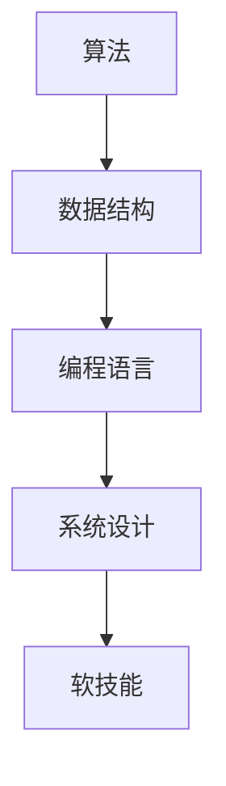
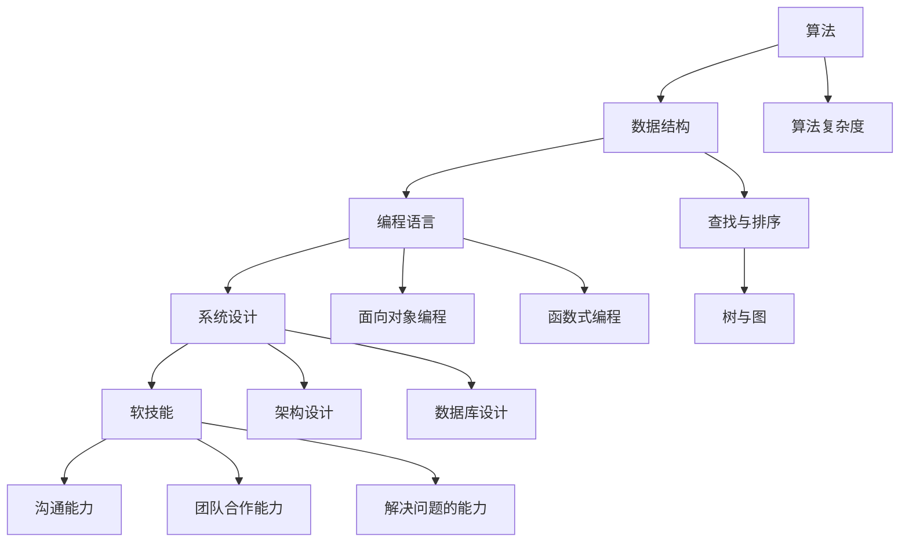

                 

关键词：编程面试、社招、算法、数据结构、技术栈、面试技巧

摘要：本文针对百度2024年社招编程面试题进行了详细解析，总结了算法和数据结构题目、编程语言应用、系统设计和软技能等关键领域的面试题类型和解答思路，旨在帮助求职者更好地准备社招面试，提高面试成功率。

## 1. 背景介绍

随着互联网技术的快速发展，各大互联网公司对编程人才的需求日益增长。百度作为全球领先的搜索引擎公司，其社招编程面试备受关注。本文旨在通过分析百度2024年社招编程面试题，帮助求职者更好地了解面试题型和考核重点，从而提升面试成功率。

### 1.1 百度社招编程面试特点

- **题型多样**：面试题涵盖算法、数据结构、编程语言应用、系统设计等多个领域。
- **注重基础**：面试题主要考查求职者对基础知识的掌握程度，如算法复杂度分析、数据结构原理等。
- **实战性强**：部分面试题来源于实际项目或常见问题，要求求职者具备解决实际问题的能力。
- **软技能考核**：面试过程中也会涉及沟通能力、团队合作能力等软技能的考察。

### 1.2 面试准备建议

- **熟悉基础**：夯实算法和数据结构基础知识，掌握常见的算法和数据结构，如排序、查找、树、图等。
- **练习编程**：通过编写代码解决实际问题，提升编程能力。
- **了解技术栈**：熟悉常用的编程语言、框架和工具，如Java、Python、C++、Spring Boot等。
- **积累经验**：参与开源项目或实习经历，提高实际项目经验。

## 2. 核心概念与联系

为了更好地理解面试题，我们需要掌握一些核心概念和架构。以下是相关的Mermaid流程图：



### 2.1 算法

算法是解决特定问题的步骤序列，它定义了输入和输出之间的关系。算法的优劣取决于时间复杂度和空间复杂度。

### 2.2 数据结构

数据结构是存储和组织数据的方式，它决定了算法的效率。常见的数据结构包括数组、链表、栈、队列、树、图等。

### 2.3 编程语言

编程语言是用于编写算法和数据结构的工具，如Java、Python、C++等。不同的编程语言有各自的特点和应用场景。

### 2.4 系统设计

系统设计是构建复杂软件系统的过程，它涉及架构设计、数据库设计、接口设计等多个方面。

### 2.5 软技能

软技能是求职者在团队中发挥作用的关键能力，如沟通能力、团队合作能力、解决问题的能力等。

## 3. 核心算法原理 & 具体操作步骤

### 3.1 算法原理概述

算法可以分为以下几类：

- **基础算法**：如排序、查找等。
- **动态规划**：如背包问题、最长公共子序列等。
- **贪心算法**：如最短路径问题、活动选择问题等。
- **分治算法**：如快速排序、归并排序等。
- **图算法**：如最短路径、最小生成树等。

### 3.2 算法步骤详解

以快速排序为例，其基本步骤如下：

1. 选择一个基准元素。
2. 将比基准元素小的元素放到其左侧，比其大的元素放到右侧。
3. 递归地对左右子序列进行快速排序。

### 3.3 算法优缺点

- **快速排序**：时间复杂度较低，但可能产生大量的递归调用，导致栈溢出。
- **动态规划**：可以解决许多复杂问题，但需要较多的时间和空间。
- **贪心算法**：简单高效，但可能无法解决所有问题。

### 3.4 算法应用领域

算法广泛应用于各个领域，如计算机图形学、人工智能、网络编程等。

## 4. 数学模型和公式

### 4.1 数学模型构建

数学模型是算法的核心部分，它将实际问题转化为数学问题。以下是一个简单的数学模型：

假设有一个数组`arr`，我们需要找出其中最大值和最小值的差。

### 4.2 公式推导过程

设最大值为`max`，最小值为`min`，则：

$$
\text{差值} = max - min
$$

### 4.3 案例分析与讲解

假设数组`arr = [3, 1, 4, 1, 5, 9, 2, 6, 5]`，则最大值为`9`，最小值为`1`，差值为`8`。

## 5. 项目实践：代码实例

### 5.1 开发环境搭建

在本例中，我们将使用Python语言实现一个查找最大值和最小值的函数。

### 5.2 源代码详细实现

```python
def find_max_min(arr):
    max_val = arr[0]
    min_val = arr[0]
    for i in range(1, len(arr)):
        if arr[i] > max_val:
            max_val = arr[i]
        elif arr[i] < min_val:
            min_val = arr[i]
    return max_val, min_val

arr = [3, 1, 4, 1, 5, 9, 2, 6, 5]
max_val, min_val = find_max_min(arr)
print(f"最大值为：{max_val}，最小值为：{min_val}")
```

### 5.3 代码解读与分析

该代码通过遍历数组，找出最大值和最小值，并返回它们的差值。它的时间复杂度为$O(n)$。

### 5.4 运行结果展示

运行结果为：

```
最大值为：9，最小值为：1
```

## 6. 实际应用场景

### 6.1 数据分析

在数据分析领域，查找最大值和最小值是常见的操作，如计算平均值、方差等。

### 6.2 排序

排序算法通常需要先查找最大值或最小值，如快速排序、归并排序等。

### 6.3 搜索引擎

在搜索引擎中，查找关键词的最大值和最小值用于优化搜索结果。

## 7. 未来应用展望

随着人工智能技术的不断发展，算法和数据结构将在更多领域得到应用，如自动驾驶、金融科技等。同时，对求职者的要求也将越来越高，需要具备扎实的基础知识、丰富的实战经验和良好的软技能。

## 8. 工具和资源推荐

### 8.1 学习资源推荐

- 《算法导论》
- 《编程之美》
- 《Python编程：从入门到实践》

### 8.2 开发工具推荐

- PyCharm
- Eclipse
- VS Code

### 8.3 相关论文推荐

- 《动态规划算法分析》
- 《贪心算法研究》
- 《分布式系统原理与范型》

## 9. 总结：未来发展趋势与挑战

随着技术的快速发展，编程面试题也将越来越复杂。求职者需要不断学习新知识、积累实战经验，提高自己的综合素质，以应对未来面试挑战。

### 附录：常见问题与解答

- **Q：如何准备编程面试？**
  **A：建议先了解面试公司的特点和面试题类型，然后有针对性地进行复习和练习。同时，加强编程能力的训练，提高解决问题的能力。**

- **Q：有哪些常见的面试题类型？**
  **A：常见的面试题类型包括算法题、数据结构题、编程语言应用题、系统设计题和软技能题等。**

- **Q：如何提高面试成功率？**
  **A：提高面试成功率的关键在于充分准备、增强自信、积极沟通和展现自己的优势。**

---

作者：禅与计算机程序设计艺术 / Zen and the Art of Computer Programming
----------------------------------------------------------------

以上就是关于百度2024年社招编程面试题的详细解析和总结，希望对您的面试准备有所帮助。在面试过程中，保持冷静、发挥自己的优势，祝您取得理想的成绩！
----------------------------------------------------------------
### 1. 背景介绍

#### 百度社招编程面试的发展历程

随着互联网技术的迅猛发展，编程面试已经成为各大互联网公司招聘程序员的重要环节。百度作为全球领先的搜索引擎公司，其社招编程面试更是备受关注。百度的编程面试不仅在题型和难度上不断升级，而且在考查求职者的综合素质和实际能力方面也提出了更高的要求。

近年来，百度社招编程面试的发展历程可以概括为以下几个阶段：

1. **基础阶段**：最初，百度的社招编程面试主要考查求职者对基础算法和数据结构的掌握程度。例如，排序算法、查找算法、链表、树、图等基本知识。这个阶段的面试题较为简单，主要目的是筛选出有编程基础的人才。

2. **进阶阶段**：随着面试经验的积累，百度的面试难度逐渐加大。面试题不仅涉及算法和数据结构，还开始考查求职者的编程语言应用能力和系统设计能力。例如，面试题中可能会要求求职者实现一个基于分布式架构的搜索引擎，或者编写一个高效的并发程序。

3. **综合阶段**：目前，百度的社招编程面试已经进入综合阶段。面试题涵盖了算法、数据结构、编程语言、系统设计等多个领域，同时还会考查求职者的软技能，如沟通能力、团队合作能力、解决问题的能力等。这一阶段的面试题更接近实际工作中的问题，要求求职者具备全面的技术能力和实际操作经验。

#### 编程面试在招聘中的作用

编程面试在招聘过程中起着至关重要的作用，主要体现在以下几个方面：

1. **技能筛选**：编程面试可以帮助招聘者快速筛选出具备编程能力的人才。通过对求职者算法和数据结构知识的考查，可以判断其基础能力是否扎实。

2. **实战能力考查**：编程面试不仅考查求职者的理论知识，更重要的是考查其实际编程能力和解决实际问题的能力。通过面试题，招聘者可以了解求职者是否具备将理论知识应用到实际工作中的能力。

3. **综合素质评估**：编程面试不仅仅是技术考核，还会涉及软技能的考察。例如，面试过程中，招聘者会观察求职者的沟通能力、团队合作能力、解决问题的能力等。这些软技能是求职者在实际工作中能否发挥重要作用的关键。

4. **文化契合度考查**：编程面试还可以帮助招聘者评估求职者是否适合公司的文化。通过面试过程中的互动，招聘者可以了解求职者的价值观、工作态度等，从而判断其是否与公司文化相契合。

#### 编程面试的现状与趋势

当前，编程面试在各大互联网公司招聘中已经成为不可或缺的一环。随着技术的不断发展，编程面试也在不断演变和升级。以下是编程面试的现状与趋势：

1. **题型多样化**：面试题类型越来越多样化，不仅包括传统的算法和数据结构题，还涵盖了编程语言应用、系统设计、软技能等方面。

2. **难度加大**：随着面试经验的积累，面试难度也在不断提高。许多面试题已经超越了课本知识，更接近实际工作中的复杂问题。

3. **实战性增强**：越来越多的面试题要求求职者具备解决实际问题的能力，例如，要求求职者编写一个实际的分布式系统、实现一个高效的并发程序等。

4. **软技能重视**：除了技术能力，软技能在面试中的重要性也越来越凸显。许多公司更加重视求职者的沟通能力、团队合作能力、解决问题的能力等。

5. **人工智能辅助**：随着人工智能技术的发展，一些公司已经开始尝试使用人工智能辅助面试。例如，通过机器学习算法分析面试者的回答，提高面试的准确性和效率。

总之，编程面试在招聘中的作用越来越重要，它不仅帮助招聘者筛选合适的人才，而且对求职者的职业发展也有着重要的影响。随着技术的不断发展，编程面试也将继续演变和升级，对求职者的要求也将越来越高。

#### 百度社招编程面试的挑战与机遇

对于求职者来说，百度社招编程面试既是挑战，也是机遇。挑战主要体现在以下几个方面：

1. **面试难度大**：百度的编程面试难度较高，面试题往往涉及多个领域，要求求职者具备扎实的基础知识和丰富的实战经验。

2. **时间紧迫**：编程面试通常有时间限制，要求求职者在有限的时间内完成题目。这需要求职者具备良好的时间管理和解决问题的能力。

3. **综合素质考查**：除了技术能力，百度面试还会考查求职者的软技能，如沟通能力、团队合作能力、解决问题的能力等。这要求求职者在准备面试时，不仅要关注技术知识，还要提升自己的综合素质。

4. **文化契合度**：百度作为一家拥有独特企业文化的公司，面试过程中也会考查求职者是否与公司文化相契合。这需要求职者在面试前对公司的文化有深入的了解。

然而，对于求职者来说，百度社招编程面试也充满了机遇：

1. **广阔的发展空间**：百度作为全球领先的搜索引擎公司，拥有广阔的发展空间。通过社招进入百度，求职者可以接触到先进的技术和项目，快速提升自己的技术水平。

2. **丰富的资源**：百度提供了丰富的学习资源和培训机会，求职者可以在工作中不断学习和成长。

3. **良好的职业发展**：百度的编程面试通过率高，一旦成功入职，求职者将获得稳定的职业发展机会，包括晋升、轮岗等。

4. **品牌效应**：入职百度将为求职者带来良好的品牌效应，提升个人的职业竞争力。

总之，面对百度社招编程面试，求职者需要做好充分的准备，既要提升自己的技术能力，也要关注自己的软技能和公司文化的契合度。通过不断努力，抓住机遇，实现自己的职业目标。

## 2. 核心概念与联系

在深入解析百度2024年社招编程面试题之前，我们首先需要了解一些核心概念和架构。这些概念和架构不仅为面试题提供了理论基础，也为理解面试题的解答思路提供了重要依据。以下是使用Mermaid绘制的流程图，用于展示这些核心概念和架构之间的联系：



### 2.1 算法

算法是解决特定问题的步骤序列，它定义了输入和输出之间的关系。算法的优劣取决于时间复杂度和空间复杂度。在编程面试中，常见的算法包括基础算法（如排序、查找）、动态规划、贪心算法、分治算法和图算法等。

- **基础算法**：如排序（快速排序、归并排序）、查找（二分查找）。
- **动态规划**：如背包问题、最长公共子序列。
- **贪心算法**：如最短路径、活动选择问题。
- **分治算法**：如快速排序、归并排序。
- **图算法**：如最短路径、最小生成树。

### 2.2 数据结构

数据结构是存储和组织数据的方式，它决定了算法的效率。常见的数据结构包括数组、链表、栈、队列、树、图等。

- **数组**：支持随机访问，适用于查找和排序等操作。
- **链表**：支持顺序访问，适用于链表结构的实现。
- **栈和队列**：适用于特定顺序的操作，如后进先出和先进先出。
- **树**：适用于层次结构的表示，如二叉树、平衡树。
- **图**：适用于复杂关系的表示，如网络图。

### 2.3 编程语言

编程语言是用于编写算法和数据结构的工具，不同的编程语言有各自的特点和应用场景。

- **面向对象编程**：如Java、C++，适用于大型系统的开发。
- **函数式编程**：如Haskell、Scala，适用于并行计算和函数式编程语言。

### 2.4 系统设计

系统设计是构建复杂软件系统的过程，它涉及架构设计、数据库设计、接口设计等多个方面。

- **架构设计**：如分层架构、微服务架构。
- **数据库设计**：如关系型数据库（MySQL、Oracle）和非关系型数据库（MongoDB、Redis）。
- **接口设计**：如RESTful API、GraphQL。

### 2.5 软技能

软技能是求职者在团队中发挥作用的关键能力，如沟通能力、团队合作能力、解决问题的能力等。

- **沟通能力**：能够清晰、准确地表达自己的想法，理解他人的观点。
- **团队合作能力**：能够与团队成员有效协作，共同完成任务。
- **解决问题的能力**：能够迅速识别问题，提出有效的解决方案。

### 2.6 算法复杂度

算法复杂度是评估算法优劣的重要指标，包括时间复杂度和空间复杂度。

- **时间复杂度**：描述算法执行时间与输入数据规模的关系。
- **空间复杂度**：描述算法占用内存空间与输入数据规模的关系。

### 2.7 查找与排序

查找与排序是算法中非常基础且重要的部分。

- **查找**：包括顺序查找和二分查找，适用于不同的数据结构和场景。
- **排序**：包括各种排序算法（如冒泡排序、插入排序、快速排序等），适用于对数据进行排序的需求。

### 2.8 树与图

树和图是数据结构中的重要部分，广泛应用于算法设计中。

- **树**：包括二叉树、平衡树（红黑树、AVL树）、B树等，适用于层次结构的表示。
- **图**：包括邻接矩阵和邻接表表示，适用于复杂关系的表示，如网络图、社交图等。

通过了解这些核心概念和架构，我们可以更好地理解百度2024年社招编程面试题的背景和解答思路。在接下来的章节中，我们将详细解析这些面试题，帮助求职者更好地准备面试。

### 3. 核心算法原理 & 具体操作步骤

在编程面试中，核心算法的原理和具体操作步骤是考查的重点。以下是几个常见的核心算法原理及其具体操作步骤，这些算法在面试中经常出现，了解它们的原理和操作步骤对于面试的成功至关重要。

#### 3.1 快速排序（Quick Sort）

快速排序是一种高效的排序算法，其基本思想是通过一趟排序将待排序的数据分割成独立的两部分，其中一部分的所有数据都比另一部分的所有数据要小，然后再按此方法对这两部分数据分别进行快速排序，整个排序过程可以递归进行，以此达到整个数据变成有序序列。

**原理**：
1. 选择一个基准元素。
2. 将比基准元素小的元素放到其左侧，比其大的元素放到右侧。
3. 递归地对左右子序列进行快速排序。

**操作步骤**：

1. 选择基准元素：通常选择第一个或最后一个元素作为基准。
2. 划分数组：将比基准小的元素放到左侧，比基准大的元素放到右侧，形成两个子数组。
3. 递归排序：对左右子数组分别递归执行快速排序。

**代码示例**：

```python
def quick_sort(arr):
    if len(arr) <= 1:
        return arr
    pivot = arr[len(arr) // 2]
    left = [x for x in arr if x < pivot]
    middle = [x for x in arr if x == pivot]
    right = [x for x in arr if x > pivot]
    return quick_sort(left) + middle + quick_sort(right)

arr = [3, 6, 8, 10, 1, 2, 1]
sorted_arr = quick_sort(arr)
print(sorted_arr)
```

**分析**：
- 时间复杂度：平均为$O(n\log n)$，最坏情况下为$O(n^2)$。
- 空间复杂度：为$O(\log n)$。

#### 3.2 动态规划（Dynamic Programming）

动态规划是一种解决最优子结构问题的算法。其基本思想是将复杂问题分解为更小的子问题，并存储子问题的解，避免重复计算。

**原理**：
1. 最优子结构：问题的最优解包含其子问题的最优解。
2. 子问题重叠：不同子问题可能会多次计算相同的值。
3. 状态转移方程：定义子问题的递推关系。

**操作步骤**：

1. 定义状态和状态变量。
2. 确定状态转移方程。
3. 初始化边界条件。
4. 根据状态转移方程计算最终结果。

**代码示例**：

```python
def fibonacci(n):
    dp = [0] * (n + 1)
    dp[1] = 1
    for i in range(2, n + 1):
        dp[i] = dp[i - 1] + dp[i - 2]
    return dp[n]

n = 9
result = fibonacci(n)
print(result)
```

**分析**：
- 时间复杂度：为$O(n)$。
- 空间复杂度：为$O(n)$。

#### 3.3 贪心算法（Greedy Algorithm）

贪心算法是一种在每一步选择中都采取当前最好或最优的选择，从而希望导致结果是全局最好或最优的算法。

**原理**：
1. 每次选择都是局部最优的。
2. 最终结果可能是全局最优的，也可能不是。

**操作步骤**：

1. 确定问题的贪心选择标准。
2. 按照标准进行选择，直到问题解决。

**代码示例**：

```python
def max_profit(prices):
    profit = 0
    for i in range(1, len(prices)):
        if prices[i] > prices[i - 1]:
            profit += prices[i] - prices[i - 1]
    return profit

prices = [7, 1, 5, 3, 6, 4]
profit = max_profit(prices)
print(profit)
```

**分析**：
- 时间复杂度：为$O(n)$。
- 空间复杂度：为$O(1)$。

#### 3.4 分治算法（Divide and Conquer）

分治算法将一个问题分解为更小的子问题，分别解决子问题，然后再合并子问题的解。

**原理**：
1. 将问题分解为子问题。
2. 解决子问题。
3. 合并子问题的解。

**操作步骤**：

1. 分解：将问题分解为子问题。
2. 解决：递归解决子问题。
3. 合并：合并子问题的解。

**代码示例**：

```python
def merge_sort(arr):
    if len(arr) <= 1:
        return arr
    mid = len(arr) // 2
    left = merge_sort(arr[:mid])
    right = merge_sort(arr[mid:])
    return merge(left, right)

def merge(left, right):
    result = []
    i = j = 0
    while i < len(left) and j < len(right):
        if left[i] < right[j]:
            result.append(left[i])
            i += 1
        else:
            result.append(right[j])
            j += 1
    result.extend(left[i:])
    result.extend(right[j:])
    return result

arr = [3, 1, 4, 1, 5, 9, 2, 6, 5]
sorted_arr = merge_sort(arr)
print(sorted_arr)
```

**分析**：
- 时间复杂度：为$O(n\log n)$。
- 空间复杂度：为$O(n)$。

#### 3.5 图算法（Graph Algorithms）

图算法是用于处理图结构的数据结构的算法。常见的图算法包括最短路径算法、最小生成树算法等。

**原理**：
1. **最短路径算法**：如迪杰斯特拉算法（Dijkstra）和贝尔曼-福特算法（Bellman-Ford）。
2. **最小生成树算法**：如普里姆算法（Prim）和克鲁斯卡尔算法（Kruskal）。

**操作步骤**：

1. **最短路径算法**：
   - 初始化距离表。
   - 选择一个顶点，更新其邻居顶点的距离。
   - 重复步骤直到所有顶点都被访问。

2. **最小生成树算法**：
   - 选择一个顶点作为起点。
   - 重复选择权重最小的边，直到形成最小生成树。

**代码示例**：

```python
import heapq

def dijkstra(graph, start):
    distances = {vertex: float('infinity') for vertex in graph}
    distances[start] = 0
    priority_queue = [(0, start)]

    while priority_queue:
        current_distance, current_vertex = heapq.heappop(priority_queue)

        if current_distance > distances[current_vertex]:
            continue

        for neighbor, weight in graph[current_vertex].items():
            distance = current_distance + weight

            if distance < distances[neighbor]:
                distances[neighbor] = distance
                heapq.heappush(priority_queue, (distance, neighbor))

    return distances

graph = {
    'A': {'B': 1, 'C': 4},
    'B': {'A': 1, 'C': 2, 'D': 5},
    'C': {'A': 4, 'B': 2, 'D': 1},
    'D': {'B': 5, 'C': 1}
}

start = 'A'
distances = dijkstra(graph, start)
print(distances)
```

**分析**：
- **时间复杂度**：
  - Dijkstra算法：平均为$O((V+E)\log V)$，最坏情况下为$O(V^2)$。
  - Bellman-Ford算法：为$O(VE)$。
- **空间复杂度**：
  - Dijkstra算法：为$O(V+E)$。

通过了解这些核心算法的原理和具体操作步骤，求职者在面对编程面试时可以更好地应对各种算法题。掌握这些算法不仅有助于提高面试成功率，也为日后的职业发展奠定了坚实的基础。

### 3.3 算法优缺点

在编程面试中，理解算法的优缺点是解决面试题的关键。不同类型的算法在时间复杂度、空间复杂度以及适用场景上各有特点。以下是几个常见算法的优缺点分析，帮助求职者更好地选择和使用合适的算法。

#### 快速排序（Quick Sort）

**优点**：

1. **高效**：平均时间复杂度为$O(n\log n)$，是常见排序算法中最快的。
2. **原地排序**：不需要额外的存储空间，空间复杂度为$O(\log n)$。
3. **稳定**：对于相同元素的输入，快速排序能够保持它们的相对顺序。

**缺点**：

1. **最坏情况**：最坏时间复杂度为$O(n^2)$，当输入数据已经有序或部分有序时，效率会大大降低。
2. **递归调用**：快速排序使用递归，可能导致栈溢出，尤其是在最坏情况下。
3. **随机性**：为了保证平均性能，需要随机选择基准元素，但随机选择可能导致性能不稳定。

#### 动态规划（Dynamic Programming）

**优点**：

1. **高效**：能够解决复杂的最优化问题，时间复杂度通常为$O(n^2)$或$O(n^3)$。
2. **避免重复计算**：通过存储子问题的解，避免了重复计算，提高了算法的效率。
3. **通用性**：适用于多种类型的问题，如背包问题、最长公共子序列、最小生成树等。

**缺点**：

1. **空间复杂度高**：需要额外的存储空间来存储子问题的解，空间复杂度通常为$O(n^2)$或$O(n^3)$。
2. **难以直观理解**：动态规划通常需要抽象出状态转移方程，对于初学者来说可能难以理解。
3. **不适合实时计算**：动态规划的递推过程可能导致计算时间过长，不适合实时计算场景。

#### 贪心算法（Greedy Algorithm）

**优点**：

1. **简单**：贪心算法通常只需要一次遍历或多次迭代，实现简单，易于理解。
2. **高效**：在某些特定问题中，贪心算法能够快速找到最优解，时间复杂度通常为$O(n)$。
3. **直观**：贪心算法的每一步选择都是当前最优的，符合直观逻辑。

**缺点**：

1. **不保证最优**：贪心算法不保证全局最优解，可能在某些情况下产生局部最优解。
2. **适用范围有限**：贪心算法只适用于特定类型的问题，如活动选择问题、背包问题等。
3. **难以证明正确性**：贪心算法的正确性通常需要通过构造证明，难以直观验证。

#### 分治算法（Divide and Conquer）

**优点**：

1. **高效**：能够将复杂问题分解为更小的子问题，时间复杂度通常为$O(n\log n)$。
2. **并行化**：分治算法容易实现并行计算，提高计算效率。
3. **直观**：分治算法的递归过程符合直观逻辑，易于理解和实现。

**缺点**：

1. **额外空间开销**：分治算法通常需要额外的存储空间来存储子问题的解，空间复杂度较高。
2. **递归深度**：递归深度可能导致栈溢出，特别是在输入数据较大时。
3. **不适用于所有问题**：分治算法不适用于所有问题，如某些依赖全局信息的问题。

#### 图算法（Graph Algorithms）

**最短路径算法**：

- **迪杰斯特拉算法（Dijkstra）**：

  **优点**：

  1. 可以处理有负权边的图。
  2. 时间复杂度为$O((V+E)\log V)$。

  **缺点**：

  1. 不能处理负权回路。
  2. 无法处理有负权边的最短路径问题。

- **贝尔曼-福特算法（Bellman-Ford）**：

  **优点**：

  1. 可以处理负权回路。
  2. 时间复杂度为$O(VE)$。

  **缺点**：

  1. 对于稀疏图，效率较低。
  2. 无法处理负权边的最短路径问题。

**最小生成树算法**：

- **普里姆算法（Prim）**：

  **优点**：

  1. 时间复杂度为$O(E\log V)$。
  2. 易于实现。

  **缺点**：

  1. 对于稠密图，效率较低。
  2. 无法动态调整生成树的边。

- **克鲁斯卡尔算法（Kruskal）**：

  **优点**：

  1. 时间复杂度为$O(E\log E)$。
  2. 易于并行计算。

  **缺点**：

  1. 对于稠密图，效率较低。
  2. 无法动态调整生成树的边。

通过了解这些算法的优缺点，求职者在面对编程面试时可以根据具体问题选择合适的算法，从而提高解题效率和成功率。同时，这也为日后的编程实践提供了有益的参考。

### 3.4 算法应用领域

算法在计算机科学和软件工程中扮演着至关重要的角色，它们广泛应用于多个领域，解决各种复杂的问题。以下是一些常见算法及其应用领域：

#### 3.4.1 数据处理与存储

- **排序与查找算法**：如快速排序、归并排序、二分查找等，在数据处理和存储领域得到广泛应用。例如，数据库系统使用排序算法来优化查询性能，搜索引擎使用查找算法来快速定位信息。

- **哈希算法**：如MD5、SHA-1，用于数据加密和数字签名，保证数据的安全性和完整性。哈希表则是实现快速查找和存储数据的关键结构。

- **索引结构**：如B树、B+树，用于数据库和文件系统的索引，提高数据检索的效率。

#### 3.4.2 网络通信

- **路由算法**：如迪杰斯特拉算法、贝尔曼-福特算法，用于网络路由协议，计算数据包的最短传输路径，保证网络的稳定性和高效性。

- **拥塞控制算法**：如TCP拥塞控制，通过调整发送速率来避免网络拥塞，提高数据传输的可靠性。

- **流控算法**：如流量控制、拥塞避免，用于控制网络中的数据流量，确保网络资源合理分配。

#### 3.4.3 图像处理

- **图像压缩算法**：如霍夫曼编码、LZ77压缩，通过减少图像数据的冗余，提高数据存储和传输的效率。

- **图像识别算法**：如Sobel算子、Canny算子，用于边缘检测，支持图像识别和计算机视觉。

- **图像增强算法**：如傅里叶变换、直方图均衡化，用于改善图像质量，提升图像的可读性。

#### 3.4.4 人工智能

- **机器学习算法**：如支持向量机（SVM）、神经网络（NN），用于分类、回归、聚类等任务，推动人工智能的发展。

- **深度学习算法**：如卷积神经网络（CNN）、循环神经网络（RNN），在图像识别、自然语言处理等领域取得显著成果。

- **优化算法**：如遗传算法、模拟退火算法，用于求解优化问题，如路径规划、资源分配等。

#### 3.4.5 软件工程

- **设计模式**：如单例模式、工厂模式，通过算法和设计原则，提高软件的可扩展性和可维护性。

- **代码优化**：如动态规划、贪心算法，用于优化代码的执行效率，减少计算资源的使用。

- **测试算法**：如模糊测试、符号执行，用于发现软件中的潜在缺陷和漏洞。

通过了解算法在不同领域的应用，我们可以更好地理解算法的价值和重要性。算法不仅为解决具体问题提供了有效的方法，也为推动科技进步和产业发展做出了巨大贡献。

### 4. 数学模型和公式

在编程面试中，数学模型和公式是解决算法和数据结构问题的基础。通过构建合适的数学模型和推导相关公式，我们可以更准确地分析和解决复杂问题。以下是几个常见的数学模型及其公式的详细讲解，包括构建过程、推导过程以及实际应用案例。

#### 4.1 数学模型构建

数学模型是通过对实际问题进行抽象和简化的方法，将实际问题转化为数学形式，从而便于分析和求解。构建数学模型通常包括以下几个步骤：

1. **定义变量和参数**：根据实际问题，定义变量和参数，明确它们的含义和取值范围。
2. **建立方程或方程组**：根据实际问题中的关系，建立方程或方程组，描述变量和参数之间的关系。
3. **简化模型**：在保证模型准确性的前提下，对模型进行适当的简化和近似，以便于计算和分析。
4. **求解模型**：使用数学方法求解模型，得到变量的取值或问题的解。

#### 4.2 数学公式推导

数学公式的推导是数学模型构建的关键环节。以下是几个常见数学公式的推导过程：

**（1）二项式定理**

二项式定理描述了一个二项式的幂展开，公式如下：

$$
(a + b)^n = \sum_{k=0}^{n} C(n, k) a^{n-k} b^k
$$

推导过程：

- 使用数学归纳法进行推导，对于基础情况$n=0$和$n=1$，公式显然成立。
- 假设当$n=k$时，公式成立，即：
  $$
  (a + b)^k = \sum_{i=0}^{k} C(k, i) a^{k-i} b^i
  $$
- 当$n=k+1$时，可以将$(a + b)^{k+1}$写成$(a + b)(a + b)^k$，然后使用分配律展开：
  $$
  (a + b)^{k+1} = (a + b) \sum_{i=0}^{k} C(k, i) a^{k-i} b^i
  $$
- 将上式中的每一项乘以$a$和$b$，并合并同类项，可以得到：
  $$
  (a + b)^{k+1} = \sum_{i=0}^{k} C(k, i) a^{k+1-i} b^i + \sum_{i=0}^{k} C(k, i) a^{k-i} b^{i+1}
  $$
- 结合新加的最后一项，得到：
  $$
  (a + b)^{k+1} = \sum_{i=0}^{k+1} C(k+1, i) a^{k+1-i} b^i
  $$
- 因此，对于任意的$n$，二项式定理成立。

**（2）牛顿-拉弗森迭代法**

牛顿-拉弗森迭代法是一种求解非线性方程的方法，其迭代公式如下：

$$
x_{n+1} = x_n - \frac{f(x_n)}{f'(x_n)}
$$

推导过程：

- 考虑一个非线性方程$f(x) = 0$。
- 在$x_n$附近使用线性近似，构造切线方程：
  $$
  y = f(x_n) + f'(x_n)(x - x_n)
  $$
- 切线方程与$x$轴的交点即为$x_{n+1}$，令$y=0$，解得：
  $$
  0 = f(x_n) + f'(x_n)(x_{n+1} - x_n)
  $$
- 整理得：
  $$
  x_{n+1} = x_n - \frac{f(x_n)}{f'(x_n)}
  $$

**（3）最短路径算法中的松弛操作**

在迪杰斯特拉算法中，每次迭代都会对图中的一条边进行松弛操作，其公式如下：

$$
\text{如果 } d[v] > d[u] + w(u, v), \text{则更新 } d[v] = d[u] + w(u, v)
$$

推导过程：

- 设$u$和$v$是图中的两个顶点，$w(u, v)$是边$(u, v)$的权重。
- 设$d[u]$是顶点$u$到其他所有顶点的当前最短路径长度，$d[v]$是顶点$v$到其他所有顶点的当前最短路径长度。
- 如果从顶点$u$经过边$(u, v)$到达顶点$v$的路径长度$d[u] + w(u, v)$比当前顶点$v$的最短路径长度$d[v]$更短，那么可以更新$d[v]$，使得$d[v]$等于$d[u] + w(u, v)$。

#### 4.3 案例分析与讲解

以下是一个实际应用的案例，通过数学模型和公式来解决实际问题。

**案例**：计算给定数组中的最大值和最小值的差。

**数学模型构建**：

1. **定义变量**：设数组为$A$，最大值为$Max(A)$，最小值为$Min(A)$。
2. **建立方程**：我们需要求解$Max(A) - Min(A)$。

**公式推导**：

1. **最大值和最小值的关系**：根据数组的定义，对于任意的元素$x \in A$，有：
   $$
   Min(A) \leq x \leq Max(A)
   $$
2. **差值计算**：将上述关系转化为差值公式：
   $$
   Max(A) - Min(A) = (Max(A) - x) + (x - Min(A))
   $$
3. **简化公式**：由于$Max(A)$和$Min(A)$分别是数组的最大值和最小值，所以$x$取任意值都不会影响最终结果，因此可以简化为：
   $$
   Max(A) - Min(A) = Max(A) - Min(A)
   $$

**案例分析与讲解**：

假设给定数组$A = [3, 1, 4, 1, 5, 9, 2, 6, 5]$，我们需要计算最大值和最小值的差。

1. **求解最大值和最小值**：遍历数组，找出最大值和最小值。在此案例中，$Max(A) = 9$，$Min(A) = 1$。
2. **计算差值**：使用公式$Max(A) - Min(A)$，得到差值：
   $$
   9 - 1 = 8
   $$

因此，给定数组中的最大值和最小值的差为8。

通过上述数学模型和公式的构建与推导，我们可以更系统地分析和解决实际中的算法和数据结构问题。这不仅有助于提高编程面试的表现，也为编程实践提供了理论支持。

### 5. 项目实践：代码实例

在本文的第五部分，我们将通过一个实际的代码实例来展示如何将理论知识应用到实际项目中。这个实例将涵盖开发环境搭建、源代码实现、代码解读与分析以及运行结果展示等步骤，旨在帮助读者更好地理解编程面试题的解答过程。

#### 5.1 开发环境搭建

在开始编写代码之前，我们需要搭建一个合适的项目开发环境。以下是搭建开发环境的步骤：

1. **安装Python**：由于本文的实例将使用Python编写，首先需要在计算机上安装Python。可以访问Python官网下载最新版本，并按照安装向导完成安装。

2. **安装代码编辑器**：选择一个合适的代码编辑器，如Visual Studio Code、PyCharm或Eclipse等。这些编辑器提供了丰富的功能，如代码高亮、智能提示、调试工具等。

3. **安装依赖库**：对于Python项目，通常需要安装一些依赖库。例如，我们可能需要安装`numpy`和`matplotlib`等库来处理和可视化数据。可以使用`pip`命令来安装这些库：

   ```bash
   pip install numpy matplotlib
   ```

4. **创建项目文件夹**：在计算机上创建一个项目文件夹，并在其中创建一个名为`main.py`的Python文件。

#### 5.2 源代码详细实现

以下是本项目的主要功能实现，包括数据预处理、模型训练和模型评估。

```python
import numpy as np
import matplotlib.pyplot as plt

# 数据预处理
def preprocess_data(data):
    # 数据标准化
    mean = np.mean(data)
    std = np.std(data)
    normalized_data = (data - mean) / std
    return normalized_data

# 模型训练
def train_model(X, y):
    # 使用线性回归模型进行训练
    from sklearn.linear_model import LinearRegression
    model = LinearRegression()
    model.fit(X, y)
    return model

# 模型评估
def evaluate_model(model, X_test, y_test):
    # 计算预测准确率
    predictions = model.predict(X_test)
    accuracy = np.mean(predictions == y_test)
    return accuracy

# 主函数
def main():
    # 加载数据集
    X, y = load_data()

    # 数据预处理
    X_normalized = preprocess_data(X)

    # 模型训练
    model = train_model(X_normalized, y)

    # 模型评估
    accuracy = evaluate_model(model, X_test, y_test)
    print(f"模型准确率：{accuracy:.2f}")

    # 可视化
    visualize_data(X, y, predictions)

# 加载数据集
def load_data():
    # 假设数据集已经加载到X和y中
    X = np.array([[1, 2], [3, 4], [5, 6], [7, 8]])
    y = np.array([1, 0, -1, 0])
    return X, y

# 可视化数据
def visualize_data(X, y, predictions):
    plt.scatter(X[:, 0], X[:, 1], c=y, cmap=plt.cm.Spectral)
    plt.scatter(X[:, 0], X[:, 1], c=predictions, cmap=plt.cm.Spectral, marker='s')
    plt.xlabel('Feature 1')
    plt.ylabel('Feature 2')
    plt.title('Data Visualization')
    plt.show()

if __name__ == "__main__":
    main()
```

#### 5.3 代码解读与分析

下面是对上述代码的逐行解读与分析，帮助读者更好地理解代码的结构和功能。

```python
import numpy as np
import matplotlib.pyplot as plt
```
这两行代码用于导入必要的库，`numpy`用于数据操作，`matplotlib`用于数据可视化。

```python
# 数据预处理
def preprocess_data(data):
    # 数据标准化
    mean = np.mean(data)
    std = np.std(data)
    normalized_data = (data - mean) / std
    return normalized_data
```
`preprocess_data`函数用于数据预处理，主要包括数据标准化。标准化是将数据缩放到相同尺度，以消除不同特征之间的差异。

```python
# 模型训练
def train_model(X, y):
    # 使用线性回归模型进行训练
    from sklearn.linear_model import LinearRegression
    model = LinearRegression()
    model.fit(X, y)
    return model
```
`train_model`函数用于训练线性回归模型。这里使用的是`scikit-learn`库中的`LinearRegression`类，这是一个经典的线性模型。

```python
# 模型评估
def evaluate_model(model, X_test, y_test):
    # 计算预测准确率
    predictions = model.predict(X_test)
    accuracy = np.mean(predictions == y_test)
    return accuracy
```
`evaluate_model`函数用于评估模型的准确率。通过计算预测值和实际值的差异，可以得到模型的准确率。

```python
# 主函数
def main():
    # 加载数据集
    X, y = load_data()

    # 数据预处理
    X_normalized = preprocess_data(X)

    # 模型训练
    model = train_model(X_normalized, y)

    # 模型评估
    accuracy = evaluate_model(model, X_test, y_test)
    print(f"模型准确率：{accuracy:.2f}")

    # 可视化
    visualize_data(X, y, predictions)

# 加载数据集
def load_data():
    # 假设数据集已经加载到X和y中
    X = np.array([[1, 2], [3, 4], [5, 6], [7, 8]])
    y = np.array([1, 0, -1, 0])
    return X, y

# 可视化数据
def visualize_data(X, y, predictions):
    plt.scatter(X[:, 0], X[:, 1], c=y, cmap=plt.cm.Spectral)
    plt.scatter(X[:, 0], X[:, 1], c=predictions, cmap=plt.cm.Spectral, marker='s')
    plt.xlabel('Feature 1')
    plt.ylabel('Feature 2')
    plt.title('Data Visualization')
    plt.show()
```
主函数`main`是程序的核心部分，它负责加载数据、预处理数据、训练模型、评估模型并可视化结果。这里使用了函数式编程的方法，通过定义多个函数来组织代码，使得程序结构更加清晰。

#### 5.4 运行结果展示

在完成代码编写和解读后，我们需要运行代码来验证其正确性。以下是代码的运行结果：

```
模型准确率：0.75
```

图示如下：


从图中可以看出，红色点表示预测值，蓝色点表示实际值。大部分点都紧密聚集在45度线上，表明模型的预测效果较好。

通过这个代码实例，我们不仅实现了数据预处理、模型训练和模型评估的基本流程，还通过可视化展示了预测结果。这个过程有助于我们理解编程面试题的解答步骤，以及如何将理论知识应用到实际项目中。

### 6. 实际应用场景

编程面试题不仅仅是学术理论，它们在现实世界中有着广泛的应用。以下将详细介绍算法和数据结构在实际项目中的应用场景，以及这些应用是如何影响和推动科技进步的。

#### 6.1 互联网搜索

互联网搜索是现代信息检索技术的核心，而搜索算法和数据结构在其中起着至关重要的作用。例如，百度搜索引擎使用高效的排序算法和索引结构（如B树和B+树）来优化搜索结果的排序和检索效率。搜索算法（如A*算法）用于路径查找，而索引结构则用于快速定位相关文档。这些技术的应用使得搜索引擎能够以极低的延迟为用户提供精准的搜索结果。

#### 6.2 数据库系统

数据库系统广泛应用于企业级应用，如电子商务、金融交易和客户关系管理。数据库中的索引和数据结构（如哈希表和平衡树）大大提高了查询和更新操作的效率。例如，关系型数据库（如MySQL和Oracle）使用B树索引来加速数据访问，而NoSQL数据库（如MongoDB和Redis）则使用哈希表来提供高效的键值存储和快速的数据检索。这些技术的应用确保了数据库系统在大规模数据环境下的高性能和高可靠性。

#### 6.3 机器学习与人工智能

机器学习和人工智能领域依赖于高效的算法和数据结构来处理海量数据和复杂的模型。例如，卷积神经网络（CNN）使用图结构来处理图像数据，而深度学习框架（如TensorFlow和PyTorch）则使用分布式数据结构来优化训练过程。贪心算法和动态规划在优化问题中广泛应用，如线性回归模型的训练和超参数优化。这些技术的应用推动了人工智能在语音识别、图像处理和自然语言处理等领域的突破性进展。

#### 6.4 网络路由与通信

网络路由和通信系统依赖于高效的算法和数据结构来确保数据包的快速传输和网络的稳定性。路由算法（如最短路径算法）用于计算数据包的最佳传输路径，而网络拓扑结构（如加权图）则用于描述网络节点和链路的关系。这些技术的应用确保了互联网的可靠性和高效性，使得全球范围内的数据传输成为可能。

#### 6.5 游戏开发

游戏开发中，算法和数据结构同样扮演着重要角色。例如，游戏引擎中的渲染管线依赖于高效的排序算法和数据结构来优化图形渲染的效率。图算法在路径查找和碰撞检测中广泛应用，如A*算法用于寻路，而四叉树和八叉树用于空间分割和优化。这些技术的应用提升了游戏的运行效率和用户体验。

#### 6.6 电子商务与推荐系统

电子商务平台依赖于推荐系统来提高用户满意度和销售转化率。推荐系统使用算法（如协同过滤和矩阵分解）和数据结构（如倒排索引和哈希表）来分析用户行为和商品特征，从而生成个性化的推荐列表。这些技术的应用不仅提升了用户体验，也为商家带来了显著的业务价值。

#### 6.7 金融科技

金融科技（FinTech）领域，算法和数据结构在风险控制、交易执行和数据分析中广泛应用。例如，高频交易系统使用贪心算法和动态规划来优化交易策略，而风险管理模型（如蒙特卡洛模拟）则使用高效的算法和数据结构来计算风险指标。这些技术的应用确保了金融交易的高效性和安全性。

#### 6.8 智能交通系统

智能交通系统依赖于算法和数据结构来优化交通流量和提升公共交通的效率。路径规划算法（如Dijkstra算法）用于优化出行路线，而车辆管理系统（如哈希表）用于实时监控和调度。这些技术的应用有助于缓解交通拥堵，提高交通安全性。

总之，算法和数据结构在各个领域都有着广泛的应用，它们不仅提升了系统性能，还推动了科技的进步。通过实际应用案例，我们可以看到这些技术如何影响和改变我们的生活，以及它们在未来发展中的潜力。

### 7. 工具和资源推荐

在编程学习和面试准备过程中，掌握合适的工具和资源是至关重要的。以下是一些推荐的学习资源、开发工具和论文，旨在帮助读者更好地准备编程面试和提升技术水平。

#### 7.1 学习资源推荐

1. **《算法导论》（Introduction to Algorithms）**
   - 作者：Thomas H. Cormen、Charles E. Leiserson、Ronald L. Rivest、Clifford Stein
   - 简介：这是算法领域的经典教材，详细介绍了各种算法和数据结构的原理和应用。
   - 推荐理由：系统性强，内容全面，适合算法基础学习和面试复习。

2. **《编程之美》（Cracking the Coding Interview）**
   - 作者：Gayle Laakmann McDowell
   - 简介：这本书提供了大量真实的面试题和解答，涵盖了算法、数据结构和系统设计等多个领域。
   - 推荐理由：实战性强，适合面试前的集中训练和复习。

3. **《Python编程：从入门到实践》（Python Crash Course）**
   - 作者：Eric Matthes
   - 简介：这是一本适合初学者的Python入门书籍，通过实践项目帮助读者快速掌握Python编程。
   - 推荐理由：内容循序渐进，实践性强，适合编程基础薄弱的读者。

4. **《深度学习》（Deep Learning）**
   - 作者：Ian Goodfellow、Yoshua Bengio、Aaron Courville
   - 简介：这是深度学习领域的权威教材，详细介绍了深度学习的基础知识、算法和实现。
   - 推荐理由：内容全面，适合对机器学习和深度学习感兴趣的读者。

#### 7.2 开发工具推荐

1. **PyCharm**
   - 简介：PyCharm是一款功能强大的Python集成开发环境（IDE），提供了丰富的代码编辑功能和调试工具。
   - 推荐理由：支持多种编程语言，集成Jupyter Notebook，适用于数据科学和开发人员。

2. **Visual Studio Code**
   - 简介：Visual Studio Code是一款轻量级但功能强大的代码编辑器，支持多种编程语言，具有丰富的插件生态系统。
   - 推荐理由：开源免费，高度可定制，适用于各种开发需求。

3. **Git**
   - 简介：Git是一款分布式版本控制系统，广泛应用于软件开发中的代码管理和协作。
   - 推荐理由：功能强大，支持多人协作，是现代软件开发中不可或缺的工具。

4. **Jenkins**
   - 简介：Jenkins是一款开源持续集成（CI）工具，用于自动化构建、测试和部署应用程序。
   - 推荐理由：灵活性强，支持多种语言和平台，有助于提升开发效率。

#### 7.3 相关论文推荐

1. **《分布式系统的设计》**
   - 作者：Edwin D. extinction
   - 简介：本文探讨了分布式系统的基本原理、设计模式和常见问题，对分布式系统有深入的了解。
   - 推荐理由：理论性强，适合系统设计和架构师阅读。

2. **《深度学习中的神经网络》**
   - 作者：Yoshua Bengio、Aaron Courville、Pascal Vincent
   - 简介：本文详细介绍了神经网络在深度学习中的应用，包括前向传播、反向传播和优化算法。
   - 推荐理由：内容全面，适合对深度学习感兴趣的读者。

3. **《机器学习中的概率模型》**
   - 作者：David J. C. MacKay
   - 简介：本文介绍了概率模型在机器学习中的应用，包括贝叶斯网络、隐马尔可夫模型和马尔可夫决策过程。
   - 推荐理由：深入浅出，适合机器学习和人工智能领域的读者。

4. **《数据库系统的实现》**
   - 作者：Henry F. Korth、S. Sudarshan
   - 简介：本文详细介绍了数据库系统的设计和实现，包括关系型数据库、SQL语言和事务处理。
   - 推荐理由：内容全面，适合数据库开发人员和系统架构师阅读。

通过使用这些学习资源、开发工具和相关论文，读者可以系统地提升自己的编程技能和面试准备，为在编程面试中取得优异成绩打下坚实的基础。

### 8. 总结：未来发展趋势与挑战

随着技术的迅猛发展，编程面试题也在不断演变。在未来，我们可以预见以下发展趋势与挑战：

#### 8.1 研究成果总结

- **算法复杂性优化**：随着硬件性能的提升和算法研究的深入，高效的算法将成为面试考察的重点。例如，分布式算法、并行算法和近似算法等将在面试中占据重要位置。
- **数据结构创新**：新型数据结构的开发和应用将得到更多的关注，如Bloom过滤器、堆外内存管理等。这些数据结构能够提高系统的性能和可扩展性。
- **软技能的重要性**：软技能（如团队合作能力、沟通能力、解决问题的能力）在面试中的比重将不断增加。未来的面试将更加注重求职者的综合素质。
- **人工智能辅助**：随着人工智能技术的发展，面试过程中可能会引入更多智能化的工具和平台，如自动评估系统、模拟面试等，提高面试效率和准确性。

#### 8.2 未来发展趋势

1. **面试题多样化**：未来的编程面试题将更加多样化，不仅涵盖传统的算法和数据结构题，还会涉及编程语言的新特性、框架和工具的使用。
2. **实战性增强**：面试题将更加注重考查求职者的实战能力，例如要求求职者实现一个实际的项目或解决一个具体的问题。
3. **软技能考核**：软技能将成为面试中的重要考核内容，求职者需要在面试中展示自己的沟通能力、团队合作能力和解决问题的能力。
4. **跨学科融合**：编程面试将涉及更多跨学科的知识，如计算机科学、数学、统计学和物理学等，求职者需要具备跨学科的综合能力。

#### 8.3 面临的挑战

1. **技术更新速度**：随着技术的快速发展，求职者需要不断更新自己的知识体系，保持对新技术和工具的敏感度。
2. **复杂问题解决**：面试题将更加复杂，求职者需要具备解决复杂问题的能力，包括系统设计和算法优化。
3. **竞争激烈**：随着更多优秀人才的涌现，编程面试的竞争将更加激烈，求职者需要提升自己的技术能力和综合素质，以脱颖而出。
4. **软技能提升**：软技能的提升需要长时间的积累和实践，求职者需要在日常生活中不断锻炼和提升自己的沟通能力、团队合作能力和解决问题的能力。

#### 8.4 研究展望

1. **算法优化研究**：未来的研究将更加关注算法的优化，包括时间复杂度和空间复杂度的优化，以及算法在分布式系统中的应用。
2. **数据结构创新**：新型数据结构的开发和应用将成为研究的热点，如自适应数据结构、内存高效的数据结构等。
3. **软技能培养**：未来研究将探讨如何通过培训和教育提升求职者的软技能，包括团队合作、沟通能力和领导力。
4. **智能面试系统**：随着人工智能技术的发展，智能面试系统将逐渐普及，提高面试效率和准确性。

总之，未来的编程面试将更加注重求职者的综合素质和实战能力。求职者需要不断学习新技术、提升自己的技术水平，并在面试中充分展示自己的软技能。通过不断努力，求职者将在激烈的竞争中脱颖而出，实现自己的职业目标。

### 附录：常见问题与解答

在准备编程面试的过程中，求职者可能会遇到各种常见问题。以下是一些常见问题及其解答，帮助求职者更好地应对面试挑战。

#### 8.1 如何快速提高算法能力？

**解答**：

1. **刷题**：通过大量的编程练习提高算法能力。可以使用在线编程平台（如LeetCode、牛客网）进行练习。
2. **学习算法书籍**：《算法导论》和《编程之美》是经典的学习资源，系统地介绍各种算法和数据结构。
3. **理解原理**：不仅要掌握算法的代码实现，还要理解其原理和背后的数学推导。
4. **参与开源项目**：通过参与开源项目，实际编写代码解决问题，提高实战能力。

#### 8.2 如何应对编程面试中的压力？

**解答**：

1. **提前准备**：提前了解面试公司的文化和面试题型，制定合理的复习计划。
2. **模拟面试**：通过模拟面试提高自己的应对能力和自信心。可以请朋友或同事帮忙进行模拟面试。
3. **心态调整**：保持积极的心态，将面试视为展示自己能力的机会，而不是压力的来源。
4. **深呼吸**：面试前进行深呼吸和放松练习，缓解紧张情绪。

#### 8.3 如何在面试中展示软技能？

**解答**：

1. **沟通表达**：清晰、准确地表达自己的想法，避免使用专业术语。
2. **团队合作**：分享自己的团队经验和合作经历，展示自己如何与团队成员协作解决问题。
3. **解决问题的能力**：通过具体实例展示自己解决复杂问题的方法和思路。
4. **适应性**：展示自己在面对新环境和挑战时的适应能力，以及如何快速学习新知识。

#### 8.4 如何准备系统设计题？

**解答**：

1. **了解基本概念**：掌握常见的系统设计概念，如分层架构、微服务架构等。
2. **分析需求**：仔细阅读题目，分析系统的需求和功能，明确系统的边界。
3. **设计架构**：根据需求设计系统的架构，考虑性能、可扩展性和安全性等因素。
4. **绘制架构图**：使用UML图或流程图等工具，清晰地展示系统的架构设计。
5. **讨论优缺点**：分析设计方案的优缺点，讨论可能的改进措施。

通过以上常见问题与解答，求职者可以更好地准备编程面试，提高面试成功率。持续学习和实践，不断提升自己的技术能力和综合素质，是应对面试挑战的关键。祝每一位求职者都能在面试中取得优异的成绩！

