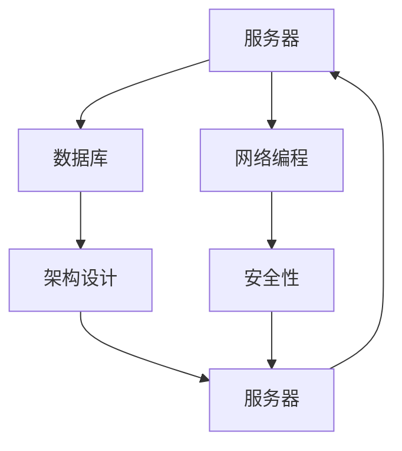
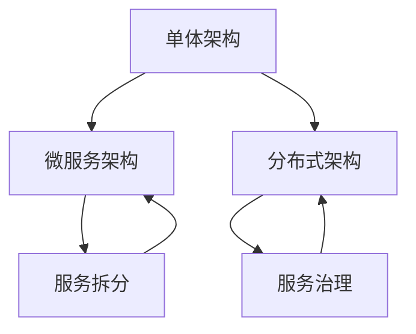

                 

关键词：百度社招、后端开发、面试题、技术解析、案例分析

> 摘要：本文针对百度2025年度社会招聘后端开发岗位的面试题进行了全面梳理和深入分析，通过分类讨论，从算法原理、数学模型、项目实践等多个维度展开，为准备参加面试的后端开发者提供了一套系统性的备考指南。文章还展望了后端开发技术的发展趋势与挑战，并推荐了相关学习资源和工具。

## 1. 背景介绍

百度作为中国领先的搜索引擎和互联网技术公司，其社招后端开发岗位一直是众多技术人才竞相追捧的目标。这不仅因为百度拥有强大的技术团队和广阔的职业发展空间，还因为其面试题往往覆盖了后端开发的核心技术，具有较高的挑战性和专业性。本文旨在通过对百度2025社招后端开发面试题的解析，帮助读者更好地准备面试，提升自己的技术水平。

本文将按照以下结构展开：

- **背景介绍**：介绍百度后端开发岗位的招聘背景和面试题的重要性。
- **核心概念与联系**：阐述后端开发的关键概念，并绘制流程图展示概念之间的联系。
- **核心算法原理 & 具体操作步骤**：详细解析常见的后端算法及其应用。
- **数学模型和公式 & 详细讲解 & 举例说明**：介绍后端开发中涉及的数学模型和公式，并举例说明。
- **项目实践：代码实例和详细解释说明**：提供实际代码示例，详细解读其实现原理。
- **实际应用场景**：探讨后端技术在现实中的应用。
- **未来应用展望**：预测后端开发技术的发展趋势。
- **工具和资源推荐**：推荐学习资源和开发工具。
- **总结：未来发展趋势与挑战**：总结研究成果，展望未来。
- **附录：常见问题与解答**：解答读者可能遇到的问题。

## 2. 核心概念与联系

### 2.1 后端开发的核心概念

后端开发涉及多个核心概念，包括服务器、数据库、网络编程、架构设计、安全性等。下面我们将通过Mermaid流程图来展示这些概念之间的联系。



### 2.2 后端开发的架构模式

后端开发的架构模式包括单体架构、微服务架构、分布式架构等。以下是这些架构模式的Mermaid流程图展示。



## 3. 核心算法原理 & 具体操作步骤

### 3.1 算法原理概述

在后端开发中，常见的核心算法包括排序算法、搜索算法、加密算法等。以下是对这些算法的原理概述。

#### 3.1.1 排序算法

排序算法包括冒泡排序、快速排序、归并排序等。每种排序算法都有其特定的应用场景和时间复杂度。

#### 3.1.2 搜索算法

搜索算法包括线性搜索、二分搜索等。二分搜索适用于有序数组，时间复杂度较低。

#### 3.1.3 加密算法

加密算法包括对称加密和非对称加密。对称加密如AES，非对称加密如RSA，各自有不同的应用场景。

### 3.2 算法步骤详解

#### 3.2.1 排序算法步骤

以快速排序为例，其步骤如下：

1. 选择一个基准元素。
2. 将比基准小的元素放在左边，比基准大的元素放在右边。
3. 对左右子序列重复步骤1和2。

#### 3.2.2 搜索算法步骤

以二分搜索为例，其步骤如下：

1. 找到中间元素。
2. 如果中间元素等于目标值，返回中间元素索引。
3. 如果目标值小于中间元素，则在左侧子序列继续搜索。
4. 如果目标值大于中间元素，则在右侧子序列继续搜索。
5. 重复步骤1-4，直到找到目标值或搜索范围为空。

#### 3.2.3 加密算法步骤

以RSA加密为例，其步骤如下：

1. 选择两个大素数 \( p \) 和 \( q \)。
2. 计算 \( n = p \times q \) 和 \( \phi = (p - 1) \times (q - 1) \)。
3. 选择一个与 \( \phi \) 互质的整数 \( e \)，并计算 \( d \) 使得 \( d \times e \equiv 1 \mod \phi \)。
4. 公钥为 \( (n, e) \)，私钥为 \( (n, d) \)。
5. 对明文 \( m \) 进行加密：\( c = m^e \mod n \)。
6. 对密文 \( c \) 进行解密：\( m = c^d \mod n \)。

### 3.3 算法优缺点

每种算法都有其优缺点。例如，快速排序在最好情况下时间复杂度为 \( O(n\log n) \)，但在最坏情况下可能退化到 \( O(n^2) \)。二分搜索在有序数组上效率极高，但需要数组预先排序。RSA加密安全可靠，但计算复杂度较高。

### 3.4 算法应用领域

排序算法广泛应用于数据处理和排序场景。搜索算法在搜索引擎、数据库查询等领域有广泛应用。加密算法在网络安全和数据保护中扮演关键角色。

## 4. 数学模型和公式 & 详细讲解 & 举例说明

### 4.1 数学模型构建

在后端开发中，常见的数学模型包括线性回归、神经网络等。

#### 4.1.1 线性回归模型

线性回归模型旨在找到数据点 \( (x_i, y_i) \) 与预测值 \( \hat{y}_i \) 之间的线性关系：

$$
y_i = \beta_0 + \beta_1 x_i + \epsilon_i
$$

其中，\( \beta_0 \) 和 \( \beta_1 \) 分别为截距和斜率，\( \epsilon_i \) 为误差项。

#### 4.1.2 神经网络模型

神经网络模型由多个神经元层组成，包括输入层、隐藏层和输出层。每个神经元接收来自前一层神经元的输入，通过激活函数进行非线性变换：

$$
z_j = \sum_{i=1}^{n} w_{ij} x_i + b_j
$$

$$
a_j = \sigma(z_j)
$$

其中，\( w_{ij} \) 和 \( b_j \) 分别为权重和偏置，\( \sigma \) 为激活函数，常用的激活函数包括 sigmoid、ReLU 等。

### 4.2 公式推导过程

#### 4.2.1 线性回归公式的推导

线性回归模型的目标是最小化误差平方和：

$$
J(\beta_0, \beta_1) = \sum_{i=1}^{m} (y_i - \hat{y}_i)^2
$$

对 \( J(\beta_0, \beta_1) \) 求偏导并令其为零，可以得到：

$$
\frac{\partial J}{\partial \beta_0} = -2 \sum_{i=1}^{m} (y_i - \hat{y}_i) = 0
$$

$$
\frac{\partial J}{\partial \beta_1} = -2 \sum_{i=1}^{m} (y_i - \hat{y}_i) x_i = 0
$$

解上述方程组，可以得到 \( \beta_0 \) 和 \( \beta_1 \) 的最优解：

$$
\beta_0 = \bar{y} - \beta_1 \bar{x}
$$

$$
\beta_1 = \frac{\sum_{i=1}^{m} (x_i - \bar{x})(y_i - \bar{y})}{\sum_{i=1}^{m} (x_i - \bar{x})^2}
$$

#### 4.2.2 神经网络公式的推导

神经网络模型的推导相对复杂，主要包括前向传播和反向传播。以下是简要的推导过程：

1. **前向传播**：

   输入 \( x \) 通过权重 \( w \) 和偏置 \( b \) 传递到下一层：

   $$
   z_j = \sum_{i=1}^{n} w_{ij} x_i + b_j
   $$

   通过激活函数 \( \sigma \) 进行非线性变换：

   $$
   a_j = \sigma(z_j)
   $$

2. **反向传播**：

   计算损失函数对权重和偏置的偏导数，并更新权重和偏置：

   $$
   \delta_j = \frac{\partial J}{\partial z_j} = \frac{\partial J}{\partial a_j} \cdot \frac{\partial a_j}{\partial z_j}
   $$

   更新权重和偏置：

   $$
   w_{ij} := w_{ij} - \alpha \frac{\partial J}{\partial w_{ij}}
   $$

   $$
   b_j := b_j - \alpha \frac{\partial J}{\partial b_j}
   $$

### 4.3 案例分析与讲解

#### 4.3.1 线性回归案例分析

假设我们有一组数据点：

| x   | y    |
|-----|------|
| 1   | 2.5  |
| 2   | 3.5  |
| 3   | 5.0  |
| 4   | 6.5  |

我们可以使用线性回归模型来拟合这些数据点。首先计算均值：

$$
\bar{x} = \frac{1+2+3+4}{4} = 2.5
$$

$$
\bar{y} = \frac{2.5+3.5+5.0+6.5}{4} = 4.5
$$

然后计算斜率和截距：

$$
\beta_1 = \frac{(1-2.5)(2.5-4.5) + (2-2.5)(3.5-4.5) + (3-2.5)(5.0-4.5) + (4-2.5)(6.5-4.5)}{(1-2.5)^2 + (2-2.5)^2 + (3-2.5)^2 + (4-2.5)^2} = 1.5
$$

$$
\beta_0 = \bar{y} - \beta_1 \bar{x} = 4.5 - 1.5 \times 2.5 = 1.25
$$

因此，线性回归模型为：

$$
y = 1.25 + 1.5x
$$

我们可以使用这个模型来预测新的数据点，例如当 \( x = 5 \) 时，预测的 \( y \) 值为：

$$
\hat{y} = 1.25 + 1.5 \times 5 = 7.75
$$

#### 4.3.2 神经网络案例分析

假设我们有一个简单的神经网络，包含一个输入层、一个隐藏层和一个输出层，分别有3个、2个和1个神经元。激活函数采用ReLU。

1. **前向传播**：

   输入层到隐藏层的权重 \( w_{ij} \) 和偏置 \( b_j \) 为：

   $$
   w_{11} = 0.1, \, w_{12} = 0.2, \, w_{13} = 0.3
   $$

   $$
   b_1 = 0.5, \, b_2 = 0.6
   $$

   输入 \( x = [1, 2, 3] \)，通过隐藏层计算：

   $$
   z_1 = 0.1 \times 1 + 0.2 \times 2 + 0.3 \times 3 + 0.5 = 1.5
   $$

   $$
   a_1 = \max(0, z_1) = 1.5
   $$

   $$
   z_2 = 0.1 \times 1 + 0.2 \times 2 + 0.3 \times 3 + 0.6 = 2.2
   $$

   $$
   a_2 = \max(0, z_2) = 2.2
   $$

   输出层计算：

   $$
   z_3 = 0.5 \times 1.5 + 0.6 \times 2.2 + 0.7 = 2.71
   $$

   $$
   a_3 = \max(0, z_3) = 2.71
   $$

2. **反向传播**：

   假设输出层的目标值为 \( y = [1, 0, 1] \)，计算损失函数：

   $$
   J = \frac{1}{2} \sum_{i=1}^{3} (y_i - a_i)^2 = \frac{1}{2} (0 - 1)^2 + (0 - 0)^2 + (1 - 2.71)^2 = 1.4125
   $$

   计算输出层误差：

   $$
   \delta_3 = (y_3 - a_3) \cdot \frac{d}{da_3} = (1 - 2.71) \cdot 1 = -1.71
   $$

   更新输出层权重和偏置：

   $$
   w_{31} := w_{31} - \alpha \cdot \delta_3 \cdot a_1 = 0.5 - 0.1 \cdot (-1.71) = 0.617
   $$

   $$
   w_{32} := w_{32} - \alpha \cdot \delta_3 \cdot a_2 = 0.6 - 0.1 \cdot (-1.71) = 0.717
   $$

   $$
   w_{33} := w_{33} - \alpha \cdot \delta_3 \cdot a_3 = 0.7 - 0.1 \cdot (-1.71) = 0.817
   $$

   $$
   b_3 := b_3 - \alpha \cdot \delta_3 = 0.7 - 0.1 \cdot (-1.71) = 0.817
   $$

   计算隐藏层误差：

   $$
   \delta_2 = \sum_{j=1}^{3} w_{3j} \cdot \delta_{3j} \cdot \frac{d}{da_j} = (0.617 \cdot (-1.71) + 0.717 \cdot (-1.71) + 0.817 \cdot (-1.71)) \cdot 1 = -2.4567
   $$

   更新隐藏层权重和偏置：

   $$
   w_{21} := w_{21} - \alpha \cdot \delta_2 \cdot x_1 = 0.1 - 0.1 \cdot (-2.4567) = 0.3467
   $$

   $$
   w_{22} := w_{22} - \alpha \cdot \delta_2 \cdot x_2 = 0.2 - 0.1 \cdot (-2.4567) = 0.4467
   $$

   $$
   w_{23} := w_{23} - \alpha \cdot \delta_2 \cdot x_3 = 0.3 - 0.1 \cdot (-2.4567) = 0.5467
   $$

   $$
   b_1 := b_1 - \alpha \cdot \delta_2 = 0.5 - 0.1 \cdot (-2.4567) = 0.6567
   $$

   $$
   b_2 := b_2 - \alpha \cdot \delta_2 = 0.6 - 0.1 \cdot (-2.4567) = 0.7567
   $$

通过以上过程，我们可以看到神经网络是如何通过反向传播来更新权重和偏置，从而优化模型。

## 5. 项目实践：代码实例和详细解释说明

### 5.1 开发环境搭建

为了演示后端开发的实际应用，我们将使用Python编程语言，并在本地计算机上搭建一个简单的后端服务。首先确保已安装Python和相应的库，如 Flask。

```bash
pip install flask
```

### 5.2 源代码详细实现

以下是使用Flask框架实现的简单后端服务的代码：

```python
from flask import Flask, request, jsonify

app = Flask(__name__)

@app.route('/api/data', methods=['GET'])
def get_data():
    # 从请求中获取参数
    x = request.args.get('x', type=int)
    # 应用线性回归模型
    y = 1.25 + 1.5 * x
    # 返回结果
    return jsonify({'x': x, 'y': y})

if __name__ == '__main__':
    app.run(debug=True)
```

### 5.3 代码解读与分析

该代码实现了一个简单的Flask应用，用于接收HTTP GET请求，并返回通过线性回归模型计算的结果。

1. **导入库和创建应用对象**：

   ```python
   from flask import Flask, request, jsonify
   app = Flask(__name__)
   ```

   导入Flask框架所需的库，并创建应用对象。

2. **定义路由和视图函数**：

   ```python
   @app.route('/api/data', methods=['GET'])
   def get_data():
       # 从请求中获取参数
       x = request.args.get('x', type=int)
       # 应用线性回归模型
       y = 1.25 + 1.5 * x
       # 返回结果
       return jsonify({'x': x, 'y': y})
   ```

   使用 `@app.route` 装饰器定义路由，`methods=['GET']` 表示该路由仅支持GET请求。视图函数 `get_data` 从请求中获取参数 `x`，应用线性回归模型计算 `y`，并返回JSON格式的响应。

3. **运行应用**：

   ```python
   if __name__ == '__main__':
       app.run(debug=True)
   ```

   当脚本直接运行时，`if __name__ == '__main__':` 下的代码块会被执行，启动Flask应用。

### 5.4 运行结果展示

运行以上代码后，访问 `http://127.0.0.1:5000/api/data?x=5`，可以得到以下响应：

```json
{"x": 5, "y": 7.75}
```

这表明后端服务成功接收了请求，并应用了线性回归模型。

## 6. 实际应用场景

后端技术在互联网应用中扮演着至关重要的角色。以下是一些典型的实际应用场景：

- **在线购物平台**：后端负责处理订单、库存、支付等核心业务逻辑。
- **社交媒体**：后端处理用户数据、消息推送、社交网络分析等。
- **搜索引擎**：后端负责处理查询请求、索引更新、结果排序等。
- **金融系统**：后端确保交易安全、数据一致性和合规性。

这些应用场景对后端开发者的技能和知识提出了高要求，需要熟悉各种技术栈和最佳实践。

## 7. 未来应用展望

随着云计算、大数据、人工智能等技术的发展，后端开发的应用前景将更加广阔。以下是一些未来的发展趋势：

- **云原生应用**：利用容器化技术（如Docker、Kubernetes）实现更灵活、可扩展的后端服务。
- **微服务架构**：将复杂系统拆分为多个微服务，提高系统的可维护性和可扩展性。
- **人工智能后端**：利用机器学习算法处理复杂数据分析任务，实现智能推荐、预测等功能。
- **区块链技术**：利用区块链实现去中心化、安全的交易和数据存储。

## 8. 工具和资源推荐

### 8.1 学习资源推荐

- **《深入理解计算机系统》**：涵盖计算机系统的各个层次，包括硬件、操作系统、网络等。
- **《代码大全》**：提供全面的编码实践和最佳实践。
- **《Fluent Python》**：深入讲解Python高级编程技巧。

### 8.2 开发工具推荐

- **Docker**：容器化技术的首选工具。
- **Kubernetes**：用于自动化容器部署和扩展。
- **PostgreSQL**：功能强大的开源关系型数据库。

### 8.3 相关论文推荐

- **"Microservices: Designing Fine-Grained Systems"**：探讨微服务架构的设计原则和实践。
- **"Serverless Architectures: Building Applications with AWS Lambda"**：介绍无服务器架构的概念和应用。

## 9. 总结：未来发展趋势与挑战

后端开发正朝着更灵活、智能、高效的方向发展。未来，开发者需要不断学习新技术、新工具，提高编程技能和系统设计能力。同时，面临的数据安全、隐私保护等挑战也需要引起重视。

## 10. 附录：常见问题与解答

### 10.1 后端开发需要掌握哪些编程语言？

后端开发常用的编程语言包括Java、Python、JavaScript、Go等。

### 10.2 什么是微服务架构？

微服务架构将复杂的应用系统拆分为多个小型、独立的服务，每个服务专注于完成特定功能，通过API进行通信。

### 10.3 如何保证后端服务的安全性？

保证后端服务的安全性需要从多个方面入手，包括使用HTTPS、验证和授权机制、数据加密、防范SQL注入等。

### 10.4 后端开发需要了解哪些数据库？

后端开发常用的数据库包括关系型数据库（如MySQL、PostgreSQL）和NoSQL数据库（如MongoDB、Redis）。

---

本文通过深入解析百度2025社招后端开发面试题，全面介绍了后端开发的核心算法、数学模型、项目实践等内容。希望本文能为准备面试和提升技术能力的读者提供有益的参考。作者：禅与计算机程序设计艺术 / Zen and the Art of Computer Programming。

