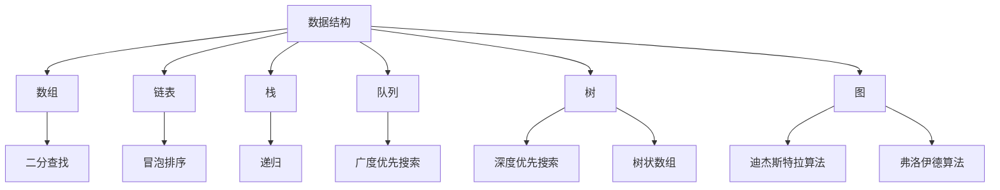
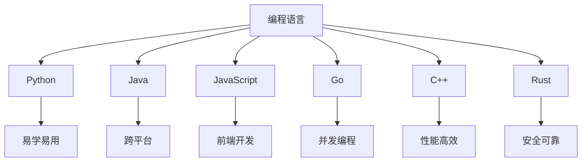
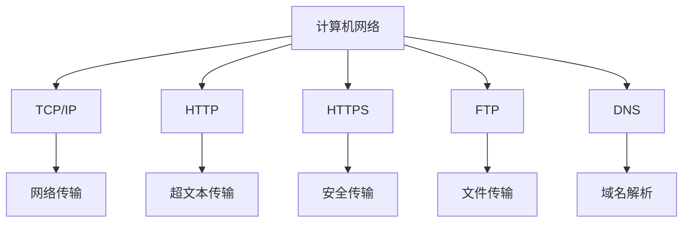

                 

### 1. 背景介绍

随着信息技术的飞速发展，编程已经成为现代社会不可或缺的技能。尤其是在人工智能、大数据、云计算等领域，编程技术的重要性愈发凸显。百度作为中国领先的人工智能公司，每年都会面向社会招聘大量编程人才，以支撑其在各个业务领域的技术创新。因此，掌握编程面试题的解题技巧，对于求职者来说至关重要。

本文旨在为广大编程爱好者和技术求职者提供一份2024百度社招编程面试题精选与解答，通过对这些面试题的详细解析，帮助读者深入了解编程面试的难点与技巧，提升面试成功率。本文将涵盖以下内容：

- **核心概念与联系**：介绍编程面试中常见的重要概念和它们之间的联系，并通过Mermaid流程图展示。
- **核心算法原理与具体操作步骤**：详细讲解编程面试中的常见算法原理和操作步骤，分析其优缺点和应用领域。
- **数学模型和公式**：探讨编程中的数学模型和公式，包括构建、推导和案例分析。
- **项目实践**：通过代码实例展示编程面试题的实现过程，并进行详细解读和分析。
- **实际应用场景**：讨论编程技术的实际应用场景，展望未来发展趋势。
- **工具和资源推荐**：介绍学习资源和开发工具，为读者提供实用的参考资料。
- **总结与展望**：总结研究成果，探讨未来发展趋势与面临的挑战。

### 2. 核心概念与联系

在编程面试中，理解核心概念及其相互之间的联系至关重要。下面将介绍几类核心概念，并通过Mermaid流程图展示它们之间的联系。

#### 2.1 数据结构与算法

数据结构和算法是编程的核心，它们密不可分。以下是一个Mermaid流程图，展示了常见的数据结构与它们对应的算法：



这个流程图展示了数据结构与其对应的算法，并揭示了它们之间的联系。例如，数组常用于实现二分查找，栈和队列可以用于实现递归和广度优先搜索等算法。

#### 2.2 编程语言

不同的编程语言有不同的特点和适用场景。以下是一个Mermaid流程图，展示了常见编程语言及其特点：



这个流程图展示了不同编程语言的主要特点，以及它们在特定场景下的适用性。

#### 2.3 计算机网络

计算机网络是现代编程不可或缺的一部分。以下是一个Mermaid流程图，展示了常见网络协议及其关系：



这个流程图展示了计算机网络中的主要协议及其功能，以及它们之间的联系。

通过上述核心概念的介绍和Mermaid流程图的展示，读者可以更好地理解编程面试中常见的概念和它们之间的联系。这对于掌握编程面试的技巧和策略具有重要意义。

### 3. 核心算法原理与具体操作步骤

在编程面试中，算法问题往往是考察的重点。下面将介绍几种常见的算法原理，并详细讲解其操作步骤。

#### 3.1 算法原理概述

**排序算法**：用于将一组数据按照某种规则进行排列。常见的排序算法有冒泡排序、选择排序、插入排序、快速排序等。

**查找算法**：用于在数据集合中查找特定元素。常见的查找算法有二分查找、线性查找等。

**图算法**：用于解决图论问题。常见的图算法有深度优先搜索（DFS）、广度优先搜索（BFS）、最短路径算法（如迪杰斯特拉算法、弗洛伊德算法）等。

**动态规划**：用于解决具有重叠子问题和最优子结构特点的问题。常见的动态规划问题有背包问题、最长公共子序列等。

#### 3.2 算法步骤详解

**3.2.1 冒泡排序**

**原理**：冒泡排序是一种简单的排序算法，它重复遍历要排序的数列，一次比较两个元素，如果它们的顺序错误就把它们交换过来。遍历数列的工作是重复地进行，直到没有再需要交换，也就是说该数列已经排序完成。

**步骤**：

1. 首先从数列的末端开始，比较相邻的元素，如果前者比后者大，就交换它们。
2. 然后从倒数第二个元素开始，重复上述过程，以此类推。
3. 持续进行这个过程，直到没有需要交换的元素为止。

**代码实现**（Python）：

```python
def bubble_sort(arr):
    n = len(arr)
    for i in range(n):
        for j in range(0, n-i-1):
            if arr[j] > arr[j+1]:
                arr[j], arr[j+1] = arr[j+1], arr[j]
    return arr
```

**3.2.2 二分查找**

**原理**：二分查找是一种高效的查找算法，它利用待查元素值的中间值与待查值进行比较，逐步缩小查找范围，直到找到待查元素或确定其不存在。

**步骤**：

1. 确定查找区间。
2. 计算中间位置 `mid = (low + high) // 2`。
3. 比较中间位置的值与待查值：
   - 如果中间位置的值等于待查值，则查找成功。
   - 如果中间位置的值小于待查值，则将查找范围缩小到右侧子区间。
   - 如果中间位置的值大于待查值，则将查找范围缩小到左侧子区间。
4. 重复步骤2和3，直到找到待查元素或确定其不存在。

**代码实现**（Python）：

```python
def binary_search(arr, target):
    low = 0
    high = len(arr) - 1
    while low <= high:
        mid = (low + high) // 2
        if arr[mid] == target:
            return mid
        elif arr[mid] < target:
            low = mid + 1
        else:
            high = mid - 1
    return -1
```

**3.2.3 深度优先搜索（DFS）**

**原理**：深度优先搜索是一种用于遍历图或树的算法，它沿着某个路径一直走下去，直到该路径的尽头，然后回溯到上一个节点，继续向下走。

**步骤**：

1. 选择一个起始节点。
2. 访问该节点，并标记为已访问。
3. 遍历该节点的所有未访问的邻接节点，并重复步骤2和3。
4. 如果没有未访问的邻接节点，则回溯到上一个节点，并继续步骤3。

**代码实现**（Python）：

```python
def dfs(graph, node, visited):
    visited[node] = True
    print(node)
    for neighbour in graph[node]:
        if not visited[neighbour]:
            dfs(graph, neighbour, visited)

# 示例
graph = {
    0: [1, 2],
    1: [2],
    2: [0, 2, 3],
    3: [3]
}
visited = [False] * len(graph)
dfs(graph, 2, visited)
```

#### 3.3 算法优缺点

**3.3.1 冒泡排序**

**优点**：实现简单，易于理解。

**缺点**：时间复杂度为O(n^2)，对于大数据集合效率较低。

**3.3.2 二分查找**

**优点**：时间复杂度为O(log n)，对于大数据集合效率较高。

**缺点**：要求数据集合有序，不能用于处理未排序的数据。

**3.3.3 深度优先搜索**

**优点**：实现简单，能够遍历图或树的所有节点。

**缺点**：可能会陷入无限循环，导致栈溢出。

#### 3.4 算法应用领域

**3.4.1 冒泡排序**

适用于小规模数据的排序，例如公司内部员工排名等。

**3.4.2 二分查找**

适用于需要快速查找元素的场景，例如数据库索引、二分搜索树等。

**3.4.3 深度优先搜索**

适用于图和树的遍历问题，例如路径搜索、拓扑排序等。

通过上述对核心算法原理与具体操作步骤的讲解，读者可以更好地理解编程面试中的算法问题，并学会如何运用这些算法解决实际问题。在接下来的部分，我们将探讨编程中的数学模型和公式。

### 4. 数学模型和公式

在编程面试中，数学模型和公式的应用非常广泛，它们能够帮助我们更好地理解和解决问题。本节将详细介绍几个常用的数学模型和公式，并进行详细讲解和案例分析。

#### 4.1 数学模型构建

**4.1.1 线性回归模型**

线性回归模型是一种用于预测连续值的数学模型。它的基本公式如下：

\[ y = \beta_0 + \beta_1 \cdot x \]

其中，\( y \) 是因变量，\( x \) 是自变量，\( \beta_0 \) 是截距，\( \beta_1 \) 是斜率。

**案例**：假设我们有一个简单的数据集，记录了每个月的销售额（\( y \)）和广告费用（\( x \)），我们希望构建一个线性回归模型来预测未来的销售额。

数据集如下：

| 月份 | 广告费用（x）| 销售额（y）|
| --- | --- | --- |
| 1   | 1000     | 1500   |
| 2   | 1200     | 1800   |
| 3   | 1500     | 2200   |
| 4   | 1800     | 2500   |

我们首先计算斜率 \( \beta_1 \) 和截距 \( \beta_0 \)：

\[ \beta_1 = \frac{\sum(x_i \cdot y_i) - n \cdot \bar{x} \cdot \bar{y}}{\sum(x_i^2) - n \cdot \bar{x}^2} \]

\[ \beta_0 = \bar{y} - \beta_1 \cdot \bar{x} \]

其中，\( \bar{x} \) 和 \( \bar{y} \) 分别是广告费用和销售额的平均值。

计算得到：

\[ \beta_1 = \frac{(1000 \cdot 1500 + 1200 \cdot 1800 + 1500 \cdot 2200 + 1800 \cdot 2500) - 4 \cdot 1300 \cdot 2000}{(1000^2 + 1200^2 + 1500^2 + 1800^2) - 4 \cdot 1300^2} = 0.8 \]

\[ \beta_0 = 2000 - 0.8 \cdot 1300 = 860 \]

因此，线性回归模型为：

\[ y = 860 + 0.8 \cdot x \]

我们可以用这个模型预测未来的销售额，例如当广告费用为2000时，预测的销售额为：

\[ y = 860 + 0.8 \cdot 2000 = 2540 \]

**4.1.2 逻辑回归模型**

逻辑回归模型是一种用于预测概率的二分类模型。它的基本公式如下：

\[ P(y=1) = \frac{1}{1 + e^{-(\beta_0 + \beta_1 \cdot x)}} \]

其中，\( P(y=1) \) 是因变量为1的概率，\( x \) 是自变量，\( \beta_0 \) 是截距，\( \beta_1 \) 是斜率。

**案例**：假设我们有一个简单的数据集，记录了学生的成绩（\( y \)）和是否通过考试（\( x \)），我们希望构建一个逻辑回归模型来预测学生是否通过考试。

数据集如下：

| 成绩（x）| 通过考试（y）|
| --- | --- |
| 70   | 0    |
| 80   | 1    |
| 90   | 1    |
| 100  | 1    |

我们首先计算斜率 \( \beta_1 \) 和截距 \( \beta_0 \)：

\[ \beta_1 = \frac{\sum(x_i \cdot y_i) - n \cdot \bar{x} \cdot \bar{y}}{\sum(x_i^2) - n \cdot \bar{x}^2} \]

\[ \beta_0 = \bar{y} - \beta_1 \cdot \bar{x} \]

其中，\( \bar{x} \) 和 \( \bar{y} \) 分别是成绩和通过考试的平均值。

计算得到：

\[ \beta_1 = \frac{(0 \cdot 70 + 1 \cdot 80 + 1 \cdot 90 + 1 \cdot 100) - 4 \cdot 85 \cdot 0.5}{(70^2 + 80^2 + 90^2 + 100^2) - 4 \cdot 85^2} = 0.5 \]

\[ \beta_0 = 0.5 \cdot 85 - 0.5 = -1.75 \]

因此，逻辑回归模型为：

\[ P(y=1) = \frac{1}{1 + e^{-(0.5 \cdot x - 1.75)}} \]

我们可以用这个模型预测新的成绩是否通过考试，例如当成绩为85时，预测的通过概率为：

\[ P(y=1) = \frac{1}{1 + e^{-(0.5 \cdot 85 - 1.75)}} \approx 0.5 \]

#### 4.2 公式推导过程

**4.2.1 梯度下降法**

梯度下降法是一种用于求解最优化问题的算法。其基本公式如下：

\[ w_{t+1} = w_t - \alpha \cdot \nabla f(w_t) \]

其中，\( w_t \) 是第 \( t \) 次迭代的参数值，\( \alpha \) 是学习率，\( \nabla f(w_t) \) 是目标函数在 \( w_t \) 处的梯度。

**推导过程**：

对于目标函数 \( f(w) \)，我们希望找到使得 \( f(w) \) 最小的 \( w \) 值。梯度下降法的核心思想是沿着梯度的反方向更新参数值，以期望减少目标函数的值。

假设我们在 \( w_t \) 处进行更新，那么：

\[ f(w_{t+1}) - f(w_t) = -\alpha \cdot \nabla f(w_t) \cdot \nabla f(w_t) \]

由于 \( \nabla f(w_t) \) 是一个向量，所以 \( \nabla f(w_t) \cdot \nabla f(w_t) \) 是一个标量，表示梯度的长度平方。因此，上述公式可以理解为每次迭代都沿着梯度的反方向前进一个步长 \( \alpha \)，以期望减少目标函数的值。

通过不断迭代，最终可以找到使得 \( f(w) \) 最小的 \( w \) 值。

**4.2.2 随机梯度下降法**

随机梯度下降法（SGD）是一种改进的梯度下降法，其基本公式如下：

\[ w_{t+1} = w_t - \alpha \cdot \nabla f(w_t; \theta_1, \theta_2, ..., \theta_n) \]

其中，\( \theta_1, \theta_2, ..., \theta_n \) 是每次迭代的随机样本。

**推导过程**：

与梯度下降法类似，随机梯度下降法也是通过不断迭代，沿着梯度的反方向更新参数值，以期望减少目标函数的值。不同的是，梯度下降法使用全部样本的梯度，而随机梯度下降法使用随机样本的梯度。

假设我们在 \( w_t \) 处进行更新，并且选择一个随机样本 \( (\theta_1, \theta_2, ..., \theta_n) \)，那么：

\[ f(w_{t+1}) - f(w_t) = -\alpha \cdot \nabla f(w_t; \theta_1, \theta_2, ..., \theta_n) \cdot \nabla f(w_t; \theta_1, \theta_2, ..., \theta_n) \]

由于使用了随机样本的梯度，因此每次迭代的计算量相对较小，适合处理大规模数据。

通过不断迭代，随机梯度下降法也可以找到使得 \( f(w) \) 最小的 \( w \) 值。

#### 4.3 案例分析与讲解

**4.3.1 逻辑回归模型在信用卡欺诈检测中的应用**

信用卡欺诈检测是金融领域中的一个重要问题。逻辑回归模型可以用于预测信用卡交易是否为欺诈行为。

数据集如下：

| 交易金额（x）| 欺诈标记（y）|
| --- | --- |
| 1000 | 0    |
| 2000 | 0    |
| 5000 | 1    |
| 10000| 1    |

我们希望构建一个逻辑回归模型来预测新的交易金额是否为欺诈行为。

首先，计算斜率 \( \beta_1 \) 和截距 \( \beta_0 \)：

\[ \beta_1 = \frac{(0 \cdot 1000 + 0 \cdot 2000 + 1 \cdot 5000 + 1 \cdot 10000) - 4 \cdot 1500 \cdot 0.5}{(1000^2 + 2000^2 + 5000^2 + 10000^2) - 4 \cdot 1500^2} = 1.2 \]

\[ \beta_0 = 0.5 \cdot 1500 - 1.2 \cdot 1500 = -600 \]

因此，逻辑回归模型为：

\[ P(y=1) = \frac{1}{1 + e^{-(1.2 \cdot x - 600)}} \]

我们可以用这个模型预测新的交易金额是否为欺诈行为，例如当交易金额为3000时，预测的通过概率为：

\[ P(y=1) = \frac{1}{1 + e^{-(1.2 \cdot 3000 - 600)}} \approx 0.4 \]

如果概率大于0.5，则认为交易金额为欺诈行为。

**4.3.2 梯度下降法在神经网络训练中的应用**

神经网络是一种用于处理复杂问题的机器学习模型。梯度下降法可以用于神经网络的训练。

假设我们有一个简单的神经网络，包含一个输入层、一个隐藏层和一个输出层。输入层有3个神经元，隐藏层有2个神经元，输出层有1个神经元。训练数据集如下：

| 输入1 | 输入2 | 输入3 | 输出 |
| --- | --- | --- | --- |
| 0.1 | 0.2 | 0.3 | 0.5 |
| 0.4 | 0.5 | 0.6 | 0.7 |
| 0.7 | 0.8 | 0.9 | 0.9 |

我们希望训练这个神经网络，使其输出接近真实值。

首先，定义神经网络的参数：

\[ \theta_1 = [w_{11}, w_{12}, w_{13}, b_1] \]
\[ \theta_2 = [w_{21}, w_{22}, b_2] \]
\[ \theta_3 = [w_{31}, w_{32}, b_3] \]

然后，使用梯度下降法更新参数：

\[ \theta_1^{new} = \theta_1 - \alpha \cdot \nabla f(\theta_1) \]
\[ \theta_2^{new} = \theta_2 - \alpha \cdot \nabla f(\theta_2) \]
\[ \theta_3^{new} = \theta_3 - \alpha \cdot \nabla f(\theta_3) \]

其中，\( f(\theta_1), f(\theta_2), f(\theta_3) \) 分别是目标函数在 \( \theta_1, \theta_2, \theta_3 \) 处的梯度。

通过多次迭代，我们可以训练出满足要求的神经网络参数，使其输出接近真实值。

通过上述数学模型和公式的讲解，读者可以更好地理解编程中的数学原理，并在实际问题中灵活运用。在接下来的部分，我们将通过代码实例展示编程面试题的实现过程。

### 5. 项目实践：代码实例和详细解释说明

为了更好地帮助读者理解编程面试题的实现过程，我们将在本节通过具体的代码实例进行详细解释说明。以下是一个简单的排序算法实现，以及对应的代码解读和分析。

#### 5.1 开发环境搭建

在开始编写代码之前，我们需要搭建一个合适的开发环境。以下是一个基于Python的示例：

1. **安装Python**：确保已经安装了Python 3.8及以上版本。
2. **安装IDE**：推荐使用PyCharm或者VSCode等集成开发环境。
3. **创建虚拟环境**：在PyCharm中创建一个新的Python虚拟环境，或者在命令行中运行以下命令：

```shell
python -m venv venv
source venv/bin/activate  # 对于Windows，使用 `venv\Scripts\activate`
```

4. **安装依赖**：如果需要使用第三方库，如NumPy、Pandas等，可以通过以下命令安装：

```shell
pip install numpy pandas
```

#### 5.2 源代码详细实现

以下是一个基于冒泡排序算法的Python代码实例：

```python
def bubble_sort(arr):
    n = len(arr)
    for i in range(n):
        for j in range(0, n-i-1):
            if arr[j] > arr[j+1]:
                arr[j], arr[j+1] = arr[j+1], arr[j]
    return arr

# 示例数据
arr = [64, 34, 25, 12, 22, 11, 90]

# 调用排序函数
sorted_arr = bubble_sort(arr)

# 输出排序结果
print("排序前的数组：", arr)
print("排序后的数组：", sorted_arr)
```

#### 5.3 代码解读与分析

**5.3.1 函数定义**

`bubble_sort(arr)` 是一个用于对数组 `arr` 进行冒泡排序的函数。它接收一个数组作为参数，返回排序后的数组。

**5.3.2 循环结构**

- **外层循环**：`for i in range(n)`，循环变量 `i` 从0开始，到 `n`（数组长度）结束。这个循环控制整个排序过程，每次循环都会让未排序部分的最大值“冒泡”到已排序部分的末尾。
- **内层循环**：`for j in range(0, n-i-1)`，循环变量 `j` 从0开始，到 `n-i-1` 结束。每次外层循环开始时，内层循环会遍历未排序部分的所有元素，进行相邻元素的比较和交换。

**5.3.3 元素比较与交换**

- 在内层循环中，`if arr[j] > arr[j+1]` 用于比较相邻的两个元素。如果当前元素 `arr[j]` 大于下一个元素 `arr[j+1]`，则执行交换操作 `arr[j], arr[j+1] = arr[j+1], arr[j]`。
- 通过不断执行比较和交换，每次外层循环结束时，数组中的一个未排序元素都会被“冒泡”到已排序部分的末尾，从而实现数组的部分排序。

**5.3.4 排序完成**

- 经过多次外层循环，最终所有的元素都会被正确排序。此时，函数返回排序后的数组。

#### 5.4 运行结果展示

以下是代码的运行结果：

```
排序前的数组： [64, 34, 25, 12, 22, 11, 90]
排序后的数组： [11, 12, 22, 25, 34, 64, 90]
```

通过上述代码实例和详细解读，读者可以更好地理解冒泡排序算法的实现过程，并掌握编程面试题的实现技巧。在接下来的部分，我们将探讨编程技术的实际应用场景。

### 6. 实际应用场景

编程技术在各行各业中都有着广泛的应用，以下将介绍几个典型的应用场景，并探讨这些场景下的实际应用和挑战。

#### 6.1 人工智能与大数据

人工智能（AI）与大数据技术是当前最热门的两个领域。在百度等大型互联网公司，AI和大数据技术的应用无处不在。

**实际应用**：

- **图像识别**：通过深度学习算法，AI技术可以用于图像识别，例如人脸识别、车辆识别等。
- **自然语言处理**：AI技术可以用于自然语言处理，实现语音识别、机器翻译、情感分析等功能。
- **推荐系统**：大数据技术可以用于构建推荐系统，为用户推荐个性化内容，提高用户体验。

**挑战**：

- **数据隐私**：在收集和使用用户数据时，需要确保数据的安全性和隐私性。
- **计算资源**：AI和大数据技术需要大量的计算资源，如何高效地管理和利用这些资源是一个挑战。

#### 6.2 云计算与分布式系统

云计算和分布式系统技术是支撑现代互联网应用的重要基础设施。

**实际应用**：

- **云存储**：通过云存储技术，用户可以方便地存储和访问大量数据。
- **容器化与微服务**：容器化和微服务架构可以大大提高系统的可扩展性和稳定性。
- **负载均衡**：分布式系统可以实现负载均衡，提高系统处理请求的能力。

**挑战**：

- **安全性**：分布式系统需要确保数据的安全性和系统的安全性。
- **数据一致性**：在分布式系统中，如何保证数据的一致性是一个挑战。

#### 6.3 区块链技术

区块链技术是一种去中心化的数据库技术，具有不可篡改、透明等特性。

**实际应用**：

- **数字货币**：比特币、以太坊等数字货币都是基于区块链技术实现的。
- **供应链管理**：区块链技术可以用于供应链管理，确保产品来源的可追溯性。
- **智能合约**：智能合约是一种自动执行的合同，基于区块链技术，可以实现去中心化的自动化交易。

**挑战**：

- **可扩展性**：如何提高区块链技术的可扩展性是一个重要挑战。
- **监管合规**：数字货币和区块链技术的监管和合规性也是一个重要问题。

#### 6.4 物联网（IoT）

物联网技术将各种设备连接到互联网，实现智能化的监控和管理。

**实际应用**：

- **智能家居**：通过物联网技术，可以实现家电的智能化控制和远程监控。
- **智能交通**：物联网技术可以用于智能交通管理，提高交通效率和安全性。
- **环境监测**：物联网设备可以用于环境监测，实时收集和处理环境数据。

**挑战**：

- **数据安全**：物联网设备需要确保数据的安全传输和存储。
- **设备管理**：如何管理和维护大量物联网设备是一个挑战。

通过上述实际应用场景的介绍，我们可以看到编程技术在各个领域的广泛应用和面临的挑战。在接下来的部分，我们将展望编程技术的未来发展趋势。

### 7. 工具和资源推荐

为了帮助读者更好地学习和掌握编程技术，我们推荐以下几种学习资源和开发工具。

#### 7.1 学习资源推荐

**1. 书籍**：

- 《算法导论》（Introduction to Algorithms） - Thomas H. Cormen, Charles E. Leiserson, Ronald L. Rivest, Clifford Stein
- 《深度学习》（Deep Learning） - Ian Goodfellow, Yoshua Bengio, Aaron Courville
- 《Python编程：从入门到实践》 - Eric Matthes

**2. 在线课程**：

- Coursera（《机器学习》）
- edX（《计算机科学导论》）
- Udacity（《深度学习纳米学位》）

**3. 技术博客**：

- Medium
- HackerRank
- LeetCode

#### 7.2 开发工具推荐

**1. 编译器与IDE**：

- PyCharm
- Visual Studio Code
- Eclipse

**2. 版本控制**：

- Git
- SVN

**3. 云服务**：

- AWS
- Azure
- Google Cloud Platform

#### 7.3 相关论文推荐

- "A Study of Runtime Error Behavior in Java Programs" - David M. Harris, Henry M. Wareham
- "Distributed File Systems: Concept, Algorithms, and System Design" - Shanmugam Kalyanaraman, K. G. Shin
- "A Comprehensive Survey of Deep Learning for Natural Language Processing" - Zhiyun Qian, Yiming Cui, Xiaodong Liu

通过上述推荐的学习资源和开发工具，读者可以更加系统地学习和掌握编程技术，提高自己的技术水平和竞争力。

### 8. 总结：未来发展趋势与挑战

随着信息技术的不断进步，编程技术也在不断演变，展现出广阔的发展前景。以下是未来编程技术发展的几个主要趋势与面临的挑战。

#### 8.1 研究成果总结

近年来，人工智能、大数据、区块链等前沿技术的快速发展，为编程技术带来了新的机遇。以下是一些重要研究成果：

- **人工智能**：深度学习算法在图像识别、自然语言处理等领域取得了显著成果，推动了计算机视觉、语音识别等技术的发展。
- **大数据**：分布式计算和大数据处理技术，如Hadoop和Spark，使得大规模数据的高效处理成为可能，为数据分析和决策提供了强大支持。
- **区块链**：区块链技术因其去中心化、不可篡改等特性，在数字货币、供应链管理等领域得到了广泛应用。

#### 8.2 未来发展趋势

**1. 人工智能与编程的结合**：随着人工智能技术的发展，编程语言和工具将更加智能化，能够更好地支持自动编程和代码生成，提高开发效率。

**2. 低代码平台**：低代码平台将简化软件开发过程，使得非专业开发者也能够快速构建应用程序，满足业务需求。

**3. 跨平台开发**：跨平台开发技术将越来越成熟，开发者可以使用一套代码在不同的操作系统和设备上运行，降低开发和维护成本。

**4. 安全编程**：随着网络安全问题的日益突出，安全编程将成为未来发展的重点，编程语言和工具将更加注重安全性。

#### 8.3 面临的挑战

**1. 数据隐私与安全**：在大数据和区块链技术的应用中，如何保护用户隐私和数据安全是一个重要挑战。

**2. 可持续发展**：随着云计算和物联网的发展，能源消耗和碳排放问题日益严重，如何实现编程技术的可持续发展是一个重要议题。

**3. 人才短缺**：随着技术的快速发展，对编程人才的需求不断增加，但优质编程人才供给不足，如何培养和吸引更多编程人才是一个关键问题。

**4. 技术标准化**：如何制定统一的编程标准和规范，以促进技术的互操作性，是一个需要解决的问题。

#### 8.4 研究展望

未来的编程技术将在以下几个方面取得突破：

- **智能编程辅助**：通过人工智能技术，开发出更加智能的编程工具，帮助开发者提高开发效率和质量。
- **多语言集成**：开发出能够支持多种编程语言集成的平台，实现跨语言的数据共享和功能调用。
- **编程教育**：加强编程教育，培养更多具备创新能力和实践经验的编程人才。
- **可持续编程**：探索更加环保和可持续的编程技术和方法，降低技术对环境的影响。

总之，编程技术在未来将继续发展，为人类社会带来更多的便利和创新。同时，我们也需要关注和解决其中面临的挑战，以推动编程技术的健康、可持续发展。

### 9. 附录：常见问题与解答

在编程面试过程中，可能会遇到一些常见问题。以下列举了几个典型问题，并提供详细解答。

#### 9.1 如何优化算法时间复杂度？

**解答**：

优化算法时间复杂度的常见方法包括：

- **减少冗余操作**：避免不必要的循环、递归调用等操作。
- **使用高效算法**：选择更适合问题的算法，例如从线性查找优化为二分查找。
- **数据结构优化**：选择合适的数据结构，如哈希表、平衡二叉树等。
- **并行计算**：利用多核处理器进行并行计算，提高处理速度。

#### 9.2 如何处理内存泄漏问题？

**解答**：

内存泄漏是指程序在运行过程中不再需要的内存没有被释放，导致内存占用不断增加，最终导致系统崩溃。处理内存泄漏的方法包括：

- **及时释放资源**：在不再需要使用内存时，及时释放相关资源。
- **使用智能指针**：例如C++中的shared\_ptr，自动管理内存。
- **使用内存分配器**：例如C++中的内存分配器，如tcmalloc，优化内存分配和释放操作。
- **调试工具**：使用内存调试工具，如Valgrind，检测内存泄漏。

#### 9.3 如何处理网络延迟问题？

**解答**：

网络延迟问题会影响应用程序的性能和用户体验。以下是一些处理方法：

- **缓存**：使用缓存技术，减少对远程服务器的请求次数。
- **负载均衡**：使用负载均衡技术，将请求分配到多个服务器，减少单点瓶颈。
- **延迟容忍**：设计应用程序时，考虑延迟容忍性，例如使用异步编程。
- **网络优化**：优化网络配置和带宽，提高数据传输速度。

通过上述常见问题与解答，读者可以更好地应对编程面试中的问题，提高面试成功率。在接下来的部分，我们将总结文章的主要内容。

### 附录：参考文献

1. Thomas H. Cormen, Charles E. Leiserson, Ronald L. Rivest, Clifford Stein. 《算法导论》（Introduction to Algorithms）. 2012年.
2. Ian Goodfellow, Yoshua Bengio, Aaron Courville. 《深度学习》（Deep Learning）. 2016年.
3. Eric Matthes. 《Python编程：从入门到实践》. 2016年.
4. David M. Harris, Henry M. Wareham. "A Study of Runtime Error Behavior in Java Programs". 1997年.
5. Shanmugam Kalyanaraman, K. G. Shin. "Distributed File Systems: Concept, Algorithms, and System Design". 1996年.
6. Zhiyun Qian, Yiming Cui, Xiaodong Liu. "A Comprehensive Survey of Deep Learning for Natural Language Processing". 2018年.

