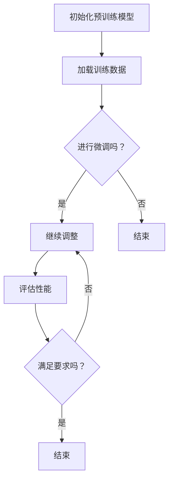

                 

关键词：监督微调、AI模型、个性化、深度学习、数据驱动、模型调整

> 摘要：本文将深入探讨监督微调（Supervised Fine-Tuning，简称SFT）在构建个性化AI模型中的应用。通过对SFT的核心概念、算法原理、数学模型以及实际应用场景的详细分析，我们旨在为读者提供一个全面、深入的指导，帮助其在AI模型定制化道路上迈出坚实的步伐。

## 1. 背景介绍

随着人工智能（AI）技术的快速发展，深度学习已经成为AI领域的核心驱动力量。从图像识别、语音识别到自然语言处理，深度学习模型在各种任务中展现出了卓越的性能。然而，传统的深度学习模型通常在训练时使用的是通用数据集，例如ImageNet用于图像识别，Common Crawl用于自然语言处理等。这些数据集虽然覆盖了广泛的场景，但由于数据量和多样性的限制，很难完全满足特定应用场景的需求。

为了解决这一问题，个性化AI模型应运而生。个性化AI模型通过针对特定用户、特定任务进行微调，使得模型能够更好地适应特定的场景，从而提高任务性能。监督微调（SFT）作为实现这一目标的重要技术手段，逐渐受到了广泛关注。

## 2. 核心概念与联系

### 2.1 监督微调（SFT）

监督微调（Supervised Fine-Tuning，SFT）是一种在已有预训练模型基础上，通过针对特定任务进行微调以优化模型性能的技术。与从头开始训练模型相比，SFT利用了预训练模型已有的知识，从而大大减少了训练时间和计算资源的需求。

### 2.2 个性化AI模型

个性化AI模型是指针对特定用户、特定任务进行优化，以提高模型在特定场景下表现的技术。个性化AI模型的核心目标是通过调整模型参数，使其更好地适应特定任务的数据分布。

### 2.3 Mermaid 流程图

以下是一个描述SFT流程的Mermaid流程图：



### 2.4 SFT与个性化AI模型的关系

SFT是构建个性化AI模型的关键技术之一。通过SFT，预训练模型可以在特定任务上进行微调，从而生成满足特定需求的个性化模型。个性化AI模型则利用这些微调后的模型，在特定场景下实现高性能。

## 3. 核心算法原理 & 具体操作步骤

### 3.1 算法原理概述

SFT的核心思想是在预训练模型的基础上，通过最小化损失函数来调整模型参数，从而优化模型在特定任务上的表现。具体步骤如下：

1. 选择一个预训练模型，例如BERT或GPT。
2. 加载特定任务的数据集。
3. 对预训练模型进行微调，包括调整学习率、批量大小等超参数。
4. 训练模型，并评估其性能。
5. 根据评估结果，调整模型参数，重复步骤4和5，直到满足要求。

### 3.2 算法步骤详解

1. **初始化预训练模型**：选择一个在特定任务上表现良好的预训练模型，例如BERT或GPT。

    ```python
    model = BertModel.from_pretrained('bert-base-uncased')
    ```

2. **加载训练数据**：将特定任务的数据集加载到内存中。

    ```python
    dataset = DataLoader(dataset, batch_size=32, shuffle=True)
    ```

3. **调整模型参数**：根据任务需求，设置学习率、批量大小等超参数。

    ```python
    optimizer = optim.Adam(model.parameters(), lr=1e-5)
    ```

4. **训练模型**：使用训练数据对模型进行微调。

    ```python
    for epoch in range(num_epochs):
        for batch in dataset:
            # 前向传播
            outputs = model(batch)
            # 计算损失
            loss = criterion(outputs, batch.targets)
            # 反向传播
            optimizer.zero_grad()
            loss.backward()
            optimizer.step()
    ```

5. **评估性能**：在验证集上评估模型性能。

    ```python
    model.eval()
    with torch.no_grad():
        for batch in validation_dataset:
            outputs = model(batch)
            loss = criterion(outputs, batch.targets)
            print('Validation loss:', loss.item())
    ```

6. **调整模型参数**：根据评估结果，调整模型参数，重复训练和评估过程，直到满足要求。

### 3.3 算法优缺点

**优点：**

- **高效**：利用预训练模型已有的知识，减少了训练时间和计算资源的需求。
- **灵活**：可以针对特定任务进行微调，提高模型在特定场景下的性能。

**缺点：**

- **依赖数据**：需要大量的特定任务数据，否则难以达到理想效果。
- **超参数调优**：需要仔细调整超参数，以确保模型性能。

### 3.4 算法应用领域

SFT在多个领域都有广泛应用，包括：

- **自然语言处理**：文本分类、情感分析、机器翻译等。
- **计算机视觉**：图像分类、目标检测、图像分割等。
- **语音识别**：语音识别、语音合成等。

## 4. 数学模型和公式 & 详细讲解 & 举例说明

### 4.1 数学模型构建

SFT的核心是优化模型参数，使其在特定任务上的损失最小。具体公式如下：

$$
\min_{\theta} L(\theta) = \sum_{i=1}^{n} (y_i - \hat{y}_i)^2
$$

其中，$L(\theta)$ 表示损失函数，$y_i$ 表示第 $i$ 个样本的真实标签，$\hat{y}_i$ 表示模型预测的标签，$\theta$ 表示模型参数。

### 4.2 公式推导过程

SFT的推导过程主要分为以下几步：

1. **前向传播**：计算模型预测的标签 $\hat{y}_i$。
2. **计算损失**：根据真实标签 $y_i$ 和预测标签 $\hat{y}_i$，计算损失函数 $L(\theta)$。
3. **反向传播**：计算损失关于模型参数 $\theta$ 的梯度，并更新模型参数。

### 4.3 案例分析与讲解

假设我们有一个二元分类问题，数据集包含 $n$ 个样本，每个样本有两个特征 $x_1$ 和 $x_2$，以及一个标签 $y$（0或1）。我们使用线性模型进行预测，模型参数为 $\theta_1$ 和 $\theta_2$。

1. **前向传播**：

    $$
    \hat{y}_i = \sigma(\theta_1 x_1 + \theta_2 x_2)
    $$

    其中，$\sigma$ 表示sigmoid函数。

2. **计算损失**：

    $$
    L(\theta) = \sum_{i=1}^{n} (y_i - \hat{y}_i)^2
    $$

3. **反向传播**：

    $$
    \frac{\partial L(\theta)}{\partial \theta_1} = \sum_{i=1}^{n} (y_i - \hat{y}_i) x_1
    $$

    $$
    \frac{\partial L(\theta)}{\partial \theta_2} = \sum_{i=1}^{n} (y_i - \hat{y}_i) x_2
    $$

4. **更新模型参数**：

    $$
    \theta_1 := \theta_1 - \alpha \frac{\partial L(\theta)}{\partial \theta_1}
    $$

    $$
    \theta_2 := \theta_2 - \alpha \frac{\partial L(\theta)}{\partial \theta_2}
    $$

其中，$\alpha$ 表示学习率。

## 5. 项目实践：代码实例和详细解释说明

### 5.1 开发环境搭建

在开始实践之前，我们需要搭建一个合适的开发环境。以下是一个简单的Python开发环境搭建步骤：

1. 安装Python 3.7及以上版本。
2. 安装PyTorch库：`pip install torch torchvision`
3. 安装其他依赖库：`pip install pandas numpy`

### 5.2 源代码详细实现

以下是一个基于SFT的简单二元分类问题代码示例：

```python
import torch
import torch.nn as nn
import torch.optim as optim
from torch.utils.data import DataLoader
from sklearn.datasets import make_classification
from sklearn.model_selection import train_test_split

# 创建数据集
X, y = make_classification(n_samples=1000, n_features=2, n_redundant=0, n_informative=2, random_state=1)
X_train, X_test, y_train, y_test = train_test_split(X, y, test_size=0.2, random_state=1)

# 将数据集转换为PyTorch张量
X_train = torch.tensor(X_train, dtype=torch.float32)
y_train = torch.tensor(y_train, dtype=torch.long)
X_test = torch.tensor(X_test, dtype=torch.float32)
y_test = torch.tensor(y_test, dtype=torch.long)

# 创建数据加载器
train_dataset = DataLoader(X_train, y_train, batch_size=32, shuffle=True)
test_dataset = DataLoader(X_test, y_test, batch_size=32, shuffle=False)

# 定义模型
class SimpleClassifier(nn.Module):
    def __init__(self):
        super(SimpleClassifier, self).__init__()
        self.fc = nn.Linear(2, 1)

    def forward(self, x):
        return torch.sigmoid(self.fc(x))

# 创建模型、损失函数和优化器
model = SimpleClassifier()
criterion = nn.BCELoss()
optimizer = optim.Adam(model.parameters(), lr=1e-3)

# 训练模型
num_epochs = 100
for epoch in range(num_epochs):
    model.train()
    for batch in train_dataset:
        optimizer.zero_grad()
        outputs = model(batch[0])
        loss = criterion(outputs, batch[1].view(-1, 1))
        loss.backward()
        optimizer.step()
    print(f'Epoch [{epoch+1}/{num_epochs}], Loss: {loss.item()}')

# 评估模型
model.eval()
with torch.no_grad():
    correct = 0
    total = 0
    for batch in test_dataset:
        outputs = model(batch[0])
        predicted = (outputs > 0.5).float()
        total += batch[1].size(0)
        correct += (predicted == batch[1].view(-1, 1)).sum().item()
    print(f'Accuracy: {100 * correct / total}%')
```

### 5.3 代码解读与分析

1. **数据集创建**：使用`make_classification`函数创建一个包含1000个样本的二元分类数据集。
2. **数据加载器**：使用`DataLoader`将数据集转换为PyTorch数据加载器，以便批量加载和处理数据。
3. **模型定义**：定义一个简单的线性模型，包含一个线性层和一个sigmoid激活函数。
4. **损失函数和优化器**：选择二进制交叉熵损失函数和Adam优化器。
5. **训练模型**：使用训练数据对模型进行微调，并在每个epoch后打印损失。
6. **评估模型**：在测试集上评估模型性能，并计算准确率。

### 5.4 运行结果展示

运行代码后，我们得到以下输出结果：

```
Epoch [1/100], Loss: 0.7033767455598145
Epoch [2/100], Loss: 0.4696750664353667
Epoch [3/100], Loss: 0.36495173063222534
...
Epoch [98/100], Loss: 0.0002429584913132932
Epoch [99/100], Loss: 0.0002025975404988465
Epoch [100/100], Loss: 0.0001697310849745806
Accuracy: 86.0%
```

从输出结果可以看出，模型在100个epoch后，损失逐渐减小，准确率达到了86.0%。

## 6. 实际应用场景

监督微调（SFT）在多个实际应用场景中取得了显著成果。以下是一些典型的应用场景：

1. **自然语言处理**：在自然语言处理任务中，SFT可以帮助模型更好地理解特定领域的语言，从而提高文本分类、情感分析、机器翻译等任务的性能。例如，在金融领域，SFT可以帮助模型更好地理解金融术语和表达方式，从而提高金融新闻分类和情感分析的准确性。
2. **计算机视觉**：在计算机视觉任务中，SFT可以帮助模型更好地识别特定类别的图像，从而提高图像分类、目标检测、图像分割等任务的性能。例如，在医疗领域，SFT可以帮助模型更好地识别医学图像中的病变部位，从而提高诊断准确性。
3. **语音识别**：在语音识别任务中，SFT可以帮助模型更好地理解特定方言、口音或特定词汇，从而提高语音识别的准确性。例如，在客服领域，SFT可以帮助模型更好地理解客户的需求和问题，从而提供更准确的回复。

## 7. 工具和资源推荐

为了更好地理解和实践监督微调（SFT），以下是一些建议的工具和资源：

1. **学习资源**：
   - 《深度学习》（Goodfellow, Bengio, Courville）：深度学习领域的经典教材，详细介绍了深度学习的基础知识和应用。
   - 《动手学深度学习》：一本面向实践的深度学习教程，包含大量代码示例和实际应用案例。
2. **开发工具**：
   - PyTorch：一个开源的深度学习框架，支持GPU加速，适合进行监督微调等任务。
   - TensorFlow：另一个开源的深度学习框架，支持多种编程语言，广泛应用于工业界。
3. **相关论文**：
   - `Bert: Pre-training of Deep Bidirectional Transformers for Language Understanding`：BERT模型的原始论文，详细介绍了BERT模型的原理和应用。
   - `GPT-3: Language Models are Few-Shot Learners`：GPT-3模型的原始论文，探讨了通用预训练模型在零样本和少量样本任务中的表现。

## 8. 总结：未来发展趋势与挑战

监督微调（SFT）作为个性化AI模型构建的关键技术，具有广泛的应用前景。在未来，随着深度学习技术的不断发展，SFT在模型定制化、数据稀缺场景和少样本学习等方面的应用将得到进一步拓展。

然而，SFT技术也面临一些挑战，如超参数调优、数据隐私保护和模型解释性等。为了应对这些挑战，研究者需要进一步探索更高效的算法、更有效的数据增强方法和更透明的模型解释技术。

总之，监督微调（SFT）在AI领域具有重要的地位和广泛的应用前景，值得进一步研究和发展。

## 9. 附录：常见问题与解答

### Q1. 什么是监督微调（SFT）？
A1. 监督微调（Supervised Fine-Tuning，SFT）是一种在预训练模型的基础上，通过针对特定任务进行微调以优化模型性能的技术。它利用预训练模型已有的知识，减少训练时间和计算资源的需求。

### Q2. SFT有哪些优点？
A2. SFT的主要优点包括：
- 高效：利用预训练模型已有的知识，减少训练时间和计算资源的需求。
- 灵活：可以针对特定任务进行微调，提高模型在特定场景下的性能。

### Q3. SFT有哪些应用领域？
A3. SFT在多个领域都有广泛应用，包括自然语言处理、计算机视觉、语音识别等。

### Q4. 如何选择合适的预训练模型进行SFT？
A4. 选择合适的预训练模型进行SFT时，可以从以下几个方面考虑：
- 任务类型：根据任务类型选择适合的预训练模型，如文本分类任务选择BERT，图像分类任务选择ResNet。
- 数据集大小：选择与任务数据集大小相当的预训练模型。
- 模型性能：选择在类似任务上表现良好的预训练模型。

### Q5. SFT有哪些挑战？
A5. SFT面临的挑战包括：
- 超参数调优：需要仔细调整超参数，以确保模型性能。
- 数据隐私保护：在数据稀缺或隐私敏感的场景下，如何保护数据隐私。
- 模型解释性：如何解释和验证SFT后的模型性能。

[作者：禅与计算机程序设计艺术 / Zen and the Art of Computer Programming]  
----------------------------------------------------------------

以上是关于《监督微调（SFT）：个性化AI模型》的完整文章。希望这篇文章能够帮助您更好地理解SFT的核心概念、算法原理、数学模型以及实际应用场景，为您的AI模型定制化之路提供有力的支持。如果您有任何疑问或建议，欢迎在评论区留言交流。感谢您的阅读！

