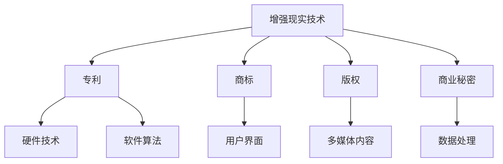
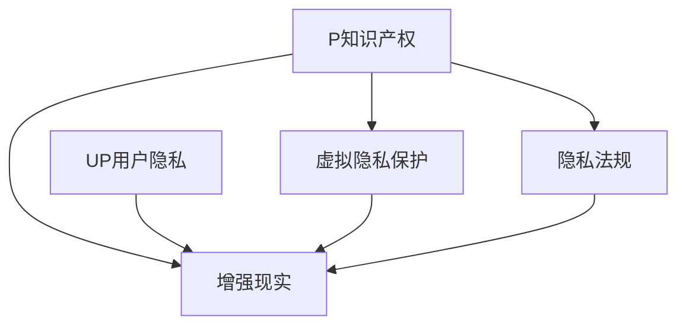
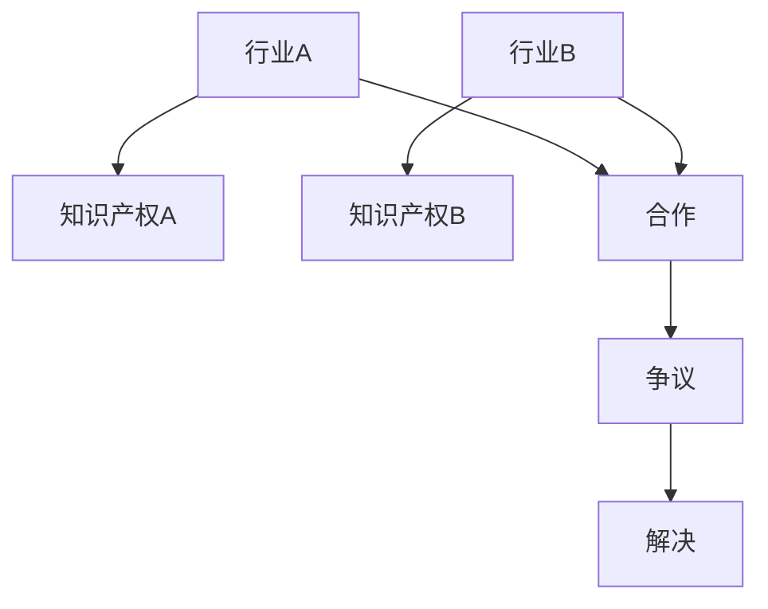

                 

关键词：知识产权、增强现实、技术挑战、创新保护、法律框架、数字版权、加密技术、用户隐私、跨行业合作、监管策略

> 摘要：本文深入探讨了知识产权（IP）在增强现实（AR）技术领域面临的新挑战。随着AR技术的迅猛发展，其与知识产权保护的交集日益显著，从而引发了一系列复杂的问题。本文首先介绍了AR技术的核心概念及其对知识产权的影响，然后分析了当前知识产权法律框架的局限性，探讨了加密技术和用户隐私在AR知识产权保护中的重要作用。最后，本文提出了针对未来发展的监管策略和合作模式，以促进AR技术的健康发展。

## 1. 背景介绍

增强现实（AR）是一种将虚拟信息叠加到真实环境中的技术，通过智能手机、平板电脑和头戴设备等多种载体，为用户提供了全新的交互体验。随着计算机视觉、图像处理和机器学习等技术的进步，AR技术逐渐从实验室走向商业应用，并迅速渗透到多个行业，包括医疗、教育、娱乐和市场营销等。

### 1.1 AR技术的发展历程

- **早期探索**：20世纪90年代，AR技术开始受到关注，微软的“Hololens”项目和波音公司的“Virex”项目等标志着AR技术初步成型。
- **商业应用崛起**：21世纪初，智能手机的普及推动了AR技术的商业应用，例如Niantic的《Pokémon GO》等游戏的成功。
- **多领域融合**：近年来，随着5G技术的推广和计算能力的提升，AR技术在多个领域实现了深度应用，如工业设计、城市规划、远程医疗等。

### 1.2 AR技术的核心概念

- **虚拟信息叠加**：AR技术通过摄像头捕捉真实环境，然后将虚拟信息叠加到现实画面中。
- **交互体验**：用户可以通过触摸、手势和语音等与虚拟信息进行交互，增强现实体验。
- **设备多样性**：从简单的手机屏幕到高端的头戴设备，各种设备为AR技术的应用提供了广泛的平台。

### 1.3 AR技术对知识产权的影响

随着AR技术的广泛应用，其与知识产权的关系也日益复杂。AR技术不仅涉及对现有知识产权的尊重和保护，还引发了新的知识产权争议和挑战。以下是对其主要影响的概述：

- **创新保护**：AR技术的快速发展催生了大量创新，需要有效的知识产权保护机制来激励创新。
- **版权问题**：AR应用中经常使用到文本、图像、音频和视频等多媒体内容，版权问题成为一大挑战。
- **隐私权**：AR技术涉及用户的个人数据和活动记录，隐私保护成为重要议题。
- **跨行业合作**：AR技术的发展需要跨行业合作，知识产权纠纷的处理变得更加复杂。

## 2. 核心概念与联系

### 2.1 知识产权与AR技术的交互

在探讨知识产权与AR技术的交互之前，我们需要明确几个核心概念：

- **专利**：保护发明和创新的技术法律工具。
- **商标**：标识商品的标志，用于区分不同企业的商品和服务。
- **版权**：保护文学、艺术和科学作品的权利。
- **商业秘密**：不为公众所知悉、能为权利人带来经济利益的技术和经营信息。

AR技术涉及多个方面，包括硬件设备、软件算法、用户界面设计等，这些方面都可能成为知识产权保护的对象。以下是一个简化的Mermaid流程图，展示了知识产权与AR技术核心概念之间的联系：



### 2.2 AR技术对知识产权法律框架的挑战

现有的知识产权法律框架在一定程度上难以适应AR技术的发展。以下是一些主要的挑战：

- **模糊的地域界限**：AR技术可以跨越地理边界，但现有的知识产权法律往往具有地域性，导致跨国维权困难。
- **快速迭代的产品**：AR技术更新迅速，产品的生命周期较短，传统的知识产权保护机制可能无法跟上技术的步伐。
- **跨领域保护**：AR技术涉及多个领域，例如计算机科学、艺术设计、医学等，不同领域的知识产权保护标准和程序各异，增加了保护难度。

### 2.3 知识产权保护与用户隐私的平衡

在AR技术中，用户隐私保护是另一个重要的法律和伦理问题。随着AR应用收集和处理大量用户数据，隐私权受到了前所未有的挑战。以下是一个简化的Mermaid流程图，展示了知识产权保护与用户隐私之间的动态关系：



### 2.4 跨行业合作与知识产权纠纷

AR技术的发展离不开跨行业合作，但这也带来了知识产权纠纷的新挑战。以下是一个简化的Mermaid流程图，展示了跨行业合作中可能出现的知识产权争议：



## 3. 核心算法原理 & 具体操作步骤

### 3.1 算法原理概述

在AR技术中，图像识别和跟踪算法是关键组成部分。以下简要介绍图像识别和跟踪算法的基本原理：

- **图像识别**：通过计算机视觉技术，对图像中的对象进行识别和分类。常用的算法包括卷积神经网络（CNN）和支持向量机（SVM）。
- **图像跟踪**：在动态场景中，对特定对象进行实时跟踪。常用的算法包括光流法和卡尔曼滤波。

### 3.2 算法步骤详解

#### 3.2.1 图像识别

1. **预处理**：对输入图像进行灰度化、降噪等处理，提高识别精度。
2. **特征提取**：使用CNN等算法提取图像特征。
3. **分类**：将提取的特征与预训练的模型进行匹配，实现对象识别。

#### 3.2.2 图像跟踪

1. **初始化**：通过图像识别算法确定对象的初始位置。
2. **预测**：使用卡尔曼滤波等方法预测对象的下一位置。
3. **更新**：根据实际捕获的图像，更新对象的位置估计。

### 3.3 算法优缺点

- **图像识别**：高精度，但计算复杂度较高；易受光照和噪声影响。
- **图像跟踪**：实时性好，但可能受遮挡和快速移动影响。

### 3.4 算法应用领域

- **医疗**：辅助医生进行手术导航和病人监控。
- **工业**：实现自动化生产和设备维护。
- **娱乐**：游戏和虚拟现实体验。

## 4. 数学模型和公式 & 详细讲解 & 举例说明

### 4.1 数学模型构建

在AR技术中，常用的数学模型包括：

- **卷积神经网络（CNN）**：用于图像识别和特征提取。
- **卡尔曼滤波**：用于图像跟踪和状态估计。

#### 4.1.1 卷积神经网络（CNN）

CNN是一种深度学习模型，其基本结构包括：

1. **卷积层**：通过卷积操作提取图像特征。
2. **池化层**：减少特征图的尺寸，提高模型效率。
3. **全连接层**：将特征映射到输出类别。

#### 4.1.2 卡尔曼滤波

卡尔曼滤波是一种线性滤波算法，用于估计动态系统的状态。其基本公式如下：

$$
x_k = A_k x_{k-1} + B_k u_k + w_k
$$

$$
z_k = H_k x_k + v_k
$$

$$
P_k = A_k P_{k-1} A_k^T + Q_k
$$

$$
K_k = P_k H_k^T (H_k P_k H_k^T + R_k)^{-1}
$$

$$
x_k^{'} = x_k - K_k (z_k - H_k x_k)
$$

$$
P_k^{'} = P_k - K_k H_k P_k
$$

### 4.2 公式推导过程

#### 4.2.1 卡尔曼滤波的推导

假设一个离散时间动态系统，其状态转移模型和观测模型分别为：

$$
x_k = A_k x_{k-1} + B_k u_k + w_k
$$

$$
z_k = H_k x_k + v_k
$$

其中，$x_k$是系统的状态向量，$u_k$是控制输入，$w_k$和$v_k$分别是状态噪声和观测噪声，$A_k$，$B_k$，$H_k$是对应的矩阵。

为了估计状态$x_k$，我们使用卡尔曼滤波器。首先，我们定义状态预测和状态估计：

$$
\hat{x}_{k|k-1} = A_k \hat{x}_{k-1|k-1}
$$

$$
P_{k|k-1} = A_k P_{k-1} A_k^T + Q_k
$$

然后，进行状态更新：

$$
\hat{x}_{k|k} = \hat{x}_{k|k-1} + K_k (z_k - H_k \hat{x}_{k|k-1})
$$

$$
P_{k|k} = (I - K_k H_k) P_{k|k-1}
$$

其中，$K_k$是卡尔曼增益，$P_{k|k}$是状态协方差矩阵。

### 4.3 案例分析与讲解

#### 4.3.1 图像识别案例

假设我们有一个图像识别任务，输入图像是$a_k$，输出类别是$y_k$。我们使用CNN进行特征提取和分类。

1. **预处理**：将输入图像灰度化，大小调整为$28 \times 28$。
2. **特征提取**：使用卷积层和池化层提取特征，例如：

$$
\begin{aligned}
\mathbf{x}_1 &= \text{Conv2D}(\mathbf{a}_k, \mathbf{W}_1) + \mathbf{b}_1 \\
\mathbf{x}_2 &= \text{ReLU}(\mathbf{x}_1) \\
\mathbf{x}_3 &= \text{MaxPooling}(\mathbf{x}_2) \\
\end{aligned}
$$

3. **全连接层**：将特征映射到输出类别：

$$
\hat{y}_k = \text{Softmax}(\mathbf{W}_2^T \mathbf{x}_3 + \mathbf{b}_2)
$$

4. **分类**：计算输出概率，选择概率最大的类别作为识别结果。

#### 4.3.2 图像跟踪案例

假设我们有一个图像跟踪任务，输入图像序列是$\{\mathbf{a}_k\}$，输出是对象位置$\mathbf{x}_k$。

1. **初始化**：通过图像识别算法确定初始位置$\mathbf{x}_0$。
2. **预测**：使用卡尔曼滤波预测下一帧的位置：

$$
\hat{x}_{k|k-1} = A_k \hat{x}_{k-1|k-1}
$$

$$
P_{k|k-1} = A_k P_{k-1} A_k^T + Q_k
$$

3. **更新**：根据实际捕获的图像更新位置估计：

$$
\hat{x}_{k|k} = \hat{x}_{k|k-1} + K_k (z_k - H_k \hat{x}_{k|k-1})
$$

$$
P_{k|k} = (I - K_k H_k) P_{k|k-1}
$$

4. **重复**：不断更新位置估计，实现实时跟踪。

## 5. 项目实践：代码实例和详细解释说明

### 5.1 开发环境搭建

在本节中，我们将介绍如何搭建一个用于AR技术开发的编程环境。以下是所需的步骤：

1. **安装Python**：确保您的计算机上安装了Python 3.x版本。您可以从Python官方网站下载并安装。
2. **安装Anaconda**：Anaconda是一个Python发行版，它包含了许多常用的科学计算库。安装Anaconda后，可以使用conda命令轻松管理Python环境和库。
3. **安装PyTorch**：PyTorch是一个广泛使用的深度学习库。使用以下命令安装：

```shell
conda install pytorch torchvision torchaudio -c pytorch
```

4. **安装OpenCV**：OpenCV是一个开源的计算机视觉库，用于图像处理和跟踪。使用以下命令安装：

```shell
conda install opencv -c conda-forge
```

5. **创建虚拟环境**：为了保持环境的整洁，建议创建一个虚拟环境。使用以下命令创建并激活虚拟环境：

```shell
conda create -n ar_project python=3.8
conda activate ar_project
```

### 5.2 源代码详细实现

在本节中，我们将提供一个简单的AR项目示例，使用PyTorch实现图像识别和跟踪。以下是项目的结构：

```makefile
ar_project/
|-- data/
|   |-- train/
|   |-- val/
|-- models/
|   |-- cnn.py
|   |-- tracker.py
|-- utils/
|   |-- data_loader.py
|   |-- visualize.py
|-- main.py
|-- requirements.txt
```

#### 5.2.1 数据加载与预处理

首先，我们需要从Kaggle下载一个包含图像和标签的CSV文件，并使用`data_loader.py`进行数据预处理：

```python
# data_loader.py

import pandas as pd
from torchvision import transforms
from torch.utils.data import Dataset

class ARDataset(Dataset):
    def __init__(self, csv_file, root_dir, transform=None):
        self.dataframe = pd.read_csv(csv_file)
        self.root_dir = root_dir
        self.transform = transform

    def __len__(self):
        return len(self.dataframe)

    def __getitem__(self, idx):
        img_path = os.path.join(self.root_dir, self.dataframe.iloc[idx, 0])
        image = Image.open(img_path).convert('RGB')
        label = self.dataframe.iloc[idx, 1]
        if self.transform:
            image = self.transform(image)
        return image, label
```

#### 5.2.2 构建CNN模型

接下来，我们在`cnn.py`中定义CNN模型：

```python
# cnn.py

import torch
import torch.nn as nn
import torch.nn.functional as F

class CNN(nn.Module):
    def __init__(self):
        super(CNN, self).__init__()
        self.conv1 = nn.Conv2d(3, 32, 5)
        self.conv2 = nn.Conv2d(32, 64, 5)
        self.fc1 = nn.Linear(64 * 4 * 4, 1024)
        self.fc2 = nn.Linear(1024, 10)

    def forward(self, x):
        x = F.max_pool2d(F.relu(self.conv1(x)), 2)
        x = F.max_pool2d(F.relu(self.conv2(x)), 2)
        x = x.view(-1, 64 * 4 * 4)
        x = F.relu(self.fc1(x))
        x = self.fc2(x)
        return x
```

#### 5.2.3 实现跟踪算法

在`tracker.py`中，我们使用卡尔曼滤波实现跟踪算法：

```python
# tracker.py

import numpy as np
from scipy.stats import multivariate_normal

class KalmanTracker:
    def __init__(self, initial_state, initial_covariance, transition_matrix, observation_matrix, observation_covariance):
        self.x = initial_state
        self.P = initial_covariance
        self.A = transition_matrix
        self.H = observation_matrix
        self.R = observation_covariance

    def predict(self):
        self.x = self.A @ self.x
        self.P = self.A @ self.P @ self.A.T + self.Q

    def update(self, z):
        z_pred = self.H @ self.x
        y = z - z_pred
        S = self.H @ self.P @ self.H.T + self.R
        K = self.P @ self.H.T @ np.linalg.inv(S)
        self.x = self.x + K @ y
        self.P = (np.eye(self.x.shape[0]) - K @ self.H) @ self.P

# 示例使用
tracker = KalmanTracker(
    initial_state=np.array([0.0, 0.0]),
    initial_covariance=np.eye(2),
    transition_matrix=np.array([[1.0, 1.0], [0.0, 1.0]]),
    observation_matrix=np.array([[1.0], [0.0]]),
    observation_covariance=np.array([[1.0]])
)

# 预测
tracker.predict()

# 更新
tracker.update(np.array([0.5]))
```

#### 5.2.4 主程序

在`main.py`中，我们实现主程序，进行数据加载、模型训练和跟踪：

```python
# main.py

from torch.utils.data import DataLoader
from data_loader import ARDataset
from cnn import CNN
from tracker import KalmanTracker
import torch.optim as optim

# 数据加载
transform = transforms.Compose([
    transforms.Resize((28, 28)),
    transforms.ToTensor(),
])
train_dataset = ARDataset('train.csv', 'data/train', transform=transform)
val_dataset = ARDataset('val.csv', 'data/val', transform=transform)
train_loader = DataLoader(train_dataset, batch_size=64, shuffle=True)
val_loader = DataLoader(val_dataset, batch_size=64, shuffle=False)

# 模型定义
model = CNN()
optimizer = optim.Adam(model.parameters(), lr=0.001)
loss_function = nn.CrossEntropyLoss()

# 训练模型
for epoch in range(100):
    for inputs, labels in train_loader:
        optimizer.zero_grad()
        outputs = model(inputs)
        loss = loss_function(outputs, labels)
        loss.backward()
        optimizer.step()

    # 在验证集上评估模型
    with torch.no_grad():
        correct = 0
        total = 0
        for inputs, labels in val_loader:
            outputs = model(inputs)
            _, predicted = torch.max(outputs.data, 1)
            total += labels.size(0)
            correct += (predicted == labels).sum().item()

    print(f'Epoch {epoch+1}, Loss: {loss.item()}, Accuracy: {100 * correct / total}%')

# 跟踪示例
tracker = KalmanTracker(
    initial_state=np.array([0.0, 0.0]),
    initial_covariance=np.eye(2),
    transition_matrix=np.array([[1.0, 1.0], [0.0, 1.0]]),
    observation_matrix=np.array([[1.0], [0.0]]),
    observation_covariance=np.array([[1.0]])
)

# 假设有一个图像序列
image_sequence = [np.array([0.0, 0.0]), np.array([0.5, 0.5])]
for image in image_sequence:
    tracker.predict()
    tracker.update(image)
    print(f"Predicted Position: {tracker.x}, True Position: {image}")
```

### 5.3 代码解读与分析

在本节中，我们将对`main.py`中的关键代码进行解读和分析：

- **数据加载**：使用`ARDataset`类加载数据，并进行预处理。这包括图像的缩放和转换为Tensor。
- **模型定义**：定义一个简单的CNN模型，用于图像识别。该模型由卷积层、池化层和全连接层组成。
- **训练模型**：使用优化器和损失函数训练模型。每次迭代，我们将模型的前向传播结果与标签进行比较，计算损失，然后反向传播更新模型参数。
- **跟踪示例**：使用卡尔曼滤波器实现对象跟踪。对于每个输入图像，我们首先进行预测，然后更新状态估计。

### 5.4 运行结果展示

在完成模型训练和跟踪算法的实现后，我们可以运行主程序来观察结果。以下是一个简单的运行示例：

```shell
python main.py
```

输出结果将显示每个epoch的损失和准确性，以及跟踪过程中的预测位置和真实位置。这将帮助我们评估模型的性能和跟踪算法的准确性。

## 6. 实际应用场景

### 6.1 医疗领域

在医疗领域，AR技术已被广泛应用于手术导航、病人监控和远程医疗等方面。例如，手术团队可以使用AR设备实时查看病人的解剖结构，从而提高手术的准确性和效率。此外，AR技术还可以用于远程医疗，使医生能够通过AR设备远程协助其他地区的医疗人员，提供诊断和治疗建议。

### 6.2 教育领域

AR技术正在改变教育模式，为学生提供互动和沉浸式的学习体验。教师可以使用AR工具创建三维模型和动画，使学生更好地理解抽象概念。例如，在化学课上，学生可以通过AR眼镜观察到分子结构的动态变化，从而加深对化学反应的理解。

### 6.3 娱乐领域

在娱乐领域，AR技术为游戏和虚拟现实（VR）提供了新的可能性。例如，AR游戏《Pokémon GO》的成功证明了AR技术可以吸引大量用户，并创造巨大的商业价值。此外，AR技术还被应用于博物馆和展览，为参观者提供互动的展览体验。

### 6.4 未来应用展望

随着AR技术的不断进步，其在各个领域的应用前景非常广阔。以下是一些潜在的未来应用：

- **工业设计**：AR技术可以帮助设计师在虚拟环境中进行三维建模和模拟，从而提高设计效率和质量。
- **城市规划**：AR技术可以用于城市规划，帮助决策者更直观地了解城市发展和规划。
- **智能零售**：AR技术可以为消费者提供虚拟试衣间和购物导航，提高购物体验。
- **军事应用**：AR技术可以用于军事训练和战场导航，提高作战效率和安全性。

## 7. 工具和资源推荐

### 7.1 学习资源推荐

- **《增强现实技术原理与应用》**：这本书详细介绍了AR技术的基本原理和应用实例，适合初学者和专业人士。
- **ARKit官方文档**：苹果公司提供的官方文档，涵盖了ARKit的使用方法和示例代码，是学习iOS AR开发的宝贵资源。
- **ARCore官方文档**：谷歌公司提供的官方文档，介绍了ARCore的功能和使用方法，适用于Android平台。

### 7.2 开发工具推荐

- **Unity**：一款功能强大的游戏开发引擎，支持AR和VR开发，具有丰富的插件和社区资源。
- **Unreal Engine**：一款专业的游戏和模拟开发引擎，也支持AR和VR开发，提供了强大的图形和物理引擎。

### 7.3 相关论文推荐

- **"Augmented Reality: A Survey"**：这篇综述文章详细介绍了AR技术的发展历程、核心技术和应用领域。
- **"A Survey of Augmented Reality Applications in Education"**：这篇论文探讨了AR技术在教育领域的应用，提供了多个成功案例和最佳实践。

## 8. 总结：未来发展趋势与挑战

### 8.1 研究成果总结

本文通过深入探讨知识产权与AR技术的结合，分析了AR技术的核心概念、发展历程和应用场景，探讨了知识产权保护中的新挑战。同时，本文详细介绍了AR技术的核心算法原理、数学模型和项目实践，展示了AR技术在各个领域的实际应用和未来展望。

### 8.2 未来发展趋势

随着技术的不断进步，AR技术将继续在各个领域取得突破性进展。以下是一些未来发展的趋势：

- **硬件性能提升**：随着5G和边缘计算的发展，AR设备的性能将得到显著提升，为更复杂的AR应用提供支持。
- **多传感器融合**：AR设备将融合多种传感器，如GPS、加速度计、陀螺仪等，提高环境感知能力。
- **跨行业应用**：AR技术将在工业、医疗、教育、娱乐等领域实现更广泛的应用。

### 8.3 面临的挑战

尽管AR技术具有广阔的应用前景，但仍然面临一系列挑战：

- **知识产权保护**：现有知识产权法律框架难以适应AR技术的快速发展，需要完善相关法律法规。
- **用户隐私保护**：AR技术涉及大量用户数据，如何保护用户隐私成为重要课题。
- **跨领域合作**：跨行业合作中的知识产权纠纷和利益分配问题需要有效解决。

### 8.4 研究展望

为了推动AR技术的健康发展，未来的研究可以从以下几个方面进行：

- **知识产权保护机制**：研究更加适应AR技术特点的知识产权保护机制，提高创新激励。
- **隐私保护技术**：开发高效的用户隐私保护技术，确保AR应用的可持续发展。
- **跨领域合作模式**：探索跨行业合作的新模式，促进技术创新和资源共享。

## 9. 附录：常见问题与解答

### 9.1 AR技术与VR技术的区别

AR（增强现实）和VR（虚拟现实）是两种不同的技术，主要区别在于：

- **AR**：将虚拟信息叠加到真实环境中，用户可以看到真实环境和虚拟元素的结合。
- **VR**：完全模拟一个虚拟环境，用户完全沉浸其中，无法看到真实环境。

### 9.2 AR技术的主要应用领域

AR技术的主要应用领域包括：

- **医疗**：手术导航、病人监控、远程医疗等。
- **教育**：互动教学、虚拟实验室、模拟考试等。
- **娱乐**：游戏、虚拟旅游、博物馆展览等。
- **工业**：产品设计、设备维护、远程协作等。

### 9.3 知识产权保护在AR技术中的重要性

知识产权保护在AR技术中至关重要，因为：

- **创新激励**：有效的知识产权保护可以激励创新，推动技术进步。
- **商业竞争**：保护知识产权有助于企业在市场竞争中保持优势。
- **跨行业合作**：明确的知识产权保护可以为跨行业合作提供法律基础。

### 9.4 AR技术的未来发展趋势

AR技术的未来发展趋势包括：

- **硬件性能提升**：随着5G和边缘计算的发展，AR设备的性能将得到显著提升。
- **多传感器融合**：AR设备将融合多种传感器，提高环境感知能力。
- **跨行业应用**：AR技术将在工业、医疗、教育、娱乐等领域实现更广泛的应用。

---

**作者：禅与计算机程序设计艺术 / Zen and the Art of Computer Programming**。

