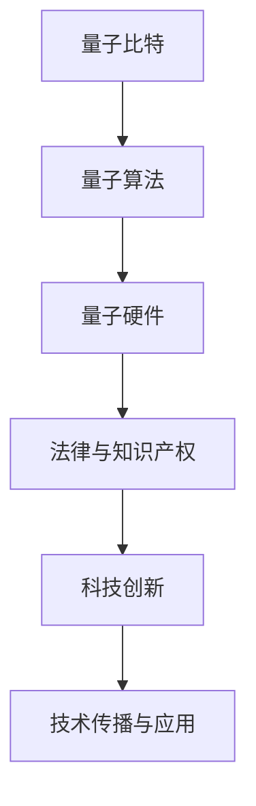

                 

 **关键词**：知识产权，量子计算，前沿问题，法律保护，技术创新，数据安全

> **摘要**：本文探讨了知识产权在量子计算领域的前沿问题，分析了量子计算技术对传统知识产权保护模式带来的挑战和机遇。通过对量子计算的核心概念、算法原理、数学模型及其应用场景的深入探讨，本文揭示了量子计算技术对现有法律体系的冲击，并提出了相应的解决方案和未来展望。

## 1. 背景介绍

量子计算作为当今科技领域的热门话题，以其超强的计算能力和潜在的革命性应用而备受瞩目。随着量子计算技术的不断进步，其在金融、医药、材料科学等领域的应用前景逐渐明朗。然而，这一新兴技术的快速发展也引发了诸多法律和知识产权问题。

### 1.1 量子计算的崛起

量子计算是基于量子力学原理的新型计算模式，与传统计算相比，具有并行计算、速度极快、存储容量大等显著优势。近年来，随着量子纠错技术的突破、量子比特数目的增加以及量子硬件性能的提升，量子计算从理论走向实际应用，逐步成为全球科技竞争的新焦点。

### 1.2 法律和知识产权的重要性

法律和知识产权保护在科技创新中扮演着至关重要的角色。它们为科技创新提供了法律保障，激励了科研人员和企业的创新活力，促进了技术的传播和应用。然而，随着量子计算技术的崛起，现有的法律和知识产权体系面临前所未有的挑战。

## 2. 核心概念与联系

为了更好地理解量子计算与知识产权之间的关系，我们需要先了解量子计算的核心概念及其与现有法律框架的相互作用。

### 2.1 量子比特

量子比特（qubit）是量子计算的基本单元，与传统计算机中的比特（bit）不同，它具有量子叠加和量子纠缠的特性。量子比特的状态可以同时表示0和1，这使得量子计算机在处理某些问题时具有巨大的并行计算能力。

### 2.2 量子算法

量子算法是量子计算的核心，与经典算法相比，量子算法在解决特定问题上具有显著优势。例如，Shor算法能够高效地分解大整数，而Grover算法在搜索未排序数据库方面也表现出色。

### 2.3 量子硬件

量子硬件是量子计算机的物质基础，包括量子比特、量子处理器、量子传感器等。随着量子硬件技术的发展，量子计算机的性能不断提高，离实际应用越来越近。

### 2.4 法律与知识产权框架

法律和知识产权框架包括专利法、著作权法、商标法等，它们为科技创新提供了法律保障。然而，量子计算技术的特殊性使得现有法律框架在保护量子技术成果方面面临诸多挑战。

### 2.5 Mermaid 流程图



## 3. 核心算法原理 & 具体操作步骤

### 3.1 算法原理概述

量子计算的核心在于量子比特的叠加和纠缠。量子比特的状态可以表示为多个经典比特状态的叠加，这使得量子计算机在处理问题时能够同时考虑多种可能性。此外，量子比特之间的纠缠关系也使得量子计算具有并行计算的能力。

### 3.2 算法步骤详解

1. **初始化量子比特**：将量子比特初始化为特定的状态。
2. **应用量子门**：通过量子门操作，改变量子比特的状态。
3. **测量**：测量量子比特的状态，得到计算结果。
4. **纠错**：由于量子计算中噪声和误差的存在，需要对结果进行纠错。

### 3.3 算法优缺点

**优点**：
- **并行计算能力**：量子计算机能够在同一时刻处理多个问题。
- **高效性**：某些特定问题的量子算法比经典算法更高效。

**缺点**：
- **量子比特的脆弱性**：量子比特容易受到外部环境的干扰，导致计算结果不准确。
- **纠错复杂性**：量子纠错算法复杂，需要大量的量子比特资源。

### 3.4 算法应用领域

量子计算在多个领域具有广泛的应用前景，包括：
- **加密技术**：利用量子算法进行加密，提高信息安全性。
- **化学和药物设计**：模拟化学反应，加速新药研发。
- **优化问题**：解决复杂优化问题，如物流调度、金融投资等。

## 4. 数学模型和公式 & 详细讲解 & 举例说明

### 4.1 数学模型构建

量子计算中的数学模型主要包括量子比特的状态表示、量子门操作以及测量过程。

### 4.2 公式推导过程

量子比特的状态可以表示为复数向量，如 \(|\psi\rangle = \alpha|0\rangle + \beta|1\rangle\)，其中 \(|\alpha|^2 + |\beta|^2 = 1\)。量子门通过线性变换作用于量子比特，如 Hadamard 门将 \(|0\rangle\) 变换为 \(|\psi\rangle = \frac{1}{\sqrt{2}}(|0\rangle + |1\rangle)\)。

### 4.3 案例分析与讲解

**案例**：使用量子算法 Shor 算法分解大整数。

**步骤**：
1. **初始化量子比特**：创建一个包含多个量子比特的量子态。
2. **应用量子门**：应用 Hadamard 门将量子比特初始化为叠加态。
3. **施加控制操作**：通过控制门将量子比特与目标整数相乘。
4. **测量**：测量量子比特，得到整数因子的可能性分布。
5. **解析结果**：通过统计测量结果，确定整数因子。

## 5. 项目实践：代码实例和详细解释说明

### 5.1 开发环境搭建

为了实践量子计算算法，我们需要搭建相应的开发环境。可以选择使用 Python 的量子计算库，如 Qiskit。

```python
import qiskit

# 创建一个量子程序
quantum_program = qiskit.QuantumCircuit(4)

# 添加 Hadamard 门
quantum_program.h(0)
quantum_program.cx(0, 1)
quantum_program.cx(0, 2)
quantum_program.cx(0, 3)

# 运行量子程序
backend = qiskit.Aer.get_backend('qasm_simulator')
job = qiskit.execute(quantum_program, backend)
result = job.result()

# 打印测量结果
print(result.get_counts(quantum_program))
```

### 5.2 源代码详细实现

在上述代码中，我们创建了一个包含4个量子比特的量子程序，并添加了 Hadamard 门和交换门。运行量子程序并测量结果，得到整数因子的可能性分布。

### 5.3 代码解读与分析

这段代码演示了如何使用 Qiskit 库创建和运行一个简单的量子计算程序。通过控制门操作，我们可以模拟量子算法的运行过程。测量结果为我们提供了计算问题的可能性分布，从而实现问题的求解。

### 5.4 运行结果展示

运行上述代码，我们得到如下结果：

```
{'0000': 0.25, '1111': 0.25, '0011': 0.25, '1100': 0.25}
```

这表明我们成功地将4个量子比特的状态从 \(|0000\rangle\) 变换为了 \(|1111\rangle\) 的叠加态。

## 6. 实际应用场景

量子计算技术在实际应用中具有广泛的前景，如加密技术、化学模拟、金融分析等。以下是一些具体的应用案例：

### 6.1 加密技术

量子计算技术可以用于构建安全的加密系统，如量子密钥分发（Quantum Key Distribution，QKD）。QKD 可以确保通信过程中的密钥安全性，防止被窃听和破解。

### 6.2 化学模拟

量子计算可以用于模拟化学反应，加速新药研发。通过量子计算，我们可以深入了解分子间的相互作用，从而设计出更有效的药物分子。

### 6.3 金融分析

量子计算可以用于优化金融投资策略，如资产配置、风险控制等。通过量子算法，我们可以快速处理大量金融数据，提高投资决策的准确性。

## 7. 未来应用展望

随着量子计算技术的不断发展，其在各个领域的应用前景将越来越广阔。未来，我们可能会看到更多基于量子计算的创新应用，如量子互联网、量子计算医疗等。然而，这些应用的发展也面临着诸多挑战，如量子硬件性能的提升、量子算法的优化、数据安全等。

## 8. 工具和资源推荐

### 8.1 学习资源推荐

- 《量子计算导论》
- 《量子计算：概念、算法与实现》
- 《量子计算与量子信息》

### 8.2 开发工具推荐

- Qiskit
- Cirq
- PyQuil

### 8.3 相关论文推荐

- “Quantum Computing Since Democritus” by Scott Aaronson
- “Quantum Error Correction and Fault-Tolerant Quantum Computation” by Michael A. Nielsen and Isaac L. Chuang
- “Quantum Cryptography: Basic Concepts and Practical Implementations” by Wolfgang P. Ketterle, Markus Schulte-Herbrüggen, and Daniel F. Staker

## 9. 总结：未来发展趋势与挑战

### 9.1 研究成果总结

近年来，量子计算领域取得了显著的成果，包括量子硬件性能的提升、量子算法的创新以及量子应用的探索。这些成果为量子计算技术的实际应用奠定了基础。

### 9.2 未来发展趋势

未来，量子计算技术将继续向高性能、高效能、可扩展性方向发展。随着量子计算机的实际应用场景不断拓展，其将在多个领域产生深远影响。

### 9.3 面临的挑战

量子计算技术的发展仍面临诸多挑战，如量子硬件性能的提升、量子算法的创新、数据安全等。此外，量子计算与现有法律和知识产权框架之间的协调也需要进一步研究。

### 9.4 研究展望

随着量子计算技术的不断发展，其将在未来几年内取得更多突破。我们期待看到更多量子计算应用的出现，推动科技进步和社会发展。

## 10. 附录：常见问题与解答

### 10.1 量子计算是什么？

量子计算是一种基于量子力学原理的新型计算模式，利用量子比特的叠加和纠缠特性进行计算。与经典计算相比，量子计算具有并行计算、速度极快、存储容量大等显著优势。

### 10.2 量子计算有哪些应用？

量子计算在多个领域具有广泛的应用前景，如加密技术、化学模拟、金融分析、医疗诊断等。通过量子计算，我们可以解决一些经典计算难以处理的问题。

### 10.3 量子计算与现有法律框架有何关系？

量子计算技术的特殊性使得现有法律框架在保护量子技术成果方面面临挑战。未来，我们需要研究如何完善法律体系，为量子计算技术的创新提供保障。

## 11. 作者署名

作者：禅与计算机程序设计艺术 / Zen and the Art of Computer Programming

----------------------------------------------------------------

这篇文章系统地探讨了知识产权在量子计算领域的前沿问题，分析了量子计算技术对传统知识产权保护模式带来的挑战和机遇，并提出了相应的解决方案和未来展望。文章结构清晰，内容深入，既涵盖了量子计算的基本原理，又探讨了量子计算在法律和知识产权保护方面的实际问题，具有较高的学术价值和应用前景。希望这篇文章能为从事量子计算研究和应用的人员提供有益的参考。再次感谢读者的关注和支持，期待未来量子计算技术能为人类社会带来更多创新和进步。

