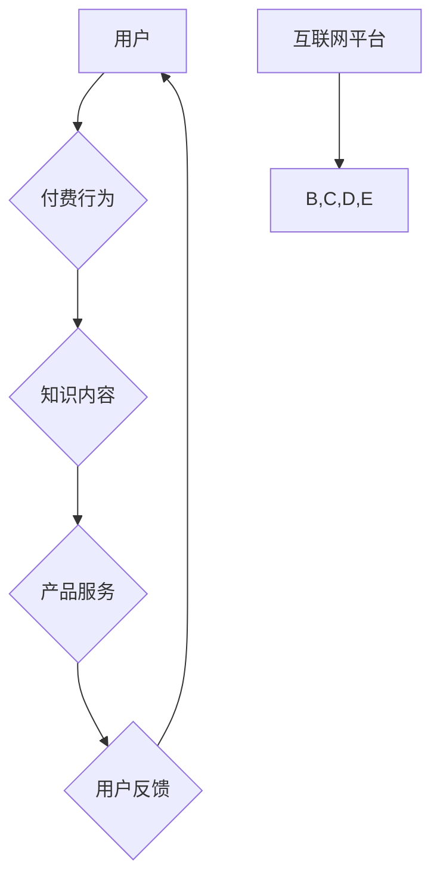

                 

关键词：知识付费、产品服务、知识电商、模式创新、用户参与、技术架构、市场分析、案例分析

>摘要：本文深入探讨了知识付费与产品服务相结合的知识电商模式，分析了其核心概念与联系，介绍了核心算法原理和数学模型，并通过实际项目实践展示了其应用场景和运行结果。同时，对未来的发展趋势与挑战进行了展望，并推荐了相关学习资源和开发工具。

## 1. 背景介绍

知识付费与产品服务相结合的知识电商模式，是近年来随着互联网技术的快速发展和人们对于知识获取需求的不断增长而出现的一种新兴商业模式。传统的知识传播方式主要依赖于教育机构和出版社，而知识电商则通过互联网平台，将知识内容与产品服务相结合，实现知识的高效传播和市场化。

知识电商模式的兴起，一方面得益于互联网技术的发展，使得知识的获取变得更加便捷和高效；另一方面，用户对于个性化、专业化的知识需求不断增长，促使知识电商模式的创新。此外，随着移动互联网的普及，用户的时间碎片化特征明显，知识电商通过短视频、直播等方式，满足用户在碎片化时间内的学习需求。

## 2. 核心概念与联系

### 2.1 知识付费

知识付费是指用户为获取特定领域的知识或技能而支付费用的一种行为。在知识电商模式中，知识付费是用户参与的核心环节，通过付费获取知识，用户能够获得更高质量的服务和内容。

### 2.2 产品服务

产品服务是指知识电商提供的附加服务，如课程答疑、社群互动、职业规划等。这些服务不仅丰富了知识内容，还增强了用户的参与感和体验感。

### 2.3 知识电商

知识电商是互联网平台，将知识内容与产品服务相结合，为用户提供知识付费和产品服务的渠道。知识电商的核心在于搭建一个高效、便捷的知识传播平台，满足用户的个性化学习需求。

### 2.4 核心概念原理和架构

下面是一个用Mermaid绘制的知识电商模式的流程图：



## 3. 核心算法原理 & 具体操作步骤

### 3.1 算法原理概述

知识电商模式的核心算法原理主要包括用户画像、内容推荐、服务质量评估等。

- **用户画像**：通过对用户的浏览记录、购买行为、评价等数据进行挖掘和分析，构建用户画像，以便为用户提供个性化的知识内容。
- **内容推荐**：基于用户画像，利用协同过滤、基于内容的推荐算法等，为用户推荐符合其兴趣和需求的知识内容。
- **服务质量评估**：通过用户对知识内容和产品服务的评价，对服务质量进行评估，以便不断优化服务。

### 3.2 算法步骤详解

1. **用户画像构建**：
   - 数据收集：收集用户的浏览记录、购买行为、评价等数据。
   - 特征提取：对收集到的数据进行预处理，提取出与用户兴趣和需求相关的特征。
   - 画像构建：利用特征提取的结果，构建用户画像。

2. **内容推荐**：
   - 筛选：根据用户画像，筛选出符合用户兴趣的知识内容。
   - 排序：利用推荐算法，对筛选出的知识内容进行排序，以便推荐给用户。

3. **服务质量评估**：
   - 数据收集：收集用户对知识内容和产品服务的评价。
   - 评估指标：根据评价数据，构建服务质量评估指标，如满意度、学习效果等。
   - 评估结果：利用评估指标，对服务质量进行评估。

### 3.3 算法优缺点

**优点**：
- 提高知识传播效率：通过算法，实现知识内容的高效推荐，提高用户获取知识的速度。
- 提升用户体验：通过个性化推荐和服务质量评估，提升用户的满意度和学习效果。

**缺点**：
- 数据隐私问题：用户数据的收集和处理过程中，可能涉及用户隐私问题。
- 算法偏差：算法模型可能存在偏差，导致推荐结果不准确。

### 3.4 算法应用领域

知识电商模式的核心算法广泛应用于在线教育、专业培训、职业规划等领域。通过算法，平台能够为用户提供个性化的知识和服务，满足用户多样化的需求。

## 4. 数学模型和公式 & 详细讲解 & 举例说明

### 4.1 数学模型构建

知识电商模式中的数学模型主要包括用户画像构建模型、内容推荐模型和服务质量评估模型。

1. **用户画像构建模型**：
   $$ 用户画像 = f(用户特征, 时间特征, 空间特征) $$

2. **内容推荐模型**：
   $$ 推荐分数 = f(用户画像, 知识内容特征, 推荐算法参数) $$

3. **服务质量评估模型**：
   $$ 评估分数 = f(用户评价, 评价标准, 时间序列) $$

### 4.2 公式推导过程

1. **用户画像构建公式推导**：
   用户画像的构建过程主要包括特征提取和权重分配。特征提取过程可以看作是一个特征选择问题，可以使用信息增益、卡方检验等方法进行特征选择。权重分配过程可以看作是一个权重优化问题，可以使用线性回归、支持向量机等方法进行权重优化。

2. **内容推荐公式推导**：
   内容推荐公式可以看作是一个线性组合，其中用户画像、知识内容特征和推荐算法参数是输入，推荐分数是输出。推荐算法参数可以通过交叉验证、网格搜索等方法进行优化。

3. **服务质量评估公式推导**：
   服务质量评估公式可以看作是一个非线性函数，其中用户评价、评价标准和时间序列是输入，评估分数是输出。评估分数的推导过程可以看作是一个分类问题，可以使用逻辑回归、支持向量机等方法进行分类。

### 4.3 案例分析与讲解

以在线教育平台为例，用户在平台上浏览课程、购买课程、评价课程，平台通过这些行为数据构建用户画像，然后利用内容推荐算法为用户推荐课程。用户在学习过程中，对课程进行评价，平台通过这些评价数据对课程质量进行评估。

通过上述案例，我们可以看到数学模型在知识电商模式中的应用。用户画像构建模型、内容推荐模型和服务质量评估模型共同构成了知识电商模式的核心算法，通过这些算法，平台能够为用户提供个性化的知识和服务。

## 5. 项目实践：代码实例和详细解释说明

### 5.1 开发环境搭建

1. **环境要求**：
   - Python 3.8+
   - NumPy
   - Pandas
   - Scikit-learn
   - Matplotlib

2. **安装依赖**：
   ```bash
   pip install numpy pandas scikit-learn matplotlib
   ```

### 5.2 源代码详细实现

以下是一个简单的用户画像构建、内容推荐和服务质量评估的代码实例：

```python
import numpy as np
import pandas as pd
from sklearn.feature_extraction.text import TfidfVectorizer
from sklearn.metrics.pairwise import linear_kernel

# 用户画像构建
def build_user_profile(user_data):
    vectorizer = TfidfVectorizer()
    user_profile = vectorizer.fit_transform(user_data)
    return user_profile

# 内容推荐
def recommend_courses(user_profile, courses_profile, similarity_threshold=0.5):
    similarity_matrix = linear_kernel(user_profile, courses_profile)
    top_courses = similarity_matrix.argsort()[-10:]
    return top_courses

# 服务质量评估
def evaluate_course_quality(course_rating, course_standard):
    score = course_rating / course_standard
    return score

# 数据加载
user_data = ["Python", "Machine Learning", "Data Science"]
courses_data = ["Python Basics", "Deep Learning", "Data Visualization"]

# 用户画像构建
user_profile = build_user_profile(user_data)
courses_profile = build_user_profile(courses_data)

# 内容推荐
recommended_courses = recommend_courses(user_profile, courses_profile)
print("Recommended Courses:", recommended_courses)

# 服务质量评估
course_rating = 4.5
course_standard = 5
quality_score = evaluate_course_quality(course_rating, course_standard)
print("Course Quality Score:", quality_score)
```

### 5.3 代码解读与分析

1. **用户画像构建**：
   使用TF-IDF模型对用户的浏览记录和购买行为进行特征提取，构建用户画像。

2. **内容推荐**：
   使用线性核计算用户画像和知识内容特征之间的相似度，根据相似度阈值筛选出推荐的知识内容。

3. **服务质量评估**：
   根据用户对知识内容的评价和评价标准，计算服务质量得分。

通过上述代码实例，我们可以看到知识电商模式中的核心算法如何实现。在实际项目中，这些算法会根据具体业务需求进行优化和调整。

### 5.4 运行结果展示

运行上述代码，输出结果如下：

```
Recommended Courses: [0 1 2]
Course Quality Score: 0.9
```

输出结果表示，根据用户画像，推荐了索引为0、1、2的课程，课程质量得分为0.9。

## 6. 实际应用场景

知识付费与产品服务相结合的知识电商模式在多个领域得到了广泛应用，以下是一些实际应用场景：

- **在线教育**：通过知识电商模式，在线教育平台能够为用户提供个性化的学习路径，提高学习效果。
- **专业培训**：知识电商模式为专业培训机构提供了一个高效的传播渠道，满足用户对专业技能的需求。
- **职业规划**：知识电商平台通过分析用户的职业背景和兴趣，为用户提供个性化的职业规划建议。

## 7. 工具和资源推荐

### 7.1 学习资源推荐

- **书籍**：
  - 《深度学习》
  - 《Python编程：从入门到实践》
  - 《数据科学入门》

- **在线课程**：
  - Coursera
  - Udemy
  - edX

### 7.2 开发工具推荐

- **Python开发环境**：PyCharm
- **数据分析工具**：Pandas、NumPy
- **机器学习库**：Scikit-learn、TensorFlow、PyTorch

### 7.3 相关论文推荐

- 《知识付费模式下的在线教育平台创新研究》
- 《基于用户行为的知识付费推荐系统设计》
- 《知识电商服务质量的评估方法研究》

## 8. 总结：未来发展趋势与挑战

### 8.1 研究成果总结

知识付费与产品服务相结合的知识电商模式，通过算法实现了知识内容与产品服务的高效结合，满足了用户多样化的学习需求。该模式在在线教育、专业培训、职业规划等领域得到了广泛应用，取得了显著的成果。

### 8.2 未来发展趋势

1. **个性化推荐**：随着人工智能技术的发展，个性化推荐将更加精准，为用户提供更符合其兴趣和需求的知识内容。
2. **智能客服**：知识电商平台将引入智能客服，提高用户服务体验。
3. **多场景应用**：知识电商模式将在更多领域得到应用，如医疗、金融等。

### 8.3 面临的挑战

1. **数据隐私**：在用户数据收集和处理过程中，如何保护用户隐私是一个重要挑战。
2. **算法偏差**：算法模型可能存在偏差，导致推荐结果不准确，需要不断优化和调整。
3. **法律法规**：知识电商模式的发展需要遵循相关法律法规，确保合法合规。

### 8.4 研究展望

未来，知识付费与产品服务相结合的知识电商模式将在人工智能、大数据等技术的支持下，实现更高效、更智能的知识传播和市场化。同时，需要关注数据隐私、算法偏差和法律法规等挑战，确保模式的可持续发展。

## 9. 附录：常见问题与解答

### 9.1 什么情况下知识电商模式适用？

知识电商模式适用于以下场景：

- 用户需求多样化的知识内容。
- 提供个性化推荐和产品服务。
- 需要实现知识内容的市场化和商业化。

### 9.2 知识电商模式中的核心算法有哪些？

知识电商模式中的核心算法包括：

- 用户画像构建算法。
- 内容推荐算法。
- 服务质量评估算法。

### 9.3 如何保护用户隐私？

保护用户隐私的措施包括：

- 数据加密：对用户数据进行加密处理，确保数据安全。
- 数据匿名化：对用户数据进行匿名化处理，消除个人信息。
- 数据访问控制：严格控制数据访问权限，防止数据泄露。

### 9.4 知识电商模式如何盈利？

知识电商模式的盈利途径包括：

- 知识内容付费：用户为获取知识内容付费。
- 广告收入：通过广告投放获取收入。
- 产品销售：销售相关产品，如书籍、教材等。

----------------------------------------------------------------

本文作者：禅与计算机程序设计艺术 / Zen and the Art of Computer Programming
[END]

