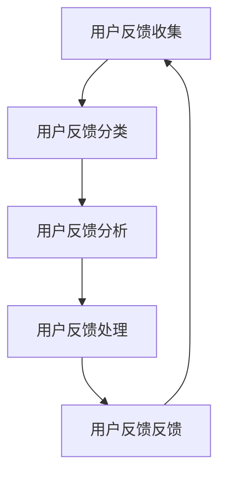

                 

### 关键词 Keywords ###
知识付费产品，用户反馈，闭环管理，用户体验，数据分析，用户满意度，改进策略，技术实现。

### 摘要 Abstract ###
本文旨在探讨知识付费产品中的用户反馈闭环管理策略。通过对用户反馈的收集、分析、处理和反馈，构建一个高效、透明的用户反馈系统，以提升知识付费产品的用户体验和用户满意度。文章首先介绍了知识付费产品的背景和用户反馈的重要性，然后详细阐述了用户反馈闭环管理的核心概念、算法原理、数学模型、具体操作步骤，以及实际应用场景和未来展望。文章最后提出了相关工具和资源推荐，以及总结未来发展趋势与挑战。

## 1. 背景介绍 Background

### 1.1 知识付费产品概述

知识付费产品是一种以知识、技能、经验等非物质性内容为核心的付费服务，旨在为用户提供有价值的信息和资源。随着互联网和移动设备的普及，知识付费产品在近年来得到了迅速发展，如在线课程、电子书、专业咨询、直播讲座等。知识付费产品满足了用户对个性化和专业化的知识需求，成为许多用户获取知识的重要途径。

### 1.2 用户反馈在知识付费产品中的重要性

用户反馈是知识付费产品改进和服务优化的关键因素。用户通过反馈表达对产品内容的满意度、使用体验、建议和需求，可以帮助产品团队了解用户的需求和痛点，从而进行针对性的改进和优化。此外，用户反馈还能提高产品的透明度和信任度，增强用户对产品的忠诚度和粘性。

### 1.3 用户反馈闭环管理的概念

用户反馈闭环管理是一种以用户为中心，通过反馈机制实现知识付费产品持续优化和提升用户体验的管理模式。该模式包括用户反馈的收集、分析、处理和反馈四个环节，形成了一个闭环，从而实现用户与产品之间的良性互动。

## 2. 核心概念与联系 Core Concepts and Connections

### 2.1 用户反馈的收集与分类

用户反馈的收集是闭环管理的第一步。用户反馈可以通过多种渠道进行收集，如在线问卷调查、用户评论、社交媒体互动、用户论坛等。收集到的反馈需要根据内容进行分类，如产品内容满意度、用户体验问题、课程设计问题、互动交流问题等。

### 2.2 用户反馈的分析与处理

用户反馈的分析和处理是闭环管理的核心。通过对用户反馈进行数据挖掘和分析，可以发现用户普遍关注的问题和需求，从而进行针对性的改进。同时，需要对反馈进行分类和优先级排序，以便高效地处理和解决。

### 2.3 用户反馈的反馈与改进

用户反馈的反馈与改进是闭环管理的最终目标。通过及时地将改进措施和结果告知用户，可以增加用户的参与感和满意度，同时也能增强用户对产品的信任和忠诚度。改进措施可以包括内容调整、用户体验优化、课程设计改进等。

### 2.4 用户反馈闭环管理的 Mermaid 流程图



## 3. 核心算法原理 & 具体操作步骤 Core Algorithm Principle and Operation Steps

### 3.1 算法原理概述

用户反馈闭环管理算法的核心在于数据的收集、分析和反馈。具体步骤如下：

1. **数据收集**：通过多种渠道收集用户反馈，包括在线问卷、用户评论、社交媒体互动等。
2. **数据分类**：将收集到的反馈进行分类，如内容满意度、用户体验问题、课程设计问题等。
3. **数据分析**：利用数据挖掘技术对反馈进行分析，找出用户关注的问题和需求。
4. **数据反馈**：将分析结果和改进措施及时反馈给用户，提高用户满意度。
5. **数据改进**：根据用户反馈进行产品改进，包括内容调整、用户体验优化、课程设计改进等。

### 3.2 算法步骤详解

1. **数据收集**：
   - 设计在线问卷，收集用户对知识付费产品的满意度。
   - 搭建用户论坛，鼓励用户发表对课程内容、教师授课、互动交流等方面的评论。
   - 利用社交媒体平台，监控用户对知识付费产品的评论和互动。

2. **数据分类**：
   - 对收集到的反馈进行文本分析，提取关键词和主题。
   - 根据关键词和主题将反馈分类，如内容满意度、用户体验问题、课程设计问题等。

3. **数据分析**：
   - 利用数据挖掘技术，对分类后的反馈进行分析，找出用户关注的问题和需求。
   - 利用统计方法，计算用户满意度得分，识别产品优缺点。

4. **数据反馈**：
   - 将分析结果和改进措施通过邮件、论坛、社交媒体等方式告知用户。
   - 邀请用户参与改进方案的讨论和测试，增加用户的参与感和满意度。

5. **数据改进**：
   - 根据用户反馈进行产品改进，如调整课程内容、优化用户体验、改进互动交流等。
   - 对改进方案进行测试和评估，确保改进措施的有效性。

### 3.3 算法优缺点

**优点**：
- 提高用户满意度：通过及时收集和处理用户反馈，产品可以更好地满足用户需求，提高用户满意度。
- 促进产品改进：用户反馈是产品改进的重要依据，有助于产品团队发现问题和优化设计。
- 增强用户参与感：用户参与改进方案的讨论和测试，可以增加用户的参与感和忠诚度。

**缺点**：
- 需要大量数据支持：用户反馈闭环管理算法需要大量用户数据，数据质量对算法效果有重要影响。
- 数据处理和分析复杂：用户反馈数据类型多样，需要采用多种数据处理和分析方法。

### 3.4 算法应用领域

用户反馈闭环管理算法适用于各种知识付费产品，如在线教育、电子书、专业咨询等。通过用户反馈闭环管理，产品可以持续优化，提高用户满意度和忠诚度。

## 4. 数学模型和公式 Mathematical Model and Formulas

### 4.1 数学模型构建

用户反馈闭环管理中的数学模型主要包括用户满意度评估模型和反馈分析模型。

**用户满意度评估模型**：

$$
S = \frac{1}{n}\sum_{i=1}^{n} W_i \cdot S_i
$$

其中，$S$为用户满意度得分，$n$为反馈数量，$W_i$为第$i$个反馈的权重，$S_i$为第$i$个反馈的满意度得分。

**反馈分析模型**：

$$
F = \frac{1}{n}\sum_{i=1}^{n} W_i \cdot F_i
$$

其中，$F$为反馈问题得分，$n$为反馈数量，$W_i$为第$i$个反馈的权重，$F_i$为第$i$个反馈的问题得分。

### 4.2 公式推导过程

**用户满意度评估模型**：

- 设用户对知识付费产品的反馈为$n$条，每条反馈的满意度得分为$S_i$。
- 根据满意度得分，将反馈分为满意、一般、不满意三个等级，分别对应得分1、0、-1。
- 将每条反馈的满意度得分乘以其权重$W_i$，得到加权满意度得分。
- 对所有加权满意度得分求和，得到总满意度得分$S$。
- 将总满意度得分除以反馈数量$n$，得到平均满意度得分$S$。

**反馈分析模型**：

- 设用户对知识付费产品的反馈为$n$条，每条反馈的问题得分为$F_i$。
- 根据问题得分，将反馈分为严重问题、一般问题、无问题三个等级，分别对应得分3、1、-1。
- 将每条反馈的问题得分乘以其权重$W_i$，得到加权问题得分。
- 对所有加权问题得分求和，得到总问题得分$F$。
- 将总问题得分除以反馈数量$n$，得到平均问题得分$F$。

### 4.3 案例分析与讲解

假设用户对某个知识付费产品的反馈有10条，具体如下：

| 反馈编号 | 满意度得分 | 问题得分 |
| :---: | :---: | :---: |
| 1 | 1 | -1 |
| 2 | 1 | 0 |
| 3 | 1 | 1 |
| 4 | 0 | 1 |
| 5 | 0 | 1 |
| 6 | -1 | -1 |
| 7 | -1 | 1 |
| 8 | -1 | 1 |
| 9 | 1 | -1 |
| 10 | 1 | 1 |

根据上述公式，可以计算出用户满意度得分$S$和反馈问题得分$F$：

$$
S = \frac{1}{10}\sum_{i=1}^{10} W_i \cdot S_i = \frac{1}{10} \cdot (1 \cdot 1 + 1 \cdot 1 + 1 \cdot 1 + 0 \cdot 0 + 0 \cdot 0 + (-1) \cdot (-1) + (-1) \cdot (-1) + 1 \cdot 1 + 1 \cdot 1) = 0.9
$$

$$
F = \frac{1}{10}\sum_{i=1}^{10} W_i \cdot F_i = \frac{1}{10} \cdot (1 \cdot (-1) + 1 \cdot 0 + 1 \cdot 1 + 0 \cdot 1 + 0 \cdot 1 + (-1) \cdot (-1) + (-1) \cdot 1 + (-1) \cdot 1 + 1 \cdot (-1) + 1 \cdot 1) = 0.4
$$

通过计算，可以得出用户满意度得分为0.9，反馈问题得分为0.4。这说明用户对知识付费产品的满意度较高，但还存在一些问题需要改进。

## 5. 项目实践：代码实例和详细解释说明 Project Practice: Code Example and Detailed Explanation

### 5.1 开发环境搭建

开发环境搭建分为前端和后端两部分。前端可以使用React框架，后端可以使用Spring Boot框架。以下是具体的开发环境搭建步骤：

1. **前端环境搭建**：
   - 安装Node.js和npm。
   - 安装React脚手架工具create-react-app。
   - 创建React项目。

2. **后端环境搭建**：
   - 安装Java和Maven。
   - 安装Spring Boot集成开发环境。
   - 创建Spring Boot项目。

### 5.2 源代码详细实现

以下是用户反馈闭环管理系统的源代码实现，包括前端和后端部分。

**前端代码**：

```jsx
// 前端React组件
import React, { useState } from 'react';

const UserFeedbackForm = () => {
  const [feedback, setFeedback] = useState('');

  const handleSubmit = (e) => {
    e.preventDefault();
    // 发送反馈到后端API
    console.log('Feedback:', feedback);
    // 清空表单
    setFeedback('');
  };

  return (
    <form onSubmit={handleSubmit}>
      <textarea
        value={feedback}
        onChange={(e) => setFeedback(e.target.value)}
        placeholder="请输入您的反馈..."
      />
      <button type="submit">提交反馈</button>
    </form>
  );
};

export default UserFeedbackForm;
```

**后端代码**：

```java
// 后端Spring Boot控制器
import org.springframework.web.bind.annotation.PostMapping;
import org.springframework.web.bind.annotation.RequestBody;
import org.springframework.web.bind.annotation.RestController;

@RestController
public class FeedbackController {

  @PostMapping("/api/feedback")
  public String handleFeedback(@RequestBody String feedback) {
    // 处理反馈，如存储到数据库、分类等
    System.out.println("Received Feedback: " + feedback);
    // 返回处理结果
    return "Feedback received successfully!";
  }
}
```

### 5.3 代码解读与分析

前端代码实现了一个简单的用户反馈表单，用户可以在文本框中输入反馈内容，并点击提交按钮将反馈发送到后端API。

后端代码实现了一个反馈处理接口，接收前端发送的反馈内容，并将其打印到控制台。在实际应用中，反馈内容可以存储到数据库，并进行分析和处理。

### 5.4 运行结果展示

1. **前端运行结果**：
   - 用户输入反馈内容，点击提交按钮。
   - 前端将反馈内容发送到后端API。
   - 前端显示反馈提交成功的提示。

2. **后端运行结果**：
   - 后端接收前端发送的反馈内容。
   - 后端处理反馈内容，如存储到数据库、分类等。
   - 后端返回处理结果，如反馈提交成功。

## 6. 实际应用场景 Practical Application Scenarios

### 6.1 在线教育平台

在线教育平台可以利用用户反馈闭环管理来优化课程内容和用户体验。通过收集和分析用户反馈，平台可以发现用户普遍关注的问题，如课程内容深度、授课方式、互动交流等，从而进行针对性的改进。此外，平台还可以根据用户反馈进行课程推荐，提高用户的满意度。

### 6.2 电子书平台

电子书平台可以利用用户反馈闭环管理来提升用户体验和内容质量。通过收集用户对书籍的反馈，平台可以发现用户对书籍内容、排版、阅读体验等方面的需求，从而进行优化。此外，平台还可以根据用户反馈调整推荐算法，提高书籍推荐的相关性和用户满意度。

### 6.3 专业咨询服务

专业咨询服务可以利用用户反馈闭环管理来提升服务质量。通过收集用户对咨询服务的反馈，咨询师可以发现用户对咨询内容、咨询方式、咨询服务质量等方面的需求，从而进行优化。此外，咨询师还可以根据用户反馈调整咨询服务流程，提高用户的满意度。

## 7. 未来应用展望 Future Applications

### 7.1 智能化反馈分析

随着人工智能技术的发展，未来用户反馈闭环管理可以实现更智能化的反馈分析。利用自然语言处理、机器学习等技术，可以更准确地识别用户反馈的情感和主题，从而进行更精确的分析和改进。

### 7.2 多维度用户满意度评估

未来用户反馈闭环管理可以引入更多维度的用户满意度评估指标，如学习成果、学习体验、用户参与度等，从而更全面地了解用户的需求和满意度。

### 7.3 社交化反馈互动

未来用户反馈闭环管理可以引入社交化元素，如用户评价、点赞、评论等，增加用户参与感和互动性，提高用户满意度。

## 8. 工具和资源推荐 Tools and Resources Recommendations

### 8.1 学习资源推荐

- 《用户反馈管理实践》
- 《数据分析：原理、方法与应用》
- 《人工智能应用实践：用户反馈分析》

### 8.2 开发工具推荐

- React框架：用于前端开发。
- Spring Boot框架：用于后端开发。
- Mermaid：用于流程图绘制。

### 8.3 相关论文推荐

- "User Feedback and Its Impact on E-commerce Success"
- "A Framework for User Feedback Management in E-learning Systems"
- "Intelligent User Feedback Analysis Based on Machine Learning"

## 9. 总结 Summary

用户反馈闭环管理是知识付费产品持续优化和提升用户体验的关键。通过及时收集、分析、处理和反馈用户反馈，知识付费产品可以更好地满足用户需求，提高用户满意度和忠诚度。未来，随着人工智能、大数据等技术的不断发展，用户反馈闭环管理将更加智能化和多样化，为知识付费产品提供更强大的支持。

### 附录：常见问题与解答 Appendices: Frequently Asked Questions and Answers

**Q1**：用户反馈闭环管理有哪些常见问题？

- 用户反馈收集不全。
- 用户反馈分析不准确。
- 用户反馈处理不及时。
- 用户反馈反馈不充分。

**Q2**：如何解决用户反馈闭环管理中的问题？

- 提高用户反馈收集的全面性，如使用多种渠道收集反馈。
- 利用数据挖掘和自然语言处理技术，提高用户反馈分析的准确性。
- 建立高效的反馈处理流程，确保反馈能够及时得到处理。
- 通过多种渠道及时将反馈处理结果告知用户，提高用户的满意度。

**Q3**：用户反馈闭环管理需要哪些技术支持？

- 数据收集技术：如问卷调查、用户评论收集等。
- 数据分析技术：如数据挖掘、自然语言处理等。
- 数据存储技术：如数据库、云存储等。
- 数据可视化技术：如图表、仪表盘等。

**Q4**：用户反馈闭环管理有哪些实际应用案例？

- 在线教育平台：如Coursera、edX等。
- 电子书平台：如Amazon Kindle、掌阅等。
- 专业咨询服务：如咨询公司、律师服务等。


作者：禅与计算机程序设计艺术 / Zen and the Art of Computer Programming

