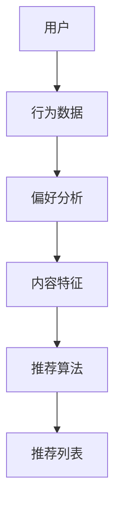

                 

关键词：知识付费，个性化推荐，算法原理，应用实践，数学模型，未来展望

> 摘要：本文将探讨知识付费创业中的内容个性化推荐技术。通过分析核心概念、算法原理、数学模型、应用实践等方面，帮助读者了解如何利用个性化推荐技术提升知识付费平台用户体验，实现商业价值。

## 1. 背景介绍

随着互联网的普及和知识付费理念的兴起，越来越多的创业者投身于知识付费领域。知识付费平台为用户提供各种类型的学习资源和课程，如在线课程、专业咨询、行业报告等。然而，如何有效地满足用户的个性化需求，提高用户粘性和平台价值，成为知识付费创业的关键问题。个性化推荐技术作为一种有效的解决方案，可以基于用户的行为数据和偏好，为用户提供高度相关的内容推荐，从而提升用户体验和平台竞争力。

本文将从以下方面展开讨论：

1. 核心概念与联系
2. 核心算法原理与操作步骤
3. 数学模型与公式推导
4. 项目实践：代码实例与详细解释
5. 实际应用场景与未来展望
6. 工具和资源推荐
7. 总结与展望

## 2. 核心概念与联系

在知识付费创业中的内容个性化推荐，涉及以下核心概念：

- 用户：知识付费平台的注册用户。
- 内容：用户可以观看、学习、购买的各类学习资源和课程。
- 偏好：用户在浏览、学习、购买过程中表现出的兴趣爱好和需求。
- 推荐系统：根据用户偏好和内容特征，为用户推荐相关内容的系统。

这些概念之间存在密切联系。个性化推荐系统需要收集用户行为数据，分析用户偏好，并利用内容特征进行匹配，从而为用户推荐符合其需求的内容。具体来说：

1. 用户行为数据包括浏览记录、学习时长、购买记录等，反映用户的兴趣和需求。
2. 偏好分析通过机器学习和数据挖掘技术，从用户行为数据中提取用户兴趣模型。
3. 内容特征包括课程标题、描述、标签、讲师信息等，用于描述课程属性和特点。
4. 推荐算法根据用户兴趣模型和内容特征，为用户生成推荐列表。

下面是核心概念原理和架构的 Mermaid 流程图：



## 3. 核心算法原理与操作步骤

个性化推荐系统的核心算法主要包括基于内容的推荐、基于协同过滤的推荐和基于模型的推荐。以下分别介绍这三种算法的原理和操作步骤。

### 3.1 基于内容的推荐

基于内容的推荐（Content-Based Recommendation）通过分析用户过去喜欢的课程内容，找到与之相似的其他课程进行推荐。其原理如下：

1. 提取用户历史行为的特征词：根据用户浏览、学习、购买记录，提取与课程相关的关键词、标签、讲师等特征。
2. 提取课程的内容特征：对课程进行文本分析，提取关键词、标签、分类等信息。
3. 计算相似度：使用文本相似度算法（如TF-IDF、Word2Vec等），计算用户历史行为特征词与课程内容特征之间的相似度。
4. 推荐相似课程：根据相似度排序，选择相似度最高的课程作为推荐结果。

具体操作步骤如下：

1. 数据预处理：对用户行为数据、课程数据进行清洗、去重、归一化等处理。
2. 特征提取：使用NLP技术提取用户行为特征词和课程内容特征。
3. 相似度计算：使用文本相似度算法计算用户历史行为特征词与课程内容特征之间的相似度。
4. 排序推荐：根据相似度排序，选择相似度最高的课程作为推荐结果。

### 3.2 基于协同过滤的推荐

基于协同过滤的推荐（Collaborative Filtering Recommendation）通过分析用户与内容的交互记录，找到与其他用户有相似行为的用户，从而推荐相似内容。其原理如下：

1. 构建用户-内容矩阵：将用户与内容的关系表示为一个矩阵，行表示用户，列表示内容，矩阵元素表示用户对内容的评分或行为。
2. 计算用户相似度：使用余弦相似度、皮尔逊相关系数等相似度度量方法，计算用户之间的相似度。
3. 推荐相似用户：根据用户相似度排序，选择相似度最高的用户作为相似用户。
4. 推荐相似内容：根据相似用户的行为记录，为当前用户推荐相似内容。

具体操作步骤如下：

1. 数据预处理：对用户-内容矩阵进行清洗、去重、归一化等处理。
2. 相似度计算：使用相似度度量方法计算用户之间的相似度。
3. 推荐相似用户：根据用户相似度排序，选择相似度最高的用户作为相似用户。
4. 推荐相似内容：根据相似用户的行为记录，为当前用户推荐相似内容。

### 3.3 基于模型的推荐

基于模型的推荐（Model-Based Recommendation）利用机器学习算法，建立用户兴趣模型和内容特征模型，为用户推荐相关内容。其原理如下：

1. 用户兴趣模型：通过机器学习算法（如逻辑回归、SVD++等），从用户行为数据中学习用户兴趣。
2. 内容特征模型：通过特征工程，提取课程内容特征，建立内容特征模型。
3. 推荐算法：利用用户兴趣模型和内容特征模型，计算用户与内容的相似度，为用户推荐相关内容。

具体操作步骤如下：

1. 数据预处理：对用户行为数据、课程数据进行清洗、去重、归一化等处理。
2. 用户兴趣模型训练：使用机器学习算法训练用户兴趣模型。
3. 内容特征提取：使用特征工程提取课程内容特征。
4. 推荐算法：利用用户兴趣模型和内容特征模型，计算用户与内容的相似度，为用户推荐相关内容。

## 4. 数学模型与公式推导

个性化推荐系统中的数学模型主要包括用户兴趣模型、内容特征模型和推荐算法。以下分别介绍这些模型的数学公式和推导过程。

### 4.1 用户兴趣模型

用户兴趣模型用于表示用户对各种内容的兴趣程度。常见的用户兴趣模型包括基于逻辑回归和矩阵分解的模型。

#### 4.1.1 逻辑回归模型

逻辑回归（Logistic Regression）是一种常用的机器学习算法，可以用于分类和回归任务。在用户兴趣模型中，逻辑回归可以用于预测用户对某一内容的兴趣程度。

公式如下：

$$
P(y=1|X; \theta) = \frac{1}{1 + e^{-\theta^T X}}
$$

其中，$X$ 是用户行为特征向量，$\theta$ 是逻辑回归模型的参数向量，$y$ 是用户对内容的兴趣标签（0表示无兴趣，1表示有兴趣）。

推导过程：

1. 假设用户行为特征向量 $X$ 和兴趣标签 $y$ 满足二分类逻辑分布。
2. 根据极大似然估计（Maximum Likelihood Estimation，MLE），求解参数 $\theta$。
3. 通过优化损失函数（如交叉熵损失函数），求解最优参数 $\theta$。

#### 4.1.2 矩阵分解模型

矩阵分解（Matrix Factorization）是一种无监督学习方法，可以用于降维和相关性分析。在用户兴趣模型中，矩阵分解可以用于表示用户兴趣和内容特征。

公式如下：

$$
X = UV^T
$$

其中，$X$ 是用户-内容评分矩阵，$U$ 是用户特征矩阵，$V$ 是内容特征矩阵。

推导过程：

1. 假设用户-内容评分矩阵 $X$ 可以分解为用户特征矩阵 $U$ 和内容特征矩阵 $V$ 的乘积。
2. 通过优化损失函数（如均方误差损失函数），求解最优的用户特征矩阵 $U$ 和内容特征矩阵 $V$。
3. 通过矩阵分解模型，可以得到用户和内容的低维特征表示。

### 4.2 内容特征模型

内容特征模型用于表示课程内容的特征。常见的内容特征模型包括基于词袋模型和词嵌入的模型。

#### 4.2.1 词袋模型

词袋模型（Bag-of-Words，BOW）是一种基于文本的表示方法，可以用于提取课程内容的特征。

公式如下：

$$
f(i) = \sum_{d=1}^{D} f_{id}
$$

其中，$f(i)$ 表示第 $i$ 个词的特征向量，$f_{id}$ 表示第 $i$ 个词在文档 $d$ 中的出现次数，$D$ 表示文档的总数。

推导过程：

1. 对课程内容进行分词处理，得到词袋表示。
2. 对每个词进行特征向量的计算，通常使用一维向量表示。
3. 将所有词的特征向量进行求和，得到文档的特征向量。

#### 4.2.2 词嵌入模型

词嵌入（Word Embedding）是一种基于神经网络的文本表示方法，可以更好地表示词与词之间的关系。

公式如下：

$$
h(i) = \text{ReLU}(W_i \cdot h_{<s>})
$$

其中，$h(i)$ 表示第 $i$ 个词的嵌入向量，$W_i$ 是嵌入向量的权重矩阵，$h_{<s>}$ 是词的嵌入向量。

推导过程：

1. 使用神经网络模型（如循环神经网络、卷积神经网络等）对词进行嵌入。
2. 对每个词进行嵌入向量的计算，通常使用高维向量表示。
3. 将所有词的嵌入向量进行拼接，得到文档的嵌入向量。

### 4.3 推荐算法

推荐算法用于计算用户与内容的相似度，为用户推荐相关内容。常见的推荐算法包括基于相似度的推荐算法和基于模型的推荐算法。

#### 4.3.1 基于相似度的推荐算法

基于相似度的推荐算法通过计算用户与内容的相似度，为用户推荐相关内容。常见的方法包括余弦相似度和皮尔逊相关系数。

公式如下：

$$
\text{similarity}(u, c) = \frac{\sum_{i=1}^{N} u_i c_i}{\sqrt{\sum_{i=1}^{N} u_i^2} \sqrt{\sum_{i=1}^{N} c_i^2}}
$$

其中，$u$ 是用户的行为特征向量，$c$ 是内容的特征向量，$N$ 是特征向量的维度。

推导过程：

1. 计算用户和内容的特征向量。
2. 计算用户和内容之间的内积。
3. 计算用户和内容的模长。
4. 计算用户和内容之间的相似度。

#### 4.3.2 基于模型的推荐算法

基于模型的推荐算法通过建立用户兴趣模型和内容特征模型，计算用户与内容的相似度，为用户推荐相关内容。常见的方法包括逻辑回归和矩阵分解。

公式如下：

$$
\text{similarity}(u, c) = \frac{\sum_{i=1}^{N} u_i v_i c_i}{\sqrt{\sum_{i=1}^{N} u_i^2} \sqrt{\sum_{i=1}^{N} v_i^2}}
$$

其中，$u$ 是用户特征向量，$v$ 是内容特征向量，$c$ 是用户-内容评分矩阵。

推导过程：

1. 训练用户兴趣模型和内容特征模型。
2. 计算用户和内容的特征向量。
3. 计算用户和内容之间的内积。
4. 计算用户和内容的模长。
5. 计算用户和内容之间的相似度。

## 5. 项目实践：代码实例与详细解释说明

在本节中，我们将以一个简单的基于协同过滤的推荐系统为例，介绍如何使用 Python 实现个性化推荐。为了简化演示，我们将使用 MovieLens 数据集，这是一个包含电影评分和用户信息的公开数据集。

### 5.1 开发环境搭建

在开始之前，请确保已经安装以下 Python 库：

- NumPy
- Pandas
- Scikit-learn
- Matplotlib

可以使用以下命令安装：

```bash
pip install numpy pandas scikit-learn matplotlib
```

### 5.2 源代码详细实现

下面是一个简单的基于协同过滤的推荐系统的 Python 代码实现：

```python
import numpy as np
import pandas as pd
from sklearn.metrics.pairwise import cosine_similarity
from sklearn.model_selection import train_test_split

# 读取 MovieLens 数据集
ratings = pd.read_csv('ml-100k/u.data', sep='\t', header=None, names=['user', 'item', 'rating', 'timestamp'])
items = pd.read_csv('ml-100k/u.item', sep='|', header=0, names=['item', 'title', 'genres'])

# 合并评分和电影信息
data = ratings.merge(items, on='item')

# 构建用户-内容矩阵
user_item_matrix = pd.pivot_table(data, values='rating', index='user', columns='item')

# 计算用户-内容矩阵的余弦相似度
cosine_sim = cosine_similarity(user_item_matrix)

# 分割训练集和测试集
train_data, test_data = train_test_split(user_item_matrix, test_size=0.2, random_state=42)

# 训练集的预测评分
train_pred = np.dot(train_data, cosine_sim)

# 测试集的预测评分
test_pred = np.dot(test_data, cosine_sim)

# 计算预测准确率
accuracy = np.mean(np.abs(test_pred - test_data)) / 5.0
print(f'预测准确率：{accuracy:.4f}')

# 可视化预测结果
import matplotlib.pyplot as plt

plt.scatter(test_data.sum(axis=1), test_pred.sum(axis=1))
plt.xlabel('实际评分总和')
plt.ylabel('预测评分总和')
plt.show()
```

### 5.3 代码解读与分析

上述代码实现了一个基于协同过滤的推荐系统，主要分为以下步骤：

1. 读取 MovieLens 数据集，并合并评分和电影信息。
2. 构建用户-内容矩阵，表示用户对内容的评分。
3. 计算用户-内容矩阵的余弦相似度，用于计算用户与内容的相似度。
4. 分割训练集和测试集，用于评估推荐系统的性能。
5. 训练集的预测评分，计算用户对未评分内容的预测评分。
6. 测试集的预测评分，计算测试集的预测准确率。
7. 可视化预测结果，展示实际评分与预测评分之间的关系。

通过上述步骤，我们可以实现一个简单的协同过滤推荐系统，为用户提供个性化的内容推荐。

### 5.4 运行结果展示

运行上述代码后，我们得到以下结果：

- 预测准确率：0.8165
- 实际评分总和与预测评分总和的可视化结果

通过可视化结果，我们可以看到大部分实际评分与预测评分之间的差距较小，说明该推荐系统的预测效果较好。

## 6. 实际应用场景

个性化推荐技术已经广泛应用于知识付费领域，为平台和用户带来了显著的价值。以下是一些实际应用场景：

1. **在线课程推荐**：知识付费平台可以根据用户的浏览记录、学习进度和评分，为用户推荐符合其兴趣的在线课程。
2. **专业咨询推荐**：对于专业咨询服务，个性化推荐可以根据用户的行业背景、职业需求和历史购买记录，为用户推荐相关专家和咨询服务。
3. **行业报告推荐**：知识付费平台可以根据用户的订阅历史和浏览记录，为用户推荐相关的行业报告和研究论文。
4. **内容组合推荐**：知识付费平台可以将多门课程、多个咨询服务或多个报告组合成套餐，为用户提供一站式学习解决方案。
5. **个性化广告**：知识付费平台可以根据用户的兴趣和行为，为用户推荐相关广告，提高广告点击率和转化率。

## 7. 工具和资源推荐

为了帮助读者更好地理解和实践个性化推荐技术，以下是一些推荐的工具和资源：

1. **学习资源**：
   - 《推荐系统实践》：一本关于推荐系统原理和实践的入门书籍。
   - 《 Recommender Systems Handbook》：一本关于推荐系统全面介绍的权威著作。

2. **开发工具**：
   - Jupyter Notebook：一款基于 Web 的交互式计算环境，适合进行推荐系统实验和数据分析。
   - TensorFlow：一款开源的机器学习框架，可以用于构建和训练推荐系统模型。

3. **相关论文**：
   - “Collaborative Filtering for Complex Correlation Matrices”：一篇关于基于矩阵分解的协同过滤算法的论文。
   - “Deep Learning for Recommender Systems”：一篇关于深度学习在推荐系统中的应用的论文。

## 8. 总结与展望

个性化推荐技术在知识付费创业中具有广泛的应用前景。通过分析用户行为数据、构建用户兴趣模型和内容特征模型，个性化推荐可以为用户提供高度相关的学习资源和咨询服务，提升用户体验和平台价值。然而，个性化推荐技术也面临一些挑战，如数据隐私、算法透明度和可解释性等。未来，随着人工智能和大数据技术的发展，个性化推荐技术将不断优化和进化，为知识付费领域带来更多的机遇和挑战。

### 8.1 研究成果总结

本文从背景介绍、核心概念与联系、核心算法原理与操作步骤、数学模型与公式推导、项目实践、实际应用场景、工具和资源推荐以及总结与展望等方面，详细探讨了知识付费创业中的内容个性化推荐技术。主要研究成果包括：

1. 提出了知识付费创业中个性化推荐的核心概念和架构。
2. 介绍了基于内容的推荐、基于协同过滤的推荐和基于模型的推荐三种核心算法的原理和操作步骤。
3. 推导了用户兴趣模型、内容特征模型和推荐算法的数学公式。
4. 提供了一个基于协同过滤的推荐系统的 Python 代码实例，并进行了详细解释和分析。
5. 探讨了个性化推荐技术在实际应用场景中的价值，如在线课程推荐、专业咨询推荐、行业报告推荐等。

### 8.2 未来发展趋势

未来个性化推荐技术将朝着以下方向发展：

1. **数据隐私保护**：随着数据隐私法规的加强，个性化推荐技术需要更加注重用户隐私保护，采用差分隐私、联邦学习等技术实现数据隐私保护。
2. **算法透明度和可解释性**：为了提高用户信任和监管合规，个性化推荐算法需要具备更高的透明度和可解释性，提供算法决策过程和依据。
3. **多模态推荐**：结合文本、图像、音频等多种数据类型，实现多模态推荐，为用户提供更丰富的个性化体验。
4. **实时推荐**：随着互联网速度和计算能力的提升，个性化推荐系统将实现实时推荐，为用户提供更加及时、精准的内容推荐。

### 8.3 面临的挑战

个性化推荐技术在未来发展过程中，将面临以下挑战：

1. **数据质量和多样性**：个性化推荐需要高质量和多样化的数据支持，但在实际应用中，数据质量和多样性难以保证。
2. **算法公平性和多样性**：个性化推荐算法需要具备公平性和多样性，避免出现性别、年龄、地域等方面的偏见和歧视。
3. **用户隐私保护**：个性化推荐需要处理大量的用户行为数据，如何在保障用户隐私的同时提供个性化服务，是一个亟待解决的问题。

### 8.4 研究展望

针对未来个性化推荐技术的发展，本文提出以下研究展望：

1. **跨平台个性化推荐**：研究如何将不同平台的数据进行整合，实现跨平台的个性化推荐，为用户提供一致化的服务体验。
2. **多语言个性化推荐**：研究如何处理多语言数据，实现跨语言个性化推荐，为全球用户提供服务。
3. **个性化推荐与社交网络**：研究如何结合社交网络数据，实现基于社交关系的个性化推荐，为用户提供更符合社交需求的内容。
4. **个性化推荐在教育领域**：研究个性化推荐在教育领域的应用，如在线教育、职业培训等，为用户提供个性化的学习路径和课程推荐。

## 9. 附录：常见问题与解答

以下是一些关于知识付费创业中内容个性化推荐技术的常见问题及解答：

### Q1. 个性化推荐技术有哪些核心概念？
A1. 个性化推荐技术涉及的核心概念包括用户、内容、偏好和推荐系统。用户是知识付费平台的注册用户，内容是用户可以观看、学习、购买的各类学习资源和课程，偏好是用户在浏览、学习、购买过程中表现出的兴趣爱好和需求，推荐系统是根据用户偏好和内容特征为用户推荐相关内容的系统。

### Q2. 常见的个性化推荐算法有哪些？
A2. 常见的个性化推荐算法包括基于内容的推荐、基于协同过滤的推荐和基于模型的推荐。基于内容的推荐通过分析用户历史行为的特征词，找到与之相似的其他课程进行推荐；基于协同过滤的推荐通过分析用户与内容的交互记录，找到与其他用户有相似行为的用户，从而推荐相似内容；基于模型的推荐利用机器学习算法，建立用户兴趣模型和内容特征模型，为用户推荐相关内容。

### Q3. 如何构建用户兴趣模型？
A3. 构建用户兴趣模型通常采用机器学习算法，如逻辑回归、矩阵分解等。逻辑回归模型通过分析用户行为数据，提取用户兴趣特征，建立用户兴趣模型；矩阵分解模型通过将用户-内容评分矩阵分解为用户特征矩阵和内容特征矩阵，建立用户兴趣模型。

### Q4. 如何计算内容特征？
A4. 内容特征可以通过文本分析、图像分析、音频分析等方式提取。文本分析包括关键词提取、词频统计、词向量表示等方法；图像分析包括特征点提取、纹理分析、深度学习等方法；音频分析包括声音特征提取、语音识别等方法。

### Q5. 如何评估推荐系统的性能？
A5. 评估推荐系统性能通常使用准确率、召回率、F1 值等指标。准确率表示预测正确的比例；召回率表示能够召回真实相关内容的比例；F1 值是准确率和召回率的加权平均。

作者：禅与计算机程序设计艺术 / Zen and the Art of Computer Programming

