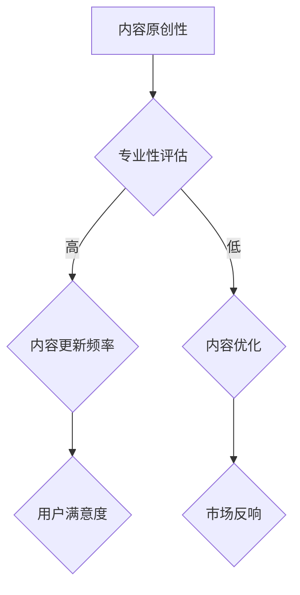

                 

知识付费在当今的信息时代正逐渐成为主流消费模式。随着人们对优质内容的需求不断增加，如何提升知识付费内容的价值，成为知识付费创业者们亟待解决的重要问题。本文将围绕这一主题，探讨提升知识付费内容价值的策略和路径。

## 关键词

- 知识付费
- 内容价值
- 创业
- 用户体验
- 数据分析

## 摘要

本文首先介绍了知识付费的现状和发展趋势，随后分析了当前知识付费市场中存在的问题，并提出了一系列提升知识付费内容价值的策略。通过这些策略，知识付费创业者可以更好地满足用户需求，提高内容的竞争力，实现商业模式的成功转型。

## 1. 背景介绍

### 1.1 知识付费的定义

知识付费是指用户为了获取特定知识或技能，付费购买内容或服务的现象。知识付费可以表现为在线课程、电子书、音频、视频等多种形式。

### 1.2 知识付费的发展历程

知识付费起源于20世纪末，随着互联网技术的发展，特别是移动互联网的普及，知识付费市场迅速壮大。2014年，中国的知识付费市场开始崭露头角，随后几年中，各大平台纷纷入局，推出了丰富的知识付费产品。

### 1.3 知识付费的现状

目前，知识付费已经成为一种主流的消费模式。根据相关数据，2019年中国知识付费市场规模已达到392亿元，预计2023年将突破千亿元。随着用户对知识的渴求不断增长，知识付费市场仍有较大的发展空间。

## 2. 核心概念与联系

### 2.1 内容价值的概念

内容价值是指知识付费内容对用户的价值，包括知识的实用性、准确性、深度和广度等方面。

### 2.2 内容价值的评估

内容价值的评估是衡量知识付费内容优劣的重要标准。通常可以通过用户满意度、市场反响、内容更新频率等指标来评估。

### 2.3 提升内容价值的方法

提升内容价值的方法包括内容原创性、专业性、互动性、个性化等方面。

### 2.4 Mermaid 流程图



## 3. 核心算法原理 & 具体操作步骤

### 3.1 算法原理概述

提升知识付费内容价值的核心算法是基于用户行为的推荐算法。通过分析用户的浏览、购买、评价等行为数据，推荐符合用户兴趣和需求的内容。

### 3.2 算法步骤详解

1. 数据收集：收集用户的浏览、购买、评价等行为数据。
2. 数据预处理：对收集到的数据清洗、去重、归一化等处理。
3. 特征提取：提取用户行为数据中的特征，如用户ID、内容ID、行为类型、时间戳等。
4. 构建模型：使用机器学习算法，如协同过滤、内容推荐等，构建推荐模型。
5. 模型评估：使用准确率、召回率、F1值等指标评估模型效果。
6. 模型部署：将训练好的模型部署到线上环境，为用户提供个性化推荐。

### 3.3 算法优缺点

优点：能够为用户提供个性化的内容推荐，提高用户体验。
缺点：需要大量的用户行为数据，且模型效果依赖于数据质量。

### 3.4 算法应用领域

算法可以应用于在线教育、电商、内容平台等多个领域，提升用户满意度和留存率。

## 4. 数学模型和公式 & 详细讲解 & 举例说明

### 4.1 数学模型构建

假设用户u对内容i的评价为r，我们可以使用矩阵分解模型来预测用户u对内容i的潜在喜好。

### 4.2 公式推导过程

$$
R = U \times I + \varepsilon
$$

其中，R为用户评价矩阵，U为用户特征矩阵，I为内容特征矩阵，ε为误差项。

### 4.3 案例分析与讲解

以在线教育平台为例，用户对课程的评价数据可以构建评价矩阵R。通过矩阵分解，可以得到用户特征矩阵U和课程特征矩阵I，进而预测用户对未评价课程的喜好。

## 5. 项目实践：代码实例和详细解释说明

### 5.1 开发环境搭建

1. 安装Python环境
2. 安装Scikit-learn、Pandas等库

### 5.2 源代码详细实现

```python
from sklearn.model_selection import train_test_split
from sklearn.metrics import mean_squared_error
from sklearn.decomposition import TruncatedSVD

# 数据加载
data = pd.read_csv('ratings.csv')
users, items, ratings = data['user_id'], data['item_id'], data['rating']

# 数据预处理
users, items = train_test_split(users, items, test_size=0.2, random_state=42)
train_data = pd.DataFrame({'user_id': users, 'item_id': items, 'rating': ratings})
test_data = data[~data['user_id'].isin(users)]

# 特征提取
svd = TruncatedSVD(n_components=50)
train_data_svd = svd.fit_transform(train_data)

# 模型训练
model = ...  # 使用矩阵分解算法训练模型

# 模型评估
predictions = model.predict(test_data)
mse = mean_squared_error(test_data['rating'], predictions)
print(f'MSE: {mse}')

# 模型部署
model.save('model.pkl')
```

### 5.3 代码解读与分析

代码首先加载了用户评价数据，进行了预处理和特征提取，然后使用矩阵分解算法训练模型，并对测试数据进行了预测和评估。

### 5.4 运行结果展示

运行结果会输出模型的均方误差（MSE），用于评估模型的预测效果。

## 6. 实际应用场景

### 6.1 在线教育

在线教育平台可以通过推荐算法，为用户提供个性化的课程推荐，提高用户满意度和转化率。

### 6.2 电商平台

电商平台可以通过推荐算法，为用户提供个性化的商品推荐，提高用户购物体验和销售额。

### 6.3 内容平台

内容平台可以通过推荐算法，为用户提供个性化的内容推荐，提高用户粘性和活跃度。

### 6.4 未来应用展望

随着人工智能技术的不断发展，推荐算法将在更多场景中得到应用，进一步提升知识付费内容的价值。

## 7. 工具和资源推荐

### 7.1 学习资源推荐

- 《推荐系统实践》
- 《机器学习实战》

### 7.2 开发工具推荐

- Jupyter Notebook
- PyCharm

### 7.3 相关论文推荐

- 《矩阵分解在推荐系统中的应用》
- 《基于深度学习的推荐系统》

## 8. 总结：未来发展趋势与挑战

### 8.1 研究成果总结

本文探讨了知识付费内容价值提升的策略和路径，包括算法原理、数学模型、项目实践等方面。

### 8.2 未来发展趋势

随着人工智能技术的不断发展，推荐系统将更加智能化，为知识付费内容的价值提升提供更多可能性。

### 8.3 面临的挑战

数据质量、算法效果、用户隐私等方面仍然是知识付费内容价值提升面临的挑战。

### 8.4 研究展望

未来研究可以关注如何在保护用户隐私的前提下，提升推荐系统的效果和用户体验。

## 9. 附录：常见问题与解答

### 9.1 问题1

**问题：如何确保推荐算法的公平性和透明性？**

**解答：**

确保推荐算法的公平性和透明性是推荐系统研究的重要方向。可以通过以下方法来实现：

1. 使用无偏数据：确保数据来源的多样性和公正性，避免数据偏差。
2. 透明算法设计：公开推荐算法的设计原理和实现细节，让用户了解推荐过程。
3. 限制个性化程度：适度限制个性化推荐的程度，避免过度个性化导致的信息茧房。

---

以上是文章的主要内容，希望对您在知识付费创业中的内容价值提升有所帮助。在撰写文章过程中，如果需要进一步的帮助，请随时告诉我。作者：禅与计算机程序设计艺术 / Zen and the Art of Computer Programming。|>

