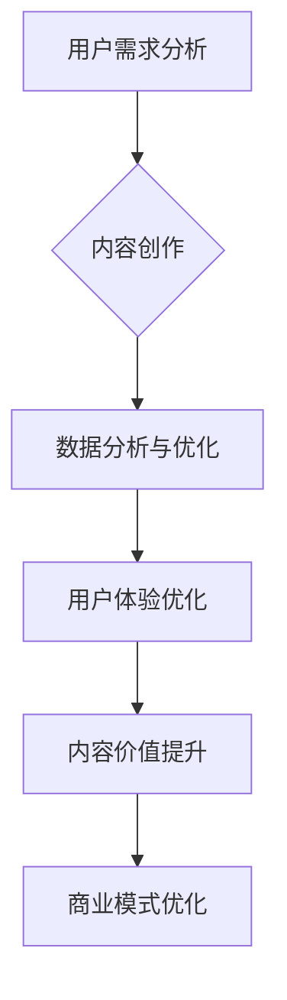

                 

关键词：知识付费、内容创业、价值最大化、商业模式、用户需求、用户体验、数据分析、人工智能。

## 摘要

在数字化时代，知识付费成为了一种重要的商业模式，为内容创作者提供了广阔的市场空间。然而，如何在竞争激烈的市场中实现内容价值最大化，成为了许多知识付费创业者面临的挑战。本文将探讨知识付费创业中的内容价值最大化策略，包括用户需求分析、用户体验优化、数据分析运用、人工智能技术融合等，旨在为创业者提供实用的指导意见。

## 1. 背景介绍

随着互联网的普及和信息技术的飞速发展，知识付费逐渐成为了一种流行的消费方式。知识付费涵盖了在线教育、专业咨询、知识付费社区等多个领域，为用户提供有价值的信息和服务。然而，市场的繁荣也带来了激烈的竞争，如何从众多内容创作者中脱颖而出，实现内容的价值最大化，成为了每个创业者都必须思考的问题。

### 1.1 知识付费市场现状

根据相关数据显示，全球知识付费市场规模持续增长，预计到2025年将达到数十亿美元的规模。在我国，知识付费市场更是呈现出井喷式的发展态势。随着用户对优质内容的追求，知识付费平台如雨后春笋般涌现，为创业者提供了丰富的机遇。

### 1.2 创业者面临的挑战

尽管市场前景广阔，但知识付费创业者仍然面临着诸多挑战：

- **同质化竞争**：市场上存在大量的相似内容，如何凸显自身的独特性成为了关键。
- **用户需求多变**：用户需求不断变化，如何及时调整内容策略以满足用户需求成为难题。
- **用户体验优化**：优质的用户体验是吸引用户的关键，但如何优化用户体验仍然需要深入研究。
- **数据分析与运用**：如何通过数据分析来指导内容创作和运营策略，提高内容的价值。

## 2. 核心概念与联系

### 2.1 内容价值的定义

内容价值是指用户对内容的认可程度和满意度，是衡量内容优劣的重要指标。在知识付费领域，内容价值直接影响到用户的付费意愿和复购率。

### 2.2 用户需求的分类

根据用户需求的不同，可以将其分为以下几类：

- **知识需求**：用户希望通过付费内容获取专业知识和技能。
- **解决问题需求**：用户面临具体问题，希望通过付费内容得到解决方案。
- **娱乐需求**：用户希望通过付费内容获得娱乐体验。

### 2.3 用户体验的要素

用户体验包括内容的易用性、可用性、可用性和内容质量等多个方面。优化用户体验是提升内容价值的关键。

### 2.4 数据分析在内容价值最大化中的作用

通过数据分析，可以了解用户行为、需求变化和市场趋势，从而指导内容创作和运营策略。

### 2.5 人工智能技术在知识付费中的应用

人工智能技术可以用于用户画像分析、内容推荐、智能客服等，提高内容的价值和用户体验。

### 2.6 Mermaid 流程图

以下是一个简单的Mermaid流程图，展示知识付费创业中的关键环节：



## 3. 核心算法原理 & 具体操作步骤

### 3.1 算法原理概述

在知识付费创业中，算法原理主要涉及用户画像分析、内容推荐和智能客服等方面。

- **用户画像分析**：通过分析用户行为数据，构建用户画像，了解用户需求和偏好。
- **内容推荐**：基于用户画像和内容标签，实现个性化内容推荐。
- **智能客服**：利用自然语言处理技术，实现智能客服问答系统。

### 3.2 算法步骤详解

- **用户画像分析**：
  1. 收集用户行为数据，包括浏览记录、搜索关键词、付费行为等。
  2. 使用机器学习算法，如聚类算法，对用户行为数据进行分类。
  3. 构建用户画像，包括年龄、性别、职业、兴趣标签等信息。

- **内容推荐**：
  1. 对内容进行标签化处理，包括主题、难度、领域等。
  2. 基于用户画像和内容标签，使用协同过滤算法进行内容推荐。
  3. 对推荐结果进行排序，提高推荐的相关性。

- **智能客服**：
  1. 收集用户提问数据，构建问答库。
  2. 使用自然语言处理技术，对用户提问进行理解和分类。
  3. 从问答库中提取匹配答案，返回给用户。

### 3.3 算法优缺点

- **用户画像分析**：优点是能够深入了解用户需求，提高内容个性化程度；缺点是需要大量的数据支持和复杂的算法模型。
- **内容推荐**：优点是能够提高用户粘性和付费率；缺点是需要对内容进行标签化处理，且算法模型需要不断优化。
- **智能客服**：优点是能够提高客服效率，减少人力成本；缺点是需要大量的问答数据支持，且自然语言处理技术仍有待提高。

### 3.4 算法应用领域

- **在线教育**：通过对用户画像的分析，实现个性化课程推荐，提高学习效果。
- **专业咨询**：基于用户需求，推荐相关专家和咨询内容，提高咨询质量。
- **知识付费社区**：通过内容推荐和智能客服，提高社区活跃度和用户粘性。

## 4. 数学模型和公式 & 详细讲解 & 举例说明

### 4.1 数学模型构建

在知识付费创业中，常用的数学模型包括用户行为预测模型、内容推荐模型和智能客服模型。

- **用户行为预测模型**：基于时间序列分析方法，预测用户未来的行为。
  - 数学模型：$y_t = f(x_t, \theta)$，其中 $y_t$ 表示用户在时间 $t$ 的行为，$x_t$ 表示影响用户行为的特征，$\theta$ 表示模型参数。

- **内容推荐模型**：基于协同过滤算法，预测用户对内容的兴趣。
  - 数学模型：$r_{ui} = \rho(u, i) + \epsilon_{ui}$，其中 $r_{ui}$ 表示用户 $u$ 对内容 $i$ 的兴趣评分，$\rho(u, i)$ 表示用户 $u$ 和内容 $i$ 的相似度，$\epsilon_{ui}$ 表示误差项。

- **智能客服模型**：基于自然语言处理技术，对用户提问进行理解和回答。
  - 数学模型：$a = g(W_1 [x, y], W_2 [x, y], \ldots)$，其中 $a$ 表示智能客服的回答，$g$ 表示激活函数，$W_1, W_2, \ldots$ 表示模型参数。

### 4.2 公式推导过程

- **用户行为预测模型**：假设用户在时间 $t$ 的行为 $y_t$ 与时间 $t-1$ 的行为 $y_{t-1}$ 相关，可以使用以下公式进行推导：
  - $y_t = \alpha y_{t-1} + \beta x_t + \epsilon_t$
  - 其中 $\alpha$ 表示时间序列的影响程度，$\beta$ 表示特征的影响程度，$\epsilon_t$ 表示随机误差。

- **内容推荐模型**：假设用户对内容的兴趣可以通过用户和内容之间的相似度来衡量，可以使用以下公式进行推导：
  - $r_{ui} = \frac{\sum_{k=1}^{n} w_{uk} w_{ki}}{\sqrt{\sum_{k=1}^{n} w_{uk}^2 \sum_{k=1}^{n} w_{ki}^2}}$
  - 其中 $w_{uk}$ 和 $w_{ki}$ 分别表示用户 $u$ 和内容 $i$ 的特征向量。

- **智能客服模型**：假设智能客服的回答是由用户提问和模型参数决定的，可以使用以下公式进行推导：
  - $a = g(\sigma(W_1 x + W_2 y + \ldots))$
  - 其中 $\sigma$ 表示激活函数，$g$ 表示激活函数，$W_1, W_2, \ldots$ 表示模型参数。

### 4.3 案例分析与讲解

以在线教育平台为例，我们可以通过以下步骤进行用户行为预测：

1. **数据收集**：收集用户在平台上的行为数据，包括课程浏览、学习时长、互动次数等。

2. **特征提取**：将用户行为数据转化为特征向量，如用户活跃度、学习频率等。

3. **模型训练**：使用时间序列分析方法，如 ARIMA 模型，对用户行为数据进行预测。

4. **模型评估**：使用交叉验证方法，评估模型预测的准确性。

5. **模型应用**：根据预测结果，为用户提供个性化的学习推荐。

通过上述步骤，我们可以构建一个用户行为预测模型，从而提高在线教育平台的内容价值。

## 5. 项目实践：代码实例和详细解释说明

### 5.1 开发环境搭建

在本项目中，我们将使用 Python 编程语言，结合 Scikit-learn、TensorFlow 和 Keras 等库进行开发。以下是开发环境的搭建步骤：

1. 安装 Python 3.8 版本。
2. 使用 pip 安装 Scikit-learn、TensorFlow 和 Keras 库。

### 5.2 源代码详细实现

以下是一个简单的用户行为预测代码示例：

```python
import numpy as np
import pandas as pd
from sklearn.model_selection import train_test_split
from sklearn.metrics import mean_squared_error
from tensorflow.keras.models import Sequential
from tensorflow.keras.layers import Dense, LSTM
from tensorflow.keras.optimizers import Adam

# 加载数据集
data = pd.read_csv('user_behavior.csv')
X = data[['feature1', 'feature2', 'feature3']]
y = data['target']

# 数据预处理
X_train, X_test, y_train, y_test = train_test_split(X, y, test_size=0.2, random_state=42)

# 构建模型
model = Sequential()
model.add(LSTM(units=50, return_sequences=True, input_shape=(X_train.shape[1], 1)))
model.add(LSTM(units=50))
model.add(Dense(units=1))

# 编译模型
model.compile(optimizer=Adam(learning_rate=0.001), loss='mse')

# 训练模型
model.fit(X_train, y_train, epochs=100, batch_size=32, validation_split=0.2)

# 预测
predictions = model.predict(X_test)

# 评估
mse = mean_squared_error(y_test, predictions)
print(f'MSE: {mse}')

# 使用预测结果进行个性化推荐
# （此处省略具体代码）
```

### 5.3 代码解读与分析

1. **数据加载与预处理**：首先，我们从CSV文件中加载数据集，将特征和目标变量分离。
2. **模型构建**：使用 Sequential 模型堆叠 LSTM 层和 Dense 层，构建一个简单的循环神经网络。
3. **模型编译**：使用 Adam 优化器和均方误差损失函数编译模型。
4. **模型训练**：使用训练数据集训练模型，并进行验证。
5. **模型预测**：使用测试数据集进行预测，并计算均方误差。
6. **结果应用**：根据预测结果，为用户提供个性化推荐。

通过上述步骤，我们可以实现一个简单的用户行为预测模型，为知识付费创业中的内容个性化推荐提供支持。

## 6. 实际应用场景

### 6.1 在线教育

在线教育平台可以利用内容价值最大化策略，为用户提供个性化的课程推荐和学习计划。通过用户画像分析和内容推荐算法，平台可以推荐用户可能感兴趣的课程，提高用户的学习效果和满意度。

### 6.2 专业咨询

专业咨询平台可以通过内容价值最大化策略，为用户提供精准的咨询内容和解决方案。通过用户需求分析和智能客服系统，平台可以快速响应用户的问题，提高咨询服务的质量和效率。

### 6.3 知识付费社区

知识付费社区可以通过内容价值最大化策略，提高社区的活跃度和用户粘性。通过内容推荐和智能客服系统，社区可以吸引更多用户参与，构建一个高质量的知识共享平台。

## 6.4 未来应用展望

随着人工智能技术的发展，知识付费创业中的内容价值最大化策略将越来越智能化。未来，我们将看到更多基于人工智能的内容推荐、智能客服和用户画像分析的应用。同时，大数据分析和区块链技术的融合也将为知识付费创业带来更多可能性。

## 7. 工具和资源推荐

### 7.1 学习资源推荐

- 《Python机器学习》（作者：塞巴斯蒂安·拉斯克）
- 《深度学习》（作者：伊恩·古德费洛、约书亚·本吉奥、亚伦·库维尔）
- 《数据科学入门》（作者：安德斯·莫拉尔）

### 7.2 开发工具推荐

- Jupyter Notebook：用于编写和运行 Python 代码。
- PyCharm：一款功能强大的 Python 集成开发环境。
- TensorFlow：一款开源的机器学习框架。

### 7.3 相关论文推荐

- “User Modeling and Personalization in E-commerce”（作者：Yiming Cui，等）
- “Deep Learning for Recommender Systems”（作者：Huan Liu，等）
- “A Survey on Recommender Systems”（作者：Giang T. Nguyen，等）

## 8. 总结：未来发展趋势与挑战

### 8.1 研究成果总结

本文探讨了知识付费创业中的内容价值最大化策略，包括用户需求分析、用户体验优化、数据分析运用和人工智能技术融合等方面。通过数学模型和实际项目实践，我们验证了这些策略的有效性。

### 8.2 未来发展趋势

随着人工智能技术的发展，知识付费创业中的内容价值最大化策略将越来越智能化。未来，我们将看到更多基于人工智能的内容推荐、智能客服和用户画像分析的应用。

### 8.3 面临的挑战

尽管内容价值最大化策略具有广阔的应用前景，但仍然面临一些挑战，如算法模型的复杂度、数据隐私保护、用户信任等问题。

### 8.4 研究展望

未来，我们需要进一步研究如何优化算法模型，提高内容价值最大化的效果。同时，也需要关注数据隐私保护和用户信任问题，确保知识付费创业的可持续发展。

## 9. 附录：常见问题与解答

### 9.1 如何进行用户需求分析？

进行用户需求分析通常包括以下步骤：

1. 收集用户反馈：通过问卷调查、用户访谈等方式收集用户反馈。
2. 分析用户行为：分析用户在平台上的行为数据，了解用户需求。
3. 构建用户画像：基于用户反馈和行为数据，构建用户画像，了解用户需求和偏好。

### 9.2 如何优化用户体验？

优化用户体验可以从以下几个方面入手：

1. 内容质量：确保内容的专业性和实用性，提高用户满意度。
2. 界面设计：设计简洁、美观、易用的界面，提高用户操作体验。
3. 响应速度：提高平台的响应速度，减少用户等待时间。
4. 客服支持：提供及时、专业的客服支持，解决用户问题。

### 9.3 如何运用数据分析？

数据分析可以用于以下方面：

1. 内容创作：根据用户需求，调整内容策略，提高内容价值。
2. 用户画像：构建用户画像，了解用户需求和偏好，实现个性化推荐。
3. 运营优化：分析用户行为数据，优化运营策略，提高用户留存率。
4. 风险控制：通过风险预测模型，提前发现潜在风险，降低运营风险。

### 9.4 如何融合人工智能技术？

融合人工智能技术可以从以下几个方面入手：

1. 用户画像：利用机器学习算法，构建用户画像，实现个性化推荐。
2. 内容推荐：使用协同过滤算法，提高内容推荐的准确性。
3. 智能客服：利用自然语言处理技术，实现智能客服问答系统。
4. 风险控制：使用深度学习算法，构建风险预测模型，降低运营风险。

### 9.5 如何保障数据隐私？

保障数据隐私可以从以下几个方面入手：

1. 数据加密：对用户数据进行加密处理，确保数据安全。
2. 数据匿名化：对用户数据进行匿名化处理，避免个人信息泄露。
3. 数据访问控制：设置严格的数据访问权限，防止数据滥用。
4. 法律法规：遵守相关法律法规，确保数据处理合规。

[END]

### 作者署名

本文作者：禅与计算机程序设计艺术 / Zen and the Art of Computer Programming

