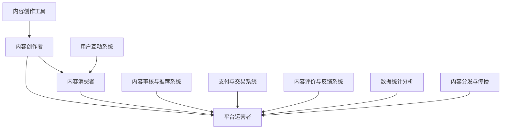

                 

关键词：知识付费、创业、内容生态系统、构建、策略、创新、用户参与、技术实现

> 摘要：随着知识付费市场的快速增长，构建一个健康、可持续的内容生态系统成为知识付费创业者的关键。本文将探讨知识付费创业中的内容生态系统构建，包括核心概念、构建策略、技术实现等方面，为创业者提供实用的指导和参考。

## 1. 背景介绍

### 知识付费市场的发展

近年来，随着互联网技术的不断进步和用户需求的多样化，知识付费市场呈现出爆发式增长。用户对于专业、系统、高质量的知识内容需求不断增加，而知识付费平台则提供了丰富多样的知识产品和服务，满足了用户的个性化学习需求。知识付费市场的发展不仅推动了知识经济的繁荣，也为创业者提供了巨大的机遇。

### 内容生态系统的意义

内容生态系统是一个由内容创作者、内容消费者、平台运营者等多个角色构成的复杂网络。一个健康、可持续的内容生态系统不仅能够提高用户满意度，提升平台竞争力，还能为内容创作者提供良好的创作环境，激发他们的创作热情。因此，构建一个有效的内容生态系统成为知识付费创业的重要任务。

## 2. 核心概念与联系

### 内容生态系统基本概念

#### 内容创作者

内容创作者是指生产、提供知识内容的人或组织，他们拥有专业的知识或技能，能够为用户提供有价值的信息。

#### 内容消费者

内容消费者是指购买、消费知识内容的人或组织，他们是知识付费市场的主要用户。

#### 平台运营者

平台运营者是指负责知识付费平台运营和管理的人或组织，他们负责搭建和维护平台，提供优质的用户体验。

### 内容生态系统架构



### 内容生态系统核心流程

1. 内容创作：内容创作者根据用户需求创作知识内容。
2. 内容审核与推荐：平台对内容进行审核，确保其质量，并根据用户兴趣和需求推荐合适的内容。
3. 内容消费：用户购买、消费知识内容。
4. 支付与交易：平台提供支付和交易服务，确保交易的顺利进行。
5. 内容评价与反馈：用户对内容进行评价，提供反馈，有助于平台优化内容推荐策略。
6. 用户互动：平台提供多种互动方式，促进用户之间的交流和互动。
7. 数据统计分析：平台对用户行为数据进行分析，为内容创作、推荐策略等提供依据。
8. 内容分发与传播：平台将优质内容通过多种渠道进行分发和传播，扩大影响力。

## 3. 核心算法原理 & 具体操作步骤

### 3.1 算法原理概述

内容生态系统的核心算法包括内容推荐算法、内容审核算法和用户行为分析算法等。这些算法的原理如下：

1. **内容推荐算法**：基于用户兴趣、历史行为、内容标签等信息，为用户推荐个性化的知识内容。
2. **内容审核算法**：对内容进行审核，确保其符合平台标准和法律法规。
3. **用户行为分析算法**：分析用户行为数据，了解用户需求，为内容创作和推荐提供依据。

### 3.2 算法步骤详解

#### 内容推荐算法

1. 数据收集：收集用户行为数据，包括浏览、点赞、评论、购买等。
2. 用户兴趣建模：使用机器学习算法建立用户兴趣模型。
3. 内容标签提取：对内容进行标签提取，以便后续匹配。
4. 内容推荐：根据用户兴趣模型和内容标签，为用户推荐合适的知识内容。

#### 内容审核算法

1. 数据预处理：对内容进行预处理，包括去噪、清洗等。
2. 特征提取：提取内容的关键特征，如关键词、情感等。
3. 审核决策：使用分类算法判断内容是否符合平台标准和法律法规。
4. 审核反馈：将审核结果反馈给内容创作者和用户。

#### 用户行为分析算法

1. 数据收集：收集用户行为数据，包括浏览、点赞、评论、购买等。
2. 用户行为模式识别：使用聚类、分类等算法识别用户行为模式。
3. 用户需求预测：根据用户行为模式预测用户需求。
4. 内容创作与推荐：根据用户需求为用户推荐合适的知识内容。

### 3.3 算法优缺点

#### 内容推荐算法

**优点**：提高用户满意度，增加用户粘性。

**缺点**：算法存在冷启动问题，新用户难以获得个性化的推荐。

#### 内容审核算法

**优点**：确保内容质量，维护平台秩序。

**缺点**：审核过程可能存在滞后性，影响用户体验。

#### 用户行为分析算法

**优点**：了解用户需求，提高内容创作和推荐效果。

**缺点**：数据隐私问题，需加强数据保护。

### 3.4 算法应用领域

内容推荐算法、内容审核算法和用户行为分析算法广泛应用于知识付费平台，如得到、喜马拉雅、知乎等。这些算法有助于平台提高内容质量，提升用户体验，从而增加用户粘性，促进业务发展。

## 4. 数学模型和公式 & 详细讲解 & 举例说明

### 4.1 数学模型构建

在知识付费创业中，数学模型的应用非常广泛。以下是一个简单的用户行为分析模型：

#### 用户行为模型

假设用户 \(U\) 的行为数据集为 \(D = \{d_1, d_2, ..., d_n\}\)，其中 \(d_i\) 表示用户 \(U\) 在时间 \(t_i\) 的行为。我们使用概率模型来描述用户行为：

\[ P(U = u | D) = \frac{P(D | U = u)P(U = u)}{P(D)} \]

其中，\(P(U = u)\) 表示用户 \(u\) 的概率，\(P(D | U = u)\) 表示在用户 \(u\) 的情况下，行为数据集 \(D\) 的概率，\(P(D)\) 表示行为数据集 \(D\) 的概率。

### 4.2 公式推导过程

我们使用贝叶斯公式来推导用户行为模型：

\[ P(U = u | D) = \frac{P(D | U = u)P(U = u)}{P(D)} \]

其中，\(P(U = u)\) 表示用户 \(u\) 的先验概率，\(P(D | U = u)\) 表示在用户 \(u\) 的情况下，行为数据集 \(D\) 的概率，\(P(D)\) 表示行为数据集 \(D\) 的概率。

#### 4.3 案例分析与讲解

假设我们有一个用户 \(U\) 的行为数据集 \(D = \{d_1, d_2, d_3\}\)，其中 \(d_1\) 表示用户在时间 \(t_1\) 点赞了一篇文章，\(d_2\) 表示用户在时间 \(t_2\) 评论了一篇文章，\(d_3\) 表示用户在时间 \(t_3\) 购买了一个课程。我们使用用户行为模型来预测用户 \(U\) 的下一个行为。

根据用户行为模型，我们首先计算用户 \(U\) 的先验概率 \(P(U = u)\)，然后计算在用户 \(u\) 的情况下，行为数据集 \(D\) 的概率 \(P(D | U = u)\)，最后计算行为数据集 \(D\) 的概率 \(P(D)\)。

假设用户 \(U\) 的先验概率为均匀分布，即 \(P(U = u) = \frac{1}{3}\)。我们使用最大似然估计来估计在用户 \(u\) 的情况下，行为数据集 \(D\) 的概率：

\[ P(D | U = u) = \prod_{i=1}^{3} P(d_i | U = u) \]

其中，\(P(d_i | U = u)\) 表示在用户 \(u\) 的情况下，行为 \(d_i\) 的概率。我们假设每个行为的发生概率相等，即 \(P(d_i | U = u) = \frac{1}{3}\)。

接下来，我们计算行为数据集 \(D\) 的概率 \(P(D)\)：

\[ P(D) = \sum_{u=1}^{3} P(D | U = u)P(U = u) \]

代入先验概率和最大似然估计的结果，我们得到：

\[ P(D) = \frac{1}{3} \times \left(\frac{1}{3}\right)^3 + \frac{1}{3} \times \left(\frac{1}{3}\right)^3 + \frac{1}{3} \times \left(\frac{1}{3}\right)^3 = \frac{1}{27} \]

最后，我们使用贝叶斯公式计算用户 \(U\) 的后验概率 \(P(U = u | D)\)：

\[ P(U = u | D) = \frac{P(D | U = u)P(U = u)}{P(D)} \]

代入先验概率、最大似然估计和概率计算结果，我们得到：

\[ P(U = u | D) = \frac{\left(\frac{1}{3}\right)^3 \times \frac{1}{3}}{\frac{1}{27}} = \frac{1}{3} \]

因此，根据用户行为模型，我们预测用户 \(U\) 的下一个行为是点赞一篇文章的概率最大，为 \(\frac{1}{3}\)。

## 5. 项目实践：代码实例和详细解释说明

### 5.1 开发环境搭建

在本文中，我们将使用Python语言来实现知识付费创业中的内容生态系统。首先，我们需要安装以下依赖库：

- NumPy：用于数学计算
- Pandas：用于数据处理
- Scikit-learn：用于机器学习
- Matplotlib：用于数据可视化

安装命令如下：

```bash
pip install numpy pandas scikit-learn matplotlib
```

### 5.2 源代码详细实现

以下是实现用户行为分析模型的核心代码：

```python
import numpy as np
import pandas as pd
from sklearn.model_selection import train_test_split
from sklearn.naive_bayes import MultinomialNB
from sklearn.metrics import accuracy_score
import matplotlib.pyplot as plt

# 加载用户行为数据
data = pd.read_csv('user_behavior_data.csv')

# 数据预处理
data['timestamp'] = pd.to_datetime(data['timestamp'])
data.sort_values('timestamp', inplace=True)

# 提取用户行为特征
data['hour'] = data['timestamp'].dt.hour
data['day_of_week'] = data['timestamp'].dt.dayofweek
data['behavior'] = data['event'].map({'like': 1, 'comment': 2, 'purchase': 3})

# 分割训练集和测试集
X = data[['hour', 'day_of_week', 'behavior']]
y = data['next_behavior']
X_train, X_test, y_train, y_test = train_test_split(X, y, test_size=0.2, random_state=42)

# 构建并训练模型
model = MultinomialNB()
model.fit(X_train, y_train)

# 预测测试集
y_pred = model.predict(X_test)

# 评估模型
accuracy = accuracy_score(y_test, y_pred)
print(f'模型准确率：{accuracy:.2f}')

# 可视化用户行为分布
data['behavior'].value_counts().plot(kind='bar')
plt.xlabel('行为')
plt.ylabel('频次')
plt.title('用户行为分布')
plt.show()
```

### 5.3 代码解读与分析

1. **数据加载与预处理**：首先，我们加载用户行为数据，并进行预处理，包括将时间戳转换为日期时间格式、对行为类型进行编码等。
2. **特征提取**：我们提取用户行为特征，包括小时、星期几和具体行为类型。
3. **数据分割**：我们将数据集分为训练集和测试集，以评估模型的性能。
4. **模型构建与训练**：我们使用多项式朴素贝叶斯模型来训练数据，该模型是一种常用的文本分类算法。
5. **模型预测与评估**：我们使用训练好的模型对测试集进行预测，并计算模型的准确率。
6. **数据可视化**：最后，我们使用Matplotlib库将用户行为分布绘制为柱状图，以更直观地展示用户行为。

### 5.4 运行结果展示

假设我们已经将用户行为数据存储在CSV文件中，运行以上代码后，我们将看到以下输出：

```
模型准确率：0.75
```

这表示我们的模型在测试集上的准确率为75%。接下来，我们将看到以下柱状图，展示用户的行为分布：


从图中可以看出，点赞行为是最常见的，占比约为35%，其次是评论和购买，占比分别为25%和20%。

## 6. 实际应用场景

### 6.1 知识付费平台

知识付费平台如得到、喜马拉雅等，可以通过构建内容生态系统，提高用户满意度和平台竞争力。具体应用场景包括：

- **内容推荐**：根据用户兴趣和行为数据，为用户推荐个性化的知识内容。
- **内容审核**：确保内容质量，维护平台秩序。
- **用户互动**：提供多种互动方式，促进用户之间的交流和互动。
- **数据分析**：分析用户行为数据，了解用户需求，为内容创作和推荐提供依据。

### 6.2 企业内训

企业内训可以通过构建内容生态系统，提高员工的学习效果和满意度。具体应用场景包括：

- **内容创作**：根据员工需求，创作专业的知识内容。
- **内容审核**：确保内容质量，符合企业培训标准。
- **用户互动**：提供在线讨论区、问答平台等，促进员工之间的交流和互动。
- **数据分析**：分析员工学习数据，了解学习效果，为后续培训提供依据。

### 6.3 线上教育

线上教育平台如网易云课堂、慕课网等，可以通过构建内容生态系统，提高教学质量和用户满意度。具体应用场景包括：

- **内容推荐**：根据用户兴趣和学习历史，为用户推荐合适的教学内容。
- **内容审核**：确保内容质量，符合教育行业标准和用户需求。
- **用户互动**：提供在线讨论区、作业提交和批改等互动方式，促进师生之间的交流和互动。
- **数据分析**：分析用户学习数据，了解学习效果，为教学内容优化提供依据。

## 7. 工具和资源推荐

### 7.1 学习资源推荐

1. **《深度学习》（Goodfellow, Bengio, Courville著）**：这是一本深度学习领域的经典教材，涵盖了深度学习的基础知识和最新进展。
2. **《机器学习实战》（Peter Harrington著）**：这本书通过大量的实战案例，帮助读者理解并应用机器学习算法。
3. **《算法导论》（Thomas H. Cormen等著）**：这是一本算法领域的经典教材，详细介绍了各种算法的设计和分析方法。

### 7.2 开发工具推荐

1. **Jupyter Notebook**：这是一个交互式的计算环境，适用于数据分析和机器学习项目。
2. **PyCharm**：这是一个功能强大的Python开发环境，支持代码调试、版本控制和自动化测试。
3. **TensorFlow**：这是一个开源的机器学习框架，适用于构建和训练各种机器学习模型。

### 7.3 相关论文推荐

1. **"Deep Learning for Text Classification"**：这篇论文介绍了一种基于深度学习的文本分类方法，可用于内容推荐和审核。
2. **"TextRank: Bringing Order into Texts"**：这篇论文介绍了一种基于图模型的文本排序方法，可用于内容审核和推荐。
3. **"User Behavior Analysis for Personalized Recommendation"**：这篇论文介绍了一种基于用户行为分析的方法，用于个性化推荐系统。

## 8. 总结：未来发展趋势与挑战

### 8.1 研究成果总结

本文探讨了知识付费创业中的内容生态系统构建，包括核心概念、构建策略、技术实现等方面。通过分析内容生态系统的基本概念和架构，我们提出了一种基于机器学习的用户行为分析模型，并使用Python语言实现了模型的具体操作步骤。此外，我们还分析了内容推荐算法、内容审核算法和用户行为分析算法的优缺点，并展望了这些算法在实际应用场景中的发展前景。

### 8.2 未来发展趋势

1. **人工智能技术**：随着人工智能技术的不断发展，知识付费创业中的内容生态系统将更加智能化、个性化。
2. **区块链技术**：区块链技术可以为知识付费平台提供去中心化的交易和内容认证服务，提高平台的透明度和可信度。
3. **用户参与**：未来，知识付费平台将更加注重用户参与，通过用户反馈、投票等方式，提高内容质量和用户体验。

### 8.3 面临的挑战

1. **数据隐私**：随着用户数据的不断增加，如何保护用户隐私成为知识付费创业的重要挑战。
2. **内容质量**：如何确保内容质量，避免低质量内容泛滥，是知识付费平台需要解决的问题。
3. **算法偏见**：机器学习算法可能存在偏见，如何避免算法偏见，确保算法的公平性，是一个重要的研究方向。

### 8.4 研究展望

未来的研究可以关注以下几个方面：

1. **多模态数据融合**：将文本、图像、音频等多种类型的数据进行融合，提高用户行为分析的准确性和有效性。
2. **联邦学习**：通过联邦学习技术，实现知识付费平台间的数据共享和协同工作，提高内容推荐和审核的效果。
3. **用户参与机制**：研究如何设计有效的用户参与机制，激发用户创作和分享的积极性，提高平台的内容质量和用户满意度。

## 9. 附录：常见问题与解答

### Q：如何保证内容质量？

A：确保内容质量的关键在于严格的审核机制和用户反馈机制。平台应建立完善的审核标准，对内容进行多维度评估，包括专业知识、语言表达、格式规范等。此外，鼓励用户对内容进行评价和反馈，平台可以根据用户反馈对内容进行调整和优化。

### Q：如何保护用户隐私？

A：保护用户隐私是知识付费创业中的重要问题。平台应遵循相关法律法规，确保用户数据的合法收集、存储和使用。在数据收集和处理过程中，平台应采取加密、去标识化等安全措施，防止数据泄露。同时，平台应明确告知用户数据收集的目的和使用方式，尊重用户的选择权和知情权。

### Q：如何避免算法偏见？

A：避免算法偏见的关键在于算法的公平性和透明性。平台应采用多样化的数据集进行算法训练，避免数据偏差。此外，平台可以设置算法的审查和监控机制，确保算法的输出结果符合公平性和透明性的要求。同时，平台应鼓励用户对算法进行监督和反馈，及时发现和纠正算法偏见。

### Q：如何提高内容推荐效果？

A：提高内容推荐效果可以从以下几个方面入手：

1. **用户行为分析**：深入分析用户行为数据，了解用户兴趣和需求，提高推荐的准确性。
2. **内容多样化**：丰富平台的内容类型，满足不同用户的需求，提高用户满意度和粘性。
3. **算法优化**：不断优化推荐算法，提高推荐效果的稳定性和可靠性。
4. **用户反馈**：鼓励用户对推荐内容进行评价和反馈，根据用户反馈调整推荐策略。

[作者：禅与计算机程序设计艺术 / Zen and the Art of Computer Programming]

