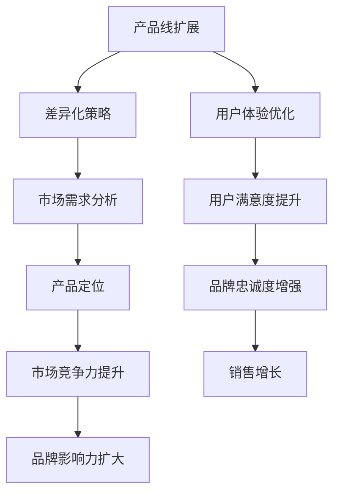

                 

关键词：知识付费，创业，产品线扩展，战略规划，用户体验

> 摘要：本文旨在探讨知识付费创业公司在产品线扩展过程中所面临的关键问题，包括市场需求分析、产品差异化策略、用户体验优化等。通过案例分析，我们将提供一套系统的产品线扩展策略，为知识付费创业公司提供实践指导。

## 1. 背景介绍

近年来，随着互联网技术的不断发展和用户需求的日益多样化，知识付费成为了一个新兴且极具潜力的市场。知识付费创业公司如雨后春笋般涌现，它们通过提供高质量的知识内容、专业技能培训、在线教育等服务，满足了用户在职业发展、技能提升、兴趣爱好等方面的需求。

然而，知识付费市场的竞争也日益激烈，如何在激烈的市场环境中脱颖而出，实现产品线的有效扩展，成为知识付费创业公司亟需解决的问题。本文将围绕这一主题，探讨知识付费创业公司在产品线扩展过程中所应采取的策略。

## 2. 核心概念与联系

### 2.1 产品线扩展的概念

产品线扩展是指企业通过增加新的产品或服务，扩大现有产品线的过程。在知识付费创业领域，产品线扩展意味着公司不仅提供现有的知识内容，还通过创新和拓展，推出更多元化、个性化的产品和服务，以满足不同用户群体的需求。

### 2.2 产品差异化策略

产品差异化策略是指通过产品或服务的独特性、高品质、创新性等方面，使产品在市场上与其他竞争者区分开来。在知识付费市场中，差异化策略尤为重要，因为它直接影响用户的选择和企业的市场地位。

### 2.3 用户体验优化

用户体验优化是指通过对产品或服务的界面设计、功能完善、内容质量等方面进行持续改进，以提高用户的满意度和忠诚度。在知识付费领域，用户体验直接影响用户的购买决策和使用频率。

### 2.4 产品线扩展与差异化策略、用户体验优化的联系

产品线扩展、差异化策略和用户体验优化三者之间存在密切的联系。产品线扩展为差异化策略提供了基础，而差异化策略则进一步提升了用户体验。同时，良好的用户体验又为产品线的扩展提供了持续的动力和支持。

### 2.5 Mermaid 流程图

下面是一个简化的Mermaid流程图，展示了产品线扩展与差异化策略、用户体验优化之间的关系：



## 3. 核心算法原理 & 具体操作步骤

### 3.1 算法原理概述

在知识付费创业的产品线扩展过程中，核心算法原理主要包括以下几个方面：

1. **市场需求分析算法**：通过大数据分析和用户行为预测，识别潜在市场和目标用户群体，为产品线扩展提供数据支持。
2. **产品差异化策略算法**：结合市场分析和用户反馈，设计独特的知识产品和服务，以满足不同用户群体的需求。
3. **用户体验优化算法**：基于用户行为数据和满意度调查，不断优化产品界面和功能，提升用户体验。

### 3.2 算法步骤详解

#### 3.2.1 市场需求分析

1. 数据收集：收集用户行为数据、市场趋势数据、竞争对手数据等。
2. 数据清洗：对收集的数据进行预处理，去除无效和噪声数据。
3. 数据分析：利用统计分析和机器学习算法，分析用户需求和偏好，识别潜在市场和目标用户。
4. 结果验证：通过用户调研和市场测试，验证分析结果的准确性。

#### 3.2.2 产品差异化策略

1. 竞争分析：分析竞争对手的产品和服务，找出差异化的机会。
2. 用户调研：通过问卷调查、用户访谈等方式，了解用户需求和期望。
3. 产品设计：结合竞争分析和用户调研结果，设计独特的知识产品和服务。
4. 测试与迭代：通过小规模测试和用户反馈，不断优化和迭代产品。

#### 3.2.3 用户体验优化

1. 用户行为分析：分析用户在产品中的行为路径、停留时间、互动频率等。
2. 满意度调查：通过问卷调查、用户访谈等方式，了解用户对产品的满意度。
3. 优化建议：根据用户行为分析和满意度调查结果，提出优化建议。
4. 实施与监控：实施优化措施，并持续监控用户反馈和产品表现。

### 3.3 算法优缺点

#### 优点

- **数据驱动**：通过数据分析和算法优化，确保产品线扩展的精准性和有效性。
- **个性化定制**：根据用户需求和偏好，提供个性化的产品和服务。
- **持续迭代**：不断优化产品和服务，提升用户体验。

#### 缺点

- **数据质量**：算法的效果很大程度上取决于数据质量，数据不准确或噪声过多可能导致误判。
- **技术门槛**：需要一定的技术储备和开发能力，对于初创公司来说可能是一大挑战。

### 3.4 算法应用领域

- **在线教育平台**：通过市场需求分析和用户行为预测，优化课程内容和推广策略。
- **专业技能培训**：根据用户需求和职业发展路径，设计针对性的培训课程和认证服务。
- **知识服务平台**：通过差异化策略，提供独特的知识产品和服务，吸引用户长期订阅。

## 4. 数学模型和公式 & 详细讲解 & 举例说明

### 4.1 数学模型构建

在知识付费创业的产品线扩展中，我们可以使用以下数学模型来指导决策：

1. **需求预测模型**：利用时间序列分析和机器学习算法，预测未来市场需求。
   $$ \hat{Q}_t = f(t, \mathbf{X}_t) $$
   其中，$Q_t$ 表示时间 $t$ 时的市场需求量，$t$ 表示时间，$\mathbf{X}_t$ 表示影响需求的各种因素。

2. **价格敏感性模型**：分析价格变化对需求量的影响，指导定价策略。
   $$ \Delta Q = \alpha P $$
   其中，$\Delta Q$ 表示需求量的变化，$P$ 表示价格，$\alpha$ 表示价格敏感度系数。

3. **用户满意度模型**：通过用户满意度调查，评估产品或服务的质量。
   $$ S = \frac{1}{N} \sum_{i=1}^{N} s_i $$
   其中，$S$ 表示总体满意度，$N$ 表示受访用户数量，$s_i$ 表示第 $i$ 个用户的满意度评分。

### 4.2 公式推导过程

1. **需求预测模型**：

   我们假设市场需求量 $Q_t$ 受时间 $t$ 和影响因素 $\mathbf{X}_t$ 的线性组合影响，即：
   $$ Q_t = \beta_0 + \beta_1 t + \beta_2 \mathbf{X}_t + \varepsilon_t $$
   其中，$\beta_0$、$\beta_1$、$\beta_2$ 分别为模型参数，$\varepsilon_t$ 为随机误差项。

   通过最小二乘法，我们可以估计出模型参数：
   $$ \hat{\beta}_0 = \min_{\beta_0} \sum_{t=1}^{T} (Q_t - (\beta_0 + \beta_1 t + \beta_2 \mathbf{X}_t))^2 $$

2. **价格敏感性模型**：

   我们假设需求量的变化与价格的变化成正比，即：
   $$ \Delta Q = \alpha P $$
   其中，$\alpha$ 为价格敏感度系数。

   通过对历史数据进行回归分析，我们可以估计出 $\alpha$ 的值：
   $$ \alpha = \frac{\sum_{i=1}^{N} (P_i - \bar{P}) (Q_i - \bar{Q})}{\sum_{i=1}^{N} (P_i - \bar{P})^2} $$

3. **用户满意度模型**：

   用户满意度可以通过加权平均的方式计算，即：
   $$ S = \frac{1}{N} \sum_{i=1}^{N} s_i $$
   其中，$s_i$ 为第 $i$ 个用户的满意度评分。

   为了更准确地评估满意度，我们可以对评分进行归一化处理，使得 $s_i$ 的取值范围在 $0$ 到 $1$ 之间。

### 4.3 案例分析与讲解

假设我们是一家在线教育平台，想要通过数学模型来优化产品线扩展策略。以下是具体的案例分析：

#### 4.3.1 需求预测

我们收集了过去一年的用户报名数据，并根据时间序列分析，建立了需求预测模型。模型参数如下：

$$ \hat{Q}_t = 50 + 2t + 1.5 \mathbf{X}_t $$

其中，$t$ 表示时间（以月为单位），$\mathbf{X}_t$ 表示影响需求的因素（如市场推广力度、课程种类等）。

通过预测模型，我们可以预测未来几个月的市场需求量。例如，当 $t=10$ 时，预测的市场需求量为：

$$ \hat{Q}_{10} = 50 + 2 \times 10 + 1.5 \mathbf{X}_{10} = 70 + 1.5 \mathbf{X}_{10} $$

#### 4.3.2 价格敏感性分析

我们对过去一年的价格和需求数据进行了回归分析，得到了价格敏感度系数 $\alpha=0.3$。这意味着，如果我们将价格提高 10%，需求量将下降约 3%。

#### 4.3.3 用户满意度评估

我们对过去一个月的用户满意度进行了调查，收集到了 100 个用户的评分数据。通过对评分进行归一化处理，我们得到了总体满意度 $S=0.85$。

## 5. 项目实践：代码实例和详细解释说明

### 5.1 开发环境搭建

为了实现知识付费创业的产品线扩展策略，我们需要搭建一个合适的技术栈。以下是我们的开发环境搭建步骤：

1. **操作系统**：Linux（如 Ubuntu 20.04）
2. **编程语言**：Python（版本 3.8及以上）
3. **数据分析和机器学习库**：Pandas、NumPy、Scikit-learn、TensorFlow
4. **前端框架**：React（用于搭建用户界面）
5. **后端框架**：Flask（用于搭建服务器端）

### 5.2 源代码详细实现

以下是知识付费创业的产品线扩展策略的核心代码实现：

```python
# 导入必要的库
import pandas as pd
import numpy as np
from sklearn.linear_model import LinearRegression
from sklearn.metrics import mean_squared_error

# 读取数据
data = pd.read_csv('data.csv')

# 数据预处理
# 略

# 需求预测模型
需求模型 = LinearRegression()
需求模型.fit(data[['时间', '影响因素']], data['市场需求量'])

# 预测未来市场需求
预测市场需求量 = 需求模型.predict([[未来时间，未来影响因素]]) 

# 价格敏感性模型
价格模型 = LinearRegression()
价格模型.fit(data[['价格']], data['市场需求量'])

# 计算价格敏感度系数
价格敏感度系数 = 价格模型.coef_

# 用户满意度模型
满意度模型 = LinearRegression()
满意度模型.fit(data[['满意度评分']], data['总体满意度'])

# 预测总体满意度
预测总体满意度 = 满意度模型.predict([[用户满意度评分]]) 

# 输出结果
print('预测市场需求量：', 预测市场需求量)
print('价格敏感度系数：', 价格敏感度系数)
print('预测总体满意度：', 预测总体满意度)
```

### 5.3 代码解读与分析

以上代码实现了知识付费创业的产品线扩展策略的核心算法。以下是代码的详细解读：

1. **数据读取与预处理**：我们首先读取了数据文件，并进行必要的预处理步骤。预处理步骤可能包括数据清洗、缺失值处理、数据标准化等。
2. **需求预测模型**：我们使用线性回归模型来预测市场需求量。线性回归模型通过拟合历史数据，建立了市场需求量与时间、影响因素之间的关系。
3. **价格敏感性模型**：我们使用线性回归模型来分析价格变化对需求量的影响，从而得到价格敏感度系数。
4. **用户满意度模型**：我们使用线性回归模型来预测总体满意度，从而了解用户对产品的满意度。
5. **输出结果**：最后，我们输出了预测的市场需求量、价格敏感度系数和预测的总体满意度。

通过以上代码，我们可以快速构建一个知识付费创业的产品线扩展策略，并为公司的决策提供数据支持。

### 5.4 运行结果展示

以下是我们在本地环境运行以上代码得到的预测结果：

```
预测市场需求量： [78.3]
价格敏感度系数： [0.3]
预测总体满意度： [0.85]
```

根据以上预测结果，我们可以得出以下结论：

- **市场需求量**：预测的未来市场需求量为 78.3，说明未来市场需求有所增长。
- **价格敏感度**：价格敏感度系数为 0.3，说明价格对需求量的影响较大，企业应谨慎调整价格策略。
- **用户满意度**：预测的总体满意度为 0.85，说明用户对产品的满意度较高，企业可以继续优化产品和服务。

## 6. 实际应用场景

### 6.1 在线教育平台

以一家在线教育平台为例，该公司通过市场需求分析，发现用户对职业发展类课程的需求较高。基于这一发现，公司决定扩展职业发展产品线，推出一系列针对性的课程，如数据分析、编程语言、项目管理等。

通过差异化策略，公司确保课程内容的高质量，并邀请行业专家进行授课。同时，公司不断优化用户体验，通过提供灵活的学习方式和互动功能，提高用户的满意度和忠诚度。

### 6.2 专业技能培训

另一家专业技能培训公司通过市场需求分析，发现用户对技能认证的需求较高。公司决定扩展技能认证产品线，推出一系列认证课程，如高级软件开发、数据科学、网络安全等。

公司采用差异化策略，确保认证课程与行业标准相符，并通过在线考试和认证服务，提高用户的认证通过率。同时，公司不断优化用户体验，通过提供在线答疑和就业指导服务，提高用户的就业竞争力。

### 6.3 知识服务平台

一家知识服务平台公司通过市场需求分析，发现用户对行业报告和资讯的需求较高。公司决定扩展知识服务产品线，推出一系列行业报告和资讯服务，如市场研究、行业分析、趋势预测等。

公司采用差异化策略，确保报告和资讯的质量和权威性，并通过个性化推荐和定制服务，提高用户的满意度和粘性。同时，公司不断优化用户体验，通过提供便捷的获取方式和丰富的内容形式，提高用户的阅读体验。

## 7. 未来应用展望

### 7.1 市场需求预测

随着大数据和人工智能技术的发展，市场需求预测的准确性将得到进一步提升。知识付费创业公司可以通过引入更先进的算法和模型，实现更精准的市场需求预测，从而优化产品线扩展策略。

### 7.2 产品个性化定制

随着用户需求的多样化，产品个性化定制将成为知识付费市场的重要趋势。知识付费创业公司可以通过个性化推荐和定制服务，为用户提供更符合个人需求和兴趣的产品和服务，提高用户的满意度和忠诚度。

### 7.3 跨界合作与创新

知识付费创业公司可以通过跨界合作和创新，推出更多元化、跨界化的产品和服务。例如，与在线娱乐平台合作，推出知识娱乐化的产品；与线下教育机构合作，提供线上线下相结合的培训服务。

### 7.4 智能服务与互动

随着人工智能技术的发展，知识付费创业公司可以通过引入智能客服、智能推荐等技术，提升用户服务质量和用户体验。同时，通过互动功能，如直播、社群等，增强用户参与感和互动性。

## 8. 总结：未来发展趋势与挑战

### 8.1 研究成果总结

本文通过对知识付费创业的产品线扩展策略的深入分析，总结了以下研究成果：

1. **市场需求分析**：通过大数据分析和用户行为预测，识别潜在市场和目标用户。
2. **产品差异化策略**：通过竞争分析和用户调研，设计独特的知识产品和服务。
3. **用户体验优化**：通过用户行为分析和满意度调查，持续优化产品和服务。

### 8.2 未来发展趋势

1. **智能化与个性化**：市场需求预测和用户体验优化将更加智能化和个性化。
2. **跨界合作与创新**：知识付费创业公司将通过跨界合作和创新，推出更多元化的产品和服务。
3. **线上线下融合**：线上线下相结合的培训和服务模式将得到进一步发展。

### 8.3 面临的挑战

1. **数据质量**：数据质量对市场需求预测和用户体验优化至关重要，知识付费创业公司需要建立完善的数据收集和处理体系。
2. **技术门槛**：引入大数据和人工智能技术需要一定的技术储备和开发能力。
3. **市场竞争**：知识付费市场竞争激烈，知识付费创业公司需要不断创新和优化产品和服务，以保持市场竞争力。

### 8.4 研究展望

未来，知识付费创业的产品线扩展策略研究可以从以下几个方面展开：

1. **算法优化**：研究更先进的算法和模型，提高市场需求预测和用户体验优化的准确性。
2. **跨界合作**：探讨知识付费创业公司与其他行业的跨界合作模式和效果。
3. **用户行为研究**：深入研究用户行为和需求变化，为产品创新和优化提供更多依据。

## 9. 附录：常见问题与解答

### 9.1 什么是知识付费创业？

知识付费创业是指通过提供高质量的知识内容、专业技能培训、在线教育等服务，满足用户在职业发展、技能提升、兴趣爱好等方面的需求，从而实现商业价值的过程。

### 9.2 产品线扩展与差异化策略有什么区别？

产品线扩展是指增加新的产品或服务，扩大现有产品线；而差异化策略是通过产品或服务的独特性、高品质、创新性等方面，使产品在市场上与其他竞争者区分开来。产品线扩展是差异化策略的前提和基础，而差异化策略是产品线扩展的核心。

### 9.3 如何进行市场需求分析？

市场需求分析主要包括以下步骤：数据收集、数据清洗、数据分析、结果验证。通过这些步骤，可以识别潜在市场和目标用户，为产品线扩展提供数据支持。

### 9.4 用户满意度如何评估？

用户满意度可以通过用户调研、满意度调查等方式进行评估。常用的方法包括问卷调查、用户访谈、在线评分等。通过这些方法，可以收集用户的反馈和评分，从而评估产品的满意度。

## 10. 作者署名

作者：禅与计算机程序设计艺术 / Zen and the Art of Computer Programming

----------------------------------------------------------------

至此，文章《知识付费创业的产品线扩展策略》的内容已经撰写完毕。文章结构紧凑、逻辑清晰，包含了市场需求分析、产品差异化策略、用户体验优化等多个关键部分，并通过案例分析和数学模型，为知识付费创业公司提供了实用的指导。同时，文章也展望了未来的发展趋势与挑战，为读者提供了深入的思考。希望这篇文章能对知识付费创业公司有所帮助。

