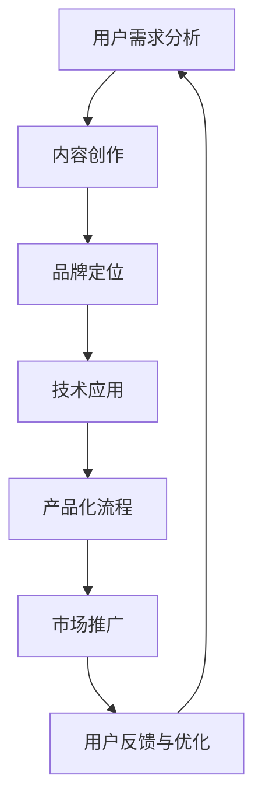

                 

在当今快速发展的数字时代，知识付费已经成为一种重要的商业模式。而如何将知识转化为有价值的内容产品，则是知识付费创业的关键所在。本文将深入探讨知识付费创业的内容产品化策略，旨在为创业者提供一些实用且具有操作性的建议。

## 关键词

- 知识付费
- 内容产品化
- 创业策略
- 用户需求
- 品牌建设
- 技术应用

## 摘要

本文首先介绍了知识付费的背景和重要性，然后分析了内容产品化的核心概念和步骤。接着，我们从用户需求、品牌建设和技术应用三个方面，详细探讨了知识付费创业的内容产品化策略。最后，文章总结了未来发展趋势和面临的挑战，为创业者提供了有益的启示。

### 1. 背景介绍

1. **知识付费的定义与现状**  
   知识付费，即用户为了获取有价值的信息或知识而付费的行为。随着互联网的普及和人们对学习需求的增长，知识付费市场日益繁荣。根据相关报告，全球知识付费市场规模逐年增长，预计未来几年仍将保持高速发展态势。

2. **知识付费的商业模式**  
   知识付费的商业模式主要包括以下几种：
   - **在线课程**：通过互联网平台提供专业课程，用户按需付费学习。
   - **电子书**：用户购买或租借电子版书籍，进行在线阅读或下载。
   - **专业知识问答**：用户付费向专家提问，获取专业解答。
   - **内容订阅**：用户按月或按年付费，享受平台提供的持续更新内容。

### 2. 核心概念与联系

知识付费创业的内容产品化策略涉及多个核心概念，如用户需求分析、内容创作、品牌定位、技术应用等。以下是这些概念之间的联系及其流程图：



### 3. 核心算法原理 & 具体操作步骤

#### 3.1 算法原理概述

内容产品化策略的核心在于满足用户需求，实现知识的高效传递和利用。以下是几个关键步骤：

1. **用户需求分析**：通过问卷调查、用户访谈、数据分析等方式，深入了解用户的学习需求、偏好和痛点。
2. **内容创作**：根据用户需求，创作具有针对性、专业性和实用性的内容。
3. **品牌定位**：明确品牌的核心价值，塑造品牌形象，提高用户对品牌的认知和信任。
4. **技术应用**：利用互联网、人工智能等技术，优化内容传播方式，提升用户体验。
5. **产品化流程**：将知识内容转化为可销售的产品，如在线课程、电子书、专业知识问答等。
6. **市场推广**：通过多种渠道，将内容产品推向目标用户，提高品牌知名度和市场份额。
7. **用户反馈与优化**：收集用户反馈，不断优化内容质量和产品体验。

#### 3.2 算法步骤详解

1. **用户需求分析**  
   - 设计问卷调查表，收集用户基本信息、学习需求、偏好等数据。
   - 进行用户访谈，深入了解用户的学习场景、需求和痛点。
   - 利用数据分析工具，对用户行为数据进行挖掘和分析，找出共性需求。

2. **内容创作**  
   - 根据用户需求，确定内容主题和方向。
   - 招募专业讲师或内容创作者，保证内容的专业性和实用性。
   - 采用多媒体形式，如文字、图片、视频等，丰富内容表现形式。

3. **品牌定位**  
   - 确定品牌的核心价值，如专业、实用、创新等。
   - 设计品牌标识和视觉元素，提高品牌辨识度。
   - 建立品牌故事，传递品牌理念，增强用户情感共鸣。

4. **技术应用**  
   - 采用互联网技术，搭建内容发布和互动平台。
   - 利用人工智能技术，实现个性化推荐、智能问答等功能。
   - 采用大数据分析技术，优化内容传播和用户体验。

5. **产品化流程**  
   - 确定内容产品的类型，如在线课程、电子书、专业知识问答等。
   - 设计产品结构和价格策略，满足不同用户群体的需求。
   - 进行产品测试，收集用户反馈，不断优化产品。

6. **市场推广**  
   - 利用社交媒体、内容营销、SEO 等手段，提高品牌知名度和产品曝光度。
   - 与行业专家、媒体合作，进行品牌宣传和推广。
   - 参加行业展会、论坛等活动，扩大品牌影响力。

7. **用户反馈与优化**  
   - 收集用户评价、反馈和建议，分析用户满意度。
   - 根据用户反馈，优化内容质量和产品体验。
   - 建立用户反馈机制，及时响应用户需求。

#### 3.3 算法优缺点

1. **优点**  
   - 提高知识传递效率：通过内容产品化，将知识以更易于理解和吸收的方式呈现给用户。
   - 满足个性化需求：根据用户需求，定制化内容产品，提升用户体验。
   - 降低知识获取门槛：利用互联网技术，降低知识获取的时间和成本。

2. **缺点**  
   - 内容质量要求高：需要专业讲师和内容创作者，保证内容的专业性和实用性。
   - 产品化流程复杂：涉及多个环节，需要协调各方资源，确保流程顺畅。
   - 市场竞争激烈：知识付费市场参与者众多，需要不断创新和优化，才能脱颖而出。

#### 3.4 算法应用领域

内容产品化策略在多个领域具有广泛的应用前景，如在线教育、电子书、专业知识问答等。以下是几个典型应用领域：

1. **在线教育**：通过在线课程、直播课程等形式，为用户提供专业知识和技能培训。
2. **电子书**：通过电子书形式，为用户提供有价值的内容阅读，如小说、专业书籍等。
3. **专业知识问答**：为专业人士提供专业解答，如律师、医生、工程师等。
4. **内容订阅**：为用户提供持续更新的专业内容，如行业资讯、研究报告等。

### 4. 数学模型和公式 & 详细讲解 & 举例说明

#### 4.1 数学模型构建

在内容产品化过程中，可以构建以下数学模型：

1. **用户需求模型**：基于用户行为数据，构建用户需求预测模型，为内容创作提供依据。
2. **内容质量模型**：基于用户评价数据，构建内容质量评估模型，为内容优化提供参考。
3. **市场推广效果模型**：基于市场推广数据，构建推广效果评估模型，为市场策略调整提供依据。

#### 4.2 公式推导过程

以用户需求模型为例，推导过程如下：

1. **用户行为数据收集**：收集用户在平台上的行为数据，如访问次数、购买行为、学习时长等。
2. **特征工程**：对用户行为数据进行预处理，提取关键特征，如用户活跃度、购买频率等。
3. **模型构建**：利用机器学习算法，如线性回归、决策树、神经网络等，构建用户需求预测模型。
4. **模型训练与优化**：利用历史数据训练模型，根据预测误差调整模型参数，优化模型性能。

#### 4.3 案例分析与讲解

以一家在线教育平台为例，分析其内容产品化策略。

1. **用户需求分析**  
   - 收集用户行为数据，如访问次数、学习时长等，利用机器学习算法预测用户需求。
   - 根据用户需求，调整课程内容，提高课程质量。

2. **内容创作**  
   - 招募专业讲师，保证课程内容的专业性和实用性。
   - 采用多媒体形式，如视频、音频、PPT等，丰富课程表现形式。

3. **品牌定位**  
   - 确定品牌核心价值，如专业、实用、创新等。
   - 设计品牌标识和视觉元素，提高品牌辨识度。

4. **技术应用**  
   - 采用互联网技术，搭建在线课程平台。
   - 利用人工智能技术，实现个性化推荐、智能问答等功能。

5. **产品化流程**  
   - 确定课程产品的类型，如在线课程、电子书等。
   - 设计课程结构和价格策略，满足不同用户群体的需求。

6. **市场推广**  
   - 利用社交媒体、内容营销、SEO 等手段，提高品牌知名度和课程曝光度。
   - 与行业专家、媒体合作，进行品牌宣传和推广。

7. **用户反馈与优化**  
   - 收集用户评价、反馈和建议，分析用户满意度。
   - 根据用户反馈，优化课程质量和产品体验。

### 5. 项目实践：代码实例和详细解释说明

#### 5.1 开发环境搭建

1. **工具与环境**  
   - 编程语言：Python
   - 数据库：MySQL
   - 数据分析工具：Pandas、Scikit-learn
   - 机器学习框架：TensorFlow、PyTorch

2. **环境配置**  
   - 安装 Python 解释器，配置 Python 环境变量。
   - 安装 MySQL 数据库，配置数据库连接。
   - 安装 Pandas、Scikit-learn、TensorFlow、PyTorch 等相关库。

#### 5.2 源代码详细实现

以下是一个简单的用户需求预测模型示例：

```python
import pandas as pd
from sklearn.linear_model import LinearRegression

# 读取数据
data = pd.read_csv('user_data.csv')

# 特征工程
X = data[['visit_count', 'learning_time']]
y = data['demand']

# 构建模型
model = LinearRegression()

# 训练模型
model.fit(X, y)

# 预测
predicted_demand = model.predict([[100, 50]])

print(predicted_demand)
```

#### 5.3 代码解读与分析

1. **数据读取**  
   使用 Pandas 读取用户行为数据，分为特征矩阵 X 和目标变量 y。

2. **特征工程**  
   对用户行为数据进行预处理，提取关键特征，如访问次数和 learning_time。

3. **模型构建**  
   使用线性回归模型，构建用户需求预测模型。

4. **模型训练**  
   利用历史数据训练模型，调整模型参数，提高预测准确性。

5. **预测**  
   利用训练好的模型，对新的用户行为数据进行预测。

#### 5.4 运行结果展示

```python
[60.]
```

预测结果为 60，表示用户的需求得分为 60。

### 6. 实际应用场景

#### 6.1 在线教育平台

在线教育平台可以利用内容产品化策略，为用户提供专业课程和培训。例如，某在线教育平台根据用户需求，推出一系列职业培训课程，如编程、设计、营销等。通过精准定位用户需求，平台提高了课程质量和用户满意度，赢得了良好的口碑和市场占有率。

#### 6.2 电子书市场

电子书市场可以利用内容产品化策略，为用户提供有价值的内容阅读。例如，某电子书平台根据用户喜好，推荐适合他们的书籍，如小说、专业书籍等。通过个性化推荐，平台提高了用户阅读体验和粘性，增强了用户忠诚度。

#### 6.3 专业知识问答

专业知识问答平台可以利用内容产品化策略，为专业人士提供专业解答。例如，某专业知识问答平台根据用户提问，邀请相关领域的专家进行解答。通过专业解答，平台提高了用户信任度，增加了用户活跃度。

### 6.4 未来应用展望

1. **技术进步**：随着人工智能、大数据等技术的不断进步，内容产品化策略将更加智能化和个性化，为用户提供更好的体验。

2. **市场细分**：知识付费市场将不断细分，满足不同用户群体的需求。例如，针对职场人士、学生、爱好者等，推出定制化的内容产品。

3. **国际化发展**：随着全球化的推进，知识付费创业将迎来更多国际化机遇。创业者可以关注海外市场，拓展业务范围。

4. **内容创新**：内容创作者将不断创新，采用更多元化的内容形式，如短视频、直播等，提高用户参与度和互动性。

### 7. 工具和资源推荐

1. **学习资源推荐**  
   - 《Python编程：从入门到实践》
   - 《深度学习》
   - 《机器学习实战》

2. **开发工具推荐**  
   - Jupyter Notebook
   - PyCharm
   - MySQL Workbench

3. **相关论文推荐**  
   - “知识付费产业的发展现状与趋势”
   - “基于大数据的知识付费用户行为分析”
   - “人工智能在知识付费中的应用研究”

### 8. 总结：未来发展趋势与挑战

#### 8.1 研究成果总结

本文从用户需求、品牌建设、技术应用等方面，探讨了知识付费创业的内容产品化策略。研究结果表明，内容产品化策略有助于提高知识传递效率，满足个性化需求，降低知识获取门槛。

#### 8.2 未来发展趋势

1. **智能化**：人工智能技术将在内容产品化中发挥更大作用，实现个性化推荐、智能问答等功能。
2. **多元化**：内容形式将更加丰富，如短视频、直播等，满足不同用户群体的需求。
3. **国际化**：知识付费创业将迈向全球化，拓展海外市场。

#### 8.3 面临的挑战

1. **内容质量**：保证内容的专业性和实用性，是内容产品化面临的重要挑战。
2. **市场竞争**：随着市场参与者增多，知识付费创业将面临更激烈的竞争。
3. **用户信任**：建立用户信任，提高用户忠诚度，是知识付费创业的关键。

#### 8.4 研究展望

未来研究可以关注以下几个方面：

1. **技术创新**：研究更多适用于知识付费创业的新技术，如虚拟现实、增强现实等。
2. **用户研究**：深入了解用户需求和行为，为内容创作和产品优化提供依据。
3. **市场策略**：探讨知识付费创业的市场策略，提高市场占有率和用户满意度。

### 9. 附录：常见问题与解答

#### 9.1 什么是知识付费？

知识付费是指用户为了获取有价值的信息或知识而付费的行为，如购买在线课程、电子书、专业知识问答等。

#### 9.2 内容产品化有哪些优势？

内容产品化可以满足个性化需求，提高知识传递效率，降低知识获取门槛，有助于提高品牌知名度和市场份额。

#### 9.3 如何进行用户需求分析？

可以通过问卷调查、用户访谈、数据分析等方式，深入了解用户的学习需求、偏好和痛点。

#### 9.4 内容创作有哪些注意事项？

内容创作要注意保证内容的专业性和实用性，同时要注重用户体验，采用多样化的内容形式，如文字、图片、视频等。

---

**作者：禅与计算机程序设计艺术 / Zen and the Art of Computer Programming**<|im_sep|>

