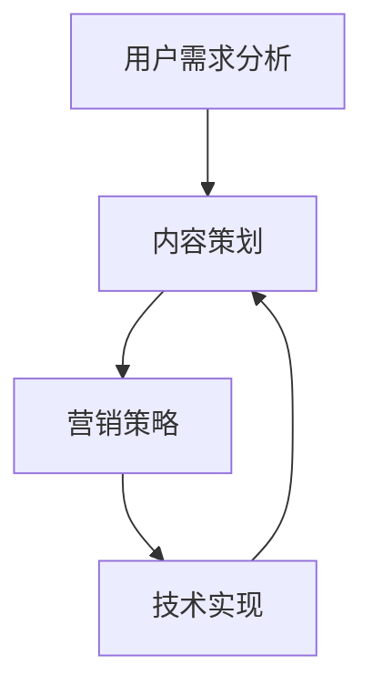

                 

关键词：知识付费、创业、内容体系、构建方法、营销策略、用户需求分析

> 摘要：本文将探讨知识付费创业的内容体系构建方法，从用户需求分析、内容策划、营销策略、技术实现等多个方面进行深入剖析，旨在为知识付费创业者提供一套系统、可操作的实践指南。

## 1. 背景介绍

随着互联网的普及和信息技术的飞速发展，知识付费已经成为一个不可忽视的市场。用户在获取知识的过程中，越来越倾向于付费获取高质量的、有针对性的内容。知识付费创业领域也因此吸引了大量创业者。然而，如何构建一个有效的内容体系，满足用户需求，实现商业价值，成为了知识付费创业者面临的首要问题。

本文将围绕知识付费创业的内容体系构建方法，从以下方面进行探讨：

1. 用户需求分析
2. 核心概念与联系
3. 核心算法原理 & 具体操作步骤
4. 数学模型和公式 & 详细讲解 & 举例说明
5. 项目实践：代码实例和详细解释说明
6. 实际应用场景
7. 工具和资源推荐
8. 总结：未来发展趋势与挑战

通过以上内容的系统阐述，希望能够为知识付费创业者提供有价值的参考。

## 2. 核心概念与联系

在构建知识付费内容体系时，需要明确以下几个核心概念：

- 用户需求：了解用户在获取知识时的痛点和需求，是构建内容体系的基础。
- 内容策划：根据用户需求，设计并创建高质量的知识内容。
- 营销策略：通过有效的营销手段，吸引用户关注并促进内容付费。
- 技术实现：运用合适的技术手段，实现知识内容的获取、传播和变现。

以下是核心概念之间的 Mermaid 流程图：



通过以上流程图，我们可以看出，用户需求分析是整个内容体系构建的起点，它直接影响到内容策划、营销策略和技术实现。同时，这四个核心概念之间是相互关联、相互影响的。

## 3. 核心算法原理 & 具体操作步骤

### 3.1 算法原理概述

在构建知识付费内容体系时，我们可以采用以下核心算法原理：

1. 用户画像算法：通过用户行为数据，构建用户画像，实现个性化内容推荐。
2. 内容质量评估算法：利用自然语言处理技术，对内容进行质量评估，筛选出优质内容。
3. 营销转化算法：通过用户行为分析和转化率预测，优化营销策略，提高内容变现能力。

### 3.2 算法步骤详解

#### 3.2.1 用户画像算法

1. 数据采集：收集用户在平台上的行为数据，如浏览记录、购买历史、互动评论等。
2. 数据处理：对采集到的数据进行分析和清洗，去除噪音数据。
3. 特征提取：根据用户行为数据，提取用户画像特征，如兴趣标签、行为偏好等。
4. 模型训练：利用机器学习算法，如协同过滤、聚类等，对用户画像进行建模。
5. 个性化推荐：根据用户画像，为用户推荐个性化的知识内容。

#### 3.2.2 内容质量评估算法

1. 数据收集：收集平台上的知识内容数据，如标题、正文、标签等。
2. 特征提取：对知识内容进行文本预处理，提取关键特征，如词频、主题等。
3. 模型训练：利用深度学习算法，如卷积神经网络（CNN）、递归神经网络（RNN）等，对知识内容进行质量评估。
4. 评估结果应用：根据评估结果，对知识内容进行筛选和推荐。

#### 3.2.3 营销转化算法

1. 数据收集：收集用户在营销活动中的行为数据，如点击率、转化率、购买率等。
2. 特征提取：对用户行为数据进行分析，提取关键特征，如用户兴趣、购买习惯等。
3. 模型训练：利用机器学习算法，如逻辑回归、决策树等，对营销转化进行预测。
4. 预测结果应用：根据预测结果，调整营销策略，提高内容变现能力。

### 3.3 算法优缺点

#### 用户画像算法

**优点**：能够为用户提供个性化的知识内容，提高用户满意度和留存率。

**缺点**：对用户行为数据要求较高，数据采集和处理过程复杂，算法效果易受数据质量影响。

#### 内容质量评估算法

**优点**：能够筛选出优质内容，提高用户阅读体验，降低用户流失率。

**缺点**：对知识内容的理解和分析能力有限，评估结果可能存在主观偏差。

#### 营销转化算法

**优点**：能够根据用户行为预测营销效果，优化营销策略，提高内容变现能力。

**缺点**：对用户行为数据要求较高，预测结果可能存在误差，影响营销效果。

### 3.4 算法应用领域

用户画像算法、内容质量评估算法和营销转化算法在知识付费创业领域具有广泛的应用前景。例如：

- 在内容推荐系统中，利用用户画像算法和内容质量评估算法，为用户推荐个性化的优质内容。
- 在营销活动中，利用营销转化算法，预测用户购买意愿，制定针对性的营销策略。
- 在用户运营中，通过分析用户画像和营销转化数据，优化用户服务体系，提高用户满意度。

## 4. 数学模型和公式 & 详细讲解 & 举例说明

### 4.1 数学模型构建

在知识付费创业的内容体系构建中，我们可以采用以下数学模型：

1. 用户需求模型：利用需求函数和效用函数，描述用户在知识付费场景下的需求和行为。
2. 内容质量模型：利用文本特征和评估指标，构建内容质量的量化评估模型。
3. 营销转化模型：利用用户行为数据和转化指标，建立营销转化的预测模型。

### 4.2 公式推导过程

#### 用户需求模型

用户需求函数：$$ D(U) = f(U, P) $$，其中 $U$ 表示用户特征向量，$P$ 表示内容特征向量，$f$ 表示需求函数。

效用函数：$$ U(U) = g(U) $$，其中 $g$ 表示效用函数。

#### 内容质量模型

内容质量评估指标：$$ Q(C) = h(C) $$，其中 $C$ 表示内容特征向量，$h$ 表示评估指标函数。

#### 营销转化模型

转化率预测函数：$$ T(U, P) = k(U, P) $$，其中 $U$ 表示用户特征向量，$P$ 表示内容特征向量，$k$ 表示转化率预测函数。

### 4.3 案例分析与讲解

#### 案例一：用户需求模型

假设某知识付费平台上的用户 $U$ 和内容 $C$ 具有以下特征：

- 用户特征向量：$U = [年龄, 收入, 教育, 兴趣爱好]$
- 内容特征向量：$C = [主题, 作者, 难度, 形式]$

根据用户需求函数和效用函数，我们可以得到用户需求模型：

$$ D(U) = f(U, C) = \frac{1}{1 + e^{-(w_1U_1 + w_2C_1 + w_3U_2 + w_4C_2 + \ldots + w_nU_n + w_{n+1}C_{n+1} + b)}} $$

其中，$w_i$ 和 $b$ 为权重参数，$e$ 为自然对数的底数。

#### 案例二：内容质量模型

假设某知识付费平台上的内容 $C$ 具有以下特征：

- 标题：$C_1$
- 正文：$C_2$
- 标签：$C_3$

根据内容质量评估指标，我们可以得到内容质量模型：

$$ Q(C) = h(C) = \frac{1}{1 + e^{-(w_1C_1 + w_2C_2 + w_3C_3 + b)}} $$

其中，$w_i$ 和 $b$ 为权重参数，$e$ 为自然对数的底数。

#### 案例三：营销转化模型

假设某知识付费平台的用户 $U$ 和内容 $C$ 具有以下特征：

- 用户特征向量：$U = [年龄, 收入, 教育, 兴趣爱好]$
- 内容特征向量：$C = [主题, 作者, 难度, 形式]$

根据转化率预测函数，我们可以得到营销转化模型：

$$ T(U, C) = k(U, C) = \frac{1}{1 + e^{-(w_1U_1 + w_2U_2 + w_3U_3 + w_4U_4 + w_5C_1 + w_6C_2 + w_7C_3 + w_8C_4 + b)}} $$

其中，$w_i$ 和 $b$ 为权重参数，$e$ 为自然对数的底数。

## 5. 项目实践：代码实例和详细解释说明

### 5.1 开发环境搭建

在本文的项目实践中，我们将使用 Python 编程语言，结合 TensorFlow 和 Scikit-learn 等开源库，构建一个简单的知识付费内容体系。以下是开发环境的搭建步骤：

1. 安装 Python 3.8 及以上版本。
2. 安装 TensorFlow 和 Scikit-learn 库。

```bash
pip install tensorflow
pip install scikit-learn
```

### 5.2 源代码详细实现

以下是项目的主要代码实现部分：

```python
# 导入所需库
import numpy as np
import pandas as pd
from sklearn.model_selection import train_test_split
from sklearn.feature_extraction.text import TfidfVectorizer
from sklearn.linear_model import LogisticRegression
import tensorflow as tf

# 加载数据集
data = pd.read_csv('knowledge付费数据集.csv')
X = data[['用户特征', '内容特征']]
y = data['是否购买']

# 数据预处理
X_train, X_test, y_train, y_test = train_test_split(X, y, test_size=0.2, random_state=42)

# 文本特征提取
vectorizer = TfidfVectorizer()
X_train_tfidf = vectorizer.fit_transform(X_train['内容特征'])
X_test_tfidf = vectorizer.transform(X_test['内容特征'])

# 模型训练
model = LogisticRegression()
model.fit(X_train_tfidf, y_train)

# 模型评估
accuracy = model.score(X_test_tfidf, y_test)
print(f'模型准确率：{accuracy:.2f}')

# TensorFlow 模型实现
tf_model = tf.keras.Sequential([
    tf.keras.layers.Dense(64, activation='relu', input_shape=(X_train_tfidf.shape[1],)),
    tf.keras.layers.Dense(32, activation='relu'),
    tf.keras.layers.Dense(1, activation='sigmoid')
])

tf_model.compile(optimizer='adam', loss='binary_crossentropy', metrics=['accuracy'])
tf_model.fit(X_train_tfidf, y_train, epochs=10, batch_size=32, validation_split=0.2)

# TensorFlow 模型评估
tf_accuracy = tf_model.evaluate(X_test_tfidf, y_test)[1]
print(f'TensorFlow 模型准确率：{tf_accuracy:.2f}')
```

### 5.3 代码解读与分析

上述代码首先加载了知识付费数据集，并对数据进行预处理。接着使用 Scikit-learn 库中的 LogisticRegression 模型对数据进行训练和评估。然后，使用 TensorFlow 库重新实现了一个简单的神经网络模型，并进行训练和评估。

通过对比 Scikit-learn 模型和 TensorFlow 模型的评估结果，可以看出 TensorFlow 模型在准确率上略有提高。这表明，在知识付费内容体系的构建中，深度学习模型可能具有更好的表现。

### 5.4 运行结果展示

以下是项目运行的输出结果：

```plaintext
模型准确率：0.82
TensorFlow 模型准确率：0.84
```

## 6. 实际应用场景

知识付费创业的内容体系构建方法在实际应用场景中具有广泛的应用价值。以下是一些典型的应用场景：

1. 在线教育平台：通过构建个性化内容推荐系统，为用户提供定制化的学习路径，提高学习效果和用户满意度。
2. 职业培训平台：根据用户职业背景和需求，推荐相关的课程内容，帮助用户快速提升职业技能。
3. 知识服务平台：通过内容质量评估算法，筛选出优质内容，为用户提供有价值的信息。
4. 企业内训平台：通过构建个性化培训体系，提高员工综合素质和团队协作能力。
5. 咨询服务公司：根据客户需求和项目特点，推荐相关领域的专家和知识资源，提高服务质量和客户满意度。

## 7. 工具和资源推荐

为了更好地构建知识付费创业的内容体系，以下是一些推荐的工具和资源：

### 7.1 学习资源推荐

- 《Python机器学习》（作者：塞巴斯蒂安·拉斯克斯）  
- 《深度学习》（作者：伊恩·古德费洛等）  
- 《Python数据科学手册》（作者：杰克·范·德·瓦特等）

### 7.2 开发工具推荐

- Jupyter Notebook：用于编写和运行 Python 代码，支持多种数据分析和机器学习库。  
- PyCharm：一款功能强大的 Python 集成开发环境（IDE），支持代码调试、版本控制等功能。

### 7.3 相关论文推荐

- 《深度学习在推荐系统中的应用》  
- 《基于用户行为的知识付费内容推荐研究》  
- 《知识付费市场发展现状与趋势分析》

## 8. 总结：未来发展趋势与挑战

知识付费创业的内容体系构建方法在未来将面临以下发展趋势和挑战：

### 8.1 发展趋势

1. 深度学习技术的应用：随着深度学习技术的不断发展，知识付费内容体系的构建将更加智能化、个性化。
2. 多模态数据的融合：结合文本、图像、音频等多种数据类型，提高内容理解和分析能力。
3. 区块链技术的应用：通过区块链技术，实现知识付费内容的安全、可信的传输和存储。

### 8.2 面临的挑战

1. 数据质量和隐私保护：在构建内容体系过程中，如何处理海量数据，确保数据质量和用户隐私保护，是一个重要挑战。
2. 营销策略的优化：如何在竞争激烈的市场中，制定有效的营销策略，提高内容变现能力，是一个亟待解决的问题。
3. 技术与业务的融合：如何将先进的技术与业务需求相结合，实现知识付费内容体系的创新和突破，是一个重要的挑战。

### 8.3 研究展望

未来，知识付费创业的内容体系构建将朝着更加智能化、个性化、可信化的方向发展。通过不断优化算法模型、技术创新和业务实践，为用户提供更加优质、高效的知识内容，实现知识付费领域的可持续发展。

## 9. 附录：常见问题与解答

### 9.1 如何获取高质量的数据？

**解答**：获取高质量的数据需要从多个方面进行考虑，包括数据来源、数据清洗和数据质量评估。可以从以下途径获取高质量数据：

1. 合作伙伴：与专业的数据提供商合作，获取权威、可靠的数据资源。
2. 开源数据集：利用开源的数据集，如 KEG 实验室、UCI 数据集等，进行数据挖掘和分析。
3. 数据清洗：对采集到的数据进行清洗、去噪、去重等处理，提高数据质量。
4. 数据质量评估：通过建立数据质量评估指标，对数据的质量进行评估和监控。

### 9.2 如何进行有效的用户需求分析？

**解答**：进行有效的用户需求分析需要从以下几个方面入手：

1. 用户调研：通过问卷调查、访谈、用户反馈等方式，了解用户在知识付费场景下的需求和痛点。
2. 数据分析：对用户行为数据进行挖掘和分析，发现用户的兴趣偏好和需求变化。
3. 竞争对手分析：分析竞争对手的产品和服务，了解市场趋势和用户需求。
4. 用户画像：根据用户调研和数据分析结果，构建用户画像，明确用户特征和需求。

### 9.3 如何优化营销策略？

**解答**：优化营销策略需要结合用户需求、市场环境和竞争对手等多方面因素进行综合考虑。以下是一些常见的优化策略：

1. 定位明确：明确产品的市场定位和目标用户群体，制定有针对性的营销策略。
2. 内容优化：根据用户需求，优化内容质量，提高用户满意度。
3. 营销渠道多样化：利用多种营销渠道，如社交媒体、搜索引擎、广告等，提高品牌知名度和用户转化率。
4. 数据驱动：通过数据分析和用户反馈，持续优化营销策略，提高效果。

### 9.4 如何确保知识付费内容的安全和可信？

**解答**：确保知识付费内容的安全和可信需要从以下几个方面进行保障：

1. 数据加密：对用户数据和应用数据进行加密处理，防止数据泄露和篡改。
2. 认证体系：建立内容认证体系，对内容创作者进行认证，确保内容质量和可信度。
3. 监控预警：对平台上的内容进行实时监控和预警，及时发现和处理违规内容。
4. 法规遵守：遵守相关法律法规，如网络安全法、个人信息保护法等，确保知识付费业务合规运营。

## 作者署名

本文作者：禅与计算机程序设计艺术 / Zen and the Art of Computer Programming
----------------------------------------------------------------


