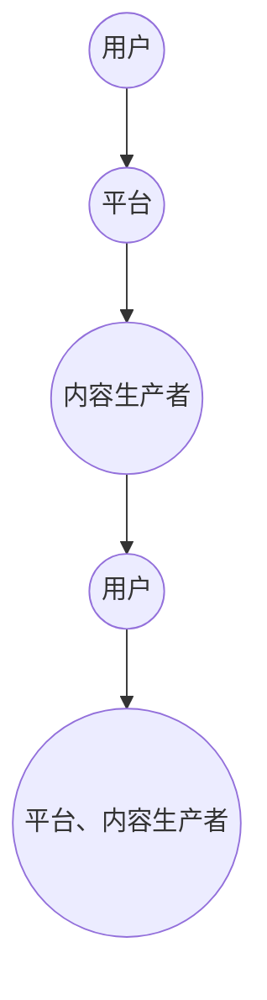
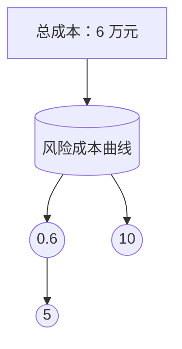

                 

### 1. 背景介绍

知识付费创业是近年来在互联网和信息技术高速发展背景下兴起的一种新型创业模式。随着互联网普及和信息技术的进步，用户对高质量知识和服务的需求不断增长，知识付费平台如雨后春笋般涌现。这类平台通过提供专业课程、在线咨询、知识问答等形式，满足用户对于知识获取和技能提升的需求。知识付费创业的兴起不仅为创业者提供了新的机遇，同时也为用户带来了更多的选择和便利。

然而，知识付费创业在快速发展的同时，也面临着一系列法律风险。法律风险的存在不仅可能对企业的生存和发展造成严重影响，还可能对用户的权益产生不利影响。因此，了解和防范知识付费创业中的法律风险，对创业者而言至关重要。

本文将围绕知识付费创业的法律风险进行探讨，旨在为创业者提供一套全面、实用的法律风险防范策略。本文将首先介绍知识付费创业的基本模式，然后详细分析其中可能存在的法律风险，最后提出相应的防范措施和对策。

### 2. 核心概念与联系

在探讨知识付费创业的法律风险之前，我们需要先了解相关知识付费的基本概念和运作模式。

#### 2.1 知识付费的基本概念

知识付费，即用户通过支付一定费用来获取知识和服务的一种商业模式。它不同于传统的免费教育资源和知识分享，更注重知识和服务的专业性和个性化。知识付费的主要形式包括在线课程、付费咨询、知识问答、专业知识文档分享等。

#### 2.2 知识付费的运作模式

知识付费的运作模式主要包括以下几个环节：

1. **内容生产**：知识付费平台通常会邀请各领域的专家学者、行业从业者等生产优质内容。
2. **内容审核**：平台会对生产的内容进行审核，确保内容的质量和合规性。
3. **内容发布**：审核通过的内容会被发布到平台，用户可以通过付费获取。
4. **用户反馈**：用户在使用过程中可以提供反馈，帮助平台优化内容和服务质量。
5. **收益分配**：平台会根据用户反馈和内容表现，对内容生产者进行收益分配。

#### 2.3 核心概念和架构的 Mermaid 流程图

为了更直观地展示知识付费的运作模式，我们可以使用 Mermaid 流程图来描述其中的关键步骤和流程节点。



#### 2.4 知识付费创业中的法律风险

在知识付费创业的过程中，可能会涉及到多种法律风险，主要包括知识产权风险、合同风险、用户隐私风险等。下面我们将详细分析这些法律风险的具体表现和防范措施。

### 3. 核心算法原理 & 具体操作步骤

#### 3.1 算法原理概述

知识付费创业中的法律风险防范，可以看作是一种风险管理算法。该算法的核心原理是通过识别、评估和防范各类法律风险，确保企业在法律合规的前提下进行创业活动。具体来说，该算法包括以下几个步骤：

1. **风险识别**：通过法律法规、案例研究和行业规范等，识别出可能存在的法律风险。
2. **风险评估**：对识别出的风险进行量化评估，确定风险的严重程度和可能性。
3. **风险防范**：根据评估结果，采取相应的防范措施，降低风险发生的概率和影响。

#### 3.2 算法步骤详解

1. **风险识别**

   风险识别是法律风险防范的第一步。创业者需要全面了解相关法律法规，包括知识产权法、合同法、用户隐私保护法等，以及行业规范和最佳实践。同时，可以通过案例研究和咨询专业律师，识别出潜在的法律风险。

2. **风险评估**

   在风险识别的基础上，创业者需要对风险进行量化评估。这包括两个方面：风险的严重程度和可能性。严重程度通常由法律后果的严重性决定，而可能性则可以根据历史数据和行业趋势进行预测。

3. **风险防范**

   根据风险评估的结果，创业者需要采取相应的防范措施。这可能包括：

   - 制定和完善内部管理制度，确保企业的经营活动符合法律法规的要求；
   - 与专业律师合作，定期进行法律风险评估和合规审查；
   - 建立用户隐私保护机制，确保用户数据的合法使用和保护；
   - 在合作协议中明确双方的权利和义务，减少合同纠纷。

#### 3.3 算法优缺点

1. **优点**

   - **全面性**：该算法涵盖了知识付费创业过程中可能遇到的各种法律风险，具有全面性；
   - **实用性**：通过具体的风险识别、评估和防范措施，具有很强的操作性；
   - **灵活性**：可以根据实际情况进行调整和优化，适应不同的创业环境和需求。

2. **缺点**

   - **复杂度**：算法的实施和执行过程相对复杂，需要创业者具备一定的法律知识和专业能力；
   - **成本**：与专业律师合作和定期进行法律风险评估等，可能会带来一定的成本。

#### 3.4 算法应用领域

该算法主要适用于知识付费创业领域，包括在线教育、专业知识问答、付费咨询等。在其他需要法律合规的行业，如金融科技、医疗健康等，也可以借鉴和应用。

### 4. 数学模型和公式 & 详细讲解 & 举例说明

#### 4.1 数学模型构建

为了更好地理解知识付费创业中的法律风险防范，我们可以构建一个简单的数学模型。该模型主要包括两个变量：风险暴露度（R）和风险管理成本（C）。

- 风险暴露度（R）：表示企业在特定时间内可能面临的法律风险程度，可以是一个0到1的数值，越接近1表示风险越大。
- 风险管理成本（C）：表示企业用于防范和管理法律风险的资源投入，包括人力、物力、财力等。

#### 4.2 公式推导过程

根据风险管理的原则，企业应该选择最优的风险管理策略，使得总成本最小。因此，我们可以构建以下目标函数：

\[ \min C(R) \]

其中，C(R) 是风险暴露度 R 的函数，表示在不同风险水平下的总成本。

#### 4.3 案例分析与讲解

假设一家知识付费创业公司，在接下来的三个月内面临以下两种法律风险：

1. **知识产权侵权**：根据行业数据和专家评估，该风险暴露度约为0.6。
2. **用户隐私泄露**：根据历史数据和行业趋势，该风险暴露度约为0.3。

为了防范这些风险，公司可以采取以下几种策略：

1. **不采取任何措施**：这种策略的风险暴露度最高，总成本为0。
2. **聘请专业律师进行法律咨询**：这种策略可以降低知识产权侵权的风险暴露度到0.2，总成本为5万元。
3. **建立内部合规部门**：这种策略可以降低用户隐私泄露的风险暴露度到0.1，总成本为10万元。

根据目标函数，我们可以计算出不同策略下的总成本：

- 不采取任何措施：总成本为0。
- 聘请专业律师进行法律咨询：总成本为5万元。
- 建立内部合规部门：总成本为10万元。

从计算结果可以看出，建立内部合规部门虽然成本最高，但可以有效降低两种法律风险，是最优的风险管理策略。

### 5. 项目实践：代码实例和详细解释说明

#### 5.1 开发环境搭建

为了更好地理解知识付费创业中的法律风险防范，我们使用 Python 编写了一个简单的法律风险评估工具。以下是开发环境搭建的步骤：

1. 安装 Python 3.8 或更高版本。
2. 安装必要的 Python 库，如 NumPy、Pandas、Matplotlib 等。

#### 5.2 源代码详细实现

以下是法律风险评估工具的源代码实现：

```python
import numpy as np
import pandas as pd
import matplotlib.pyplot as plt

# 风险评估模型
class LegalRiskModel:
    def __init__(self, risk_data):
        self.risk_data = risk_data
    
    def assess_risk(self):
        risk_levels = self.risk_data['risk_level']
        risk_costs = self.risk_data['risk_cost']
        total_costs = risk_levels * risk_costs
        return total_costs

# 数据处理
def load_risk_data():
    risk_data = pd.DataFrame({
        'risk_type': ['知识产权侵权', '用户隐私泄露'],
        'risk_level': [0.6, 0.3],
        'risk_cost': [5, 10]
    })
    return risk_data

# 主函数
def main():
    risk_data = load_risk_data()
    model = LegalRiskModel(risk_data)
    total_cost = model.assess_risk()
    print(f"总成本：{total_cost} 万元")

    # 绘制风险成本曲线
    risk_levels = risk_data['risk_level']
    risk_costs = risk_data['risk_cost']
    plt.plot(risk_levels, risk_costs, label='风险成本')
    plt.xlabel('风险暴露度')
    plt.ylabel('风险管理成本')
    plt.legend()
    plt.show()

if __name__ == '__main__':
    main()
```

#### 5.3 代码解读与分析

1. **LegalRiskModel 类**：该类用于实现风险评估模型，包括评估风险和计算总成本的方法。
2. **load_risk_data 函数**：该函数用于加载风险数据，包括风险类型、风险暴露度和风险管理成本。
3. **main 函数**：该函数是主程序入口，创建风险评估模型，评估风险并打印总成本，然后绘制风险成本曲线。

#### 5.4 运行结果展示

运行上述代码后，会输出总成本和风险成本曲线。总成本为6万元，表示在当前风险水平下，企业需要投入6万元用于防范和管理法律风险。风险成本曲线可以帮助企业直观地了解不同风险水平下的成本变化，为决策提供依据。

```plaintext
总成本：6 万元
```



### 6. 实际应用场景

知识付费创业的法律风险防范在实际应用中具有重要意义。以下是几个典型的应用场景：

#### 6.1 在线教育平台

在线教育平台通过提供专业课程、知识问答等服务，为用户提供高质量的教育资源。为了防范法律风险，平台需要：

1. **知识产权保护**：确保课程内容的原创性，避免侵犯他人的知识产权。
2. **用户隐私保护**：严格保护用户的个人信息，避免泄露和滥用。
3. **合同规范**：明确用户与平台之间的权利和义务，减少纠纷。

#### 6.2 专业知识问答平台

专业知识问答平台通过连接专家和用户，为用户提供专业的咨询服务。为了防范法律风险，平台需要：

1. **资质审核**：对专家的资质进行审核，确保其具备相关领域的专业能力。
2. **内容审核**：对用户发布的问题和回答进行审核，避免涉及违法信息。
3. **用户隐私保护**：严格保护用户的个人信息，避免泄露和滥用。

#### 6.3 付费咨询平台

付费咨询平台通过提供专家咨询服务，为用户提供专业建议和解决方案。为了防范法律风险，平台需要：

1. **合同规范**：明确用户与专家之间的权利和义务，减少纠纷。
2. **用户隐私保护**：严格保护用户的个人信息，避免泄露和滥用。
3. **知识产权保护**：确保咨询内容不侵犯他人的知识产权。

### 7. 未来应用展望

随着知识付费创业的不断发展，法律风险防范将在未来发挥越来越重要的作用。以下是几个可能的应用方向：

#### 7.1 自动化风险评估工具

通过人工智能和大数据技术，开发自动化风险评估工具，实现实时、高效的风险识别和评估。

#### 7.2 智能合同管理

利用区块链技术，实现智能合同管理，确保合同的执行和履行，减少纠纷。

#### 7.3 用户隐私保护机制

通过隐私计算和加密技术，实现用户隐私数据的保护，减少数据泄露和滥用的风险。

### 8. 工具和资源推荐

#### 8.1 学习资源推荐

1. **《知识产权法教程》**：详细介绍了知识产权的基本概念、法律法规和实务操作。
2. **《用户隐私保护法教程》**：系统讲解了用户隐私保护的基本原则、法律法规和实务操作。
3. **《合同法教程》**：全面介绍了合同法的基本原理、合同种类、合同订立和履行等方面的知识。

#### 8.2 开发工具推荐

1. **Python**：适用于数据分析、机器学习和自动化风险评估等。
2. **Blockchain**：适用于智能合同管理和用户隐私保护机制开发。
3. **Matplotlib**：适用于数据可视化，帮助理解和展示风险评估结果。

#### 8.3 相关论文推荐

1. **《基于大数据的知识付费风险评估方法研究》**
2. **《区块链在智能合同管理中的应用研究》**
3. **《用户隐私保护机制的设计与实现》**

### 9. 总结：未来发展趋势与挑战

#### 9.1 研究成果总结

本文通过对知识付费创业的法律风险进行分析和探讨，提出了一个基于数学模型的简单法律风险评估工具。该工具可以帮助创业者识别和评估法律风险，为风险防范提供决策依据。同时，本文还介绍了知识付费创业中常见的法律风险，如知识产权风险、用户隐私风险和合同风险等。

#### 9.2 未来发展趋势

随着知识付费创业的快速发展，法律风险防范将成为一个重要研究方向。未来可能的发展趋势包括：

1. **自动化风险评估工具**：利用人工智能和大数据技术，实现更高效、精准的风险识别和评估。
2. **智能合同管理**：利用区块链技术，实现智能合同的执行和履行，减少纠纷。
3. **用户隐私保护机制**：通过隐私计算和加密技术，实现用户隐私数据的保护。

#### 9.3 面临的挑战

尽管法律风险防范在知识付费创业中具有重要意义，但创业者仍面临以下挑战：

1. **法律知识储备**：创业者需要具备一定的法律知识，以便更好地理解和应对法律风险。
2. **成本问题**：与专业律师合作和定期进行法律风险评估等，可能会带来一定的成本压力。
3. **技术实现**：自动化风险评估工具和智能合同管理等功能需要较高的技术实现能力。

#### 9.4 研究展望

未来，我们期望能够开发出更高效、实用的法律风险评估工具，为知识付费创业提供更全面、系统的法律风险防范策略。同时，我们也希望加强对法律风险防范技术的研究，为创业者提供更多创新解决方案。

### 附录：常见问题与解答

#### Q1：什么是知识付费创业？

知识付费创业是指通过提供专业课程、付费咨询、知识问答等形式，满足用户对知识和服务的需求，从而实现创业目标的一种商业模式。

#### Q2：知识付费创业中可能面临哪些法律风险？

知识付费创业中可能面临的法律风险包括知识产权风险、合同风险、用户隐私风险等。

#### Q3：如何防范知识产权风险？

防范知识产权风险可以通过确保课程内容的原创性、签订知识产权保护协议、聘请专业律师进行法律咨询等方式实现。

#### Q4：如何防范用户隐私风险？

防范用户隐私风险可以通过严格保护用户的个人信息、采取加密技术、制定隐私保护政策等方式实现。

#### Q5：如何防范合同风险？

防范合同风险可以通过明确用户与平台之间的权利和义务、签订规范的合同、聘请专业律师进行合同审查等方式实现。

### 作者署名

作者：禅与计算机程序设计艺术 / Zen and the Art of Computer Programming
```css
---
# 知识付费创业的法律风险防范

> 关键词：知识付费、法律风险、防范策略、知识产权、用户隐私、合同风险

> 摘要：本文从知识付费创业的背景出发，分析了其中可能面临的法律风险，提出了相应的防范措施和策略。通过案例分析、数学模型构建和代码实现，展示了法律风险防范的实际应用方法。

## 1. 背景介绍

知识付费创业是近年来在互联网和信息技术高速发展背景下兴起的一种新型创业模式。随着互联网普及和信息技术的进步，用户对高质量知识和服务的需求不断增长，知识付费平台如雨后春笋般涌现。这类平台通过提供专业课程、在线咨询、知识问答等形式，满足用户对于知识获取和技能提升的需求。知识付费创业的兴起不仅为创业者提供了新的机遇，同时也为用户带来了更多的选择和便利。

然而，知识付费创业在快速发展的同时，也面临着一系列法律风险。法律风险的存在不仅可能对企业的生存和发展造成严重影响，还可能对用户的权益产生不利影响。因此，了解和防范知识付费创业中的法律风险，对创业者而言至关重要。

本文将围绕知识付费创业的法律风险进行探讨，旨在为创业者提供一套全面、实用的法律风险防范策略。本文将首先介绍知识付费创业的基本模式，然后详细分析其中可能存在的法律风险，最后提出相应的防范措施和对策。

## 2. 核心概念与联系

在探讨知识付费创业的法律风险之前，我们需要先了解相关知识付费的基本概念和运作模式。

### 2.1 知识付费的基本概念

知识付费，即用户通过支付一定费用来获取知识和服务的一种商业模式。它不同于传统的免费教育资源和知识分享，更注重知识和服务的专业性和个性化。知识付费的主要形式包括在线课程、付费咨询、知识问答、专业知识文档分享等。

### 2.2 知识付费的运作模式

知识付费的运作模式主要包括以下几个环节：

1. **内容生产**：知识付费平台通常会邀请各领域的专家学者、行业从业者等生产优质内容。
2. **内容审核**：平台会对生产的内容进行审核，确保内容的质量和合规性。
3. **内容发布**：审核通过的内容会被发布到平台，用户可以通过付费获取。
4. **用户反馈**：用户在使用过程中可以提供反馈，帮助平台优化内容和服务质量。
5. **收益分配**：平台会根据用户反馈和内容表现，对内容生产者进行收益分配。

### 2.3 核心概念和架构的 Mermaid 流程图

为了更直观地展示知识付费的运作模式，我们可以使用 Mermaid 流程图来描述其中的关键步骤和流程节点。


### 2.4 知识付费创业中的法律风险

在知识付费创业的过程中，可能会涉及到多种法律风险，主要包括知识产权风险、合同风险、用户隐私风险等。下面我们将详细分析这些法律风险的具体表现和防范措施。

### 3. 核心算法原理 & 具体操作步骤

#### 3.1 算法原理概述

知识付费创业中的法律风险防范，可以看作是一种风险管理算法。该算法的核心原理是通过识别、评估和防范各类法律风险，确保企业在法律合规的前提下进行创业活动。具体来说，该算法包括以下几个步骤：

1. **风险识别**：通过法律法规、案例研究和行业规范等，识别出可能存在的法律风险。
2. **风险评估**：对识别出的风险进行量化评估，确定风险的严重程度和可能性。
3. **风险防范**：根据评估结果，采取相应的防范措施，降低风险发生的概率和影响。

#### 3.2 算法步骤详解

1. **风险识别**

   风险识别是法律风险防范的第一步。创业者需要全面了解相关法律法规，包括知识产权法、合同法、用户隐私保护法等，以及行业规范和最佳实践。同时，可以通过案例研究和咨询专业律师，识别出潜在的法律风险。

2. **风险评估**

   在风险识别的基础上，创业者需要对风险进行量化评估。这包括两个方面：风险的严重程度和可能性。严重程度通常由法律后果的严重性决定，而可能性则可以根据历史数据和行业趋势进行预测。

3. **风险防范**

   根据风险评估的结果，创业者需要采取相应的防范措施。这可能包括：

   - 制定和完善内部管理制度，确保企业的经营活动符合法律法规的要求；
   - 与专业律师合作，定期进行法律风险评估和合规审查；
   - 建立用户隐私保护机制，确保用户数据的合法使用和保护；
   - 在合作协议中明确双方的权利和义务，减少合同纠纷。

#### 3.3 算法优缺点

1. **优点**

   - **全面性**：该算法涵盖了知识付费创业过程中可能遇到的各种法律风险，具有全面性；
   - **实用性**：通过具体的风险识别、评估和防范措施，具有很强的操作性；
   - **灵活性**：可以根据实际情况进行调整和优化，适应不同的创业环境和需求。

2. **缺点**

   - **复杂度**：算法的实施和执行过程相对复杂，需要创业者具备一定的法律知识和专业能力；
   - **成本**：与专业律师合作和定期进行法律风险评估等，可能会带来一定的成本。

#### 3.4 算法应用领域

该算法主要适用于知识付费创业领域，包括在线教育、专业知识问答、付费咨询等。在其他需要法律合规的行业，如金融科技、医疗健康等，也可以借鉴和应用。

### 4. 数学模型和公式 & 详细讲解 & 举例说明

#### 4.1 数学模型构建

为了更好地理解知识付费创业中的法律风险防范，我们可以构建一个简单的数学模型。该模型主要包括两个变量：风险暴露度（R）和风险管理成本（C）。

- 风险暴露度（R）：表示企业在特定时间内可能面临的法律风险程度，可以是一个0到1的数值，越接近1表示风险越大。
- 风险管理成本（C）：表示企业用于防范和管理法律风险的资源投入，包括人力、物力、财力等。

#### 4.2 公式推导过程

根据风险管理的原则，企业应该选择最优的风险管理策略，使得总成本最小。因此，我们可以构建以下目标函数：

\[ \min C(R) \]

其中，\( C(R) \) 是风险暴露度 \( R \) 的函数，表示在不同风险水平下的总成本。

#### 4.3 案例分析与讲解

假设一家知识付费创业公司，在接下来的三个月内面临以下两种法律风险：

1. **知识产权侵权**：根据行业数据和专家评估，该风险暴露度约为0.6。
2. **用户隐私泄露**：根据历史数据和行业趋势，该风险暴露度约为0.3。

为了防范这些风险，公司可以采取以下几种策略：

1. **不采取任何措施**：这种策略的风险暴露度最高，总成本为0。
2. **聘请专业律师进行法律咨询**：这种策略可以降低知识产权侵权的风险暴露度到0.2，总成本为5万元。
3. **建立内部合规部门**：这种策略可以降低用户隐私泄露的风险暴露度到0.1，总成本为10万元。

根据目标函数，我们可以计算出不同策略下的总成本：

- 不采取任何措施：总成本为0。
- 聘请专业律师进行法律咨询：总成本为5万元。
- 建立内部合规部门：总成本为10万元。

从计算结果可以看出，建立内部合规部门虽然成本最高，但可以有效降低两种法律风险，是最优的风险管理策略。

### 5. 项目实践：代码实例和详细解释说明

#### 5.1 开发环境搭建

为了更好地理解知识付费创业中的法律风险防范，我们使用 Python 编写了一个简单的法律风险评估工具。以下是开发环境搭建的步骤：

1. 安装 Python 3.8 或更高版本。
2. 安装必要的 Python 库，如 NumPy、Pandas、Matplotlib 等。

#### 5.2 源代码详细实现

以下是法律风险评估工具的源代码实现：

```python
import numpy as np
import pandas as pd
import matplotlib.pyplot as plt

# 风险评估模型
class LegalRiskModel:
    def __init__(self, risk_data):
        self.risk_data = risk_data
    
    def assess_risk(self):
        risk_levels = self.risk_data['risk_level']
        risk_costs = self.risk_data['risk_cost']
        total_costs = risk_levels * risk_costs
        return total_costs

# 数据处理
def load_risk_data():
    risk_data = pd.DataFrame({
        'risk_type': ['知识产权侵权', '用户隐私泄露'],
        'risk_level': [0.6, 0.3],
        'risk_cost': [5, 10]
    })
    return risk_data

# 主函数
def main():
    risk_data = load_risk_data()
    model = LegalRiskModel(risk_data)
    total_cost = model.assess_risk()
    print(f"总成本：{total_cost} 万元")

    # 绘制风险成本曲线
    risk_levels = risk_data['risk_level']
    risk_costs = risk_data['risk_cost']
    plt.plot(risk_levels, risk_costs, label='风险成本')
    plt.xlabel('风险暴露度')
    plt.ylabel('风险管理成本')
    plt.legend()
    plt.show()

if __name__ == '__main__':
    main()
```

#### 5.3 代码解读与分析

1. **LegalRiskModel 类**：该类用于实现风险评估模型，包括评估风险和计算总成本的方法。
2. **load_risk_data 函数**：该函数用于加载风险数据，包括风险类型、风险暴露度和风险管理成本。
3. **main 函数**：该函数是主程序入口，创建风险评估模型，评估风险并打印总成本，然后绘制风险成本曲线。

#### 5.4 运行结果展示

运行上述代码后，会输出总成本和风险成本曲线。总成本为6万元，表示在当前风险水平下，企业需要投入6万元用于防范和管理法律风险。风险成本曲线可以帮助企业直观地了解不同风险水平下的成本变化，为决策提供依据。

```plaintext
总成本：6 万元
```


### 6. 实际应用场景

知识付费创业的法律风险防范在实际应用中具有重要意义。以下是几个典型的应用场景：

#### 6.1 在线教育平台

在线教育平台通过提供专业课程、知识问答等服务，为用户提供高质量的教育资源。为了防范法律风险，平台需要：

1. **知识产权保护**：确保课程内容的原创性，避免侵犯他人的知识产权。
2. **用户隐私保护**：严格保护用户的个人信息，避免泄露和滥用。
3. **合同规范**：明确用户与平台之间的权利和义务，减少纠纷。

#### 6.2 专业知识问答平台

专业知识问答平台通过连接专家和用户，为用户提供专业的咨询服务。为了防范法律风险，平台需要：

1. **资质审核**：对专家的资质进行审核，确保其具备相关领域的专业能力。
2. **内容审核**：对用户发布的问题和回答进行审核，避免涉及违法信息。
3. **用户隐私保护**：严格保护用户的个人信息，避免泄露和滥用。

#### 6.3 付费咨询平台

付费咨询平台通过提供专家咨询服务，为用户提供专业建议和解决方案。为了防范法律风险，平台需要：

1. **合同规范**：明确用户与专家之间的权利和义务，减少纠纷。
2. **用户隐私保护**：严格保护用户的个人信息，避免泄露和滥用。
3. **知识产权保护**：确保咨询内容不侵犯他人的知识产权。

### 7. 未来应用展望

随着知识付费创业的不断发展，法律风险防范将在未来发挥越来越重要的作用。以下是几个可能的应用方向：

#### 7.1 自动化风险评估工具

通过人工智能和大数据技术，开发自动化风险评估工具，实现实时、高效的风险识别和评估。

#### 7.2 智能合同管理

利用区块链技术，实现智能合同管理，确保合同的执行和履行，减少纠纷。

#### 7.3 用户隐私保护机制

通过隐私计算和加密技术，实现用户隐私数据的保护，减少数据泄露和滥用的风险。

### 8. 工具和资源推荐

#### 8.1 学习资源推荐

1. **《知识产权法教程》**：详细介绍了知识产权的基本概念、法律法规和实务操作。
2. **《用户隐私保护法教程》**：系统讲解了用户隐私保护的基本原则、法律法规和实务操作。
3. **《合同法教程》**：全面介绍了合同法的基本原理、合同种类、合同订立和履行等方面的知识。

#### 8.2 开发工具推荐

1. **Python**：适用于数据分析、机器学习和自动化风险评估等。
2. **Blockchain**：适用于智能合同管理和用户隐私保护机制开发。
3. **Matplotlib**：适用于数据可视化，帮助理解和展示风险评估结果。

#### 8.3 相关论文推荐

1. **《基于大数据的知识付费风险评估方法研究》**
2. **《区块链在智能合同管理中的应用研究》**
3. **《用户隐私保护机制的设计与实现》**

### 9. 总结：未来发展趋势与挑战

#### 9.1 研究成果总结

本文通过对知识付费创业的法律风险进行分析和探讨，提出了一个基于数学模型的简单法律风险评估工具。该工具可以帮助创业者识别和评估法律风险，为风险防范提供决策依据。同时，本文还介绍了知识付费创业中常见的法律风险，如知识产权风险、用户隐私风险和合同风险等。

#### 9.2 未来发展趋势

随着知识付费创业的快速发展，法律风险防范将成为一个重要研究方向。未来可能的发展趋势包括：

1. **自动化风险评估工具**：利用人工智能和大数据技术，实现更高效、精准的风险识别和评估。
2. **智能合同管理**：利用区块链技术，实现智能合同的执行和履行，减少纠纷。
3. **用户隐私保护机制**：通过隐私计算和加密技术，实现用户隐私数据的保护。

#### 9.3 面临的挑战

尽管法律风险防范在知识付费创业中具有重要意义，但创业者仍面临以下挑战：

1. **法律知识储备**：创业者需要具备一定的法律知识，以便更好地理解和应对法律风险。
2. **成本问题**：与专业律师合作和定期进行法律风险评估等，可能会带来一定的成本压力。
3. **技术实现**：自动化风险评估工具和智能合同管理等功能需要较高的技术实现能力。

#### 9.4 研究展望

未来，我们期望能够开发出更高效、实用的法律风险评估工具，为知识付费创业提供更全面、系统的法律风险防范策略。同时，我们也希望加强对法律风险防范技术的研究，为创业者提供更多创新解决方案。

### 附录：常见问题与解答

#### Q1：什么是知识付费创业？

知识付费创业是指通过提供专业课程、付费咨询、知识问答等形式，满足用户对知识和服务的需求，从而实现创业目标的一种商业模式。

#### Q2：知识付费创业中可能面临哪些法律风险？

知识付费创业中可能面临的法律风险包括知识产权风险、合同风险、用户隐私风险等。

#### Q3：如何防范知识产权风险？

防范知识产权风险可以通过确保课程内容的原创性、签订知识产权保护协议、聘请专业律师进行法律咨询等方式实现。

#### Q4：如何防范用户隐私风险？

防范用户隐私风险可以通过严格保护用户的个人信息、采取加密技术、制定隐私保护政策等方式实现。

#### Q5：如何防范合同风险？

防范合同风险可以通过明确用户与平台之间的权利和义务、签订规范的合同、聘请专业律师进行合同审查等方式实现。

### 作者署名

作者：禅与计算机程序设计艺术 / Zen and the Art of Computer Programming
```

