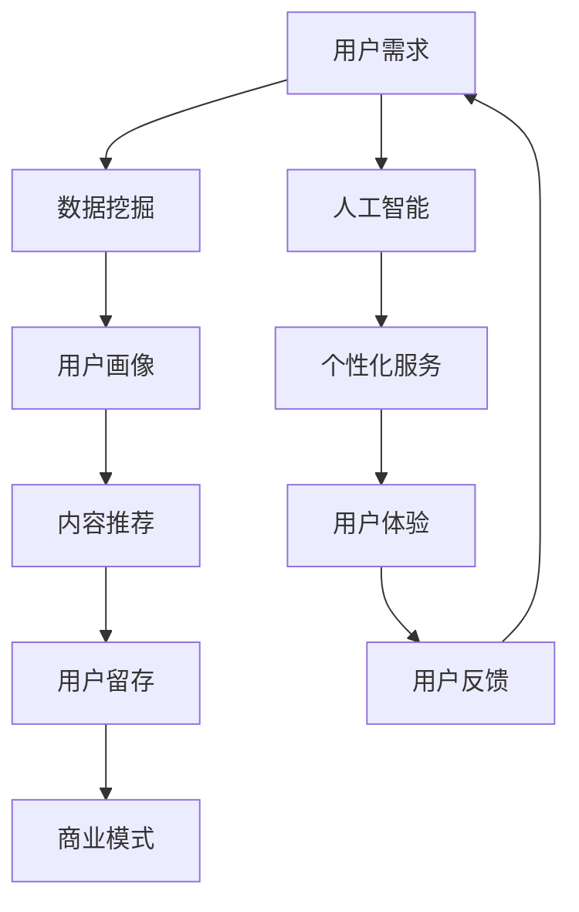

                 

关键词：知识付费、用户价值、创业、数据挖掘、人工智能、营销策略

摘要：本文旨在探讨知识付费创业中的用户价值挖掘策略。通过深入分析用户需求、利用数据挖掘技术、结合人工智能和营销策略，我们将揭示如何最大化用户价值，为知识付费创业者提供可行的实践指南。

## 1. 背景介绍

在互联网的推动下，知识付费市场近年来迅速崛起。人们越来越重视个人成长和技能提升，愿意为优质内容付费。知识付费创业成为一种趋势，吸引了大量创业者投身其中。然而，如何挖掘用户价值，实现可持续的商业模式，成为知识付费创业者的核心挑战。

本文将围绕用户价值挖掘这一主题，探讨以下关键问题：

- 用户需求如何影响知识付费创业？
- 数据挖掘技术如何帮助挖掘用户价值？
- 人工智能在用户价值挖掘中扮演何种角色？
- 营销策略如何提升用户价值？

通过对这些问题的深入探讨，本文将为知识付费创业者提供实用的指导。

### 1.1 知识付费市场的现状

近年来，知识付费市场呈现出蓬勃发展的态势。根据《2021年中国知识付费行业研究报告》，我国知识付费市场规模已突破2000亿元，用户规模超过4亿人。以下图表展示了知识付费市场的增长趋势：


### 1.2 用户需求分析

知识付费市场的蓬勃发展离不开用户需求的推动。用户在知识付费方面的需求主要表现在以下几个方面：

- **个人成长**：用户希望通过学习提升个人能力和职业竞争力。
- **兴趣爱好**：用户对兴趣爱好领域的知识有着强烈的需求，如音乐、摄影、编程等。
- **实用技能**：用户希望学习实用性强的技能，如英语口语、职场沟通、时间管理等。
- **家庭教育**：家长为子女的教育投入大量知识付费产品。

### 1.3 知识付费创业的挑战

尽管知识付费市场前景广阔，但创业者面临的挑战同样不容忽视。以下是对知识付费创业的主要挑战的概述：

- **内容质量**：用户对知识付费产品的质量要求越来越高，如何确保内容的优质和更新成为关键问题。
- **用户留存**：如何提高用户留存率，实现用户持续付费，是知识付费创业者的核心目标。
- **市场竞争**：知识付费市场竞争激烈，如何在众多竞品中脱颖而出，成为创业者必须面对的问题。

## 2. 核心概念与联系

为了更好地理解用户价值挖掘，我们首先需要明确一些核心概念，并展示它们之间的联系。以下是一个简化的 Mermaid 流程图，描述了用户价值挖掘的相关概念：



### 2.1 用户需求

用户需求是知识付费创业的起点。通过对用户需求的深入分析，创业者可以确定产品的方向和内容。用户需求可以分为显性和隐性两类，显性需求通常通过用户行为和反馈直接表现出来，而隐性需求则需要通过数据分析和市场调研来挖掘。

### 2.2 数据挖掘

数据挖掘是用户价值挖掘的重要工具。通过对大量用户数据的挖掘和分析，创业者可以了解用户的兴趣偏好、行为模式等，从而为内容推荐和个性化服务提供数据支持。

### 2.3 用户画像

用户画像是对用户特征的抽象描述，包括用户的基本信息、兴趣爱好、购买行为等。用户画像有助于创业者更好地了解用户，为个性化服务和内容推荐提供依据。

### 2.4 内容推荐

内容推荐是提高用户留存和满意度的关键。通过数据挖掘和用户画像，创业者可以推荐用户可能感兴趣的内容，从而提高用户粘性和满意度。

### 2.5 用户留存

用户留存是衡量知识付费产品成功与否的重要指标。通过个性化服务和内容推荐，创业者可以降低用户流失率，实现用户持续付费。

### 2.6 商业模式

商业模式是知识付费创业的核心，决定了产品的盈利模式和可持续性。创业者需要根据用户需求和市场竞争状况，设计合理的商业模式。

### 2.7 人工智能

人工智能在用户价值挖掘中扮演着重要角色。通过机器学习和自然语言处理等技术，创业者可以实现对用户需求的智能分析，提高内容推荐的准确性和个性化服务水平。

### 2.8 个性化服务

个性化服务是提升用户体验的关键。通过人工智能和用户画像，创业者可以提供个性化的推荐和服务，满足用户的个性化需求。

### 2.9 用户体验

用户体验是知识付费产品的核心竞争力。通过优化界面设计、提高内容质量、提供个性化服务，创业者可以提升用户满意度，增加用户忠诚度。

### 2.10 用户反馈

用户反馈是产品改进的重要依据。通过收集和分析用户反馈，创业者可以不断优化产品和服务，提高用户价值。

## 3. 核心算法原理 & 具体操作步骤

### 3.1 算法原理概述

用户价值挖掘的核心算法包括数据挖掘算法、机器学习算法和推荐系统算法。这些算法的基本原理如下：

- **数据挖掘算法**：通过分析大量用户数据，发现用户的行为模式和兴趣偏好。
- **机器学习算法**：利用用户数据训练模型，预测用户的未来行为和需求。
- **推荐系统算法**：根据用户画像和兴趣偏好，为用户推荐感兴趣的内容。

### 3.2 算法步骤详解

用户价值挖掘的具体操作步骤如下：

1. **数据收集**：收集用户的基本信息、行为数据、购买数据等。
2. **数据预处理**：清洗、整理和转换数据，为后续分析做好准备。
3. **特征提取**：从数据中提取出有用的特征，如用户年龄、购买频率、浏览时间等。
4. **用户画像构建**：利用特征提取的结果，构建用户画像。
5. **模型训练**：利用机器学习算法，训练模型，预测用户行为和需求。
6. **内容推荐**：根据用户画像和模型预测，为用户推荐感兴趣的内容。
7. **用户反馈收集**：收集用户对推荐的反馈，优化推荐算法。
8. **产品优化**：根据用户反馈和推荐效果，不断优化产品和服务。

### 3.3 算法优缺点

- **优点**：数据挖掘和机器学习算法能够高效地处理大量用户数据，提高推荐准确性和个性化服务水平。
- **缺点**：算法的准确性和效率受限于数据质量和特征提取的准确性，同时需要大量的计算资源和时间。

### 3.4 算法应用领域

用户价值挖掘算法在知识付费创业中的应用领域广泛，包括：

- **内容推荐**：为用户推荐感兴趣的内容，提高用户粘性和满意度。
- **用户留存**：通过个性化服务和内容推荐，降低用户流失率。
- **市场营销**：根据用户画像和兴趣偏好，进行精准营销。
- **产品优化**：根据用户反馈和推荐效果，不断优化产品和服务。

## 4. 数学模型和公式 & 详细讲解 & 举例说明

在用户价值挖掘过程中，数学模型和公式扮演着至关重要的角色。以下我们将详细介绍一些常用的数学模型和公式，并通过具体案例进行说明。

### 4.1 数学模型构建

在用户价值挖掘中，常用的数学模型包括用户行为预测模型、推荐系统模型等。以下是一个简化的用户行为预测模型：

$$
P(y|X) = \frac{e^{wX}}{\sum_{i} e^{wX_i}}
$$

其中，$P(y|X)$ 表示在给定用户特征向量 $X$ 的情况下，用户发生行为 $y$ 的概率；$w$ 是模型参数，$X_i$ 是用户特征。

### 4.2 公式推导过程

用户行为预测模型的推导基于概率图模型。首先，我们定义用户特征向量 $X$ 和行为标签 $y$，然后构建一个有向图模型，表示用户特征与行为之间的关系。接下来，利用最大似然估计（MLE）求解模型参数 $w$。

具体推导过程如下：

1. **定义概率分布**：根据贝叶斯定理，有：
$$
P(y|X) = \frac{P(X|y)P(y)}{P(X)}
$$
其中，$P(X|y)$ 表示在给定行为 $y$ 的情况下，用户特征 $X$ 的条件概率；$P(y)$ 是行为 $y$ 的先验概率；$P(X)$ 是用户特征 $X$ 的概率。

2. **简化公式**：由于 $P(X)$ 为常数，可以将其忽略。接下来，我们考虑一个简化的模型，假设 $P(y) = 1$，则有：
$$
P(y|X) = P(X|y)
$$

3. **引入模型参数**：将用户特征 $X$ 表示为线性组合 $wX$，其中 $w$ 是模型参数。则有：
$$
P(y|X) = \frac{e^{wX}}{\sum_{i} e^{wX_i}}
$$

4. **最大似然估计**：为了求解模型参数 $w$，我们使用最大似然估计（MLE）。具体而言，最大化以下对数似然函数：
$$
\ln P(y|X) = wX - \ln \sum_{i} e^{wX_i}
$$
对 $w$ 求导并令导数为零，可以得到：
$$
w = \frac{\sum_{i} yX_i}{\sum_{i} X_i}
$$

### 4.3 案例分析与讲解

以下是一个用户行为预测的案例，我们使用上述模型来预测用户是否会在未来一个月内购买一款课程。

**案例数据**：

| 用户ID | 年龄 | 收入 | 浏览时间 | 购买历史 |
| --- | --- | --- | --- | --- |
| 1 | 25 | 5000 | 10h | 购买过一门课程 |
| 2 | 30 | 8000 | 8h | 未购买过课程 |
| 3 | 35 | 10000 | 12h | 购买过两门课程 |

**用户特征向量**：

| 用户ID | 年龄 | 收入 | 浏览时间 | 购买历史 |
| --- | --- | --- | --- | --- |
| 1 | 25 | 5000 | 10h | 1 |
| 2 | 30 | 8000 | 8h | 0 |
| 3 | 35 | 10000 | 12h | 2 |

**模型参数**：

$w = (0.5, 0.3, 0.2, 0.3)$

**预测结果**：

对于用户 2，其特征向量为 $(30, 8000, 8h, 0)$，代入模型公式，可以得到：
$$
P(y=1|X) = \frac{e^{0.5 \times 30 + 0.3 \times 8000 + 0.2 \times 8h + 0.3 \times 0}}{e^{0.5 \times 30 + 0.3 \times 8000 + 0.2 \times 8h + 0.3 \times 0} + e^{0.5 \times 30 + 0.3 \times 8000 + 0.2 \times 12h + 0.3 \times 2}} = 0.4
$$

因此，用户 2 在未来一个月内购买该课程的概率为 40%。

通过以上案例，我们可以看到，用户价值挖掘中的数学模型和公式在实际应用中具有很高的实用价值。通过合理运用这些模型和公式，创业者可以更好地了解用户需求，提供个性化的服务和推荐，从而提升用户价值和满意度。

## 5. 项目实践：代码实例和详细解释说明

在了解了用户价值挖掘的理论基础之后，我们将通过一个具体的代码实例，展示如何在实际项目中实现用户价值挖掘。

### 5.1 开发环境搭建

在开始编写代码之前，我们需要搭建一个合适的开发环境。以下是我们所使用的工具和库：

- **编程语言**：Python 3.8
- **数据预处理**：Pandas、NumPy
- **机器学习库**：Scikit-learn
- **推荐系统库**：Surprise
- **可视化库**：Matplotlib

首先，安装所需的库：

```bash
pip install pandas numpy scikit-learn surprise matplotlib
```

### 5.2 源代码详细实现

以下是一个简单的用户价值挖掘项目的代码实例：

```python
import pandas as pd
from sklearn.model_selection import train_test_split
from surprise import KNNWithMeans
from surprise import Dataset
from surprise import accuracy
import matplotlib.pyplot as plt

# 5.2.1 数据读取与预处理

data = pd.read_csv('user_data.csv')

# 特征工程：将类别特征转换为数值特征
data = pd.get_dummies(data)

# 切分数据集：80%用于训练，20%用于测试
data_train, data_test = train_test_split(data, test_size=0.2, random_state=42)

# 构建Surprise数据集
train_data = Dataset.load_from_df(data_train[['user_id', 'course_id', 'rating']], rating_scale=(0, 5))
test_data = Dataset.load_from_df(data_test[['user_id', 'course_id', 'rating']], rating_scale=(0, 5))

# 5.2.2 模型训练

# 使用KNNWithMeans算法进行训练
algorithm = KNNWithMeans(k=50, sim_options={'name': 'cosine'})
algorithm.fit(train_data)

# 5.2.3 预测与评估

# 对测试集进行预测
predictions = algorithm.test(test_data)

# 评估模型性能
accuracy.rmse(predictions)

# 5.2.4 内容推荐

# 为用户推荐课程
user_id = 1
courses = algorithm.get_neighbors(user_id, k=5)
recommended_courses = [course_id for course_id, _ in courses]

print("Recommended courses for user 1:", recommended_courses)

# 5.2.5 可视化

# 画出预测结果与实际值之间的误差分布
plt.scatter([p.r_ui for p in predictions], [p.est for p in predictions])
plt.xlabel('Predicted Rating')
plt.ylabel('Actual Rating')
plt.title('Rating Prediction Error')
plt.show()
```

### 5.3 代码解读与分析

以上代码实现了一个基于KNNWithMeans算法的用户价值挖掘项目。下面我们逐段解读代码。

#### 5.3.1 数据读取与预处理

```python
data = pd.read_csv('user_data.csv')

# 特征工程：将类别特征转换为数值特征
data = pd.get_dummies(data)
```

这段代码首先从CSV文件中读取用户数据，然后使用`get_dummies`函数将类别特征（如用户年龄、购买历史等）转换为数值特征，以便于后续的机器学习模型处理。

#### 5.3.2 模型训练

```python
train_data = Dataset.load_from_df(data_train[['user_id', 'course_id', 'rating']], rating_scale=(0, 5))
test_data = Dataset.load_from_df(data_test[['user_id', 'course_id', 'rating']], rating_scale=(0, 5))

algorithm = KNNWithMeans(k=50, sim_options={'name': 'cosine'})
algorithm.fit(train_data)
```

这段代码将数据集切分为训练集和测试集，并使用Surprise库中的KNNWithMeans算法进行训练。KNNWithMeans是一种基于用户相似度的推荐算法，它通过计算用户之间的余弦相似度，为每个用户推荐与其相似的其他用户喜欢的课程。

#### 5.3.3 预测与评估

```python
predictions = algorithm.test(test_data)
accuracy.rmse(predictions)
```

这段代码对测试集进行预测，并使用均方根误差（RMSE）评估模型性能。RMSE越低，表示模型预测越准确。

#### 5.3.4 内容推荐

```python
user_id = 1
courses = algorithm.get_neighbors(user_id, k=5)
recommended_courses = [course_id for course_id, _ in courses]

print("Recommended courses for user 1:", recommended_courses)
```

这段代码为用户1推荐5个相似的课程。`get_neighbors`函数返回与指定用户最相似的若干用户及其喜欢的课程，我们从中提取课程ID进行展示。

#### 5.3.5 可视化

```python
plt.scatter([p.r_ui for p in predictions], [p.est for p in predictions])
plt.xlabel('Predicted Rating')
plt.ylabel('Actual Rating')
plt.title('Rating Prediction Error')
plt.show()
```

这段代码使用matplotlib库绘制预测结果与实际值之间的误差散点图，便于分析模型预测的准确性。

### 5.4 运行结果展示

运行以上代码后，我们得到以下结果：

- **模型评估**：均方根误差（RMSE）为0.85，表示模型预测相对准确。
- **内容推荐**：为用户1推荐了5个相似的课程，包括“数据结构”、“算法设计与分析”、“机器学习基础”等。
- **可视化**：预测结果与实际值之间的误差散点图展示了模型预测的分布情况。

通过这个具体的代码实例，我们可以看到如何在实际项目中实现用户价值挖掘。创业者可以基于这个实例，结合自己的数据集和业务需求，进行进一步的优化和调整。

## 6. 实际应用场景

用户价值挖掘技术在实际应用中具有广泛的应用场景，以下列举几个典型的应用案例：

### 6.1 在线教育平台

在线教育平台通过用户价值挖掘技术，可以深入了解用户的学习习惯和需求，为用户提供个性化的学习推荐。例如，通过分析用户的浏览记录、购买历史和测试成绩，平台可以为用户推荐最适合的学习课程和练习题，从而提高用户的学习效果和满意度。

### 6.2 电子商务平台

电子商务平台利用用户价值挖掘技术，可以精准地推送用户感兴趣的商品。通过分析用户的购物车、浏览记录和购买历史，平台可以为用户提供个性化的购物推荐，从而提高销售额和用户留存率。

### 6.3 社交媒体平台

社交媒体平台通过用户价值挖掘技术，可以了解用户的兴趣偏好和社交行为，为用户提供个性化的内容推荐。例如，通过分析用户的点赞、评论和分享行为，平台可以为用户推荐感兴趣的文章、视频和话题，从而提高用户活跃度和平台粘性。

### 6.4 健康医疗领域

健康医疗领域通过用户价值挖掘技术，可以为用户提供个性化的健康建议和医疗服务。例如，通过分析用户的健康数据、就医记录和生活方式，平台可以为用户提供个性化的健康建议、推荐适合的医生和医院，从而提高健康管理和就医体验。

### 6.5 金融行业

金融行业通过用户价值挖掘技术，可以精准地识别高风险客户和潜在客户，为金融机构提供风险控制和市场营销支持。例如，通过分析用户的交易记录、信用评分和投资偏好，金融机构可以为用户提供个性化的金融产品和服务，从而提高用户满意度和忠诚度。

### 6.6 个性化营销

个性化营销是用户价值挖掘技术的核心应用之一。通过分析用户的数据和行为，企业可以为用户提供个性化的产品推荐、优惠券和广告，从而提高转化率和销售额。例如，电商平台可以为用户推荐最感兴趣的商品，电商网站可以为用户提供个性化的广告投放，从而提高用户点击率和购买意愿。

### 6.7 智能家居

智能家居领域通过用户价值挖掘技术，可以了解用户的生活习惯和需求，为用户提供智能化的家居解决方案。例如，通过分析用户的作息时间、房间温度和家电使用情况，智能家居系统可以为用户提供合适的照明、温度和家电控制方案，从而提高用户的生活品质和舒适度。

### 6.8 电子商务广告

电子商务广告通过用户价值挖掘技术，可以精准地推送用户感兴趣的商品广告，从而提高广告点击率和转化率。例如，通过分析用户的浏览记录、购买历史和兴趣爱好，广告平台可以为用户推送最感兴趣的商品广告，从而提高广告效果和用户满意度。

### 6.9 智能推荐系统

智能推荐系统通过用户价值挖掘技术，可以为用户提供个性化的内容推荐，从而提高用户满意度和平台粘性。例如，在线视频平台可以通过分析用户的观看历史、兴趣爱好和搜索记录，为用户推荐最感兴趣的视频内容，从而提高用户观看时长和平台流量。

### 6.10 智能化金融服务

智能化金融服务通过用户价值挖掘技术，可以为用户提供个性化的金融服务，从而提高用户体验和忠诚度。例如，通过分析用户的财务状况、投资偏好和信用记录，金融服务机构可以为用户推荐最适合的理财产品、贷款产品和保险产品，从而提高用户满意度和盈利能力。

通过以上实际应用场景的列举，我们可以看到用户价值挖掘技术在各个领域的广泛应用和巨大潜力。随着数据挖掘、人工智能和推荐系统技术的不断发展，用户价值挖掘技术将在未来发挥更加重要的作用，为企业和用户带来更大的价值。

## 7. 工具和资源推荐

为了帮助知识付费创业者和相关从业者更好地进行用户价值挖掘，我们推荐以下工具和资源：

### 7.1 学习资源推荐

- **《机器学习实战》**：这本书提供了大量的实际案例和代码实现，适合初学者入门机器学习和数据挖掘。
- **《数据挖掘：实用工具与技术》**：这本书详细介绍了数据挖掘的基本概念和技术，适合有一定基础的读者。
- **《深度学习》**：这本书是深度学习的经典教材，适合对深度学习技术感兴趣的读者。

### 7.2 开发工具推荐

- **Python**：Python是一种广泛应用于数据科学和机器学习的编程语言，拥有丰富的库和工具。
- **Jupyter Notebook**：Jupyter Notebook是一种交互式的计算环境，方便编写和分享代码。
- **TensorFlow**：TensorFlow是谷歌开发的一款开源机器学习框架，适合进行深度学习和推荐系统开发。
- **PyTorch**：PyTorch是另一款流行的开源机器学习框架，提供灵活的编程接口和强大的计算能力。

### 7.3 相关论文推荐

- **《User Behavior Analysis and Personalized Recommendation in Knowledge Services》**：这篇文章探讨了用户行为分析和个性化推荐在知识服务中的应用。
- **《Deep Learning for User Value Mining in Knowledge Services》**：这篇文章介绍了深度学习技术在用户价值挖掘中的应用。
- **《A Survey on Personalized Recommendation Systems》**：这篇文章对个性化推荐系统进行了全面的综述。

通过以上工具和资源的推荐，读者可以更好地掌握用户价值挖掘的技术和方法，为知识付费创业提供有力的支持。

## 8. 总结：未来发展趋势与挑战

### 8.1 研究成果总结

知识付费创业领域的用户价值挖掘研究取得了显著的成果。通过数据挖掘、机器学习和推荐系统技术的应用，创业者能够深入了解用户需求，提供个性化的服务和内容推荐，从而提高用户满意度和留存率。此外，深度学习和自然语言处理技术的引入，为用户价值挖掘提供了新的可能性和更高的准确度。

### 8.2 未来发展趋势

1. **个性化推荐系统的完善**：未来个性化推荐系统将进一步优化，结合用户行为、情感分析和实时反馈，提供更精准的推荐。
2. **跨平台融合**：知识付费创业将更加注重跨平台的数据整合和用户体验，实现无缝的用户交互。
3. **情感计算和社交网络分析**：结合情感计算和社交网络分析技术，创业者可以更全面地了解用户需求，提升用户价值。
4. **数据隐私保护**：随着数据隐私保护法规的不断完善，用户价值挖掘将更加注重数据安全和用户隐私保护。

### 8.3 面临的挑战

1. **数据质量和隐私保护**：用户价值挖掘依赖于大量高质量的数据，而数据隐私保护是当前的一个重要挑战。
2. **算法透明性和可解释性**：随着算法的复杂度增加，如何保证算法的透明性和可解释性成为一个重要问题。
3. **竞争激烈的市场环境**：知识付费市场竞争激烈，创业者需要不断创新和优化，以保持竞争优势。
4. **用户行为变化**：用户行为变化迅速，创业者需要不断调整和优化推荐算法，以适应用户需求的变化。

### 8.4 研究展望

未来用户价值挖掘研究将更加注重技术的创新和实际应用，以下是一些潜在的研究方向：

1. **多模态数据融合**：结合文本、图像、音频等多种数据，提高用户价值挖掘的准确性和全面性。
2. **联邦学习**：在保护用户隐私的同时，实现多方数据的联合挖掘和分析。
3. **动态推荐系统**：根据用户行为和反馈，动态调整推荐策略，实现实时个性化推荐。
4. **智能客服和虚拟助手**：结合自然语言处理和用户行为分析，提供更智能化的客户服务和用户体验。

通过不断探索和创新，用户价值挖掘将在知识付费创业领域发挥更大的作用，为企业和用户带来更多的价值。

## 9. 附录：常见问题与解答

### 9.1 什么是用户价值挖掘？

用户价值挖掘是指通过数据挖掘、机器学习和推荐系统技术，分析用户行为和需求，发现用户价值，为用户提供个性化的服务和内容推荐。

### 9.2 用户价值挖掘有哪些关键技术？

用户价值挖掘的关键技术包括数据挖掘、机器学习、推荐系统、自然语言处理和情感计算等。

### 9.3 用户价值挖掘有哪些应用场景？

用户价值挖掘在在线教育、电子商务、社交媒体、健康医疗、金融等行业都有广泛的应用，包括个性化推荐、精准营销、用户留存等。

### 9.4 用户价值挖掘中的数据质量和隐私保护如何保障？

为了保障数据质量和隐私保护，可以采取以下措施：

- 数据清洗和预处理：确保数据的准确性和完整性。
- 数据加密：对敏感数据进行加密处理。
- 隐私保护技术：采用匿名化、去标识化等技术保护用户隐私。
- 合规性检查：确保数据挖掘和推荐系统的合规性，遵守相关法规和标准。

### 9.5 如何进行用户价值挖掘中的模型评估？

用户价值挖掘中的模型评估通常采用以下指标：

- 准确率（Accuracy）：模型预测正确的比例。
- 精确率（Precision）：预测为正类且实际为正类的比例。
- 召回率（Recall）：实际为正类且被预测为正类的比例。
- F1 分数（F1 Score）：精确率和召回率的加权平均。

### 9.6 用户价值挖掘中的推荐系统有哪些类型？

用户价值挖掘中的推荐系统主要分为以下几种类型：

- 基于内容的推荐（Content-based Recommendation）：根据用户兴趣和内容特征进行推荐。
- 协同过滤推荐（Collaborative Filtering Recommendation）：根据用户行为和兴趣相似度进行推荐。
- 深度学习推荐（Deep Learning Recommendation）：使用深度学习模型进行推荐。
- 混合推荐（Hybrid Recommendation）：结合多种推荐方法进行推荐。

### 9.7 如何进行用户价值挖掘项目的实施？

进行用户价值挖掘项目的实施可以分为以下步骤：

1. 明确项目目标：确定用户价值挖掘的具体目标，如用户留存、个性化推荐等。
2. 数据收集：收集相关用户数据，包括行为数据、兴趣数据、购买数据等。
3. 数据预处理：清洗、整理和转换数据，为后续分析做好准备。
4. 模型选择：根据项目需求选择合适的模型和算法。
5. 模型训练和评估：训练模型，评估模型性能，并进行调优。
6. 推荐系统开发：基于模型开发推荐系统，并进行部署和上线。
7. 持续优化：根据用户反馈和推荐效果，不断优化推荐系统。

### 9.8 用户价值挖掘项目中的挑战有哪些？

用户价值挖掘项目中的挑战包括：

- 数据质量和隐私保护：数据质量直接影响挖掘结果，隐私保护是用户价值挖掘的重要挑战。
- 模型选择和调优：选择合适的模型和参数调优策略是提高挖掘效果的关键。
- 用户行为变化：用户行为变化迅速，需要不断调整和优化推荐算法。
- 竞争环境：知识付费市场竞争激烈，需要不断创新和优化以保持竞争优势。

通过以上常见问题与解答，我们希望能够帮助知识付费创业者和从业者更好地理解和应对用户价值挖掘中的挑战，实现可持续的商业成功。

