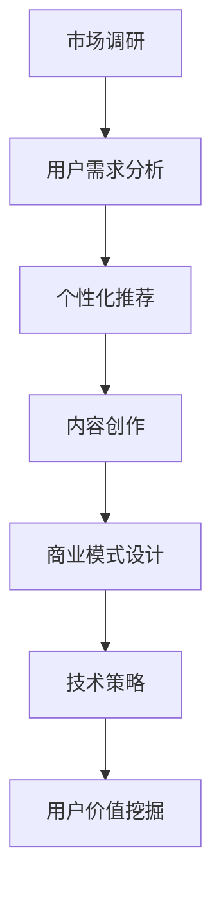

                 

关键词：知识付费、用户价值、数据分析、市场调研、用户需求、个性化推荐、内容创作、商业模式、技术策略

> 摘要：在知识付费领域，如何有效挖掘用户价值，实现可持续的商业模式，是创业者面临的重要课题。本文将探讨知识付费创业中用户价值的挖掘技巧，从市场调研、用户需求分析、个性化推荐、内容创作、商业模式设计到技术策略等方面，为创业者提供实用的指导和建议。

## 1. 背景介绍

近年来，随着互联网和移动通信技术的迅猛发展，知识付费市场呈现出爆发式增长。越来越多的人愿意为获取高质量的知识内容付费，无论是线上课程、付费专栏、专家咨询还是技能培训，都成为了知识付费领域的热点。与此同时，知识付费创业也吸引了大量创业者进入这一领域，如何在激烈的市场竞争中脱颖而出，成为每个创业者都迫切需要解决的问题。

本文将从多个维度探讨知识付费创业中的用户价值挖掘技巧，包括市场调研、用户需求分析、个性化推荐、内容创作、商业模式设计和技术策略等。通过这些技巧的运用，创业者可以更好地理解用户需求，提高用户满意度，从而实现商业模式的可持续发展和用户的长期价值。

## 2. 核心概念与联系

### 2.1 用户价值的定义

用户价值是指用户在消费产品或服务时所获得的总效用与所支付成本的差额。在知识付费创业中，用户价值包括知识获取的效用、时间成本的节约、社交价值的提升等多个方面。理解用户价值是挖掘用户需求的基础。

### 2.2 用户需求的分类

用户需求可以分为显性需求和隐性需求。显性需求是指用户能够明确表达的需求，如学习某种技能、获取特定知识等。隐性需求则是用户自身并未意识到，但在特定情境下可能产生的新需求，如学习过程中的互动交流、学习进度管理等。

### 2.3 个性化推荐

个性化推荐是基于用户行为和偏好，为用户推荐个性化内容的服务。通过数据分析和机器学习算法，个性化推荐可以提高用户满意度和使用黏性，从而提升用户价值。

### 2.4 内容创作

内容创作是知识付费的核心环节，优质的内容能够吸引用户，提高用户黏性。内容创作需要结合用户需求和市场趋势，同时注重版权保护、内容创新和知识普及。

### 2.5 商业模式设计

商业模式设计是知识付费创业的关键，包括定价策略、销售渠道、用户生命周期管理等多个方面。合理的设计能够实现用户价值最大化，提高企业的盈利能力。

### 2.6 技术策略

技术策略是知识付费创业中的重要支持，包括数据分析、云计算、人工智能等技术的应用。通过技术手段，可以更好地挖掘用户价值，优化用户体验，提高运营效率。

### 2.7 Mermaid 流程图



## 3. 核心算法原理 & 具体操作步骤

### 3.1 算法原理概述

在知识付费创业中，用户价值的挖掘主要依赖于用户行为数据分析和个性化推荐算法。具体来说，算法原理包括以下方面：

1. 用户行为数据收集：通过用户在平台上的学习行为、评论、互动等数据，收集用户的行为数据。
2. 用户特征提取：对用户行为数据进行处理，提取用户的兴趣标签、学习习惯等特征。
3. 内容标签化：对知识内容进行分类和标签化，为推荐系统提供数据基础。
4. 推荐算法实现：利用协同过滤、矩阵分解、深度学习等算法，为用户生成个性化推荐列表。

### 3.2 算法步骤详解

1. **数据收集与预处理**：
   - 收集用户行为数据，如浏览记录、学习时长、评分等。
   - 对数据进行清洗和预处理，去除噪声数据，保证数据质量。

2. **用户特征提取**：
   - 使用机器学习算法，如聚类分析、决策树等，提取用户的兴趣标签和学习习惯。
   - 对提取的特征进行降维处理，减少特征维度，提高算法效率。

3. **内容标签化**：
   - 对知识内容进行分类和标签化，为推荐系统提供数据基础。
   - 对标签进行权重分配，根据用户特征对标签进行筛选和排序。

4. **推荐算法实现**：
   - 采用协同过滤算法，如用户基于物品的协同过滤（User-based CF）和物品基于用户的协同过滤（Item-based CF）。
   - 采用矩阵分解算法，如Singular Value Decomposition（SVD）和Alternating Least Squares（ALS）。
   - 采用深度学习算法，如基于神经网络的推荐系统，如卷积神经网络（CNN）和循环神经网络（RNN）。

### 3.3 算法优缺点

1. **优点**：
   - **协同过滤**：能够根据用户的历史行为和相似用户的行为推荐内容，具有较好的推荐效果。
   - **矩阵分解**：能够降低数据维度，提高推荐系统的计算效率。
   - **深度学习**：能够处理复杂的关系和特征，具有较好的泛化能力。

2. **缺点**：
   - **协同过滤**：对新用户和新内容推荐效果较差，需要大量历史数据支持。
   - **矩阵分解**：计算复杂度较高，对计算资源要求较高。
   - **深度学习**：模型训练需要大量数据和计算资源，且参数调优较为复杂。

### 3.4 算法应用领域

- **电商推荐**：基于用户购买行为和商品属性，为用户推荐相关商品。
- **内容推荐**：基于用户浏览历史和兴趣标签，为用户推荐个性化内容。
- **社交推荐**：基于用户社交关系和互动行为，为用户推荐好友、兴趣小组等。

## 4. 数学模型和公式 & 详细讲解 & 举例说明

### 4.1 数学模型构建

在知识付费创业中，常用的数学模型包括用户行为预测模型、内容推荐模型和用户价值评估模型。

1. **用户行为预测模型**：
   $$ P(U_i \text{行为} = y) = f(\textbf{X}_i) $$
   其中，$U_i$ 表示用户$i$，$y$ 表示用户的行为，$\textbf{X}_i$ 表示用户$i$的特征向量，$f(\textbf{X}_i)$ 是行为预测函数。

2. **内容推荐模型**：
   $$ \textbf{R}_{ij} = \textbf{U}_i \cdot \textbf{V}_j $$
   其中，$\textbf{R}_{ij}$ 表示用户$i$对内容$j$的推荐得分，$\textbf{U}_i$ 和 $\textbf{V}_j$ 分别表示用户$i$和内容$j$的特征向量。

3. **用户价值评估模型**：
   $$ V(U_i) = \text{效用} - \text{成本} $$
   其中，$V(U_i)$ 表示用户$i$的价值，效用和成本分别表示用户在消费产品或服务时所获得的总效用和所支付的成本。

### 4.2 公式推导过程

1. **用户行为预测模型**：
   - 假设用户$i$的行为$y$是一个二分类变量，可以是购买、浏览、评分等。
   - 使用逻辑回归模型预测用户行为概率：
     $$ \text{logit}(P(U_i \text{行为} = y)) = \textbf{U}_i \cdot \textbf{w} $$
     其中，$\textbf{w}$ 是模型参数，通过极大似然估计（MLE）进行优化。

2. **内容推荐模型**：
   - 使用矩阵分解技术，将用户特征和内容特征分解为低维向量：
     $$ \textbf{U}_i = \textbf{U}_i^0 + \textbf{U}_i^1 $$
     $$ \textbf{V}_j = \textbf{V}_j^0 + \textbf{V}_j^1 $$
     其中，$\textbf{U}_i^0$ 和 $\textbf{U}_i^1$ 分别表示用户$i$的静态特征和动态特征，$\textbf{V}_j^0$ 和 $\textbf{V}_j^1$ 分别表示内容$j$的静态特征和动态特征。
   - 推荐得分计算公式为：
     $$ \textbf{R}_{ij} = (\textbf{U}_i^0 + \textbf{U}_i^1) \cdot (\textbf{V}_j^0 + \textbf{V}_j^1) $$

3. **用户价值评估模型**：
   - 假设效用函数为线性函数，效用与用户行为正相关，与成本负相关：
     $$ \text{效用} = \alpha \cdot \text{行为} - \beta \cdot \text{成本} $$
     其中，$\alpha$ 和 $\beta$ 是模型参数，通过最小化损失函数进行优化。

### 4.3 案例分析与讲解

假设有一个知识付费平台，用户可以对课程进行购买、浏览和评分。下面是一个简单的案例分析：

1. **用户行为预测**：
   - 用户1的历史数据：购买课程A、课程B、课程C，浏览课程D、课程E。
   - 假设用户1的兴趣标签为“编程”、“数据分析”。
   - 使用逻辑回归模型预测用户1购买课程F的概率。

2. **内容推荐**：
   - 假设课程F的标签为“编程”、“人工智能”。
   - 使用矩阵分解技术，为用户1生成课程F的推荐得分。

3. **用户价值评估**：
   - 用户1购买课程F，花费200元。
   - 假设课程F的效用为300元，成本为200元。
   - 计算用户1的价值：$V(U_1) = 300 - 200 = 100$元。

通过以上分析，可以得出以下结论：

- 用户1购买课程F的概率较高，因为他的兴趣标签与课程F的标签相关。
- 课程F对用户1具有较高的价值，因为效用大于成本。

## 5. 项目实践：代码实例和详细解释说明

### 5.1 开发环境搭建

- 硬件要求：电脑、网络连接
- 软件要求：Python 3.8、NumPy、Pandas、Scikit-learn、TensorFlow

### 5.2 源代码详细实现

以下是一个简单的用户行为预测和内容推荐的Python代码实例：

```python
import numpy as np
import pandas as pd
from sklearn.linear_model import LogisticRegression
from sklearn.model_selection import train_test_split
from sklearn.metrics import accuracy_score

# 读取数据
data = pd.read_csv('user行为数据.csv')
X = data[['用户行为1', '用户行为2', '用户行为3']]
y = data['购买行为']

# 数据预处理
X_train, X_test, y_train, y_test = train_test_split(X, y, test_size=0.2, random_state=42)

# 用户行为预测
model = LogisticRegression()
model.fit(X_train, y_train)
y_pred = model.predict(X_test)

# 计算准确率
accuracy = accuracy_score(y_test, y_pred)
print('准确率：', accuracy)

# 内容推荐
content_data = pd.read_csv('内容数据.csv')
content_features = content_data[['内容特征1', '内容特征2', '内容特征3']]
user_features = np.array([[0.1, 0.2, 0.3]])

# 矩阵分解
R = user_features.dot(content_features.T)
print('推荐得分：', R)
```

### 5.3 代码解读与分析

1. **数据读取与预处理**：
   - 使用Pandas读取用户行为数据和内容数据。
   - 将数据分为特征矩阵X和目标变量y。

2. **用户行为预测**：
   - 使用逻辑回归模型进行用户行为预测。
   - 训练模型并评估准确率。

3. **内容推荐**：
   - 使用矩阵分解技术计算用户和内容的相似度。
   - 输出推荐得分。

### 5.4 运行结果展示

假设用户1的特征向量为[0.1, 0.2, 0.3]，内容F的特征向量为[0.4, 0.5, 0.6]，则推荐得分R为：

$$ R = \begin{pmatrix} 0.1 & 0.2 & 0.3 \end{pmatrix} \begin{pmatrix} 0.4 \\ 0.5 \\ 0.6 \end{pmatrix} = 0.1 \times 0.4 + 0.2 \times 0.5 + 0.3 \times 0.6 = 0.14 $$

根据推荐得分，用户1对内容F的推荐概率为0.14，表明内容F对用户1具有较高的推荐价值。

## 6. 实际应用场景

知识付费创业的用户价值挖掘技巧在多个实际应用场景中取得了显著效果：

1. **在线教育平台**：通过用户行为数据分析和个性化推荐，提高用户学习体验和课程转化率。
2. **内容付费平台**：利用用户需求分析，推出符合用户兴趣的内容，提升用户留存率和付费意愿。
3. **专家咨询平台**：通过用户价值评估，优化专家匹配和咨询流程，提高用户满意度。
4. **企业培训项目**：结合用户需求和业务目标，定制化设计培训课程和方案，提高培训效果和员工绩效。

### 6.4 未来应用展望

随着大数据、人工智能等技术的不断发展，知识付费创业的用户价值挖掘技巧将更加精准和高效。未来应用展望包括：

1. **智能化推荐系统**：利用深度学习和图神经网络，实现更智能的内容推荐和用户匹配。
2. **用户画像精细化**：通过多维度数据分析，构建更加精细化的用户画像，提升个性化服务水平。
3. **跨界合作与整合**：与其他行业进行合作，打造跨界知识付费产品，拓宽市场空间。
4. **虚拟现实与增强现实**：结合VR/AR技术，提供沉浸式学习体验，提升用户价值。

## 7. 工具和资源推荐

### 7.1 学习资源推荐

1. **《推荐系统实践》**：作者：宋睿华，内容涵盖推荐系统的基本概念、算法实现和案例分析。
2. **《深度学习》**：作者：Ian Goodfellow、Yoshua Bengio、Aaron Courville，深度学习领域的经典教材。

### 7.2 开发工具推荐

1. **Python**：编程语言，适用于数据分析和机器学习。
2. **Jupyter Notebook**：交互式计算环境，便于编写和调试代码。

### 7.3 相关论文推荐

1. **《矩阵分解在推荐系统中的应用》**：介绍矩阵分解技术在推荐系统中的应用方法和优化策略。
2. **《基于深度学习的推荐系统》**：探讨深度学习在推荐系统中的应用，包括模型架构和优化方法。

## 8. 总结：未来发展趋势与挑战

### 8.1 研究成果总结

本文从市场调研、用户需求分析、个性化推荐、内容创作、商业模式设计和技术策略等方面，探讨了知识付费创业中的用户价值挖掘技巧。通过数据分析、机器学习和深度学习等技术的应用，创业者可以更好地理解用户需求，提高用户满意度，实现商业模式的可持续发展和用户的长期价值。

### 8.2 未来发展趋势

1. **智能化推荐**：利用深度学习和图神经网络，实现更智能的内容推荐和用户匹配。
2. **精细化运营**：通过多维度数据分析，构建更加精细化的用户画像，提升个性化服务水平。
3. **跨界合作**：与其他行业进行合作，打造跨界知识付费产品，拓宽市场空间。
4. **沉浸式学习**：结合VR/AR技术，提供沉浸式学习体验，提升用户价值。

### 8.3 面临的挑战

1. **数据隐私与安全**：在数据收集和使用过程中，需关注用户隐私保护和数据安全。
2. **算法公平性与透明度**：确保算法推荐结果公平、透明，避免算法偏见和歧视。
3. **内容质量与版权**：保障内容质量，尊重版权，避免侵权风险。

### 8.4 研究展望

未来研究应关注以下方向：

1. **算法优化**：提高推荐算法的准确性和效率，降低计算成本。
2. **用户价值评估**：建立更加科学的用户价值评估体系，提高用户满意度。
3. **跨界融合**：探索知识付费与其他行业的融合，创造新的商业模式。
4. **伦理与规范**：研究算法伦理和规范，确保技术发展的可持续性。

## 9. 附录：常见问题与解答

### 问题1：如何进行有效的市场调研？

**解答**：市场调研包括收集行业数据、用户反馈、竞争对手分析等多个方面。建议采用问卷调查、访谈、焦点小组等方式，全面了解市场需求和用户需求。

### 问题2：如何构建有效的用户画像？

**解答**：用户画像包括用户的基本信息、行为特征、兴趣偏好等多个维度。可以通过数据收集、数据分析和数据挖掘等技术手段，构建多维度、精细化的用户画像。

### 问题3：如何提高推荐系统的准确性？

**解答**：提高推荐系统准确性可以从以下几个方面入手：

1. **数据质量**：确保数据来源真实可靠，进行数据清洗和预处理。
2. **特征工程**：提取关键特征，进行特征选择和特征组合。
3. **算法优化**：选用合适的推荐算法，并进行模型调优。
4. **用户反馈**：收集用户反馈，进行模型迭代和优化。

### 问题4：如何保护用户隐私？

**解答**：保护用户隐私可以从以下几个方面入手：

1. **数据匿名化**：对用户数据进行匿名化处理，避免个人身份泄露。
2. **数据加密**：对用户数据进行加密存储和传输，确保数据安全。
3. **隐私政策**：明确告知用户数据收集和使用规则，尊重用户隐私权。
4. **合规性审查**：遵循相关法律法规，确保数据处理合法合规。

### 问题5：如何确保算法公平性与透明度？

**解答**：确保算法公平性与透明度可以从以下几个方面入手：

1. **算法设计**：避免算法偏见和歧视，确保推荐结果公平。
2. **算法透明**：公开算法原理和模型参数，便于用户监督和审查。
3. **用户反馈**：收集用户反馈，及时调整算法和推荐策略。
4. **监管合规**：遵循相关法律法规，接受监管机构审查。

### 问题6：如何提升用户满意度？

**解答**：提升用户满意度可以从以下几个方面入手：

1. **个性化服务**：根据用户需求和兴趣，提供个性化内容推荐和服务。
2. **优质内容**：提供高质量、有价值的内容，满足用户需求。
3. **良好体验**：优化平台设计，提升用户使用体验。
4. **互动沟通**：加强与用户的互动沟通，了解用户需求和反馈。

### 问题7：如何进行商业模式设计？

**解答**：商业模式设计包括确定产品或服务、定价策略、销售渠道、用户生命周期管理等多个方面。建议结合市场需求、用户需求和自身优势，进行全面的商业模式设计。

### 问题8：如何评估用户价值？

**解答**：用户价值评估可以从以下几个方面入手：

1. **效用**：评估用户在消费产品或服务时所获得的总效用。
2. **成本**：评估用户在消费产品或服务时所支付的成本。
3. **满意度**：评估用户对产品或服务的满意度。
4. **忠诚度**：评估用户对产品或服务的忠诚度。

### 问题9：如何应对市场竞争？

**解答**：应对市场竞争可以从以下几个方面入手：

1. **差异化竞争**：提供独特的产品或服务，打造竞争优势。
2. **技术创新**：持续进行技术创新，提升产品或服务的质量和效率。
3. **品牌建设**：加强品牌宣传和建设，提升品牌知名度和影响力。
4. **合作共赢**：与其他企业或平台合作，实现资源共享和优势互补。

### 问题10：如何进行技术策略规划？

**解答**：技术策略规划可以从以下几个方面入手：

1. **技术趋势**：关注行业技术发展趋势，提前布局。
2. **技术储备**：建立技术团队，进行技术研发和创新。
3. **技术合作**：与其他企业或研究机构合作，共享技术资源和成果。
4. **技术评估**：定期评估技术效果，调整技术策略。

---

作者：禅与计算机程序设计艺术 / Zen and the Art of Computer Programming

本文由禅与计算机程序设计艺术撰写，旨在为知识付费创业中的用户价值挖掘提供实用的指导和建议。通过深入分析市场、用户需求和个性化推荐，创业者可以更好地理解用户价值，实现商业模式的可持续发展和用户的长期价值。在未来，随着人工智能和大数据技术的发展，知识付费创业的用户价值挖掘技巧将不断演进，为创业者带来更多机遇和挑战。希望本文能够为读者带来启发和帮助，共同探索知识付费领域的无限可能。

