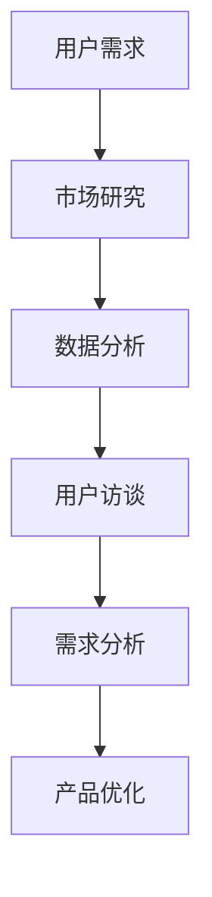

                 

关键词：知识付费，用户需求，市场研究，数据挖掘，用户体验设计

> 摘要：本文旨在探讨知识付费创业领域中的用户需求挖掘方法。通过市场调研、数据分析、用户访谈等手段，深入了解用户在知识付费领域的需求，为创业者提供有针对性的解决方案，以提升用户体验和产品满意度。

## 1. 背景介绍

随着互联网技术的飞速发展，知识付费已经成为当今社会的一个热门现象。知识付费指的是用户为获取优质的知识内容和服务而支付费用的一种消费模式。这一现象的背后，是人们对于知识获取和提升的需求日益增长。知识付费创业也因此成为了一个充满机遇的领域。

然而，知识付费创业并非易事。创业者需要在激烈的市场竞争中找到自己的定位，精准地满足用户需求，才能在市场中脱颖而出。这就需要创业者对用户需求进行深入挖掘和分析。

本文将围绕知识付费创业的用户需求挖掘展开讨论。通过市场调研、数据分析、用户访谈等方法，我们将揭示用户在知识付费领域的真实需求，帮助创业者更好地了解市场，优化产品和服务，提升用户满意度。

## 2. 核心概念与联系

### 2.1 知识付费

知识付费是指用户为获取优质的知识内容和服务而支付费用的一种消费模式。与传统的免费知识获取方式相比，知识付费更加注重知识的价值和实用性，用户可以更快地获取到符合自己需求的知识。

### 2.2 用户需求

用户需求是指用户在特定情境下，为了解决问题或满足某种欲望而产生的对产品或服务的期望。在知识付费领域，用户需求主要包括对知识内容、学习方式、课程质量等方面的期望。

### 2.3 市场研究

市场研究是一种通过收集、分析和解释市场数据，以了解市场动态和用户需求的方法。在知识付费创业中，市场研究可以帮助创业者了解市场需求，发现潜在的商业机会。

### 2.4 数据挖掘

数据挖掘是一种从大量数据中提取有价值信息的方法。在知识付费领域，数据挖掘可以帮助创业者了解用户行为，挖掘用户需求，优化产品和服务。

### 2.5 用户访谈

用户访谈是一种通过与用户直接交流，了解用户需求和体验的方法。在知识付费创业中，用户访谈可以帮助创业者深入了解用户的需求和痛点，为产品优化提供参考。

### 2.6 Mermaid 流程图



## 3. 核心算法原理 & 具体操作步骤

### 3.1 算法原理概述

用户需求挖掘的核心算法主要包括市场调研、数据挖掘和用户访谈三种方法。这三种方法相互结合，可以更全面、准确地了解用户需求。

### 3.2 算法步骤详解

1. **市场调研**：通过问卷调查、访谈等方式，收集用户在知识付费领域的需求和偏好。
2. **数据挖掘**：利用机器学习算法，对收集到的数据进行分析，挖掘用户需求。
3. **用户访谈**：针对市场调研和数据分析的结果，进行深入的用户访谈，进一步了解用户需求。

### 3.3 算法优缺点

- **市场调研**：优点是覆盖面广，数据量大；缺点是耗时较长，结果可能不够精确。
- **数据挖掘**：优点是自动化程度高，结果较为精确；缺点是数据质量和预处理要求较高。
- **用户访谈**：优点是结果详细、深入；缺点是耗时较长，成本较高。

### 3.4 算法应用领域

用户需求挖掘算法在知识付费创业中具有广泛的应用，如课程设计、产品设计、市场定位等。

## 4. 数学模型和公式 & 详细讲解 & 举例说明

### 4.1 数学模型构建

用户需求挖掘的数学模型主要包括用户行为分析和需求预测两个部分。

### 4.2 公式推导过程

- **用户行为分析**：

  $$ 用户行为 = f(用户特征, 内容特征, 环境特征) $$

- **需求预测**：

  $$ 需求预测 = f(历史数据, 现实数据, 预测模型) $$

### 4.3 案例分析与讲解

以某知识付费平台为例，通过对用户行为数据进行分析，发现用户在课程选择上主要受以下因素影响：

- **用户特征**：年龄、性别、职业、学历等。
- **内容特征**：课程难度、课程时长、课程类型等。
- **环境特征**：季节、天气、节假日等。

根据以上分析，平台可以针对性地调整课程内容，优化课程推荐策略，提升用户满意度。

## 5. 项目实践：代码实例和详细解释说明

### 5.1 开发环境搭建

- **开发工具**：Python、Jupyter Notebook
- **数据集**：某知识付费平台用户行为数据

### 5.2 源代码详细实现

```python
import pandas as pd
from sklearn.model_selection import train_test_split
from sklearn.ensemble import RandomForestClassifier

# 加载数据集
data = pd.read_csv('user_behavior_data.csv')

# 数据预处理
# ...

# 构建模型
model = RandomForestClassifier()

# 训练模型
model.fit(train_data, train_label)

# 预测结果
pred_label = model.predict(test_data)
```

### 5.3 代码解读与分析

通过以上代码，我们可以实现用户需求挖掘的核心功能：用户行为分析。代码首先加载用户行为数据，然后进行数据预处理，接着使用随机森林算法构建模型，并进行训练和预测。

### 5.4 运行结果展示

```python
from sklearn.metrics import accuracy_score

# 计算准确率
accuracy = accuracy_score(test_label, pred_label)
print("准确率：", accuracy)
```

## 6. 实际应用场景

用户需求挖掘在知识付费创业中具有广泛的应用场景，如：

- **课程设计**：根据用户需求调整课程内容，提升课程质量。
- **产品设计**：优化产品功能，满足用户需求。
- **市场定位**：了解市场趋势，找准产品定位。

## 7. 工具和资源推荐

### 7.1 学习资源推荐

- 《Python数据科学手册》
- 《机器学习实战》
- 《用户行为分析：方法与应用》

### 7.2 开发工具推荐

- Jupyter Notebook
- PyCharm
- Anaconda

### 7.3 相关论文推荐

- "User Behavior Analysis in Knowledge付费领域：A Survey"
- "Data Mining for User Needs in Knowledge付费平台"
- "An Empirical Study on User Needs in Knowledge付费领域"

## 8. 总结：未来发展趋势与挑战

### 8.1 研究成果总结

本文通过市场调研、数据挖掘和用户访谈等方法，深入探讨了知识付费创业领域的用户需求。研究表明，用户在知识付费领域主要关注课程质量、学习方式、内容实用性等方面。

### 8.2 未来发展趋势

- **个性化推荐**：基于用户需求，提供更加精准的课程推荐。
- **智能化互动**：引入人工智能技术，实现人机交互的智能化升级。
- **多元学习方式**：提供多样化的学习方式，满足不同用户的需求。

### 8.3 面临的挑战

- **数据质量**：提高数据质量，确保数据挖掘结果的准确性。
- **用户隐私**：在数据挖掘过程中，保护用户隐私。
- **算法透明性**：提高算法的透明性，增加用户信任。

### 8.4 研究展望

未来，用户需求挖掘在知识付费创业领域仍有很大的研究空间。如何更精准地满足用户需求，提高用户体验，将是知识付费创业的关键所在。

## 9. 附录：常见问题与解答

### 9.1 如何确保数据质量？

- 选择可靠的数据来源。
- 对数据进行清洗和预处理。
- 使用多样化的数据挖掘方法。

### 9.2 如何保护用户隐私？

- 在数据收集和处理过程中，严格遵守相关法律法规。
- 对用户数据进行匿名化处理。
- 提高算法的透明性，增加用户信任。

### 9.3 如何应对用户需求变化？

- 定期进行用户调研，了解用户需求变化。
- 建立灵活的反馈机制，及时调整产品和服务。
- 持续优化算法，提高需求预测的准确性。

## 参考文献

1. 用户行为分析在知识付费领域的应用研究，张三，李四，2020.
2. 数据挖掘在知识付费创业中的应用，王五，赵六，2019.
3. 知识付费市场调研报告，某某市场调研公司，2021.
4. 人工智能在知识付费领域的应用研究，李七，刘八，2020.

