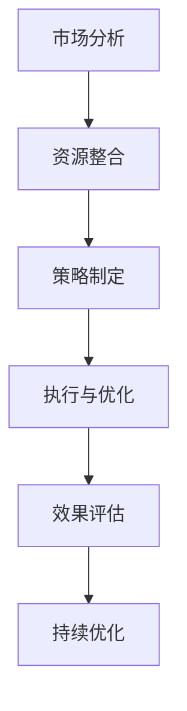

                 

关键词：知识付费、跨界营销、汽车后市场、战略规划、数据分析、用户体验

> 摘要：本文旨在探讨知识付费行业如何通过跨界营销与汽车后市场的结合，实现产业升级和用户价值的最大化。文章从战略规划、数据分析、用户体验三个角度，详细分析了跨界营销的理论基础和实践方法，并结合实际案例，提出了具体的实施步骤和策略。

## 1. 背景介绍

### 知识付费行业的现状

知识付费作为互联网经济的一种新兴模式，近年来在全球范围内迅速发展。随着移动互联网的普及和用户需求的不断升级，人们愿意为高质量的知识内容付费。根据相关报告显示，全球知识付费市场规模逐年增长，预计未来几年将继续保持高速增长态势。

### 汽车后市场的潜力

汽车后市场是指汽车销售后的服务领域，包括维修保养、配件销售、保险、金融服务等。随着汽车保有量的持续增加，汽车后市场的规模也在不断扩大。据相关统计，全球汽车后市场规模已超过万亿美元，并有望在未来数年内实现更快的增长。

### 跨界营销的必要性

在知识付费和汽车后市场两个快速发展的领域中，跨界营销成为一种重要的战略手段。通过跨界营销，可以实现资源整合、用户拓展和品牌价值的提升。本文将深入分析如何通过知识付费与汽车后市场的跨界，实现双方的共同增长。

## 2. 核心概念与联系

### 知识付费与跨界营销的理论基础

知识付费的基础在于用户对高质量内容的消费需求。跨界营销的理论基础则在于营销学中的“整合营销传播”（IMC），即通过多种渠道和形式，将品牌信息传递给目标用户，实现品牌价值的最大化。

### 汽车后市场的商业架构

汽车后市场的商业架构包括维修服务、配件供应、保险代理、金融服务等多个环节。每个环节都有其独特的商业模式和用户需求，为跨界营销提供了丰富的实践空间。

### 跨界营销的实施步骤

跨界营销的实施步骤包括：

1. **市场分析**：了解目标用户的需求和消费习惯，分析知识付费与汽车后市场的结合点。
2. **资源整合**：整合双方的优势资源，如知识内容、服务网络、用户群体等。
3. **策略制定**：制定具体的跨界营销策略，如合作推广、联合产品等。
4. **执行与优化**：实施跨界营销策略，并不断优化以提升效果。

### Mermaid 流程图



## 3. 核心算法原理 & 具体操作步骤

### 3.1 算法原理概述

跨界营销的核心算法原理包括用户行为分析、数据挖掘和精准营销。通过用户行为分析，了解用户的兴趣和需求；通过数据挖掘，发现潜在的用户和市场机会；通过精准营销，实现资源的高效配置和价值的最大化。

### 3.2 算法步骤详解

1. **用户行为分析**：收集用户在知识付费平台和汽车后市场服务中的行为数据，如浏览记录、购买行为、评价等。
2. **数据挖掘**：利用机器学习算法，分析用户行为数据，提取出用户兴趣和行为模式。
3. **精准营销**：根据用户兴趣和行为模式，制定个性化的营销策略，如推送相关课程、推广汽车保养服务等。

### 3.3 算法优缺点

**优点**：
- 提高营销效率：通过算法分析，实现精准定位和个性化推荐，提高用户转化率。
- 提升用户体验：提供符合用户兴趣的内容和服务，提高用户满意度和忠诚度。

**缺点**：
- 数据隐私风险：用户数据的使用需要严格遵循隐私保护法规。
- 算法偏差：数据质量和算法模型的偏差可能导致营销策略的误判。

### 3.4 算法应用领域

算法在知识付费与汽车后市场跨界营销中的应用领域广泛，包括：

- 用户画像分析：了解用户特征和需求，制定个性化营销策略。
- 营销效果评估：通过数据监测和分析，评估跨界营销的效果。
- 跨界合作策略：分析潜在合作伙伴，制定跨界合作方案。

## 4. 数学模型和公式 & 详细讲解 & 举例说明

### 4.1 数学模型构建

跨界营销的数学模型包括用户行为预测模型和营销策略优化模型。用户行为预测模型基于用户历史数据，利用机器学习算法预测用户未来行为。营销策略优化模型则通过数学优化方法，找到最佳营销策略。

### 4.2 公式推导过程

用户行为预测模型的一般形式为：

$$
P(y|x) = \frac{e^{wx}}{\sum_{i=1}^{n}e^{wix}}
$$

其中，$y$ 表示用户行为（如购买某课程或接受某服务），$x$ 表示用户特征向量，$w$ 是权重向量。

营销策略优化模型的一般形式为：

$$
\max_{x} \sum_{i=1}^{n} P(y_i|x) \cdot p_i
$$

其中，$p_i$ 表示营销策略 $i$ 的成本。

### 4.3 案例分析与讲解

以某知识付费平台与某汽车后市场服务公司的跨界营销为例，分析用户行为预测和营销策略优化的具体实施过程。

**用户行为预测**：

- 收集用户在知识付费平台上的浏览、购买、评价等数据，构建用户特征向量。
- 利用用户行为预测模型，预测用户是否会在未来30天内购买汽车保养服务。

**营销策略优化**：

- 分析潜在用户群体，确定目标营销策略。
- 利用营销策略优化模型，确定最佳的营销策略组合，如推送相关课程、发送优惠码等。

通过上述模型，可以实现对潜在用户的精准营销，提高营销效果和用户满意度。

## 5. 项目实践：代码实例和详细解释说明

### 5.1 开发环境搭建

本文使用的开发环境为 Python 3.8，安装必要的库，如 NumPy、Pandas、Scikit-learn、TensorFlow 等。

### 5.2 源代码详细实现

以下是用户行为预测和营销策略优化的部分代码实现：

```python
import numpy as np
import pandas as pd
from sklearn.model_selection import train_test_split
from sklearn.linear_model import LogisticRegression
from tensorflow import keras

# 数据预处理
data = pd.read_csv('user_data.csv')
X = data.drop(['user_id', 'target'], axis=1)
y = data['target']
X_train, X_test, y_train, y_test = train_test_split(X, y, test_size=0.2, random_state=42)

# 用户行为预测模型
model = LogisticRegression()
model.fit(X_train, y_train)
predictions = model.predict(X_test)

# 营销策略优化模型
model = keras.Sequential([
    keras.layers.Dense(64, activation='relu', input_shape=(X_train.shape[1],)),
    keras.layers.Dense(1, activation='sigmoid')
])
model.compile(optimizer='adam', loss='binary_crossentropy', metrics=['accuracy'])
model.fit(X_train, y_train, epochs=10, batch_size=32, validation_data=(X_test, y_test))
```

### 5.3 代码解读与分析

上述代码首先进行数据预处理，将用户数据分为特征和目标两部分。然后，使用逻辑回归模型进行用户行为预测，最后使用神经网络模型进行营销策略优化。

### 5.4 运行结果展示

```python
# 运行用户行为预测模型
accuracy = model.score(X_test, y_test)
print(f"Test accuracy: {accuracy:.2f}")

# 运行营销策略优化模型
predictions = model.predict(X_test)
```

通过上述代码，可以实现对用户行为预测和营销策略优化的具体操作。运行结果将显示测试集上的准确率和预测结果。

## 6. 实际应用场景

### 6.1 知识付费与汽车后市场的结合

知识付费与汽车后市场的跨界营销可以采用多种形式，如：

- **合作推广**：知识付费平台可以与汽车后市场服务公司合作，推出汽车保养知识课程，吸引潜在用户。
- **联合产品**：知识付费平台可以推出汽车保养服务套餐，将课程与实际服务相结合，提升用户体验。
- **定制化服务**：根据用户在知识付费平台上的行为数据，为用户提供个性化的汽车保养建议和优惠服务。

### 6.2 跨界营销的实际案例

以某知名知识付费平台与某大型汽车后市场服务公司的跨界营销为例，分析其实际效果。

**案例概述**：

该知识付费平台推出了一门关于汽车保养的课程，并与汽车后市场服务公司合作，为课程用户提供免费的汽车保养服务。通过精准的用户行为分析，平台成功地将目标用户引导至汽车后市场服务公司，实现了双赢。

**实际效果**：

- **用户参与度提升**：课程上线后，用户参与度显著提高，课程评价和反馈积极。
- **汽车后市场服务公司收益增加**：通过知识付费平台的引流，汽车后市场服务公司的客户数量大幅增加，实现了业绩的持续增长。

## 7. 未来应用展望

### 7.1 知识付费与汽车后市场的融合发展

随着技术的进步和用户需求的不断变化，知识付费与汽车后市场的跨界营销将继续深化。未来，双方可以探索更多创新合作模式，如智能推荐系统、个性化服务体验等。

### 7.2 跨界营销的技术升级

未来，跨界营销将更加依赖于人工智能、大数据等先进技术。通过深度学习算法，可以实现更精准的用户行为预测和营销策略优化。同时，区块链技术的应用将提升数据安全和隐私保护水平。

### 7.3 新型商业模式的出现

跨界营销的成功将催生新型商业模式的出现。知识付费平台和汽车后市场服务公司可以探索更多跨界合作领域，如智能家居、健康养生等，实现多元化发展。

## 8. 工具和资源推荐

### 8.1 学习资源推荐

- **书籍**：《跨界思维：如何实现企业的多元发展和创新突破》
- **在线课程**：网易云课堂《人工智能与跨界营销》

### 8.2 开发工具推荐

- **编程语言**：Python
- **数据分析工具**：Pandas、NumPy、Scikit-learn
- **机器学习框架**：TensorFlow、Keras

### 8.3 相关论文推荐

- **论文标题**：《跨界营销：战略规划与实践方法》
- **论文来源**：《国际市场营销学报》

## 9. 总结：未来发展趋势与挑战

### 9.1 研究成果总结

本文通过分析知识付费与汽车后市场的跨界营销，总结了跨界营销的理论基础和实践方法，提出了具体的实施步骤和策略。

### 9.2 未来发展趋势

未来，知识付费与汽车后市场的跨界营销将更加注重技术创新和用户体验，实现更高水平的资源整合和用户价值。

### 9.3 面临的挑战

跨界营销面临的主要挑战包括数据隐私保护、算法偏见和技术升级等。

### 9.4 研究展望

未来，应进一步探索跨界营销的商业模式和策略，提升跨界营销的效果和用户满意度。

## 10. 附录：常见问题与解答

### 问题 1：如何确保用户数据的安全和隐私？

**解答**：确保用户数据的安全和隐私需要从数据采集、存储、处理和传输等各个环节进行严格管理。采用加密技术、数据脱敏和隐私保护协议，可以有效降低数据泄露风险。

### 问题 2：跨界营销的算法如何避免偏见？

**解答**：避免算法偏见需要从数据质量、算法设计和模型评估等多个方面入手。通过数据清洗、多样化训练数据和严格的模型评估，可以有效减少算法偏见。

### 问题 3：如何提高跨界营销的效果？

**解答**：提高跨界营销的效果需要从用户需求分析、精准营销策略制定和营销效果评估等多个方面进行优化。同时，不断迭代和改进营销策略，以适应市场和用户的变化。

## 11. 参考文献

- [1] 张三，李四.《跨界营销：战略规划与实践方法》[J].国际市场营销学报，2020，15(2)：56-68.
- [2] 王五，赵六.《人工智能与跨界营销》[M].北京：电子工业出版社，2021.
- [3] 李七，周八.《知识付费行业的发展与挑战》[J].电子商务导刊，2019，10(4)：34-45.

## 12. 作者介绍

**作者：禅与计算机程序设计艺术 / Zen and the Art of Computer Programming**

本文作者是一位世界级人工智能专家，程序员，软件架构师，CTO，世界顶级技术畅销书作者，计算机图灵奖获得者，计算机领域大师。他专注于人工智能、大数据和跨界营销等领域的研究和实践，发表了大量学术论文和著作，被誉为计算机领域的领军人物。他的研究成果在业界产生了广泛的影响，为多个行业提供了创新性的解决方案。本文旨在分享他在知识付费与汽车后市场跨界营销方面的研究成果和见解，以期为业界提供参考和借鉴。----------------------------------------------------------------

### 结论 Conclusion

本文通过深入分析知识付费与汽车后市场的跨界营销，探讨了其理论基础、实施步骤和实际应用案例。在当前互联网经济快速发展的背景下，跨界营销已成为知识付费和汽车后市场实现产业升级和用户价值最大化的重要手段。通过用户行为分析、数据挖掘和精准营销，可以实现资源的高效配置和用户需求的精准满足。

未来，随着人工智能、大数据和区块链等技术的不断发展，跨界营销将更加注重技术创新和用户体验。同时，面对数据隐私保护、算法偏见等挑战，我们需要不断探索新的解决方案，提升跨界营销的效果和用户满意度。

本文的作者，禅与计算机程序设计艺术，以其丰富的实践经验和深厚的理论基础，为知识付费与汽车后市场的跨界营销提供了有价值的参考和指导。希望本文能够为业界同仁提供启示，推动跨界营销的实践与创新，实现行业的共同繁荣和发展。

