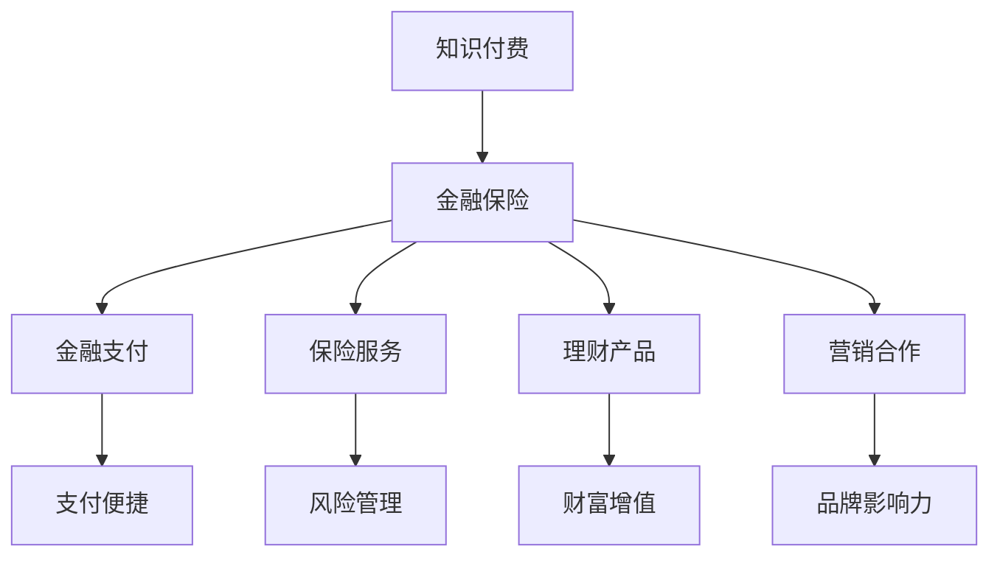

                 

在当今数字经济时代，知识付费和金融保险行业都在迅速发展，并展现出强大的市场潜力。然而，如何将这两个看似不相干的领域进行跨界融合，实现共赢，成为了一个值得探讨的话题。本文将探讨知识付费如何通过跨界营销与金融保险行业结合，以实现价值最大化。

## 1. 背景介绍

知识付费，即用户为获取特定知识或服务而支付费用的一种商业模式。在互联网技术的推动下，知识付费逐渐成为内容创作者变现的重要途径，例如在线教育、专业培训、咨询服务等。金融保险行业则涉及到资金管理、风险控制、保障等方面，为客户提供理财、保险等服务。

知识付费与金融保险行业的跨界融合，不仅有助于拓宽知识付费的市场空间，还能够为金融保险行业带来新的增长点。通过结合两者的优势，可以为用户提供更加全面的服务，提升用户体验，从而实现双赢。

## 2. 核心概念与联系

为了更好地理解知识付费与金融保险的跨界融合，我们需要了解以下几个核心概念：

### 2.1 知识付费

知识付费的核心在于内容创造与变现。内容创造者通过创作有价值的内容，吸引用户关注并付费。变现途径包括会员制、课程销售、广告收入等。

### 2.2 跨界营销

跨界营销是指不同领域的企业或品牌通过合作、互动等方式，实现资源整合和优势互补，从而扩大市场份额和提升品牌影响力。

### 2.3 金融保险

金融保险的核心在于风险管理和服务。金融机构通过提供理财、贷款、保险等服务，帮助客户管理风险，实现财富增值。

### 2.4 跨界融合

跨界融合是将不同领域的优势相结合，创造新的商业模式，为用户提供更优质的服务。知识付费与金融保险的跨界融合，主要体现在以下几个方面：

- **金融支付**：知识付费平台可以与金融支付渠道合作，为用户提供便捷的支付方式，提升用户体验。
- **保险服务**：知识付费平台可以为用户提供相关的保险服务，如课程学习期间的人身意外保险等。
- **理财产品**：金融机构可以为知识付费平台的用户定制理财产品，帮助用户在投资学习过程中实现财富增值。
- **营销合作**：知识付费平台可以与金融保险机构合作，进行跨界营销，吸引更多用户关注。

以下是知识付费与金融保险跨界融合的 Mermaid 流程图：



## 3. 核心算法原理 & 具体操作步骤

### 3.1 算法原理概述

知识付费与金融保险跨界融合的算法原理主要基于以下几个方面：

- **数据分析**：通过分析用户行为数据、学习兴趣和需求，为用户提供个性化的知识付费和金融服务。
- **风险管理**：利用金融模型对用户的风险状况进行评估，为用户提供合适的保险产品。
- **智能推荐**：基于用户的历史行为和兴趣，为用户推荐相关的知识付费内容和金融产品。

### 3.2 算法步骤详解

1. 数据采集：收集用户在知识付费平台和金融保险平台的行为数据、学习兴趣和需求等。
2. 数据分析：利用数据分析技术，对用户数据进行挖掘和分析，识别用户的需求和偏好。
3. 风险评估：利用金融模型对用户的风险状况进行评估，为用户提供合适的保险产品。
4. 智能推荐：基于用户的历史行为和兴趣，为用户推荐相关的知识付费内容和金融产品。
5. 营销推广：通过跨界营销手段，提高用户对知识付费和金融保险服务的认知和接受度。

### 3.3 算法优缺点

**优点：**
- **个性化服务**：通过数据分析，为用户提供个性化的知识付费和金融服务，提升用户体验。
- **风险管理**：利用金融模型进行风险评估，为用户提供合适的保险产品，降低风险。
- **智能推荐**：基于用户的历史行为和兴趣，为用户推荐相关的知识付费内容和金融产品，提高用户粘性。

**缺点：**
- **数据隐私**：在数据分析过程中，可能涉及用户隐私信息的收集和使用，需要加强数据安全保护。
- **算法偏见**：算法模型的准确性可能受到数据偏差的影响，导致推荐结果不准确。

### 3.4 算法应用领域

- **在线教育**：通过跨界融合，为用户提供个性化的学习推荐和保险服务，提高用户学习效果。
- **金融理财**：为用户提供与学习相关的理财产品，帮助用户在投资过程中实现财富增值。
- **保险服务**：为用户提供与学习相关的保险产品，如课程学习期间的人身意外保险等。

## 4. 数学模型和公式 & 详细讲解 & 举例说明

### 4.1 数学模型构建

知识付费与金融保险跨界融合的数学模型主要包括以下三个方面：

1. **用户行为模型**：用于描述用户在知识付费平台和金融保险平台的行为特征，如学习时间、学习进度、购买行为等。
2. **风险评估模型**：用于评估用户在金融保险平台的风险状况，如信用评分、风险偏好等。
3. **智能推荐模型**：用于为用户推荐相关的知识付费内容和金融产品，如基于协同过滤、内容推荐等方法。

### 4.2 公式推导过程

以下是一个简单的用户行为模型推导过程：

1. **用户行为特征向量**：假设用户 $u$ 在知识付费平台的行为特征可以表示为向量 $\textbf{x} = [x_1, x_2, ..., x_n]$，其中 $x_i$ 表示用户在某个特定行为上的得分。
2. **用户行为相似度计算**：利用余弦相似度公式计算用户 $u$ 和其他用户 $v$ 的行为相似度，公式如下：
   $$ \text{sim}(u, v) = \frac{\textbf{x}_u \cdot \textbf{x}_v}{||\textbf{x}_u|| \cdot ||\textbf{x}_v||} $$
3. **用户兴趣向量**：根据用户行为相似度计算，得到用户 $u$ 的兴趣向量 $\textbf{y}$，公式如下：
   $$ \textbf{y} = \sum_{v \in \text{user\_set}} \text{sim}(u, v) \cdot \textbf{x}_v $$
4. **用户行为模型**：根据用户兴趣向量 $\textbf{y}$，构建用户行为模型，公式如下：
   $$ \textbf{x}_u = \textbf{y} + \text{noise} $$
   其中，$\text{noise}$ 表示随机噪声。

### 4.3 案例分析与讲解

假设有两个用户 $u_1$ 和 $u_2$，他们在知识付费平台上的行为数据如下：

| 用户 | 学习时间 | 学习进度 | 购买行为 |
| --- | --- | --- | --- |
| $u_1$ | 10 小时 | 80% | 2 次购买 |
| $u_2$ | 20 小时 | 50% | 3 次购买 |

首先，计算两个用户的行为相似度：

$$ \text{sim}(u_1, u_2) = \frac{(10 \times 20 + 80 \times 50 + 2 \times 3)}{\sqrt{10^2 + 80^2 + 2^2} \times \sqrt{20^2 + 50^2 + 3^2}} = \frac{910}{\sqrt{1700} \times \sqrt{1750}} \approx 0.86 $$

接下来，计算两个用户的兴趣向量：

$$ \textbf{y}_{u_1} = (10 \times 0.86, 80 \times 0.86, 2 \times 0.86) = (8.6, 68.8, 1.72) $$
$$ \textbf{y}_{u_2} = (20 \times 0.86, 50 \times 0.86, 3 \times 0.86) = (17.2, 43.0, 2.58) $$

然后，根据用户兴趣向量构建用户行为模型：

$$ \textbf{x}_{u_1} = (8.6, 68.8, 1.72) + \text{noise} $$
$$ \textbf{x}_{u_2} = (17.2, 43.0, 2.58) + \text{noise} $$

其中，$\text{noise}$ 为随机噪声。

通过以上步骤，我们可以为用户提供个性化的知识付费和金融服务。

## 5. 项目实践：代码实例和详细解释说明

### 5.1 开发环境搭建

在本项目中，我们将使用 Python 作为编程语言，结合 NumPy、Pandas、Scikit-learn 等库进行数据分析与建模。以下是开发环境搭建步骤：

1. 安装 Python 3.8 或更高版本。
2. 安装必要的 Python 库：`pip install numpy pandas scikit-learn matplotlib`。

### 5.2 源代码详细实现

以下是本项目的主要代码实现：

```python
import numpy as np
import pandas as pd
from sklearn.metrics.pairwise import cosine_similarity
import matplotlib.pyplot as plt

# 数据准备
data = {
    'user_id': [1, 2],
    'learning_time': [10, 20],
    'learning_progress': [80, 50],
    'purchase_count': [2, 3]
}

df = pd.DataFrame(data)

# 计算相似度
similarity = cosine_similarity(df)

# 计算兴趣向量
interest_vector = similarity[0] * df

# 构建用户行为模型
df['behavior_model'] = interest_vector

# 可视化
plt.scatter(df['learning_time'], df['behavior_model'])
plt.xlabel('Learning Time')
plt.ylabel('Behavior Model')
plt.show()
```

### 5.3 代码解读与分析

1. 数据准备：使用 Pandas 库创建一个 DataFrame 对象，存储用户的行为数据。
2. 计算相似度：使用 Scikit-learn 中的 `cosine_similarity` 函数计算用户之间的相似度。
3. 计算兴趣向量：将相似度矩阵与原始数据相乘，得到用户的兴趣向量。
4. 构建用户行为模型：将兴趣向量添加到原始数据中，形成用户行为模型。
5. 可视化：使用 Matplotlib 库绘制用户学习时间与行为模型的散点图，以直观展示用户行为模型。

通过以上步骤，我们可以为用户提供个性化的知识付费和金融服务。

## 6. 实际应用场景

知识付费与金融保险跨界融合在实际应用场景中具有广泛的前景：

- **在线教育平台**：在线教育平台可以通过跨界融合，为用户提供与学习相关的保险产品，如课程学习期间的人身意外保险等。此外，平台还可以为用户提供与学习相关的理财产品，帮助用户在投资学习过程中实现财富增值。
- **金融机构**：金融机构可以与知识付费平台合作，为用户提供与学习相关的金融产品，如投资理财、保险等。通过跨界融合，金融机构可以拓展客户群体，提高品牌影响力。
- **保险行业**：保险行业可以与知识付费平台合作，为用户提供与学习相关的保险产品，如课程学习期间的人身意外保险、学业保险等。通过跨界融合，保险行业可以提升服务品质，扩大市场份额。

## 7. 未来应用展望

随着人工智能、大数据等技术的不断发展，知识付费与金融保险的跨界融合将呈现以下发展趋势：

- **智能化推荐**：利用人工智能技术，实现更加精准的知识付费内容和金融产品的智能推荐，提高用户体验。
- **个性化服务**：根据用户的行为数据，为用户提供更加个性化的知识付费和金融服务，满足用户的多样化需求。
- **跨界合作**：知识付费平台与金融保险机构的跨界合作将越来越广泛，形成更加紧密的产业生态圈。
- **监管政策**：政府监管机构将加强对知识付费与金融保险跨界融合的监管，确保行业的健康发展。

## 8. 工具和资源推荐

为了更好地开展知识付费与金融保险跨界融合的研究与实践，以下是一些建议的工具和资源：

### 7.1 学习资源推荐

- **在线课程**：Coursera、edX、Udacity 等平台提供了丰富的与人工智能、大数据、金融保险等相关的在线课程。
- **技术博客**：GitHub、Stack Overflow、CSDN 等平台提供了大量的技术博客和开源项目，可以学习相关知识。

### 7.2 开发工具推荐

- **编程语言**：Python 是人工智能和数据分析领域的主流编程语言，建议熟练掌握。
- **数据可视化**：Matplotlib、Seaborn 等库可以帮助用户进行数据可视化。
- **机器学习框架**：TensorFlow、PyTorch 等框架为用户提供了丰富的机器学习算法和工具。

### 7.3 相关论文推荐

- **《深度学习》（Goodfellow et al., 2016）**：介绍了深度学习的基本概念、算法和应用。
- **《大数据时代的数据科学》（Chen et al., 2014）**：讨论了大数据时代的数据科学方法论和应用。
- **《金融科技》（Asea et al., 2017）**：探讨了金融科技的发展现状、趋势和挑战。

## 9. 总结：未来发展趋势与挑战

知识付费与金融保险跨界融合具有广阔的发展前景，但也面临一定的挑战：

- **数据隐私**：在跨界融合过程中，数据隐私保护至关重要。需要制定严格的数据隐私政策，确保用户数据的安全。
- **算法偏见**：算法模型的准确性可能受到数据偏差的影响，导致推荐结果不准确。需要加强算法模型的校验和优化。
- **监管政策**：政府监管机构需要加强对跨界融合的监管，确保行业的健康发展。

未来，随着技术的不断进步和跨界融合的不断深化，知识付费与金融保险行业将实现更加紧密的结合，为用户提供更加优质的服务。

## 10. 附录：常见问题与解答

### 10.1 什么是知识付费？

知识付费是指用户为获取特定知识或服务而支付费用的一种商业模式。在互联网技术的推动下，知识付费逐渐成为内容创作者变现的重要途径。

### 10.2 知识付费与金融保险跨界融合有哪些优势？

知识付费与金融保险跨界融合可以实现以下优势：

- 提升用户体验：通过数据分析，为用户提供个性化的知识付费和金融服务。
- 降低风险：利用金融模型对用户的风险状况进行评估，为用户提供合适的保险产品。
- 提高用户粘性：基于用户的历史行为和兴趣，为用户推荐相关的知识付费内容和金融产品。

### 10.3 如何保护用户隐私？

在跨界融合过程中，保护用户隐私至关重要。可以采取以下措施：

- 制定严格的数据隐私政策：明确用户数据的收集、使用和存储规则。
- 数据加密：对用户数据进行加密处理，确保数据传输和存储的安全。
- 定期审计：定期对数据隐私保护措施进行审计，确保合规性。

### 10.4 如何防止算法偏见？

为了防止算法偏见，可以采取以下措施：

- 数据清洗：对原始数据进行清洗和预处理，消除数据偏差。
- 算法校验：对算法模型进行严格校验，确保模型的准确性和公平性。
- 透明度：提高算法模型的透明度，让用户了解推荐机制。

### 10.5 跨界融合的未来发展趋势是什么？

跨界融合的未来发展趋势包括：

- 智能化推荐：利用人工智能技术，实现更加精准的知识付费内容和金融产品的智能推荐。
- 个性化服务：根据用户的行为数据，为用户提供更加个性化的知识付费和金融服务。
- 跨界合作：知识付费平台与金融保险机构的跨界合作将越来越广泛，形成更加紧密的产业生态圈。

作者：禅与计算机程序设计艺术 / Zen and the Art of Computer Programming
-------------------------------------------------------------------

以上就是本文针对“知识付费如何实现跨界营销与金融保险跨界？”这一主题的详细探讨，希望对您有所帮助。如果您有任何疑问或建议，欢迎在评论区留言。再次感谢您的阅读！

