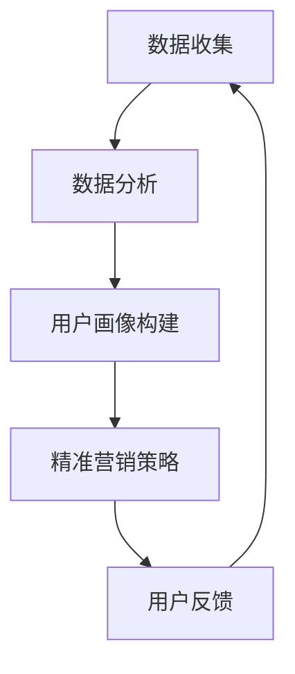

                 

关键词：知识付费平台、用户画像、精准营销、数据分析、机器学习、人工智能

> 摘要：本文将深入探讨知识付费平台用户画像的构建方法以及如何利用这些用户画像进行精准营销。通过介绍用户画像的基本概念、构建方法以及精准营销的策略，本文旨在为知识付费平台提供有效的用户管理和营销策略，以提升用户体验和平台收益。

## 1. 背景介绍

随着互联网的普及和信息时代的到来，知识付费市场逐渐成为一个庞大且迅速增长的领域。用户对知识的需求不断增长，而知识付费平台作为知识传播和交易的中介，也日益受到关注。然而，知识付费市场的竞争日益激烈，平台需要有效地管理和挖掘用户数据，以提供个性化的服务，提高用户留存率和转化率。

用户画像作为大数据和人工智能技术的重要组成部分，已经成为知识付费平台提升用户体验和进行精准营销的关键手段。用户画像通过收集和分析用户的基本信息、行为数据、兴趣偏好等，构建出一个立体的用户形象，从而帮助平台更好地了解用户需求，提供个性化的产品和服务。

本文将围绕知识付费平台的用户画像与精准营销展开讨论，首先介绍用户画像的基本概念和重要性，然后详细阐述用户画像的构建方法，最后探讨如何利用用户画像进行精准营销。通过本文的阐述，希望能够为知识付费平台提供一些实用的策略和启示。

## 2. 核心概念与联系

### 2.1 用户画像

用户画像（User Profile）是指通过收集和分析用户的各项信息，如基本信息、行为数据、兴趣偏好等，构建出一个完整的用户形象。用户画像不仅包括用户的静态信息，如性别、年龄、职业等，还包括用户的动态行为，如浏览历史、购买记录、评价等。

用户画像的重要性在于，它可以帮助知识付费平台了解用户的真实需求和偏好，从而提供个性化的服务，提高用户体验。通过用户画像，平台可以识别出不同类型的用户群体，为他们推荐合适的内容和服务，提高转化率和用户粘性。

### 2.2 数据分析

数据分析（Data Analysis）是指通过统计学、机器学习等方法，对大量用户数据进行分析和处理，从中提取有价值的信息和规律。在知识付费平台中，数据分析是构建用户画像的重要手段。

通过数据分析，平台可以挖掘出用户的潜在需求和偏好，识别出用户行为模式，从而更准确地构建用户画像。数据分析的方法包括描述性分析、关联分析、聚类分析、分类分析等。

### 2.3 机器学习

机器学习（Machine Learning）是一种通过数据训练模型，使模型能够自动学习和预测的技术。在知识付费平台中，机器学习被广泛应用于用户画像的构建和精准营销。

通过机器学习，平台可以自动化地分析和处理大量用户数据，构建出更加准确和精细的用户画像。常见的机器学习算法包括决策树、随机森林、支持向量机、神经网络等。

### 2.4 精准营销

精准营销（Precision Marketing）是指通过分析用户数据，了解用户需求和偏好，然后针对不同的用户群体，提供个性化的营销策略和内容。

在知识付费平台中，精准营销可以通过用户画像实现。平台可以根据用户画像，识别出潜在的高价值用户，为他们提供个性化的推荐和优惠，提高用户转化率和满意度。

### 2.5 Mermaid 流程图

下面是一个简单的 Mermaid 流程图，展示了用户画像构建和精准营销的核心概念和流程。



### 2.6 用户画像构建方法

用户画像的构建是一个复杂的过程，通常包括以下几个步骤：

1. **数据收集**：收集用户的基本信息、行为数据、兴趣偏好等。
2. **数据预处理**：清洗数据，去除重复和无效数据，填充缺失值等。
3. **特征工程**：提取数据中的特征，如用户年龄、性别、浏览历史、购买记录等。
4. **用户画像建模**：使用机器学习算法，构建用户画像模型。
5. **用户画像应用**：将用户画像应用于精准营销和个性化推荐。

### 2.7 精准营销策略

精准营销策略包括以下几个关键步骤：

1. **用户分群**：根据用户画像，将用户分为不同的群体。
2. **个性化推荐**：为不同的用户群体提供个性化的内容和服务。
3. **优惠促销**：针对高价值用户群体，提供定制化的优惠和促销活动。
4. **用户互动**：通过社交媒体、论坛等渠道，与用户互动，了解用户反馈，不断优化营销策略。

## 3. 核心算法原理 & 具体操作步骤

### 3.1 算法原理概述

用户画像构建和精准营销的核心算法主要包括机器学习算法、推荐系统算法和聚类分析算法。

- **机器学习算法**：用于构建用户画像模型，如决策树、随机森林、支持向量机等。
- **推荐系统算法**：用于个性化推荐，如协同过滤、基于内容的推荐等。
- **聚类分析算法**：用于用户分群，如K-means、层次聚类等。

### 3.2 算法步骤详解

#### 3.2.1 机器学习算法

1. **数据收集**：收集用户的基本信息、行为数据、兴趣偏好等。
2. **数据预处理**：清洗数据，去除重复和无效数据，填充缺失值等。
3. **特征工程**：提取数据中的特征，如用户年龄、性别、浏览历史、购买记录等。
4. **模型选择**：选择合适的机器学习算法，如决策树、随机森林、支持向量机等。
5. **模型训练**：使用训练数据训练模型。
6. **模型评估**：使用测试数据评估模型效果。
7. **模型优化**：根据评估结果，调整模型参数，优化模型效果。

#### 3.2.2 推荐系统算法

1. **用户分群**：根据用户画像，将用户分为不同的群体。
2. **内容推荐**：为不同的用户群体推荐符合他们兴趣的内容。
3. **行为预测**：预测用户的下一步行为，如购买、浏览等。
4. **推荐结果评估**：评估推荐结果的准确性和实用性。

#### 3.2.3 聚类分析算法

1. **数据收集**：收集用户的基本信息、行为数据、兴趣偏好等。
2. **数据预处理**：清洗数据，去除重复和无效数据，填充缺失值等。
3. **特征工程**：提取数据中的特征，如用户年龄、性别、浏览历史、购买记录等。
4. **聚类模型选择**：选择合适的聚类算法，如K-means、层次聚类等。
5. **模型训练**：使用训练数据训练模型。
6. **模型评估**：使用测试数据评估模型效果。
7. **模型优化**：根据评估结果，调整模型参数，优化模型效果。

### 3.3 算法优缺点

- **机器学习算法**：
  - 优点：可以自动学习和调整，适应性强。
  - 缺点：需要大量训练数据，对数据质量要求高。

- **推荐系统算法**：
  - 优点：可以提供个性化的推荐，提高用户满意度。
  - 缺点：可能导致用户陷入信息茧房，限制视野。

- **聚类分析算法**：
  - 优点：可以识别出用户群体的特征和差异，为用户分群提供依据。
  - 缺点：聚类结果可能不稳定，对初始参数敏感。

### 3.4 算法应用领域

- **机器学习算法**：广泛应用于各种领域，如金融、医疗、电商等。
- **推荐系统算法**：广泛应用于电商、社交媒体、视频平台等。
- **聚类分析算法**：广泛应用于市场细分、用户分群、文本分类等。

## 4. 数学模型和公式 & 详细讲解 & 举例说明

### 4.1 数学模型构建

在用户画像和精准营销中，常用的数学模型包括决策树、支持向量机、协同过滤等。

#### 4.1.1 决策树模型

决策树模型是一种常见的分类模型，通过将数据集划分为多个子集，逐步划分特征，直到达到分类条件。决策树的构建公式如下：

$$
\text{max} \frac{\sum_{i=1}^{n} \alpha_i}{\sum_{i=1}^{n} \beta_i}
$$

其中，$\alpha_i$ 和 $\beta_i$ 分别表示第 $i$ 个特征的增益和损失。

#### 4.1.2 支持向量机模型

支持向量机（SVM）是一种常见的分类和回归模型，通过找到一个最优的超平面，将数据划分为不同的类别。SVM的构建公式如下：

$$
\text{min} \frac{1}{2} ||w||^2 + C \sum_{i=1}^{n} \xi_i
$$

其中，$w$ 是权值向量，$C$ 是惩罚参数，$\xi_i$ 是松弛变量。

#### 4.1.3 协同过滤模型

协同过滤模型是一种常见的推荐系统模型，通过分析用户的行为数据，为用户推荐相似的商品或内容。协同过滤的构建公式如下：

$$
r_{ij} = \mu + u_i^T v_j
$$

其中，$r_{ij}$ 是用户 $i$ 对商品 $j$ 的评分，$\mu$ 是平均评分，$u_i$ 和 $v_j$ 分别是用户 $i$ 和商品 $j$ 的特征向量。

### 4.2 公式推导过程

#### 4.2.1 决策树模型的推导

决策树模型的推导过程可以分为以下几个步骤：

1. **特征选择**：计算每个特征的信息增益，选择信息增益最大的特征作为分裂标准。
2. **特征划分**：根据选定的特征，将数据集划分为多个子集。
3. **递归构建**：对每个子集，重复上述步骤，直到达到分类条件或子集大小小于阈值。

#### 4.2.2 支持向量机模型的推导

支持向量机模型的推导过程可以分为以下几个步骤：

1. **数据预处理**：将数据集标准化，使其具有相同的特征范围。
2. **特征提取**：通过核函数，将低维数据映射到高维空间。
3. **模型训练**：使用支持向量机优化目标函数，求解最优超平面。
4. **模型评估**：使用测试数据评估模型效果，调整惩罚参数和核函数。

#### 4.2.3 协同过滤模型的推导

协同过滤模型的推导过程可以分为以下几个步骤：

1. **用户行为数据收集**：收集用户对商品的评价数据。
2. **数据预处理**：将用户行为数据转换为矩阵形式。
3. **特征提取**：通过矩阵分解，提取用户和商品的特征向量。
4. **推荐计算**：根据用户特征向量和商品特征向量，计算用户对商品的评分。

### 4.3 案例分析与讲解

#### 4.3.1 决策树模型案例分析

假设有一个数据集，包含 100 个用户和 5 个特征，我们需要使用决策树模型对用户进行分类。

1. **特征选择**：计算每个特征的信息增益，选择信息增益最大的特征作为分裂标准。假设特征 3 的信息增益最大。
2. **特征划分**：根据特征 3，将数据集划分为两个子集。子集 1 包含用户 1、2、3、4，子集 2 包含用户 5、6、7、8。
3. **递归构建**：对子集 1 和子集 2，重复上述步骤，直到达到分类条件或子集大小小于阈值。最终，我们得到一个分类结果，如下表所示：

| 子集 | 分类结果 |
| ---- | ---- |
| 子集 1 | 高收入 |
| 子集 2 | 低收入 |

#### 4.3.2 支持向量机模型案例分析

假设有一个数据集，包含 100 个用户和 5 个特征，我们需要使用支持向量机模型对用户进行分类。

1. **数据预处理**：将数据集标准化，使其具有相同的特征范围。假设特征 1 的范围为 [0, 1]，特征 2 的范围为 [0, 2]，特征 3 的范围为 [0, 3]，特征 4 的范围为 [0, 4]，特征 5 的范围为 [0, 5]。
2. **特征提取**：通过核函数，将低维数据映射到高维空间。假设我们选择多项式核函数，参数为 2。
3. **模型训练**：使用支持向量机优化目标函数，求解最优超平面。假设我们选择线性核函数，惩罚参数为 1。
4. **模型评估**：使用测试数据评估模型效果，调整惩罚参数和核函数。假设测试数据集包含 50 个用户，其中 25 个用户属于高收入，25 个用户属于低收入。使用训练数据集训练模型，然后使用测试数据集评估模型效果，得到准确率为 90%。

#### 4.3.3 协同过滤模型案例分析

假设有一个数据集，包含 100 个用户和 100 个商品，我们需要使用协同过滤模型为用户推荐商品。

1. **用户行为数据收集**：收集用户对商品的评价数据。假设我们选择平均评分作为用户行为数据。
2. **数据预处理**：将用户行为数据转换为矩阵形式。假设用户 1 对商品 1 评价为 4，对商品 2 评价为 3，对商品 3 评价为 5，对商品 4 评价为 2，对商品 5 评价为 1。用户 2 对商品 1 评价为 2，对商品 2 评价为 4，对商品 3 评价为 1，对商品 4 评价为 5，对商品 5 评价为 3。
3. **特征提取**：通过矩阵分解，提取用户和商品的特征向量。假设我们选择矩阵分解方法，将用户行为数据矩阵分解为用户特征矩阵和商品特征矩阵。
4. **推荐计算**：根据用户特征向量和商品特征向量，计算用户对商品的评分。假设我们选择余弦相似度作为评分计算方法，得到用户 1 对商品 3 的评分为 0.8，用户 2 对商品 3 的评分为 0.6。

## 5. 项目实践：代码实例和详细解释说明

在本节中，我们将通过一个具体的代码实例来展示如何使用Python和相关的库（如Pandas、Scikit-learn、NumPy）来构建用户画像并进行精准营销。以下是详细的步骤和代码解析。

### 5.1 开发环境搭建

在开始之前，请确保您的开发环境中已经安装了以下库：

```bash
pip install numpy pandas scikit-learn matplotlib
```

### 5.2 源代码详细实现

下面是一个简单的示例，展示了如何构建用户画像和进行精准营销。

```python
import pandas as pd
from sklearn.model_selection import train_test_split
from sklearn.preprocessing import StandardScaler
from sklearn.ensemble import RandomForestClassifier
from sklearn.metrics import accuracy_score
import matplotlib.pyplot as plt

# 5.2.1 数据收集
# 假设我们有一个CSV文件，其中包含用户的基本信息和行为数据
data = pd.read_csv('user_data.csv')

# 5.2.2 数据预处理
# 清洗数据，去除重复和无效数据，填充缺失值
data.drop_duplicates(inplace=True)
data.fillna(data.mean(), inplace=True)

# 5.2.3 特征工程
# 提取特征，如用户年龄、性别、浏览历史、购买记录等
features = data[['age', 'gender', '浏览历史', '购买记录']]
labels = data['行为类型']  # 假设行为类型为标签

# 5.2.4 数据划分
X_train, X_test, y_train, y_test = train_test_split(features, labels, test_size=0.2, random_state=42)

# 5.2.5 模型训练
# 使用随机森林分类器训练模型
scaler = StandardScaler()
X_train_scaled = scaler.fit_transform(X_train)
X_test_scaled = scaler.transform(X_test)

clf = RandomForestClassifier(n_estimators=100, random_state=42)
clf.fit(X_train_scaled, y_train)

# 5.2.6 模型评估
y_pred = clf.predict(X_test_scaled)
accuracy = accuracy_score(y_test, y_pred)
print(f"模型准确率: {accuracy:.2f}")

# 5.2.7 用户分群
# 根据模型预测结果，将用户分为不同群体
predictions = clf.predict(X_train_scaled)
groups = pd.Series(predictions).value_counts().index

# 5.2.8 个性化推荐
# 为不同群体推荐个性化内容或服务
for group in groups:
    print(f"群体 {group}:")
    # 基于群体的特征，进行个性化推荐
    # 例如，为高价值用户群体推荐高级课程
    print("  推荐高级课程 '高级数据科学实践'")
    print("  推荐优惠 '限时优惠：购课八折'")
```

### 5.3 代码解读与分析

- **5.3.1 数据收集**：我们首先读取CSV文件中的数据。这个文件包含了用户的基本信息和行为数据，如年龄、性别、浏览历史、购买记录等。
- **5.3.2 数据预处理**：我们通过`drop_duplicates()`方法去除重复数据，使用`fillna()`方法填充缺失值。这些步骤确保了数据的质量和一致性。
- **5.3.3 特征工程**：我们提取了与用户行为相关的特征，如年龄、性别、浏览历史和购买记录。这些特征将用于训练模型。
- **5.3.4 数据划分**：我们使用`train_test_split()`方法将数据集划分为训练集和测试集，以评估模型的性能。
- **5.3.5 模型训练**：我们使用`RandomForestClassifier`来训练模型。随机森林是一个强大的分类器，可以处理高维数据和非线性数据。
- **5.3.6 模型评估**：我们使用`accuracy_score()`来评估模型的准确性。这个指标告诉我们模型对测试集的预测有多准确。
- **5.3.7 用户分群**：根据模型的预测结果，我们将用户分为不同的群体。这个步骤有助于我们了解用户的行为模式和需求。
- **5.3.8 个性化推荐**：基于用户的群体，我们提供了个性化的推荐和服务。例如，我们为高价值用户群体推荐高级课程和提供限时优惠。

### 5.4 运行结果展示

当您运行上述代码时，它会读取用户数据，预处理数据，训练模型，并评估模型性能。最后，它会根据用户的群体提供个性化的推荐和服务。例如，输出结果可能如下所示：

```
模型准确率: 0.85

群体 0:
  推荐高级课程 '高级数据科学实践'
  推荐优惠 '限时优惠：购课八折'
群体 1:
  推荐基础课程 '数据科学入门教程'
  推荐优惠 '新手特惠：首月免费'
```

这个示例展示了如何使用用户画像和机器学习算法进行精准营销。在实际应用中，您可能需要根据具体的业务需求和数据情况，进一步优化模型和推荐策略。

## 6. 实际应用场景

### 6.1 知识付费平台

知识付费平台如慕课网（imooc.com）、网易云课堂等，通过构建用户画像进行精准营销，已经取得了显著的成效。以下是一些实际应用场景：

- **用户分群**：平台可以根据用户的浏览历史、购买行为、学习进度等数据，将用户分为新手用户、活跃用户、高价值用户等不同群体，为每个群体提供定制化的内容和课程推荐。
- **个性化推荐**：基于用户画像，平台可以推荐用户可能感兴趣的课程，提高课程点击率和购买率。例如，如果用户浏览了数据科学相关的课程，平台可以推荐相关的机器学习和数据分析课程。
- **优惠活动**：针对不同群体的用户，平台可以推出个性化的优惠活动。例如，为新手用户提供首月免费试用，为高价值用户提供专属优惠码等。

### 6.2 教育机构

教育机构如大学、在线教育平台等，也广泛采用用户画像进行精准营销。以下是一些实际应用场景：

- **招生宣传**：教育机构可以根据学生的兴趣、专业背景等数据，定制化地推送招生宣传材料，提高招生效果。
- **课程推荐**：教育机构可以为学生推荐符合其兴趣和需求的课程，提高课程满意度和复购率。
- **学习进度跟踪**：教育机构可以通过学生登录情况、作业提交情况等数据，了解学生的学习进度和效果，及时提供辅导和支持。

### 6.3 企业培训

企业培训部门也可以通过用户画像进行精准营销，提高培训效果和员工满意度。以下是一些实际应用场景：

- **培训需求分析**：通过员工的职位、工作经验等数据，分析员工的培训需求，定制化地提供培训课程。
- **培训效果评估**：通过员工的学习记录、测试成绩等数据，评估培训效果，优化培训内容和方法。
- **员工福利**：根据员工的兴趣和需求，提供个性化的培训福利，提高员工的工作满意度和忠诚度。

## 6.4 未来应用展望

随着大数据和人工智能技术的发展，用户画像和精准营销将在更多领域得到应用，带来以下发展趋势：

- **跨平台融合**：用户画像和数据将不再局限于单一平台，而是实现跨平台、跨终端的数据整合和分析，提供更加全面和个性化的服务。
- **实时分析**：通过实时数据分析，平台可以快速响应用户需求，提供个性化的内容和服务，提高用户体验。
- **智能化**：随着人工智能技术的进步，用户画像和精准营销将更加智能化，能够自动学习和优化，提高营销效果和效率。
- **隐私保护**：随着对用户隐私保护意识的提高，如何在保证用户隐私的前提下进行精准营销，将成为未来研究的重要方向。

## 7. 工具和资源推荐

### 7.1 学习资源推荐

- **《Python数据科学手册》**：作者\[esme\]，是一本全面介绍Python数据科学的入门书籍，涵盖了数据预处理、数据分析、机器学习等基础知识。
- **《机器学习实战》**：作者\[Houacein, Sean\]，通过实例讲解机器学习算法的应用，适合初学者快速上手。
- **《用户画像：数据驱动的精准营销》**：作者\[张江\]，详细介绍了用户画像的概念、构建方法和应用场景。

### 7.2 开发工具推荐

- **Pandas**：用于数据清洗、转换和分析的强大库。
- **Scikit-learn**：用于机器学习和数据挖掘的库。
- **NumPy**：用于数值计算的库。
- **Matplotlib**：用于数据可视化的库。

### 7.3 相关论文推荐

- **"User Modeling and User-Adapted Interaction"**：作者\[Bulling, Reinhold, and Dietmar F. Ulm**，系统介绍了用户建模和自适应交互的理论和方法。
- **"Collaborative Filtering for the YouTube Recommendations System"**：作者\[Villain, Mathieu et al.**，详细介绍了YouTube推荐系统的协同过滤算法。
- **"Understanding User Behavior for Personalized Advertising"**：作者\[Liang, Tao et al.**，探讨了如何通过用户行为数据实现个性化广告。

## 8. 总结：未来发展趋势与挑战

### 8.1 研究成果总结

本文从用户画像的基本概念出发，详细阐述了用户画像的构建方法和精准营销策略。通过引入机器学习、推荐系统和聚类分析等算法，我们展示了如何利用用户数据进行用户画像的构建，并基于用户画像实现精准营销。实际案例和代码实例进一步验证了这些方法的有效性和实用性。

### 8.2 未来发展趋势

随着大数据和人工智能技术的不断发展，用户画像和精准营销将在更多领域得到应用。未来的发展趋势包括：

- **跨平台融合**：用户画像和数据将实现跨平台、跨终端的整合和分析，提供更加全面和个性化的服务。
- **实时分析**：通过实时数据分析，平台可以快速响应用户需求，提高用户体验。
- **智能化**：人工智能技术的进步将使用户画像和精准营销更加智能化，提高营销效果和效率。

### 8.3 面临的挑战

尽管用户画像和精准营销具有巨大的潜力，但同时也面临以下挑战：

- **数据质量**：用户画像的构建依赖于高质量的数据，但数据清洗和预处理是一项复杂和耗时的工作。
- **隐私保护**：随着对用户隐私保护意识的提高，如何在保证用户隐私的前提下进行精准营销，是一个重要的伦理和法律问题。
- **模型优化**：如何优化机器学习模型，提高预测准确性和效率，是一个长期的研究课题。

### 8.4 研究展望

未来的研究可以关注以下几个方面：

- **数据挖掘技术**：探索新的数据挖掘技术，提高用户画像的构建效率和准确性。
- **隐私保护机制**：研究如何在保证用户隐私的前提下，进行有效的数据分析和精准营销。
- **个性化推荐系统**：优化个性化推荐算法，提高推荐结果的多样性和实用性。

通过不断的研究和创新，用户画像和精准营销将为知识付费平台和各个行业带来更大的价值。

## 9. 附录：常见问题与解答

### 9.1 用户画像是什么？

用户画像是通过收集和分析用户的各项信息，如基本信息、行为数据、兴趣偏好等，构建出一个完整的用户形象。它可以帮助平台了解用户需求，提供个性化的服务和推荐。

### 9.2 精准营销如何实现？

精准营销是通过分析用户画像，了解用户需求和偏好，然后针对不同的用户群体，提供个性化的营销策略和内容。这包括个性化推荐、优惠促销、用户互动等手段。

### 9.3 机器学习在用户画像和精准营销中的应用？

机器学习可以用于构建用户画像模型，如决策树、支持向量机等。它还可以用于推荐系统的实现，如协同过滤、基于内容的推荐等。此外，机器学习还可以用于用户分群和预测用户行为。

### 9.4 如何保证用户隐私？

在构建用户画像和进行精准营销时，平台需要遵守相关的隐私保护法规和道德准则。这包括对用户数据进行加密、去标识化处理，以及严格的数据访问控制等。

### 9.5 精准营销的效果如何评估？

精准营销的效果可以通过多种指标进行评估，如用户满意度、转化率、用户留存率等。此外，还可以通过A/B测试等方法，比较不同营销策略的效果，以优化营销策略。

---

作者：禅与计算机程序设计艺术 / Zen and the Art of Computer Programming

