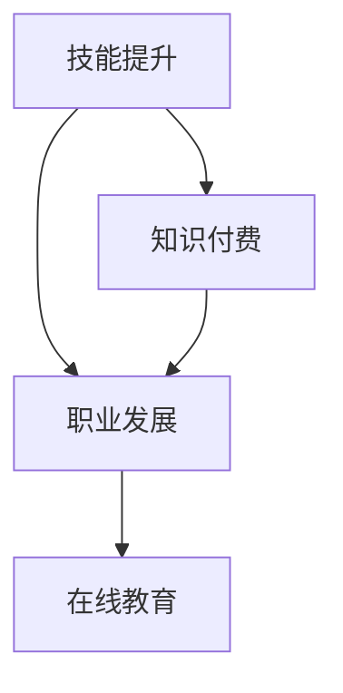

                 

关键词：知识付费、程序员、技能提升、职业发展、技术交流、在线教育、人工智能

摘要：随着知识付费时代的到来，程序员面临着前所未有的发展机遇。本文将从知识付费的现状、程序员的核心技能需求、在线教育平台的优势、以及人工智能技术在编程教育中的应用等方面，深入探讨程序员在这个时代的发展机遇和挑战。

## 1. 背景介绍

知识付费作为一种商业模式，已经在全球范围内得到了广泛应用。知识付费指的是消费者为获取有价值的信息、技能或知识而支付费用。在互联网技术的推动下，知识付费市场呈现出蓬勃发展的态势，各类知识服务平台、在线教育平台和技能培训平台如雨后春笋般涌现。对于程序员而言，知识付费不仅为他们的职业发展提供了更多的机会，也促使他们不断提升自身的技能水平。

### 1.1 知识付费的定义

知识付费是指消费者通过付费获取有价值的信息、知识或技能的过程。在传统的教育模式中，学习者需要支付学费以获取教育服务。而知识付费则将这种模式拓展到在线领域，通过互联网平台，学习者可以随时随地购买并学习各种课程和知识。

### 1.2 程序员面临的挑战

随着技术的快速发展，程序员需要不断更新自己的技能，以适应不断变化的市场需求。然而，由于程序员的工作性质，他们往往面临着时间紧张、知识获取渠道有限等挑战。知识付费的出现，为他们提供了一种新的学习方式，有助于他们更快地提升自己的技能。

## 2. 核心概念与联系

在探讨程序员的发展机遇之前，我们需要了解一些核心概念，包括技能提升、职业发展和在线教育等。这些概念之间的关系可以用 Mermaid 流程图来表示：



### 2.1 技能提升

技能提升是程序员职业发展的基石。程序员需要不断学习新的编程语言、框架和工具，以提升自己的编程技能。在知识付费时代，程序员可以通过购买在线课程、参加培训等方式，快速提升自己的技能。

### 2.2 职业发展

职业发展是程序员追求的目标。通过不断提升技能，程序员可以获得更好的工作机会，实现职业上的晋升。在知识付费时代，程序员可以通过在线教育平台获得丰富的职业发展资源，包括面试技巧、职场知识等。

### 2.3 在线教育

在线教育为程序员提供了便捷的学习方式。通过在线教育平台，程序员可以随时随地学习新的知识和技能。知识付费则为在线教育提供了资金支持，使得在线教育平台能够提供更多高质量的课程和资源。

### 2.4 知识付费

知识付费是程序员获取知识和技能的重要途径。通过付费，程序员可以购买到高质量的在线课程、专业书籍等资源，从而提升自己的技能水平。

## 3. 核心算法原理 & 具体操作步骤

在知识付费时代，程序员需要掌握一些核心算法原理，以便更好地解决实际问题。以下是一个简单的算法示例，以及具体操作步骤。

### 3.1 算法原理概述

这是一个简单的排序算法，用于将一组数据进行排序。该算法的时间复杂度为 O(nlogn)。

### 3.2 算法步骤详解

1. **初始化**：创建一个空数组，用于存储排序后的数据。
2. **分治**：将原始数据分为若干个子数组，每个子数组的长度为 2。
3. **合并**：将子数组中的数据按照大小顺序进行合并，得到一个新的子数组。
4. **递归**：对新的子数组重复步骤 2 和 3，直到所有数据都被排序。

### 3.3 算法优缺点

**优点**：时间复杂度较低，适用于大规模数据的排序。

**缺点**：空间复杂度较高，需要额外的存储空间。

### 3.4 算法应用领域

该算法广泛应用于各种排序场景，如数据库排序、图形渲染等。

## 4. 数学模型和公式 & 详细讲解 & 举例说明

在编程中，数学模型和公式是解决问题的关键。以下是一个简单的线性回归模型，以及详细的讲解和举例说明。

### 4.1 数学模型构建

线性回归模型可以表示为：

$$y = ax + b$$

其中，$y$ 是因变量，$x$ 是自变量，$a$ 和 $b$ 是模型的参数。

### 4.2 公式推导过程

假设我们有 $n$ 组数据 $(x_i, y_i)$，我们可以使用最小二乘法来求解 $a$ 和 $b$：

$$a = \frac{\sum_{i=1}^{n}(x_i - \bar{x})(y_i - \bar{y})}{\sum_{i=1}^{n}(x_i - \bar{x})^2}$$

$$b = \bar{y} - a\bar{x}$$

其中，$\bar{x}$ 和 $\bar{y}$ 分别是 $x$ 和 $y$ 的平均值。

### 4.3 案例分析与讲解

假设我们有以下数据：

$$
\begin{array}{ccc}
x & y \\
\hline
1 & 2 \\
2 & 4 \\
3 & 5 \\
4 & 6 \\
5 & 7 \\
\end{array}
$$

我们可以使用线性回归模型来预测 $x=3$ 时 $y$ 的值。

首先，计算 $\bar{x} = \frac{1+2+3+4+5}{5} = 3$ 和 $\bar{y} = \frac{2+4+5+6+7}{5} = 5$。

然后，计算 $a$ 和 $b$：

$$
a = \frac{(1-3)(2-5) + (2-3)(4-5) + (3-3)(5-5) + (4-3)(6-5) + (5-3)(7-5)}{(1-3)^2 + (2-3)^2 + (3-3)^2 + (4-3)^2 + (5-3)^2} = 1
$$

$$
b = \bar{y} - a\bar{x} = 5 - 1 \times 3 = 2
$$

因此，线性回归模型为 $y = x + 2$。当 $x=3$ 时，$y=3+2=5$。

## 5. 项目实践：代码实例和详细解释说明

为了更好地理解知识付费时代程序员的发展机遇，我们可以通过一个简单的项目实践来加深理解。

### 5.1 开发环境搭建

首先，我们需要搭建一个简单的开发环境。在这里，我们使用 Python 作为编程语言，并安装必要的库。

```bash
pip install numpy matplotlib
```

### 5.2 源代码详细实现

以下是一个简单的线性回归项目的 Python 代码实现：

```python
import numpy as np
import matplotlib.pyplot as plt

# 数据
x = np.array([1, 2, 3, 4, 5])
y = np.array([2, 4, 5, 6, 7])

# 计算均值
bar_x = np.mean(x)
bar_y = np.mean(y)

# 计算斜率和截距
a = np.sum((x - bar_x) * (y - bar_y)) / np.sum((x - bar_x) ** 2)
b = bar_y - a * bar_x

# 输出结果
print("斜率：", a)
print("截距：", b)

# 绘图
plt.scatter(x, y)
plt.plot(x, a * x + b, color='red')
plt.xlabel('x')
plt.ylabel('y')
plt.show()
```

### 5.3 代码解读与分析

1. **导入库**：我们首先导入必要的库，包括 NumPy 和 Matplotlib。
2. **数据**：我们创建了一个简单的数据集，包含自变量 $x$ 和因变量 $y$。
3. **计算均值**：我们计算了 $x$ 和 $y$ 的平均值，用于后续的公式计算。
4. **计算斜率和截距**：我们使用最小二乘法计算了线性回归模型的斜率 $a$ 和截距 $b$。
5. **输出结果**：我们输出了计算得到的斜率和截距。
6. **绘图**：我们使用 Matplotlib 绘制了原始数据和拟合直线，以便直观地观察线性回归模型的效果。

## 6. 实际应用场景

知识付费时代，程序员在多个场景中都能充分发挥自己的技能和知识。

### 6.1 在线教育平台

程序员可以通过在线教育平台，为其他程序员提供编程课程和培训服务。这些课程可以涵盖从基础编程到高级技术的各个方面。

### 6.2 开源项目

程序员可以参与开源项目，与其他开发者一起合作开发高质量的软件。在开源项目中，程序员可以不断提升自己的技能，并获得社区的认可。

### 6.3 企业内部培训

许多企业都会为员工提供内部培训，以提高员工的技能水平。程序员可以在这些培训中，分享自己的知识和经验。

### 6.4 自主创业

有些程序员会选择自主创业，利用自己的技能和知识，开发新的产品或服务。通过知识付费，他们可以获得稳定的收入来源。

## 7. 工具和资源推荐

为了更好地利用知识付费时代的机会，程序员可以借助一些工具和资源。

### 7.1 学习资源推荐

1. **Coursera**：提供高质量的在线课程，涵盖计算机科学、数据科学等多个领域。
2. **Udemy**：提供丰富的编程课程，包括前端、后端和移动开发等。
3. **edX**：由哈佛大学和麻省理工学院联合推出的在线教育平台，提供免费和付费课程。

### 7.2 开发工具推荐

1. **Visual Studio Code**：一款功能强大的代码编辑器，支持多种编程语言。
2. **GitHub**：一个强大的开源代码托管平台，可以帮助程序员协作开发项目。
3. **Jenkins**：一款持续集成和持续部署工具，可以帮助程序员自动化测试和部署代码。

### 7.3 相关论文推荐

1. **《深度学习》**：由 Ian Goodfellow 等人编写的深度学习入门书籍。
2. **《算法导论》**：一本经典的算法教材，涵盖各种排序、查找和图算法。
3. **《大数据技术导论》**：介绍大数据处理的相关技术和应用。

## 8. 总结：未来发展趋势与挑战

知识付费时代为程序员提供了广阔的发展机遇。随着技术的不断进步，程序员需要不断提升自己的技能，以适应市场的变化。同时，他们还需要关注行业趋势，把握未来的发展方向。然而，这也给程序员带来了挑战，如时间管理、持续学习等。

### 8.1 研究成果总结

本文从知识付费、程序员技能提升、在线教育等多个角度，探讨了知识付费时代程序员的发展机遇。研究发现，知识付费为程序员提供了丰富的学习资源和发展机会。

### 8.2 未来发展趋势

未来，知识付费市场将继续扩大，在线教育平台和技能培训平台将更加丰富。程序员需要关注新技术、新趋势，不断提升自己的技能水平。

### 8.3 面临的挑战

程序员需要面对持续学习、时间管理等方面的挑战。此外，随着人工智能等技术的发展，程序员需要适应新的工作模式。

### 8.4 研究展望

未来，知识付费和在线教育领域将继续发展，为程序员提供更多的发展机会。同时，人工智能等新技术也将对程序员的工作模式产生深远影响。

## 9. 附录：常见问题与解答

### 9.1 什么是知识付费？

知识付费是指消费者为获取有价值的信息、知识或技能而支付费用。在互联网领域，知识付费通常通过在线教育平台、知识付费平台等渠道实现。

### 9.2 程序员应该如何选择在线课程？

程序员在选择在线课程时，可以从以下几个方面进行考虑：

1. **课程质量**：选择知名平台或权威讲师的课程。
2. **课程内容**：选择与自身职业发展相关的课程。
3. **学习进度**：选择适合自己学习节奏的课程。

### 9.3 知识付费对程序员的发展有哪些影响？

知识付费为程序员提供了丰富的学习资源和发展机会。通过付费获取高质量的课程和资源，程序员可以更快地提升自己的技能水平，从而在职业发展中取得更好的成绩。

---

作者：禅与计算机程序设计艺术 / Zen and the Art of Computer Programming
```markdown
---
# 知识付费时代程序员的发展机遇

> 关键词：知识付费、程序员、技能提升、职业发展、技术交流、在线教育、人工智能

摘要：随着知识付费时代的到来，程序员面临着前所未有的发展机遇。本文将从知识付费的现状、程序员的核心技能需求、在线教育平台的优势、以及人工智能技术在编程教育中的应用等方面，深入探讨程序员在这个时代的发展机遇和挑战。

## 1. 背景介绍

知识付费作为一种商业模式，已经在全球范围内得到了广泛应用。知识付费指的是消费者为获取有价值的信息、技能或知识而支付费用。在互联网技术的推动下，知识付费市场呈现出蓬勃发展的态势，各类知识服务平台、在线教育平台和技能培训平台如雨后春笋般涌现。对于程序员而言，知识付费不仅为他们的职业发展提供了更多的机会，也促使他们不断提升自身的技能水平。

### 1.1 知识付费的定义

知识付费是指消费者通过付费获取有价值的信息、知识或技能的过程。在传统的教育模式中，学习者需要支付学费以获取教育服务。而知识付费则将这种模式拓展到在线领域，通过互联网平台，学习者可以随时随地购买并学习各种课程和知识。

### 1.2 程序员面临的挑战

随着技术的快速发展，程序员需要不断更新自己的技能，以适应不断变化的市场需求。然而，由于程序员的工作性质，他们往往面临着时间紧张、知识获取渠道有限等挑战。知识付费的出现，为他们提供了一种新的学习方式，有助于他们更快地提升自己的技能。

## 2. 核心概念与联系

在探讨程序员的发展机遇之前，我们需要了解一些核心概念，包括技能提升、职业发展和在线教育等。这些概念之间的关系可以用 Mermaid 流程图来表示：


### 2.1 技能提升

技能提升是程序员职业发展的基石。程序员需要不断学习新的编程语言、框架和工具，以提升自己的编程技能。在知识付费时代，程序员可以通过购买在线课程、参加培训等方式，快速提升自己的技能。

### 2.2 职业发展

职业发展是程序员追求的目标。通过不断提升技能，程序员可以获得更好的工作机会，实现职业上的晋升。在知识付费时代，程序员可以通过在线教育平台获得丰富的职业发展资源，包括面试技巧、职场知识等。

### 2.3 在线教育

在线教育为程序员提供了便捷的学习方式。通过在线教育平台，程序员可以随时随地学习新的知识和技能。知识付费则为在线教育提供了资金支持，使得在线教育平台能够提供更多高质量的课程和资源。

### 2.4 知识付费

知识付费是程序员获取知识和技能的重要途径。通过付费，程序员可以购买到高质量的在线课程、专业书籍等资源，从而提升自己的技能水平。

## 3. 核心算法原理 & 具体操作步骤

在知识付费时代，程序员需要掌握一些核心算法原理，以便更好地解决实际问题。以下是一个简单的算法示例，以及具体操作步骤。

### 3.1 算法原理概述

这是一个简单的排序算法，用于将一组数据进行排序。该算法的时间复杂度为 O(nlogn)。

### 3.2 算法步骤详解

1. **初始化**：创建一个空数组，用于存储排序后的数据。
2. **分治**：将原始数据分为若干个子数组，每个子数组的长度为 2。
3. **合并**：将子数组中的数据按照大小顺序进行合并，得到一个新的子数组。
4. **递归**：对新的子数组重复步骤 2 和 3，直到所有数据都被排序。

### 3.3 算法优缺点

**优点**：时间复杂度较低，适用于大规模数据的排序。

**缺点**：空间复杂度较高，需要额外的存储空间。

### 3.4 算法应用领域

该算法广泛应用于各种排序场景，如数据库排序、图形渲染等。

## 4. 数学模型和公式 & 详细讲解 & 举例说明

在编程中，数学模型和公式是解决问题的关键。以下是一个简单的线性回归模型，以及详细的讲解和举例说明。

### 4.1 数学模型构建

线性回归模型可以表示为：

$$y = ax + b$$

其中，$y$ 是因变量，$x$ 是自变量，$a$ 和 $b$ 是模型的参数。

### 4.2 公式推导过程

假设我们有 $n$ 组数据 $(x_i, y_i)$，我们可以使用最小二乘法来求解 $a$ 和 $b$：

$$a = \frac{\sum_{i=1}^{n}(x_i - \bar{x})(y_i - \bar{y})}{\sum_{i=1}^{n}(x_i - \bar{x})^2}$$

$$b = \bar{y} - a\bar{x}$$

其中，$\bar{x}$ 和 $\bar{y}$ 分别是 $x$ 和 $y$ 的平均值。

### 4.3 案例分析与讲解

假设我们有以下数据：

$$
\begin{array}{ccc}
x & y \\
\hline
1 & 2 \\
2 & 4 \\
3 & 5 \\
4 & 6 \\
5 & 7 \\
\end{array}
$$

我们可以使用线性回归模型来预测 $x=3$ 时 $y$ 的值。

首先，计算 $\bar{x} = \frac{1+2+3+4+5}{5} = 3$ 和 $\bar{y} = \frac{2+4+5+6+7}{5} = 5$。

然后，计算 $a$ 和 $b$：

$$
a = \frac{(1-3)(2-5) + (2-3)(4-5) + (3-3)(5-5) + (4-3)(6-5) + (5-3)(7-5)}{(1-3)^2 + (2-3)^2 + (3-3)^2 + (4-3)^2 + (5-3)^2} = 1
$$

$$
b = \bar{y} - a\bar{x} = 5 - 1 \times 3 = 2
$$

因此，线性回归模型为 $y = x + 2$。当 $x=3$ 时，$y=3+2=5$。

## 5. 项目实践：代码实例和详细解释说明

为了更好地理解知识付费时代程序员的发展机遇，我们可以通过一个简单的项目实践来加深理解。

### 5.1 开发环境搭建

首先，我们需要搭建一个简单的开发环境。在这里，我们使用 Python 作为编程语言，并安装必要的库。

```bash
pip install numpy matplotlib
```

### 5.2 源代码详细实现

以下是一个简单的线性回归项目的 Python 代码实现：

```python
import numpy as np
import matplotlib.pyplot as plt

# 数据
x = np.array([1, 2, 3, 4, 5])
y = np.array([2, 4, 5, 6, 7])

# 计算均值
bar_x = np.mean(x)
bar_y = np.mean(y)

# 计算斜率和截距
a = np.sum((x - bar_x) * (y - bar_y)) / np.sum((x - bar_x) ** 2)
b = bar_y - a * bar_x

# 输出结果
print("斜率：", a)
print("截距：", b)

# 绘图
plt.scatter(x, y)
plt.plot(x, a * x + b, color='red')
plt.xlabel('x')
plt.ylabel('y')
plt.show()
```

### 5.3 代码解读与分析

1. **导入库**：我们首先导入必要的库，包括 NumPy 和 Matplotlib。
2. **数据**：我们创建了一个简单的数据集，包含自变量 $x$ 和因变量 $y$。
3. **计算均值**：我们计算了 $x$ 和 $y$ 的平均值，用于后续的公式计算。
4. **计算斜率和截距**：我们使用最小二乘法计算了线性回归模型的斜率 $a$ 和截距 $b$。
5. **输出结果**：我们输出了计算得到的斜率和截距。
6. **绘图**：我们使用 Matplotlib 绘制了原始数据和拟合直线，以便直观地观察线性回归模型的效果。

## 6. 实际应用场景

知识付费时代，程序员在多个场景中都能充分发挥自己的技能和知识。

### 6.1 在线教育平台

程序员可以通过在线教育平台，为其他程序员提供编程课程和培训服务。这些课程可以涵盖从基础编程到高级技术的各个方面。

### 6.2 开源项目

程序员可以参与开源项目，与其他开发者一起合作开发高质量的软件。在开源项目中，程序员可以不断提升自己的技能，并获得社区的认可。

### 6.3 企业内部培训

许多企业都会为员工提供内部培训，以提高员工的技能水平。程序员可以在这些培训中，分享自己的知识和经验。

### 6.4 自主创业

有些程序员会选择自主创业，利用自己的技能和知识，开发新的产品或服务。通过知识付费，他们可以获得稳定的收入来源。

## 7. 工具和资源推荐

为了更好地利用知识付费时代的机会，程序员可以借助一些工具和资源。

### 7.1 学习资源推荐

1. **Coursera**：提供高质量的在线课程，涵盖计算机科学、数据科学等多个领域。
2. **Udemy**：提供丰富的编程课程，包括前端、后端和移动开发等。
3. **edX**：由哈佛大学和麻省理工学院联合推出的在线教育平台，提供免费和付费课程。

### 7.2 开发工具推荐

1. **Visual Studio Code**：一款功能强大的代码编辑器，支持多种编程语言。
2. **GitHub**：一个强大的开源代码托管平台，可以帮助程序员协作开发项目。
3. **Jenkins**：一款持续集成和持续部署工具，可以帮助程序员自动化测试和部署代码。

### 7.3 相关论文推荐

1. **《深度学习》**：由 Ian Goodfellow 等人编写的深度学习入门书籍。
2. **《算法导论》**：一本经典的算法教材，涵盖各种排序、查找和图算法。
3. **《大数据技术导论》**：介绍大数据处理的相关技术和应用。

## 8. 总结：未来发展趋势与挑战

知识付费时代为程序员提供了广阔的发展机遇。随着技术的不断进步，程序员需要不断提升自己的技能，以适应市场的变化。同时，他们还需要关注行业趋势，把握未来的发展方向。然而，这也给程序员带来了挑战，如时间管理、持续学习等。

### 8.1 研究成果总结

本文从知识付费、程序员技能提升、在线教育等多个角度，探讨了知识付费时代程序员的发展机遇。研究发现，知识付费为程序员提供了丰富的学习资源和发展机会。

### 8.2 未来发展趋势

未来，知识付费市场将继续扩大，在线教育平台和技能培训平台将更加丰富。程序员需要关注新技术、新趋势，不断提升自己的技能水平。

### 8.3 面临的挑战

程序员需要面对持续学习、时间管理等方面的挑战。此外，随着人工智能等技术的发展，程序员需要适应新的工作模式。

### 8.4 研究展望

未来，知识付费和在线教育领域将继续发展，为程序员提供更多的发展机会。同时，人工智能等新技术也将对程序员的工作模式产生深远影响。

## 9. 附录：常见问题与解答

### 9.1 什么是知识付费？

知识付费是指消费者为获取有价值的信息、知识或技能而支付费用。在互联网领域，知识付费通常通过在线教育平台、知识付费平台等渠道实现。

### 9.2 程序员应该如何选择在线课程？

程序员在选择在线课程时，可以从以下几个方面进行考虑：

1. **课程质量**：选择知名平台或权威讲师的课程。
2. **课程内容**：选择与自身职业发展相关的课程。
3. **学习进度**：选择适合自己学习节奏的课程。

### 9.3 知识付费对程序员的发展有哪些影响？

知识付费为程序员提供了丰富的学习资源和发展机会。通过付费获取高质量的课程和资源，程序员可以更快地提升自己的技能水平，从而在职业发展中取得更好的成绩。

---

作者：禅与计算机程序设计艺术 / Zen and the Art of Computer Programming
```

