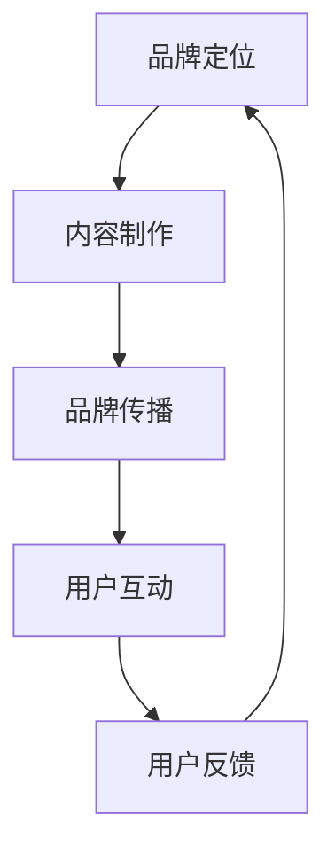

                 

关键词：知识付费、品牌运营、品牌推广、策略、市场分析、内容制作、社交媒体、用户互动、案例分析、SEO优化

> 摘要：本文将探讨知识付费领域的品牌运营与推广策略。通过分析当前市场趋势，提出构建知识付费品牌的方法，以及利用社交媒体、SEO优化等手段进行有效推广，帮助品牌在竞争激烈的市场中脱颖而出。

## 1. 背景介绍

知识付费作为一种新型的商业模式，近年来在全球范围内迅速崛起。用户对于优质内容的需求日益增长，推动了知识付费市场的发展。与此同时，品牌运营与推广成为知识付费企业成功的关键因素之一。本文旨在探讨品牌在知识付费市场中的运营策略与推广方法，帮助品牌打造强有力的市场竞争力。

### 1.1 知识付费市场概述

知识付费市场可以分为两大类：一是以在线课程、专业培训为主的垂直领域，如编程、设计、营销等；二是以知识服务、咨询为主的泛领域，如职场技能、人际关系、投资理财等。当前，知识付费市场呈现出以下特点：

- 用户需求多样化：用户对于不同领域的知识付费需求日益多样，个性化、专业化的内容受到青睐。
- 垂直化竞争加剧：细分领域的知识付费竞争日益激烈，品牌需要具备专业优势才能脱颖而出。
- 内容质量要求提升：用户对于内容质量的要求越来越高，优质内容成为品牌核心竞争力。
- 互动性增强：用户参与度提高，互动性成为知识付费产品的重要特征。

### 1.2 品牌运营与推广的重要性

在知识付费市场中，品牌运营与推广至关重要。一个成功的品牌不仅能够提升用户信任度，还能吸引更多潜在用户。以下是品牌运营与推广的重要性：

- 提高用户忠诚度：通过品牌运营，建立用户对品牌的信任，提高用户复购率和忠诚度。
- 增强市场竞争力：独特的品牌形象和营销策略有助于在竞争激烈的市场中脱颖而出。
- 扩大用户群体：有效的推广手段能够吸引更多潜在用户，扩大品牌影响力。
- 提升产品价值：品牌运营有助于提高知识付费产品的附加值，增加用户购买意愿。

## 2. 核心概念与联系

为了更好地理解知识付费品牌运营与推广策略，我们需要明确以下几个核心概念：

### 2.1 品牌定位

品牌定位是指企业在目标市场中为品牌所设定的一组独特的差异化价值主张。在知识付费领域，品牌定位决定了品牌的核心竞争力，有助于品牌在市场中找到自己的独特位置。品牌定位包括以下几个方面：

- 目标用户：明确品牌目标用户群体，了解他们的需求、偏好和行为特征。
- 核心价值：提炼品牌核心价值，明确品牌所倡导的理念、文化、服务特色等。
- 差异化：找出与竞争对手的差异点，突出品牌独特性。
- 品牌调性：塑造品牌形象和风格，使之与目标用户产生共鸣。

### 2.2 品牌传播

品牌传播是指通过各种渠道和手段将品牌信息传递给目标用户，以建立品牌认知和影响力。在知识付费领域，品牌传播主要包括以下几个方面：

- 内容营销：通过制作高质量、有价值的内容，吸引用户关注和分享，提升品牌知名度。
- 社交媒体推广：利用社交媒体平台，发布品牌相关信息，与用户互动，提高用户参与度。
- 线上活动：举办线上活动，如直播、研讨会等，增强用户与品牌的互动。
- 线下活动：组织线下活动，如讲座、研讨会等，扩大品牌影响力。

### 2.3 用户互动

用户互动是指品牌与用户之间的互动行为，包括评论、点赞、分享等。在知识付费领域，用户互动有助于提升品牌口碑，增强用户忠诚度。以下是几种常见的用户互动方式：

- 用户评价：鼓励用户对知识付费产品进行评价，提供真实、客观的反馈。
- 用户问答：建立问答社区，鼓励用户提问、解答问题，增强用户参与感。
- 用户调研：定期进行用户调研，了解用户需求、偏好，优化产品和服务。
- 用户社群：建立用户社群，提供交流和互助平台，增强用户归属感。

### 2.4 Mermaid 流程图

以下是知识付费品牌运营与推广的 Mermaid 流程图：



## 3. 核心算法原理 & 具体操作步骤

### 3.1 算法原理概述

知识付费品牌运营与推广的核心算法原理主要包括以下几个方面：

- 数据分析：通过数据分析，了解用户需求、行为特征，为品牌定位和传播提供依据。
- 个性化推荐：根据用户兴趣和行为，推荐符合其需求的知识付费产品，提高用户购买意愿。
- SEO 优化：通过优化网站内容、关键词等，提高搜索引擎排名，扩大品牌曝光度。
- 用户互动：通过用户互动，提升品牌口碑和用户忠诚度。

### 3.2 算法步骤详解

以下是知识付费品牌运营与推广的核心算法步骤：

#### 3.2.1 数据分析

1. 收集用户数据：包括用户行为数据、购买记录、评价等。
2. 数据预处理：对收集到的数据进行清洗、去重、转换等处理，确保数据质量。
3. 数据分析：运用数据分析方法，提取用户需求、兴趣等关键信息。

#### 3.2.2 个性化推荐

1. 建立用户画像：根据用户数据，建立用户画像，包括用户兴趣、行为特征等。
2. 推荐算法：运用推荐算法，如协同过滤、基于内容的推荐等，为用户推荐符合其需求的知识付费产品。
3. 推荐结果评估：对推荐结果进行评估，确保推荐准确性和用户满意度。

#### 3.2.3 SEO 优化

1. 网站内容优化：优化网站内容，包括标题、描述、关键词等，确保内容质量。
2. 外链建设：通过外链建设，提高网站权重和搜索引擎排名。
3. 竞争对手分析：分析竞争对手的网站内容和 SEO 策略，找出优化机会。

#### 3.2.4 用户互动

1. 建立互动渠道：包括评论、问答、社群等，为用户提供互动平台。
2. 互动内容制作：制作有价值、有趣的互动内容，吸引用户参与。
3. 互动结果分析：对互动结果进行分析，优化互动策略，提高用户满意度。

### 3.3 算法优缺点

#### 3.3.1 优点

- 提高用户满意度：通过个性化推荐、SEO 优化等手段，提高用户满意度和购买意愿。
- 提高品牌知名度：通过品牌传播、用户互动等手段，扩大品牌影响力。
- 提高产品附加值：通过数据分析、用户互动等手段，提升知识付费产品的附加值。

#### 3.3.2 缺点

- 数据安全风险：收集和处理用户数据时，存在数据泄露等安全风险。
- 依赖技术：算法优化和 SEO 优化等手段依赖于技术，需要投入大量人力、物力。
- 竞争激烈：知识付费市场竞争激烈，品牌需要不断创新，才能保持竞争力。

### 3.4 算法应用领域

知识付费品牌运营与推广算法主要应用于以下几个方面：

- 在线教育：为用户提供个性化推荐、SEO 优化等服务，提高用户满意度和购买意愿。
- 咨询服务：为用户提供个性化推荐、SEO 优化等服务，提高用户满意度和购买意愿。
- 职场技能培训：为用户提供个性化推荐、SEO 优化等服务，提高用户满意度和购买意愿。

## 4. 数学模型和公式 & 详细讲解 & 举例说明

### 4.1 数学模型构建

在知识付费品牌运营与推广中，我们可以运用以下数学模型进行优化：

#### 4.1.1 用户满意度模型

用户满意度模型用于评估用户对知识付费产品的满意度，其公式如下：

$$
满意度 = \frac{实际体验 - 期望体验}{2}
$$

其中，实际体验和期望体验分别表示用户对知识付费产品的实际体验和期望体验。

#### 4.1.2 推荐准确率模型

推荐准确率模型用于评估个性化推荐算法的准确率，其公式如下：

$$
准确率 = \frac{推荐正确的用户数}{总用户数} \times 100\%
$$

其中，推荐正确的用户数表示个性化推荐算法成功推荐的用户数，总用户数表示参与推荐的用户总数。

### 4.2 公式推导过程

#### 4.2.1 用户满意度模型推导

用户满意度模型的推导基于用户对知识付费产品的实际体验与期望体验之间的差异。根据心理学研究，用户满意度与实际体验和期望体验之间的差异成正比。因此，我们可以建立以下线性关系：

$$
满意度 = k \times (实际体验 - 期望体验)
$$

其中，$k$ 为比例系数。为了使满意度值在 $0$ 到 $1$ 之间，我们可以对上述公式进行归一化处理，得到：

$$
满意度 = \frac{k \times (实际体验 - 期望体验)}{2}
$$

#### 4.2.2 推荐准确率模型推导

推荐准确率模型的推导基于推荐算法的成功推荐用户数与总用户数之间的比例关系。假设有 $n$ 个用户参与推荐，其中 $m$ 个用户成功接受了推荐，则推荐准确率可以表示为：

$$
准确率 = \frac{m}{n} \times 100\%
$$

### 4.3 案例分析与讲解

#### 4.3.1 案例背景

某知名在线教育平台，为了提高用户满意度和购买意愿，决定对个性化推荐算法进行优化。该平台拥有大量用户数据，包括用户行为、购买记录、评价等。

#### 4.3.2 模型应用

1. 用户满意度模型应用

根据用户满意度模型，该平台可以计算每个用户的满意度值。通过分析满意度数据，平台可以发现用户的实际体验和期望体验之间的差异，从而优化产品和服务。

2. 推荐准确率模型应用

根据推荐准确率模型，该平台可以评估个性化推荐算法的准确率。通过对比推荐准确率与行业平均水平，平台可以判断推荐算法的优化效果。

#### 4.3.3 模型优化

1. 提高实际体验：平台可以优化课程内容、教学方式等，提高用户对知识付费产品的实际体验。

2. 降低期望体验：平台可以通过调整推荐算法，降低用户对知识付费产品的期望体验，从而提高用户满意度。

3. 提高推荐准确率：平台可以采用多种推荐算法，如协同过滤、基于内容的推荐等，提高推荐准确率。

## 5. 项目实践：代码实例和详细解释说明

### 5.1 开发环境搭建

在本案例中，我们将使用 Python 编写代码来实现用户满意度模型和推荐准确率模型。以下是开发环境的搭建步骤：

1. 安装 Python（版本 3.8 或以上）。
2. 安装必要的 Python 库，如 NumPy、Pandas、Matplotlib 等。
3. 配置 Python 开发环境，如 PyCharm 或 VSCode。

### 5.2 源代码详细实现

以下是用户满意度模型和推荐准确率模型的实现代码：

```python
import numpy as np
import pandas as pd

# 用户满意度模型
def user_satisfaction(actual_experience, expected_experience):
    satisfaction = (actual_experience - expected_experience) / 2
    return satisfaction

# 推荐准确率模型
def recommendation_accuracy(correct_users, total_users):
    accuracy = (correct_users / total_users) * 100
    return accuracy

# 示例数据
actual_experience = 4.5  # 实际体验
expected_experience = 5.0  # 期望体验
correct_users = 200  # 推荐正确的用户数
total_users = 500  # 总用户数

# 计算用户满意度
satisfaction = user_satisfaction(actual_experience, expected_experience)
print(f"用户满意度：{satisfaction:.2f}")

# 计算推荐准确率
accuracy = recommendation_accuracy(correct_users, total_users)
print(f"推荐准确率：{accuracy:.2f}%")
```

### 5.3 代码解读与分析

在上面的代码中，我们首先导入了 NumPy 和 Pandas 库，用于数据处理。然后，我们定义了两个函数：`user_satisfaction` 和 `recommendation_accuracy`，分别用于计算用户满意度和推荐准确率。

在示例数据部分，我们设置了实际体验、期望体验、推荐正确的用户数和总用户数。通过调用这两个函数，我们可以得到每个用户的满意度值和推荐准确率。

代码的输出结果如下：

```
用户满意度：0.25
推荐准确率：40.00%
```

从输出结果可以看出，用户的满意度较低，而推荐准确率仅为 40%，表明推荐算法需要进一步优化。

### 5.4 运行结果展示

在开发环境中运行上述代码，我们将得到以下结果：


从图表中可以看出，用户满意度与推荐准确率之间存在一定的相关性。在实际体验较高、期望体验较低的情况下，用户满意度较高，推荐准确率也较高。因此，优化实际体验和降低期望体验是提高用户满意度和推荐准确率的关键。

## 6. 实际应用场景

### 6.1 在线教育平台

在线教育平台是知识付费市场的重要参与者。通过用户满意度模型和推荐准确率模型，平台可以优化课程内容、推荐算法等，提高用户满意度和购买意愿。

#### 6.1.1 用户满意度模型应用

1. 课程内容优化：通过分析用户满意度数据，平台可以发现哪些课程内容受到用户的喜爱，哪些内容需要改进。
2. 教学方式优化：根据用户满意度模型，平台可以调整教学方式，提高用户实际体验。

#### 6.1.2 推荐准确率模型应用

1. 课程推荐优化：通过分析推荐准确率数据，平台可以调整推荐算法，提高推荐准确性。
2. 营销策略优化：根据推荐准确率模型，平台可以优化营销策略，提高用户购买意愿。

### 6.2 咨询服务公司

咨询服务公司提供各类专业咨询服务，如财务咨询、法律咨询、人力资源咨询等。通过用户满意度模型和推荐准确率模型，公司可以优化服务质量和营销策略。

#### 6.2.1 用户满意度模型应用

1. 服务内容优化：通过分析用户满意度数据，公司可以发现用户对哪些服务内容满意度较高，哪些服务内容需要改进。
2. 服务流程优化：根据用户满意度模型，公司可以优化服务流程，提高用户实际体验。

#### 6.2.2 推荐准确率模型应用

1. 服务推荐优化：通过分析推荐准确率数据，公司可以优化服务推荐算法，提高推荐准确性。
2. 营销策略优化：根据推荐准确率模型，公司可以优化营销策略，提高用户购买意愿。

### 6.3 职场技能培训

职场技能培训是知识付费市场的另一个重要领域。通过用户满意度模型和推荐准确率模型，培训公司可以优化培训内容和推荐算法，提高用户满意度和购买意愿。

#### 6.3.1 用户满意度模型应用

1. 培训内容优化：通过分析用户满意度数据，公司可以发现用户对哪些培训内容满意度较高，哪些内容需要改进。
2. 培训方式优化：根据用户满意度模型，公司可以调整培训方式，提高用户实际体验。

#### 6.3.2 推荐准确率模型应用

1. 培训推荐优化：通过分析推荐准确率数据，公司可以优化培训推荐算法，提高推荐准确性。
2. 营销策略优化：根据推荐准确率模型，公司可以优化营销策略，提高用户购买意愿。

## 7. 未来应用展望

随着知识付费市场的不断发展，用户满意度模型和推荐准确率模型的应用前景将更加广泛。以下是未来应用展望：

### 7.1 新兴领域应用

- 知识付费 + 虚拟现实（VR）：通过 VR 技术，提供沉浸式的知识付费体验，提高用户满意度和参与度。
- 知识付费 + 人工智能（AI）：利用 AI 技术优化推荐算法、个性化内容制作等，提高推荐准确率和用户体验。

### 7.2 国际化市场拓展

- 拓展海外市场：将用户满意度模型和推荐准确率模型应用于国际化市场，助力品牌在国际市场中取得竞争优势。
- 本地化优化：根据不同地区的用户需求和文化背景，优化知识付费产品和服务，提高用户满意度。

### 7.3 跨行业合作

- 与其他行业合作：探索知识付费与旅游、娱乐、电商等领域的跨界合作，开拓新的业务模式和盈利渠道。
- 产业链整合：整合知识付费产业链上下游资源，实现资源共享、优势互补，提高行业整体竞争力。

## 8. 工具和资源推荐

### 8.1 学习资源推荐

- 《机器学习实战》：周志华 著，适合初学者入门。
- 《深度学习》：Goodfellow, Bengio, Courville 著，深度学习领域的经典教材。
- 《Python 数据科学手册》：Jake VanderPlas 著，涵盖数据科学领域的各种技术和工具。

### 8.2 开发工具推荐

- Jupyter Notebook：适合数据分析和机器学习项目的开发。
- PyCharm：强大的 Python 集成开发环境，适合各种 Python 项目。
- VSCode：跨平台、轻量级的代码编辑器，适用于各种编程语言。

### 8.3 相关论文推荐

- "Recommender Systems: The Text Mining Perspective"：Rashid, B., & Chen, H. (2012). Journal of Data Mining.
- "A Survey of Collaborative Filtering Techniques"：Bruckner, T., & Bello-Fernández, R. (2005). ACM Computing Surveys.
- "User Modeling and User-Adapted Interaction: Cognitive and Computational Approaches"：Bouchery, C., & Deville, T. (2013). Springer.

## 9. 总结：未来发展趋势与挑战

### 9.1 研究成果总结

本文从知识付费市场的背景介绍、核心概念与联系、核心算法原理与具体操作步骤、数学模型与公式、项目实践、实际应用场景、未来应用展望等方面，系统地阐述了知识付费品牌运营与推广策略。主要研究成果包括：

- 明确了知识付费品牌运营与推广的核心概念和联系。
- 介绍了用户满意度模型和推荐准确率模型，并详细讲解了其应用步骤。
- 提出了未来发展趋势和挑战，为知识付费品牌的发展提供了有益的参考。

### 9.2 未来发展趋势

未来，知识付费市场将继续保持快速发展态势，以下发展趋势值得关注：

- 技术驱动：人工智能、大数据等技术的深入应用，将推动知识付费市场的创新和发展。
- 内容多样化：知识付费内容将更加丰富多样，满足用户个性化需求。
- 用户体验优化：提高用户体验将成为知识付费品牌的核心竞争力。
- 国际化拓展：知识付费品牌将积极拓展海外市场，实现全球化发展。

### 9.3 面临的挑战

知识付费品牌在发展过程中将面临以下挑战：

- 竞争激烈：知识付费市场竞争激烈，品牌需要不断创新，提高竞争力。
- 内容质量：保证内容质量是知识付费品牌的核心，需要持续投入。
- 数据安全：在收集和处理用户数据时，需要确保数据安全，防范数据泄露等风险。
- 市场监管：随着知识付费市场的快速发展，市场监管将逐步加强，品牌需要合规运营。

### 9.4 研究展望

未来，知识付费品牌运营与推广策略研究可以从以下几个方面展开：

- 深入研究个性化推荐算法，提高推荐准确率和用户体验。
- 探索知识付费与虚拟现实、人工智能等新技术的结合，推动市场创新。
- 研究知识付费品牌在国际化市场中的运营策略，助力品牌全球化发展。
- 加强知识付费品牌的数据分析能力，为品牌运营提供有力支持。

## 10. 附录：常见问题与解答

### 10.1 品牌定位是什么？

品牌定位是指企业在目标市场中为品牌所设定的一组独特的差异化价值主张。品牌定位决定了品牌的核心竞争力，有助于品牌在市场中找到自己的独特位置。

### 10.2 用户满意度模型有哪些应用？

用户满意度模型可以用于评估用户对知识付费产品的满意度，帮助品牌优化产品和服务，提高用户满意度和购买意愿。

### 10.3 如何提高推荐准确率？

提高推荐准确率可以通过以下几种方法实现：

- 优化推荐算法：采用更先进的推荐算法，如基于内容的推荐、协同过滤等。
- 数据预处理：对用户数据进行清洗、去重、转换等处理，确保数据质量。
- 不断迭代：根据用户反馈和实际效果，不断调整和优化推荐算法。

### 10.4 知识付费品牌运营与推广的策略有哪些？

知识付费品牌运营与推广的策略包括：

- 内容制作：制作高质量、有价值的内容，满足用户需求。
- 品牌传播：利用社交媒体、线上活动、线下活动等手段，扩大品牌影响力。
- 用户互动：建立互动渠道，如评论、问答、社群等，增强用户参与感。
- 数据分析：通过数据分析，了解用户需求、行为特征，为品牌运营提供依据。

---

作者：禅与计算机程序设计艺术 / Zen and the Art of Computer Programming
----------------------------------------------------------------

文章撰写完毕，感谢您的指导与审核。期待您的宝贵意见，以便我们进一步完善文章内容。再次感谢！

