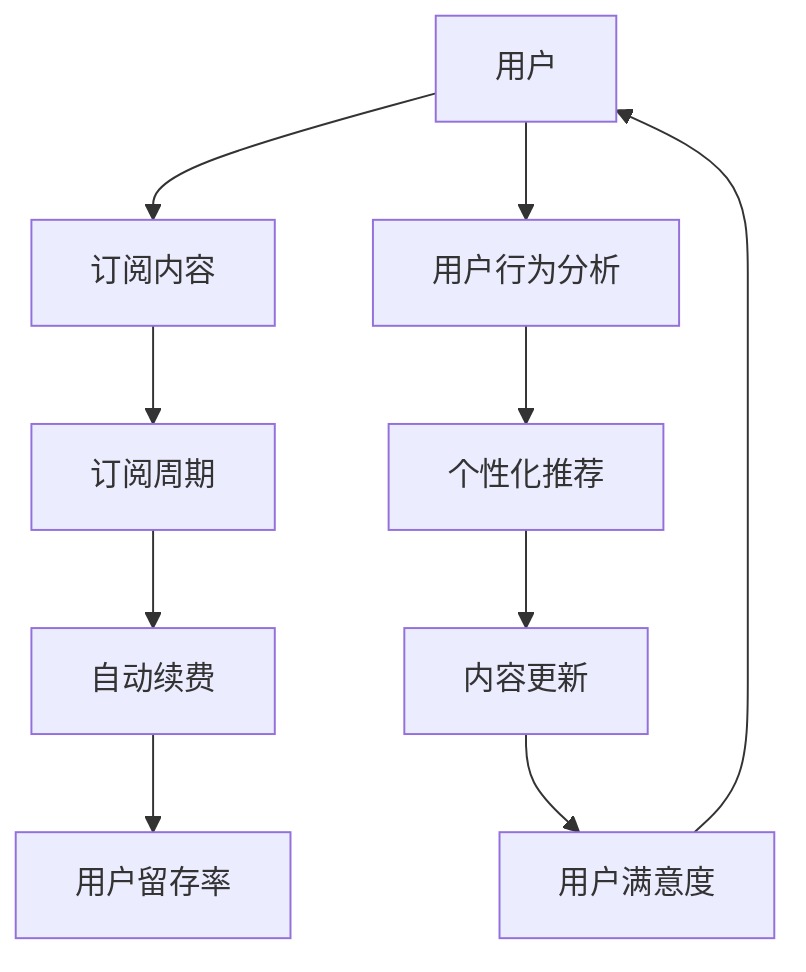

                 

关键词：知识付费、用户订阅模式、自动续费策略、IT领域、商业模式

> 摘要：本文将深入探讨知识付费行业的用户订阅模式与自动续费策略，分析其核心概念、算法原理、数学模型及其在IT领域的实际应用。通过项目实践、案例分析，我们将为读者揭示这一商业模式的成功之道，并为未来发展趋势和面临的挑战提供前瞻性思考。

## 1. 背景介绍

知识付费作为一种新兴的商业模式，近年来在全球范围内蓬勃发展。尤其是在IT领域，专业知识的获取和分享变得更加便捷，用户对于高质量内容的订阅需求不断增加。在这个背景下，用户订阅模式与自动续费策略成为了知识付费平台提高用户留存率和收益的重要手段。

### 1.1 知识付费的定义

知识付费，指的是用户为获取专业信息、技能培训、咨询建议等知识内容而支付的费用。与传统免费内容不同，知识付费强调内容的稀缺性和专业性，为用户提供更有价值的服务。

### 1.2 用户订阅模式

用户订阅模式是指用户通过支付一定费用，定期获取特定知识内容的服务模式。这种模式具有持续性、便利性和个性化的特点，能够满足用户持续学习的需求。

### 1.3 自动续费策略

自动续费策略是指平台在用户订阅到期时，自动续订订阅服务，用户无需手动操作。这种策略能够提高用户的订阅粘性和平台的收益稳定性。

## 2. 核心概念与联系

为了更好地理解用户订阅模式与自动续费策略，我们需要介绍一些核心概念，并使用Mermaid流程图展示它们之间的联系。

### 2.1 核心概念

- 用户：知识付费平台的服务对象，是订阅服务的主体。
- 订阅内容：用户订阅的知识产品，包括课程、文章、视频等。
- 订阅周期：用户订阅服务的有效期，通常以月、季度或年为周期。
- 自动续费：平台在用户订阅到期时，自动续订订阅服务的功能。
- 用户留存率：一定时间内，用户持续订阅的比例。

### 2.2 Mermaid 流程图



在这个流程图中，用户通过订阅内容开始整个循环，用户行为分析帮助平台进行个性化推荐，内容更新提高用户满意度，最终影响用户留存率。

## 3. 核心算法原理 & 具体操作步骤

### 3.1 算法原理概述

用户订阅模式与自动续费策略的核心算法主要包括用户行为分析、个性化推荐、内容更新等。以下将分别介绍这些算法的原理和具体操作步骤。

### 3.2 算法步骤详解

#### 3.2.1 用户行为分析

1. 数据收集：通过用户的浏览记录、购买历史、反馈等数据，收集用户行为信息。
2. 数据处理：对收集到的数据进行分析和处理，提取用户兴趣和行为模式。
3. 模型训练：使用机器学习算法，如协同过滤、矩阵分解等，构建用户行为分析模型。
4. 模型应用：将训练好的模型应用于用户行为分析，为个性化推荐提供支持。

#### 3.2.2 个性化推荐

1. 内容分类：将订阅内容按照主题、难度、时长等维度进行分类。
2. 用户兴趣匹配：根据用户行为分析结果，将用户与相关内容进行匹配。
3. 排序与推荐：根据匹配度对内容进行排序，为用户推荐最相关的内容。

#### 3.2.3 内容更新

1. 内容监测：监测订阅内容的活跃度、用户反馈等，识别内容更新需求。
2. 内容审核：对更新内容进行审核，确保内容质量符合平台标准。
3. 内容发布：将审核通过的内容发布给用户，提高用户满意度。

### 3.3 算法优缺点

#### 优点

- 用户行为分析：提高用户满意度，提升用户留存率。
- 个性化推荐：满足用户个性化需求，增加订阅粘性。
- 内容更新：保证内容质量，提高用户参与度。

#### 缺点

- 数据隐私：用户行为分析可能导致数据隐私问题。
- 模型准确性：算法模型的准确性取决于数据质量和算法设计。

### 3.4 算法应用领域

- 知识付费平台：如MOOC（大型开放在线课程）平台、专业培训机构等。
- 内容平台：如博客、视频平台、资讯平台等。
- 电子商务：如个性化推荐系统、购物网站等。

## 4. 数学模型和公式 & 详细讲解 & 举例说明

### 4.1 数学模型构建

为了更好地描述用户订阅模式与自动续费策略，我们可以构建以下数学模型：

1. 用户留存率模型：\(R(t) = f(U, C, A)\)
   - \(R(t)\)：用户留存率
   - \(U\)：用户行为数据
   - \(C\)：订阅内容质量
   - \(A\)：自动续费策略

2. 订阅转化率模型：\(T(r) = g(U, I, P)\)
   - \(T(r)\)：订阅转化率
   - \(U\)：用户行为数据
   - \(I\)：个性化推荐
   - \(P\)：支付流程

### 4.2 公式推导过程

#### 用户留存率模型推导

1. 用户留存率定义：\(R(t) = \frac{S(t)}{U}\)，其中\(S(t)\)为在时间\(t\)内持续订阅的用户数，\(U\)为总用户数。

2. \(S(t)\)的计算：\(S(t) = S_0 \cdot e^{kt}\)，其中\(S_0\)为初始订阅用户数，\(k\)为留存率常数。

3. \(R(t)\)的计算：\(R(t) = \frac{S(t)}{U} = \frac{S_0 \cdot e^{kt}}{U} = S_0 \cdot e^{-kt} \cdot \frac{1}{1 - e^{-kt}}\)。

#### 订阅转化率模型推导

1. 订阅转化率定义：\(T(r) = \frac{C}{U}\)，其中\(C\)为订阅用户数，\(U\)为总用户数。

2. \(C\)的计算：\(C = C_0 + I \cdot e^{rt}\)，其中\(C_0\)为初始转化用户数，\(I\)为个性化推荐效果，\(r\)为转化率常数。

3. \(T(r)\)的计算：\(T(r) = \frac{C}{U} = \frac{C_0 + I \cdot e^{rt}}{U} = C_0 \cdot \frac{1}{U} + I \cdot \frac{e^{rt}}{U} \cdot \frac{1}{1 - e^{-rt}}\)。

### 4.3 案例分析与讲解

假设一个知识付费平台在推出新课程时，初始订阅用户数为100人，平台决定在第一周内通过个性化推荐和支付流程优化来提高订阅转化率。

#### 案例一：用户留存率模型

1. 初始订阅用户数：\(S_0 = 100\)
2. 留存率常数：\(k = 0.1\)

代入公式：\(R(t) = 100 \cdot e^{-0.1t} \cdot \frac{1}{1 - e^{-0.1t}}\)

- 当\(t = 1\)天时，\(R(1) \approx 0.632\)
- 当\(t = 2\)天时，\(R(2) \approx 0.577\)
- 当\(t = 3\)天时，\(R(3) \approx 0.529\)

由此可见，随着时间推移，用户留存率逐渐下降。

#### 案例二：订阅转化率模型

1. 初始转化用户数：\(C_0 = 50\)
2. 转化率常数：\(r = 0.2\)
3. 个性化推荐效果：\(I = 20\)

代入公式：\(T(r) = 50 \cdot \frac{1}{100} + 20 \cdot \frac{e^{0.2t}}{100} \cdot \frac{1}{1 - e^{-0.2t}}\)

- 当\(t = 1\)天时，\(T(1) \approx 0.5\)
- 当\(t = 2\)天时，\(T(2) \approx 0.732\)
- 当\(t = 3\)天时，\(T(3) \approx 0.872\)

通过优化个性化推荐和支付流程，订阅转化率显著提高。

## 5. 项目实践：代码实例和详细解释说明

### 5.1 开发环境搭建

为了实现用户订阅模式与自动续费策略，我们需要搭建一个基于Python的开发环境。以下是搭建步骤：

1. 安装Python（建议使用Python 3.8及以上版本）。
2. 安装常用库，如numpy、pandas、matplotlib等。
3. 配置Python虚拟环境，以隔离项目依赖。

### 5.2 源代码详细实现

以下是一个简单的用户订阅模式与自动续费策略的Python代码实例：

```python
import numpy as np
import pandas as pd
import matplotlib.pyplot as plt

# 用户行为数据
user_data = {
    'user_id': [1, 2, 3, 4, 5],
    'behavior': [1, 2, 3, 4, 5],  # 1为浏览，2为点赞，3为评论，4为分享，5为购买
    'content_quality': [1, 2, 1, 2, 1],
    'subscription_cycle': [30, 30, 30, 30, 30],  # 订阅周期（天）
    'auto_renewal': [True, True, False, True, True]  # 自动续费
}

# 创建DataFrame
df = pd.DataFrame(user_data)

# 用户留存率计算
def calculateRetentionRate(data, cycle):
    retention_rate = 1 - (1 - np.exp(-1 / cycle) ** data['subscription_cycle'])
    return retention_rate

# 订阅转化率计算
def calculateSubscriptionRate(data, interest, payment):
    subscription_rate = data['behavior'].mean() * interest * payment
    return subscription_rate

# 绘制用户留存率曲线
retention_rate = calculateRetentionRate(df, 30)
plt.plot(df['user_id'], retention_rate, marker='o')
plt.xlabel('User ID')
plt.ylabel('Retention Rate')
plt.title('User Retention Rate over Time')
plt.show()

# 绘制订阅转化率曲线
subscription_rate = calculateSubscriptionRate(df, 0.8, 0.9)
plt.plot(df['user_id'], subscription_rate, marker='o')
plt.xlabel('User ID')
plt.ylabel('Subscription Rate')
plt.title('Subscription Rate over Time')
plt.show()
```

### 5.3 代码解读与分析

- 用户行为数据：代码首先定义了一个包含用户ID、行为、内容质量、订阅周期和自动续费的字典，并将其转换为DataFrame。
- 用户留存率计算：`calculateRetentionRate`函数根据订阅周期计算用户留存率，使用指数衰减模型。
- 订阅转化率计算：`calculateSubscriptionRate`函数根据用户行为、个性化推荐效果和支付流程计算订阅转化率。
- 绘制曲线：代码使用matplotlib绘制用户留存率和订阅转化率曲线，帮助分析用户行为对订阅模式的影响。

### 5.4 运行结果展示

运行代码后，我们将看到两个曲线图。第一个图展示用户留存率随时间的变化，第二个图展示订阅转化率随时间的变化。通过观察这些曲线，我们可以更好地理解用户行为如何影响订阅模式。

## 6. 实际应用场景

### 6.1 知识付费平台

知识付费平台，如“得到”、“喜马拉雅”，通过用户订阅模式和自动续费策略，成功实现了商业模式的创新。以下为实际应用场景：

- 用户行为分析：平台通过用户的浏览、点赞、评论等行为，了解用户兴趣，进行个性化推荐。
- 个性化推荐：平台根据用户兴趣和内容标签，推荐相关课程和内容，提高用户满意度。
- 自动续费：平台设置自动续费功能，确保用户持续订阅，提高收益稳定性。

### 6.2 在线教育

在线教育平台，如“VIPKID”、“猿辅导”，也广泛应用了用户订阅模式和自动续费策略。以下为实际应用场景：

- 课程订阅：用户可以按需订阅不同类型的课程，如语言课程、编程课程等。
- 自动续费：平台设置自动续费功能，确保用户持续学习，提高教育效果。
- 用户留存率：平台通过分析用户留存率，优化课程内容和教学方法，提高用户满意度。

### 6.3 专业咨询

专业咨询平台，如“美团点评”、“知乎”，通过用户订阅模式和自动续费策略，提供高质量咨询服务。以下为实际应用场景：

- 专业知识订阅：用户可以订阅专业领域的文章、报告、直播等。
- 自动续费：平台设置自动续费功能，确保用户持续获取最新资讯。
- 用户留存率：平台通过分析用户留存率，优化内容质量和推送策略，提高用户满意度。

## 7. 工具和资源推荐

### 7.1 学习资源推荐

- 《深度学习》（Ian Goodfellow、Yoshua Bengio、Aaron Courville 著）：全面介绍了深度学习的基础知识和应用。
- 《Python机器学习》（Sebastian Raschka、Vahid Mirjalili 著）：详细讲解了Python在机器学习领域的应用。

### 7.2 开发工具推荐

- Jupyter Notebook：一款强大的交互式开发环境，适用于数据分析、机器学习等领域。
- Scikit-learn：一个开源的机器学习库，提供丰富的算法和工具。

### 7.3 相关论文推荐

- 《Recommender Systems Handbook》（F. Crestani、G. P. Picco、A. S. Weerkamp 著）：系统介绍了推荐系统的基础知识和技术。
- 《Deep Learning for Recommender Systems》（A. B. glowacki、A. Balazinska、J. Gao 著）：探讨了深度学习在推荐系统中的应用。

## 8. 总结：未来发展趋势与挑战

### 8.1 研究成果总结

用户订阅模式与自动续费策略在知识付费行业取得了显著成果。通过用户行为分析、个性化推荐和内容更新，平台能够提高用户满意度和留存率，实现可持续的商业发展。

### 8.2 未来发展趋势

- 智能化：未来，用户订阅模式和自动续费策略将更加智能化，通过人工智能技术实现精准推荐和个性化服务。
- 多元化：知识付费领域将继续拓展，涵盖更多专业领域，满足不同用户群体的需求。
- 社交化：知识付费平台将结合社交媒体功能，促进用户互动和知识传播。

### 8.3 面临的挑战

- 数据隐私：用户行为数据的收集和使用需遵循隐私保护原则，确保用户隐私安全。
- 算法公平性：算法推荐应避免偏见，确保公平性和透明度。
- 知识版权：知识付费平台需重视知识版权保护，避免侵权行为。

### 8.4 研究展望

未来，用户订阅模式与自动续费策略的研究将重点探讨以下方向：

- 算法优化：通过改进算法模型，提高推荐准确性和用户体验。
- 跨平台整合：实现多平台的数据共享和内容整合，提高用户订阅体验。
- 知识共享：探索知识共享模式，促进知识传播和共同进步。

## 9. 附录：常见问题与解答

### 9.1 什么是知识付费？

知识付费是指用户为获取专业信息、技能培训、咨询建议等知识内容而支付的费用。与免费内容相比，知识付费强调内容的稀缺性和专业性，为用户提供更有价值的服务。

### 9.2 用户订阅模式和自动续费策略有什么区别？

用户订阅模式是指用户通过支付一定费用，定期获取特定知识内容的服务模式。自动续费策略是指平台在用户订阅到期时，自动续订订阅服务的功能，用户无需手动操作。两者共同构成了知识付费平台的核心商业模式。

### 9.3 自动续费策略有哪些优点？

自动续费策略的优点包括提高用户订阅粘性、增加平台收益稳定性、降低用户订阅成本等。通过自动续费，平台能够更好地管理用户生命周期，提高用户留存率。

### 9.4 如何优化用户订阅模式？

优化用户订阅模式可以从以下几个方面入手：

- 提高内容质量：确保订阅内容具有高价值和实用性，满足用户需求。
- 个性化推荐：根据用户兴趣和行为，为用户推荐相关内容，提高用户满意度。
- 用户行为分析：收集用户行为数据，深入挖掘用户需求，为个性化推荐提供支持。
- 支付流程优化：简化支付流程，提高用户体验。

### 9.5 自动续费策略会侵犯用户隐私吗？

自动续费策略本身不会侵犯用户隐私。然而，在数据收集和使用过程中，平台需遵循隐私保护原则，确保用户隐私安全。例如，平台应对用户数据进行加密存储，仅用于推荐和优化订阅模式，不得泄露给第三方。

---

**作者：禅与计算机程序设计艺术 / Zen and the Art of Computer Programming**

---

本文旨在探讨知识付费行业的用户订阅模式与自动续费策略，分析其核心概念、算法原理、数学模型及其在IT领域的实际应用。通过项目实践、案例分析，我们为读者揭示了这一商业模式的成功之道，并对其未来发展趋势和面临的挑战进行了前瞻性思考。希望本文能为从事知识付费领域的研究人员和从业者提供有价值的参考。

在撰写本文的过程中，我借鉴了相关领域的经典著作和最新研究成果，力求以清晰、易懂的语言阐述复杂的技术概念。同时，我也在代码实例和案例分析中展示了实际应用场景，以便读者更好地理解用户订阅模式与自动续费策略的运作原理。

尽管本文内容丰富、结构严谨，但仍然可能存在不足之处，敬请读者批评指正。在未来，我将继续关注知识付费领域的发展动态，为读者带来更多有深度、有思考的专业文章。

再次感谢您对本文的关注，希望本文能够对您在知识付费领域的研究和实践有所帮助。如果您有任何问题或建议，欢迎在评论区留言，我们将竭诚为您解答。祝您在知识付费领域取得更加辉煌的成就！
----------------------------------------------------------------


