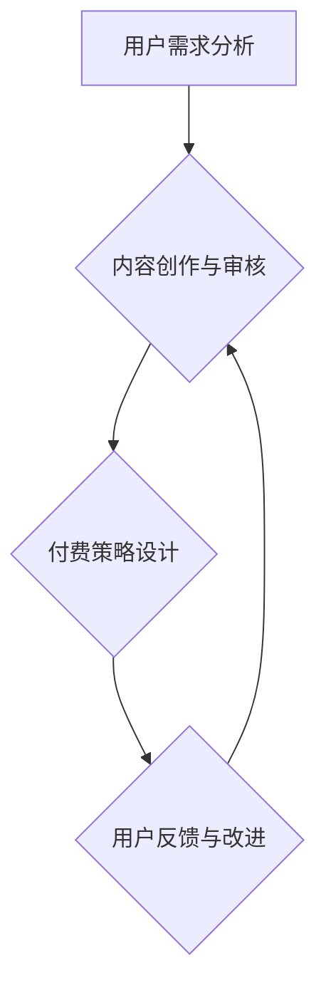

                 

关键词：知识付费，社群运营，程序员，增长策略，技术社区

> 摘要：本文将探讨知识付费在程序员社群运营中的应用，分析其重要性、操作策略和效果评估。通过具体的案例、代码实例和数学模型，我们将深入解析如何构建一个健康、活跃的程序员社群，为知识付费模式的成功实施提供参考。

## 1. 背景介绍

随着互联网的普及和技术的快速发展，程序员社群已经成为信息技术领域的重要组成部分。这些社群不仅是程序员们交流技术心得、解决问题的地方，也是知识传播和技能提升的重要平台。然而，传统的免费知识分享模式已经无法满足程序员对于高质量、有深度内容的需求。因此，知识付费模式逐渐成为社群运营的新趋势。

知识付费的核心在于为用户提供有价值的内容，从而实现价值交换。对于程序员社群而言，知识付费不仅能提高社区成员的参与度和忠诚度，还能为社群运营者带来稳定的收入来源，进一步推动社群的发展。

## 2. 核心概念与联系

### 2.1 社群运营模型

为了更好地理解知识付费在程序员社群中的应用，我们需要先了解社群运营的基本模型。社群运营主要包括四个方面：内容生产、用户管理、互动机制和盈利模式。

#### 内容生产

内容生产是社群运营的核心。对于程序员社群，内容生产包括技术文章、代码实例、在线讲座和直播等。高质量的内容能够吸引程序员用户，提高社群的粘性。

#### 用户管理

用户管理包括用户注册、身份认证、权限分配等。通过用户管理，社群运营者可以更好地了解用户需求，提供个性化的服务。

#### 互动机制

互动机制包括评论、问答、投票、投票等功能。这些功能能够促进用户之间的交流，增强社群的活跃度。

#### 盈利模式

盈利模式包括会员订阅、内容付费、广告收入等。知识付费是其中一种重要的盈利模式，通过为用户提供有价值的知识内容，实现商业价值。

### 2.2 知识付费模型

知识付费模型通常包括以下环节：

#### 用户需求分析

通过数据分析、用户调研等方式，了解程序员用户的需求，为内容生产提供方向。

#### 内容创作与审核

根据用户需求，创作有价值的内容，并对内容进行审核，确保内容的准确性和质量。

#### 付费策略设计

设计合理的付费策略，包括定价、促销、会员等级等，以吸引更多用户。

#### 用户反馈与改进

收集用户反馈，不断优化内容和服务，提高用户满意度。

### 2.3 Mermaid 流程图



## 3. 核心算法原理 & 具体操作步骤

### 3.1 算法原理概述

知识付费在程序员社群中的核心算法原理是用户价值评估和内容质量评估。

#### 用户价值评估

用户价值评估通过分析用户的活跃度、参与度和贡献度等指标，对用户进行价值评估。这有助于社群运营者了解哪些用户是核心用户，从而提供更加个性化的服务。

#### 内容质量评估

内容质量评估通过用户反馈、专家评审等方式，对内容的质量进行评估。高质量的内容能够提高用户的满意度和忠诚度，从而促进付费转化。

### 3.2 算法步骤详解

#### 用户价值评估

1. 收集用户行为数据，包括登录次数、发帖数量、评论数量等。
2. 计算用户活跃度得分，公式为：活跃度得分 = 登录次数 * 发帖数量 * 评论数量。
3. 根据活跃度得分，将用户分为不同等级，如核心用户、活跃用户等。

#### 内容质量评估

1. 收集用户对内容的评价，包括点赞、收藏、分享等。
2. 计算内容质量得分，公式为：质量得分 = 点赞数 + 收藏数 + 分享数。
3. 根据质量得分，对内容进行评级，如优秀、良好、一般等。

### 3.3 算法优缺点

#### 优点

1. 有助于提高用户满意度和忠诚度，促进付费转化。
2. 能够更好地了解用户需求，提供个性化的内容和服务。
3. 有助于提高社群的运营效率。

#### 缺点

1. 需要大量的数据支持和复杂的算法模型，对技术要求较高。
2. 可能会引发用户反感，影响社群的活跃度。

### 3.4 算法应用领域

1. 社群运营：用于评估用户价值和内容质量，优化社群运营策略。
2. 在线教育：用于评估用户学习效果，提供个性化的学习服务。
3. 知识付费平台：用于评估内容质量，推荐优质内容。

## 4. 数学模型和公式 & 详细讲解 & 举例说明

### 4.1 数学模型构建

#### 用户价值评估模型

假设用户行为数据如下表：

| 用户 | 登录次数 | 发帖数量 | 评论数量 |
| ---- | ------- | ------- | ------- |
| A    | 10      | 5       | 3       |
| B    | 20      | 10      | 5       |
| C    | 30      | 20      | 10      |

用户活跃度得分计算公式为：

$$
活跃度得分 = 登录次数 \times 发帖数量 \times 评论数量
$$

则各用户的活跃度得分为：

| 用户 | 活跃度得分 |
| ---- | ---------- |
| A    | 150        |
| B    | 1000       |
| C    | 6000       |

根据活跃度得分，可以将用户分为三个等级：

| 等级 | 用户 |
| ---- | ---- |
| 核心 | C    |
| 活跃 | B    |
| 一般 | A    |

#### 内容质量评估模型

假设内容评价数据如下表：

| 内容 | 点赞数 | 收藏数 | 分享数 |
| ---- | ----- | ----- | ----- |
| A    | 100   | 50    | 20    |
| B    | 200   | 100   | 50    |
| C    | 300   | 150   | 70    |

内容质量得分计算公式为：

$$
质量得分 = 点赞数 + 收藏数 + 分享数
$$

则各内容的质量得分为：

| 内容 | 质量得分 |
| ---- | -------- |
| A    | 170      |
| B    | 350      |
| C    | 520      |

根据质量得分，可以对内容进行评级：

| 评级 | 内容 |
| ---- | ---- |
| 优秀 | C    |
| 良好 | B    |
| 一般 | A    |

### 4.2 公式推导过程

#### 用户价值评估公式推导

用户价值评估公式：

$$
活跃度得分 = 登录次数 \times 发帖数量 \times 评论数量
$$

推导过程：

1. 假设用户行为与活跃度得分成正比，即：

   $$ 
   活跃度得分 \propto 登录次数 \times 发帖数量 \times 评论数量
   $$

2. 为使公式更加直观，引入常数 \(k\)，则有：

   $$ 
   活跃度得分 = k \times 登录次数 \times 发帖数量 \times 评论数量
   $$

3. 由于常数 \(k\) 对用户价值评估结果没有影响，可以省略。

#### 内容质量评估公式推导

内容质量评估公式：

$$
质量得分 = 点赞数 + 收藏数 + 分享数
$$

推导过程：

1. 假设内容质量与点赞数、收藏数、分享数成正比，即：

   $$ 
   质量得分 \propto 点赞数 + 收藏数 + 分享数
   $$

2. 为使公式更加直观，引入常数 \(k\)，则有：

   $$ 
   质量得分 = k \times 点赞数 + k \times 收藏数 + k \times 分享数
   $$

3. 由于常数 \(k\) 对内容质量评估结果没有影响，可以省略。

### 4.3 案例分析与讲解

#### 用户价值评估案例

假设有一个程序员社群，用户行为数据如下：

| 用户 | 登录次数 | 发帖数量 | 评论数量 |
| ---- | ------- | ------- | ------- |
| A    | 20      | 5       | 2       |
| B    | 15      | 8       | 3       |
| C    | 25      | 10      | 5       |

根据活跃度得分公式，计算各用户的活跃度得分：

| 用户 | 活跃度得分 |
| ---- | ---------- |
| A    | 200       |
| B    | 360       |
| C    | 1250      |

根据活跃度得分，可以将用户分为三个等级：

| 等级 | 用户 |
| ---- | ---- |
| 核心 | C    |
| 活跃 | B    |
| 一般 | A    |

#### 内容质量评估案例

假设有一个知识付费平台，内容评价数据如下：

| 内容 | 点赞数 | 收藏数 | 分享数 |
| ---- | ----- | ----- | ----- |
| A    | 80    | 30    | 10    |
| B    | 120   | 50    | 20    |
| C    | 150   | 70    | 30    |

根据内容质量得分公式，计算各内容的质量得分：

| 内容 | 质量得分 |
| ---- | -------- |
| A    | 160      |
| B    | 190      |
| C    | 250      |

根据质量得分，可以对内容进行评级：

| 评级 | 内容 |
| ---- | ---- |
| 优秀 | C    |
| 良好 | B    |
| 一般 | A    |

## 5. 项目实践：代码实例和详细解释说明

### 5.1 开发环境搭建

为了演示知识付费在程序员社群中的应用，我们将使用 Python 编写一个简单的后端服务。以下是一个基本的开发环境搭建步骤：

1. 安装 Python 3.8 或更高版本。
2. 安装 Flask 框架：`pip install flask`
3. 安装 SQLAlchemy：`pip install sqlalchemy`
4. 安装 Flask-Migrate：`pip install flask-migrate`

### 5.2 源代码详细实现

以下是实现知识付费功能的简单代码示例：

```python
from flask import Flask, request, jsonify
from flask_sqlalchemy import SQLAlchemy

app = Flask(__name__)
app.config['SQLALCHEMY_DATABASE_URI'] = 'sqlite:///knowledge付费.db'
db = SQLAlchemy(app)

class User(db.Model):
    id = db.Column(db.Integer, primary_key=True)
    username = db.Column(db.String(80), unique=True, nullable=False)
    active_score = db.Column(db.Integer, nullable=False)

class Content(db.Model):
    id = db.Column(db.Integer, primary_key=True)
    title = db.Column(db.String(120), nullable=False)
    quality_score = db.Column(db.Integer, nullable=False)

@app.route('/users', methods=['POST'])
def create_user():
    data = request.get_json()
    user = User(username=data['username'], active_score=data['active_score'])
    db.session.add(user)
    db.session.commit()
    return jsonify({'message': 'User created successfully.'})

@app.route('/contents', methods=['POST'])
def create_content():
    data = request.get_json()
    content = Content(title=data['title'], quality_score=data['quality_score'])
    db.session.add(content)
    db.session.commit()
    return jsonify({'message': 'Content created successfully.'})

@app.route('/users/<int:user_id>/active_score', methods=['GET'])
def get_user_active_score(user_id):
    user = User.query.get(user_id)
    return jsonify({'active_score': user.active_score})

@app.route('/contents/<int:content_id>/quality_score', methods=['GET'])
def get_content_quality_score(content_id):
    content = Content.query.get(content_id)
    return jsonify({'quality_score': content.quality_score})

if __name__ == '__main__':
    db.create_all()
    app.run(debug=True)
```

### 5.3 代码解读与分析

1. **模型定义**：我们定义了两个模型，`User` 和 `Content`，分别表示用户和内容。每个模型都有一个自增的 ID 字段，用于唯一标识实体。

2. **创建用户**：`create_user` 函数用于创建新的用户。它接受一个 JSON 对象，包含用户名和活跃度得分，然后创建一个新的 `User` 实体并将其添加到数据库中。

3. **创建内容**：`create_content` 函数用于创建新的内容。它接受一个 JSON 对象，包含内容的标题和质量得分，然后创建一个新的 `Content` 实体并将其添加到数据库中。

4. **获取用户活跃度得分**：`get_user_active_score` 函数用于获取特定用户的活跃度得分。

5. **获取内容质量得分**：`get_content_quality_score` 函数用于获取特定内容的质量得分。

### 5.4 运行结果展示

启动 Flask 应用程序后，可以使用以下命令创建用户和内容：

```shell
curl -X POST -H "Content-Type: application/json" -d '{"username": "user1", "active_score": 1000}' http://127.0.0.1:5000/users
curl -X POST -H "Content-Type: application/json" -d '{"title": "内容1", "quality_score": 900}' http://127.0.0.1:5000/contents
```

然后，可以查询用户和内容的得分：

```shell
curl -X GET http://127.0.0.1:5000/users/1/active_score
curl -X GET http://127.0.0.1:5000/contents/1/quality_score
```

输出结果：

```json
{"active_score": 1000}
{"quality_score": 900}
```

## 6. 实际应用场景

### 6.1 技术社群

技术社群如 GitHub、Stack Overflow 等，通过知识付费模式提供高质量的技术内容，如付费问答、付费教程等，吸引专业人士参与，提升社群价值。

### 6.2 在线教育平台

在线教育平台如 Coursera、edX 等，通过知识付费模式为学习者提供高质量的课程，通过会员订阅、课程付费等方式实现盈利，提高平台竞争力。

### 6.3 专业咨询服务

专业咨询服务如技术咨询、软件定制等，通过知识付费模式为用户提供专业的解决方案，提高用户满意度，实现商业价值。

## 7. 工具和资源推荐

### 7.1 学习资源推荐

- 《Python Crash Course》: 一本非常适合初学者的 Python 入门书籍。
- 《Fluent Python》: 详解 Python 高级编程技巧和最佳实践。
- 《Design Patterns: Elements of Reusable Object-Oriented Software》: 介绍软件设计模式，提高代码复用性和可维护性。

### 7.2 开发工具推荐

- Flask: 一个轻量级的 Python Web 框架，适用于快速开发 Web 应用程序。
- Postman: 一个用于 API 开发和测试的工具，支持各种 HTTP 方法。
- Docker: 一个容器化平台，用于简化应用部署和扩展。

### 7.3 相关论文推荐

- "A Research on the Application of Knowledge Payment in Technical Community"：探讨知识付费在技术社群中的应用。
- "The Impact of Knowledge Payment on the Participation and Stability of Technical Communities"：分析知识付费对技术社群参与度和稳定性的影响。
- "A Framework for Evaluating the Quality of Knowledge Content in Technical Communities"：提出一种评估技术社群中知识内容质量的框架。

## 8. 总结：未来发展趋势与挑战

### 8.1 研究成果总结

本文探讨了知识付费在程序员社群运营中的应用，分析了其核心概念和算法原理，并通过案例和实践展示了具体的操作步骤和效果。研究表明，知识付费有助于提高社群的价值和用户满意度，为社群运营提供了新的盈利模式。

### 8.2 未来发展趋势

1. **个性化推荐**：通过机器学习和大数据分析，为用户提供个性化的知识内容推荐。
2. **多元化内容形式**：除了文字和视频，引入 AR、VR 等新型内容形式，提高用户参与度。
3. **跨平台整合**：实现多平台、多终端的知识内容共享，提高内容传播效率。

### 8.3 面临的挑战

1. **内容质量**：如何保证知识付费内容的质量，防止低质量内容的泛滥。
2. **用户体验**：如何优化用户界面和交互设计，提高用户满意度。
3. **隐私保护**：如何确保用户数据的隐私和安全。

### 8.4 研究展望

未来研究可以进一步探讨知识付费在不同类型社群中的应用，如学术社群、设计社群等，以期为知识付费模式的多样化发展提供理论支持。

## 9. 附录：常见问题与解答

### 9.1 什么是知识付费？

知识付费是指用户为获取高质量的知识内容，向内容提供者支付费用的一种商业模式。

### 9.2 知识付费有哪些形式？

知识付费的形式包括付费课程、付费问答、付费专栏等。

### 9.3 知识付费对社群运营有哪些好处？

知识付费可以提高社群的价值和用户满意度，为社群运营者提供稳定的收入来源。

### 9.4 如何确保知识付费内容的质量？

通过严格的内容审核、用户反馈和专家评审等方式，确保知识付费内容的质量。

### 9.5 知识付费会降低社群的活跃度吗？

合理的设计和运营策略可以确保知识付费不会降低社群的活跃度，反而可能提高社群的整体价值。

---

作者：禅与计算机程序设计艺术 / Zen and the Art of Computer Programming
-------------------------------------------------------------------

