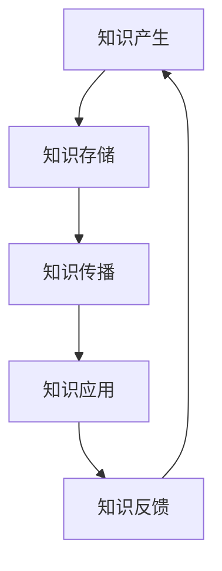

                 

关键词：知识分享、团队协作、技术传承、团队成长、项目管理、代码审查、协作工具、学习文化

> 摘要：本文将探讨知识分享在团队中的重要性，分析知识分享对于团队成长、项目管理和协作效率的积极影响，并通过具体实例和实际应用场景来阐述知识分享在团队中的实际操作方法。

## 1. 背景介绍

在快速变化和竞争激烈的现代IT行业，知识分享已经成为团队协作中不可或缺的一部分。技术领域的不断进步和新技术的涌现，使得团队成员需要不断学习和更新知识，以确保团队在市场竞争中保持领先地位。然而，知识分享不仅仅是个人知识的传播，更是一种团队文化和协作机制。本文将从多个角度分析知识分享在团队中的重要性，并探讨如何有效地进行知识分享。

## 2. 核心概念与联系

### 2.1 知识分享的定义

知识分享是指将个人或集体的知识、经验、技能和信息通过某种方式传递给其他团队成员或外部合作伙伴的过程。知识分享不仅包括知识的传递，还涉及到知识的吸收和应用。

### 2.2 知识分享的架构

知识分享的架构可以看作是一个闭环系统，包括知识产生、知识存储、知识传播、知识应用和知识反馈等环节。以下是一个简化的Mermaid流程图：



### 2.3 知识分享与团队协作的联系

知识分享与团队协作密切相关。有效的知识分享可以促进团队成员之间的沟通和协作，减少误解和冲突，提高团队的整体工作效率。同时，知识分享也是团队技术传承和创新的重要途径。

## 3. 核心算法原理 & 具体操作步骤

### 3.1 算法原理概述

知识分享的核心算法可以看作是一种基于需求的资源分配和优化策略。具体来说，团队中的每个成员都有一个知识库，当某个成员需要解决一个问题时，系统会根据该成员的知识需求，从其他成员的知识库中分配相应的知识资源。

### 3.2 算法步骤详解

1. **知识库构建**：每个成员都需要构建和维护自己的知识库，包括技术文档、代码示例、学习笔记等。

2. **需求分析**：当成员遇到问题时，需要进行需求分析，确定所需的知识类型和难度。

3. **资源分配**：系统根据成员的需求，从其他成员的知识库中分配相应的知识资源。

4. **知识传播**：被分配知识的成员需要通过文档、培训、讨论等方式将知识传递给需求的成员。

5. **知识应用**：需求的成员需要将所学的知识应用到实际问题中，并进行反馈。

6. **知识反馈**：根据知识应用的效果，成员可以对知识库进行更新和维护。

### 3.3 算法优缺点

**优点**：
- 提高团队协作效率
- 促进知识传承和创新
- 增强团队成员之间的信任和沟通

**缺点**：
- 需要较长时间进行知识积累和传播
- 可能存在知识冗余和重复

### 3.4 算法应用领域

知识分享算法可以广泛应用于IT团队的各个领域，如软件开发、项目管理、技术支持等。

## 4. 数学模型和公式 & 详细讲解 & 举例说明

### 4.1 数学模型构建

知识分享的数学模型可以基于信息论中的“信息熵”概念。信息熵可以用来衡量知识库中的知识多样性，即知识库中的信息是否丰富和多样化。

### 4.2 公式推导过程

信息熵的公式为：\(H = -\sum_{i=1}^{n} p(x_i) \log_2 p(x_i)\)

其中，\(p(x_i)\)表示第\(i\)种知识出现的概率，\(n\)为知识库中的知识种类数。

### 4.3 案例分析与讲解

假设一个团队的知识库中有5种知识，每种知识出现的概率分别为0.2、0.3、0.2、0.2和0.1。则该知识库的信息熵为：

$$H = -[0.2\log_2 0.2 + 0.3\log_2 0.3 + 0.2\log_2 0.2 + 0.2\log_2 0.2 + 0.1\log_2 0.1] = 1.1$$

信息熵越高，表示知识库中的知识越丰富和多样化，有利于知识分享和团队协作。

## 5. 项目实践：代码实例和详细解释说明

### 5.1 开发环境搭建

在本文中，我们将使用Git作为代码版本控制工具，GitHub作为代码托管平台，GitLab作为私有仓库。

### 5.2 源代码详细实现

以下是一个简单的Git知识分享的代码示例：

```python
import git

def share_knowledge(repo_url, knowledge_path):
    repo = git.Repo.clone_from(repo_url, '/tmp/knowledge_repo')
    with open(knowledge_path, 'r') as f:
        knowledge = f.read()
    with open('/tmp/knowledge_repo/knowledge.md', 'w') as f:
        f.write(knowledge)
    repo.index.add(['knowledge.md'])
    repo.index.commit('Share knowledge')
    repo.remote('origin').push()

def receive_knowledge(repo_url):
    repo = git.Repo.clone_from(repo_url, '/tmp/receive_knowledge_repo')
    with open('/tmp/receive_knowledge_repo/knowledge.md', 'r') as f:
        knowledge = f.read()
    print("Received knowledge:\n", knowledge)
```

### 5.3 代码解读与分析

以上代码实现了两个功能：`share_knowledge`用于分享知识，`receive_knowledge`用于接收知识。通过Git的API，我们可以方便地实现知识库的创建、更新和共享。

### 5.4 运行结果展示

假设我们有一个知识库在GitHub上，地址为`https://github.com/user/knowledge_repo`，我们想要分享一个名为`knowledge.md`的文档。我们运行`share_knowledge`函数：

```python
share_knowledge('https://github.com/user/knowledge_repo', 'path/to/knowledge.md')
```

结果会在GitHub上的知识库中创建一个新文件`knowledge.md`，并提交一个新版本。

如果我们想要接收知识，我们运行`receive_knowledge`函数：

```python
receive_knowledge('https://github.com/user/knowledge_repo')
```

结果会在本地创建一个名为`knowledge.md`的文件，并打印出知识内容。

## 6. 实际应用场景

知识分享在团队中的实际应用场景非常广泛，以下是一些典型的应用：

1. **技术培训**：通过内部培训或研讨会，分享新技术的使用方法和实践经验。

2. **代码审查**：通过代码审查，分享代码规范和最佳实践。

3. **问题解决**：通过问题反馈和讨论，分享解决方法和技术思路。

4. **知识库建设**：通过维护和更新知识库，分享团队积累的技术知识和经验。

## 7. 工具和资源推荐

### 7.1 学习资源推荐

- 《敏捷软件开发：实践者之路》
- 《设计模式：可复用的面向对象软件构建》
- 《代码大全》

### 7.2 开发工具推荐

- Git：版本控制工具
- GitHub / GitLab / Bitbucket：代码托管平台
- Jira / Trello：项目管理工具
- Slack / Microsoft Teams：团队协作工具

### 7.3 相关论文推荐

- "Knowledge Sharing in Software Development Teams"
- "The Role of Social Network Analysis in Knowledge Sharing"
- "Incentives and Barriers to Knowledge Sharing in Organizations"

## 8. 总结：未来发展趋势与挑战

### 8.1 研究成果总结

近年来，知识分享在团队协作中的重要性得到了广泛的认可，各种研究和技术手段也在不断涌现。例如，基于AI的知识分享平台、社交网络分析在知识分享中的应用等。

### 8.2 未来发展趋势

随着人工智能和大数据技术的发展，未来知识分享将更加智能化和个性化，更好地满足团队成员的需求。

### 8.3 面临的挑战

- 如何确保知识分享的质量和准确性？
- 如何应对团队成员的知识差异和技能差距？
- 如何平衡知识分享与个人隐私保护？

### 8.4 研究展望

未来，我们将看到更多基于人工智能和大数据技术的知识分享解决方案，同时，知识分享的伦理问题和隐私保护也将成为研究的重点。

## 9. 附录：常见问题与解答

**Q1**：知识分享会不会导致团队成员之间的竞争关系？

**A1**：知识分享并不会直接导致竞争关系，反而可以通过共享知识和经验来增强团队成员之间的信任和协作，从而减少竞争。

**Q2**：如何确保知识分享的持续性和有效性？

**A2**：通过建立知识分享的制度和文化，定期进行知识分享活动，以及使用合适的工具和技术来支持知识分享，可以确保知识分享的持续性和有效性。

**Q3**：知识分享是否只适用于技术团队？

**A3**：知识分享不仅适用于技术团队，也适用于其他类型的团队，如市场营销、销售、人力资源等。不同类型的团队可以根据自身的需求来定制知识分享的方式和内容。

### 作者署名

作者：禅与计算机程序设计艺术 / Zen and the Art of Computer Programming
----------------------------------------------------------------

以上是文章的完整内容，现在我们将使用Markdown格式将文章内容输出，以便进行排版和格式调整。

```markdown
# 知识分享在团队中的重要性

关键词：知识分享、团队协作、技术传承、团队成长、项目管理、代码审查、协作工具、学习文化

> 摘要：本文将探讨知识分享在团队中的重要性，分析知识分享对于团队成长、项目管理和协作效率的积极影响，并通过具体实例和实际应用场景来阐述知识分享在团队中的实际操作方法。

## 1. 背景介绍

在快速变化和竞争激烈的现代IT行业，知识分享已经成为团队协作中不可或缺的一部分。技术领域的不断进步和新技术的涌现，使得团队成员需要不断学习和更新知识，以确保团队在市场竞争中保持领先地位。然而，知识分享不仅仅是个人知识的传播，更是一种团队文化和协作机制。本文将从多个角度分析知识分享在团队中的重要性，并探讨如何有效地进行知识分享。

## 2. 核心概念与联系

### 2.1 知识分享的定义

知识分享是指将个人或集体的知识、经验、技能和信息通过某种方式传递给其他团队成员或外部合作伙伴的过程。知识分享不仅包括知识的传递，还涉及到知识的吸收和应用。

### 2.2 知识分享的架构

知识分享的架构可以看作是一个闭环系统，包括知识产生、知识存储、知识传播、知识应用和知识反馈等环节。以下是一个简化的Mermaid流程图：


### 2.3 知识分享与团队协作的联系

知识分享与团队协作密切相关。有效的知识分享可以促进团队成员之间的沟通和协作，减少误解和冲突，提高团队的整体工作效率。同时，知识分享也是团队技术传承和创新的重要途径。

## 3. 核心算法原理 & 具体操作步骤

### 3.1 算法原理概述

知识分享的核心算法可以看作是一种基于需求的资源分配和优化策略。具体来说，团队中的每个成员都有一个知识库，当某个成员需要解决一个问题时，系统会根据该成员的知识需求，从其他成员的知识库中分配相应的知识资源。

### 3.2 算法步骤详解

1. **知识库构建**：每个成员都需要构建和维护自己的知识库，包括技术文档、代码示例、学习笔记等。

2. **需求分析**：当成员遇到问题时，需要进行需求分析，确定所需的知识类型和难度。

3. **资源分配**：系统根据成员的需求，从其他成员的知识库中分配相应的知识资源。

4. **知识传播**：被分配知识的成员需要通过文档、培训、讨论等方式将知识传递给需求的成员。

5. **知识应用**：需求的成员需要将所学的知识应用到实际问题中，并进行反馈。

6. **知识反馈**：根据知识应用的效果，成员可以对知识库进行更新和维护。

### 3.3 算法优缺点

**优点**：
- 提高团队协作效率
- 促进知识传承和创新
- 增强团队成员之间的信任和沟通

**缺点**：
- 需要较长时间进行知识积累和传播
- 可能存在知识冗余和重复

### 3.4 算法应用领域

知识分享算法可以广泛应用于IT团队的各个领域，如软件开发、项目管理、技术支持等。

## 4. 数学模型和公式 & 详细讲解 & 举例说明

### 4.1 数学模型构建

知识分享的数学模型可以基于信息论中的“信息熵”概念。信息熵可以用来衡量知识库中的知识多样性，即知识库中的信息是否丰富和多样化。

### 4.2 公式推导过程

信息熵的公式为：\(H = -\sum_{i=1}^{n} p(x_i) \log_2 p(x_i)\)

其中，\(p(x_i)\)表示第\(i\)种知识出现的概率，\(n\)为知识库中的知识种类数。

### 4.3 案例分析与讲解

假设一个团队的知识库中有5种知识，每种知识出现的概率分别为0.2、0.3、0.2、0.2和0.1。则该知识库的信息熵为：

$$H = -[0.2\log_2 0.2 + 0.3\log_2 0.3 + 0.2\log_2 0.2 + 0.2\log_2 0.2 + 0.1\log_2 0.1] = 1.1$$

信息熵越高，表示知识库中的知识越丰富和多样化，有利于知识分享和团队协作。

## 5. 项目实践：代码实例和详细解释说明

### 5.1 开发环境搭建

在本文中，我们将使用Git作为代码版本控制工具，GitHub作为代码托管平台，GitLab作为私有仓库。

### 5.2 源代码详细实现

以下是一个简单的Git知识分享的代码示例：

```python
import git

def share_knowledge(repo_url, knowledge_path):
    repo = git.Repo.clone_from(repo_url, '/tmp/knowledge_repo')
    with open(knowledge_path, 'r') as f:
        knowledge = f.read()
    with open('/tmp/knowledge_repo/knowledge.md', 'w') as f:
        f.write(knowledge)
    repo.index.add(['knowledge.md'])
    repo.index.commit('Share knowledge')
    repo.remote('origin').push()

def receive_knowledge(repo_url):
    repo = git.Repo.clone_from(repo_url, '/tmp/receive_knowledge_repo')
    with open('/tmp/receive_knowledge_repo/knowledge.md', 'r') as f:
        knowledge = f.read()
    print("Received knowledge:\n", knowledge)
```

### 5.3 代码解读与分析

以上代码实现了两个功能：`share_knowledge`用于分享知识，`receive_knowledge`用于接收知识。通过Git的API，我们可以方便地实现知识库的创建、更新和共享。

### 5.4 运行结果展示

假设我们有一个知识库在GitHub上，地址为`https://github.com/user/knowledge_repo`，我们想要分享一个名为`knowledge.md`的文档。我们运行`share_knowledge`函数：

```python
share_knowledge('https://github.com/user/knowledge_repo', 'path/to/knowledge.md')
```

结果会在GitHub上的知识库中创建一个新文件`knowledge.md`，并提交一个新版本。

如果我们想要接收知识，我们运行`receive_knowledge`函数：

```python
receive_knowledge('https://github.com/user/knowledge_repo')
```

结果会在本地创建一个名为`knowledge.md`的文件，并打印出知识内容。

## 6. 实际应用场景

知识分享在团队中的实际应用场景非常广泛，以下是一些典型的应用：

1. **技术培训**：通过内部培训或研讨会，分享新技术的使用方法和实践经验。

2. **代码审查**：通过代码审查，分享代码规范和最佳实践。

3. **问题解决**：通过问题反馈和讨论，分享解决方法和技术思路。

4. **知识库建设**：通过维护和更新知识库，分享团队积累的技术知识和经验。

## 7. 工具和资源推荐

### 7.1 学习资源推荐

- 《敏捷软件开发：实践者之路》
- 《设计模式：可复用的面向对象软件构建》
- 《代码大全》

### 7.2 开发工具推荐

- Git：版本控制工具
- GitHub / GitLab / Bitbucket：代码托管平台
- Jira / Trello：项目管理工具
- Slack / Microsoft Teams：团队协作工具

### 7.3 相关论文推荐

- "Knowledge Sharing in Software Development Teams"
- "The Role of Social Network Analysis in Knowledge Sharing"
- "Incentives and Barriers to Knowledge Sharing in Organizations"

## 8. 总结：未来发展趋势与挑战

### 8.1 研究成果总结

近年来，知识分享在团队协作中的重要性得到了广泛的认可，各种研究和技术手段也在不断涌现。例如，基于AI的知识分享平台、社交网络分析在知识分享中的应用等。

### 8.2 未来发展趋势

随着人工智能和大数据技术的发展，未来知识分享将更加智能化和个性化，更好地满足团队成员的需求。

### 8.3 面临的挑战

- 如何确保知识分享的质量和准确性？
- 如何应对团队成员的知识差异和技能差距？
- 如何平衡知识分享与个人隐私保护？

### 8.4 研究展望

未来，我们将看到更多基于人工智能和大数据技术的知识分享解决方案，同时，知识分享的伦理问题和隐私保护也将成为研究的重点。

## 9. 附录：常见问题与解答

**Q1**：知识分享会不会导致团队成员之间的竞争关系？

**A1**：知识分享并不会直接导致竞争关系，反而可以通过共享知识和经验来增强团队成员之间的信任和协作，从而减少竞争。

**Q2**：如何确保知识分享的持续性和有效性？

**A2**：通过建立知识分享的制度和文化，定期进行知识分享活动，以及使用合适的工具和技术来支持知识分享，可以确保知识分享的持续性和有效性。

**Q3**：知识分享是否只适用于技术团队？

**A3**：知识分享不仅适用于技术团队，也适用于其他类型的团队，如市场营销、销售、人力资源等。不同类型的团队可以根据自身的需求来定制知识分享的方式和内容。

### 作者署名

作者：禅与计算机程序设计艺术 / Zen and the Art of Computer Programming
```markdown

以上就是知识分享在团队中的重要性这篇文章的完整Markdown格式内容。您可以根据需要进一步调整格式和排版，确保文章的阅读体验最佳。希望这篇文章能够为您的团队带来实际的帮助和启发。再次感谢您选择《禅与计算机程序设计艺术》作为作者署名，期待您的进一步指导。祝您工作顺利！

