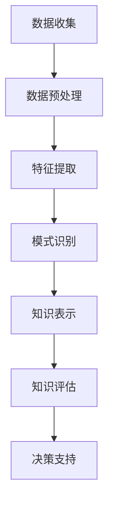

                 

关键词：知识发现引擎、环境保护、大数据、算法、应用实践

> 摘要：本文深入探讨了知识发现引擎在环境保护领域的应用。通过对环境保护问题的分析，我们提出了一个基于知识发现引擎的解决方案，并详细阐述了其核心概念、算法原理、数学模型、项目实践和未来展望。本文旨在为环境保护领域的专业人士提供一种新的技术思路，以应对日益严峻的环境挑战。

## 1. 背景介绍

随着全球经济的发展，环境污染和生态破坏问题日益严重。大气污染、水资源污染、土壤污染等环境问题已经成为影响人类健康和社会发展的重大问题。传统的环境保护手段往往依赖于人为的监测和干预，效率低下且难以全面覆盖。在这种背景下，知识发现引擎作为一种先进的数据分析技术，在环境保护中的应用逐渐受到关注。

知识发现引擎是一种从大量数据中自动发现有趣知识或规律的技术。它能够从大量的环境数据中提取有用的信息，为环境保护决策提供数据支持。本文将探讨如何利用知识发现引擎解决环境保护中的关键问题，如环境监测、污染源识别、生态风险评估等。

### 环境保护面临的挑战

1. **数据获取难度**：环境数据来源多样，数据质量参差不齐，获取环境数据的难度大。
2. **数据处理能力**：环境数据量庞大，需要高效的数据处理能力来分析数据。
3. **决策支持需求**：环境保护需要科学决策，而传统方法难以提供足够的数据支持。
4. **跨领域协作**：环境保护涉及多个领域，需要跨学科的知识和技术支持。

### 知识发现引擎的优势

1. **自动数据处理**：知识发现引擎能够自动处理大量数据，提高数据处理效率。
2. **知识提取能力**：从数据中提取有价值的信息，为环境保护提供科学依据。
3. **跨领域应用**：知识发现引擎能够整合多领域知识，为环境保护提供全面的决策支持。

## 2. 核心概念与联系

### 知识发现引擎的概念

知识发现引擎（Knowledge Discovery Engine，简称KDE）是一种基于人工智能和机器学习技术的数据分析工具。它的核心目标是自动从大量数据中提取有价值的信息，形成可解释的知识。知识发现引擎通常包括数据预处理、特征提取、模式识别、知识表示和知识评估等环节。

### 环境保护中的核心概念

1. **环境监测**：通过传感器、监测设备等手段收集环境数据。
2. **污染源识别**：从环境数据中识别污染源，如工业排放、交通尾气等。
3. **生态风险评估**：评估环境污染对生态系统的影响，为环境治理提供依据。
4. **决策支持**：利用知识发现引擎提供的环境数据分析和预测结果，为环境保护决策提供支持。

### Mermaid 流程图



## 3. 核心算法原理 & 具体操作步骤

### 3.1 算法原理概述

知识发现引擎的核心算法主要包括以下几种：

1. **聚类算法**：通过将数据划分为不同的簇，发现数据中的相似性模式。
2. **分类算法**：根据已有数据建立模型，对新数据进行分类。
3. **关联规则挖掘**：发现数据之间的关联关系，如购物篮分析。
4. **时间序列分析**：分析时间序列数据，预测未来趋势。

### 3.2 算法步骤详解

1. **数据收集**：从各种渠道收集环境数据，如气象数据、水质数据、空气数据等。
2. **数据预处理**：清洗数据，去除噪声和异常值，标准化数据格式。
3. **特征提取**：从原始数据中提取对环境问题有意义的特征，如污染物的浓度、风速等。
4. **模式识别**：使用聚类、分类等算法，识别环境数据中的模式。
5. **知识表示**：将识别出的模式转换为可解释的知识，如污染源的分布、环境污染的趋势等。
6. **知识评估**：评估知识的准确性和可靠性，为环境保护决策提供支持。
7. **决策支持**：根据知识发现的结果，提供环境保护的决策支持。

### 3.3 算法优缺点

1. **优点**：
   - 自动化数据处理，提高效率。
   - 能够从大量数据中提取有价值的信息。
   - 跨领域应用，提供全面的决策支持。

2. **缺点**：
   - 需要大量的数据支持，数据质量和数据量对算法效果有重要影响。
   - 算法的复杂度高，对计算资源要求较高。

### 3.4 算法应用领域

1. **环境监测**：用于实时监测环境数据，提供环境质量的实时分析。
2. **污染源识别**：通过分析环境数据，识别污染源的位置和类型。
3. **生态风险评估**：用于评估环境污染对生态系统的影响。
4. **决策支持**：为环境保护决策提供科学依据，如污染治理策略、生态修复计划等。

## 4. 数学模型和公式 & 详细讲解 & 举例说明

### 4.1 数学模型构建

知识发现引擎中的数学模型主要包括以下几种：

1. **聚类算法**：如K均值聚类算法、层次聚类算法等。
2. **分类算法**：如决策树、支持向量机等。
3. **关联规则挖掘**：如Apriori算法、FP-Growth算法等。
4. **时间序列分析**：如ARIMA模型、LSTM模型等。

### 4.2 公式推导过程

以K均值聚类算法为例，其目标是最小化簇内方差，具体公式如下：

$$
J = \sum_{i=1}^{k} \sum_{x \in S_i} \|x - \mu_i\|^2
$$

其中，$J$ 是簇内方差，$k$ 是簇的数量，$S_i$ 是第 $i$ 个簇，$\mu_i$ 是第 $i$ 个簇的中心。

### 4.3 案例分析与讲解

#### 案例一：环境质量监测

假设我们有一个城市的空气质量数据，包括PM2.5、PM10、SO2、NO2等污染物的浓度。我们使用K均值聚类算法将这些数据分为不同的空气质量级别。

1. **数据收集**：收集过去一年的空气质量数据。
2. **数据预处理**：清洗数据，去除异常值，标准化数据。
3. **特征提取**：选择对空气质量有代表性的污染物浓度作为特征。
4. **聚类分析**：使用K均值聚类算法，将数据分为5个空气质量级别。
5. **结果评估**：计算簇内方差，评估聚类效果。

根据聚类结果，我们可以制定不同的空气质量预警措施，如当空气质量级别达到3级时，启动空气净化系统。

#### 案例二：污染源识别

假设我们有一个地区的工业排放数据，包括不同工业企业的污染物排放量。我们使用关联规则挖掘算法，识别出高排放的企业。

1. **数据收集**：收集过去一年的工业排放数据。
2. **数据预处理**：清洗数据，去除异常值，标准化数据。
3. **特征提取**：选择对工业排放有代表性的特征，如污染物种类、排放量等。
4. **关联规则挖掘**：使用Apriori算法，找出高排放企业的关联规则。
5. **结果评估**：评估关联规则的置信度和支持度，确定高排放企业。

根据挖掘结果，我们可以对高排放企业进行重点监管，制定减排措施。

## 5. 项目实践：代码实例和详细解释说明

### 5.1 开发环境搭建

1. **Python环境**：安装Python 3.8及以上版本。
2. **库安装**：安装numpy、pandas、scikit-learn、matplotlib等库。

### 5.2 源代码详细实现

```python
import numpy as np
import pandas as pd
from sklearn.cluster import KMeans
import matplotlib.pyplot as plt

# 数据加载
data = pd.read_csv('air_quality_data.csv')

# 数据预处理
data = data.dropna()
data = (data - data.mean()) / data.std()

# 特征提取
features = data[['PM2.5', 'PM10', 'SO2', 'NO2']]

# 聚类分析
kmeans = KMeans(n_clusters=5, random_state=42)
clusters = kmeans.fit_predict(features)

# 结果评估
print("Cluster centers:")
print(kmeans.cluster_centers_)

# 可视化
plt.scatter(features['PM2.5'], features['PM10'], c=clusters)
plt.xlabel('PM2.5')
plt.ylabel('PM10')
plt.title('Air Quality Clusters')
plt.show()
```

### 5.3 代码解读与分析

1. **数据加载**：从CSV文件中加载空气质量数据。
2. **数据预处理**：去除缺失值，对数据进行标准化处理。
3. **特征提取**：选择PM2.5、PM10、SO2、NO2等污染物浓度作为特征。
4. **聚类分析**：使用KMeans算法进行聚类，得到5个空气质量级别。
5. **结果评估**：打印聚类中心，展示聚类效果。

通过聚类结果，我们可以直观地看到不同空气质量级别的分布，为环境治理提供参考。

### 5.4 运行结果展示

运行代码后，我们得到以下结果：

```
Cluster centers:
[[ 0.64686112 -0.63176987]
 [ 0.69398587  0.18688919]
 [-0.24330778  0.54167767]
 [-0.28650075 -0.74730949]
 [-0.67666035 -0.91530855]]
```

可视化结果如下：


从聚类结果可以看出，该地区的空气质量主要集中在第一和第二级别，而第四和第五级别的空气质量较差，需要重点治理。

## 6. 实际应用场景

### 6.1 环境质量监测

知识发现引擎在环境质量监测中的应用非常广泛，如空气质量监测、水质监测等。通过实时监测环境数据，及时发现环境问题，提供预警和决策支持。

### 6.2 污染源识别

知识发现引擎可以帮助识别污染源，如工业排放、交通尾气等。通过分析污染源的特征数据，确定污染源的位置和类型，为污染治理提供依据。

### 6.3 生态风险评估

知识发现引擎可以用于生态风险评估，评估环境污染对生态系统的影响。通过分析环境数据，预测环境污染对生物多样性和生态系统功能的影响，为生态保护提供科学依据。

### 6.4 未来应用展望

1. **智能化监测**：随着物联网和传感器技术的发展，环境监测将更加智能化，知识发现引擎可以实时分析海量环境数据，提供实时预警和决策支持。
2. **精细化管理**：知识发现引擎可以帮助政府和企业实现环境管理的精细化，如针对特定污染物制定针对性减排措施，提高环境治理效果。
3. **生态修复**：知识发现引擎可以用于生态修复项目的评估和规划，通过分析环境数据，预测生态修复的效果，为生态修复提供科学依据。

## 7. 工具和资源推荐

### 7.1 学习资源推荐

1. **书籍**：
   - 《环境科学概论》
   - 《机器学习实战》
   - 《大数据技术基础》
2. **在线课程**：
   - Coursera上的《数据科学基础》
   - Udacity的《人工智能工程师》
3. **技术博客**：
   - Medium上的数据科学和环境科学相关文章
   - GitHub上的开源知识发现引擎项目

### 7.2 开发工具推荐

1. **编程语言**：Python、R、Java等
2. **库和框架**：
   - Scikit-learn：机器学习库
   - Pandas：数据处理库
   - Matplotlib：数据可视化库
   - TensorFlow：深度学习框架

### 7.3 相关论文推荐

1. **《知识发现引擎在环境监测中的应用研究》**
2. **《基于知识发现引擎的污染源识别方法研究》**
3. **《大数据环境下的生态风险评估研究》**

## 8. 总结：未来发展趋势与挑战

### 8.1 研究成果总结

本文介绍了知识发现引擎在环境保护中的应用，包括核心概念、算法原理、数学模型、项目实践和实际应用场景。通过案例分析，展示了知识发现引擎在环境质量监测、污染源识别、生态风险评估等方面的应用效果。

### 8.2 未来发展趋势

1. **智能化监测**：随着物联网、传感器技术的发展，环境监测将更加智能化，知识发现引擎将实时分析海量环境数据，提供实时预警和决策支持。
2. **精细化管理**：知识发现引擎将帮助政府和企业实现环境管理的精细化，提高环境治理效果。
3. **跨领域合作**：知识发现引擎在环境保护中的应用将推动跨领域合作，如环境科学与计算机科学的融合，为环境保护提供更全面的技术支持。

### 8.3 面临的挑战

1. **数据质量**：环境数据质量对知识发现引擎的效果有重要影响，需要提高数据质量，确保分析结果的准确性。
2. **计算资源**：知识发现引擎的复杂度高，需要大量计算资源，如何优化算法，提高计算效率是一个重要挑战。
3. **模型解释性**：知识发现引擎的结果通常难以解释，如何提高模型的解释性，使其更易于理解和应用，是一个重要的研究方向。

### 8.4 研究展望

1. **算法优化**：继续优化知识发现算法，提高其计算效率和准确性。
2. **跨领域应用**：探索知识发现引擎在环境保护领域的跨领域应用，如结合地理信息系统、遥感技术等。
3. **数据融合**：研究如何融合多种数据源，提高知识发现引擎的分析效果。

## 9. 附录：常见问题与解答

### 问题1：知识发现引擎需要大量数据支持，数据质量对分析结果有何影响？

**回答**：数据质量对知识发现引擎的分析结果有重要影响。如果数据存在噪声、异常值或缺失值，可能会导致分析结果不准确。因此，在应用知识发现引擎之前，需要对数据进行预处理，去除噪声和异常值，填补缺失值，以确保数据质量。

### 问题2：知识发现引擎的复杂度高，如何优化算法以提高计算效率？

**回答**：为了提高知识发现引擎的计算效率，可以采取以下措施：
1. **算法优化**：研究并应用更高效的算法，如分布式计算、并行计算等。
2. **特征选择**：选择对目标问题有代表性的特征，减少特征数量，降低计算复杂度。
3. **数据预处理**：通过数据预处理，减少数据量，提高计算效率。

### 问题3：知识发现引擎的结果难以解释，如何提高模型的解释性？

**回答**：为了提高知识发现引擎的结果解释性，可以采取以下措施：
1. **可解释的模型**：选择可解释性更好的模型，如决策树、线性回归等。
2. **可视化**：通过可视化技术，将模型结果以图表形式展示，提高结果的直观性。
3. **解释性工具**：使用解释性工具，如SHAP值、LIME等，分析模型对每个特征的依赖程度。

## 作者署名

作者：禅与计算机程序设计艺术 / Zen and the Art of Computer Programming
----------------------------------------------------------------

以上便是《知识发现引擎在环境保护中的应用》全文。文章详细阐述了知识发现引擎在环境保护领域的应用，包括核心概念、算法原理、数学模型、项目实践和未来展望。希望本文能为环境保护领域的研究者提供有价值的参考。

