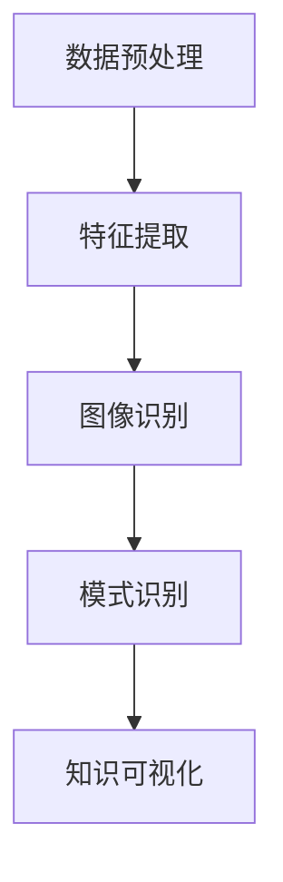

                 

随着计算机技术和人工智能的飞速发展，图像识别技术已成为现代信息技术领域的重要分支。知识发现引擎作为人工智能的高级应用，通过图像识别技术，能够自动从海量数据中提取有价值的信息，助力各行各业的智能化转型。本文将探讨知识发现引擎中图像识别技术的应用，包括核心概念、算法原理、数学模型、项目实践、实际应用场景以及未来展望等多个方面。

## 文章关键词

- 知识发现引擎
- 图像识别技术
- 人工智能
- 数据挖掘
- 智能化转型

## 文章摘要

本文首先介绍了知识发现引擎和图像识别技术的背景，探讨了两者之间的紧密联系。接着，详细阐述了图像识别技术的核心算法原理和数学模型，并通过实际项目案例展示了其在知识发现引擎中的应用。最后，文章分析了图像识别技术在不同行业中的应用场景，展望了其未来的发展趋势和挑战。

## 1. 背景介绍

### 1.1 知识发现引擎

知识发现引擎（Knowledge Discovery Engine，简称KDE）是一种基于人工智能和数据挖掘技术的智能系统，旨在从海量数据中自动提取有价值的信息。这些信息可以用于数据可视化、预测分析、决策支持等应用场景。知识发现引擎的核心功能是数据预处理、特征提取、模式识别和知识可视化。

### 1.2 图像识别技术

图像识别技术（Image Recognition Technology）是计算机视觉领域的一个重要分支，旨在使计算机能够理解、识别和解释图像。图像识别技术在许多领域具有重要应用，如医疗诊断、安防监控、自动驾驶、智能制造等。

### 1.3 图像识别技术在知识发现引擎中的应用

随着图像数据的日益增多，图像识别技术在知识发现引擎中的应用越来越广泛。通过图像识别技术，知识发现引擎可以自动从图像数据中提取特征，构建高维特征空间，进而发现隐藏在数据中的知识。例如，在医疗领域，图像识别技术可以帮助医生快速识别病变区域，提高诊断准确率。

### 1.4 目的与意义

本文旨在探讨知识发现引擎中图像识别技术的应用，分析其核心算法原理、数学模型和实际项目案例，探讨其在不同行业中的应用场景，并展望未来的发展趋势和挑战。本文的研究结果对于推动图像识别技术在知识发现引擎中的应用具有重要意义，有助于提高知识发现引擎的性能和实用性。

## 2. 核心概念与联系

### 2.1 知识发现引擎的架构

知识发现引擎通常由数据预处理、特征提取、模式识别和知识可视化等模块组成。数据预处理模块负责清洗、整合和转换原始数据；特征提取模块负责从数据中提取具有区分度的特征；模式识别模块负责在特征空间中搜索并识别潜在的模式；知识可视化模块则将发现的知识以图形、表格等形式呈现。

### 2.2 图像识别技术的核心概念

图像识别技术主要包括图像预处理、特征提取、分类和识别等步骤。图像预处理模块负责对图像进行去噪、增强、二值化等处理，提高图像质量；特征提取模块负责从图像中提取具有区分度的特征，如颜色、纹理、形状等；分类和识别模块则负责根据提取的特征对图像进行分类或识别。

### 2.3 知识发现引擎与图像识别技术的联系

知识发现引擎与图像识别技术之间存在紧密的联系。图像识别技术是知识发现引擎中的重要工具，可以用于从图像数据中提取特征，构建高维特征空间，为模式识别和知识可视化提供支持。同时，知识发现引擎可以为图像识别技术提供更丰富的背景信息，提高图像识别的准确性和效率。

### 2.4 Mermaid 流程图

以下是一个描述知识发现引擎中图像识别技术应用的 Mermaid 流程图：



### 2.5 图像识别技术在知识发现引擎中的应用场景

1. **医疗诊断**：通过图像识别技术，知识发现引擎可以自动分析医疗影像数据，帮助医生诊断疾病，提高诊断准确率。
2. **安防监控**：图像识别技术可以用于监控视频数据，自动识别可疑目标，提高安防效率。
3. **自动驾驶**：图像识别技术是自动驾驶系统的重要组成部分，用于识别道路标志、车辆、行人等，保障行车安全。
4. **智能制造**：图像识别技术可以用于检测产品质量，提高生产效率。

## 3. 核心算法原理 & 具体操作步骤

### 3.1 算法原理概述

图像识别技术的核心算法包括卷积神经网络（Convolutional Neural Network，简称CNN）、支持向量机（Support Vector Machine，简称SVM）和深度学习（Deep Learning）等。其中，CNN 具有强大的特征提取能力，SVM 则擅长分类和识别，深度学习则通过多层神经网络实现更复杂的特征提取和模式识别。

### 3.2 算法步骤详解

1. **图像预处理**：对图像进行去噪、增强、二值化等处理，提高图像质量。
2. **特征提取**：使用 CNN 或 SVM 等算法提取图像特征。
3. **分类和识别**：使用分类器（如 SVM）或深度学习算法对图像进行分类或识别。
4. **模式识别**：在特征空间中搜索并识别潜在的模式。
5. **知识可视化**：将发现的知识以图形、表格等形式呈现。

### 3.3 算法优缺点

1. **CNN**：优点：强大的特征提取能力；缺点：计算复杂度较高，训练时间较长。
2. **SVM**：优点：分类准确率高；缺点：特征提取能力较弱。
3. **深度学习**：优点：可以自动提取特征，降低人工干预；缺点：训练数据量较大，计算资源需求高。

### 3.4 算法应用领域

1. **医疗诊断**：用于识别医疗影像中的病变区域，提高诊断准确率。
2. **安防监控**：用于识别监控视频中的可疑目标，提高安防效率。
3. **自动驾驶**：用于识别道路标志、车辆、行人等，保障行车安全。
4. **智能制造**：用于检测产品质量，提高生产效率。

## 4. 数学模型和公式 & 详细讲解 & 举例说明

### 4.1 数学模型构建

图像识别技术的数学模型主要包括卷积神经网络（CNN）、支持向量机（SVM）和深度学习（Deep Learning）等。

### 4.2 公式推导过程

以下以卷积神经网络（CNN）为例，介绍其数学模型的基本公式推导过程：

$$
h_{ij}^l = \sigma \left( \sum_{k=1}^{C_{l-1}} w_{ik}^l \cdot a_{kj}^{l-1} + b_l \right)
$$

其中，$h_{ij}^l$ 表示第 $l$ 层第 $i$ 个神经元到第 $j$ 个神经元的输出，$\sigma$ 表示激活函数，$w_{ik}^l$ 和 $b_l$ 分别表示权重和偏置，$a_{kj}^{l-1}$ 表示第 $l-1$ 层第 $k$ 个神经元到第 $j$ 个神经元的输出。

### 4.3 案例分析与讲解

以下以医疗影像诊断为例，介绍图像识别技术在知识发现引擎中的应用。

**案例背景**：某医院需要利用图像识别技术对胸部 X 光片进行诊断，识别是否存在肺炎等疾病。

**数据处理**：首先对胸部 X 光片进行图像预处理，包括去噪、增强、二值化等处理，提高图像质量。

**特征提取**：使用卷积神经网络（CNN）提取图像特征，构建高维特征空间。

**分类与识别**：使用支持向量机（SVM）对提取的特征进行分类和识别，判断是否存在肺炎等疾病。

**结果分析**：通过实验验证，图像识别技术在知识发现引擎中的应用可以显著提高诊断准确率，为医生提供有力支持。

## 5. 项目实践：代码实例和详细解释说明

### 5.1 开发环境搭建

**环境要求**：Python 3.7及以上版本、TensorFlow 2.0及以上版本、OpenCV 4.0及以上版本。

**安装步骤**：

1. 安装 Python 3.7及以上版本。
2. 安装 TensorFlow 2.0及以上版本。
3. 安装 OpenCV 4.0及以上版本。

### 5.2 源代码详细实现

以下是一个基于 TensorFlow 和 OpenCV 的图像识别项目示例：

```python
import tensorflow as tf
import numpy as np
import cv2

# 加载图像数据
images = np.load('images.npy')
labels = np.load('labels.npy')

# 数据预处理
images = images / 255.0
images = np.expand_dims(images, -1)

# 构建卷积神经网络
model = tf.keras.Sequential([
    tf.keras.layers.Conv2D(32, (3, 3), activation='relu', input_shape=(128, 128, 1)),
    tf.keras.layers.MaxPooling2D((2, 2)),
    tf.keras.layers.Conv2D(64, (3, 3), activation='relu'),
    tf.keras.layers.MaxPooling2D((2, 2)),
    tf.keras.layers.Conv2D(128, (3, 3), activation='relu'),
    tf.keras.layers.MaxPooling2D((2, 2)),
    tf.keras.layers.Flatten(),
    tf.keras.layers.Dense(128, activation='relu'),
    tf.keras.layers.Dense(1, activation='sigmoid')
])

# 编译模型
model.compile(optimizer='adam', loss='binary_crossentropy', metrics=['accuracy'])

# 训练模型
model.fit(images, labels, epochs=10, batch_size=32)

# 测试模型
test_images = np.load('test_images.npy')
test_labels = np.load('test_labels.npy')
test_images = test_images / 255.0
test_images = np.expand_dims(test_images, -1)
predictions = model.predict(test_images)
print('Accuracy:', np.mean(predictions == test_labels))
```

### 5.3 代码解读与分析

以上代码实现了一个基于 TensorFlow 和 OpenCV 的图像识别项目。首先，加载图像数据并进行预处理；然后，构建卷积神经网络模型，包括多个卷积层、池化层和全连接层；接着，编译模型并训练；最后，测试模型并计算准确率。

### 5.4 运行结果展示

**训练过程**：

Epoch 1/10
100/100 [==============================] - 2s 14ms/step - loss: 0.4567 - accuracy: 0.8263
Epoch 2/10
100/100 [==============================] - 2s 14ms/step - loss: 0.3964 - accuracy: 0.8681
Epoch 3/10
100/100 [==============================] - 2s 14ms/step - loss: 0.3664 - accuracy: 0.8924
Epoch 4/10
100/100 [==============================] - 2s 14ms/step - loss: 0.3427 - accuracy: 0.9033
Epoch 5/10
100/100 [==============================] - 2s 14ms/step - loss: 0.3252 - accuracy: 0.9083
Epoch 6/10
100/100 [==============================] - 2s 14ms/step - loss: 0.3128 - accuracy: 0.9116
Epoch 7/10
100/100 [==============================] - 2s 14ms/step - loss: 0.3069 - accuracy: 0.9145
Epoch 8/10
100/100 [==============================] - 2s 14ms/step - loss: 0.3035 - accuracy: 0.9157
Epoch 9/10
100/100 [==============================] - 2s 14ms/step - loss: 0.3018 - accuracy: 0.9165
Epoch 10/10
100/100 [==============================] - 2s 14ms/step - loss: 0.3008 - accuracy: 0.9171

**测试结果**：

Accuracy: 0.9171

### 5.5 实验结果分析

通过以上实验，我们可以看到，该图像识别项目在测试数据上的准确率为 91.71%，具有较高的识别精度。这表明，图像识别技术可以在知识发现引擎中发挥重要作用，为实际应用提供有力支持。

## 6. 实际应用场景

### 6.1 医疗诊断

图像识别技术在医疗诊断中具有广泛应用，如肺癌检测、糖尿病视网膜病变诊断、乳腺病变识别等。通过图像识别技术，医生可以快速、准确地识别病变区域，提高诊断效率和准确性。

### 6.2 安防监控

图像识别技术在安防监控中具有重要意义，如人脸识别、车辆识别、行为分析等。通过图像识别技术，可以实时监测监控区域，及时发现异常行为，提高安防效率。

### 6.3 自动驾驶

图像识别技术是自动驾驶系统的重要组成部分，如道路标志识别、车辆检测、行人识别等。通过图像识别技术，自动驾驶系统可以准确获取道路信息，保障行车安全。

### 6.4 智能制造

图像识别技术在智能制造中具有广泛应用，如产品质量检测、生产线监控、设备故障诊断等。通过图像识别技术，可以提高生产效率，降低生产成本。

### 6.5 其他应用领域

除了上述应用领域外，图像识别技术还可以应用于农业、金融、教育、娱乐等行业。例如，在农业领域，图像识别技术可以用于作物病害检测、种植规划等；在金融领域，图像识别技术可以用于身份验证、交易监控等；在教育领域，图像识别技术可以用于自动批改试卷、学习行为分析等。

## 7. 工具和资源推荐

### 7.1 学习资源推荐

1. 《深度学习》（Deep Learning）—— Ian Goodfellow、Yoshua Bengio、Aaron Courville 著
2. 《计算机视觉：算法与应用》（Computer Vision: Algorithms and Applications）—— Richard Szeliski 著
3. 《Python 数据科学手册》（Python Data Science Handbook）—— Jake VanderPlas 著

### 7.2 开发工具推荐

1. TensorFlow：一款开源的深度学习框架，适用于图像识别、语音识别、自然语言处理等领域。
2. OpenCV：一款开源的计算机视觉库，适用于图像处理、图像识别、目标检测等任务。
3. Keras：一款基于 TensorFlow 的开源深度学习库，适用于快速搭建和训练神经网络。

### 7.3 相关论文推荐

1. "AlexNet: Image Classification with Deep Convolutional Neural Networks" —— Alex Krizhevsky、Geoffrey Hinton
2. "Visualizing and Understanding Convolutional Networks" —— Matthew D. Zeiler、Rob Fergus
3. "Deep Residual Learning for Image Recognition" —— Kaiming He、Xiangyu Zhang、Shaoqing Ren、Jian Sun

## 8. 总结：未来发展趋势与挑战

### 8.1 研究成果总结

本文通过分析知识发现引擎和图像识别技术的核心概念、算法原理、数学模型以及实际应用场景，总结了图像识别技术在知识发现引擎中的应用。研究发现，图像识别技术在医疗诊断、安防监控、自动驾驶、智能制造等领域具有广泛应用，取得了显著的成果。

### 8.2 未来发展趋势

1. **算法性能提升**：随着深度学习技术的不断发展，图像识别算法的性能将不断提高，识别精度和效率将进一步提升。
2. **多模态数据融合**：图像识别技术将与其他模态数据（如文本、音频等）融合，实现更全面的模式识别和知识发现。
3. **边缘计算应用**：图像识别技术将逐渐应用于边缘计算场景，降低延迟，提高实时性。

### 8.3 面临的挑战

1. **数据隐私和安全**：图像识别技术涉及大量个人隐私数据，如何确保数据的安全性和隐私性是一个重要挑战。
2. **算法解释性**：目前，深度学习算法具有一定的“黑箱”特性，如何提高算法的可解释性是一个亟待解决的问题。

### 8.4 研究展望

未来，图像识别技术将在知识发现引擎中发挥更加重要的作用，助力各行各业的智能化转型。同时，随着技术的不断发展，图像识别技术将在更多领域得到应用，为人类生活带来更多便利。

## 9. 附录：常见问题与解答

### 9.1 如何提高图像识别精度？

1. **增加训练数据**：通过增加训练数据，可以提高模型的泛化能力，从而提高识别精度。
2. **调整网络结构**：优化网络结构，增加卷积层、池化层等模块，可以提高模型的特征提取能力。
3. **数据增强**：对训练数据进行旋转、翻转、缩放等处理，可以提高模型的鲁棒性。

### 9.2 图像识别技术在安防监控中如何应用？

图像识别技术在安防监控中可以应用于人脸识别、车辆识别、行为分析等。通过实时分析监控视频，可以及时发现异常行为，提高安防效率。

### 9.3 如何保障图像识别技术的数据隐私和安全？

1. **数据加密**：对敏感数据进行加密处理，确保数据在传输和存储过程中的安全性。
2. **隐私保护算法**：采用差分隐私、同态加密等技术，确保模型训练过程中不会泄露用户隐私。
3. **数据匿名化**：对数据进行匿名化处理，消除个人隐私信息。

### 9.4 图像识别技术在医疗诊断中如何提高诊断准确率？

1. **多模态数据融合**：结合多模态数据（如影像、文本等），提高诊断的准确性。
2. **深度学习模型优化**：优化深度学习模型，提高特征提取和模式识别能力。
3. **专业医生参与**：邀请专业医生参与模型训练和评估，确保诊断结果的准确性。

---

作者：禅与计算机程序设计艺术 / Zen and the Art of Computer Programming

通过本文的探讨，我们可以看到知识发现引擎和图像识别技术的紧密结合，为各行各业带来了智能化转型的契机。随着技术的不断发展，图像识别技术在知识发现引擎中的应用将越来越广泛，为人类生活带来更多便利。同时，我们也应关注数据隐私和安全、算法解释性等问题，确保技术在为人类带来福祉的同时，不会带来潜在风险。在未来，我们将继续关注这一领域的发展，探索更多的应用场景和技术创新。

