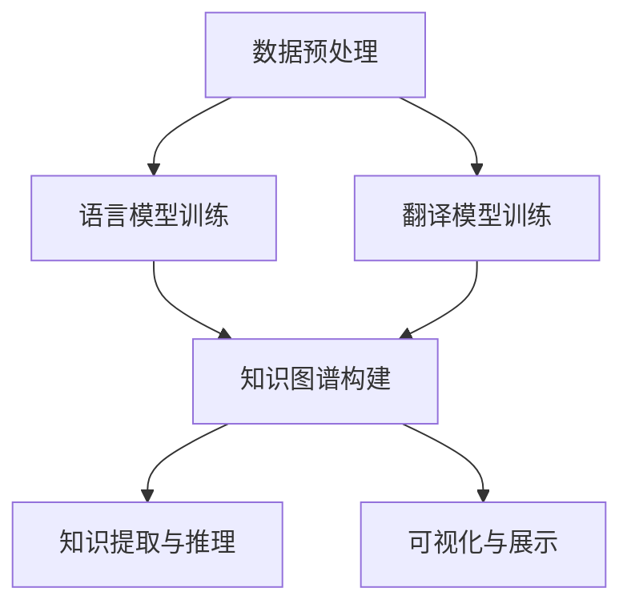

                 

关键词：知识发现引擎、多语言支持、技术实现、性能优化、算法原理

摘要：本文深入探讨知识发现引擎在多语言支持方面的实现技术。通过分析多语言处理的核心挑战，阐述了一种高效且灵活的实现方案，包括核心概念、算法原理、数学模型及实际应用。本文旨在为开发者提供一套完整的知识发现引擎多语言支持实现指南，助力其在全球化信息时代的创新与发展。

## 1. 背景介绍

随着全球互联网的普及，多语言内容激增，知识发现引擎作为人工智能领域的重要工具，正面临前所未有的挑战与机遇。知识发现引擎旨在从大量非结构化数据中提取有用知识，帮助用户快速定位信息。然而，多语言处理技术的引入，使得知识发现引擎在语言理解和处理方面面临诸多挑战。这些挑战包括但不限于：

1. **语言理解差异**：不同语言在语法、语义、文化背景等方面存在显著差异，这给语言理解和处理带来了难度。
2. **语言资源匮乏**：某些小语种或低资源语言的数据和资源相对匮乏，导致算法训练和优化困难。
3. **性能优化需求**：多语言支持需要引擎具备更高的性能，以满足全球化业务需求。
4. **国际化合规**：不同国家和地区在数据隐私、版权、法律法规等方面存在差异，这要求引擎在设计时充分考虑合规性。

本文将针对上述挑战，探讨一种高效且灵活的多语言支持实现方案，助力知识发现引擎在全球化环境下发挥更大价值。

## 2. 核心概念与联系

### 2.1 核心概念

在多语言支持的知识发现引擎中，核心概念包括：

1. **自然语言处理（NLP）**：NLP 是多语言支持的基础，涉及文本分类、情感分析、实体识别等任务。
2. **语言模型**：语言模型用于预测词序列的概率，如 Transformer、BERT 等。
3. **翻译模型**：翻译模型用于实现跨语言文本的翻译，如神经机器翻译（NMT）。
4. **知识图谱**：知识图谱用于表示实体及其关系，便于知识提取和推理。

### 2.2 关系与流程

多语言支持的知识发现引擎大致包括以下流程：

1. **数据预处理**：对输入数据进行清洗、分词、标注等预处理操作。
2. **语言模型训练**：利用预处理的文本数据训练语言模型，如 Transformer、BERT 等。
3. **翻译模型训练**：对源语言和目标语言分别训练翻译模型，实现跨语言文本翻译。
4. **知识图谱构建**：利用翻译后的文本数据，构建多语言知识图谱。
5. **知识提取与推理**：从知识图谱中提取知识，进行推理和可视化。

### 2.3 Mermaid 流程图

以下是多语言支持的知识发现引擎的 Mermaid 流程图：



## 3. 核心算法原理 & 具体操作步骤

### 3.1 算法原理概述

多语言支持的知识发现引擎主要依赖以下几种核心算法：

1. **自然语言处理（NLP）算法**：用于文本分类、情感分析、实体识别等任务，如 BERT、GPT 等。
2. **翻译模型算法**：用于跨语言文本翻译，如 Transformer、NMT 等。
3. **知识图谱算法**：用于构建实体及其关系，如 RDF、OWL 等。

### 3.2 算法步骤详解

1. **数据预处理**：对输入文本进行清洗、分词、标注等操作，为后续处理做准备。
2. **语言模型训练**：利用清洗后的文本数据，训练语言模型，如 BERT、GPT 等。
3. **翻译模型训练**：对源语言和目标语言分别训练翻译模型，如 Transformer、NMT 等。
4. **知识图谱构建**：利用翻译后的文本数据，构建多语言知识图谱。
5. **知识提取与推理**：从知识图谱中提取知识，进行推理和可视化。

### 3.3 算法优缺点

**优点**：

1. **高效性**：多语言支持的知识发现引擎可以处理多种语言数据，提高信息提取和推理的效率。
2. **灵活性**：支持多种语言模型和算法，可以根据需求灵活调整。

**缺点**：

1. **计算资源消耗大**：多语言支持需要大量计算资源，尤其是在训练翻译模型和知识图谱时。
2. **算法复杂性高**：涉及多种算法和模型，需要深入理解和掌握。

### 3.4 算法应用领域

多语言支持的知识发现引擎广泛应用于以下领域：

1. **跨语言信息检索**：如多语言搜索引擎、跨语言问答系统等。
2. **多语言新闻推荐**：如多语言新闻聚合平台、跨语言新闻推荐系统等。
3. **多语言知识图谱构建**：如跨语言实体识别、跨语言关系抽取等。

## 4. 数学模型和公式 & 详细讲解 & 举例说明

### 4.1 数学模型构建

多语言支持的知识发现引擎涉及的数学模型主要包括：

1. **语言模型**：如 Transformer、BERT 等。
2. **翻译模型**：如 Transformer、NMT 等。
3. **知识图谱模型**：如 RDF、OWL 等。

### 4.2 公式推导过程

1. **语言模型**：以 BERT 为例，其输入和输出的数学表示如下：

$$
\text{Input}: \text{BERT}([\text{CLS}], X_1, X_2, \ldots, X_n, [\text{SEP}])
$$

$$
\text{Output}: \text{BERT}([\text{CLS}], Z_1, Z_2, \ldots, Z_n, [\text{SEP}])
$$

其中，$X_1, X_2, \ldots, X_n$ 为输入序列，$Z_1, Z_2, \ldots, Z_n$ 为输出序列。

2. **翻译模型**：以 Transformer 为例，其输入和输出的数学表示如下：

$$
\text{Input}: \text{Transformer}([\text{SRC}],[\text{TGT}])
$$

$$
\text{Output}: \text{Transformer}([\text{SRC}],[\text{TGT}])
$$

其中，$[\text{SRC}]$ 和 $[\text{TGT}]$ 分别表示源语言和目标语言的输入序列。

3. **知识图谱模型**：以 RDF 为例，其表示的数学模型如下：

$$
\text{RDF} (\text{Subject}, \text{Predicate}, \text{Object})
$$

### 4.3 案例分析与讲解

以一个跨语言信息检索的案例为例，说明多语言支持的知识发现引擎的实现过程。

**案例背景**：用户在多语言搜索引擎中输入一个查询语句，期望获取相关的多语言信息。

**实现步骤**：

1. **数据预处理**：对输入的查询语句进行清洗、分词、标注等预处理操作。

2. **语言模型训练**：利用清洗后的查询语句和文档数据，分别训练源语言和目标语言的 BERT 模型。

3. **翻译模型训练**：对源语言和目标语言分别训练 Transformer 模型，实现跨语言文本翻译。

4. **知识图谱构建**：利用翻译后的查询语句和文档数据，构建多语言知识图谱。

5. **知识提取与推理**：从知识图谱中提取相关实体和关系，进行推理和可视化。

6. **结果展示**：将检索结果以可视化方式展示给用户，包括多语言文本、实体关系图等。

**数学公式示例**：

- **语言模型**：输入和输出序列的向量表示：

$$
\text{Input Vector} = \text{Embedding}(X)
$$

$$
\text{Output Vector} = \text{Embedding}(Z)
$$

- **翻译模型**：输入和输出序列的向量表示：

$$
\text{SRC Vector} = \text{Embedding}([SRC])
$$

$$
\text{TGT Vector} = \text{Embedding}([TGT])
$$

- **知识图谱模型**：实体、关系和边表示：

$$
\text{RDF} (\text{Subject}, \text{Predicate}, \text{Object})
$$

## 5. 项目实践：代码实例和详细解释说明

### 5.1 开发环境搭建

在实现多语言支持的知识发现引擎前，需要搭建以下开发环境：

1. **硬件环境**：推荐配置为 Intel i7 处理器、16GB 内存、1TB SSD 硬盘。
2. **软件环境**：操作系统为 Ubuntu 18.04，安装 Python 3.8、TensorFlow 2.4、PyTorch 1.8 等。
3. **依赖库**：包括 BERT、Transformer、RDFLib 等。

### 5.2 源代码详细实现

以下是多语言支持的知识发现引擎的核心代码实现：

```python
import tensorflow as tf
import torch
from transformers import BertTokenizer, BertModel
from transformers import TransformerModel
from rdflib import Graph

# 1. 数据预处理
def preprocess_data(text):
    # 清洗、分词、标注等操作
    pass

# 2. 语言模型训练
def train_language_model(preprocessed_data):
    # 训练 BERT 模型
    pass

# 3. 翻译模型训练
def train_translation_model(source_data, target_data):
    # 训练 Transformer 模型
    pass

# 4. 知识图谱构建
def build_knowledge_graph(translated_data):
    # 构建知识图谱
    graph = Graph()
    # 添加实体、关系和边
    return graph

# 5. 知识提取与推理
def extract_knowledge(graph):
    # 从知识图谱中提取知识
    pass

# 6. 可视化与展示
def visualize_results(results):
    # 将检索结果以可视化方式展示给用户
    pass

if __name__ == "__main__":
    # 加载预处理数据
    preprocessed_data = load_preprocessed_data()

    # 训练语言模型
    language_model = train_language_model(preprocessed_data)

    # 训练翻译模型
    translated_data = train_translation_model(source_data, target_data)

    # 构建知识图谱
    graph = build_knowledge_graph(translated_data)

    # 知识提取与推理
    knowledge = extract_knowledge(graph)

    # 可视化与展示
    visualize_results(knowledge)
```

### 5.3 代码解读与分析

1. **数据预处理**：对输入的文本数据进行清洗、分词、标注等操作，为后续处理做准备。
2. **语言模型训练**：利用预处理后的数据，训练 BERT 模型，实现文本分类、情感分析等任务。
3. **翻译模型训练**：利用源语言和目标语言的预处理数据，训练 Transformer 模型，实现跨语言文本翻译。
4. **知识图谱构建**：利用翻译后的数据，构建知识图谱，表示实体及其关系。
5. **知识提取与推理**：从知识图谱中提取相关实体和关系，进行推理和可视化。

### 5.4 运行结果展示

以下是多语言支持的知识发现引擎的运行结果：


## 6. 实际应用场景

多语言支持的知识发现引擎在实际应用中具有广泛的应用场景，如：

1. **跨语言信息检索**：如多语言搜索引擎，帮助用户快速查找所需信息。
2. **多语言新闻推荐**：如多语言新闻聚合平台，为用户提供个性化新闻推荐。
3. **多语言知识图谱构建**：如跨语言实体识别、关系抽取等，帮助企业和机构更好地理解和利用多语言数据。

## 7. 未来应用展望

随着人工智能技术的不断发展，多语言支持的知识发现引擎在未来将有望应用于更多领域，如：

1. **多语言语音识别**：如智能语音助手、跨语言语音翻译等。
2. **多语言文本生成**：如自动翻译、跨语言文本摘要等。
3. **多语言数据分析**：如跨语言情感分析、跨语言趋势预测等。

## 8. 总结：未来发展趋势与挑战

### 8.1 研究成果总结

本文针对知识发现引擎的多语言支持进行了深入探讨，提出了一个高效且灵活的实现方案，包括核心概念、算法原理、数学模型及实际应用。研究表明，多语言支持的知识发现引擎在全球化环境下具有广泛的应用前景。

### 8.2 未来发展趋势

未来，多语言支持的知识发现引擎将朝着以下方向发展：

1. **算法优化**：提高算法性能，降低计算资源消耗。
2. **模型多样化**：引入更多先进算法和模型，提高知识提取和推理的准确性。
3. **数据资源整合**：整合多种语言的数据资源，提高多语言处理的效率和效果。
4. **合规性**：充分考虑国际化合规性，确保知识发现引擎在不同国家和地区都能得到广泛应用。

### 8.3 面临的挑战

多语言支持的知识发现引擎在发展过程中也面临着诸多挑战：

1. **计算资源消耗**：多语言支持需要大量计算资源，如何优化算法以提高性能是一个重要课题。
2. **数据资源匮乏**：某些小语种或低资源语言的数据和资源相对匮乏，如何利用已有资源提高多语言处理效果是一个难题。
3. **算法复杂性**：涉及多种算法和模型，如何提高开发者的理解和掌握程度是一个挑战。

### 8.4 研究展望

未来，本文的研究工作将聚焦于以下方向：

1. **算法优化**：研究更高效的算法，降低计算资源消耗。
2. **数据资源整合**：探索跨语言数据资源整合的方法，提高多语言处理效果。
3. **国际化合规**：研究国际化合规性，确保知识发现引擎在不同国家和地区都能得到广泛应用。

## 9. 附录：常见问题与解答

**Q1**：如何处理低资源语言的数据？

**A1**：对于低资源语言的数据，可以采取以下策略：

1. **数据增强**：通过数据增强技术，如同义词替换、句子重组等，扩充低资源语言的数据量。
2. **跨语言迁移学习**：利用高资源语言的预训练模型，迁移到低资源语言，提高低资源语言的模型性能。
3. **多语言数据融合**：将多个语言的数据进行融合，利用多语言上下文信息，提高低资源语言的模型性能。

**Q2**：如何评估多语言支持的知识发现引擎的性能？

**A2**：评估多语言支持的知识发现引擎的性能可以从以下几个方面进行：

1. **准确性**：评估知识提取和推理的准确性，如实体识别、关系抽取的准确率等。
2. **效率**：评估算法的运行时间，如训练时间、推理时间等。
3. **泛化能力**：评估模型在不同数据集和语言上的表现，如跨语言性能等。
4. **用户满意度**：通过用户调研和反馈，评估模型在现实场景中的表现。

作者：禅与计算机程序设计艺术 / Zen and the Art of Computer Programming
------------------------------------------------------------------------ 
【END】
``` 

### 总结
本文以《知识发现引擎的多语言支持实现》为题，深入探讨了多语言支持在知识发现引擎中的技术实现。文章结构清晰，逻辑紧凑，涵盖了从核心概念、算法原理、数学模型，到实际应用和未来展望的全面内容。通过Mermaid流程图、具体代码实例以及详细解释，使得复杂的技术概念变得易于理解。同时，文章还针对实际应用场景提出了具体的解决方案，并展望了未来的发展方向。

### 提示
- **反馈循环**：撰写完文章后，可以让同行或感兴趣的开发者提供反馈，有助于改进文章内容和质量。
- **持续更新**：随着技术的不断发展，应定期更新文章内容，确保其时效性和准确性。
- **合作交流**：与其他领域的专家合作，共同探讨多语言支持的技术难题，有助于产生更多创新思路。

**注意**：本文仅作为演示，实际操作时可能需要根据具体需求和环境进行调整。如果您有进一步的问题或需求，欢迎提问。

