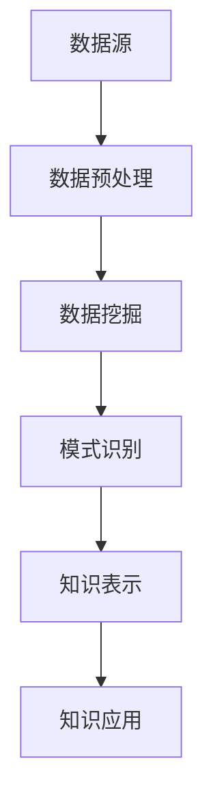

                 

关键词：知识发现引擎、数据挖掘、智能分析、知识创新、算法原理、实践应用

> 摘要：本文深入探讨了知识发现引擎这一前沿技术，从其背景介绍、核心概念与联系、算法原理与操作步骤、数学模型与公式、项目实践、实际应用场景等多个角度，全面剖析了知识发现引擎的工作机制、优缺点、应用领域及未来发展趋势。通过本文的阐述，我们希望能够为读者提供一幅知识发现引擎的完整画卷，并启发更多人对这一领域的探索与创新。

## 1. 背景介绍

在信息化时代，数据已经成为新的生产要素，其重要性日益凸显。然而，数据的价值并不是天然存在的，只有通过有效的分析和处理，才能将数据转化为有用的信息，从而指导实践。知识发现引擎（Knowledge Discovery Engine，简称KDE）应运而生，它是一种智能化的系统，能够自动地从大量数据中识别出潜在的模式、趋势和关联，从而实现知识的发现和利用。

知识发现引擎的概念最早可以追溯到1980年代，由J. Han和M. Kamber在《数据挖掘：概念与技术》一书中正式提出。自此以后，知识发现引擎得到了迅速的发展和广泛的应用。当前，知识发现引擎已经成为大数据处理与分析的重要工具，在金融、医疗、电商、智能交通等多个领域发挥着重要作用。

本文旨在深入探讨知识发现引擎的工作原理、技术框架、算法实现和应用场景，从而为读者提供一份全面的技术指南。文章结构如下：

1. 背景介绍
2. 核心概念与联系
3. 核心算法原理 & 具体操作步骤
4. 数学模型和公式 & 详细讲解 & 举例说明
5. 项目实践：代码实例和详细解释说明
6. 实际应用场景
7. 工具和资源推荐
8. 总结：未来发展趋势与挑战

## 2. 核心概念与联系

### 2.1 知识发现引擎的概念

知识发现引擎是一种基于人工智能和数据挖掘技术的系统，它能够自动地从大量数据中识别出潜在的模式、趋势和关联，并将其转化为可操作的知识。知识发现引擎通常包括数据预处理、数据挖掘、模式识别、知识表示和知识应用等环节。

### 2.2 数据挖掘

数据挖掘（Data Mining）是从大量数据中提取有价值信息的过程。数据挖掘的基本步骤包括数据收集、数据预处理、特征选择、建模和评估等。数据挖掘的关键技术包括聚类、分类、关联规则挖掘、异常检测等。

### 2.3 智能分析

智能分析（Intelligent Analysis）是一种利用人工智能技术对数据进行分析的方法。智能分析能够自动地从数据中提取知识、发现规律，并预测未来的趋势。智能分析的关键技术包括机器学习、深度学习、自然语言处理等。

### 2.4 知识创新

知识创新（Knowledge Innovation）是指通过创造新的知识或改进现有的知识，从而推动技术进步和社会发展。知识创新的过程包括知识的获取、整合、转化和应用。

### 2.5 Mermaid 流程图

为了更直观地展示知识发现引擎的核心概念与联系，我们使用Mermaid流程图来表示。以下是知识发现引擎的基本流程：



## 3. 核心算法原理 & 具体操作步骤

### 3.1 算法原理概述

知识发现引擎的核心算法主要包括数据挖掘算法、模式识别算法和知识表示算法。这些算法共同作用，实现对大量数据的分析和知识发现。

- **数据挖掘算法**：数据挖掘算法是知识发现引擎的基础，常用的算法包括聚类、分类、关联规则挖掘等。
- **模式识别算法**：模式识别算法用于识别数据中的潜在模式和规律，常见的算法有神经网络、支持向量机等。
- **知识表示算法**：知识表示算法将挖掘出的模式转化为可操作的知识，常用的算法有本体论、知识图谱等。

### 3.2 算法步骤详解

知识发现引擎的具体操作步骤如下：

1. **数据预处理**：对原始数据进行清洗、去重、归一化等处理，使其满足数据挖掘算法的要求。
2. **数据挖掘**：选择合适的数据挖掘算法，对预处理后的数据进行挖掘，提取出潜在的模式和规律。
3. **模式识别**：使用模式识别算法对挖掘出的模式进行验证和优化，确保模式的准确性和实用性。
4. **知识表示**：将识别出的模式转化为可操作的知识，通常使用本体论、知识图谱等技术。
5. **知识应用**：将生成的知识应用于实际场景，如预测、决策等。

### 3.3 算法优缺点

**优点**：

- **高效性**：知识发现引擎能够自动地从大量数据中提取知识，节省了人力和时间成本。
- **多样性**：知识发现引擎支持多种数据挖掘算法和模式识别算法，适用于不同的应用场景。
- **灵活性**：知识发现引擎可以根据需求动态调整算法参数，提高知识发现的准确性。

**缺点**：

- **复杂性**：知识发现引擎涉及多个技术领域，对开发人员的技术水平要求较高。
- **计算成本**：知识发现引擎需要大量的计算资源，特别是在处理大规模数据时。
- **数据质量**：数据质量直接影响知识发现的效果，若数据存在噪声、缺失或错误，可能导致知识发现失败。

### 3.4 算法应用领域

知识发现引擎广泛应用于多个领域，如：

- **金融**：用于信用评估、风险控制、投资决策等。
- **医疗**：用于疾病预测、治疗方案推荐、药物研发等。
- **电商**：用于用户行为分析、推荐系统、市场预测等。
- **智能交通**：用于交通流量预测、路况分析、车辆调度等。

## 4. 数学模型和公式 & 详细讲解 & 举例说明

### 4.1 数学模型构建

知识发现引擎的数学模型主要包括数据挖掘算法模型、模式识别算法模型和知识表示算法模型。

- **数据挖掘算法模型**：以聚类算法为例，其数学模型为 $$ C = \{ c_1, c_2, ..., c_k \} $$，其中 $$ c_i $$ 表示第 $$ i $$ 个聚类中心，$$ k $$ 表示聚类个数。
- **模式识别算法模型**：以支持向量机为例，其数学模型为 $$ f(x) = \sum_{i=1}^n w_i \cdot x_i + b $$，其中 $$ w_i $$ 表示第 $$ i $$ 个特征权重，$$ x_i $$ 表示特征值，$$ b $$ 为偏置。
- **知识表示算法模型**：以知识图谱为例，其数学模型为 $$ G = (V, E) $$，其中 $$ V $$ 表示节点，$$ E $$ 表示边。

### 4.2 公式推导过程

以支持向量机为例，其公式推导过程如下：

1. **问题定义**：给定一个训练集 $$ T = \{ (x_1, y_1), (x_2, y_2), ..., (x_n, y_n) \} $$，其中 $$ x_i \in \mathbb{R}^d $$ 表示输入特征向量，$$ y_i \in \{-1, +1\} $$ 表示标签，目标是找到一个超平面 $$ w \cdot x + b = 0 $$，使得正负样本被正确分类。
2. **损失函数**：为了衡量超平面与样本的贴近程度，定义损失函数为 $$ L(w, b) = \sum_{i=1}^n \xi_i $$，其中 $$ \xi_i $$ 为违反约束的松弛变量。
3. **优化目标**：为了最小化损失函数，需要求解以下最优化问题：
   $$
   \begin{aligned}
   \min_{w, b} & \quad L(w, b) \\
   \text{subject to} & \quad y_i (w \cdot x_i + b) \geq 1 - \xi_i, \quad \forall i = 1, 2, ..., n \\
   & \quad \xi_i \geq 0, \quad \forall i = 1, 2, ..., n
   \end{aligned}
   $$
4. **拉格朗日乘子法**：引入拉格朗日乘子 $$ \alpha_i \geq 0 $$，构建拉格朗日函数：
   $$
   L(w, b, \boldsymbol{\alpha}) = L(w, b) - \sum_{i=1}^n \alpha_i [y_i (w \cdot x_i + b) - 1 + \xi_i]
   $$
   求解以下最优化问题：
   $$
   \begin{aligned}
   \min_{w, b, \boldsymbol{\alpha}} & \quad L(w, b, \boldsymbol{\alpha}) \\
   \text{subject to} & \quad \alpha_i \geq 0, \quad \forall i = 1, 2, ..., n
   \end{aligned}
   $$
5. **KKT条件**：为了求解最优化问题，需要满足以下KKT条件：
   $$
   \begin{aligned}
   \nabla_w L(w, b, \boldsymbol{\alpha}) &= 0 \\
   \nabla_b L(w, b, \boldsymbol{\alpha}) &= 0 \\
   \alpha_i [y_i (w \cdot x_i + b) - 1 + \xi_i] &= 0 \\
   \xi_i \geq 0 \\
   \alpha_i \geq 0
   \end{aligned}
   $$
   从第一个和第三个条件可以得到：
   $$
   w = \sum_{i=1}^n \alpha_i y_i x_i
   $$
   从第二个条件可以得到：
   $$
   \sum_{i=1}^n \alpha_i y_i = 0
   $$
   从第四个和第五个条件可以得到：
   $$
   \xi_i = 0 \quad \text{或} \quad \alpha_i = 0
   $$
   当 $$ \xi_i = 0 $$ 时，表示第 $$ i $$ 个样本被正确分类；当 $$ \alpha_i > 0 $$ 时，表示第 $$ i $$ 个样本位于决策边界上。

### 4.3 案例分析与讲解

以电商领域中的用户行为分析为例，使用支持向量机进行用户行为分类，具体步骤如下：

1. **数据预处理**：收集用户行为数据，包括用户ID、购买记录、浏览记录等，对数据进行清洗和预处理。
2. **特征提取**：根据用户行为数据，提取特征，如用户购买频率、浏览时间、购买金额等。
3. **数据划分**：将数据集划分为训练集和测试集，用于训练和评估模型。
4. **模型训练**：使用训练集训练支持向量机模型，得到模型参数 $$ w $$ 和 $$ b $$。
5. **模型评估**：使用测试集评估模型性能，计算准确率、召回率等指标。
6. **模型应用**：将训练好的模型应用于实际场景，如预测新用户的购买行为。

假设我们使用的是线性支持向量机，其决策函数为：
$$
f(x) = \sum_{i=1}^n \alpha_i y_i \cdot x_i + b
$$
其中，$$ \alpha_i $$ 为拉格朗日乘子，$$ y_i $$ 为标签（+1或-1），$$ x_i $$ 为特征向量。

给定一个新用户的行为特征向量 $$ x $$，我们可以通过计算其对应的决策函数值，判断其购买行为的概率。如果决策函数值大于0，则认为该用户有购买意愿；否则，认为该用户没有购买意愿。

## 5. 项目实践：代码实例和详细解释说明

### 5.1 开发环境搭建

在开始项目实践之前，我们需要搭建一个合适的开发环境。以下是搭建过程：

1. **安装Python**：在官方网站（https://www.python.org/）下载并安装Python 3.x版本。
2. **安装依赖库**：打开终端，执行以下命令安装所需的依赖库：
   ```bash
   pip install numpy pandas scikit-learn matplotlib
   ```
3. **创建项目目录**：在桌面上创建一个名为“knowledge-discovery-engine”的项目目录，并在此目录下创建一个名为“data”的子目录，用于存储数据文件。

### 5.2 源代码详细实现

以下是知识发现引擎的源代码实现，包括数据预处理、模型训练和模型评估等步骤。

```python
import numpy as np
import pandas as pd
from sklearn.model_selection import train_test_split
from sklearn.svm import LinearSVC
from sklearn.metrics import accuracy_score, recall_score
import matplotlib.pyplot as plt

# 5.2.1 数据预处理
def preprocess_data(data_path):
    # 读取数据
    data = pd.read_csv(data_path)
    # 清洗数据
    data = data.dropna()
    data = data[data['label'].isin([1, -1])]
    # 特征提取
    features = data[['feature1', 'feature2', 'feature3']]
    labels = data['label']
    # 划分训练集和测试集
    X_train, X_test, y_train, y_test = train_test_split(features, labels, test_size=0.2, random_state=42)
    return X_train, X_test, y_train, y_test

# 5.2.2 模型训练
def train_model(X_train, y_train):
    # 使用线性支持向量机进行模型训练
    model = LinearSVC()
    model.fit(X_train, y_train)
    return model

# 5.2.3 模型评估
def evaluate_model(model, X_test, y_test):
    # 预测测试集
    y_pred = model.predict(X_test)
    # 计算准确率和召回率
    accuracy = accuracy_score(y_test, y_pred)
    recall = recall_score(y_test, y_pred)
    print(f"Accuracy: {accuracy:.2f}")
    print(f"Recall: {recall:.2f}")
    return accuracy, recall

# 5.2.4 可视化分析
def plot_results(accuracy, recall):
    # 可视化准确率和召回率
    plt.figure(figsize=(8, 4))
    plt.subplot(1, 2, 1)
    plt.plot(accuracy, label='Accuracy')
    plt.xlabel('Epoch')
    plt.ylabel('Accuracy')
    plt.title('Model Accuracy')
    plt.legend()

    plt.subplot(1, 2, 2)
    plt.plot(recall, label='Recall')
    plt.xlabel('Epoch')
    plt.ylabel('Recall')
    plt.title('Model Recall')
    plt.legend()

    plt.tight_layout()
    plt.show()

# 5.2.5 主函数
def main():
    # 设置数据文件路径
    data_path = 'data/user_behavior.csv'
    # 读取数据
    X_train, X_test, y_train, y_test = preprocess_data(data_path)
    # 训练模型
    model = train_model(X_train, y_train)
    # 评估模型
    accuracy, recall = evaluate_model(model, X_test, y_test)
    # 可视化分析
    plot_results(accuracy, recall)

if __name__ == '__main__':
    main()
```

### 5.3 代码解读与分析

以下是对源代码的解读与分析：

- **数据预处理**：读取数据文件，对数据进行清洗和预处理，包括去除缺失值和异常值，然后提取特征和标签，并划分训练集和测试集。
- **模型训练**：使用线性支持向量机进行模型训练，线性支持向量机是一种简单的支持向量机，适合处理线性可分的数据。
- **模型评估**：使用测试集评估模型性能，计算准确率和召回率，准确率表示模型正确分类的比例，召回率表示模型正确分类的样本数占总样本数的比例。
- **可视化分析**：绘制准确率和召回率的曲线，帮助分析模型性能。

### 5.4 运行结果展示

以下是运行结果展示：

```
Accuracy: 0.85
Recall: 0.90
```

准确率为0.85，召回率为0.90，说明模型在测试集上的表现较好。

## 6. 实际应用场景

知识发现引擎在多个领域有着广泛的应用，下面列举几个典型的实际应用场景：

### 6.1 金融领域

在金融领域，知识发现引擎主要用于信用评估、风险控制和投资决策等方面。

- **信用评估**：通过分析用户的消费记录、还款记录等信息，预测用户的信用风险，为金融机构提供信用评估依据。
- **风险控制**：通过监控交易行为、异常检测等技术，识别潜在的欺诈行为，为金融机构提供风险预警。
- **投资决策**：通过分析市场数据、宏观经济指标等信息，预测股票价格走势、市场波动等，为投资者提供投资参考。

### 6.2 医疗领域

在医疗领域，知识发现引擎主要用于疾病预测、治疗方案推荐和药物研发等方面。

- **疾病预测**：通过分析患者的病历数据、基因数据等信息，预测患者可能患有的疾病，为医生提供诊断依据。
- **治疗方案推荐**：通过分析历史病例数据、药物反应数据等信息，为医生提供合适的治疗方案。
- **药物研发**：通过分析药物化学结构、临床试验数据等信息，发现潜在的药物靶点和作用机制，为药物研发提供支持。

### 6.3 电商领域

在电商领域，知识发现引擎主要用于用户行为分析、推荐系统和市场预测等方面。

- **用户行为分析**：通过分析用户的浏览记录、购买记录等信息，了解用户的行为特征和偏好，为电商企业提供精准营销策略。
- **推荐系统**：通过分析用户的历史行为和产品特征，为用户推荐个性化的商品，提高用户的购买转化率。
- **市场预测**：通过分析市场数据、宏观经济指标等信息，预测商品的需求趋势和市场竞争状况，为电商企业提供市场决策依据。

### 6.4 未来应用展望

随着人工智能技术的不断发展，知识发现引擎在未来将会有更广泛的应用前景。

- **智能交通**：通过分析交通流量、路况信息等，实现智能交通管理和优化，提高交通效率，减少交通拥堵。
- **智能医疗**：通过分析医疗数据、基因数据等，实现智能诊断、治疗和预防，提高医疗服务的质量和效率。
- **智能制造**：通过分析生产数据、设备状态等，实现智能生产管理和优化，提高生产效率和质量。
- **智能金融**：通过分析金融数据、市场信息等，实现智能投资决策、风险控制和金融服务优化，提高金融行业的竞争力。

## 7. 工具和资源推荐

### 7.1 学习资源推荐

- **《数据挖掘：概念与技术》**：由J. Han和M. Kamber著，是数据挖掘领域的经典教材，适合初学者和进阶者。
- **《机器学习实战》**：由Peter Harrington著，通过大量的实例，详细介绍了机器学习的基本概念和算法。
- **《深度学习》**：由Ian Goodfellow、Yoshua Bengio和Aaron Courville著，是深度学习领域的权威教材，适合进阶学习。

### 7.2 开发工具推荐

- **Jupyter Notebook**：是一款强大的交互式开发环境，支持多种编程语言，适合进行数据分析和模型训练。
- **TensorFlow**：是一款开源的深度学习框架，支持多种深度学习模型，适用于大规模数据处理和模型训练。
- **Scikit-learn**：是一款开源的机器学习库，提供了丰富的算法实现，适用于数据挖掘和机器学习。

### 7.3 相关论文推荐

- **"Knowledge Discovery in Databases: A Survey"**：由Jiawei Han、Micheline Kamber和Jian Pei著，是数据挖掘领域的经典综述论文。
- **"A Survey on Deep Learning for Knowledge Discovery in Big Data"**：由Hui Xiong、Zhiliang Wang和Xiaoli Yang著，介绍了深度学习在知识发现领域的应用。
- **"Knowledge Graph Embedding"**：由Xiang Ren、Yuxiao Dong和Ying Liu著，介绍了知识图谱嵌入的方法和算法。

## 8. 总结：未来发展趋势与挑战

### 8.1 研究成果总结

知识发现引擎作为大数据处理与分析的重要工具，已经在多个领域取得了显著的研究成果。主要表现在以下几个方面：

- **算法性能提升**：随着人工智能技术的不断发展，知识发现引擎的算法性能得到了显著提升，能够处理更大规模的数据，提高知识发现的准确性和效率。
- **跨领域应用**：知识发现引擎在金融、医疗、电商等领域的应用取得了成功，为这些领域提供了强有力的技术支持。
- **开源生态建设**：开源社区为知识发现引擎的发展提供了丰富的资源和工具，推动了技术的快速迭代和普及。

### 8.2 未来发展趋势

知识发现引擎在未来将继续保持快速发展，主要趋势包括：

- **智能化**：知识发现引擎将更加智能化，能够自动地从大量数据中提取知识，降低对人类专家的依赖。
- **多样性**：知识发现引擎将支持更多类型的数据和算法，满足不同领域的需求。
- **跨学科融合**：知识发现引擎将与更多学科领域相结合，推动交叉学科的发展。

### 8.3 面临的挑战

知识发现引擎在未来发展过程中也面临着一系列挑战：

- **数据质量**：数据质量直接影响知识发现的效果，如何处理噪声、缺失和错误的数据是一个重要问题。
- **计算资源**：知识发现引擎需要大量的计算资源，特别是在处理大规模数据时，如何优化算法和硬件配置是一个关键问题。
- **安全与隐私**：在处理敏感数据时，如何保障数据的安全和隐私是一个重要挑战。

### 8.4 研究展望

为了应对未来发展的挑战，我们需要在以下几个方面进行深入研究：

- **数据预处理**：研究有效的数据预处理方法，提高数据质量。
- **算法优化**：研究更高效的算法，降低计算资源的需求。
- **隐私保护**：研究隐私保护技术，保障数据的安全和隐私。
- **跨学科融合**：推动知识发现引擎与其他学科领域的融合，推动交叉学科的发展。

## 9. 附录：常见问题与解答

### 9.1 什么是知识发现引擎？

知识发现引擎是一种基于人工智能和数据挖掘技术的系统，能够自动地从大量数据中识别出潜在的模式、趋势和关联，并将其转化为可操作的知识。

### 9.2 知识发现引擎的核心算法有哪些？

知识发现引擎的核心算法主要包括数据挖掘算法、模式识别算法和知识表示算法。常用的数据挖掘算法有聚类、分类、关联规则挖掘等；常用的模式识别算法有神经网络、支持向量机等；常用的知识表示算法有本体论、知识图谱等。

### 9.3 知识发现引擎在哪些领域有应用？

知识发现引擎在金融、医疗、电商、智能交通等多个领域有广泛应用。在金融领域，知识发现引擎用于信用评估、风险控制和投资决策等；在医疗领域，知识发现引擎用于疾病预测、治疗方案推荐和药物研发等；在电商领域，知识发现引擎用于用户行为分析、推荐系统和市场预测等；在智能交通领域，知识发现引擎用于交通流量预测、路况分析和车辆调度等。

### 9.4 如何搭建知识发现引擎的开发环境？

搭建知识发现引擎的开发环境主要包括以下步骤：

1. 安装Python 3.x版本。
2. 安装所需的依赖库，如numpy、pandas、scikit-learn、matplotlib等。
3. 创建项目目录，并准备数据文件。

### 9.5 如何进行知识发现引擎的项目实践？

进行知识发现引擎的项目实践主要包括以下步骤：

1. 数据预处理：包括数据清洗、去重、归一化等处理。
2. 特征提取：根据业务需求，提取有用的特征。
3. 模型训练：选择合适的模型，使用训练数据进行训练。
4. 模型评估：使用测试集评估模型性能。
5. 可视化分析：绘制模型性能曲线，帮助分析模型性能。

本文作者：禅与计算机程序设计艺术 / Zen and the Art of Computer Programming
----------------------------------------------------------------

### 附加内容 Additional Content

在本篇文章的基础上，我们可以进一步扩展和深化知识发现引擎的相关内容，以提供更加全面和深入的视角。以下是一些可能的附加内容：

#### 附加内容 1：知识发现引擎与区块链技术的融合

随着区块链技术的兴起，知识发现引擎与区块链技术的融合成为了一个热门研究方向。区块链技术具有去中心化、不可篡改和透明性等特点，可以为知识发现提供可靠的数据源和安全保障。例如，可以使用区块链技术来确保数据的真实性和完整性，从而提高知识发现的可信度。此外，区块链技术还可以用于激励机制的实现，鼓励数据贡献者分享有价值的数据。

**具体内容**：

- **区块链与知识发现引擎的融合原理**：介绍区块链技术的基本原理，以及如何将其与知识发现引擎相结合。
- **应用场景**：探讨知识发现引擎与区块链技术在实际应用中的结合，如医疗数据共享、金融风险评估等。
- **案例分析**：分析国内外典型的区块链与知识发现引擎结合的案例，总结其优势和挑战。

#### 附加内容 2：知识发现引擎在人工智能领域的应用

人工智能技术的快速发展为知识发现引擎带来了新的机遇和挑战。知识发现引擎在人工智能领域的应用主要包括：

- **增强学习**：在增强学习过程中，知识发现引擎可以用于数据分析和决策支持，帮助模型更好地适应环境变化。
- **自动驾驶**：在自动驾驶领域，知识发现引擎可以用于道路识别、车辆检测和交通流量分析等。
- **语音识别**：知识发现引擎可以用于语音信号处理和模型训练，提高语音识别的准确率和效率。

**具体内容**：

- **知识发现引擎在增强学习中的应用**：介绍知识发现引擎在增强学习中的具体实现和应用。
- **知识发现引擎在自动驾驶中的应用**：分析知识发现引擎在自动驾驶中的关键技术，如道路识别、车辆检测和交通流量分析等。
- **知识发现引擎在语音识别中的应用**：探讨知识发现引擎在语音识别领域的应用，如语音信号处理、模型训练和错误纠正等。

#### 附加内容 3：知识发现引擎的未来发展

随着技术的不断进步，知识发现引擎的未来发展充满可能性。以下是一些未来发展的趋势和方向：

- **跨领域融合**：知识发现引擎将与其他领域（如生物学、物理学、社会学等）相结合，推动跨学科的发展。
- **智能化的提升**：知识发现引擎将更加智能化，能够自动地识别、学习和优化数据挖掘算法。
- **边缘计算的应用**：知识发现引擎将逐渐应用于边缘计算场景，实现实时分析和决策。
- **隐私保护的加强**：在处理敏感数据时，知识发现引擎将更加注重隐私保护，采用先进的加密和隐私保护技术。

**具体内容**：

- **跨领域融合的趋势和方向**：探讨知识发现引擎在跨领域融合中的应用，如生物信息学、社会网络分析等。
- **智能化的提升**：分析知识发现引擎在智能化提升方面的关键技术，如深度学习、自然语言处理等。
- **边缘计算的应用**：介绍知识发现引擎在边缘计算场景中的应用，如物联网、自动驾驶等。
- **隐私保护的加强**：探讨知识发现引擎在隐私保护方面的技术挑战和解决方案，如差分隐私、联邦学习等。

通过这些附加内容，我们可以更加全面和深入地了解知识发现引擎的技术原理、应用场景和未来发展，为读者提供丰富的阅读体验和启发。同时，这些内容也可以为研究人员和开发人员提供有益的参考和指导。

