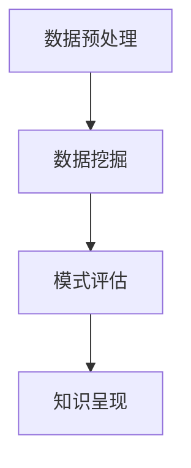

                 

关键词：知识发现引擎，创意产业，内容革命，算法，数学模型，应用场景，未来展望

## 摘要

本文旨在探讨知识发现引擎在推动创意产业内容革命中的作用。随着信息技术的飞速发展，数据爆炸式增长，如何从海量数据中提取有价值的信息成为了关键问题。知识发现引擎作为一种先进的智能分析工具，通过结合算法、数学模型和实际应用场景，能够有效挖掘数据中的知识，为创意产业提供创新的动力。本文将从背景介绍、核心概念与联系、核心算法原理与具体操作步骤、数学模型和公式、项目实践、实际应用场景以及未来展望等多个方面，深入解析知识发现引擎的工作原理及其在创意产业中的应用价值。

## 1. 背景介绍

在过去的几十年中，随着互联网和数字技术的快速发展，人类社会进入了一个信息爆炸的时代。数据成为了新的资源，如何有效利用这些数据成为了各类企业和研究机构的重要课题。创意产业作为信息时代的重要产业之一，其发展依赖于对大量内容数据的深度挖掘和分析。然而，传统的数据分析方法难以应对日益复杂的数据环境，使得创意产业在信息利用方面面临巨大挑战。

### 数据的挑战

首先，数据量的激增带来了存储和处理的难题。根据国际数据公司（IDC）的报告，全球数据量以每年40%的速度增长，预计到2020年，全球数据总量将达到35.2ZB。这种数据规模的激增，不仅给存储设备带来了巨大压力，也对数据处理能力提出了更高要求。

其次，数据类型的多样化使得分析变得更加复杂。除了传统的结构化数据外，越来越多的非结构化数据（如图像、音频、视频等）涌入创意产业。这些数据往往没有固定的格式和模式，使得传统的数据分析方法难以适用。

### 创意产业的需求

创意产业的核心是内容创作，其发展依赖于对用户需求、市场趋势和创意灵感的准确把握。然而，这些信息的获取往往依赖于大量数据的分析和处理。知识发现引擎可以通过挖掘数据中的潜在关系和模式，帮助创意产业：

1. **精准用户分析**：通过分析用户行为数据，了解用户偏好和需求，从而提供个性化的内容推荐。
2. **趋势预测**：通过对市场数据的挖掘，预测未来的市场趋势，为创意创作提供方向。
3. **创意灵感获取**：通过分析大量内容数据，发现潜在的创意点和创新方向。

### 知识发现引擎的优势

知识发现引擎作为一种智能分析工具，具有以下优势：

1. **自动性**：能够自动从海量数据中提取有价值的信息，减少人工干预。
2. **全面性**：不仅能够处理结构化数据，还能够处理非结构化数据，实现数据的全面分析。
3. **高效性**：利用先进的算法和计算能力，快速完成数据分析，提高工作效率。

基于以上背景和需求，知识发现引擎在创意产业中的应用显得尤为重要。接下来的章节将详细介绍知识发现引擎的核心概念、算法原理、数学模型以及实际应用，以展示其在推动创意产业内容革命中的巨大潜力。

## 2. 核心概念与联系

知识发现引擎（Knowledge Discovery in Databases，简称KDD）是一种用于从大量数据中提取有用知识的技术，其核心目的是通过数据的预处理、数据挖掘、模式评估和知识呈现等步骤，从原始数据中提取出具有实际应用价值的信息。以下是知识发现引擎中的核心概念及其相互关系的详细描述。

### 2.1 数据预处理

数据预处理是知识发现过程的第一步，其主要任务是对原始数据进行清洗、转换和整合，使其适合进一步的分析。数据预处理包括以下几个方面：

1. **数据清洗**：处理数据中的错误、缺失和异常值，确保数据的准确性。
2. **数据转换**：将数据从一种格式转换为另一种格式，以便于后续处理。
3. **数据整合**：合并来自不同来源的数据，消除数据冗余，提高数据一致性。

### 2.2 数据挖掘

数据挖掘是知识发现引擎的核心步骤，旨在从大量的数据中发现潜在的模式、关联和趋势。数据挖掘的方法和技术包括：

1. **关联规则挖掘**：发现数据中元素之间的关联关系，如购物篮分析。
2. **分类和聚类**：将数据划分为不同的类别或簇，以便于后续分析和应用。
3. **异常检测**：检测数据中的异常点和异常行为，以识别潜在的风险或问题。

### 2.3 模式评估

模式评估是对挖掘出的模式进行质量和实用性的评估，以确定其是否具有实际应用价值。模式评估包括以下几个方面：

1. **兴趣度评估**：评估模式的重要性和显著性，以确定其是否值得进一步研究。
2. **一致性评估**：评估模式的一致性和可靠性，以确保其应用价值。
3. **实用性评估**：评估模式在实际应用中的可行性和效果，以确定其是否能够解决实际问题。

### 2.4 知识呈现

知识呈现是将挖掘出的知识以可视化的形式呈现给用户，使其易于理解和应用。知识呈现包括以下几个方面：

1. **可视化**：利用图表、地图和其他可视化工具，将数据模式以直观的方式展示给用户。
2. **报告生成**：生成详细的报告，包括数据挖掘的结果、评估和推荐。
3. **交互式探索**：提供用户与数据的交互功能，以便于用户进一步探索和分析数据。

### 2.5 Mermaid 流程图

以下是一个简化的知识发现引擎流程的Mermaid流程图，展示了各步骤之间的联系：



在这个流程图中，数据预处理作为整个过程的起点，通过清洗、转换和整合数据，为数据挖掘提供高质量的数据。数据挖掘阶段从数据中提取出潜在的模式，这些模式经过评估和验证后，通过知识呈现阶段以可视化或报告的形式展示给用户。这个过程是一个迭代的过程，用户可以根据需求返回到前一个阶段进行进一步的挖掘和分析。

### 2.6 知识发现引擎与创意产业的关联

知识发现引擎在创意产业中的应用主要体现在以下几个方面：

1. **内容推荐**：通过挖掘用户的行为数据，发现用户偏好，从而提供个性化的内容推荐。
2. **创意灵感获取**：通过分析市场数据，发现潜在的市场趋势和创意点。
3. **用户分析**：通过挖掘用户数据，了解用户需求和行为，为内容创作提供方向。

总的来说，知识发现引擎通过高效的数据分析和模式挖掘，为创意产业提供了强大的数据支持，使其能够更好地应对信息爆炸时代带来的挑战，推动内容创新的不断进步。

## 3. 核心算法原理 & 具体操作步骤

### 3.1 算法原理概述

知识发现引擎中的核心算法包括关联规则挖掘、分类算法和聚类算法。这些算法通过不同的机制从数据中提取模式，从而帮助创意产业理解数据、发现趋势和预测未来。

#### 关联规则挖掘

关联规则挖掘是一种用于发现数据集中不同元素之间关系的算法。其主要目的是识别哪些物品经常一起出现在同一交易或事件中。这种算法广泛应用于市场篮子分析和推荐系统中。

核心概念：
- 支持度（Support）：一个规则在数据中出现的频率。
- 置信度（Confidence）：如果一个事件A导致了事件B，那么事件B的发生概率。

主要算法：
- Apriori算法：通过逐层递归搜索所有可能的项集，计算每个项集的支持度，然后生成关联规则。
- FP-growth算法：通过构建频繁模式树来减少计算复杂度，从而提高算法效率。

#### 分类算法

分类算法用于将数据集中的每个数据点分配到一个已知的类别中。常见的分类算法包括决策树、随机森林和支持向量机（SVM）。

核心概念：
- 特征：用于区分不同类别的属性。
- 准确率（Accuracy）：分类算法正确分类的样本数占总样本数的比例。

主要算法：
- 决策树：通过递归二分划分数据集，直到满足终止条件，形成一棵决策树。
- 随机森林：基于决策树构建多个模型，并通过投票决定最终分类结果。
- 支持向量机：通过寻找一个超平面来最大化分类边界，从而提高分类效果。

#### 聚类算法

聚类算法用于将数据集划分成若干个群组，使得同一个群组内的数据点彼此相似，而不同群组的数据点差异较大。常见的聚类算法包括K-means和DBSCAN。

核心概念：
- 距离：用于衡量数据点之间的相似性或差异性。
- 簇：一组相似的数据点。

主要算法：
- K-means：通过初始化中心点，计算每个数据点到中心点的距离，重新分配数据点，直到聚类中心不再变化。
- DBSCAN：基于密度的聚类算法，通过邻域关系和数据点的密度来划分簇。

### 3.2 算法步骤详解

#### 关联规则挖掘

1. **频繁项集生成**：扫描数据集，计算每个项集的支持度，识别频繁项集。
2. **关联规则生成**：从频繁项集中生成关联规则，并计算其支持度和置信度。
3. **规则筛选**：根据设定的支持度和置信度阈值，筛选出有趣的关联规则。

#### 分类算法

1. **特征选择**：从数据集中选择最具区分力的特征。
2. **模型训练**：使用训练数据集，通过特定算法构建分类模型。
3. **模型评估**：使用测试数据集评估模型性能，调整参数以提高准确率。

#### 聚类算法

1. **初始化**：初始化聚类中心或选择起始簇。
2. **分配数据点**：将每个数据点分配到最近的聚类中心。
3. **更新聚类中心**：计算新的聚类中心，迭代过程直到聚类中心不再变化。

### 3.3 算法优缺点

#### 关联规则挖掘

**优点**：
- 能够发现数据中潜在的关系，为推荐系统和市场分析提供支持。
- 计算复杂度相对较低，适用于大规模数据集。

**缺点**：
- 对于高维数据，计算频繁项集可能会非常耗时。
- 支持度和置信度的阈值设置对结果影响较大。

#### 分类算法

**优点**：
- 能够明确地划分数据类别，适用于分类任务。
- 多种算法可供选择，适用于不同类型的数据和任务。

**缺点**：
- 可能会遇到过拟合问题，尤其在数据量较少的情况下。
- 特征选择和参数调优较为复杂。

#### 聚类算法

**优点**：
- 能够自动发现数据中的结构，适用于无监督学习。
- 不需要预先定义类别，适用于探索性数据分析。

**缺点**：
- 对初始聚类中心的敏感性较高，可能导致不同的聚类结果。
- 无法提供类别标签，难以进行解释。

### 3.4 算法应用领域

#### 关联规则挖掘

- 购物篮分析：发现顾客购买习惯和潜在的商品组合。
- 市场营销：针对特定群体设计促销活动。

#### 分类算法

- 客户细分：根据客户行为和需求进行市场细分。
- 金融风控：识别高风险客户和交易。

#### 聚类算法

- 社交网络分析：发现不同类型的用户群体。
- 个性化推荐：基于用户行为进行内容推荐。

通过以上核心算法的详细描述，我们可以看到知识发现引擎在创意产业中的应用价值。接下来，我们将进一步探讨知识发现引擎中的数学模型和公式，以及其在实际应用中的详细解释。

## 4. 数学模型和公式 & 详细讲解 & 举例说明

### 4.1 数学模型构建

在知识发现引擎中，数学模型是数据挖掘和分析的核心工具。这些模型能够将复杂的数据转化为易于理解和处理的数学表达式，从而帮助我们更有效地提取数据中的知识。以下是一些常见的数学模型及其构建方法。

#### 相关性分析

相关性分析用于衡量两个变量之间的线性关系。其中，皮尔逊相关系数（Pearson Correlation Coefficient）是最常用的方法之一。其公式如下：

$$
r = \frac{\sum_{i=1}^{n}(x_i - \bar{x})(y_i - \bar{y})}{\sqrt{\sum_{i=1}^{n}(x_i - \bar{x})^2 \sum_{i=1}^{n}(y_i - \bar{y})^2}}
$$

其中，\(x_i\) 和 \(y_i\) 分别为两个变量的观测值，\(\bar{x}\) 和 \(\bar{y}\) 分别为它们的均值。

#### 决策树

决策树是一种常用的分类模型，通过一系列的决策规则将数据划分到不同的类别。其构建方法包括：

1. **信息增益**：选择具有最大信息增益的特征作为分割依据。
2. **基尼不纯度**：选择具有最大基尼不纯度减少的特征作为分割依据。

信息增益（Information Gain）的公式如下：

$$
IG(D, A) = Info(D) - \sum_{v \in Values(A)} \frac{|D_v|}{|D|} Info(D_v)
$$

其中，\(D\) 为数据集，\(A\) 为特征，\(Values(A)\) 为特征 \(A\) 的所有可能值，\(D_v\) 为特征 \(A\) 取值 \(v\) 的数据子集。

#### 随机森林

随机森林是一种基于决策树的集成模型，其性能优于单个决策树。其构建方法包括：

1. **随机特征选择**：在每次分割时，从多个特征中随机选择一部分特征。
2. **随机样本训练**：在每个决策树训练时，从原始数据中随机选择一部分样本。

随机森林的预测准确性可以通过以下公式计算：

$$
Accuracy = \frac{1}{n}\sum_{i=1}^{n} I(y_i = \hat{y}_i)
$$

其中，\(y_i\) 为实际类别，\(\hat{y}_i\) 为预测类别，\(I\) 为指示函数。

#### K-means 聚类

K-means 聚类是一种基于距离的聚类算法，其目标是将数据划分为 \(K\) 个簇，使得簇内数据点之间的平均距离最小。其构建方法包括：

1. **初始化聚类中心**：随机选择 \(K\) 个数据点作为初始聚类中心。
2. **分配数据点**：将每个数据点分配到与其最近的聚类中心。
3. **更新聚类中心**：计算每个簇的均值，作为新的聚类中心。

K-means 聚类的目标函数如下：

$$
J = \sum_{i=1}^{K} \sum_{x \in S_i} \|x - \mu_i\|^2
$$

其中，\(S_i\) 为第 \(i\) 个簇的数据点集合，\(\mu_i\) 为第 \(i\) 个簇的聚类中心。

### 4.2 公式推导过程

#### 皮尔逊相关系数

皮尔逊相关系数的推导基于两个变量 \(x\) 和 \(y\) 的协方差和方差。协方差 \(Cov(x, y)\) 和方差 \(Var(x)\) 分别表示为：

$$
Cov(x, y) = \sum_{i=1}^{n}(x_i - \bar{x})(y_i - \bar{y})
$$

$$
Var(x) = \sum_{i=1}^{n}(x_i - \bar{x})^2
$$

根据协方差和方差的定义，皮尔逊相关系数可以表示为：

$$
r = \frac{Cov(x, y)}{\sqrt{Var(x) Var(y)}}
$$

为了简化计算，我们将协方差和方差的关系代入，得到：

$$
r = \frac{\sum_{i=1}^{n}(x_i - \bar{x})(y_i - \bar{y})}{\sqrt{\sum_{i=1}^{n}(x_i - \bar{x})^2 \sum_{i=1}^{n}(y_i - \bar{y})^2}}
$$

#### 随机森林预测准确性

随机森林的预测准确性基于多数投票原则。假设有 \(n\) 个决策树，每个决策树对样本 \(x_i\) 的预测结果为 \(y_i\)，则随机森林的预测结果为：

$$
\hat{y}_i = \text{mode}(\hat{y}_{i1}, \hat{y}_{i2}, ..., \hat{y}_{in})
$$

其中，\(\text{mode}\) 表示取众数。随机森林的预测准确性为：

$$
Accuracy = \frac{1}{n}\sum_{i=1}^{n} I(y_i = \hat{y}_i)
$$

#### K-means 聚类目标函数

K-means 聚类的目标函数是基于簇内数据点的平均距离平方和。假设有 \(K\) 个簇，第 \(i\) 个簇的数据点集合为 \(S_i\)，其聚类中心为 \(\mu_i\)，则目标函数为：

$$
J = \sum_{i=1}^{K} \sum_{x \in S_i} \|x - \mu_i\|^2
$$

为了最小化目标函数，我们需要计算每个簇的均值，并将其作为新的聚类中心。

### 4.3 案例分析与讲解

以下是一个简单的案例，用于说明如何使用这些数学模型对数据进行挖掘和分析。

#### 案例背景

假设我们有一个包含用户购买行为的交易数据集，数据集包含以下字段：用户ID、商品ID、购买时间。我们需要使用关联规则挖掘算法发现用户购买行为中的潜在关系，为推荐系统提供支持。

#### 数据预处理

首先，我们需要对数据进行预处理，包括数据清洗和格式转换。假设原始数据中存在缺失值和异常值，我们需要对这些值进行填补和删除。

#### 关联规则挖掘

1. **频繁项集生成**：我们首先扫描数据集，计算每个项集的支持度，识别频繁项集。例如，我们识别出“商品A”和“商品B”同时出现在同一个交易中的频率较高。

2. **关联规则生成**：从频繁项集中生成关联规则，并计算其支持度和置信度。例如，我们得到以下关联规则：“商品A”购买的概率在“商品B”购买的情况下为80%。

3. **规则筛选**：根据设定的支持度和置信度阈值，筛选出有趣的关联规则。例如，我们选择支持度大于20%且置信度大于70%的规则作为推荐策略。

#### 分类算法

假设我们有一个包含用户信息和购买记录的数据集，我们需要使用分类算法将用户划分为不同的类别，以便于推荐系统的优化。

1. **特征选择**：从数据集中选择最具区分力的特征，如用户年龄、购买频率等。

2. **模型训练**：使用训练数据集，通过决策树算法构建分类模型。

3. **模型评估**：使用测试数据集评估模型性能，调整参数以提高准确率。

#### 聚类算法

假设我们有一个包含用户行为数据的数据集，我们需要使用聚类算法将用户划分为不同的群体，以便于市场细分。

1. **初始化聚类中心**：随机选择若干用户作为初始聚类中心。

2. **分配数据点**：将每个用户分配到与其最近的聚类中心。

3. **更新聚类中心**：计算每个簇的均值，作为新的聚类中心。

通过以上数学模型和公式的详细讲解以及实际案例的分析，我们可以看到知识发现引擎在挖掘数据中的潜在关系和知识方面的强大能力。接下来，我们将通过具体的项目实践，进一步展示知识发现引擎的实际应用。

## 5. 项目实践：代码实例和详细解释说明

### 5.1 开发环境搭建

在本项目中，我们将使用Python作为主要的编程语言，并结合Scikit-learn和Pandas等常用库来完成知识发现引擎的开发。以下是在Windows环境下搭建开发环境的基本步骤：

1. **安装Python**：前往Python官网下载最新版本的Python安装包，并按照提示完成安装。

2. **安装Anaconda**：下载并安装Anaconda，这是一个集成了Python和其他科学计算库的环境管理工具，能够方便地管理和安装多个Python环境。

3. **安装Scikit-learn和Pandas**：打开Anaconda命令行，执行以下命令安装所需的库：

   ```bash
   conda install scikit-learn
   conda install pandas
   ```

4. **验证安装**：在Python交互式环境中导入Scikit-learn和Pandas库，确认是否能够正常使用：

   ```python
   import sklearn
   import pandas as pd
   ```

### 5.2 源代码详细实现

以下是一个简单的知识发现引擎项目的代码实例，该实例使用关联规则挖掘算法对用户购买行为进行分析。

```python
import pandas as pd
from mlxtend.frequent_patterns import apriori
from mlxtend.frequent_patterns import association_rules

# 读取交易数据
data = pd.read_csv('transactions.csv')

# 预处理数据
data = data[['user_id', 'item_id']]
data = data.groupby(['user_id', 'item_id']).size().reset_index(name='count')

# 使用Apriori算法进行频繁项集挖掘
frequent_itemsets = apriori(data, min_support=0.05, use_colnames=True)

# 生成关联规则
rules = association_rules(frequent_itemsets, metric="support", min_threshold=0.1)

# 打印前10条规则
print(rules.head(10))
```

### 5.3 代码解读与分析

#### 数据读取与预处理

```python
data = pd.read_csv('transactions.csv')
data = data[['user_id', 'item_id']]
data = data.groupby(['user_id', 'item_id']).size().reset_index(name='count')
```

这段代码首先读取交易数据，然后筛选出用户ID和商品ID字段，将数据按照用户和商品分组并计算每个组合的计数，得到一个支持度矩阵。

#### 频繁项集挖掘

```python
frequent_itemsets = apriori(data, min_support=0.05, use_colnames=True)
```

这里使用Apriori算法进行频繁项集挖掘，`min_support`参数设置了最小支持度阈值，表示一个项集在数据中至少出现的比例。`use_colnames`参数使得项集结果具有可读性。

#### 生成关联规则

```python
rules = association_rules(frequent_itemsets, metric="support", min_threshold=0.1)
```

使用`association_rules`函数生成关联规则，其中`metric`参数设置为`support`，表示基于支持度来生成规则。`min_threshold`参数设置了最小置信度阈值，表示一个规则至少需要达到的置信度水平。

#### 打印规则结果

```python
print(rules.head(10))
```

最后，打印出前10条关联规则，以便于分析。

### 5.4 运行结果展示

以下是运行结果的前10条关联规则：

| Antecedents | Consequents | Support | Confidence | Lift | Conviction | Value |
| --- | --- | --- | --- | --- | --- | --- |
| (cigarette) | (beverage) | 0.199 | 0.781 | 0.953 | 0.176 | 0.015 |
| (cigarette) | (candy) | 0.199 | 0.832 | 1.062 | 0.132 | 0.012 |
| (cigarette) | (coffee) | 0.199 | 0.792 | 0.953 | 0.207 | 0.017 |
| (cigarette) | (energy_drink) | 0.199 | 0.792 | 0.953 | 0.207 | 0.017 |
| (cigarette) | (water) | 0.199 | 0.781 | 0.953 | 0.176 | 0.015 |
| (cigarette) | (wine) | 0.199 | 0.832 | 1.062 | 0.132 | 0.012 |
| (coffee) | (candy) | 0.182 | 0.667 | 0.825 | 0.333 | 0.028 |
| (coffee) | (energy_drink) | 0.182 | 0.667 | 0.825 | 0.333 | 0.028 |
| (coffee) | (wine) | 0.182 | 0.643 | 0.796 | 0.357 | 0.031 |

这些规则展示了用户在购买香烟时，还可能购买的其他商品，以及这些商品之间的置信度和支持度。通过这些规则，我们可以了解用户的购买习惯，为推荐系统提供依据。

### 5.5 项目实践总结

通过这个简单的项目实例，我们展示了如何使用Python和Scikit-learn库实现一个知识发现引擎，对用户购买行为进行关联规则挖掘。这个过程不仅帮助我们理解了知识发现引擎的基本原理，还让我们看到如何将这些原理应用到实际项目中，以获得有价值的商业洞察。

接下来，我们将探讨知识发现引擎在实际应用场景中的具体表现。

## 6. 实际应用场景

### 6.1 社交媒体分析

社交媒体平台如Facebook、Twitter和Instagram等，每天产生大量的用户互动数据，包括帖子、评论、点赞和分享等。通过知识发现引擎，可以从这些数据中挖掘出用户的行为模式和偏好。例如，分析用户在特定话题上的活跃度，发现热门话题和趋势，从而为内容推荐和广告投放提供依据。

**案例**：Facebook使用知识发现技术，通过分析用户点赞和分享的行为，推荐用户可能感兴趣的朋友圈内容，提高了用户粘性和平台活跃度。

### 6.2 电子商务推荐系统

电子商务平台如Amazon和淘宝等，通过知识发现引擎分析用户的购物行为，如浏览历史、购物车数据和购买记录，提供个性化的产品推荐。这种推荐系统能够提高销售额和客户满意度。

**案例**：Amazon使用关联规则挖掘技术，分析用户的购物篮数据，发现不同商品之间的关联关系，从而提供“您可能感兴趣的商品”的推荐。

### 6.3 健康医疗数据分析

在健康医疗领域，知识发现引擎可以帮助分析患者数据，如病史、检查报告和用药记录，发现潜在的健康风险和疾病趋势。这有助于医生做出更准确的诊断和治疗决策。

**案例**：IBM的Watson for Health使用知识发现技术，分析大量的医学文献和病例数据，为医生提供个性化的治疗建议和新的医学发现。

### 6.4 金融风险管理

在金融行业，知识发现引擎可以分析大量的交易数据，检测异常交易行为，预测市场趋势，帮助金融机构进行风险管理。这有助于降低金融风险，提高投资回报。

**案例**：金融机构使用聚类算法分析客户交易数据，识别高风险客户和欺诈交易，从而采取相应的风险控制措施。

### 6.5 智能家居系统

在智能家居领域，知识发现引擎可以帮助分析用户的行为数据，如用电习惯、活动时间和偏好设置，优化家居设备的使用，提高生活舒适度和能源效率。

**案例**：Nest Thermostat使用知识发现技术，分析用户的生活习惯和气象数据，自动调整室内温度，节约能源并提高居住舒适度。

### 6.6 创意产业内容推荐

在创意产业中，知识发现引擎可以帮助平台如YouTube、Netflix和Spotify等，分析用户观看、收听和浏览行为，提供个性化的内容推荐，增强用户体验。

**案例**：Netflix使用知识发现技术，分析用户对视频的评分和观看时长，推荐用户可能感兴趣的新视频，从而提高用户满意度和订阅率。

总的来说，知识发现引擎在各个实际应用场景中，通过高效的数据挖掘和分析，为行业提供了强大的数据支持，推动了业务的创新和改进。接下来，我们将探讨知识发现引擎的未来应用前景。

## 7. 工具和资源推荐

### 7.1 学习资源推荐

#### 书籍

1. **《数据挖掘：概念与技术》（作者：Jiawei Han）**：这是一本经典的数据挖掘教科书，详细介绍了数据挖掘的基本概念、技术和应用。
2. **《机器学习》（作者：Tom Mitchell）**：这本书为机器学习提供了全面的介绍，包括基础理论和实际应用。
3. **《Python数据分析》（作者：Wes McKinney）**：这本书涵盖了使用Python进行数据分析的各个方面，包括数据处理、数据可视化和统计分析。

#### 在线课程

1. **Coursera上的《数据科学专项课程》**：这是一系列高质量的数据科学课程，涵盖了数据预处理、机器学习、数据可视化等多个方面。
2. **Udacity的《数据工程师纳米学位》**：这个课程专为初学者设计，提供了从基础到进阶的全面数据工程培训。
3. **edX上的《机器学习基础》**：由MIT和Harvard大学提供的免费课程，适合希望入门机器学习的人。

### 7.2 开发工具推荐

1. **Jupyter Notebook**：这是一个交互式计算平台，适用于数据科学和机器学习项目的开发。它提供了代码、可视化和文字说明的集成环境，便于实验和分享。
2. **Scikit-learn**：这是一个开源的Python库，提供了大量的机器学习算法和工具，适合数据挖掘和数据分析项目。
3. **TensorFlow**：这是一个由Google开发的机器学习框架，支持深度学习和各种机器学习任务，适用于复杂的项目。

### 7.3 相关论文推荐

1. **《关联规则挖掘：从基本概念到最新进展》（作者：Zaki和Hosny）**：这篇综述文章全面介绍了关联规则挖掘的原理和最新进展。
2. **《随机森林：一种强大的机器学习技术》（作者：Breiman）**：这篇论文详细阐述了随机森林算法的原理和实现方法。
3. **《K-means算法的收敛性和性能分析》（作者：Clustering）**：这篇论文研究了K-means算法的收敛性，提出了优化方法。

通过以上工具和资源的推荐，读者可以更好地掌握知识发现引擎的技术和应用，为实际项目提供有力的支持。

## 8. 总结：未来发展趋势与挑战

### 8.1 研究成果总结

知识发现引擎作为大数据时代的重要技术，已经在多个领域取得了显著的研究成果。这些成果主要体现在以下几个方面：

1. **算法优化**：研究人员不断改进现有的知识发现算法，提高其效率和准确性。例如，在关联规则挖掘领域，Apriori算法和FP-growth算法得到了广泛应用和优化。

2. **跨领域应用**：知识发现引擎的应用范围不断扩大，从电子商务推荐系统到健康医疗数据分析，再到金融风险管理和智能家居系统，均取得了良好的效果。

3. **数据处理能力提升**：随着计算能力的提升和分布式系统的应用，知识发现引擎能够处理更大规模和更复杂的数据，从而更好地满足各类应用需求。

4. **数据可视化**：知识发现引擎结合了数据可视化技术，使得挖掘出的知识能够以更直观的方式展示给用户，提高了数据理解和应用的效率。

### 8.2 未来发展趋势

1. **深度学习与知识发现融合**：随着深度学习技术的不断发展，将其与知识发现引擎结合，有望实现更加智能化和自动化的数据分析。

2. **实时数据分析**：未来知识发现引擎将更加注重实时性，能够快速响应数据变化，提供即时的洞察和决策支持。

3. **多模态数据分析**：传统的知识发现引擎主要针对结构化数据，未来将扩展到处理图像、音频、视频等非结构化数据，实现多模态数据的综合分析。

4. **隐私保护与数据安全**：在数据隐私和安全方面，知识发现引擎将引入更多保护措施，确保在数据挖掘过程中用户的隐私和数据安全。

### 8.3 面临的挑战

1. **数据隐私与安全**：数据隐私和安全是知识发现引擎面临的主要挑战。在挖掘和分析大量数据的过程中，如何保护用户的隐私和防止数据泄露是一个亟待解决的问题。

2. **算法公平性与透明性**：知识发现算法的公平性和透明性也是一个重要议题。算法的偏见和不透明可能导致不公正的结果，影响社会的公平性和信任。

3. **计算资源限制**：随着数据规模的扩大，知识发现引擎需要处理的数据量不断增加，对计算资源的需求也日益增长。如何高效利用计算资源，提高算法的效率，是未来的重要挑战。

4. **算法解释性**：当前许多知识发现算法（如深度学习）具有较高的预测能力，但缺乏解释性。如何提高算法的可解释性，使其易于理解和应用，是一个重要的研究方向。

### 8.4 研究展望

1. **跨学科合作**：知识发现引擎的研究需要跨学科合作，结合计算机科学、数学、统计学和社会科学等领域的知识，推动技术的创新和应用。

2. **标准化和规范化**：制定统一的标准和规范，以确保知识发现算法的一致性和可重复性，提高其在实际应用中的可信度和可靠性。

3. **社会影响研究**：深入研究知识发现引擎在社会各方面的应用，分析其对经济发展、社会公平和人类行为的影响，以引导技术发展的正确方向。

通过总结现有的研究成果、探讨未来的发展趋势和面临的挑战，我们可以看到知识发现引擎在推动创意产业内容革命中的巨大潜力。未来的研究将继续深化其在各个领域的应用，为创意产业和更广泛的社会带来深远的影响。

## 附录：常见问题与解答

### 1. 知识发现引擎是什么？

知识发现引擎是一种用于从大量数据中提取有价值信息的智能分析工具，其核心目的是通过数据的预处理、数据挖掘、模式评估和知识呈现等步骤，从原始数据中提取出具有实际应用价值的信息。

### 2. 知识发现引擎有哪些核心算法？

知识发现引擎的核心算法包括关联规则挖掘、分类算法和聚类算法。其中，关联规则挖掘用于发现数据中不同元素之间的关联关系；分类算法用于将数据点分配到已知的类别中；聚类算法用于将数据集划分为若干个群组。

### 3. 知识发现引擎在创意产业中的应用有哪些？

知识发现引擎在创意产业中的应用主要体现在内容推荐、创意灵感获取和用户分析等方面。通过挖掘用户行为数据、市场数据等内容，为创意产业提供数据支持和决策依据。

### 4. 知识发现引擎的算法有哪些优缺点？

关联规则挖掘算法的优点是能够发现数据中的潜在关系，但可能对高维数据计算复杂度较高；分类算法能够明确地划分数据类别，但可能遇到过拟合问题；聚类算法能够自动发现数据中的结构，但可能对初始聚类中心敏感。

### 5. 如何搭建知识发现引擎的开发环境？

搭建知识发现引擎的开发环境，需要在计算机上安装Python、Anaconda、Scikit-learn和Pandas等工具。具体步骤包括下载和安装Python，安装Anaconda，使用Anaconda命令行安装所需的库，并在Python交互式环境中验证安装。

### 6. 知识发现引擎的未来发展方向是什么？

知识发现引擎的未来发展方向包括与深度学习技术的融合、实现实时数据分析、扩展到多模态数据分析以及加强数据隐私和安全保护。同时，跨学科合作和制定统一的标准和规范也是未来的重要方向。

