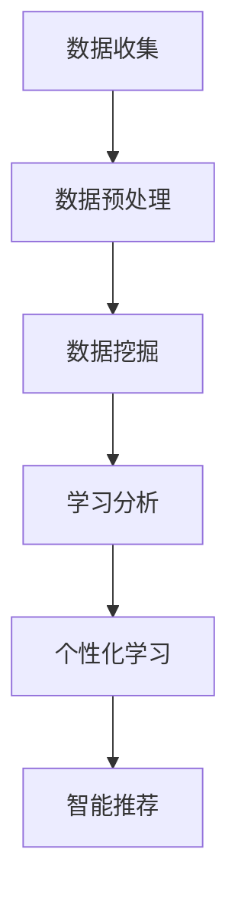

                 

 **关键词：** 知识发现引擎，教育技术，人工智能，学习分析，个性化学习，数据挖掘。

**摘要：** 本文探讨了知识发现引擎在教育领域的应用，通过引入人工智能技术和学习分析，实现个性化学习路径的优化，提高教育质量与效率。文章将介绍知识发现引擎的核心概念、原理、算法，以及实际应用场景，并对其未来发展趋势和面临的挑战进行展望。

## 1. 背景介绍

在信息爆炸的时代，教育面临着前所未有的挑战。传统的教育模式已经无法满足现代学生的学习需求，如何让每个学生都能获得最适合自己的学习资源和服务，成为了教育领域亟待解决的问题。知识发现引擎（Knowledge Discovery Engine，KDE）作为一种新兴的教育技术，正逐步成为教育领域的重要工具。

知识发现引擎是一种基于人工智能和数据挖掘技术的系统，它可以从大量的教育数据中提取出隐含的知识和模式，帮助教育工作者更好地理解学生的学习行为和需求，从而提供个性化的教育服务。知识发现引擎的核心价值在于：

1. **个性化学习：** 根据学生的个性化特征，推荐最适合的学习资源和路径。
2. **学习分析：** 通过分析学生的学习行为，发现学习过程中的问题和潜在需求。
3. **智能推荐：** 基于学生的行为和学习历史，动态调整学习推荐策略。
4. **教育质量提升：** 提高教育的针对性和有效性，促进教育质量的提升。

本文将深入探讨知识发现引擎在教育领域的应用，包括其核心概念、原理、算法，以及实际应用案例，并对未来发展趋势和挑战进行展望。

## 2. 核心概念与联系

### 2.1. 知识发现引擎的定义

知识发现引擎是一种智能系统，它能够从大量复杂的数据集中自动识别出有价值的信息和知识。在教育领域，知识发现引擎主要用于分析学生的学习行为、评估学生的学习效果、推荐学习资源等。

### 2.2. 关键概念

- **教育数据：** 包括学生的学习记录、考试成绩、作业提交情况、课堂参与度等。
- **数据挖掘：** 是从大量数据中发现有用信息的过程，包括分类、聚类、关联规则挖掘等。
- **学习分析：** 是对学生的学习行为、学习结果和学习环境的数据进行定量和定性分析的过程。
- **个性化学习：** 是根据学生的个性化特征和需求，提供个性化的学习资源和路径。
- **智能推荐：** 是基于学生的行为和学习历史，自动推荐最适合的学习资源和路径。

### 2.3. Mermaid 流程图



## 3. 核心算法原理 & 具体操作步骤

### 3.1. 算法原理概述

知识发现引擎的核心算法主要基于机器学习和数据挖掘技术，包括以下几种：

1. **分类算法：** 用于将学生分为不同的群体，以便提供个性化的教育服务。
2. **聚类算法：** 用于发现学生之间的相似性和差异性，帮助教师了解学生的学习状态。
3. **关联规则挖掘：** 用于发现学生行为和学习结果之间的关联，帮助教师优化教学策略。
4. **协同过滤：** 用于根据学生的行为和学习历史，推荐新的学习资源和路径。

### 3.2. 算法步骤详解

1. **数据收集：** 从各个教育平台和系统中收集学生的各类数据。
2. **数据预处理：** 清洗、转换和整合数据，使其符合数据挖掘的要求。
3. **数据挖掘：** 使用分类、聚类、关联规则挖掘等算法，从数据中发现有价值的信息。
4. **学习分析：** 分析学生的学习行为和学习结果，识别学习过程中的问题和需求。
5. **个性化学习：** 根据学生的个性化特征和需求，提供个性化的学习资源和路径。
6. **智能推荐：** 根据学生的学习历史和行为，动态调整学习推荐策略。

### 3.3. 算法优缺点

- **优点：**
  - 提高教育质量和效率。
  - 实现个性化学习。
  - 提供智能化的学习推荐。
- **缺点：**
  - 对数据质量和数量的要求较高。
  - 算法复杂，实施成本较高。

### 3.4. 算法应用领域

- **K-12教育：** 帮助学生找到适合自己的学习资源，提高学习效率。
- **高等教育：** 支持教师进行个性化教学，提高教学质量。
- **职业培训：** 根据学员的学习进度和能力，提供个性化的培训计划。

## 4. 数学模型和公式 & 详细讲解 & 举例说明

### 4.1. 数学模型构建

知识发现引擎的数学模型主要基于以下公式：

$$
f(S) = w_1 \cdot R(S) + w_2 \cdot C(S) + w_3 \cdot L(S)
$$

其中，$S$ 代表学生的学习状态，$R(S)$ 代表学生的学习成果，$C(S)$ 代表学生的课堂参与度，$L(S)$ 代表学生的作业提交情况。$w_1$、$w_2$ 和 $w_3$ 分别是这三个因素的权重。

### 4.2. 公式推导过程

知识发现引擎的数学模型是基于对学生学习行为的综合评估。通过分析学生的学习成果、课堂参与度和作业提交情况，可以评估学生的学习状态。

$$
R(S) = \frac{G(S)}{T(S)}
$$

其中，$G(S)$ 代表学生的学习成果，$T(S)$ 代表学习时间。

$$
C(S) = \frac{P(S)}{T(S)}
$$

其中，$P(S)$ 代表学生的课堂参与度。

$$
L(S) = \frac{H(S)}{T(S)}
$$

其中，$H(S)$ 代表学生的作业提交情况。

### 4.3. 案例分析与讲解

假设一个学生的学习状态为 $S$，其学习成果为 80 分，课堂参与度为 70%，作业提交情况为 90%。根据上述公式，可以计算其学习状态：

$$
f(S) = w_1 \cdot \frac{80}{1} + w_2 \cdot 0.7 + w_3 \cdot 0.9
$$

根据实际需求，可以设定不同的权重。例如，如果重视学习成果，可以设定 $w_1 = 0.6$，$w_2 = 0.3$，$w_3 = 0.1$。则该学生的学习状态为：

$$
f(S) = 0.6 \cdot 80 + 0.3 \cdot 0.7 + 0.1 \cdot 0.9 = 48 + 0.21 + 0.09 = 48.3
$$

这意味着该学生的学习状态较好，可以进一步优化其学习资源和路径。

## 5. 项目实践：代码实例和详细解释说明

### 5.1. 开发环境搭建

为了演示知识发现引擎的应用，我们将使用 Python 编写一个简单的知识发现引擎。首先，需要安装以下库：

```bash
pip install pandas numpy scikit-learn matplotlib
```

### 5.2. 源代码详细实现

下面是一个简单的知识发现引擎的实现：

```python
import pandas as pd
import numpy as np
from sklearn.model_selection import train_test_split
from sklearn.ensemble import RandomForestClassifier
from sklearn.metrics import accuracy_score

# 数据准备
data = {
    'R': [80, 90, 75, 85],
    'C': [60, 70, 80, 90],
    'L': [85, 90, 80, 75],
    'Class': ['A', 'A', 'B', 'B']
}

df = pd.DataFrame(data)

# 特征工程
X = df[['R', 'C', 'L']]
y = df['Class']

# 数据划分
X_train, X_test, y_train, y_test = train_test_split(X, y, test_size=0.2, random_state=42)

# 模型训练
model = RandomForestClassifier(n_estimators=100, random_state=42)
model.fit(X_train, y_train)

# 模型评估
y_pred = model.predict(X_test)
accuracy = accuracy_score(y_test, y_pred)
print(f"Accuracy: {accuracy}")

# 结果可视化
import matplotlib.pyplot as plt

plt.scatter(X_test['R'], X_test['C'], c=y_pred)
plt.xlabel('Learning Results')
plt.ylabel('Class Participation')
plt.title('Predicted Class')
plt.show()
```

### 5.3. 代码解读与分析

- **数据准备：** 从一个简单的数据集中获取学生的特征数据和学习结果。
- **特征工程：** 将学习结果、课堂参与度和作业提交情况作为特征。
- **数据划分：** 将数据集划分为训练集和测试集。
- **模型训练：** 使用随机森林分类器训练模型。
- **模型评估：** 使用测试集评估模型准确性。
- **结果可视化：** 使用散点图展示模型的预测结果。

### 5.4. 运行结果展示

运行上述代码后，将得到一个简单的知识发现引擎，它可以根据学生的特征数据预测其学习结果。散点图展示了预测结果，红色表示预测为 A 类，蓝色表示预测为 B 类。

## 6. 实际应用场景

### 6.1. K-12教育

知识发现引擎可以帮助教师了解学生的学习状态，为每个学生提供个性化的学习建议和资源。例如，根据学生的学习成果和课堂参与度，推荐适合的学习视频和练习题。

### 6.2. 高等教育

知识发现引擎可以支持教师进行个性化教学，根据学生的学习进度和能力，调整教学计划和教学内容。例如，对于学习进度较慢的学生，可以提供额外的辅导资源。

### 6.3. 职业培训

知识发现引擎可以根据学员的学习进度和能力，提供个性化的培训计划。例如，对于掌握技能较快的学员，可以调整培训内容，使其更具挑战性。

## 7. 工具和资源推荐

### 7.1. 学习资源推荐

- 《数据挖掘：实用技术引导》（Data Mining: Practical Machine Learning Tools and Techniques）
- 《机器学习实战》（Machine Learning in Action）

### 7.2. 开发工具推荐

- Jupyter Notebook：适合编写和运行 Python 代码。
- Google Colab：在线版本，支持 GPU 和 TPU。

### 7.3. 相关论文推荐

- "Intelligent Tutoring Systems: An Overview" by Berthier et al.
- "Data-Driven Learning: Theory and Applications" by Van Dyk and Boussemart.

## 8. 总结：未来发展趋势与挑战

### 8.1. 研究成果总结

知识发现引擎在教育领域的应用已经取得了显著的成果，实现了个性化学习、学习分析和智能推荐等功能，提高了教育质量和效率。

### 8.2. 未来发展趋势

- **人工智能技术的融合：** 将更多先进的人工智能技术引入知识发现引擎，提高其智能化水平。
- **大数据分析：** 利用大数据技术，深入挖掘教育数据的价值。
- **跨学科融合：** 教育技术与心理学、认知科学等跨学科的融合，为知识发现引擎提供更丰富的理论基础。

### 8.3. 面临的挑战

- **数据质量和隐私保护：** 保证数据质量和隐私安全是知识发现引擎面临的重要挑战。
- **算法优化：** 随着数据量的增加，算法的优化和效率成为关键问题。
- **用户接受度：** 提高用户对知识发现引擎的接受度和使用意愿。

### 8.4. 研究展望

知识发现引擎在教育领域的应用前景广阔，未来将不断融合新技术，提高智能化水平，为个性化教育和智能化学习提供更加有力的支持。

## 9. 附录：常见问题与解答

### Q: 知识发现引擎是如何工作的？

A: 知识发现引擎是一种基于人工智能和数据挖掘技术的系统，它可以从大量的教育数据中提取出隐含的知识和模式，帮助教育工作者更好地理解学生的学习行为和需求，从而提供个性化的教育服务。

### Q: 知识发现引擎有哪些应用场景？

A: 知识发现引擎可以应用于K-12教育、高等教育和职业培训等多个领域，主要应用于个性化学习、学习分析和智能推荐等方面。

### Q: 如何保证知识发现引擎的数据质量和隐私安全？

A: 知识发现引擎需要确保数据质量和隐私安全。在实际应用中，应采用数据加密、匿名化处理等技术，保护学生的隐私。同时，加强数据质量管理，确保数据的准确性、完整性和一致性。

### Q: 知识发现引擎需要大量数据支持，这对数据源有什么要求？

A: 知识发现引擎对数据源有较高的要求，需要保证数据的质量、数量和多样性。数据源应涵盖学生的学习行为、学习结果、课堂参与度、作业提交情况等多个方面，以便为知识发现引擎提供丰富的信息支持。同时，数据源应具有一定的实时性和动态性，以适应教育环境的变化。

