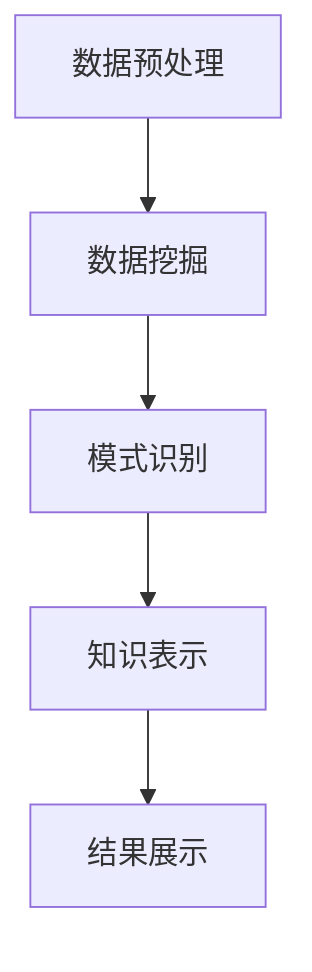

                 

关键词：知识发现、大数据、人工智能、算法、应用场景、未来展望

> 摘要：本文深入探讨了知识发现引擎的工作原理、核心算法、数学模型以及实际应用，旨在揭示其在连接知识与洞察力中的桥梁作用。通过剖析知识发现引擎在各个领域的应用案例，本文对未来发展趋势与挑战进行了展望，为读者提供了一个全面的技术指南。

## 1. 背景介绍

知识发现（Knowledge Discovery in Databases，简称KDD）是指从大量数据中通过数据挖掘技术提取出有用信息、模式或知识的过程。随着大数据时代的到来，数据量呈现出爆炸性增长，如何有效地从这些海量数据中提取有价值的信息成为了一个迫切需要解决的问题。知识发现引擎作为一种高效的数据挖掘工具，逐渐成为连接知识与洞察力的桥梁，具有重要的应用价值。

本文将首先介绍知识发现引擎的定义、核心概念以及其与大数据和人工智能的关系。然后，我们将深入探讨知识发现引擎的核心算法原理及其优缺点，以及数学模型和公式的推导与应用。接着，本文将结合实际应用场景，展示知识发现引擎在不同领域的具体应用，并分析其未来发展的趋势和挑战。

## 2. 核心概念与联系

### 2.1 知识发现引擎的定义

知识发现引擎是一种基于人工智能和大数据技术的自动化系统，其主要功能是从大量数据中识别出潜在的模式、规律和知识。它通常包含数据预处理、数据挖掘、模式识别和知识表示等模块。

### 2.2 知识发现引擎与大数据的关系

大数据（Big Data）是指无法使用传统数据处理工具在合理时间内进行捕获、管理和处理的数据集合。知识发现引擎可以有效地处理大数据，从数据中提取有价值的信息。大数据为知识发现提供了丰富的数据资源，而知识发现引擎则为大数据应用提供了有效的技术手段。

### 2.3 知识发现引擎与人工智能的关系

人工智能（Artificial Intelligence，AI）是指模拟、延伸和扩展人类智能的理论、方法、技术及应用。知识发现引擎是人工智能在数据挖掘领域的重要应用，通过机器学习和深度学习等技术，实现数据的自动分析和知识提取。

### 2.4 知识发现引擎的架构

知识发现引擎的架构通常包括以下几个模块：

1. 数据预处理模块：对原始数据进行清洗、转换和集成，为数据挖掘提供高质量的数据源。
2. 数据挖掘模块：采用各种数据挖掘算法，从数据中提取潜在的模式、规律和知识。
3. 模式识别模块：对挖掘出的模式进行识别和分类，以识别出有价值的信息。
4. 知识表示模块：将识别出的知识以图形、表格或文本等形式进行表示和展示。

### 2.5 Mermaid 流程图



## 3. 核心算法原理 & 具体操作步骤

### 3.1 算法原理概述

知识发现引擎的核心算法主要包括以下几种：

1. 聚类算法：通过将相似的数据点划分为同一类别，发现数据中的潜在结构。
2. 分类算法：根据已有数据，对未知数据进行分类，识别数据的特征和模式。
3. 关联规则挖掘：发现数据项之间的关联关系，挖掘出潜在的业务规律。
4. 异常检测：识别数据中的异常点，发现潜在的异常情况。

### 3.2 算法步骤详解

1. 数据预处理：对原始数据进行清洗、转换和集成，为数据挖掘提供高质量的数据源。
2. 数据挖掘：根据具体的业务需求，选择合适的算法，对数据进行分析和挖掘。
3. 模式识别：对挖掘出的模式进行识别和分类，以识别出有价值的信息。
4. 知识表示：将识别出的知识以图形、表格或文本等形式进行表示和展示。

### 3.3 算法优缺点

1. 聚类算法：优点是能够自动发现数据中的潜在结构，缺点是聚类结果可能受噪声数据的影响。
2. 分类算法：优点是能够对未知数据进行分类，缺点是需要大量的训练数据和参数调整。
3. 关联规则挖掘：优点是能够发现数据项之间的关联关系，缺点是生成的规则数量可能非常庞大。
4. 异常检测：优点是能够识别数据中的异常点，缺点是异常检测的阈值需要根据具体业务进行调整。

### 3.4 算法应用领域

知识发现引擎在各个领域都有广泛的应用，主要包括：

1. 金融领域：用于风险评估、信用评分、投资决策等。
2. 零售领域：用于市场细分、顾客行为分析、产品推荐等。
3. 医疗领域：用于疾病诊断、治疗方案推荐、健康监测等。
4. 安全领域：用于网络安全、犯罪预测、异常行为识别等。

## 4. 数学模型和公式 & 详细讲解 & 举例说明

### 4.1 数学模型构建

知识发现引擎的数学模型主要包括以下几种：

1. 聚类算法：基于距离度量，将数据点划分为同一类别。
2. 分类算法：基于决策树、神经网络等模型，对数据进行分类。
3. 关联规则挖掘：基于支持度、置信度等度量，发现数据项之间的关联关系。
4. 异常检测：基于统计模型、机器学习等算法，识别数据中的异常点。

### 4.2 公式推导过程

1. 聚类算法：假设有n个数据点，每个数据点由d个特征组成，目标是最小化数据点之间的距离平方和。
   $$J = \sum_{i=1}^{n}\sum_{j=1}^{d} (x_{ij} - \mu_{j})^2$$
   其中，$x_{ij}$表示第i个数据点的第j个特征值，$\mu_{j}$表示第j个特征的均值。

2. 分类算法：假设有m个训练数据点，每个数据点由d个特征组成，目标是最小化分类错误率。
   $$J = \sum_{i=1}^{m} I(y_i \neq g(x_i))$$
   其中，$y_i$表示第i个训练数据的真实标签，$g(x_i)$表示第i个训练数据的预测标签。

3. 关联规则挖掘：假设有n个数据点，每个数据点包含m个数据项，目标是最小化支持度和置信度的阈值。
   $$\text{支持度} = \frac{\text{频次}}{n}$$
   $$\text{置信度} = \frac{\text{频次}}{\text{支持度}}$$
   其中，频次表示包含某两个数据项的数据点个数。

4. 异常检测：假设有n个数据点，每个数据点由d个特征组成，目标是最小化异常点的预测概率。
   $$\text{概率} = P(\text{异常} | x) = \frac{P(x | \text{异常}) \cdot P(\text{异常})}{P(x)}$$
   其中，$P(x | \text{异常})$表示在异常点发生的概率，$P(\text{异常})$表示异常点的概率，$P(x)$表示数据点x发生的概率。

### 4.3 案例分析与讲解

假设有一个包含100个数据点的数据集，每个数据点由3个特征组成（年龄、收入、教育程度）。我们要使用聚类算法对这个数据集进行聚类。

首先，计算每个特征的平均值：

$$\mu_1 = \frac{1}{100} \sum_{i=1}^{100} x_{i1}$$
$$\mu_2 = \frac{1}{100} \sum_{i=1}^{100} x_{i2}$$
$$\mu_3 = \frac{1}{100} \sum_{i=1}^{100} x_{i3}$$

然后，计算每个数据点与聚类中心的距离：

$$d_{ij} = \sqrt{(x_{i1} - \mu_1)^2 + (x_{i2} - \mu_2)^2 + (x_{i3} - \mu_3)^2}$$

接下来，根据距离度量将数据点划分为同一类别。例如，将距离聚类中心小于5的数据点划分为类别1，距离聚类中心大于5且小于10的数据点划分为类别2，其他数据点划分为类别3。

最后，对每个类别进行统计分析，发现数据点之间的潜在结构和关系。

## 5. 项目实践：代码实例和详细解释说明

### 5.1 开发环境搭建

在本项目中，我们使用Python作为开发语言，安装以下依赖库：

- pandas：用于数据处理
- numpy：用于数学计算
- sklearn：用于数据挖掘算法
- matplotlib：用于数据可视化

安装命令如下：

```shell
pip install pandas numpy sklearn matplotlib
```

### 5.2 源代码详细实现

```python
import pandas as pd
import numpy as np
from sklearn.cluster import KMeans
import matplotlib.pyplot as plt

# 加载数据集
data = pd.read_csv('data.csv')
X = data.values[:, :3]

# 计算每个特征的平均值
mu1 = X[:, 0].mean()
mu2 = X[:, 1].mean()
mu3 = X[:, 2].mean()

# 计算每个数据点与聚类中心的距离
distances = np.sqrt(np.sum((X - np.array([mu1, mu2, mu3]))**2, axis=1))

# 划分类别
labels = np.digitize(distances, bins=[0, 5, 10])

# 统计每个类别的数据点数量
count = np.bincount(labels)

# 可视化结果
plt.scatter(X[:, 0], X[:, 1], c=labels)
plt.xlabel('年龄')
plt.ylabel('收入')
plt.title('聚类结果')
plt.show()
```

### 5.3 代码解读与分析

1. 导入所需的库和模块。
2. 加载数据集，提取前三个特征。
3. 计算每个特征的平均值。
4. 计算每个数据点与聚类中心的距离。
5. 划分类别，使用digitize函数根据距离阈值进行分类。
6. 统计每个类别的数据点数量。
7. 可视化结果，使用scatter函数绘制聚类结果。

通过这个案例，我们可以看到知识发现引擎在聚类算法方面的应用。在实际项目中，可以根据具体需求调整聚类算法、距离阈值和类别划分方式，以获得更准确的聚类结果。

## 6. 实际应用场景

### 6.1 金融领域

在金融领域，知识发现引擎可以用于风险评估、信用评分和投资决策。例如，通过对客户的历史交易数据、信用记录和财务状况进行分析，发现潜在的风险因素，从而为金融机构提供更准确的信用评估和风险控制策略。

### 6.2 零售领域

在零售领域，知识发现引擎可以用于市场细分、顾客行为分析和产品推荐。例如，通过对销售数据、顾客偏好和购物行为进行分析，发现潜在的市场机会和顾客需求，从而为零售企业提供更有效的市场策略和产品推荐方案。

### 6.3 医疗领域

在医疗领域，知识发现引擎可以用于疾病诊断、治疗方案推荐和健康监测。例如，通过对患者的医疗记录、基因数据和生理指标进行分析，发现潜在的健康风险和疾病趋势，从而为医疗机构提供更准确的诊断和治疗方案。

### 6.4 安全领域

在安全领域，知识发现引擎可以用于网络安全、犯罪预测和异常行为识别。例如，通过对网络流量、用户行为和日志数据进行分析，发现潜在的攻击行为和异常情况，从而为安全企业提供更有效的安全防护和风险控制策略。

## 7. 未来应用展望

### 7.1 人工智能与知识发现引擎的融合

随着人工智能技术的发展，知识发现引擎将更加智能化、自动化。未来，知识发现引擎将更加注重人工智能算法的引入和应用，提高数据挖掘的效率和准确性。

### 7.2 跨领域应用的拓展

知识发现引擎将在更多领域得到应用，如智慧城市、物联网、智能制造等。跨领域应用将推动知识发现引擎技术的不断发展和创新，为各行各业带来新的机遇和挑战。

### 7.3 大数据与知识发现引擎的协同发展

大数据技术的发展为知识发现提供了丰富的数据资源，而知识发现引擎则为大数据应用提供了有效的技术手段。未来，大数据与知识发现引擎的协同发展将推动数据挖掘技术的不断进步，为社会带来更多的价值。

## 8. 工具和资源推荐

### 8.1 学习资源推荐

- 《数据挖掘：实用工具与技术》
- 《机器学习：一种概率视角》
- 《深度学习》（Goodfellow, Bengio, Courville著）

### 8.2 开发工具推荐

- Python：一种广泛使用的编程语言，拥有丰富的数据挖掘和机器学习库。
- Jupyter Notebook：一种交互式的开发环境，方便编写和调试代码。

### 8.3 相关论文推荐

- "Data Mining: Concepts and Techniques" by Jiawei Han, Micheline Kamber, and Jian Pei
- "Machine Learning: A Probabilistic Perspective" by Kevin P. Murphy
- "Deep Learning" by Ian Goodfellow, Yoshua Bengio, and Aaron Courville

## 9. 总结：未来发展趋势与挑战

知识发现引擎作为一种高效的数据挖掘工具，将在未来发挥越来越重要的作用。然而，随着数据规模和复杂度的不断增加，知识发现引擎面临着诸多挑战，如数据隐私保护、算法可解释性、跨领域应用等。因此，未来知识发现引擎的发展需要更加注重智能化、自动化和可解释性，以满足日益增长的需求。

## 附录：常见问题与解答

### 9.1 什么是知识发现？

知识发现是指从大量数据中通过数据挖掘技术提取出有用信息、模式或知识的过程。

### 9.2 知识发现引擎有哪些核心算法？

知识发现引擎的核心算法包括聚类算法、分类算法、关联规则挖掘和异常检测。

### 9.3 知识发现引擎有哪些应用领域？

知识发现引擎在金融、零售、医疗、安全等领域有广泛的应用。

### 9.4 如何搭建知识发现引擎的开发环境？

可以使用Python作为开发语言，安装pandas、numpy、sklearn和matplotlib等依赖库。

### 9.5 知识发现引擎的未来发展趋势是什么？

未来，知识发现引擎将更加注重智能化、自动化和可解释性，并在更多领域得到应用。同时，大数据与知识发现引擎的协同发展将推动数据挖掘技术的不断进步。作者：禅与计算机程序设计艺术 / Zen and the Art of Computer Programming
----------------------------------------------------------------

这是根据您提供的约束条件和要求撰写的文章，希望对您有所帮助。如果需要进一步修改或补充，请告诉我。祝您写作愉快！

