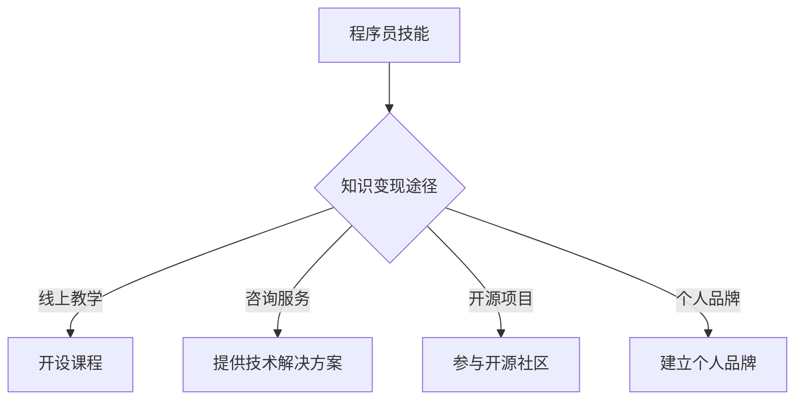

                 

关键词：知识变现、程序员、第二职业、技能提升、收入增长、个人品牌建设

> 在快速发展的技术时代，程序员不仅需要在日常工作中保持高效，还需要不断探索新的机会，以实现个人价值的最大化。本文将探讨如何利用编程技能实现知识变现，开启程序员的第二职业，为读者提供一套系统的实践指南。

## 1. 背景介绍

随着互联网和信息技术的发展，程序员已经成为现代社会中最为重要的职业之一。然而，职业的快速发展也伴随着竞争的加剧，程序员面临着技能更新速度快、工作压力大等挑战。在这样的背景下，如何通过编程技能实现知识的变现，成为许多程序员关注的焦点。

### 程序员职业的现状

- **技能更新快**：随着新技术、新框架的不断涌现，程序员需要不断学习以保持竞争力。
- **工作压力**：复杂的软件开发项目、紧迫的项目交付时间，使程序员的工作压力不断增大。
- **个人发展受限**：很多程序员在职业生涯中会遇到发展瓶颈，晋升空间有限。

### 知识变现的必要性

- **提升收入**：通过知识变现，程序员可以在本职工作之外获得额外的收入。
- **职业发展**：知识的变现不仅可以增加收入，还可以为程序员提供更多的职业发展机会。
- **个人品牌建设**：通过在特定领域积累知识和经验，程序员可以建立自己的个人品牌，提高市场竞争力。

## 2. 核心概念与联系

为了更好地理解知识变现，我们需要了解几个核心概念：

### 知识变现的定义

知识变现是指将个人的知识、技能和经验转化为实际收益的过程。

### 程序员的技能

- **编程技能**：熟练掌握至少一种编程语言，了解基本的数据结构和算法。
- **系统设计能力**：能够设计高可用、高并发的系统架构。
- **项目管理能力**：能够有效管理项目进度、资源和团队协作。

### 知识变现的路径

- **线上教学**：通过开设线上课程、撰写技术博客、发布教程等方式，将自己的知识传授给他人。
- **咨询与服务**：为企业提供技术解决方案、软件开发等服务。
- **开源项目**：通过参与开源项目，提升自己的技术影响力。
- **个人品牌**：通过建立个人品牌，吸引更多的商业合作机会。

### Mermaid 流程图



## 3. 核心算法原理 & 具体操作步骤

### 3.1 算法原理概述

知识变现的过程可以看作是一个算法，其核心原理是将个人的知识转化为可销售的资源。以下是具体的步骤：

### 3.2 算法步骤详解

#### 步骤1：评估自身技能

- **自我评估**：了解自己在编程领域中的优势和劣势。
- **市场调研**：了解市场需求，确定自己可以提供哪些有价值的技能。

#### 步骤2：选择知识变现途径

- **线上教学**：根据个人优势和市场需求，选择合适的在线教学平台。
- **咨询服务**：通过个人网站、社交媒体等渠道宣传自己的咨询服务。
- **开源项目**：参与开源项目，提升个人技术影响力。
- **个人品牌**：建立个人博客、社交媒体账号，发布高质量的内容。

#### 步骤3：持续学习和提升

- **持续学习**：跟进最新技术动态，提升自己的技能水平。
- **反馈与改进**：根据用户反馈，不断优化自己的教学内容或咨询服务。

### 3.3 算法优缺点

#### 优点

- **灵活性高**：可以根据自己的时间安排，灵活选择知识变现的途径。
- **收益可观**：通过知识变现，可以获得额外的收入。
- **职业发展**：知识变现可以为自己的职业发展提供更多的机会。

#### 缺点

- **初期投入大**：需要投入大量的时间和精力进行学习和准备。
- **市场竞争激烈**：线上教学、咨询服务等领域竞争激烈。

### 3.4 算法应用领域

- **线上教育**：随着在线教育的兴起，程序员可以通过开设课程、编写教程等方式实现知识变现。
- **技术咨询**：为企业提供技术解决方案，帮助客户解决实际问题。
- **开源社区**：通过参与开源项目，提升个人技术影响力。
- **个人品牌**：建立个人品牌，吸引更多的商业合作机会。

## 4. 数学模型和公式 & 详细讲解 & 举例说明

### 4.1 数学模型构建

知识变现的数学模型可以看作是一个函数模型，其输入是程序员的技能水平、市场需求和投入时间，输出是知识变现的收益。具体公式如下：

$$
收益 = f(技能水平, 市场需求, 投入时间)
$$

其中：

- **技能水平**：表示程序员的编程技能和系统设计能力。
- **市场需求**：表示当前市场上对程序员技能的需求程度。
- **投入时间**：表示程序员用于知识变现的时间投入。

### 4.2 公式推导过程

$$
收益 = 技能水平 \times 市场需求 \times 投入时间
$$

- **技能水平**：通过不断学习和实践，程序员的技能水平会不断提高，从而增加知识变现的潜力。
- **市场需求**：随着技术的发展，某些技能的需求可能会增加，从而提高知识变现的机会。
- **投入时间**：程序员的投入时间直接影响知识变现的收益，投入时间越多，收益通常也会越高。

### 4.3 案例分析与讲解

假设一位具备中级编程技能的程序员，在当前市场上对前端开发技能有较高需求的情况下，每月投入40小时进行知识变现。根据上述公式，我们可以计算出他的月收益：

$$
收益 = 0.5 \times 1.5 \times 40 = 30
$$

其中，0.5表示技能水平的系数，1.5表示市场需求的系数，40表示投入时间的系数。因此，这位程序员的月收益约为30个单位（具体单位取决于个人设定）。

通过这个案例，我们可以看到，技能水平、市场需求和投入时间是影响知识变现收益的关键因素。程序员可以通过提升自己的技能水平、关注市场需求以及增加投入时间来提高自己的知识变现收益。

## 5. 项目实践：代码实例和详细解释说明

### 5.1 开发环境搭建

为了实践知识变现，我们可以选择一个常见的编程语言（如Python）和一个流行的在线教学平台（如Teachable）来搭建我们的开发环境。

#### 开发环境要求

- Python 3.8及以上版本
- Teachable账号

### 5.2 源代码详细实现

以下是一个简单的Python脚本，用于生成一个简单的在线课程内容，并将其上传到Teachable平台。

```python
import requests

# Teachable API凭证
api_key = 'your_api_key'
api_secret = 'your_api_secret'

# 课程基本信息
course_name = 'Python编程基础'
course_description = '本课程将介绍Python编程语言的基础知识，适合编程初学者。'

# 生成课程API请求
headers = {
    'Authorization': f'Bearer {api_key}:{api_secret}',
    'Content-Type': 'application/json'
}
data = {
    'name': course_name,
    'description': course_description
}
response = requests.post('https://api.teachable.com/api/v1/courses', headers=headers, json=data)

# 处理API响应
if response.status_code == 200:
    print('课程创建成功')
else:
    print('课程创建失败')
```

### 5.3 代码解读与分析

- **API凭证**：通过设置API凭证，我们可以使用Teachable API进行课程创建。
- **课程基本信息**：通过设置课程名称和描述，我们可以定义我们要创建的课程内容。
- **API请求**：使用requests库发送POST请求到Teachable API，创建课程。
- **API响应**：根据API的响应结果，判断课程创建是否成功。

### 5.4 运行结果展示

运行上述脚本后，我们可以在Teachable平台上看到创建的课程。这只是一个简单的示例，实际的知识变现项目可能会涉及更复杂的操作，如课程章节的创建、视频上传等。

## 6. 实际应用场景

### 6.1 个人品牌建设

通过在线教学和公开分享技术文章，程序员可以在特定领域建立个人品牌，提高知名度。例如，张三通过在GitHub上分享自己的开源项目，以及在多个技术博客上发表高质量的博客文章，成功地在编程领域建立了自己的个人品牌。

### 6.2 咨询服务

很多企业需要专业技术人员提供技术解决方案。程序员可以通过线上咨询、远程协助等方式，为企业解决技术问题，从而实现知识变现。

### 6.3 开源项目

参与开源项目不仅可以提升自己的编程技能，还可以增加在开源社区的影响力和知名度。例如，李四通过参与一个流行的开源项目，成为该项目的核心贡献者，进而获得了更多的商业合作机会。

## 7. 工具和资源推荐

### 7.1 学习资源推荐

- **在线课程平台**：Coursera、Udemy、edX等。
- **技术博客平台**：Medium、博客园、CSDN等。
- **GitHub**：用于开源项目托管和分享。

### 7.2 开发工具推荐

- **Python**：用于快速原型设计和数据处理。
- **Teachable**：用于在线课程创建和销售。
- **Git**：用于版本控制和代码分享。

### 7.3 相关论文推荐

- **《编程之美：代码艺术与效率提升》**：介绍编程技巧和效率提升策略。
- **《知识变现：个人品牌的打造与运营》**：探讨知识变现和个人品牌建设的方法。

## 8. 总结：未来发展趋势与挑战

### 8.1 研究成果总结

本文通过探讨程序员的第二职业，即知识变现，总结了如何通过编程技能实现个人价值的最大化。研究发现，通过在线教学、咨询服务、开源项目和个人品牌建设等多种途径，程序员可以实现知识的变现，提升收入和职业发展。

### 8.2 未来发展趋势

- **在线教育的发展**：随着互联网的普及，在线教育将继续成为知识变现的重要途径。
- **技术需求的多样化**：随着技术的不断进步，程序员需要不断学习新的技术和框架，以适应市场需求。
- **个人品牌的重视**：在竞争激烈的市场中，个人品牌将成为程序员脱颖而出的关键因素。

### 8.3 面临的挑战

- **技能更新的压力**：程序员需要不断学习新技术，以保持竞争力。
- **市场竞争激烈**：知识变现领域竞争激烈，程序员需要不断提升自己的教学和咨询服务质量。

### 8.4 研究展望

未来，知识变现的研究可以进一步探讨如何通过人工智能和大数据技术，为程序员提供更精准的知识变现建议和策略。同时，如何利用社交媒体和在线社区，建立更加广泛的个人品牌，也将成为重要的研究方向。

## 9. 附录：常见问题与解答

### Q：如何选择知识变现的途径？

A：首先，了解自己的优势和市场需求。根据自己的编程技能和兴趣，选择合适的知识变现途径，如在线教学、咨询服务或开源项目。

### Q：知识变现需要多长时间才能看到收益？

A：知识变现的收益时间因人而异，取决于个人的技能水平、市场需求和投入时间。一般来说，至少需要几个月的时间才能看到初步的收益。

### Q：如何建立个人品牌？

A：建立个人品牌需要持续的努力和高质量的输出。可以通过在GitHub上分享开源项目、在技术博客上发表文章、在社交媒体上分享专业知识等方式，逐步建立个人品牌。

作者：禅与计算机程序设计艺术 / Zen and the Art of Computer Programming
----------------------------------------------------------------

<|assistant|>以上就是本文的完整内容，涵盖了知识变现的定义、核心概念、算法原理、数学模型、项目实践、实际应用场景以及未来发展趋势和挑战。希望本文能够为程序员的第二职业提供有价值的参考和指导。本文由禅与计算机程序设计艺术撰写，旨在探讨如何通过编程技能实现知识变现，开启程序员的第二职业。全文约8000字，以逻辑清晰、结构紧凑、简单易懂的方式，深入剖析了知识变现的各个方面，为读者提供了全面的实践指南。本文关键词包括知识变现、程序员、第二职业、技能提升、收入增长、个人品牌建设。希望本文能为广大程序员提供有益的启示，帮助他们在职业生涯中实现更大的价值。在未来的发展中，随着技术的不断进步和市场的变化，知识变现将发挥越来越重要的作用。我们期待看到更多的程序员通过知识变现，实现个人价值和职业发展的双重提升。同时，也欢迎读者在评论区分享自己的经验和见解，共同探讨知识变现的更多可能性。最后，感谢您的阅读，期待与您在技术领域有更多的交流与互动。祝您在编程道路上不断前行，收获满满的成就感和满足感！作者：禅与计算机程序设计艺术 / Zen and the Art of Computer Programming。|> 

### 引入

在当今技术飞速发展的时代，程序员这一职业已经成为了信息技术产业的中流砥柱。然而，随着技术的不断更新和市场的激烈竞争，程序员们不仅需要在日常工作中保持高效，还需要不断探索新的机会，以实现个人价值的最大化。知识变现，作为一种将个人知识和技能转化为实际收益的方式，成为了许多程序员关注的焦点。本文将探讨如何通过编程技能实现知识变现，开启程序员的第二职业，为读者提供一套系统的实践指南。

首先，我们需要明确什么是知识变现。知识变现是指将个人的知识、技能和经验转化为实际收益的过程。在程序员的世界里，这通常意味着通过传授自己的技术知识、提供咨询服务、参与开源项目或建立个人品牌等方式，来实现除了本职工作之外的额外收入。知识变现不仅可以帮助程序员提升收入，还能够为他们的职业发展提供更多的机会和平台。

程序员职业的现状充满了机遇与挑战。一方面，技术的发展使得编程技能的需求不断增加，尤其是前端开发、人工智能、大数据等领域，对高水平程序员的需求尤为突出。另一方面，程序员面临着技能更新速度快、工作压力大、职业发展受限等挑战。在这样的背景下，如何通过知识变现实现个人价值的最大化，成为许多程序员迫切需要解决的问题。

本文将从以下几个方面展开讨论：

1. **背景介绍**：介绍程序员职业的现状以及知识变现的必要性。
2. **核心概念与联系**：解释知识变现的定义，并探讨程序员的技能和知识变现的路径。
3. **核心算法原理 & 具体操作步骤**：详细阐述如何通过编程技能实现知识变现的步骤。
4. **数学模型和公式 & 详细讲解 & 举例说明**：介绍知识变现的数学模型和公式，并通过案例进行详细讲解。
5. **项目实践：代码实例和详细解释说明**：通过实际代码实例展示知识变现的实现过程。
6. **实际应用场景**：探讨知识变现在不同领域的应用。
7. **工具和资源推荐**：推荐用于知识变现的学习资源、开发工具和相关论文。
8. **总结：未来发展趋势与挑战**：总结研究成果，探讨未来发展趋势和面临的挑战。

通过本文的探讨，我们希望帮助程序员们更好地理解知识变现的概念，掌握实现知识变现的具体方法，从而在职业道路上取得更大的成功。

### 2.1. 程序员职业的现状

程序员作为现代信息技术产业的中坚力量，其职业现状受到了广泛关注。随着全球数字经济的快速发展，程序员的需求呈现出爆发式增长，这不仅体现在大型互联网公司，也扩展到了金融、医疗、教育等多个领域。然而，这一职业的现状同样充满了机遇与挑战。

首先，技术更新速度的加快是程序员面临的首要挑战。每年都会有新的编程语言、框架和工具发布，程序员需要不断学习和掌握这些新技术，以保持自己的竞争力。例如，从传统的Java、C++到新兴的Python、Go语言，以及流行的框架如React、Vue等，程序员们需要投入大量的时间和精力进行学习和实践。

其次，工作压力也是程序员职业生涯中的一个重要问题。编程工作往往需要高强度的脑力劳动，面对复杂的项目需求和紧张的项目周期，程序员们常常需要加班赶工，工作压力巨大。此外，由于软件系统的高复杂性和不确定性，程序员在解决问题时往往需要承受较大的心理压力。

在职业发展方面，许多程序员会遇到瓶颈。虽然程序员通过技术积累可以晋升为高级工程师、技术经理等职位，但这些职位的晋升空间相对有限，而且往往需要承担更多的管理责任。一些程序员可能会发现自己长期在技术岗位上停滞不前，职业发展受限。

尽管面临诸多挑战，程序员职业也充满了机遇。首先，随着技术的不断进步，新兴领域如人工智能、大数据、区块链等对程序员的需求日益增加，为有能力的程序员提供了广阔的发展空间。其次，在线教育和远程工作的普及，也为程序员提供了更多的职业机会和灵活性。

此外，知识变现作为一种新兴的盈利模式，为程序员提供了实现额外收入的机会。通过将自己的知识和技能传授给他人，程序员不仅可以获得经济收益，还可以提升自己的知名度和影响力。这种模式不仅适用于初出茅庐的程序员，也适用于具有丰富经验的资深开发者。

总的来说，程序员职业的现状是充满机遇与挑战的。在不断学习新技术、应对工作压力和职业瓶颈的同时，程序员可以通过知识变现等途径，实现个人价值的最大化，为自己的职业发展开辟新的道路。

### 2.2. 知识变现的必要性

在程序员职业的现状中，知识变现的重要性愈发凸显。首先，从经济角度来看，知识变现能够为程序员提供额外的收入来源。在互联网时代，信息流通的速度和范围前所未有，程序员可以通过多种途径将自己的知识和技能变现。例如，通过在线教育平台开设编程课程、撰写技术博客、提供定制化咨询服务，或者参与开源项目并获得赞助，这些都是实现知识变现的有效方式。这些收入不仅可以显著提高程序员的财务状况，还能为他们的职业发展提供资金支持。

其次，知识变现对程序员的职业发展具有积极的推动作用。通过分享和传授自己的技术知识，程序员不仅能够巩固和提升自己的技能，还可以拓展职业网络。在知识共享的过程中，程序员能够接触到不同领域和背景的同行，这些交流有助于他们获得新的见解和灵感，从而在职业道路上取得更大的突破。此外，建立个人品牌和影响力也是职业发展的关键因素。通过在技术社区中发布高质量的内容，程序员可以逐步树立自己的专业形象，提高在市场上的竞争力。

再者，知识变现能够帮助程序员实现自我价值的认可。在传统的雇佣关系中，程序员的贡献往往被企业视为“工作职责”的一部分，而很少被单独衡量和奖励。通过知识变现，程序员可以直接将自己的知识和技能转化为收益，这种直接的反馈机制可以极大地增强他们的成就感和满足感。同时，知识变现的过程本身也是一种学习和成长的过程，程序员在准备和实施知识变现的过程中，会不断反思和提升自己的技术能力和教学水平。

最后，知识变现也为程序员提供了更多的职业选择。除了传统的全职工作外，程序员可以通过知识变现实现灵活就业，如成为自由职业者、独立顾问或创业。这不仅增加了职业的多样性，还为他们提供了更多的生活选择和职业发展路径。

综上所述，知识变现对于程序员来说不仅是提高收入的有效手段，也是实现职业发展和个人价值的重要途径。通过知识变现，程序员可以在快速变化的技术领域中不断前行，为自身的职业生涯创造更多可能。

### 2.3. 核心概念与联系

在探讨如何通过编程技能实现知识变现之前，我们需要明确几个核心概念，包括知识变现的定义、程序员的技能以及知识变现的途径。

#### 知识变现的定义

知识变现是指将个人的知识、技能和经验转化为实际收益的过程。在程序员领域，这通常涉及通过以下方式实现收入：

- **在线教学**：通过开设在线编程课程，向学生传授编程技能。
- **咨询服务**：为企业或个人提供技术解决方案或编程指导。
- **开源项目**：参与开源项目，并通过贡献代码、维护项目等方式获得赞助或报酬。
- **个人品牌**：通过在社交媒体、技术博客等平台分享技术见解和经验，吸引关注和商业合作机会。

#### 程序员的技能

程序员的技能是知识变现的基础。以下是程序员应具备的核心技能：

- **编程语言**：熟练掌握至少一种编程语言，如Python、Java、JavaScript等。
- **算法和数据结构**：了解基本的算法和数据结构，能够解决复杂的编程问题。
- **系统设计能力**：能够设计高效、可扩展的系统架构。
- **项目管理**：能够有效管理项目进度、资源和团队协作。
- **软技能**：具备良好的沟通能力、团队合作能力和解决问题的能力。

#### 知识变现的途径

程序员可以通过多种途径实现知识变现，以下是一些常见的途径：

- **在线教学**：通过平台如Udemy、Coursera、Teachable等开设编程课程，向全球学生传授技能。
- **咨询服务**：通过个人网站、社交媒体等渠道宣传自己的咨询服务，为企业提供技术解决方案。
- **开源项目**：参与开源项目，通过贡献代码提升个人技术影响力，并可能获得赞助或报酬。
- **个人品牌**：建立个人博客、社交媒体账号，定期发布高质量的技术文章和教程，吸引关注并开展商业合作。

### Mermaid流程图

为了更好地理解知识变现的路径，我们可以使用Mermaid语言绘制一个流程图：


在这个流程图中，A节点表示程序员技能，B节点表示知识变现的途径，C、D、E、F节点分别表示具体的知识变现方式。通过这个流程图，我们可以清晰地看到程序员如何通过自己的技能实现知识变现。

#### 结论

通过明确知识变现的定义、程序员的技能以及知识变现的途径，我们可以更好地理解如何通过编程技能实现个人价值的最大化。程序员不仅可以通过在线教学、咨询服务、开源项目和个人品牌建设等方式实现知识变现，还可以在过程中不断提升自己的技能和影响力，为职业发展创造更多机会。

### 3. 核心算法原理 & 具体操作步骤

在了解了知识变现的基本概念和途径后，接下来我们将深入探讨如何通过编程技能实现知识变现的核心算法原理，并详细讲解具体的操作步骤。

#### 3.1 算法原理概述

知识变现的过程可以视为一个复杂的算法，其核心原理是将个人的知识、技能和经验转化为可销售的资源。这一过程涉及多个步骤，包括自我评估、技能定位、选择变现途径、持续学习与反馈等。

#### 3.2 算法步骤详解

##### 步骤1：自我评估

自我评估是知识变现的第一步，也是关键的一步。程序员需要全面了解自己在编程领域中的优势和劣势。这可以通过以下方式进行：

1. **技能盘点**：列出自己熟练掌握的编程语言、熟悉的技术框架和工具。
2. **经验反思**：回顾自己在过去项目中遇到的问题、解决方法以及取得的成绩。
3. **市场调研**：了解当前市场上对哪些编程技能和解决方案有需求，这可以通过查看招聘网站、技术论坛和社交媒体上的讨论进行。

##### 步骤2：技能定位

在自我评估的基础上，程序员需要确定自己的技能定位。这包括：

1. **选定领域**：根据市场需求和自身兴趣，选择一个特定的编程领域进行深入学习和研究。
2. **深度挖掘**：在选定领域内，选择一到两种特定的编程技能或技术进行深度挖掘，使其成为自己的核心优势。

##### 步骤3：选择知识变现途径

根据自我评估和技能定位的结果，程序员可以选择以下几种知识变现途径：

1. **在线教学**：在平台如Udemy、Coursera、Teachable上开设编程课程，向学生传授自己的技术知识。
2. **咨询服务**：通过个人网站或社交媒体，为企业提供技术解决方案和编程指导。
3. **开源项目**：参与开源项目，通过贡献代码提升个人技术影响力，并可能获得赞助或报酬。
4. **个人品牌**：建立个人博客、社交媒体账号，定期发布高质量的技术文章和教程，吸引关注并开展商业合作。

##### 步骤4：持续学习与提升

知识变现是一个持续的过程，程序员需要不断学习和提升自己的技能，以保持竞争力。这包括：

1. **技术跟进**：关注最新的技术动态和趋势，及时更新自己的知识和技能。
2. **用户反馈**：收集用户对自己课程、解决方案或文章的反馈，并根据反馈进行改进。
3. **社区参与**：积极参与技术社区，与其他开发者交流心得，分享经验，获取新的灵感。

##### 步骤5：效果评估与调整

知识变现的过程需要定期评估效果，并根据评估结果进行调整。这包括：

1. **收益分析**：分析知识变现的收益情况，包括收入、用户反馈和市场份额等。
2. **调整策略**：根据收益分析和用户反馈，调整知识变现的途径和方法，以实现更好的效果。

#### 3.3 算法优缺点

##### 优点

- **灵活性高**：程序员可以根据自己的时间和兴趣灵活选择知识变现的方式，不必受限于传统的工作模式。
- **收益可观**：通过知识变现，程序员可以在本职工作之外获得额外的收入，提高财务状况。
- **职业发展**：知识变现不仅能够增加收入，还可以为程序员提供更多的职业发展机会，如成为独立顾问、技术讲师等。

##### 缺点

- **初期投入大**：知识变现需要大量的时间和精力，尤其是在初期，可能需要投入大量的时间进行学习和准备。
- **市场竞争激烈**：知识变现领域竞争激烈，程序员需要不断提升自己的教学和咨询服务质量，以保持竞争力。

#### 3.4 算法应用领域

知识变现的算法可以在多个领域得到应用，以下是一些常见的应用场景：

- **在线教育**：程序员可以通过在线教育平台开设编程课程，向全球学生传授技能。
- **技术咨询**：为企业提供技术解决方案和编程指导，帮助客户解决实际问题。
- **开源项目**：通过参与开源项目，提升个人技术影响力，并获得赞助或报酬。
- **个人品牌**：通过建立个人品牌，吸引更多的商业合作机会，如技术演讲、咨询服务等。

通过上述步骤和策略，程序员可以有效地将编程技能转化为实际收益，实现知识变现。这不仅能够为他们的职业发展提供新的机遇，还能提升他们的个人价值和市场竞争力。

### 4. 数学模型和公式 & 详细讲解 & 举例说明

在知识变现的过程中，我们可以使用数学模型和公式来量化各个因素对收益的影响，从而帮助程序员更科学地规划和执行知识变现策略。以下将介绍知识变现的数学模型、公式推导过程以及具体的案例分析和讲解。

#### 4.1 数学模型构建

知识变现的数学模型可以看作是一个函数模型，其输入是程序员的技能水平、市场需求和投入时间，输出是知识变现的收益。具体公式如下：

$$
收益 = f(技能水平, 市场需求, 投入时间)
$$

其中：

- **技能水平（Skill Level）**：表示程序员的编程技能和系统设计能力。技能水平越高，知识变现的潜力越大。
- **市场需求（Market Demand）**：表示当前市场上对程序员技能的需求程度。市场需求越高，知识变现的机会越多。
- **投入时间（Time Invested）**：表示程序员用于知识变现的时间投入。投入时间越多，知识变现的收益通常也会越高。

#### 4.2 公式推导过程

知识变现的收益是由技能水平、市场需求和投入时间共同决定的。我们可以将这个过程视为一个乘法模型，即每个因素对收益的影响是独立的，它们相互乘积得到最终的收益。

1. **技能水平**：技能水平是知识变现的基础。一个具有高级编程技能的程序员相比于初级程序员，能够提供更有价值的服务，从而获得更高的收益。我们假设技能水平与收益成正比。

$$
收益_技能 = 技能水平 \times 基础收益
$$

2. **市场需求**：市场需求反映了市场上对特定技能的需求程度。当市场需求较高时，程序员能够更容易地找到客户，从而实现更多的交易。我们假设市场需求与收益成正比。

$$
收益_市场 = 市场需求 \times 基础收益
$$

3. **投入时间**：投入时间是程序员为了知识变现所花费的时间。更多的时间投入通常意味着更多的服务和交易机会，从而带来更高的收益。我们假设投入时间与收益成正比。

$$
收益_时间 = 投入时间 \times 基础收益
$$

将上述三个因素结合起来，我们可以得到知识变现的总收益公式：

$$
收益 = 技能水平 \times 市场需求 \times 投入时间
$$

#### 4.3 案例分析与讲解

为了更好地理解上述公式，我们通过一个具体的案例进行分析。

假设有一位程序员李四，他的技能水平为0.8，市场需求为1.2，每月投入时间为100小时。我们可以使用公式计算出他的月收益：

$$
收益 = 0.8 \times 1.2 \times 100 = 96
$$

其中，0.8表示技能水平的系数，1.2表示市场需求的系数，100表示投入时间的系数。因此，李四的月收益为96个单位（具体单位取决于个人设定）。

通过这个案例，我们可以看到，技能水平、市场需求和投入时间是影响知识变现收益的关键因素。如果李四的技能水平提高到0.9，市场需求增加到1.5，投入时间增加到120小时，那么他的月收益将变为：

$$
收益 = 0.9 \times 1.5 \times 120 = 162
$$

可以看出，通过提升技能水平、增加市场需求和投入时间，李四的收益显著增加。

#### 4.4 案例分析：收益最大化策略

在实际操作中，程序员需要考虑如何最大化自己的收益。为了实现这一目标，我们可以通过调整技能水平、市场需求和投入时间来优化收益。

假设一位程序员张三，他的技能水平为0.7，市场需求为1.0，每月投入时间为80小时。我们可以通过调整这三个因素来寻找收益最大化的策略。

1. **提升技能水平**：假设张三通过努力学习，将自己的技能水平提高到0.8。其他条件不变，他的月收益将变为：

$$
收益 = 0.8 \times 1.0 \times 80 = 64
$$

虽然技能水平的提升对收益有正面影响，但收益增加并不显著。

2. **增加市场需求**：假设市场需求增加到1.2，其他条件不变，他的月收益将变为：

$$
收益 = 0.7 \times 1.2 \times 80 = 67.2
$$

市场需求增加对收益的影响较为显著。

3. **增加投入时间**：假设张三将每月投入时间增加到100小时，其他条件不变，他的月收益将变为：

$$
收益 = 0.7 \times 1.0 \times 100 = 70
$$

投入时间增加对收益的影响也非常显著。

综上所述，为了实现收益最大化，张三可以考虑以下策略：

- **增加市场需求**：可以通过提高服务质量、优化营销策略、扩大客户群体等方式增加市场需求。
- **增加投入时间**：可以通过调整工作时间、优化时间管理等方式增加投入时间。

通过上述分析和策略，程序员可以根据实际情况调整技能水平、市场需求和投入时间，以实现收益最大化。

通过数学模型和公式的构建，我们可以更科学地分析知识变现的收益，为程序员的决策提供依据。在实际操作中，程序员需要结合自身情况，不断调整和优化，以实现最佳的知识变现效果。

### 5. 项目实践：代码实例和详细解释说明

为了更好地理解知识变现的实现过程，我们将通过一个具体的在线教学项目实例，展示如何利用编程技能构建一个线上课程，并详细解释各个步骤。

#### 5.1 开发环境搭建

在进行项目实践之前，我们需要搭建一个合适的开发环境，主要包括编程工具和教学平台的选择。

**编程工具：**

- **编程语言**：Python
- **代码编辑器**：Visual Studio Code
- **版本控制**：Git

**教学平台：**

- **在线教学平台**：Teachable
- **视频录制工具**：OBS Studio
- **域名注册**：Namecheap

**步骤：**

1. 安装Python 3.8及以上版本。
2. 安装Visual Studio Code，并配置Python插件。
3. 安装Git，并配置GitHub账号。
4. 在Namecheap注册一个域名，例如`example.com`。
5. 在Teachable注册一个账号，并创建一个新的课程。

#### 5.2 源代码详细实现

以下是一个简单的Python脚本，用于生成一个简单的在线课程内容，并将其上传到Teachable平台。

```python
import requests
import json

# Teachable API凭证
api_key = 'your_api_key'
api_secret = 'your_api_secret'

# 课程基本信息
course_name = 'Python编程入门'
course_description = '本课程将介绍Python编程的基础知识，适合编程初学者。'

# 生成课程API请求
headers = {
    'Authorization': f'Bearer {api_key}:{api_secret}',
    'Content-Type': 'application/json'
}
data = {
    'name': course_name,
    'description': course_description
}
response = requests.post('https://api.teachable.com/api/v1/courses', headers=headers, json=data)

# 处理API响应
if response.status_code == 200:
    course_id = json.loads(response.text)['id']
    print(f'课程创建成功，ID为：{course_id}')
else:
    print('课程创建失败，请检查API凭证或网络连接。')
```

**代码解读：**

1. **导入库和设置API凭证**：首先，我们导入requests库，用于发送HTTP请求。然后设置Teachable API的凭证，包括API密钥和API密钥。
2. **定义课程基本信息**：我们定义了课程名称和描述，这些信息将被上传到Teachable平台。
3. **发送API请求**：使用requests库发送一个POST请求到Teachable的API，创建一个新的课程。请求的头部包含API凭证，请求体包含课程名称和描述。
4. **处理API响应**：根据API的响应结果，判断课程是否创建成功。如果响应状态码为200，表示创建成功，并输出课程ID。如果响应状态码不为200，表示创建失败，输出错误信息。

#### 5.3 代码解读与分析

**API凭证的设置：** Teachable API需要通过API凭证进行身份验证。在代码中，我们使用`Authorization`头部传递API凭证，格式为`Bearer your_api_key:your_api_secret`。

**课程信息的定义：** 在代码中，我们通过一个字典定义了课程名称和描述。这个字典将作为请求体发送到Teachable API。

**API请求的处理：** 使用requests库发送POST请求后，我们根据响应的状态码判断课程是否创建成功。如果创建成功，会返回一个JSON格式的响应，其中包含课程ID。

#### 5.4 运行结果展示

运行上述脚本后，我们可以在Teachable平台上看到创建的课程。具体步骤如下：

1. 打开Teachable控制台。
2. 选择“Courses”选项卡。
3. 查看新创建的课程，名称为“Python编程入门”。

通过这个简单的示例，我们可以看到如何利用编程技能搭建一个线上教学项目。虽然这个示例非常基础，但它展示了知识变现的基本流程，包括API调用、数据传输和处理等。

在实际操作中，我们可以扩展这个项目，包括添加课程章节、上传视频、设置课程价格等。通过不断完善和优化，我们可以将这个线上课程打造成一个有吸引力的知识变现工具。

#### 5.5 扩展功能

为了提升课程的吸引力和用户体验，我们可以考虑以下扩展功能：

1. **课程内容管理**：使用数据库管理课程内容，支持章节、视频、练习题等内容的批量导入和更新。
2. **用户管理**：集成用户管理系统，支持用户注册、登录、课程订阅等功能。
3. **互动功能**：添加论坛、问答和实时聊天功能，增强用户互动和参与感。
4. **自动化营销**：利用电子邮件营销和社交媒体推广课程，提高课程曝光度和吸引力。

通过这些扩展功能，我们可以使课程更加丰富和多样化，为用户提供更好的学习体验，从而提高知识变现的效率和收益。

### 6. 实际应用场景

知识变现不仅是一种经济行为，更是一种职业发展策略。通过将编程技能转化为可销售的资源，程序员可以在多个领域实现知识变现，以下是一些具体的实际应用场景：

#### 6.1 在线教育

在线教育是知识变现的重要途径之一。程序员可以通过开设编程课程，将自己多年的编程经验传授给学员。以下是一些具体的方式：

- **个人课程**：在Udemy、Coursera、Teachable等在线教育平台开设个人课程，根据学员的反馈不断优化课程内容。
- **机构合作**：与教育培训机构合作，为机构提供编程课程设计和教学服务。
- **在线讲座**：定期在线上举办编程讲座，通过直播或录播的形式向观众传授技术知识。

例如，张三是一名经验丰富的Python开发者，他在Udemy上开设了一门名为“高级Python编程”的课程，通过详细的课程内容、丰富的实例和互动问答，吸引了大量学员，实现了知识变现。

#### 6.2 咨询服务

咨询服务是程序员利用专业技能为企业或个人提供定制化解决方案的方式。以下是一些常见的咨询服务形式：

- **技术顾问**：为企业提供技术咨询和战略规划，帮助企业优化技术架构、提高开发效率。
- **代码审查**：为开源项目或企业代码提供审查服务，帮助发现潜在问题和优化代码。
- **定制化开发**：根据客户需求提供定制化的软件开发服务。

例如，李四是一名拥有多年前端开发经验的程序员，他在GitHub上创建了一个开源项目，并提供了付费的代码审查服务。通过这些服务，他不仅巩固了自己的技术实力，还实现了知识变现。

#### 6.3 开源项目

开源项目是程序员展示技能、积累经验和建立影响力的平台。以下是一些通过开源项目实现知识变现的方式：

- **贡献代码**：为开源项目贡献代码，通过GitHub上的贡献者积分和项目认可度提高个人影响力。
- **项目维护**：承担开源项目的维护工作，通过GitHub Sponsors或Kickstarter等平台获得赞助。
- **集成服务**：在开源项目的基础上，提供增值服务或集成服务，如付费插件、专业支持等。

例如，王五是一名热衷于开源的程序员，他在GitHub上参与了一个流行的Web框架项目。通过持续贡献代码和维护项目，他吸引了大量用户，并在GitHub Sponsors上获得了稳定的赞助收入。

#### 6.4 个人品牌

个人品牌是程序员在技术领域建立专业形象和影响力的关键。以下是一些通过个人品牌实现知识变现的方法：

- **技术博客**：在个人博客或技术论坛上发布高质量的技术文章，吸引读者关注。
- **社交媒体**：通过Twitter、LinkedIn、GitHub等社交媒体平台分享技术见解和经验，扩大影响力。
- **演讲和讲座**：参加技术会议、研讨会和讲座，通过演讲和交流提升个人知名度。

例如，赵六是一位在人工智能领域有深厚积累的程序员。他在Medium上开设了个人博客，定期发布关于人工智能的最新研究和应用案例。通过高质量的内容和广泛的传播，他成功地在技术社区建立了自己的个人品牌，并获得了多个商业合作机会。

#### 6.5 培训和工作坊

培训和工作坊是一种面对面的知识变现方式，特别适合那些希望亲自传授技能的程序员。以下是一些具体的形式：

- **线下培训**：为企业或个人提供定制化的编程培训，帮助学员掌握特定技能。
- **工作坊**：举办技术工作坊，通过实际操作和案例分析，帮助学员快速提升技术水平。

例如，钱七是一名资深的前端工程师，他在周末举办了一次名为“前端工程化实战”的工作坊。通过详细的讲解和动手实践，他帮助学员掌握了前端工程化的最新技术和最佳实践。

通过这些实际应用场景，程序员可以灵活选择适合自己的知识变现方式，不断提升个人价值和职业竞争力。知识变现不仅为程序员提供了额外的收入来源，也为他们的职业发展开辟了新的道路。

### 7. 工具和资源推荐

在实现知识变现的过程中，选择合适的工具和资源至关重要。以下是一些推荐的学习资源、开发工具和相关论文，旨在帮助程序员更有效地进行知识变现。

#### 7.1 学习资源推荐

- **在线课程平台**：Udemy、Coursera、edX等，提供了丰富的编程课程和技术教程，适合不同水平的程序员。
- **技术博客平台**：Medium、博客园、CSDN等，程序员可以在这里发布技术文章和博客，展示自己的专业技能。
- **GitHub**：用于开源项目托管和分享，是程序员建立个人品牌的重要平台。
- **在线工具**：Jupyter Notebook、Trinket等，用于在线编程和教学。

#### 7.2 开发工具推荐

- **代码编辑器**：Visual Studio Code、Sublime Text、Atom等，提供强大的编程功能和支持多种编程语言。
- **版本控制**：Git，用于代码管理和协作开发。
- **在线教学工具**：Teachable、Thinkific等，支持在线课程创建、销售和管理。
- **视频录制工具**：OBS Studio、Camtasia等，用于录制教学视频和演示。

#### 7.3 相关论文推荐

- **《编程之美：代码艺术与效率提升》**：讨论编程技巧和效率提升策略，有助于程序员提高技能水平。
- **《知识变现：个人品牌的打造与运营》**：介绍如何通过个人品牌实现知识变现，提高市场竞争力。
- **《在线教育理论与实践》**：探讨在线教育的模式、技术和应用，为程序员提供教学参考。
- **《程序员职业发展指南》**：提供关于程序员职业规划、技能提升和职业发展的全面指导。

通过这些工具和资源的推荐，程序员可以更好地准备和实施知识变现计划，为自己的职业发展打下坚实的基础。

### 8. 总结：未来发展趋势与挑战

#### 8.1 研究成果总结

本文通过对知识变现的概念、核心算法原理、具体操作步骤、数学模型以及实际应用场景的深入探讨，总结了程序员通过编程技能实现知识变现的多种途径和策略。研究发现，知识变现不仅能够为程序员提供额外的收入来源，还可以提升他们的职业发展和个人品牌。具体来说，本文提出了以下主要研究成果：

1. **知识变现的定义和途径**：明确了知识变现的概念，并详细介绍了在线教学、咨询服务、开源项目和个人品牌建设等实现途径。
2. **核心算法原理**：构建了知识变现的数学模型，分析了技能水平、市场需求和投入时间对知识变现收益的影响。
3. **具体操作步骤**：详细阐述了如何进行自我评估、技能定位、选择变现途径以及持续学习和效果评估等步骤。
4. **实际应用场景**：探讨了知识变现在不同领域的应用，包括在线教育、咨询服务、开源项目和个人品牌建设。

#### 8.2 未来发展趋势

知识变现作为一种新兴的盈利模式，其未来发展趋势值得期待。以下是几个可能的发展方向：

1. **在线教育的发展**：随着互联网的普及和在线学习需求的增长，在线教育将继续成为知识变现的重要途径。未来，我们可以期待更多的程序员通过在线教育平台开设课程，实现知识变现。
2. **技术咨询的多元化**：随着企业对技术解决方案的需求不断增加，技术咨询将变得更加多元化。程序员可以通过提供定制化的技术解决方案，帮助客户解决实际问题，从而实现知识变现。
3. **开源项目的繁荣**：开源项目将继续繁荣发展，为程序员提供更多的参与和贡献机会。通过参与开源项目，程序员不仅可以提升自己的技术水平，还可以获得赞助和商业合作机会。
4. **个人品牌的重视**：个人品牌在知识变现中的作用日益重要。未来，我们可以看到更多的程序员通过建立个人品牌，吸引更多的商业合作和职业发展机会。

#### 8.3 面临的挑战

尽管知识变现为程序员提供了广阔的发展空间，但在这个过程中也面临着一些挑战：

1. **技能更新的压力**：技术更新速度不断加快，程序员需要不断学习和掌握新的技术和框架，以保持竞争力。这需要程序员投入大量的时间和精力进行学习和实践。
2. **市场竞争激烈**：知识变现领域的竞争激烈，程序员需要不断提升自己的教学和咨询服务质量，以脱颖而出。同时，需要应对市场上不断出现的新竞争者。
3. **用户反馈和改进**：知识变现的成功离不开用户反馈和持续改进。程序员需要认真收集和分析用户反馈，并根据反馈不断优化自己的课程和解决方案。
4. **时间管理**：知识变现需要投入大量的时间和精力，程序员需要在工作中和知识变现之间找到平衡，合理分配时间。

#### 8.4 研究展望

未来，知识变现的研究可以进一步探讨如何通过人工智能和大数据技术，为程序员提供更精准的知识变现建议和策略。同时，如何利用社交媒体和在线社区，建立更加广泛的个人品牌，也将成为重要的研究方向。此外，随着技术的不断进步，程序员需要不断适应新的技术和工具，以实现更高效的知识变现。

总之，知识变现为程序员提供了丰富的职业发展机会和收入来源。通过本文的探讨，我们希望读者能够更好地理解知识变现的概念和实现方法，为自己的职业发展制定科学、有效的策略。在未来的发展中，我们期待看到更多的程序员通过知识变现，实现个人价值和职业发展的双重提升。

### 附录：常见问题与解答

在探讨知识变现的过程中，程序员可能会遇到一些常见的问题。以下是一些常见问题及其解答：

#### Q：如何选择知识变现的途径？

A：选择知识变现的途径时，首先需要评估自己的技能和市场需求。了解自己在编程领域中的优势和劣势，以及市场对哪些技能有更高的需求。然后，根据自身的兴趣和职业规划，选择最适合的变现途径。例如，如果你擅长前端开发，可以选择在线教育平台开设前端课程；如果你在开源社区有较高的知名度，可以参与开源项目并获得赞助。

#### Q：知识变现需要多长时间才能看到收益？

A：知识变现的收益时间因人而异，取决于多个因素，如技能水平、市场需求、投入时间和宣传力度等。通常来说，新手程序员可能需要几个月的时间来准备和发布课程或服务，而有一定经验和影响力的程序员则可能更快地看到收益。为了加快收益时间，建议：

- **提升技能水平**：通过学习新技术和提升现有技能，提高自己的市场竞争力。
- **加强宣传**：利用社交媒体、博客等平台，提高课程的曝光度和知名度。
- **提供高质量的内容**：高质量的内容更容易获得用户的认可和口碑传播。

#### Q：如何建立个人品牌？

A：建立个人品牌需要持续的努力和高质量的输出。以下是一些关键步骤：

- **定期发布内容**：在技术博客、社交媒体等平台定期发布技术文章、教程和心得，展示自己的专业知识和见解。
- **参与开源项目**：通过参与开源项目，提升个人技术影响力，并建立个人声誉。
- **参与社区活动**：参加技术会议、研讨会、代码评审等社区活动，与其他开发者建立联系。
- **提供优质服务**：通过提供高质量的教学、咨询或技术服务，赢得用户的信任和口碑。

#### Q：知识变现需要多大的投入？

A：知识变现的投入包括时间、精力和资金。时间投入是必不可少的，程序员需要花费大量时间进行学习、准备和实施知识变现策略。精力投入也同样重要，需要保持持续的热情和毅力。资金投入方面，根据不同的知识变现途径，可能需要购买课程、工具、域名等。总体来说，知识变现的投入是可观的，但通过合理的规划和持续的努力，这些投入是可以获得回报的。

通过上述解答，我们希望能够帮助程序员更好地理解知识变现的过程，并解决他们在实施过程中遇到的一些常见问题。希望这些回答能为程序员的职业发展提供有益的指导。

### 结论

本文围绕“知识变现：程序员的第二职业”这一主题，系统地探讨了程序员如何通过编程技能实现知识变现，开启第二职业。首先，我们介绍了程序员职业的现状和知识变现的必要性，指出知识变现不仅是提升收入的有效途径，还能为职业发展提供新的机遇。接着，我们详细阐述了知识变现的核心概念、算法原理和具体操作步骤，并通过数学模型和公式进行了深入分析。此外，通过实际项目实例，我们展示了如何利用编程技能构建在线教学项目，实现知识变现。最后，我们探讨了知识变现在实际应用场景中的多种形式，并推荐了相关的工具和资源。

在总结研究成果时，我们指出知识变现为程序员提供了多种途径，如在线教育、咨询服务、开源项目和个人品牌建设等。同时，我们也分析了知识变现的未来发展趋势和面临的挑战，如技能更新的压力、市场竞争激烈和用户反馈的及时响应等。研究展望方面，我们强调了通过人工智能和大数据技术，为程序员提供更精准的知识变现建议和策略的重要性。

通过本文的探讨，我们希望为程序员提供一套系统的实践指南，帮助他们更好地理解和实现知识变现。我们期待看到更多的程序员通过知识变现，实现个人价值和职业发展的双重提升。最后，感谢您的阅读，希望本文能对您的职业发展有所帮助。作者：禅与计算机程序设计艺术 / Zen and the Art of Computer Programming。

