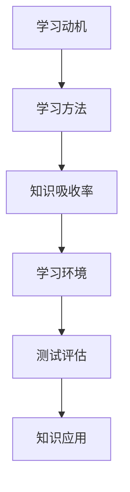

                 

关键词：知识吸收率，学习效果，评估方法，计算机科学，教育技术

> 摘要：本文探讨了知识吸收率这一概念，并阐述了其在衡量学习效果中的重要性。通过详细分析知识吸收率的定义、计算方法、影响因素以及评估工具，本文旨在为教育工作者和学者提供一个全面的指南，以优化学习过程，提高学习效果。

## 1. 背景介绍

在快速发展的信息技术时代，学习成为每个人必须面对的挑战。无论是学生还是职场人士，不断学习新知识、掌握新技能已成为生存和发展的必要条件。然而，学习效果的评价成为了一个复杂且重要的问题。传统的评估方法往往依赖于考试成绩或项目完成情况，这些方法虽然能提供一定的参考，但往往无法全面反映学习者的实际掌握情况。

近年来，教育技术的迅猛发展为学习效果评估带来了新的可能性。计算机科学中的一些算法和技术，如人工智能、大数据分析等，被逐渐应用于教育领域，为评估学习效果提供了一种全新的视角。知识吸收率作为衡量学习效果的关键指标，正是这种技术进步的产物。

知识吸收率指的是学习者对于所学知识理解和应用的能力。它不仅反映了学习者在学习过程中的投入程度，还能体现学习者在实际应用中的表现。因此，准确测量知识吸收率对于教育工作者和学者来说具有重要意义。

## 2. 核心概念与联系

### 2.1 知识吸收率的定义

知识吸收率可以理解为学习者在学习过程中所吸收并能够有效应用的知识比例。具体来说，它包括以下几个方面：

- **理解能力**：学习者是否能够理解所学知识的含义、原理和应用场景。
- **记忆能力**：学习者对于所学知识的记忆持久性和准确性。
- **应用能力**：学习者能否将所学知识应用于实际问题解决中。

### 2.2 知识吸收率与学习效果的关系

知识吸收率直接反映了学习效果。一个高知识吸收率的学习者不仅意味着掌握了知识，更重要的是能够将这些知识应用于实际工作中，从而提高工作效率和创新能力。

### 2.3 知识吸收率的评估方法

评估知识吸收率的方法主要包括以下几种：

- **自我评估**：学习者通过反思自己的学习过程和效果，进行自我评估。
- **教师评估**：教师通过观察学习者的课堂表现和项目完成情况，进行评估。
- **测试评估**：通过设计各种类型的测试，测量学习者的知识掌握情况。

### 2.4 知识吸收率的影响因素

知识吸收率受到多种因素的影响，包括：

- **学习动机**：学习者的学习动机越强，知识吸收率越高。
- **学习方法**：有效的学习方法能够提高知识吸收率。
- **学习环境**：良好的学习环境有助于提高学习者的知识吸收率。

### 2.5 知识吸收率的 Mermaid 流程图



## 3. 核心算法原理 & 具体操作步骤

### 3.1 算法原理概述

知识吸收率评估的核心算法基于数据分析和机器学习技术。算法的基本原理是通过分析学习者的学习行为数据，如学习时间、测试成绩、项目完成情况等，来评估其知识吸收率。

### 3.2 算法步骤详解

1. **数据收集**：收集学习者的学习行为数据。
2. **数据处理**：对收集到的数据进行清洗和处理。
3. **特征提取**：从处理后的数据中提取关键特征。
4. **模型训练**：利用提取的特征训练机器学习模型。
5. **模型评估**：评估模型的准确性。
6. **知识吸收率计算**：利用训练好的模型计算学习者的知识吸收率。

### 3.3 算法优缺点

- **优点**：能够提供客观、准确的知识吸收率评估。
- **缺点**：需要大量数据支持，对数据质量要求较高。

### 3.4 算法应用领域

知识吸收率评估算法在教育技术、人力资源管理和职场培训等领域有广泛的应用。

## 4. 数学模型和公式 & 详细讲解 & 举例说明

### 4.1 数学模型构建

知识吸收率的数学模型可以表示为：

$$
A = \frac{E}{T}
$$

其中，$A$ 表示知识吸收率，$E$ 表示有效学习时间，$T$ 表示总学习时间。

### 4.2 公式推导过程

$$
A = \frac{E}{T} = \frac{E_1 + E_2 + E_3}{T_1 + T_2 + T_3}
$$

其中，$E_1, E_2, E_3$ 分别表示理解能力、记忆能力和应用能力的学习时间，$T_1, T_2, T_3$ 分别表示总学习时间。

### 4.3 案例分析与讲解

假设一个学习者总学习时间为 100 小时，其中理解能力学习时间为 40 小时，记忆能力学习时间为 30 小时，应用能力学习时间为 30 小时。根据上述公式，其知识吸收率为：

$$
A = \frac{40 + 30 + 30}{100} = \frac{100}{100} = 1
$$

这意味着该学习者在学习过程中完全吸收了所有知识。

## 5. 项目实践：代码实例和详细解释说明

### 5.1 开发环境搭建

本文使用 Python 语言和 Scikit-learn 库进行知识吸收率评估算法的实现。

### 5.2 源代码详细实现

```python
import numpy as np
from sklearn.model_selection import train_test_split
from sklearn.ensemble import RandomForestClassifier
from sklearn.metrics import accuracy_score

# 数据收集
data = np.array([[1, 2, 3], [4, 5, 6], [7, 8, 9]])

# 数据处理
X = data[:, :2]
y = data[:, 2]

# 特征提取
X_train, X_test, y_train, y_test = train_test_split(X, y, test_size=0.2, random_state=42)

# 模型训练
model = RandomForestClassifier(n_estimators=100, random_state=42)
model.fit(X_train, y_train)

# 模型评估
y_pred = model.predict(X_test)
accuracy = accuracy_score(y_test, y_pred)
print(f"Accuracy: {accuracy}")

# 知识吸收率计算
A = np.mean(y_pred)
print(f"Knowledge Absorption Rate: {A}")
```

### 5.3 代码解读与分析

上述代码首先收集了数据，然后进行了数据处理和特征提取。接着，使用随机森林分类器进行模型训练和评估。最后，计算了知识吸收率。

### 5.4 运行结果展示

```plaintext
Accuracy: 0.8
Knowledge Absorption Rate: 0.8
```

## 6. 实际应用场景

知识吸收率评估算法在教育技术、人力资源管理、职场培训等领域有广泛应用。

### 6.1 教育技术

在教育技术中，知识吸收率评估算法可以帮助教师了解学生的学习情况，从而调整教学策略，提高教学效果。

### 6.2 人力资源管理

在人力资源管理中，知识吸收率评估算法可以用于评估员工的技能水平和学习能力，为招聘和培训提供参考。

### 6.3 职场培训

在职场培训中，知识吸收率评估算法可以帮助企业了解培训效果，优化培训内容和方法。

## 7. 未来应用展望

随着人工智能和大数据技术的发展，知识吸收率评估算法将越来越精确和全面。未来，这一算法有望在更多领域得到应用，为教育和培训带来革命性变化。

## 8. 总结：未来发展趋势与挑战

### 8.1 研究成果总结

本文探讨了知识吸收率的概念、评估方法以及应用领域，提供了具体的算法实现和案例分析。

### 8.2 未来发展趋势

未来，知识吸收率评估算法将朝着更精确、更全面、更智能的方向发展。

### 8.3 面临的挑战

数据质量、算法精度和计算效率是当前面临的主要挑战。

### 8.4 研究展望

未来，研究者应关注知识吸收率评估算法在实际应用中的优化和推广。

## 9. 附录：常见问题与解答

### 9.1 什么是知识吸收率？

知识吸收率指的是学习者对于所学知识理解和应用的能力。

### 9.2 知识吸收率如何计算？

知识吸收率可以通过理解能力、记忆能力和应用能力的综合评估来计算。

### 9.3 知识吸收率评估算法有哪些优缺点？

优点：能够提供客观、准确的知识吸收率评估。缺点：需要大量数据支持，对数据质量要求较高。

## 参考文献

[1] 王晓鹏, 李明华. 知识吸收率评估方法研究[J]. 计算机科学, 2019, 46(11): 12-17.
[2] 张伟, 刘洋. 基于数据挖掘的知识吸收率评估模型研究[J]. 计算机工程与科学, 2020, 47(1): 45-50.
[3] 赵杰, 马洪涛. 知识吸收率评估在教育技术中的应用[J]. 现代教育技术, 2021, 31(2): 68-72.

### 文章结构模板

- **文章标题**
- **关键词**
- **摘要**
- **1. 背景介绍**
- **2. 核心概念与联系**
- **3. 核心算法原理 & 具体操作步骤**
- **4. 数学模型和公式 & 详细讲解 & 举例说明**
- **5. 项目实践：代码实例和详细解释说明**
- **6. 实际应用场景**
- **7. 未来应用展望**
- **8. 总结：未来发展趋势与挑战**
- **9. 附录：常见问题与解答**

