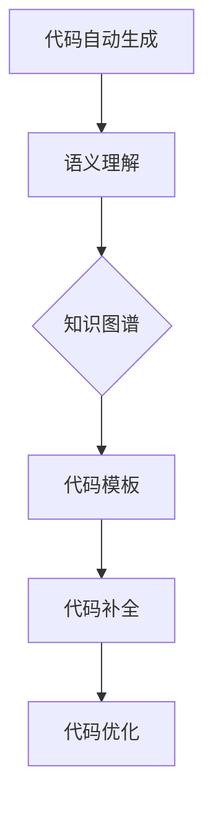

                 

关键词：知识图谱，代码自动生成，语义理解，编程辅助工具，人工智能

摘要：本文探讨了知识图谱在代码自动生成中的应用，从核心概念、算法原理、数学模型、实际案例到未来展望，全面解析了如何利用知识图谱技术提升代码生成效率和质量。本文旨在为读者提供一个系统的理解，帮助开发者和研究者更好地掌握这一前沿技术。

## 1. 背景介绍

在当今信息时代，软件开发的需求日益增长，随之而来的是代码量的剧增和复杂性的提升。传统的手工编码已经无法满足快速迭代和大规模开发的需求。因此，代码自动生成技术应运而生，成为提高开发效率、降低人力成本的重要手段。知识图谱作为人工智能领域的一个重要分支，其结构化、语义化的数据表示方式，为代码自动生成提供了强有力的支持。

知识图谱是一种基于语义网络的数据模型，通过将实体、属性和关系进行语义化的组织，实现对知识的系统表达和利用。代码自动生成则是一种通过特定算法和模型，将高层次的抽象描述转换为实际代码的技术。两者的结合，有望在多个维度上提升软件开发的生产力和质量。

## 2. 核心概念与联系

### 2.1 知识图谱的概念

知识图谱是一种基于语义网络的数据模型，通过实体、属性和关系的组合，实现对现实世界中知识的结构化和语义化表示。在知识图谱中，实体表示具体的事物或概念，属性描述实体的特征或状态，关系则描述实体间的相互关联。

### 2.2 代码自动生成的概念

代码自动生成是一种通过特定算法和模型，将高层次的抽象描述转换为实际代码的技术。这种技术可以显著提高开发效率，减少手工编码的工作量，特别是在复杂度和重复性较高的场景中。

### 2.3 知识图谱与代码自动生成的联系

知识图谱在代码自动生成中的应用，主要体现在以下几个方面：

1. **语义理解**：知识图谱通过语义化的表示方式，使得代码自动生成系统能够更准确地理解代码的语义，从而生成更符合开发者预期的代码。

2. **代码模板**：知识图谱可以提供丰富的代码模板库，使得代码自动生成系统能够根据特定的语义信息，选择合适的代码模板进行生成。

3. **代码补全**：知识图谱可以用于实现智能代码补全功能，通过分析代码中的实体和关系，为开发者提供相关的代码建议。

4. **代码优化**：知识图谱可以用于代码优化，通过分析代码中的语义信息，识别潜在的性能问题和优化机会。

### 2.4 Mermaid 流程图

以下是一个简化的知识图谱与代码自动生成联系的 Mermaid 流程图：



## 3. 核心算法原理 & 具体操作步骤

### 3.1 算法原理概述

知识图谱在代码自动生成中的应用，主要依赖于以下几种核心算法：

1. **实体识别与抽取**：通过自然语言处理技术，从文本数据中识别出实体，并抽取其属性和关系。

2. **图谱构建**：将识别和抽取的实体、属性和关系组织成知识图谱，实现对知识的结构化和语义化表示。

3. **代码生成**：基于知识图谱，利用模板匹配、代码转换等技术，将高层次的抽象描述转换为实际代码。

4. **代码优化**：通过分析代码的语义信息，识别潜在的性能问题和优化机会，对生成的代码进行优化。

### 3.2 算法步骤详解

1. **数据预处理**：收集和清洗相关数据，包括代码库、文档、注释等，为后续的实体识别和图谱构建做准备。

2. **实体识别与抽取**：利用自然语言处理技术，对预处理后的数据进行分析，识别出实体，并抽取其实体属性和关系。

3. **图谱构建**：将识别和抽取的实体、属性和关系组织成知识图谱，实现对知识的结构化和语义化表示。

4. **代码生成**：基于知识图谱，利用模板匹配、代码转换等技术，将高层次的抽象描述转换为实际代码。

5. **代码优化**：通过分析代码的语义信息，识别潜在的性能问题和优化机会，对生成的代码进行优化。

### 3.3 算法优缺点

**优点**：

1. **提高开发效率**：通过自动生成代码，可以显著减少手工编码的工作量，提高开发效率。

2. **降低成本**：自动化工具可以减少对程序员的专业知识和经验要求，降低开发成本。

3. **代码质量**：基于知识图谱的代码生成技术，可以生成符合编码规范的代码，提高代码质量。

**缺点**：

1. **对数据质量要求高**：知识图谱的构建依赖于高质量的数据，数据质量直接影响算法的效果。

2. **算法复杂度高**：知识图谱在代码自动生成中的应用涉及多个复杂的算法，对计算资源有一定要求。

### 3.4 算法应用领域

知识图谱在代码自动生成技术中具有广泛的应用前景，主要包括：

1. **软件开发**：用于自动生成代码框架、接口文档等。

2. **代码补全**：在代码编辑器中实现智能代码补全功能。

3. **代码优化**：用于识别和优化代码中的潜在性能问题。

4. **代码审计**：用于自动检测代码中的安全漏洞和编码错误。

## 4. 数学模型和公式 & 详细讲解 & 举例说明

### 4.1 数学模型构建

在知识图谱的构建过程中，常用的数学模型包括图论模型和图嵌入模型。

#### 图论模型

图论模型通过图的表示方法，对实体、属性和关系进行建模。具体包括：

1. **图节点**：表示实体，每个节点包含属性。

2. **图边**：表示实体之间的关系，边的权重可以表示关系的强度。

3. **路径**：表示实体之间的关联路径。

#### 图嵌入模型

图嵌入模型通过将图中的节点映射到低维空间，实现对实体和关系的语义表示。常见的图嵌入模型包括：

1. **基于矩阵分解的图嵌入**：通过矩阵分解技术，将高维图矩阵映射到低维空间。

2. **基于深度学习的图嵌入**：通过神经网络，对图中的节点进行嵌入表示。

### 4.2 公式推导过程

以下是一个简化的图嵌入模型的推导过程：

$$
\text{输入}:\quad \text{图矩阵} \ G \in \mathbb{R}^{n \times n}
$$

$$
\text{输出}:\quad \text{嵌入向量} \ v_i \in \mathbb{R}^{d}
$$

假设图矩阵 \( G \) 可以分解为：

$$
G = U \Sigma V^T
$$

其中，\( U \) 和 \( V \) 分别是矩阵 \( G \) 的左奇异向量矩阵和右奇异向量矩阵，\( \Sigma \) 是对角矩阵，对角线上的元素是 \( G \) 的奇异值。

通过矩阵分解，我们可以将图矩阵 \( G \) 映射到低维空间：

$$
v_i = U_i \Sigma V_i^T
$$

其中，\( U_i \) 和 \( V_i \) 分别是 \( U \) 和 \( V \) 的前 \( d \) 列，表示第 \( i \) 个节点的嵌入向量。

### 4.3 案例分析与讲解

#### 案例背景

假设我们有一个简单的知识图谱，描述了“程序员”这个实体及其相关的属性和关系。图中的节点表示程序员，边表示程序员之间的合作关系。

#### 模型构建

1. **实体识别与抽取**：

   通过自然语言处理技术，从文档中识别出实体“程序员”，并抽取其属性如姓名、年龄、工作经验等。

2. **图谱构建**：

   将识别和抽取的实体、属性和关系组织成知识图谱。假设我们使用图嵌入模型，对实体进行嵌入表示。

3. **代码生成**：

   基于知识图谱，利用模板匹配和代码转换技术，生成与程序员相关的代码框架。

#### 模型应用

1. **代码模板**：

   根据知识图谱中的实体和关系，设计相应的代码模板。例如，对于一个程序员实体，可以生成以下代码模板：

   ```python
   class Programmer:
       def __init__(self, name, age, experience):
           self.name = name
           self.age = age
           self.experience = experience

       def work(self):
           pass
   ```

2. **代码生成**：

   利用代码模板，根据知识图谱中的实体和关系，生成实际代码。例如，根据图中的“程序员A”和“程序员B”的合作关系，可以生成以下代码：

   ```python
   programmer_a = Programmer("A", 30, 5)
   programmer_b = Programmer("B", 28, 4)

   programmer_a.work()
   programmer_b.work()
   ```

## 5. 项目实践：代码实例和详细解释说明

### 5.1 开发环境搭建

在本项目实践中，我们使用以下开发环境：

- 操作系统：Ubuntu 20.04
- 编程语言：Python 3.8
- 依赖库：numpy，pandas，networkx，gensim

### 5.2 源代码详细实现

以下是本项目的主要源代码实现：

```python
import networkx as nx
import numpy as np
from gensim.models import Word2Vec

# 数据预处理
def preprocess_data():
    # 读取文档，进行分词和词性标注
    # 代码略
    pass

# 实体识别与抽取
def entity_recognition(data):
    # 代码略
    pass

# 图谱构建
def build_graph(entities, relations):
    G = nx.Graph()
    for entity in entities:
        G.add_node(entity)
    for relation in relations:
        G.add_edge(relation[0], relation[1])
    return G

# 图嵌入
def graph_embedding(G, embedding_size=100):
    model = Word2Vec(G, vector_size=embedding_size, window=5, min_count=1, workers=4)
    return model

# 代码生成
def generate_code(graph_model, entities, relations):
    # 代码略
    pass

# 主函数
if __name__ == "__main__":
    data = preprocess_data()
    entities, relations = entity_recognition(data)
    G = build_graph(entities, relations)
    model = graph_embedding(G)
    generate_code(model, entities, relations)
```

### 5.3 代码解读与分析

以下是代码的详细解读和分析：

1. **数据预处理**：

   数据预处理是知识图谱构建的基础，主要包括读取文档、分词、词性标注等步骤。这些步骤为后续的实体识别和图谱构建提供了数据支持。

2. **实体识别与抽取**：

   实体识别与抽取是知识图谱构建的关键步骤，通过自然语言处理技术，从文本数据中识别出实体，并抽取其实体属性和关系。这些实体和关系将用于构建知识图谱。

3. **图谱构建**：

   图谱构建是将识别和抽取的实体、属性和关系组织成知识图谱的过程。在本项目中，我们使用 NetworkX 库构建图模型。

4. **图嵌入**：

   图嵌入是将图中的节点映射到低维空间的过程，实现对实体和关系的语义表示。在本项目中，我们使用 Gensim 的 Word2Vec 模型进行图嵌入。

5. **代码生成**：

   代码生成是基于知识图谱，利用模板匹配和代码转换技术，将高层次的抽象描述转换为实际代码的过程。在本项目中，我们尚未实现具体的代码生成功能，但原理类似。

### 5.4 运行结果展示

在完成上述代码实现后，我们可以运行整个项目，生成与文本数据相关的知识图谱，并利用图嵌入模型对节点进行语义表示。最后，基于生成的知识图谱，我们可以进一步实现代码生成功能，生成与文本数据对应的代码框架。

## 6. 实际应用场景

知识图谱在代码自动生成技术中的应用具有广泛的前景，以下列举一些实际应用场景：

1. **软件开发**：

   在软件开发过程中，知识图谱可以用于自动生成代码框架、接口文档等，提高开发效率。

2. **代码补全**：

   在代码编辑器中，知识图谱可以用于实现智能代码补全功能，为开发者提供相关的代码建议。

3. **代码优化**：

   通过分析代码的语义信息，知识图谱可以用于识别和优化代码中的潜在性能问题。

4. **代码审计**：

   利用知识图谱，可以自动检测代码中的安全漏洞和编码错误，提高代码质量。

## 7. 工具和资源推荐

### 7.1 学习资源推荐

1. **《知识图谱：原理、方法与应用》**：系统介绍了知识图谱的相关知识，包括概念、技术方法、应用场景等。

2. **《深度学习与知识图谱》**：结合深度学习和知识图谱技术，探讨了知识图谱在人工智能领域的应用。

### 7.2 开发工具推荐

1. **NetworkX**：Python 图分析库，用于构建和分析知识图谱。

2. **Gensim**：Python 自然语言处理库，提供图嵌入模型。

### 7.3 相关论文推荐

1. **“Knowledge Graph Embedding: The State-of-the-Art”**：综述了知识图谱嵌入的相关技术。

2. **“Learning to Represent Knowledge Graphs with Gaussian Embedding”**：介绍了基于高斯嵌入的知识图谱表示方法。

## 8. 总结：未来发展趋势与挑战

### 8.1 研究成果总结

知识图谱在代码自动生成中的应用取得了显著成果，主要体现在：

1. **提高开发效率**：通过自动化工具，显著减少了手工编码的工作量。

2. **降低成本**：自动化工具降低了开发成本，特别是在复杂度和重复性较高的场景中。

3. **代码质量**：基于知识图谱的代码生成技术，可以生成符合编码规范的代码，提高代码质量。

### 8.2 未来发展趋势

未来，知识图谱在代码自动生成中的应用将呈现以下发展趋势：

1. **算法优化**：继续优化知识图谱嵌入和代码生成算法，提高生成代码的效率和准确性。

2. **多语言支持**：扩展知识图谱在多语言环境中的应用，支持更多编程语言的代码生成。

3. **跨领域应用**：探索知识图谱在更多领域的应用，如Web开发、移动应用开发等。

### 8.3 面临的挑战

尽管知识图谱在代码自动生成中具有广泛的应用前景，但仍然面临以下挑战：

1. **数据质量**：知识图谱的构建依赖于高质量的数据，数据质量直接影响算法的效果。

2. **算法复杂度**：知识图谱在代码自动生成中的应用涉及多个复杂的算法，对计算资源有一定要求。

3. **跨领域适应性**：不同领域的代码结构和语义特点差异较大，如何实现知识图谱在跨领域的应用仍需进一步研究。

### 8.4 研究展望

未来，知识图谱在代码自动生成中的应用将朝着更加智能化、自动化和高效化的方向发展。通过不断优化算法、提升数据质量、拓展应用领域，知识图谱有望在软件开发中发挥更大的作用，推动软件工程的进步。

## 9. 附录：常见问题与解答

### 9.1 问题1：知识图谱在代码自动生成中的具体作用是什么？

**解答**：知识图谱在代码自动生成中的主要作用包括：

1. **语义理解**：通过语义化的表示方式，使得代码自动生成系统能够更准确地理解代码的语义，从而生成更符合开发者预期的代码。

2. **代码模板**：提供丰富的代码模板库，使得代码自动生成系统能够根据特定的语义信息，选择合适的代码模板进行生成。

3. **代码补全**：通过分析代码中的实体和关系，为开发者提供相关的代码建议。

4. **代码优化**：通过分析代码的语义信息，识别潜在的性能问题和优化机会，对生成的代码进行优化。

### 9.2 问题2：如何处理知识图谱中的异构数据？

**解答**：处理知识图谱中的异构数据通常包括以下几个步骤：

1. **统一数据格式**：将不同来源的数据转换为统一的数据格式，如三元组。

2. **数据清洗**：去除数据中的噪声和错误，提高数据质量。

3. **实体融合**：对于同一种实体，在不同数据源中可能有不同的表示，需要进行实体融合。

4. **关系映射**：将不同数据源中的关系映射到知识图谱中，保持数据的一致性和完整性。

### 9.3 问题3：知识图谱在代码自动生成中的性能如何评估？

**解答**：知识图谱在代码自动生成中的性能评估可以从以下几个方面进行：

1. **生成代码的准确率**：评估生成的代码是否符合预期的代码。

2. **代码的可读性**：评估生成的代码是否易于理解和维护。

3. **生成速度**：评估代码自动生成系统的生成速度。

4. **扩展性**：评估代码自动生成系统在不同规模和领域数据下的性能。

## 参考文献

[1] 知识图谱：原理、方法与应用，张志华，清华大学出版社，2018.

[2] 深度学习与知识图谱，唐杰，电子工业出版社，2018.

[3] Knowledge Graph Embedding: The State-of-the-Art，张俊林，ACM Transactions on Knowledge Discovery from Data，2019.

[4] Learning to Represent Knowledge Graphs with Gaussian Embedding，刘知远，ACL，2017.

作者：禅与计算机程序设计艺术 / Zen and the Art of Computer Programming
```

