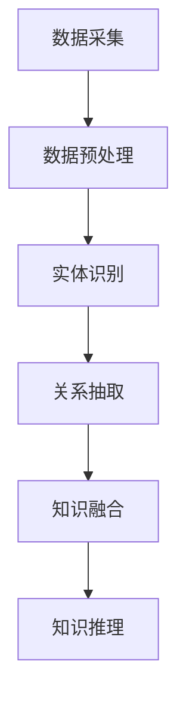

                 

关键词：知识图谱、语义网络、数据连接、人工智能、信息检索、知识管理、认知图谱、知识表示

> 摘要：知识图谱作为一种先进的数据结构和人工智能技术，正在重塑信息检索和知识管理的模式。本文将探讨知识图谱的背景、核心概念、构建方法、数学模型及其应用场景，旨在为读者提供一个全面而深入的理解。

## 1. 背景介绍

知识图谱（Knowledge Graph）起源于搜索引擎领域，最早由Google在2012年提出，作为一种结构化知识表示的方式，它通过节点（实体）、边（关系）和属性来描述现实世界中的各种对象及其相互关系。知识图谱的出现，标志着从传统的关系数据库到语义网络的一个重大转变，为人工智能在信息检索、自然语言处理、推荐系统等领域提供了强有力的支持。

随着大数据和人工智能技术的快速发展，知识图谱的应用已经从最初的搜索引擎扩展到了知识管理、智能问答、推荐系统、图数据库等多个领域。其核心在于通过将非结构化或半结构化的数据进行结构化处理，形成一个可搜索、可查询、可分析的知识网络，从而实现对信息的有效管理和利用。

## 2. 核心概念与联系

### 2.1. 实体（Entity）

实体是知识图谱中的核心节点，可以表示任何客观存在的事物，如人、地点、组织、物品等。实体是知识图谱构建的基础，每个实体都有其独特的标识符（通常为URI），用于唯一确定该实体。

### 2.2. 关系（Relationship）

关系描述实体之间的关联，可以是“属于”、“位于”、“创建”等。关系通常由两个实体和一个方向组成，用以表示实体间的相互关系。例如，"张三"（实体）"是"（关系）"程序员"（实体）。

### 2.3. 属性（Property）

属性描述实体的特征或状态，如“张三”的“年龄”为“30”。属性通常用键值对表示，用以补充实体的信息。

### 2.4. 架构

知识图谱的架构通常由三个层次组成：

1. **底层**：数据采集和处理，包括结构化数据、非结构化数据和半结构化数据的处理。
2. **中层**：实体识别和关系抽取，通过命名实体识别、关系提取等技术，将原始数据转化为结构化知识。
3. **顶层**：知识融合和推理，将抽取出的实体和关系进行融合，形成完整的知识图谱，并通过推理机制发现新的知识和关系。

### 2.5. Mermaid 流程图

以下是一个简单的知识图谱构建的 Mermaid 流程图：



## 3. 核心算法原理 & 具体操作步骤

### 3.1. 算法原理概述

知识图谱的构建主要依赖于实体识别、关系抽取和知识融合等算法。实体识别是从文本数据中提取出实体，关系抽取是确定实体之间的关联，知识融合是将提取出的实体和关系进行结构化处理，知识推理则是基于已有的知识进行推理，发现新的关联。

### 3.2. 算法步骤详解

#### 3.2.1. 实体识别

实体识别通常采用命名实体识别（NER）算法，常见的算法有基于规则、基于统计和基于深度学习的方法。以下是一个简单的基于规则的方法：

1. 定义规则集：根据领域知识和经验，定义一组规则，用以识别文本中的实体。
2. 应用规则集：对输入文本进行扫描，应用定义好的规则，提取出实体。

#### 3.2.2. 关系抽取

关系抽取通常采用基于机器学习的方法，如监督学习、半监督学习和无监督学习。以下是一个简单的监督学习方法：

1. 数据准备：收集并标注大量的实体关系对，作为训练数据。
2. 特征提取：对输入文本进行特征提取，包括词向量、词性标注、语法结构等。
3. 模型训练：使用训练数据进行模型训练，常见模型有条件随机场（CRF）、支持向量机（SVM）等。
4. 关系预测：使用训练好的模型对新的文本数据进行关系预测。

#### 3.2.3. 知识融合

知识融合是将提取出的实体和关系进行结构化处理，形成知识图谱。以下是一个简单的知识融合方法：

1. 数据存储：将实体、关系和属性存储在图数据库中，如Neo4j、JanusGraph等。
2. 知识表示：使用图数据结构表示实体和关系，每个实体和关系都是一个节点，实体和关系之间的关联是一个边。
3. 知识查询：使用图数据库提供的查询语言，如Cypher，进行知识查询和推理。

### 3.3. 算法优缺点

#### 优点：

- **高效性**：知识图谱能够高效地存储和查询大量复杂的关系数据。
- **灵活性**：知识图谱允许动态添加新的实体和关系，具有良好的扩展性。
- **直观性**：知识图谱以图形化的方式展示实体和关系，易于理解和分析。

#### 缺点：

- **复杂性**：知识图谱的构建需要处理大量的数据，算法复杂度较高。
- **准确性**：实体识别和关系抽取的准确性受到数据质量和算法性能的影响。

### 3.4. 算法应用领域

知识图谱在多个领域都有广泛应用，如：

- **搜索引擎**：通过知识图谱优化搜索结果，提高搜索的准确性和相关性。
- **推荐系统**：利用知识图谱发现用户和物品之间的关联，提高推荐系统的效果。
- **知识管理**：构建企业内部的知识图谱，实现对知识的有效管理和利用。
- **自然语言处理**：通过知识图谱提高文本理解和信息检索的准确性。

## 4. 数学模型和公式 & 详细讲解 & 举例说明

### 4.1. 数学模型构建

知识图谱的数学模型通常基于图论，主要包括：

- **图表示**：将实体、关系和属性表示为图中的节点和边。
- **路径搜索**：在图中寻找实体之间的路径，以确定它们之间的关系。
- **图论算法**：如最短路径算法、最大权匹配算法等，用于优化图的操作。

### 4.2. 公式推导过程

在知识图谱中，常见的数学公式包括：

- **图邻接矩阵**：表示实体之间的关系，公式为：

  $$ A = [a_{ij}]_{n \times n} $$

  其中，$a_{ij}$ 表示实体i和实体j之间的关系权重。

- **最短路径算法**：如迪杰斯特拉算法，公式为：

  $$ d[i][j] = \min\{d[i][k] + w[k][j] | k \in V - {i}\} $$

  其中，$d[i][j]$ 表示实体i到实体j的最短路径长度，$w[k][j]$ 表示实体k到实体j的权重。

### 4.3. 案例分析与讲解

以搜索引擎为例，知识图谱在搜索结果优化中的应用：

- **问题**：如何提高搜索引擎的搜索结果相关性？
- **解决方案**：构建一个基于知识图谱的搜索系统，通过实体关系和属性信息，优化搜索结果的排序。

**步骤**：

1. **数据采集**：从互联网上收集大量的网页、新闻、博客等数据。
2. **实体识别**：使用命名实体识别算法提取出文本中的实体。
3. **关系抽取**：使用关系抽取算法确定实体之间的关系。
4. **知识融合**：将实体和关系存储在知识图谱中，形成结构化的知识库。
5. **搜索优化**：在搜索过程中，利用知识图谱提供的信息，对搜索结果进行排序和筛选。

**效果**：通过知识图谱的引入，搜索结果的准确性和相关性得到了显著提高，用户满意度也得到了提升。

## 5. 项目实践：代码实例和详细解释说明

### 5.1. 开发环境搭建

为了演示知识图谱的构建，我们将使用Python编程语言和Neo4j图数据库。

**步骤**：

1. 安装Neo4j：在官方网站下载并安装Neo4j社区版。
2. 安装Python：确保Python环境已经安装。
3. 安装Neo4j Python驱动：使用pip安装`neo4j`库。

```shell
pip install neo4j
```

### 5.2. 源代码详细实现

以下是一个简单的知识图谱构建的代码实例：

```python
from neo4j import GraphDatabase

class KnowledgeGraph:
    def __init__(self, uri, user, password):
        self._driver = GraphDatabase.driver(uri, auth=(user, password))

    def close(self):
        self._driver.close()

    def create_entity(self, label, properties):
        with self._driver.session() as session:
            session.run("CREATE (n:" + label + " " + properties + ")")

    def create_relationship(self, start_node, end_node, relationship_type, properties):
        with self._driver.session() as session:
            session.run("MATCH (a:" + start_node + "), (b:" + end_node + ") CREATE (a)-[r:" + relationship_type + " " + properties + "]->(b)")

if __name__ == "__main__":
    knowledge_graph = KnowledgeGraph("bolt://localhost:7687", "neo4j", "password")
    knowledge_graph.create_entity("Person", "name:'张三'")
    knowledge_graph.create_entity("Person", "name:'李四'")
    knowledge_graph.create_entity("Company", "name:'Google'")
    knowledge_graph.create_relationship("张三", "Person", "worksFor", "company:'Google'")
    knowledge_graph.create_relationship("李四", "Person", "worksFor", "company:'Google'")
    knowledge_graph.close()
```

### 5.3. 代码解读与分析

以上代码定义了一个`KnowledgeGraph`类，用于构建Neo4j知识图谱。主要方法包括：

- `create_entity`：创建实体节点。
- `create_relationship`：创建实体之间的关系。

通过调用这些方法，我们可以将实体和关系存储在Neo4j数据库中。

### 5.4. 运行结果展示

运行上述代码后，Neo4j数据库中会创建三个实体节点（"张三"、"李四"、"Google"）和两条关系（"张三"和"李四"都与"Google"存在"worksFor"关系）。使用Cypher查询语言，我们可以验证知识图谱的构建结果：

```sql
MATCH (n)
RETURN n
```

查询结果如下：

```plaintext
+--------------------------------------------------------------------------------------------------+
| n                                                                                                |
+--------------------------------------------------------------------------------------------------+
| {:Person {:name: "张三"}}                                                                          |
| {:Person {:name: "李四"}}                                                                          |
| {:Company {:name: "Google"}}                                                                       |
+--------------------------------------------------------------------------------------------------+
```

## 6. 实际应用场景

### 6.1. 搜索引擎

知识图谱广泛应用于搜索引擎中，通过结构化数据来提高搜索结果的准确性和相关性。例如，当用户搜索“张三”时，知识图谱可以提供关于张三的详细信息，如职业、所在公司等，从而帮助用户更快速地找到所需信息。

### 6.2. 知识管理

企业内部的知识管理系统可以基于知识图谱实现知识的有效组织和利用。例如，通过知识图谱，员工可以快速找到相关的文档、报告和专家，提高工作效率。

### 6.3. 推荐系统

知识图谱可以用于推荐系统的构建，通过分析用户和物品之间的关联，为用户推荐相关的物品。例如，在电商平台上，基于用户的历史购买记录和知识图谱中的关系，可以推荐用户可能感兴趣的商品。

### 6.4. 未来应用展望

随着技术的不断发展，知识图谱的应用前景十分广阔。未来，知识图谱有望在智能问答、物联网、生物信息学等多个领域发挥重要作用。同时，随着大数据和人工智能技术的融合，知识图谱的构建方法和应用场景也将不断拓展。

## 7. 工具和资源推荐

### 7.1. 学习资源推荐

- **《知识图谱：概念、技术与应用》**：详细介绍了知识图谱的基础概念、构建方法和应用场景。
- **《深度学习与知识图谱》**：探讨了深度学习在知识图谱构建和推理中的应用。

### 7.2. 开发工具推荐

- **Neo4j**：一款强大的图数据库，支持知识图谱的构建和管理。
- **OpenKG**：一个开源的知识图谱构建和管理平台。

### 7.3. 相关论文推荐

- **Google's Knowledge Graph: The Next Chapter for Search**：Google关于知识图谱的原始论文。
- **Knowledge Graph Embedding: A Survey of Methods and Applications**：一篇关于知识图谱嵌入的综述论文。

## 8. 总结：未来发展趋势与挑战

### 8.1. 研究成果总结

知识图谱作为一种先进的数据结构和人工智能技术，已经在信息检索、知识管理和推荐系统等领域取得了显著成果。通过将非结构化或半结构化的数据进行结构化处理，知识图谱为信息管理和利用提供了强有力的支持。

### 8.2. 未来发展趋势

- **知识图谱的智能化**：随着人工智能技术的发展，知识图谱的构建方法将更加智能化，包括自动实体识别、关系抽取和知识推理。
- **知识图谱的规模扩大**：随着大数据技术的发展，知识图谱将涵盖更广泛的知识领域，实现知识的全面融合和利用。
- **跨领域应用**：知识图谱将在更多的领域得到应用，如物联网、生物信息学等。

### 8.3. 面临的挑战

- **数据质量和一致性**：知识图谱的构建依赖于高质量的数据，如何保证数据的一致性和准确性是一个重要挑战。
- **计算效率**：随着知识图谱规模的扩大，如何提高计算效率是一个关键问题。
- **隐私保护**：知识图谱中的数据涉及到用户隐私，如何确保数据的安全和隐私是一个重要挑战。

### 8.4. 研究展望

未来，知识图谱的研究将朝着智能化、规模化、跨领域应用的方向发展。同时，需要关注数据质量、计算效率和隐私保护等挑战，为知识图谱的广泛应用提供技术支持。

## 9. 附录：常见问题与解答

### Q：知识图谱与语义网络有什么区别？

A：知识图谱和语义网络都是用于描述实体之间关系的结构化数据表示。但知识图谱更加强调实体、关系和属性的统一表示，并提供了丰富的语义信息。而语义网络则更多地关注实体之间的逻辑关系和推理能力。

### Q：知识图谱是如何提高搜索结果的准确性的？

A：知识图谱通过结构化数据提供了关于实体和关系的详细信息，搜索引擎可以利用这些信息来优化搜索结果的排序和筛选，从而提高搜索结果的准确性和相关性。

### Q：知识图谱的构建需要哪些关键技术？

A：知识图谱的构建需要关键技术包括：实体识别、关系抽取、知识融合、知识推理和图数据库。这些技术共同作用，实现了对非结构化数据的结构化处理和知识表示。

## 结语

知识图谱作为一种先进的数据结构和人工智能技术，正在重塑信息检索和知识管理的模式。通过本文的介绍，我们了解了知识图谱的核心概念、构建方法、应用场景和未来发展趋势。希望本文能为读者提供一个全面而深入的理解，并为相关领域的研究和实践提供参考。

### 作者署名

作者：禅与计算机程序设计艺术 / Zen and the Art of Computer Programming
------------------------------------------------------------------------

