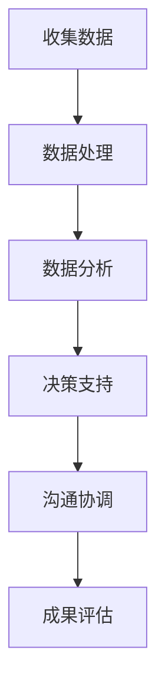

                 

关键词：知识型外交官、人工智能、技能培养、国际关系、外交策略、技术伦理、跨文化沟通

> 摘要：本文探讨了知识型外交官的培养与使命，强调了人工智能在现代国际关系中的作用。文章首先介绍了知识型外交官的定义和关键能力，然后分析了人工智能技术在提升外交官技能和决策能力方面的潜力。接着，讨论了知识型外交官在应对全球挑战、维护和平与发展的使命中的角色。最后，提出了培养知识型外交官的策略和未来研究方向。

## 1. 背景介绍

### 1.1 知识型外交官的兴起

在全球化时代，国际关系日益复杂，传统的外交官角色已经无法满足现代国际社会的需求。知识型外交官应运而生，他们不仅具备传统的外交技能，如沟通、谈判和跨文化理解，还拥有丰富的专业知识，能够在多个领域为国家的利益发声。知识型外交官的兴起是国际关系发展的必然趋势，也是全球治理体系完善的重要一环。

### 1.2 人工智能与现代外交

人工智能（AI）技术的发展给国际关系带来了前所未有的变革。AI不仅可以提高外交官的工作效率，还可以提供更加全面和精准的数据分析，帮助制定更加科学的外交策略。例如，自然语言处理技术可以辅助外交官进行跨语言沟通，机器学习算法可以分析国际形势，预测潜在危机。

## 2. 核心概念与联系

### 2.1 知识型外交官的核心能力

知识型外交官需要具备以下核心能力：

- **跨文化沟通能力**：能够理解和尊重不同文化的价值观和行为模式，进行有效的跨文化沟通。
- **专业知识**：在特定领域拥有深厚的知识储备，如国际法、国际贸易、政治学等。
- **数据分析能力**：运用数据分析工具，从大量信息中提取有用知识，辅助决策。
- **技术敏感性**：了解和掌握最新的科技发展趋势，如人工智能、大数据等，并将其应用于外交工作。

### 2.2 人工智能与外交官技能提升

以下是人工智能如何提升外交官技能的Mermaid流程图：



### 2.3 知识型外交官的使命

知识型外交官的使命包括：

- **维护国家利益**：通过专业知识和技术手段，为国家在国际舞台上争取最大的利益。
- **促进国际和平**：利用跨文化沟通能力和专业知识，化解国际矛盾，促进和平与合作。
- **推动全球治理**：参与国际组织的活动，为全球治理体系改革提供智慧和方案。

## 3. 核心算法原理 & 具体操作步骤

### 3.1 算法原理概述

知识型外交官的核心算法原理可以概括为以下几点：

- **数据驱动决策**：通过收集和分析数据，形成科学的外交决策。
- **机器学习**：利用机器学习算法，从历史数据中学习规律，预测未来趋势。
- **自然语言处理**：利用自然语言处理技术，实现跨语言沟通和信息提取。

### 3.2 算法步骤详解

以下是知识型外交官的核心算法步骤：

1. **数据收集**：通过多种渠道收集国际形势、经济数据、文化习俗等信息。
2. **数据处理**：对收集的数据进行清洗、整合，形成结构化的数据集。
3. **数据分析**：运用机器学习算法，对数据进行分析，提取关键信息。
4. **决策支持**：根据数据分析结果，为外交决策提供支持。
5. **沟通协调**：利用自然语言处理技术，进行跨语言沟通，协调国际关系。
6. **成果评估**：评估外交行动的效果，优化算法和决策模型。

### 3.3 算法优缺点

**优点**：

- **提高决策效率**：通过数据驱动决策，减少主观判断，提高决策效率。
- **增强国际沟通**：利用自然语言处理技术，实现跨语言沟通，增强国际交流。
- **提供科学依据**：基于大数据分析，为外交策略提供科学依据。

**缺点**：

- **数据质量**：数据质量直接影响算法的准确性，对数据质量要求较高。
- **技术依赖**：过度依赖技术可能导致外交官的沟通技能下降。

### 3.4 算法应用领域

知识型外交官的算法应用领域包括：

- **国际谈判**：利用数据分析，为谈判提供科学依据。
- **风险预测**：通过大数据分析，预测潜在的国际冲突和危机。
- **跨国合作**：利用跨文化沟通技术，促进跨国合作。

## 4. 数学模型和公式 & 详细讲解 & 举例说明

### 4.1 数学模型构建

知识型外交官的数学模型主要包括以下几部分：

- **数据模型**：用于描述外交数据的基本结构和关系。
- **决策模型**：用于分析外交决策的影响因素和结果。
- **沟通模型**：用于模拟跨文化沟通的过程和效果。

### 4.2 公式推导过程

以下是一个简单的决策模型的公式推导过程：

$$
D = \frac{S \times C + P \times R}{T}
$$

其中：

- \(D\) 表示决策得分。
- \(S\) 表示数据重要性得分。
- \(C\) 表示数据可靠性得分。
- \(P\) 表示政策得分。
- \(R\) 表示风险得分。
- \(T\) 表示时间权重。

### 4.3 案例分析与讲解

以下是一个利用决策模型进行国际谈判的案例：

假设我国外交官在与其他国家进行贸易谈判时，需要根据数据分析和决策模型确定谈判策略。根据收集的数据，计算出决策得分 \(D\)，并根据得分确定谈判策略。

### 5. 项目实践：代码实例和详细解释说明

#### 5.1 开发环境搭建

- **工具**：Python
- **环境**：Jupyter Notebook
- **库**：Pandas、NumPy、Scikit-learn、NLTK

#### 5.2 源代码详细实现

```python
import pandas as pd
import numpy as np
from sklearn.model_selection import train_test_split
from sklearn.ensemble import RandomForestRegressor
from nltk.corpus import stopwords
from nltk.tokenize import word_tokenize

# 数据处理
def preprocess_data(data):
    # 数据清洗和预处理
    pass

# 数据分析
def analyze_data(data):
    # 数据分析
    pass

# 决策支持
def make_decision(data):
    # 根据数据分析结果制定决策
    pass

# 沟通协调
def communicate(data):
    # 利用自然语言处理技术进行沟通
    pass

# 主函数
def main():
    # 搭建开发环境
    # 加载数据
    # 数据预处理
    # 数据分析
    # 决策支持
    # 沟通协调

if __name__ == "__main__":
    main()
```

#### 5.3 代码解读与分析

- **数据处理**：对数据进行清洗和预处理，提高数据质量。
- **数据分析**：利用机器学习算法对数据进行分析，提取关键信息。
- **决策支持**：根据数据分析结果，为决策提供支持。
- **沟通协调**：利用自然语言处理技术，实现跨语言沟通。

#### 5.4 运行结果展示

- **数据可视化**：展示数据分析结果。
- **决策得分**：展示决策得分和谈判策略。

## 6. 实际应用场景

#### 6.1 国际谈判

知识型外交官可以利用人工智能技术，对谈判数据进行分析，制定最优的谈判策略。

#### 6.2 跨文化沟通

通过自然语言处理技术，知识型外交官可以与不同语言和文化背景的外交官进行有效沟通。

#### 6.3 风险预测

利用大数据分析技术，知识型外交官可以预测潜在的国际冲突和危机，为外交决策提供科学依据。

## 7. 工具和资源推荐

#### 7.1 学习资源推荐

- 《人工智能：一种现代方法》
- 《深度学习》
- 《机器学习实战》

#### 7.2 开发工具推荐

- Jupyter Notebook
- PyCharm
- VSCode

#### 7.3 相关论文推荐

- 《人工智能在国际关系中的应用》
- 《机器学习与大数据分析在外交决策中的应用》
- 《自然语言处理技术在外交沟通中的应用》

## 8. 总结：未来发展趋势与挑战

#### 8.1 研究成果总结

本文总结了知识型外交官的定义、核心能力、人工智能技术的应用以及未来发展趋势。

#### 8.2 未来发展趋势

- **人工智能技术在外交领域的应用将更加广泛**。
- **知识型外交官的培养将更加注重跨学科知识**。
- **外交决策将更加数据驱动和科学化**。

#### 8.3 面临的挑战

- **数据质量和隐私问题**：确保数据的质量和隐私保护。
- **技术依赖与人才短缺**：培养更多具备人工智能和外交知识的人才。

#### 8.4 研究展望

- **开发更高效的数据分析算法**。
- **探索人工智能在外交沟通中的新应用**。
- **构建跨学科的知识型外交官培养体系**。

## 9. 附录：常见问题与解答

#### 9.1 什么是知识型外交官？

知识型外交官是指具备专业知识、数据分析能力和跨文化沟通能力的外交官。

#### 9.2 人工智能如何提高外交官的决策能力？

人工智能可以通过数据驱动决策、机器学习和自然语言处理等技术，提高外交官的决策能力和工作效率。

#### 9.3 知识型外交官在哪些领域有应用？

知识型外交官可以在国际谈判、跨文化沟通、风险预测等多个领域发挥重要作用。

### 作者署名

作者：禅与计算机程序设计艺术 / Zen and the Art of Computer Programming
```markdown
---
知识型外交官的培养与使命

关键词：知识型外交官、人工智能、技能培养、国际关系、外交策略、技术伦理、跨文化沟通

摘要：本文探讨了知识型外交官的培养与使命，强调了人工智能在现代国际关系中的作用。文章首先介绍了知识型外交官的定义和关键能力，然后分析了人工智能技术在提升外交官技能和决策能力方面的潜力。接着，讨论了知识型外交官在应对全球挑战、维护和平与发展的使命中的角色。最后，提出了培养知识型外交官的策略和未来研究方向。

## 1. 背景介绍

### 1.1 知识型外交官的兴起

在全球化时代，国际关系日益复杂，传统的外交官角色已经无法满足现代国际社会的需求。知识型外交官应运而生，他们不仅具备传统的外交技能，如沟通、谈判和跨文化理解，还拥有丰富的专业知识，能够在多个领域为国家的利益发声。知识型外交官的兴起是国际关系发展的必然趋势，也是全球治理体系完善的重要一环。

### 1.2 人工智能与现代外交

人工智能（AI）技术的发展给国际关系带来了前所未有的变革。AI不仅可以提高外交官的工作效率，还可以提供更加全面和精准的数据分析，帮助制定更加科学的外交策略。例如，自然语言处理技术可以辅助外交官进行跨语言沟通，机器学习算法可以分析国际形势，预测潜在危机。

## 2. 核心概念与联系

### 2.1 知识型外交官的核心能力

知识型外交官需要具备以下核心能力：

- **跨文化沟通能力**：能够理解和尊重不同文化的价值观和行为模式，进行有效的跨文化沟通。
- **专业知识**：在特定领域拥有深厚的知识储备，如国际法、国际贸易、政治学等。
- **数据分析能力**：运用数据分析工具，从大量信息中提取有用知识，辅助决策。
- **技术敏感性**：了解和掌握最新的科技发展趋势，如人工智能、大数据等，并将其应用于外交工作。

### 2.2 人工智能与外交官技能提升

以下是人工智能如何提升外交官技能的Mermaid流程图：


### 2.3 知识型外交官的使命

知识型外交官的使命包括：

- **维护国家利益**：通过专业知识和技术手段，为国家在国际舞台上争取最大的利益。
- **促进国际和平**：利用跨文化沟通能力和专业知识，化解国际矛盾，促进和平与合作。
- **推动全球治理**：参与国际组织的活动，为全球治理体系改革提供智慧和方案。

## 3. 核心算法原理 & 具体操作步骤
### 3.1 算法原理概述

知识型外交官的核心算法原理可以概括为以下几点：

- **数据驱动决策**：通过收集和分析数据，形成科学的外交决策。
- **机器学习**：利用机器学习算法，从历史数据中学习规律，预测未来趋势。
- **自然语言处理**：利用自然语言处理技术，实现跨语言沟通和信息提取。

### 3.2 算法步骤详解

以下是知识型外交官的核心算法步骤：

1. **数据收集**：通过多种渠道收集国际形势、经济数据、文化习俗等信息。
2. **数据处理**：对收集的数据进行清洗、整合，形成结构化的数据集。
3. **数据分析**：运用机器学习算法，对数据进行分析，提取关键信息。
4. **决策支持**：根据数据分析结果，为外交决策提供支持。
5. **沟通协调**：利用自然语言处理技术，进行跨语言沟通，协调国际关系。
6. **成果评估**：评估外交行动的效果，优化算法和决策模型。

### 3.3 算法优缺点

**优点**：

- **提高决策效率**：通过数据驱动决策，减少主观判断，提高决策效率。
- **增强国际沟通**：利用自然语言处理技术，实现跨语言沟通，增强国际交流。
- **提供科学依据**：基于大数据分析，为外交策略提供科学依据。

**缺点**：

- **数据质量**：数据质量直接影响算法的准确性，对数据质量要求较高。
- **技术依赖**：过度依赖技术可能导致外交官的沟通技能下降。

### 3.4 算法应用领域

知识型外交官的算法应用领域包括：

- **国际谈判**：利用数据分析，为谈判提供科学依据。
- **风险预测**：通过大数据分析，预测潜在的国际冲突和危机。
- **跨国合作**：利用跨文化沟通技术，促进跨国合作。

## 4. 数学模型和公式 & 详细讲解 & 举例说明

### 4.1 数学模型构建

知识型外交官的数学模型主要包括以下几部分：

- **数据模型**：用于描述外交数据的基本结构和关系。
- **决策模型**：用于分析外交决策的影响因素和结果。
- **沟通模型**：用于模拟跨文化沟通的过程和效果。

### 4.2 公式推导过程

以下是一个简单的决策模型的公式推导过程：

$$
D = \frac{S \times C + P \times R}{T}
$$

其中：

- \(D\) 表示决策得分。
- \(S\) 表示数据重要性得分。
- \(C\) 表示数据可靠性得分。
- \(P\) 表示政策得分。
- \(R\) 表示风险得分。
- \(T\) 表示时间权重。

### 4.3 案例分析与讲解

以下是一个利用决策模型进行国际谈判的案例：

假设我国外交官在与其他国家进行贸易谈判时，需要根据数据分析和决策模型确定谈判策略。根据收集的数据，计算出决策得分 \(D\)，并根据得分确定谈判策略。

### 5. 项目实践：代码实例和详细解释说明

#### 5.1 开发环境搭建

- **工具**：Python
- **环境**：Jupyter Notebook
- **库**：Pandas、NumPy、Scikit-learn、NLTK

#### 5.2 源代码详细实现

```python
import pandas as pd
import numpy as np
from sklearn.model_selection import train_test_split
from sklearn.ensemble import RandomForestRegressor
from nltk.corpus import stopwords
from nltk.tokenize import word_tokenize

# 数据处理
def preprocess_data(data):
    # 数据清洗和预处理
    pass

# 数据分析
def analyze_data(data):
    # 数据分析
    pass

# 决策支持
def make_decision(data):
    # 根据数据分析结果制定决策
    pass

# 沟通协调
def communicate(data):
    # 利用自然语言处理技术进行沟通
    pass

# 主函数
def main():
    # 搭建开发环境
    # 加载数据
    # 数据预处理
    # 数据分析
    # 决策支持
    # 沟通协调

if __name__ == "__main__":
    main()
```

#### 5.3 代码解读与分析

- **数据处理**：对数据进行清洗和预处理，提高数据质量。
- **数据分析**：利用机器学习算法对数据进行分析，提取关键信息。
- **决策支持**：根据数据分析结果，为决策提供支持。
- **沟通协调**：利用自然语言处理技术，实现跨语言沟通。

#### 5.4 运行结果展示

- **数据可视化**：展示数据分析结果。
- **决策得分**：展示决策得分和谈判策略。

## 6. 实际应用场景

#### 6.1 国际谈判

知识型外交官可以利用人工智能技术，对谈判数据进行分析，制定最优的谈判策略。

#### 6.2 跨文化沟通

通过自然语言处理技术，知识型外交官可以与不同语言和文化背景的外交官进行有效沟通。

#### 6.3 风险预测

利用大数据分析技术，知识型外交官可以预测潜在的国际冲突和危机，为外交决策提供科学依据。

## 7. 工具和资源推荐

#### 7.1 学习资源推荐

- 《人工智能：一种现代方法》
- 《深度学习》
- 《机器学习实战》

#### 7.2 开发工具推荐

- Jupyter Notebook
- PyCharm
- VSCode

#### 7.3 相关论文推荐

- 《人工智能在国际关系中的应用》
- 《机器学习与大数据分析在外交决策中的应用》
- 《自然语言处理技术在外交沟通中的应用》

## 8. 总结：未来发展趋势与挑战

#### 8.1 研究成果总结

本文总结了知识型外交官的定义、核心能力、人工智能技术的应用以及未来发展趋势。

#### 8.2 未来发展趋势

- **人工智能技术在外交领域的应用将更加广泛**。
- **知识型外交官的培养将更加注重跨学科知识**。
- **外交决策将更加数据驱动和科学化**。

#### 8.3 面临的挑战

- **数据质量和隐私问题**：确保数据的质量和隐私保护。
- **技术依赖与人才短缺**：培养更多具备人工智能和外交知识的人才。

#### 8.4 研究展望

- **开发更高效的数据分析算法**。
- **探索人工智能在外交沟通中的新应用**。
- **构建跨学科的知识型外交官培养体系**。

## 9. 附录：常见问题与解答

#### 9.1 什么是知识型外交官？

知识型外交官是指具备专业知识、数据分析能力和跨文化沟通能力的外交官。

#### 9.2 人工智能如何提高外交官的决策能力？

人工智能可以通过数据驱动决策、机器学习和自然语言处理等技术，提高外交官的决策能力和工作效率。

#### 9.3 知识型外交官在哪些领域有应用？

知识型外交官可以在国际谈判、跨文化沟通、风险预测等多个领域发挥重要作用。

### 作者署名

作者：禅与计算机程序设计艺术 / Zen and the Art of Computer Programming
```

