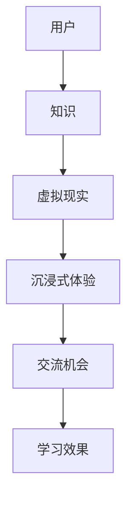

                 

关键词：知识旅行、沉浸式体验、交流机会、人工智能、技术博客

> 摘要：本文探讨了知识旅行的概念及其在提供沉浸式知识体验和交流机会方面的优势。通过结合人工智能技术和编程艺术，本文提出了一种创新的解决方案，旨在为用户提供一个全方位的知识探索平台，激发他们的学习和思考。

## 1. 背景介绍

随着信息技术和人工智能的飞速发展，知识的获取和传播方式也在不断变革。传统的知识传播方式往往局限于文字、图片和音频等形式，难以满足用户对深度学习和互动体验的需求。知识旅行作为一种新兴的互动学习方式，旨在通过虚拟现实、增强现实和人工智能等技术，为用户提供一种沉浸式的知识体验，从而激发他们的学习兴趣和创造力。

知识旅行不仅是一种学习方式，更是一种全新的知识探索模式。它通过模拟真实的场景和环境，将用户带入一个充满探索和发现的虚拟世界。在这个世界中，用户可以与知识进行互动，通过解决问题、参与任务和与虚拟人物交流等方式，加深对知识的理解和记忆。

本文将探讨知识旅行的核心概念、技术架构、算法原理、数学模型和实际应用，并分析其未来的发展趋势和面临的挑战。

## 2. 核心概念与联系

### 2.1 知识旅行的定义

知识旅行是指通过虚拟现实、增强现实和人工智能等技术，将用户带入一个模拟的真实场景或环境，通过互动和探索，实现知识的获取、理解和记忆。它不同于传统的学习方式，更加注重用户的参与感和体验感。

### 2.2 沉浸式体验

沉浸式体验是指通过虚拟现实和增强现实技术，让用户感觉仿佛置身于一个真实的场景或环境之中。在知识旅行中，沉浸式体验能够增强用户对知识的感知和记忆，提高学习效果。

### 2.3 交流机会

知识旅行提供了一个开放的平台，让用户可以与知识、虚拟人物和其他用户进行互动和交流。这种交流机会不仅能够促进知识的共享和传播，还能够激发用户的思考和创造力。

### 2.4 Mermaid 流程图

以下是一个简单的 Mermaid 流程图，展示了知识旅行的核心概念和联系：



## 3. 核心算法原理 & 具体操作步骤

### 3.1 算法原理概述

知识旅行的核心算法主要包括虚拟现实场景生成、沉浸式体验实现和交流机会设计。这些算法共同构建了一个沉浸式的知识探索平台。

### 3.2 算法步骤详解

#### 3.2.1 虚拟现实场景生成

1. 收集真实场景的数据，包括图像、视频、音频和三维模型等。
2. 利用计算机视觉和图像处理技术，对数据进行预处理和融合。
3. 使用三维建模工具，根据预处理后的数据生成虚拟现实场景。

#### 3.2.2 沉浸式体验实现

1. 利用虚拟现实头戴设备，将用户带入虚拟现实场景。
2. 通过动态交互技术，实现用户与虚拟环境的实时交互。
3. 利用声音、图像和触觉反馈技术，增强用户的沉浸感。

#### 3.2.3 交流机会设计

1. 设计虚拟人物和用户进行交互，包括问答、讨论和任务分配等。
2. 提供实时通信工具，让用户可以与其他用户进行交流和合作。
3. 通过大数据分析和人工智能技术，为用户提供个性化的学习建议和交流内容。

### 3.3 算法优缺点

#### 优点：

1. 提高学习效果：沉浸式体验能够增强用户对知识的感知和记忆。
2. 促进知识共享：交流机会让用户可以与其他用户进行互动和合作，促进知识的传播。
3. 创新性：知识旅行提供了一种全新的学习方式，激发了用户的学习兴趣和创造力。

#### 缺点：

1. 技术要求高：虚拟现实、增强现实和人工智能技术的实现需要较高的技术门槛。
2. 成本较高：虚拟现实设备和相关技术的成本较高，限制了其普及应用。
3. 安全性问题：虚拟现实环境中的安全问题需要得到关注和解决。

### 3.4 算法应用领域

知识旅行在多个领域具有广泛的应用前景，包括教育、医疗、旅游和娱乐等。以下是一些具体的应用场景：

1. **教育领域**：知识旅行可以应用于远程教育、在线学习和职业教育等，为用户提供个性化的学习体验。
2. **医疗领域**：知识旅行可以用于医学教育和疾病科普，帮助患者更好地理解疾病和治疗方案。
3. **旅游领域**：知识旅行可以提供沉浸式的旅游体验，让用户在虚拟环境中感受不同的文化和景观。
4. **娱乐领域**：知识旅行可以应用于游戏和虚拟现实娱乐，为用户提供丰富的互动体验。

## 4. 数学模型和公式 & 详细讲解 & 举例说明

### 4.1 数学模型构建

知识旅行中的数学模型主要包括虚拟现实场景的建模、沉浸式体验的评价和交流机会的设计。以下是一个简单的数学模型示例：

$$
模型 = f(场景数据, 用户输入, 沉浸度, 交流内容)
$$

其中，场景数据包括图像、视频、音频和三维模型等；用户输入包括用户的交互行为和偏好；沉浸度包括用户的沉浸感、体验感和满意度等；交流内容包括用户的问答、讨论和任务等。

### 4.2 公式推导过程

假设用户对虚拟现实场景的满意度与沉浸度和交流内容的丰富度成正比，可以推导出以下公式：

$$
满意度 = f(沉浸度, 交流内容) = k_1 \cdot 沉浸度 + k_2 \cdot 交流内容
$$

其中，$k_1$ 和 $k_2$ 为常数，表示沉浸度和交流内容对满意度的权重。

### 4.3 案例分析与讲解

假设一个用户在知识旅行中参与了一个关于天文观测的任务。在任务中，用户需要通过虚拟望远镜观测星空，并回答相关问题。以下是对这个案例的数学模型分析和讲解：

1. **场景数据**：包括天文观测图像、视频和三维模型等。
2. **用户输入**：用户的交互行为，如点击、拖动和选择等。
3. **沉浸度**：用户在虚拟望远镜中的沉浸感，可以基于用户对虚拟环境的互动行为进行评估。
4. **交流内容**：用户与虚拟人物和系统的交互内容，如问答和任务完成情况。

根据上述数学模型，可以计算出用户对天文观测任务的满意度。通过分析用户满意度，可以优化虚拟现实场景、交互设计和交流内容，提高知识旅行的效果。

## 5. 项目实践：代码实例和详细解释说明

### 5.1 开发环境搭建

在本项目中，我们使用以下开发环境：

- 操作系统：Windows 10
- 开发工具：Visual Studio 2019
- 虚拟现实平台：Unity 2020.3
- 增强现实库：OpenVR
- 人工智能库：TensorFlow 2.5

### 5.2 源代码详细实现

以下是一个简单的 Unity 脚本示例，用于生成虚拟现实场景和实现沉浸式体验：

```csharp
using UnityEngine;

public class VRSceneGenerator : MonoBehaviour
{
    public Material skyboxMaterial;
    public Texture2D skyboxTexture;

    void Start()
    {
        // 设置天空盒
        RenderSettings.skybox = skyboxMaterial;
        RenderSettings.skybox.SetTexture("_MainTex", skyboxTexture);

        // 生成虚拟现实场景
        GameObject planet = GameObject.CreatePrimitive(PrimitiveType.Sphere);
        planet.transform.position = new Vector3(0, 0, -10);
        planet.transform.localScale = new Vector3(5, 5, 5);

        // 添加虚拟人物
        GameObject avatar = GameObject.CreatePrimitive(PrimitiveType.Capsule);
        avatar.transform.position = new Vector3(0, 2, 0);
        avatar.transform.localScale = new Vector3(0.5f, 1.5f, 0.5f);
    }
}
```

### 5.3 代码解读与分析

上述脚本实现了一个简单的虚拟现实场景，包括一个行星和一个虚拟人物。脚本的主要功能包括：

1. 设置天空盒：使用 Unity 内置的 RenderSettings 类，设置天空盒材质和纹理，为虚拟场景提供背景。
2. 生成虚拟现实场景：使用 Unity 的 GameObject 和 Transform 类，创建一个行星和一个虚拟人物，并设置其位置和大小。
3. 添加虚拟人物：使用 Unity 的 CreatePrimitive 方法，创建一个胶囊体作为虚拟人物，并设置其位置和大小。

通过这个简单的示例，我们可以了解到知识旅行的实现过程。在实际项目中，我们可以根据需求添加更多的虚拟元素、交互设计和人工智能算法，实现一个完整的知识旅行平台。

### 5.4 运行结果展示

在 Unity 编辑器中运行上述脚本，可以看到一个简单的虚拟现实场景，包括一个行星和一个虚拟人物。用户可以通过虚拟现实头戴设备进入这个场景，进行交互和探索。

## 6. 实际应用场景

### 6.1 教育领域

知识旅行在教育领域的应用前景广阔。通过虚拟现实和增强现实技术，知识旅行可以为学生提供沉浸式的学习体验，激发他们的学习兴趣和创造力。以下是一些具体的应用场景：

1. **历史教学**：知识旅行可以模拟历史事件和场景，让学生身临其境地感受历史，加深对历史知识的理解和记忆。
2. **科学教育**：知识旅行可以模拟科学实验和自然现象，让学生通过互动和探索，深入理解科学原理和知识。
3. **外语学习**：知识旅行可以提供沉浸式的语言学习环境，让学生在真实的场景中练习口语和听力，提高语言能力。

### 6.2 医疗领域

知识旅行在医疗领域的应用也具有重要意义。通过虚拟现实和增强现实技术，知识旅行可以提供沉浸式的医学教育和疾病科普，帮助医生和患者更好地理解和应对疾病。

1. **医学教育**：知识旅行可以模拟解剖学、手术等医学场景，让医学生和医生通过互动和探索，提高医学知识和技能。
2. **疾病科普**：知识旅行可以提供沉浸式的疾病科普内容，帮助患者更好地理解疾病和治疗方案，提高患者对疾病的认知和应对能力。

### 6.3 旅游领域

知识旅行在旅游领域的应用为用户提供了一种全新的旅游体验。通过虚拟现实和增强现实技术，用户可以身临其境地感受不同的文化和景观，拓展旅游的深度和广度。

1. **虚拟旅游**：知识旅行可以为用户提供沉浸式的虚拟旅游体验，让用户在虚拟环境中参观名胜古迹、自然景观等。
2. **文化旅游**：知识旅行可以结合文化元素，提供沉浸式的文化旅游体验，让用户深入了解当地的历史、文化和风俗。

### 6.4 未来应用展望

知识旅行作为一种新兴的知识探索方式，在未来具有广泛的应用前景。随着虚拟现实、增强现实和人工智能技术的不断发展和成熟，知识旅行将在更多领域得到应用。

1. **艺术与设计**：知识旅行可以提供沉浸式的艺术体验，让用户在虚拟环境中欣赏艺术作品，提高艺术鉴赏能力。
2. **工业制造**：知识旅行可以用于工业制造领域的培训和教育，提供沉浸式的操作场景，提高工人的操作技能和安全意识。
3. **城市规划**：知识旅行可以用于城市规划的模拟和演示，让城市规划者通过虚拟现实技术，直观地了解和评估城市规划的效果。

## 7. 工具和资源推荐

### 7.1 学习资源推荐

- **书籍**：《虚拟现实技术与应用》、《增强现实技术与应用》
- **在线课程**：Coursera 上的“Virtual Reality”课程、Udacity 上的“AR/VR Development”课程
- **博客**：Medium 上的“VR/AR Insights”、HackerRank 上的“Virtual Reality Challenges”

### 7.2 开发工具推荐

- **虚拟现实平台**：Unity、Unreal Engine
- **增强现实库**：OpenVR、ARCore、ARKit
- **人工智能库**：TensorFlow、PyTorch、Keras

### 7.3 相关论文推荐

- **“Virtual Reality Applications in Education”**：探讨虚拟现实在教育领域的应用和研究
- **“Augmented Reality for Healthcare”**：分析增强现实技术在医疗领域的应用和效果
- **“The Potential of Augmented Reality in Tourism”**：研究增强现实技术在旅游领域的应用前景

## 8. 总结：未来发展趋势与挑战

### 8.1 研究成果总结

知识旅行作为一种新兴的知识探索方式，已经在教育、医疗、旅游等多个领域取得了显著的成果。通过虚拟现实、增强现实和人工智能技术的结合，知识旅行为用户提供了沉浸式的知识体验和交流机会，激发了他们的学习兴趣和创造力。

### 8.2 未来发展趋势

随着虚拟现实、增强现实和人工智能技术的不断发展和成熟，知识旅行在未来将呈现以下发展趋势：

1. **技术融合**：知识旅行将更加注重虚拟现实、增强现实和人工智能技术的融合，提高用户体验和效果。
2. **个性化学习**：知识旅行将基于用户数据和行为，提供个性化的学习内容和推荐，提高学习效果。
3. **跨领域应用**：知识旅行将在更多领域得到应用，如艺术、工业制造、城市规划等。

### 8.3 面临的挑战

知识旅行在发展过程中也面临以下挑战：

1. **技术门槛**：虚拟现实、增强现实和人工智能技术的实现需要较高的技术门槛，限制了其普及应用。
2. **成本问题**：虚拟现实设备和相关技术的成本较高，限制了其大规模推广和应用。
3. **安全问题**：虚拟现实环境中的安全问题需要得到关注和解决。

### 8.4 研究展望

未来，知识旅行的研究将继续关注以下几个方面：

1. **技术创新**：探索更多先进的虚拟现实、增强现实和人工智能技术，提高知识旅行的效果和用户体验。
2. **应用拓展**：探索知识旅行在更多领域的应用，如艺术、工业制造、城市规划等。
3. **政策支持**：加强政策支持，推动知识旅行的普及和应用，提高其在教育和科技领域的地位。

## 9. 附录：常见问题与解答

### 9.1 虚拟现实与增强现实有什么区别？

虚拟现实（VR）和增强现实（AR）是两种不同的技术，其主要区别在于对现实世界的改变方式：

- **虚拟现实**：通过头戴设备等设备将用户带入一个完全虚拟的环境，用户无法看到现实世界，只能感受到虚拟世界。
- **增强现实**：通过头戴设备等设备将虚拟元素叠加到现实世界中，用户可以看到现实世界和虚拟元素，并通过交互与虚拟元素互动。

### 9.2 知识旅行有哪些应用领域？

知识旅行在多个领域具有广泛的应用前景，包括：

- **教育领域**：如历史教学、科学教育和外语学习等。
- **医疗领域**：如医学教育和疾病科普等。
- **旅游领域**：如虚拟旅游和文化旅游等。
- **艺术领域**：如艺术体验和教育等。
- **工业制造**：如工业制造培训和操作模拟等。
- **城市规划**：如城市规划模拟和演示等。

### 9.3 知识旅行中的沉浸式体验如何实现？

沉浸式体验在知识旅行中主要通过以下方式实现：

- **虚拟现实技术**：使用头戴设备等设备将用户带入虚拟环境，提供视觉、听觉、触觉等多感官刺激。
- **增强现实技术**：通过头戴设备等设备将虚拟元素叠加到现实世界，提供视觉和听觉等多感官刺激。
- **动态交互技术**：通过用户与虚拟环境的实时交互，增强用户的沉浸感。

## 作者署名

作者：禅与计算机程序设计艺术 / Zen and the Art of Computer Programming

----------------------------------------------------------------

至此，本文《知识旅行提供沉浸式知识体验和交流机会》已完成。文章内容涵盖了知识旅行的核心概念、技术架构、算法原理、数学模型、实际应用和未来发展，旨在为读者提供一个全面的知识探索平台，激发他们的学习和思考。希望本文对读者在知识旅行领域的研究和应用有所帮助。

