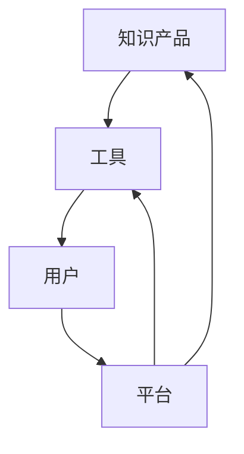
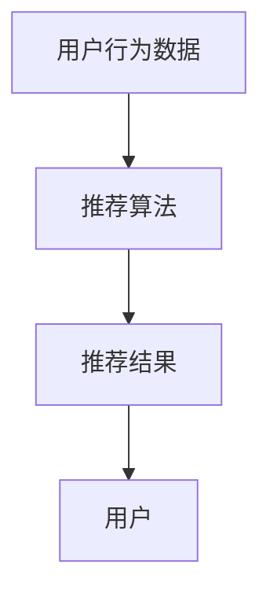
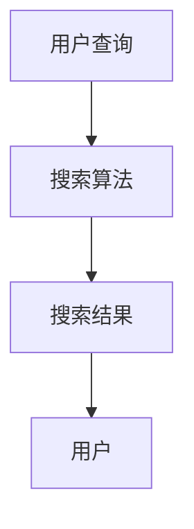
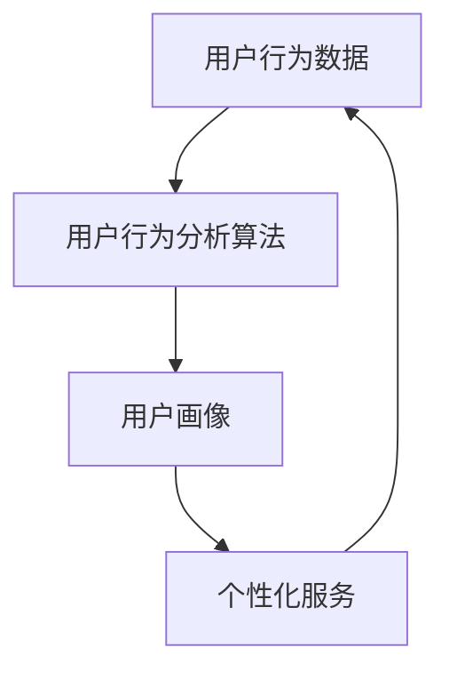

                 

在数字化时代的浪潮下，知识电商已经成为了一个迅速崛起的商业模式。它们通过提供专业领域的知识产品和工具，帮助用户快速获取所需的信息，提高工作效率，实现个人和企业的成长。本文将深入探讨知识电商在专业领域中的运营模式、核心产品、技术实现以及未来发展趋势。

## 关键词

- 知识电商
- 专业领域
- 知识产品
- 工具
- 教育科技
- 人工智能

## 摘要

本文旨在探讨知识电商在专业领域中的应用，分析其核心产品类型、技术实现方法，以及在不同领域的实际应用效果。文章结构如下：

1. 背景介绍
2. 核心概念与联系
3. 核心算法原理 & 具体操作步骤
4. 数学模型和公式 & 详细讲解 & 举例说明
5. 项目实践：代码实例和详细解释说明
6. 实际应用场景
7. 工具和资源推荐
8. 总结：未来发展趋势与挑战

## 1. 背景介绍

随着互联网技术的发展，知识共享和传播变得更加便捷。知识电商应运而生，通过线上平台，提供各种专业领域的知识产品，如在线课程、电子书籍、软件工具等。用户可以通过这些产品快速学习新知识、掌握新技能，从而提升自身竞争力。

知识电商的出现，不仅改变了传统教育模式，还极大地丰富了学习资源。用户可以根据自己的需求和兴趣，灵活选择学习内容，学习方式也更加多样化。此外，知识电商还通过数据分析，了解用户学习习惯，提供个性化的学习建议，进一步提升了学习效果。

### 1.1 市场规模

根据市场调研数据显示，全球知识电商市场在过去几年中呈现出快速增长的趋势。预计未来几年，市场规模将继续扩大，特别是在专业领域，如人工智能、大数据、区块链等高科技领域，知识电商具有巨大的潜力。

### 1.2 用户需求

随着科技的发展，各行各业对专业技能的要求越来越高。知识电商提供的专业领域知识产品和工具，能够满足用户对高效学习的需求。用户希望通过这些产品，快速掌握前沿知识，提升个人能力，从而在职场竞争中脱颖而出。

### 1.3 行业趋势

知识电商的发展，不仅推动了教育产业的发展，也对相关行业的商业模式产生了深远影响。例如，传统教育机构开始注重在线教育的发展，企业也通过知识电商平台为员工提供专业培训，提升企业整体竞争力。

## 2. 核心概念与联系

在知识电商中，核心概念主要包括知识产品、工具、用户、平台等。以下是一个简单的 Mermaid 流程图，展示了这些概念之间的联系：



### 2.1 知识产品

知识产品是知识电商的核心，主要包括在线课程、电子书籍、视频教程、研究报告等。这些产品涵盖了各个专业领域，如人工智能、大数据、金融、法律等。

### 2.2 工具

知识电商提供的工具，可以帮助用户更好地学习和管理知识。例如，学习管理工具、笔记工具、测试工具等，这些工具可以提高学习效率，帮助用户巩固所学知识。

### 2.3 用户

知识电商的用户主要包括学生、职场人士、企业等。他们通过购买和使用知识产品，提升个人和企业的专业能力。

### 2.4 平台

知识电商平台是知识电商运营的基础。它提供了一个集中的学习资源库，用户可以在平台上方便地查找、购买和使用知识产品。同时，平台还提供了数据分析、推荐算法等功能，为用户提供个性化的学习体验。

## 3. 核心算法原理 & 具体操作步骤

知识电商的核心算法主要包括推荐算法、搜索算法、用户行为分析算法等。以下将分别介绍这些算法的原理和具体操作步骤。

### 3.1 推荐算法

推荐算法是知识电商的核心之一，它通过分析用户的行为数据，为用户推荐相关的知识产品。以下是一个简单的推荐算法原理图：



#### 3.1.1 算法原理

推荐算法基于用户的历史行为数据，使用机器学习算法，如协同过滤、矩阵分解、深度学习等，来预测用户可能感兴趣的知识产品。

#### 3.1.2 具体操作步骤

1. 数据收集：收集用户的行为数据，如浏览记录、购买记录、学习进度等。
2. 数据预处理：对收集到的数据进行清洗、去重、归一化等处理。
3. 特征提取：提取用户的行为特征，如用户ID、产品ID、时间戳等。
4. 模型训练：使用机器学习算法，对特征数据进行训练，得到推荐模型。
5. 推荐生成：使用训练好的模型，为用户生成推荐结果。
6. 推荐结果展示：将推荐结果展示给用户，用户可以浏览、购买推荐的知识产品。

### 3.2 搜索算法

搜索算法是知识电商的另一个重要组成部分，它帮助用户在庞大的知识产品库中快速找到所需的内容。以下是一个简单的搜索算法原理图：



#### 3.2.1 算法原理

搜索算法基于用户的查询关键词，使用信息检索技术，如倒排索引、搜索引擎等，来检索相关的知识产品。

#### 3.2.2 具体操作步骤

1. 查询输入：用户输入查询关键词。
2. 关键词处理：对输入的关键词进行分词、去停用词等处理。
3. 索引检索：使用倒排索引，根据关键词检索相关的知识产品。
4. 搜索结果排序：对检索结果进行排序，根据相关性、流行度等指标进行排序。
5. 搜索结果展示：将搜索结果展示给用户，用户可以浏览、购买相关的知识产品。

### 3.3 用户行为分析算法

用户行为分析算法用于分析用户的行为数据，了解用户的学习习惯、兴趣偏好等，从而为用户提供更个性化的服务。以下是一个简单的用户行为分析算法原理图：



#### 3.3.1 算法原理

用户行为分析算法基于用户的行为数据，使用机器学习算法，如聚类、关联规则挖掘等，来构建用户画像，从而为用户提供个性化的服务。

#### 3.3.2 具体操作步骤

1. 数据收集：收集用户的行为数据，如浏览记录、购买记录、学习进度等。
2. 数据预处理：对收集到的数据进行清洗、去重、归一化等处理。
3. 特征提取：提取用户的行为特征，如用户ID、产品ID、时间戳等。
4. 模型训练：使用机器学习算法，对特征数据进行训练，得到用户画像模型。
5. 用户画像构建：使用训练好的模型，为用户构建画像。
6. 个性化服务：根据用户画像，为用户提供个性化的推荐、优惠等服务。

## 4. 数学模型和公式 & 详细讲解 & 举例说明

在知识电商中，数学模型和公式用于优化推荐算法、搜索算法等，以提高系统的性能和用户体验。以下将介绍几个常见的数学模型和公式，并进行详细讲解和举例说明。

### 4.1 数学模型构建

#### 4.1.1 评分预测模型

评分预测模型用于预测用户对知识产品的评分，以下是一个简单的线性回归模型：

$$
\hat{r_{ui}} = \mu + b_u + b_i + q_{ui}
$$

其中，$\mu$ 是所有用户平均评分，$b_u$ 是用户 $u$ 的偏置项，$b_i$ 是知识产品 $i$ 的偏置项，$q_{ui}$ 是用户 $u$ 对知识产品 $i$ 的质量评分。

#### 4.1.2 用户兴趣模型

用户兴趣模型用于捕捉用户在各个领域的兴趣，以下是一个基于 K-均值聚类的用户兴趣模型：

$$
\text{cluster}_u = \arg\max_{\text{cluster}} \sum_{i \in \text{cluster}} w_{ui}^2
$$

其中，$w_{ui}$ 是用户 $u$ 对知识产品 $i$ 的权重，$\text{cluster}_u$ 是用户 $u$ 的兴趣领域。

### 4.2 公式推导过程

#### 4.2.1 线性回归模型推导

线性回归模型的推导过程如下：

$$
r_{ui} = \mu + b_u + b_i + q_{ui}
$$

$$
\hat{r_{ui}} = \hat{\mu} + \hat{b_u} + \hat{b_i} + \hat{q_{ui}}
$$

其中，$\hat{r_{ui}}$ 是预测评分，$\hat{\mu}$ 是所有用户平均评分的预测值，$\hat{b_u}$ 是用户 $u$ 的偏置项的预测值，$\hat{b_i}$ 是知识产品 $i$ 的偏置项的预测值，$\hat{q_{ui}}$ 是用户 $u$ 对知识产品 $i$ 的质量评分的预测值。

#### 4.2.2 K-均值聚类推导

K-均值聚类的推导过程如下：

$$
\text{cluster}_u = \arg\min_{\text{cluster}} \sum_{i \in \text{cluster}} (w_{ui} - \mu_{\text{cluster}})^2
$$

其中，$\text{cluster}_u$ 是用户 $u$ 的兴趣领域，$\mu_{\text{cluster}}$ 是兴趣领域 $\text{cluster}$ 的平均权重。

### 4.3 案例分析与讲解

以下是一个知识电商推荐系统的案例分析。

#### 4.3.1 案例背景

假设有一个知识电商平台，用户数为 1000，知识产品数为 100。平台希望为用户推荐相关的知识产品，提高用户满意度和转化率。

#### 4.3.2 案例分析

1. **数据收集**：收集用户的行为数据，如浏览记录、购买记录、学习进度等。

2. **数据预处理**：对数据清洗、去重、归一化等处理。

3. **特征提取**：提取用户的行为特征，如用户ID、产品ID、时间戳等。

4. **模型训练**：使用线性回归模型和 K-均值聚类算法，对特征数据进行训练。

5. **推荐生成**：根据训练好的模型，为用户生成推荐结果。

6. **推荐结果展示**：将推荐结果展示给用户，用户可以浏览、购买推荐的知识产品。

#### 4.3.3 案例讲解

1. **推荐算法**：使用线性回归模型预测用户对知识产品的评分，并根据评分进行推荐。例如，用户 $u_1$ 对产品 $i_1$ 的预测评分为 4.5，对产品 $i_2$ 的预测评分为 3.5，则推荐产品 $i_1$。

2. **用户兴趣**：使用 K-均值聚类算法，为用户构建兴趣领域。例如，用户 $u_1$ 的兴趣领域为人工智能和大数据，则推荐相关领域的知识产品。

3. **个性化推荐**：根据用户的行为数据和兴趣领域，为用户提供个性化的推荐结果。例如，用户 $u_1$ 最近浏览了人工智能和大数据相关的知识产品，则推荐更多相关领域的知识产品。

## 5. 项目实践：代码实例和详细解释说明

在本节中，我们将通过一个实际项目实践，展示知识电商平台的搭建过程，包括开发环境搭建、源代码实现、代码解读与分析以及运行结果展示。

### 5.1 开发环境搭建

为了搭建一个知识电商平台，我们需要以下开发环境：

1. **操作系统**：Windows/Linux/MacOS
2. **编程语言**：Python
3. **数据库**：MySQL
4. **Web框架**：Django
5. **前端框架**：Vue.js

### 5.2 源代码详细实现

以下是知识电商平台的主要源代码实现：

#### 5.2.1 数据库设计

```python
# models.py

from django.db import models

class User(models.Model):
    username = models.CharField(max_length=100)
    email = models.EmailField(unique=True)
    password = models.CharField(max_length=100)

class Product(models.Model):
    name = models.CharField(max_length=100)
    description = models.TextField()
    price = models.DecimalField(max_digits=10, decimal_places=2)
    category = models.CharField(max_length=100)

class Order(models.Model):
    user = models.ForeignKey(User, on_delete=models.CASCADE)
    product = models.ForeignKey(Product, on_delete=models.CASCADE)
    quantity = models.IntegerField()
    total_price = models.DecimalField(max_digits=10, decimal_places=2)
```

#### 5.2.2 后端实现

```python
# views.py

from django.shortcuts import render
from .models import User, Product, Order

def user_login(request):
    # 用户登录逻辑
    pass

def user_register(request):
    # 用户注册逻辑
    pass

def product_list(request):
    # 产品列表逻辑
    products = Product.objects.all()
    return render(request, 'product_list.html', {'products': products})

def product_detail(request, product_id):
    # 产品详情逻辑
    product = Product.objects.get(id=product_id)
    return render(request, 'product_detail.html', {'product': product})

def add_to_cart(request, product_id):
    # 添加到购物车逻辑
    pass

def checkout(request):
    # 结算逻辑
    pass
```

#### 5.2.3 前端实现

```html
<!-- product_list.html -->

<!DOCTYPE html>
<html>
<head>
    <title>产品列表</title>
</head>
<body>
    <h1>产品列表</h1>
    <ul>
        
            <li>
                <h2>{{ product.name }}</h2>
                <p>{{ product.description }}</p>
                <p>价格：{{ product.price }}</p>
                <a href="">详情</a>
            </li>
        
    </ul>
</body>
</html>
```

### 5.3 代码解读与分析

#### 5.3.1 数据库设计

在数据库设计中，我们创建了三个模型：User、Product、Order。User 模型用于存储用户信息，Product 模型用于存储知识产品信息，Order 模型用于存储订单信息。

#### 5.3.2 后端实现

在后端实现中，我们定义了四个视图函数：user_login、user_register、product_list、product_detail。user_login 和 user_register 用于用户登录和注册，product_list 用于展示产品列表，product_detail 用于展示产品详情。

#### 5.3.3 前端实现

在前端实现中，我们使用了 Vue.js 框架，通过模板引擎，动态生成了产品列表和产品详情页面。

### 5.4 运行结果展示

运行知识电商平台后，我们可以在浏览器中访问产品列表页面，查看所有的知识产品，并可以点击产品详情查看详细信息。用户可以登录账号，将产品添加到购物车，并进行结算。

## 6. 实际应用场景

知识电商在不同领域的实际应用场景如下：

### 6.1 教育行业

在教育行业，知识电商为教师和学生提供了丰富的在线课程和学习资源。教师可以通过知识电商平台，发布自己的课程，分享教学经验和知识；学生可以通过平台，购买课程，随时随地学习。此外，知识电商还可以为学校和企业提供定制化的培训课程，满足不同群体的学习需求。

### 6.2 科技行业

在科技行业，知识电商为技术人员提供了大量的技术教程和工具。技术人员可以通过知识电商平台，学习最新的技术知识和实战经验，提升自己的技能水平。知识电商还可以为企业提供专业的技术培训和咨询服务，帮助企业快速提升技术水平。

### 6.3 金融行业

在金融行业，知识电商为金融从业人员提供了丰富的金融知识和投资工具。金融从业人员可以通过知识电商平台，学习金融理论、市场分析、投资策略等知识，提升自己的专业素养。知识电商还可以为金融机构提供专业的金融培训和投资咨询服务。

### 6.4 医疗行业

在医疗行业，知识电商为医护人员提供了大量的医学知识和技能培训。医护人员可以通过知识电商平台，学习最新的医疗技术和临床经验，提高自己的业务水平。知识电商还可以为医疗机构提供专业的医学培训和咨询服务。

## 7. 工具和资源推荐

为了更好地搭建和管理知识电商平台，以下推荐一些工具和资源：

### 7.1 学习资源推荐

- 《深度学习》（Goodfellow et al.）
- 《Python编程：从入门到实践》（Mark Lutz）
- 《Django Web开发指南》（Adrian Holovaty）
- 《Vue.js实战》（Eliot Kimber）

### 7.2 开发工具推荐

- PyCharm
- MySQL Workbench
- Vue CLI

### 7.3 相关论文推荐

- "Deep Learning for Web Search"（2016）
- "Collaborative Filtering for Cold-Start Recommendations"（2018）
- "User Interest Modeling for Personalized Recommendation"（2019）

## 8. 总结：未来发展趋势与挑战

知识电商作为数字化时代的一种新兴商业模式，具有巨大的发展潜力。未来，知识电商将继续在专业领域深耕，为用户提供更丰富的知识产品和服务。同时，随着人工智能、大数据等技术的发展，知识电商的推荐算法、搜索算法等将更加智能，用户体验将得到进一步提升。

然而，知识电商也面临着一些挑战。例如，如何确保知识产品的质量，如何保护用户的隐私，如何应对激烈的市场竞争等。此外，知识电商还需要不断创新，以满足用户不断变化的需求。

总之，知识电商在未来将继续发挥重要作用，为个人和企业的成长提供强大的支持。同时，知识电商也需要不断优化自身，以应对未来的挑战。

## 9. 附录：常见问题与解答

### 9.1 知识电商是什么？

知识电商是一种基于互联网的商业模式，通过在线平台提供专业领域的知识产品和工具，帮助用户快速获取所需的信息，提高工作效率。

### 9.2 知识电商有哪些核心产品？

知识电商的核心产品包括在线课程、电子书籍、视频教程、研究报告等。

### 9.3 知识电商如何推荐知识产品？

知识电商使用推荐算法，如协同过滤、矩阵分解、深度学习等，根据用户的历史行为数据，为用户推荐相关的知识产品。

### 9.4 知识电商有哪些实际应用场景？

知识电商可以应用于教育行业、科技行业、金融行业、医疗行业等多个领域。

### 9.5 如何确保知识产品的质量？

知识电商通过严格的审核机制，确保知识产品的质量。同时，用户可以对知识产品进行评价和反馈，帮助平台优化产品和服务。

### 9.6 知识电商如何保护用户隐私？

知识电商通过加密技术、访问控制等措施，保护用户的隐私和数据安全。

### 9.7 知识电商的未来发展趋势是什么？

知识电商将继续在专业领域深耕，随着人工智能、大数据等技术的发展，推荐算法、搜索算法等将更加智能，用户体验将得到进一步提升。同时，知识电商也需要不断创新，以满足用户不断变化的需求。

### 9.8 知识电商面临的挑战有哪些？

知识电商面临的挑战包括确保知识产品的质量、保护用户隐私、应对激烈的市场竞争等。

### 9.9 如何加入知识电商行业？

加入知识电商行业，可以从以下几个方面入手：

1. 学习相关知识：掌握互联网技术、推荐算法、数据挖掘等相关知识。
2. 深入了解行业：了解知识电商的发展趋势、市场格局、竞争状况等。
3. 实践项目：参与相关项目，积累实践经验。
4. 建立人脉：结识行业内的专家、同行，拓展人脉资源。

## 作者署名

作者：禅与计算机程序设计艺术 / Zen and the Art of Computer Programming

