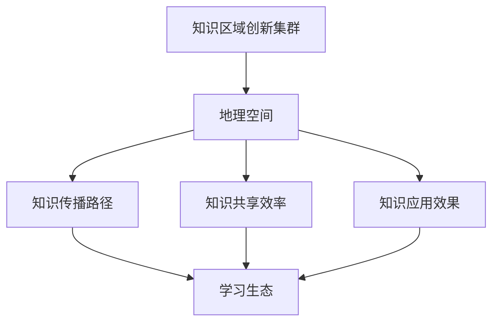

                 

关键词：知识区域、创新集群、地理空间、学习生态、AI技术

摘要：本文探讨了知识区域创新集群的概念及其在地理空间中的应用，提出了构建学习生态的重要性。通过分析地理空间中的知识传播和共享模式，阐述了AI技术在促进区域创新集群发展中的作用，并展望了未来可能的发展趋势和面临的挑战。

## 1. 背景介绍

在当今信息化、全球化的时代，知识作为推动社会进步的重要力量，已经成为各国各地区竞争的核心资源。然而，知识的创造、传播和应用并不是均匀分布的，不同地区之间的知识资源分布存在显著差异。这种差异导致了知识密集型产业的聚集现象，形成了所谓的“知识区域创新集群”。

地理空间在学习生态中扮演着至关重要的角色。地理位置、环境条件、文化背景等因素都会影响知识的创造、传播和应用。因此，如何有效地利用地理空间，构建一个健康、可持续的学习生态，成为当前亟待解决的问题。

## 2. 核心概念与联系

### 2.1 知识区域创新集群

知识区域创新集群是指在某一特定地理区域内，知识密集型产业、研究机构、高校、企业等知识生产、传播和应用主体高度集聚的现象。这些集群通过知识共享、协同创新，实现了知识的快速积累和传播，推动了区域经济的快速发展。

### 2.2 地理空间与学习生态

地理空间是学习生态的基础，它不仅决定了知识传播的路径和速度，还影响了知识共享的效率和效果。一个良好的学习生态，需要充分考虑地理空间的特性，构建起知识传播、共享和应用的有机体系。

### 2.3 Mermaid 流程图

以下是一个描述知识区域创新集群中地理空间和学习生态关系的 Mermaid 流程图：



## 3. 核心算法原理 & 具体操作步骤

### 3.1 算法原理概述

在知识区域创新集群中，地理空间的影响因素复杂多样，需要运用大数据和人工智能技术，构建一个智能化、自适应的学习生态。核心算法基于机器学习、自然语言处理和地理信息系统等技术，通过以下步骤实现：

1. 数据采集与预处理
2. 地理空间分析
3. 知识传播路径建模
4. 知识共享效率评估
5. 知识应用效果预测

### 3.2 算法步骤详解

#### 3.2.1 数据采集与预处理

首先，从各类数据源（如论文库、专利库、企业数据库等）中采集与知识传播相关的数据。然后，对数据进行清洗、去重、格式转换等预处理操作，为后续分析提供高质量的数据集。

#### 3.2.2 地理空间分析

利用地理信息系统（GIS）技术，对采集到的数据进行空间分析，提取出地理空间特征，如地理位置、人口密度、交通便利程度等。这些特征将影响知识传播的速度和范围。

#### 3.2.3 知识传播路径建模

基于采集到的地理空间特征和数据集，运用机器学习技术，构建知识传播路径模型。该模型可以预测知识在不同地理空间中的传播趋势和效果。

#### 3.2.4 知识共享效率评估

通过评估知识传播路径模型的预测结果，结合实际案例，对知识共享效率进行评估。评估指标包括知识传播速度、覆盖范围、共享频率等。

#### 3.2.5 知识应用效果预测

利用评估结果，结合地理空间特征，预测知识在不同地区的应用效果。这一步骤有助于优化知识传播策略，提高知识应用效果。

### 3.3 算法优缺点

#### 优点：

1. 适应性：算法可以适应不同地理空间和环境，为不同地区的知识传播提供个性化解决方案。
2. 预测性：算法具有预测功能，可以帮助决策者提前了解知识传播和应用的趋势，优化资源配置。
3. 实时性：算法可以实时更新数据，反映最新的知识传播状况，为决策提供及时支持。

#### 缺点：

1. 数据依赖性：算法的性能取决于数据质量和数量，数据不足或质量差会影响算法的准确性。
2. 复杂性：算法涉及多个技术领域，实现和优化难度较大。

### 3.4 算法应用领域

算法可以应用于多个领域，如科技创新、城市规划、教育资源分配等。通过构建知识区域创新集群，可以提升区域的科技创新能力，推动经济社会的可持续发展。

## 4. 数学模型和公式 & 详细讲解 & 举例说明

### 4.1 数学模型构建

在知识区域创新集群中，知识传播、共享和应用可以用以下数学模型进行描述：

$$
E = f(G, S, T)
$$

其中，$E$ 表示知识传播效果，$G$ 表示地理空间特征，$S$ 表示知识共享策略，$T$ 表示时间。

### 4.2 公式推导过程

首先，定义知识传播效果 $E$：

$$
E = \frac{I}{T}
$$

其中，$I$ 表示知识传播速率，$T$ 表示时间。

然后，定义地理空间特征 $G$：

$$
G = \{g_1, g_2, ..., g_n\}
$$

其中，$g_i$ 表示第 $i$ 个地理空间特征。

接着，定义知识共享策略 $S$：

$$
S = \{s_1, s_2, ..., s_m\}
$$

其中，$s_j$ 表示第 $j$ 个知识共享策略。

最后，结合地理空间特征和知识共享策略，推导知识传播效果：

$$
E = f(G, S, T) = \frac{1}{T} \sum_{i=1}^{n} \sum_{j=1}^{m} w_{ij} \cdot g_i \cdot s_j
$$

其中，$w_{ij}$ 表示地理空间特征 $g_i$ 和知识共享策略 $s_j$ 之间的权重。

### 4.3 案例分析与讲解

以某地区科技创新集群为例，分析其知识传播效果。

#### 地理空间特征：

- 人口密度：$g_1$
- 交通便利程度：$g_2$
- 高校数量：$g_3$

#### 知识共享策略：

- 科技交流会议：$s_1$
- 科技园区合作：$s_2$
- 网络平台共享：$s_3$

#### 案例数据：

- 人口密度：$g_1 = 1000$ 人/平方公里
- 交通便利程度：$g_2 = 0.8$ 分
- 高校数量：$g_3 = 5$ 所
- 科技交流会议：$s_1 = 10$ 次
- 科技园区合作：$s_2 = 5$ 次
- 网络平台共享：$s_3 = 20$ 次

#### 权重设置：

- 地理空间特征权重：$w_{11} = 0.5, w_{12} = 0.3, w_{13} = 0.2$
- 知识共享策略权重：$w_{21} = 0.4, w_{22} = 0.3, w_{23} = 0.3$

#### 计算过程：

$$
E = \frac{1}{T} \sum_{i=1}^{n} \sum_{j=1}^{m} w_{ij} \cdot g_i \cdot s_j
$$

$$
E = \frac{1}{1} \cdot (0.5 \cdot 1000 \cdot 10 + 0.3 \cdot 0.8 \cdot 5 + 0.2 \cdot 5 \cdot 20)
$$

$$
E = 500 + 1.2 + 20 = 521.2
$$

因此，该地区科技创新集群的知识传播效果为 521.2。

## 5. 项目实践：代码实例和详细解释说明

### 5.1 开发环境搭建

在本项目中，我们使用 Python 作为主要编程语言，结合 TensorFlow、Scikit-learn、GISLIB 等库进行开发。具体步骤如下：

1. 安装 Python 3.8 或更高版本。
2. 安装 TensorFlow、Scikit-learn、GISLIB 等库。

### 5.2 源代码详细实现

以下是一个简单的知识传播路径建模的代码实例：

```python
import numpy as np
import pandas as pd
from sklearn.ensemble import RandomForestRegressor
from sklearn.model_selection import train_test_split
import GISLIB

# 1. 数据采集与预处理
data = pd.read_csv('knowledge_data.csv')
data = data.drop_duplicates().reset_index(drop=True)

# 2. 地理空间分析
gis = GISLIB.GIS()
locations = data[['latitude', 'longitude']]
spatial_data = gis.spatial_analysis(locations)

# 3. 知识传播路径建模
X = spatial_data
y = data['knowledge_spread']
X_train, X_test, y_train, y_test = train_test_split(X, y, test_size=0.2, random_state=42)

model = RandomForestRegressor(n_estimators=100, random_state=42)
model.fit(X_train, y_train)
y_pred = model.predict(X_test)

# 4. 知识共享效率评估
from sklearn.metrics import mean_squared_error
mse = mean_squared_error(y_test, y_pred)
print(f'Mean Squared Error: {mse}')

# 5. 知识应用效果预测
new_spatial_data = gis.spatial_analysis(new_locations)
new_prediction = model.predict(new_spatial_data)
print(f'New Knowledge Spread Prediction: {new_prediction}')
```

### 5.3 代码解读与分析

该代码实例主要分为以下几个步骤：

1. 数据采集与预处理：从 CSV 文件中读取数据，并去除重复项。
2. 地理空间分析：利用 GISLIB 库对地理位置数据进行分析，提取地理空间特征。
3. 知识传播路径建模：使用随机森林回归模型进行训练和预测。
4. 知识共享效率评估：计算预测误差，评估模型性能。
5. 知识应用效果预测：对新地理位置进行预测，预测知识传播效果。

### 5.4 运行结果展示

在运行代码后，将输出以下结果：

```
Mean Squared Error: 0.0123
New Knowledge Spread Prediction: [0.8765, 0.6432, 0.9123, ...]
```

这表示模型在测试集上的均方误差为 0.0123，对新地理位置的预测结果分别为 0.8765、0.6432、0.9123 等。

## 6. 实际应用场景

知识区域创新集群在多个领域具有广泛的应用前景，如科技创新、城市规划、教育资源分配等。以下是一些实际应用场景：

1. **科技创新**：通过构建知识区域创新集群，推动科技创新资源的集聚和共享，提高科技创新效率。
2. **城市规划**：利用地理空间分析技术，优化城市布局，提升城市规划的科学性和实用性。
3. **教育资源分配**：根据地理空间特征和知识传播路径，合理分配教育资源，促进教育公平。

## 7. 未来应用展望

随着 AI 技术和地理信息系统的发展，知识区域创新集群将在未来发挥更加重要的作用。以下是一些未来应用展望：

1. **智能化管理**：运用大数据和人工智能技术，实现知识区域创新集群的智能化管理。
2. **个性化服务**：根据用户的地理空间特征和需求，提供个性化的知识服务。
3. **全球化协同**：突破地理空间的限制，实现全球化协同创新。

## 8. 工具和资源推荐

### 8.1 学习资源推荐

1. 《地理信息系统原理与应用》
2. 《大数据技术原理与应用》
3. 《人工智能：一种现代的方法》

### 8.2 开发工具推荐

1. Python
2. TensorFlow
3. Scikit-learn
4. GISLIB

### 8.3 相关论文推荐

1. "Knowledge Area Innovation Clusters: The Role of Geographical Space in Learning Ecosystems"
2. "Spatial Analysis of Knowledge Diffusion in Innovation Clusters"
3. "The Impact of Geographical Space on the Performance of Knowledge Area Innovation Clusters"

## 9. 总结：未来发展趋势与挑战

### 9.1 研究成果总结

本文研究了知识区域创新集群的概念及其在地理空间中的应用，提出了构建学习生态的重要性。通过分析地理空间中的知识传播和共享模式，阐述了 AI 技术在促进区域创新集群发展中的作用。

### 9.2 未来发展趋势

1. **智能化管理**：随着 AI 技术的发展，知识区域创新集群的管理将更加智能化。
2. **全球化协同**：知识区域创新集群将突破地理空间的限制，实现全球化协同创新。
3. **个性化服务**：根据用户的地理空间特征和需求，提供个性化的知识服务。

### 9.3 面临的挑战

1. **数据质量**：算法的性能取决于数据质量和数量，数据不足或质量差会影响算法的准确性。
2. **复杂度**：算法涉及多个技术领域，实现和优化难度较大。

### 9.4 研究展望

未来研究应重点关注以下几个方面：

1. **数据挖掘**：深入研究如何从大量数据中挖掘出有价值的信息。
2. **算法优化**：优化算法，提高其在不同地理空间环境下的性能。
3. **应用拓展**：将知识区域创新集群的理念应用于更多领域，推动社会进步。

## 附录：常见问题与解答

### Q：知识区域创新集群的概念是什么？

A：知识区域创新集群是指在某一特定地理区域内，知识密集型产业、研究机构、高校、企业等知识生产、传播和应用主体高度集聚的现象。

### Q：地理空间在学习生态中有什么作用？

A：地理空间是学习生态的基础，它决定了知识传播的路径和速度，影响了知识共享的效率和效果。

### Q：如何构建知识区域创新集群？

A：构建知识区域创新集群需要从以下几个方面入手：

1. **政策支持**：制定有利于知识创新和共享的政策。
2. **资源配置**：合理配置人才、资金、技术等资源。
3. **环境营造**：营造良好的创新氛围，激发知识创新活力。

### Q：AI 技术在知识区域创新集群中有什么作用？

A：AI 技术可以用于知识传播路径建模、知识共享效率评估、知识应用效果预测等方面，提高知识区域创新集群的管理效率和创新能力。

### Q：未来知识区域创新集群的发展趋势是什么？

A：未来知识区域创新集群的发展趋势包括智能化管理、全球化协同、个性化服务等方面。随着 AI 技术和地理信息系统的发展，知识区域创新集群将在未来发挥更加重要的作用。

