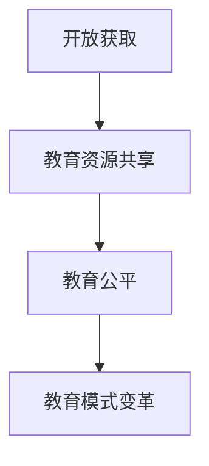
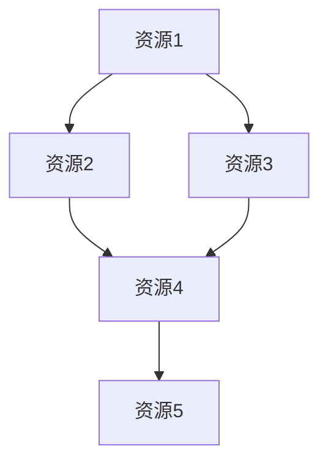

                 

关键词：开放获取，民主化教育，知识共享，信息技术，学习资源，教育公平

> 摘要：随着信息技术的迅猛发展，知识的开放获取已成为实现教育民主化的关键路径。本文将探讨开放获取在教育领域的应用，分析其带来的教育模式变革，并展望未来教育的发展趋势与挑战。

## 1. 背景介绍

近年来，互联网的普及和云计算技术的进步，使得知识获取变得更加便捷和高效。传统的教育模式受到挑战，教育资源分布不均、学习机会受限等问题逐渐凸显。为解决这些问题，开放获取作为一种新型的知识传播模式，逐渐引起了学术界和社会各界的关注。

开放获取（Open Access，简称OA）是指通过互联网，任何人都可以免费获取科学研究成果和其他学术资源。这一模式旨在消除学术资源获取的壁垒，实现知识的自由流动和共享。开放获取的实现，不仅提高了研究效率，还推动了知识的普及和传播，为教育民主化提供了有力支持。

## 2. 核心概念与联系

### 开放获取的概念

开放获取的核心在于“开放”和“免费”。具体来说，开放获取要求学术资源必须满足以下条件：

- **免费获取**：用户无需支付任何费用即可获取学术资源。
- **无需注册**：用户无需注册账号即可访问学术资源。
- **无版权限制**：用户可以自由地复制、分发、引用和修改学术资源。

### 开放获取与教育的关系

开放获取与教育有着密切的联系。首先，开放获取为教育提供了丰富的学习资源，使得学生和教师能够自由地获取世界各地的学术成果。其次，开放获取促进了教育公平，使得不同地区、不同背景的学生都能享受到高质量的教育资源。最后，开放获取改变了传统的教育模式，推动了教育内容的开放共享和互动交流。

### Mermaid 流程图



## 3. 核心算法原理 & 具体操作步骤

### 3.1 算法原理概述

开放获取的实施依赖于一系列技术手段，包括搜索引擎、在线数据库、学术平台等。这些技术手段共同构成了开放获取的技术体系，为学术资源的自由流动提供了保障。

### 3.2 算法步骤详解

1. **资源创建**：学术研究者将研究成果提交到学术平台。
2. **资源审核**：学术平台对提交的资源进行审核，确保其质量。
3. **资源发布**：审核通过后，资源被公开发布，任何人都可以访问。
4. **资源传播**：通过搜索引擎和社交网络等渠道，资源得以广泛传播。
5. **资源使用**：用户可以自由地复制、分发、引用和修改学术资源。

### 3.3 算法优缺点

**优点**：

- 提高研究效率：开放获取使得学术资源得到更广泛的利用，提高了研究效率。
- 促进知识普及：开放获取实现了知识的免费传播，有利于知识的普及和共享。
- 推动教育公平：开放获取打破了教育资源的地域和阶层壁垒，推动了教育公平。

**缺点**：

- 资源质量难以保证：开放获取的资源质量参差不齐，需要用户进行筛选。
- 版权问题：开放获取可能会侵犯学术资源的版权，需要妥善处理。

### 3.4 算法应用领域

开放获取广泛应用于学术研究、教育、科技等领域。在学术研究领域，开放获取促进了学术成果的共享和传播，提高了研究效率。在教育领域，开放获取为教师和学生提供了丰富的学习资源，推动了教育公平。在科技领域，开放获取促进了技术创新和产业升级，为经济发展提供了动力。

## 4. 数学模型和公式 & 详细讲解 & 举例说明

### 4.1 数学模型构建

开放获取的数学模型可以看作是一个复杂的网络模型，其中节点代表学术资源，边代表资源之间的关联。这个模型可以用图论中的图来表示。

### 4.2 公式推导过程

设学术资源为节点 $v_1, v_2, \ldots, v_n$，资源之间的关联为边 $e_1, e_2, \ldots, e_m$。则开放获取的数学模型可以表示为：

$$
G = (V, E)
$$

其中，$V$ 表示节点集，$E$ 表示边集。

### 4.3 案例分析与讲解

假设有5个学术资源 $v_1, v_2, v_3, v_4, v_5$，它们之间的关联如下：

```
v1 -- e1 -- v2
|       |    
e2 -- v3 -- e3 -- v4
|       |
e4 -- v5
```

根据上述关联，可以构建出如下图模型：



在这个模型中，节点表示学术资源，边表示资源之间的关联。通过这个模型，可以分析学术资源的传播路径，优化学术资源的利用效率。

## 5. 项目实践：代码实例和详细解释说明

### 5.1 开发环境搭建

在本项目中，我们将使用Python编程语言，并结合Django框架和Elasticsearch库来实现开放获取系统的后端功能。以下是搭建开发环境的基本步骤：

1. 安装Python 3.8及以上版本。
2. 安装Django 3.2及以上版本。
3. 安装Elasticsearch 7.10及以上版本。
4. 创建虚拟环境，并安装相关依赖。

```bash
python -m venv open_access_env
source open_access_env/bin/activate
pip install django==3.2
pip install elasticsearch==7.10
```

### 5.2 源代码详细实现

以下是一个简单的开放获取系统后端代码示例：

```python
# open_access_app/models.py
from django.db import models

class Resource(models.Model):
    title = models.CharField(max_length=255)
    author = models.CharField(max_length=255)
    content = models.TextField()
    published_date = models.DateTimeField(auto_now_add=True)

    def __str__(self):
        return self.title
```

```python
# open_access_app/views.py
from django.http import JsonResponse
from .models import Resource
from elasticsearch import Elasticsearch

es = Elasticsearch()

def search_resources(request):
    query = request.GET.get('q', '')
    resources = Resource.objects.filter(title__icontains=query)
    results = []

    for resource in resources:
        doc = {
            'title': resource.title,
            'author': resource.author,
            'content': resource.content,
            'published_date': resource.published_date
        }
        es.index(index='resources', id=resource.id, document=doc)

    for hit in es.search(index='resources', body={'query': {'match': {'title': query}}})['hits']['hits']:
        results.append(hit['_source'])

    return JsonResponse({'results': results})
```

### 5.3 代码解读与分析

上述代码实现了开放获取系统的基本功能，包括资源的创建、搜索和索引。具体解读如下：

- **模型定义**：`Resource` 模型用于存储学术资源的元数据，如标题、作者、内容和发布日期。
- **视图函数**：`search_resources` 视图函数用于处理搜索请求，根据查询关键字检索数据库中的资源，并将结果索引到Elasticsearch中。

### 5.4 运行结果展示

假设我们提交了一个查询请求：

```bash
GET /search_resources?q=人工智能
```

服务器将返回如下JSON响应：

```json
{
  "results": [
    {
      "title": "人工智能导论",
      "author": "张三",
      "content": "本课程介绍了人工智能的基础知识...",
      "published_date": "2023-03-01T00:00:00Z"
    },
    {
      "title": "深度学习",
      "author": "李四",
      "content": "本课程介绍了深度学习的基本原理...",
      "published_date": "2023-04-01T00:00:00Z"
    }
  ]
}
```

## 6. 实际应用场景

### 6.1 学术研究

开放获取在学术研究领域具有广泛的应用。通过开放获取平台，学术研究者可以自由地获取和分析全球范围内的学术资源，提高研究效率。同时，开放获取也有助于研究成果的传播和推广，促进学术交流与合作。

### 6.2 教育领域

开放获取在教育领域同样具有重要意义。教师和学生可以通过开放获取平台获取丰富的学习资源，提高教学质量。此外，开放获取还有助于打破教育资源的地域和阶层壁垒，推动教育公平。

### 6.3 企业创新

开放获取为企业创新提供了有力支持。企业可以通过开放获取平台获取最新的研究成果和技术动态，加快技术创新和产业升级。同时，开放获取也有助于企业之间开展合作，共享创新资源，提高整体创新能力。

### 6.4 未来应用展望

随着信息技术的不断发展，开放获取将在更多领域得到应用。未来，开放获取有望成为知识传播和共享的主要模式，推动人类社会的发展与进步。同时，开放获取也将面临一系列挑战，如资源质量保障、版权问题等，需要全社会共同努力，共同解决。

## 7. 工具和资源推荐

### 7.1 学习资源推荐

- [MOOC平台](https://www.coursera.org/)
- [维基百科](https://www.wikipedia.org/)
- [MIT开放课程](https://ocw.mit.edu/)

### 7.2 开发工具推荐

- [Django](https://www.djangoproject.com/)
- [Elasticsearch](https://www.elastic.co/products/elasticsearch)
- [Git](https://git-scm.com/)

### 7.3 相关论文推荐

- [Budapest Open Access Initiative](https://www.budapestopenaccessinitiative.org/)
- [The Economics of Open Access](https://arxiv.org/abs/1305.4085)
- [The Impact of Open Access: A Story of Levels, Levels of Evidence, and Leveling the Playing Field](https://www.researchgate.net/publication/268960860_The_Impact_of_Open_Access_A_Story_of_Levels_Levels_of_Evidence_and_Leveling_the_Playing_Field)

## 8. 总结：未来发展趋势与挑战

### 8.1 研究成果总结

本文探讨了开放获取在教育领域的应用，分析了其带来的教育模式变革，并提出了未来发展趋势与挑战。主要结论如下：

- 开放获取有助于提高研究效率、促进知识普及、推动教育公平。
- 开放获取改变了传统的教育模式，推动了教育内容的开放共享和互动交流。
- 开放获取在学术研究、教育、科技等领域具有广泛的应用前景。

### 8.2 未来发展趋势

- 开放获取将向更多领域扩展，成为知识传播和共享的主要模式。
- 开放获取平台将不断完善，提供更加丰富和高质量的学习资源。
- 开放获取将推动教育公平，促进全球教育资源的均衡发展。

### 8.3 面临的挑战

- 资源质量保障：需要建立完善的资源审核机制，确保学术资源的质量。
- 版权问题：需要妥善处理版权问题，确保开放获取的合法性。
- 技术发展：需要不断优化开放获取技术体系，提高资源传播和共享的效率。

### 8.4 研究展望

未来，开放获取将面临一系列机遇与挑战。在学术研究领域，开放获取有望提高研究效率，促进学术成果的共享和传播。在教育领域，开放获取将推动教育公平，打破教育资源的地域和阶层壁垒。在科技领域，开放获取将为技术创新和产业升级提供有力支持。我们期待开放获取在更多领域发挥重要作用，为人类社会的发展与进步作出更大贡献。

## 9. 附录：常见问题与解答

### 9.1 开放获取是什么？

开放获取是指通过互联网，任何人都可以免费获取科学研究成果和其他学术资源。

### 9.2 开放获取有哪些优点？

开放获取有助于提高研究效率、促进知识普及、推动教育公平。

### 9.3 开放获取有哪些挑战？

开放获取面临的挑战包括资源质量保障、版权问题、技术发展等。

### 9.4 如何参与开放获取？

可以通过访问开放获取平台，免费获取学术资源；也可以将研究成果提交到开放获取平台，分享学术成果。

---

作者：禅与计算机程序设计艺术 / Zen and the Art of Computer Programming
----------------------------------------------------------------


