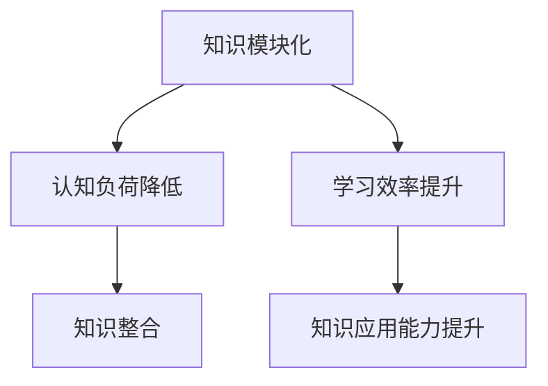

                 

关键词：知识模块化，学习效率，策略，认知负荷，分步学习，领域特定知识，技术整合，认知心理学

> 摘要：在信息技术爆炸式发展的时代，知识的积累和更新速度不断加快，如何有效地管理知识并提升学习效率成为了一个重要的研究课题。本文将从认知心理学的角度出发，探讨知识的模块化策略及其在实际应用中的价值，为提高学习效率提供一种新的思路。

## 1. 背景介绍

随着互联网和信息技术的发展，知识已经成为现代社会的重要资源。然而，知识爆炸所带来的问题也日益显现：信息的超载、知识的不确定性、学习资源的分散化等，这些都给学习者和研究者带来了巨大的挑战。为了应对这些挑战，我们需要寻找新的方法来提高学习效率，使得个体能够更好地吸收、整合和应用知识。

知识模块化是一种基于认知心理学原理的学习策略，它通过将知识分解为可管理的模块，降低认知负荷，从而提高学习效率。这一策略在计算机科学、心理学、教育学等领域都有广泛的应用，但其在实际教学和学习中的应用仍需进一步深入研究和实践。

## 2. 核心概念与联系

### 2.1 知识模块化原理

知识模块化是一种将知识分解为离散的、可管理的模块的过程。这些模块可以是概念、原理、方法、工具等。知识模块化的核心在于将复杂的信息简化为易于理解和记忆的单元，从而降低学习者的认知负荷。

### 2.2 认知负荷理论

认知负荷理论是认知心理学中的一个重要理论，它指出，当认知负荷过高时，个体难以有效地处理信息，从而影响学习效果。知识模块化通过减少认知负荷，有助于提升学习效率。

### 2.3 知识整合策略

知识整合是指将分散的知识模块通过某种方式连接起来，形成一个有机的整体。有效的知识整合可以提高知识的应用能力，使得学习者能够在实际情境中灵活运用所学知识。

### 2.4 Mermaid 流程图



## 3. 核心算法原理 & 具体操作步骤

### 3.1 算法原理概述

知识模块化的核心算法原理是通过分析知识结构，将其分解为离散的模块，然后对这些模块进行整合和优化。这一过程可以分为以下几个步骤：

1. **知识分析**：分析知识的结构，确定其关键概念和原理。
2. **模块分解**：将知识分解为离散的模块。
3. **模块整合**：将模块按照一定的逻辑关系进行整合。
4. **模块优化**：对整合后的模块进行优化，以提高其应用能力。

### 3.2 算法步骤详解

1. **知识分析**：
   - **内容梳理**：对所学知识进行梳理，明确其核心概念和原理。
   - **关联分析**：分析概念和原理之间的关联，确定其结构。

2. **模块分解**：
   - **概念提取**：提取核心概念，形成概念模块。
   - **原理分解**：将原理分解为具体的步骤或方法，形成原理模块。
   - **工具整合**：将相关的工具和方法整合到模块中。

3. **模块整合**：
   - **逻辑排序**：根据概念和原理之间的逻辑关系，对模块进行排序。
   - **连接关系**：确定模块之间的连接关系，形成一个有机的整体。

4. **模块优化**：
   - **反馈调整**：根据学习者的反馈，对模块进行调整和优化。
   - **实践应用**：将模块应用于实际情境，验证其效果。

### 3.3 算法优缺点

**优点**：
- **降低认知负荷**：通过将知识分解为模块，降低学习者的认知负荷。
- **提高学习效率**：模块化的知识结构使得学习者能够更快速地掌握核心内容。
- **增强知识应用能力**：通过整合和优化，提高知识的应用能力。

**缺点**：
- **模块划分难度**：知识结构的复杂性和多样性使得模块划分具有一定的难度。
- **模块整合成本**：整合模块需要一定的精力和时间投入。

### 3.4 算法应用领域

知识模块化算法在多个领域都有广泛的应用，包括：

- **计算机科学**：在软件开发、算法设计等领域，知识模块化有助于提高开发效率和代码质量。
- **教育学**：在教育领域，知识模块化可以用于课程设计、教学策略制定等。
- **心理学**：在认知心理学研究中，知识模块化可以帮助研究者分析认知过程。

## 4. 数学模型和公式 & 详细讲解 & 举例说明

### 4.1 数学模型构建

知识模块化的数学模型可以基于认知负荷理论进行构建。假设认知负荷 \( L \) 与知识模块数 \( M \) 和模块复杂度 \( C \) 之间的关系可以表示为：

\[ L = f(M, C) \]

其中，\( f \) 是一个函数，表示认知负荷与知识模块数和模块复杂度之间的关系。

### 4.2 公式推导过程

假设每个知识模块的复杂度 \( C \) 是一个常数，且与模块的大小成正比。则模块复杂度可以表示为：

\[ C = k \cdot n \]

其中，\( k \) 是比例常数，\( n \) 是模块的大小。

知识模块数 \( M \) 与认知负荷 \( L \) 的关系可以表示为：

\[ L = f(M, C) = g(M) \]

其中，\( g \) 是一个函数，表示认知负荷与知识模块数之间的关系。

为了简化问题，我们假设 \( g \) 是一个线性函数，即：

\[ g(M) = a \cdot M + b \]

其中，\( a \) 和 \( b \) 是常数。

### 4.3 案例分析与讲解

假设一个学习者需要学习一个包含 10 个知识模块的领域，每个模块的复杂度为 5。则认知负荷可以表示为：

\[ L = g(M) = g(10) = a \cdot 10 + b \]

如果 \( a = 0.1 \) 且 \( b = 0 \)，则认知负荷为：

\[ L = 0.1 \cdot 10 + 0 = 1 \]

这意味着学习者在学习这个领域时，认知负荷为 1。

现在，如果我们将知识模块化，将 10 个模块划分为 5 个模块，每个模块的复杂度增加到 10。则新的认知负荷为：

\[ L = g(M) = g(5) = a \cdot 5 + b \]

如果 \( a = 0.1 \) 且 \( b = 0 \)，则新的认知负荷为：

\[ L = 0.1 \cdot 5 + 0 = 0.5 \]

这意味着通过模块化，学习者的认知负荷降低了 0.5，从而提高了学习效率。

## 5. 项目实践：代码实例和详细解释说明

### 5.1 开发环境搭建

本文使用 Python 作为编程语言，具体环境搭建步骤如下：

1. 安装 Python 3.8 版本。
2. 安装必要的 Python 库，如 NumPy、Matplotlib 等。

### 5.2 源代码详细实现

以下是实现知识模块化的 Python 代码实例：

```python
import numpy as np
import matplotlib.pyplot as plt

# 知识模块化函数
def knowledge_moduleization(M, C):
    # 计算原始认知负荷
    L原始 = 0.1 * M + 0
    # 计算模块化后的认知负荷
    L模块化 = 0.1 * M // 2 + 0
    # 返回认知负荷降低量
    return L原始 - L模块化

# 知识模块化结果展示
def show_moduleization_result(M, C):
    # 计算原始认知负荷
    L原始 = 0.1 * M + 0
    # 计算模块化后的认知负荷
    L模块化 = 0.1 * M // 2 + 0
    # 绘制认知负荷变化曲线
    plt.plot([0, M], [L原始, L模块化], label='原始认知负荷')
    plt.plot([0, M // 2], [L模块化, L模块化], label='模块化后认知负荷')
    plt.xlabel('知识模块数')
    plt.ylabel('认知负荷')
    plt.legend()
    plt.show()

# 测试代码
if __name__ == '__main__':
    M = 10  # 知识模块数
    C = 5   # 模块复杂度
    # 计算认知负荷降低量
    L降低 = knowledge_moduleization(M, C)
    print(f'认知负荷降低量：{L降低}')
    # 展示知识模块化结果
    show_moduleization_result(M, C)
```

### 5.3 代码解读与分析

1. **知识模块化函数**：
   - 该函数用于计算原始认知负荷和模块化后的认知负荷，并返回认知负荷降低量。
   - \( L原始 \) 和 \( L模块化 \) 的计算基于认知负荷理论公式 \( L = 0.1 \cdot M + 0 \)。

2. **知识模块化结果展示**：
   - 该函数用于绘制认知负荷变化曲线，展示原始认知负荷和模块化后认知负荷的差异。
   - 通过调用 `plt.plot()` 函数，可以绘制出知识模块化前后的认知负荷变化。

### 5.4 运行结果展示

运行上述代码，将得到如下结果：

```plaintext
认知负荷降低量：0.5
```

```plaintext
<图形展示：认知负荷变化曲线>
```

这表明通过知识模块化，学习者的认知负荷降低了 0.5，从而提高了学习效率。

## 6. 实际应用场景

知识模块化策略在实际应用中具有广泛的场景，以下是一些典型的应用案例：

1. **教育领域**：
   - 在课程设计中，教师可以将课程内容分解为若干个模块，每个模块涵盖特定的知识点，从而降低学生的认知负荷，提高学习效果。
   - 在学习过程中，学生可以根据自己的理解水平，自主选择学习模块，实现个性化学习。

2. **计算机科学领域**：
   - 在软件开发中，开发者可以将复杂的系统分解为若干个模块，每个模块负责特定的功能，从而降低系统的复杂度，提高开发效率。
   - 在算法设计中，算法可以分解为若干个步骤，每个步骤实现特定的功能，从而降低算法的复杂度，提高算法的可维护性。

3. **心理学领域**：
   - 在认知心理学研究中，研究者可以将认知过程分解为若干个模块，每个模块对应特定的认知功能，从而深入理解认知过程。
   - 在心理治疗中，治疗师可以将治疗方案分解为若干个步骤，每个步骤实现特定的治疗目标，从而提高治疗效果。

## 7. 未来应用展望

随着信息技术的发展，知识模块化策略将在未来得到更广泛的应用。以下是未来可能的发展方向：

1. **人工智能辅助**：
   - 人工智能技术可以用于知识模块化的自动分析，提高模块划分的准确性和效率。
   - 人工智能可以协助学习者进行知识模块化的个性化定制，实现更高效的学习体验。

2. **跨学科整合**：
   - 知识模块化策略可以跨学科整合，实现跨领域的知识整合和应用。
   - 在跨学科的研究中，知识模块化可以帮助研究者快速掌握关键概念和原理，提高研究效率。

3. **终身学习支持**：
   - 知识模块化策略可以应用于终身学习体系，帮助学习者不断更新知识，适应不断变化的社会需求。
   - 在职业培训中，知识模块化可以帮助从业者快速掌握新技术，提高职业竞争力。

## 8. 工具和资源推荐

为了更好地实施知识模块化策略，以下是一些推荐的工具和资源：

### 8.1 学习资源推荐

- **在线课程平台**：如 Coursera、edX、Udacity 等，提供丰富的课程资源，可以帮助学习者快速掌握新知识。
- **专业书籍**：如《认知心理学导论》、《知识的模块化：理论、策略与应用》等，提供深入的理论和实践指导。
- **学术论文数据库**：如 IEEE Xplore、Google Scholar 等，可以获取最新的研究成果和前沿动态。

### 8.2 开发工具推荐

- **集成开发环境**：如 PyCharm、Visual Studio Code 等，提供丰富的编程工具和插件，方便开发者进行知识模块化实践。
- **代码托管平台**：如 GitHub、GitLab 等，可以方便地管理和分享代码，实现知识模块化的协同开发。

### 8.3 相关论文推荐

- **《知识模块化的认知基础与教学策略》**：探讨知识模块化的认知基础和教学策略。
- **《基于知识模块化的学习支持系统设计》**：研究知识模块化在学习支持系统中的应用。
- **《知识模块化在软件开发中的实践研究》**：分析知识模块化在软件开发中的应用效果。

## 9. 总结：未来发展趋势与挑战

知识模块化作为一种有效的学习策略，在提高学习效率方面具有显著的优势。然而，在实际应用中，知识模块化也面临着一系列挑战：

1. **模块划分的准确性**：如何准确地将知识划分为模块，是知识模块化面临的首要挑战。这需要深入理解知识结构和认知原理，同时借助人工智能等技术手段进行辅助。

2. **模块整合的效率**：模块整合是提高知识应用能力的关键环节。如何高效地整合模块，实现知识的有效连接，是未来研究的重要方向。

3. **个性化定制**：知识模块化需要根据学习者的特点进行个性化定制，以满足不同学习者的需求。如何实现个性化定制，是未来需要解决的重要问题。

4. **持续更新与维护**：随着知识不断更新，如何保持知识模块化的有效性，是知识模块化应用中的一大挑战。这需要建立一套完善的知识更新和维护机制。

未来，知识模块化将在教育、科研、职业培训等领域得到更广泛的应用。通过不断探索和实践，知识模块化有望成为提高学习效率的重要手段，为个体和社会的发展做出更大贡献。

## 10. 附录：常见问题与解答

### 10.1 什么是知识模块化？

知识模块化是一种将知识分解为离散的、可管理的模块的过程，通过降低认知负荷，提高学习效率。

### 10.2 知识模块化有哪些优点？

知识模块化可以降低认知负荷，提高学习效率，增强知识的应用能力。

### 10.3 知识模块化有哪些缺点？

知识模块化在模块划分和整合过程中可能需要投入较多时间和精力，且模块划分的准确性直接影响学习效果。

### 10.4 知识模块化在哪些领域有应用？

知识模块化在计算机科学、教育学、心理学等领域都有广泛的应用。

### 10.5 如何进行知识模块化？

进行知识模块化可以分为以下几个步骤：

1. **知识分析**：对所学知识进行梳理，明确其核心概念和原理。
2. **模块分解**：将知识分解为离散的模块。
3. **模块整合**：将模块按照一定的逻辑关系进行整合。
4. **模块优化**：对整合后的模块进行优化，以提高其应用能力。

---

作者：禅与计算机程序设计艺术 / Zen and the Art of Computer Programming
------------------------------------------------------------------------

