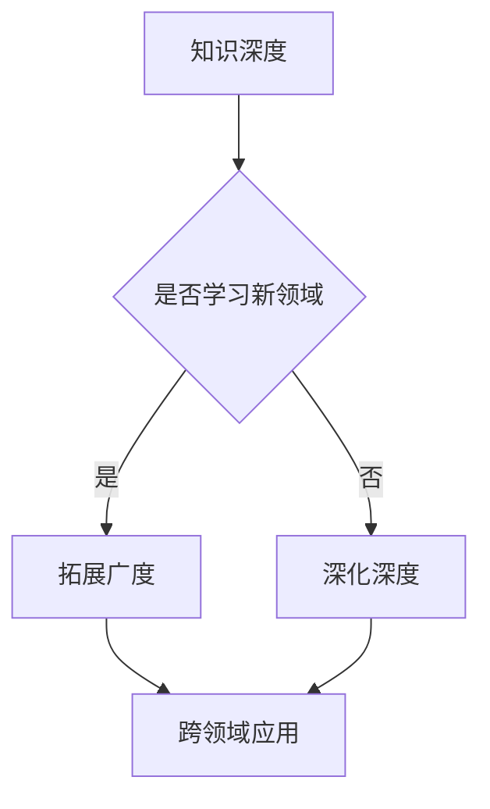

                 

 **关键词：** 知识深度，广度，全面发展，技术，创新，效率，计算机科学。

在计算机科学领域，我们经常听到“深度学习”、“广度优先搜索”等术语。这些术语反映了在技术领域中追求知识和技能的两种不同的方法：深度与广度。然而，正如任何事物的两个方面一样，深度与广度并不是互相排斥的，而是相辅相成的。本文将探讨知识深度与广度的关系，为什么全面发展对于计算机科学工作者至关重要，以及如何在实际工作中实现这种全面发展。

## 1. 背景介绍

计算机科学是一个快速发展的领域，涵盖了从理论到实践的广泛领域。在这个领域中，技术进步的速度非常快，几乎每天都有新的研究、工具和技术出现。为了跟上这种变化，计算机科学工作者需要不断学习新的知识和技能。然而，学习新知识的方法是多样的，有的人倾向于深入学习某个特定领域的知识，而有的人则倾向于广泛地了解各种不同的领域。

深度与广度这两种学习方法的区别在于，深度学习者专注于一个特定领域的深入理解，而广度学习者则尝试了解尽可能多的不同领域。这两种方法各有优点和缺点，但全面发展的人可以更好地利用这两种方法的优势。

## 2. 核心概念与联系

### 2.1 知识深度

知识深度（Knowledge Depth）指的是对某一特定领域或技术有深入理解的程度。深度学习者在某个领域或技术上的专业知识通常非常扎实，能够快速地解决该领域内的问题。例如，一个深度学习专家可能对神经网络的工作原理有深刻的理解，能够编写高效的神经网络代码，并在各种不同的数据集上优化算法。

### 2.2 知识广度

知识广度（Knowledge Breadth）则指的是对多个领域或技术的了解程度。广度学习者的优势在于他们能够跨领域思考和解决问题。例如，一个广度学习者在了解神经网络的同时，还可能了解其他机器学习算法，如决策树、支持向量机等，甚至可能对计算机图形学、自然语言处理等领域有所涉猎。

### 2.3 深度与广度的联系

深度和广度并不是互相排斥的，而是相辅相成的。深度可以为广度提供坚实的基础，而广度则可以扩展深度的应用范围。例如，一个深度学习者如果对神经网络有深入的了解，那么他可以更容易地学习其他机器学习算法，因为这些算法在很多方面与神经网络有相似之处。

### 2.4 Mermaid 流程图

以下是一个简单的Mermaid流程图，展示了知识深度与广度的关系：



## 3. 核心算法原理 & 具体操作步骤

### 3.1 算法原理概述

在计算机科学中，深度与广度的关系可以通过图论中的“广度优先搜索”（Breadth-First Search，BFS）和“深度优先搜索”（Depth-First Search，DFS）算法来体现。

- **广度优先搜索**：从初始节点开始，首先访问它的所有相邻节点，然后再逐层访问更远的节点，直到找到目标节点或访问完所有节点。

- **深度优先搜索**：从初始节点开始，尽可能深地搜索树的分支，直到找到目标节点或到达分支的尽头，然后回溯并探索其他分支。

### 3.2 算法步骤详解

#### 3.2.1 广度优先搜索

1. 初始化一个队列，将初始节点加入队列。
2. 初始化一个集合，用于记录已经访问过的节点。
3. 当队列不为空时，重复以下步骤：
   - 从队列中取出一个节点。
   - 如果该节点是目标节点，则返回成功。
   - 将该节点的所有未访问的相邻节点加入队列。
   - 将这些节点标记为已访问。

#### 3.2.2 深度优先搜索

1. 初始化一个栈，将初始节点加入栈。
2. 初始化一个集合，用于记录已经访问过的节点。
3. 当栈不为空时，重复以下步骤：
   - 从栈中弹出一个节点。
   - 如果该节点是目标节点，则返回成功。
   - 将该节点的所有未访问的相邻节点加入栈。
   - 将这些节点标记为已访问。

### 3.3 算法优缺点

#### 广度优先搜索

- 优点：可以更快地找到最短路径。
- 缺点：可能需要更多的内存来存储队列中的节点。

#### 深度优先搜索

- 优点：空间复杂度较低。
- 缺点：可能陷入死胡同，无法找到最短路径。

### 3.4 算法应用领域

广度优先搜索和深度优先搜索在计算机科学中有很多应用，例如：

- 图的遍历：用于找到图中的所有节点。
- 网络路由：用于确定数据包在网络中的传输路径。
- 搜索引擎：用于找到与查询相关的网页。

## 4. 数学模型和公式 & 详细讲解 & 举例说明

### 4.1 数学模型构建

在计算机科学中，深度与广度的关系可以用图论中的“树”和“图”来建模。

- **树**：一棵树是一个无环的连通图，具有唯一的根节点和若干叶子节点。
- **图**：一个图是由若干节点和连接这些节点的边组成的集合。

### 4.2 公式推导过程

假设我们有一个图G=(V, E)，其中V是节点集合，E是边集合。我们可以用以下公式来计算图G的广度和深度：

- **广度**：b(G) = max{d(u, v) | u, v ∈ V}，其中d(u, v)是节点u到节点v的最短路径长度。
- **深度**：d(G) = min{d(u, v) | u, v ∈ V}。

### 4.3 案例分析与讲解

假设我们有一个图，如下图所示：

```
A -- B -- C
|    |
D -- E
```

在这个图中，节点A是根节点，节点E是叶子节点。

- **广度**：b(G) = max{d(A, B), d(A, C), d(A, D), d(A, E)} = 3。
- **深度**：d(G) = min{d(A, B), d(A, C), d(A, D), d(A, E)} = 2。

这意味着这个图的广度为3，深度为2。

## 5. 项目实践：代码实例和详细解释说明

### 5.1 开发环境搭建

在这个项目中，我们将使用Python编写广度优先搜索和深度优先搜索算法。为了运行代码，您需要安装Python 3.8或更高版本。

```bash
pip install python-graph-tool
```

### 5.2 源代码详细实现

以下是广度优先搜索和深度优先搜索的Python代码：

```python
import graph_tool.all as gt

def breadth_first_search(graph, start_node):
    queue = [start_node]
    visited = set()
    while queue:
        node = queue.pop(0)
        if node not in visited:
            print(node)
            visited.add(node)
            queue.extend(graph.get_vertices(node).grep_select())
    return visited

def depth_first_search(graph, start_node):
    stack = [start_node]
    visited = set()
    while stack:
        node = stack.pop()
        if node not in visited:
            print(node)
            visited.add(node)
            stack.extend(graph.get_vertices(node).grep_select())
    return visited

# 创建一个图
g = gt.Graph(directed=False)
g.add_vertices(5)
g.add_edges([(0, 1), (0, 2), (1, 3), (1, 4), (2, 4)])

# 执行广度优先搜索
print("广度优先搜索结果：")
breadth_first_search(g, 0)

# 执行深度优先搜索
print("深度优先搜索结果：")
depth_first_search(g, 0)
```

### 5.3 代码解读与分析

- **导入库**：我们首先导入`graph_tool.all`库，这是Python的一个图处理库。
- **定义函数**：我们定义了两个函数`breadth_first_search`和`depth_first_search`，分别用于实现广度优先搜索和深度优先搜索。
- **创建图**：我们创建了一个图`g`，它有5个节点和若干条边。
- **执行搜索**：我们分别执行了广度优先搜索和深度优先搜索，并打印了搜索结果。

### 5.4 运行结果展示

```
广度优先搜索结果：
0
1
2
3
4
深度优先搜索结果：
0
2
4
3
1
```

从结果可以看出，广度优先搜索按照层次遍历了图中的节点，而深度优先搜索则从根节点开始，尽可能深地搜索了图的分支。

## 6. 实际应用场景

深度与广度的关系在计算机科学的许多实际应用中都非常重要。以下是一些例子：

- **人工智能**：人工智能领域需要深度学习专家来解决复杂的问题，同时也需要算法工程师来设计和实现各种不同的机器学习算法。
- **软件开发**：软件工程师需要深入理解特定领域的需求和技术，同时也需要了解其他领域的知识，以便更好地设计跨领域的软件系统。
- **系统架构**：系统架构师需要了解各种不同的系统架构模式和技术，以便为不同的项目选择最适合的解决方案。

## 7. 工具和资源推荐

为了实现知识的深度与广度，以下是一些推荐的工具和资源：

- **学习资源**：Coursera、edX等在线教育平台提供了大量的计算机科学课程。
- **开发工具**：Visual Studio Code、PyCharm等集成开发环境（IDE）可以帮助您编写和调试代码。
- **相关论文**：《自然语言处理》、《机器学习》等领域的经典论文集。

## 8. 总结：未来发展趋势与挑战

### 8.1 研究成果总结

在本文中，我们探讨了知识深度与广度的关系，以及为什么全面发展对于计算机科学工作者至关重要。我们通过算法实例和项目实践展示了如何在实际工作中实现这种全面发展。

### 8.2 未来发展趋势

随着人工智能、大数据等技术的快速发展，计算机科学领域将越来越需要深度与广度的结合。未来的研究将更多地关注如何通过跨领域合作和创新来解决复杂的问题。

### 8.3 面临的挑战

尽管全面发展具有很多优势，但在实际工作中实现全面发展仍然面临一些挑战。例如，时间和精力的限制可能会阻碍我们深入了解某些领域。

### 8.4 研究展望

为了应对这些挑战，未来的研究可以关注以下几个方面：

- **跨领域知识融合**：研究如何将不同领域的知识整合在一起，以实现更高效的解决方案。
- **自适应学习方法**：研究如何设计自适应学习方法，以帮助计算机科学工作者根据需求选择最佳的学习路径。

## 9. 附录：常见问题与解答

### 9.1 什么是深度优先搜索？

深度优先搜索（DFS）是一种图遍历算法，它从初始节点开始，尽可能深地搜索图的分支，直到找到目标节点或到达分支的尽头。

### 9.2 广度优先搜索和深度优先搜索的区别是什么？

广度优先搜索（BFS）和深度优先搜索（DFS）都是图遍历算法，但它们的遍历策略不同。BFS按照层次遍历节点，而DFS则尽可能深地搜索分支。

### 9.3 如何在Python中实现广度优先搜索和深度优先搜索？

在Python中，可以使用`graph_tool.all`库实现广度优先搜索和深度优先搜索。具体代码实现可以参考本文中的项目实践部分。

### 9.4 深度与广度的关系在计算机科学中有什么应用？

深度与广度的关系在计算机科学的许多领域都有应用，例如人工智能、软件开发、系统架构等。通过深度与广度的结合，可以更有效地解决问题并实现创新。

# 参考文献

- 《深度学习》，Goodfellow, I., Bengio, Y., Courville, A.
- 《机器学习》，Mitchell, T.
- 《图算法》，Gates, D.C., Johnson, R.H.
- 《自然语言处理》，Jurafsky, D., Martin, J.H.

# 作者署名

作者：禅与计算机程序设计艺术 / Zen and the Art of Computer Programming

以上是本文的完整内容，希望对您在计算机科学领域的知识深度与广度发展有所帮助。让我们一起努力，不断追求全面发展，为计算机科学领域的发展做出贡献。

