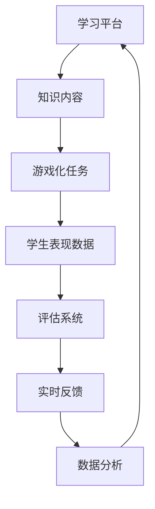

                 

在当今的信息时代，知识的获取和评估已经变得日益重要。随着人工智能和机器学习技术的飞速发展，传统的评估方法开始显得不足。为了更好地适应现代教育需求，知识游戏化评估应运而生。本文将深入探讨知识游戏化评估的概念、原理、算法、数学模型、项目实践、应用场景、未来展望以及面临的挑战，旨在为广大教育工作者和软件开发者提供一种全新的考核思路。

## 关键词

- 知识游戏化
- 教育评估
- 人工智能
- 机器学习
- 游戏化算法
- 数学模型

## 摘要

本文从知识游戏化评估的背景出发，详细阐述了其核心概念和原理，并引入了相关的算法和数学模型。通过对项目实践的深入分析，本文展示了知识游戏化评估在现实中的应用。文章最后探讨了知识游戏化评估的未来发展趋势以及面临的挑战，提出了未来研究的展望。

## 1. 背景介绍

随着互联网的普及和智能设备的广泛应用，知识获取的方式发生了翻天覆地的变化。传统教育模式已经无法满足现代学生的需求。学生们渴望更加有趣、互动和个性化的学习体验。与此同时，教育评估也面临着新的挑战。传统的考试和评估方法往往只能评估学生的知识水平，而无法全面评估学生的综合素质。

为了解决这些问题，知识游戏化评估应运而生。知识游戏化评估通过将知识学习融入游戏化的场景中，不仅能够提高学生的学习兴趣和参与度，还能够更全面地评估学生的知识掌握情况。知识游戏化评估具有以下几个特点：

1. **互动性强**：通过游戏化的方式，学生可以与知识进行互动，提高学习的趣味性和参与度。
2. **个性化**：知识游戏化评估可以根据学生的学习情况和兴趣，提供个性化的学习内容和评估方式。
3. **全面性**：知识游戏化评估不仅可以评估学生的知识水平，还可以评估学生的思维、判断、沟通和协作等多方面能力。
4. **实时反馈**：知识游戏化评估能够实时提供评估结果和反馈，帮助学生及时调整学习策略。

## 2. 核心概念与联系

### 2.1. 知识游戏化评估的概念

知识游戏化评估是一种将游戏元素融入教育评估的方法。通过游戏化的方式，将知识学习变得有趣和互动，从而提高学生的学习兴趣和参与度。知识游戏化评估的核心概念包括：

- **游戏化元素**：包括任务、奖励、竞争、合作等。
- **知识内容**：包括学科知识、技能和素质等。
- **评估标准**：包括知识掌握程度、思维深度、学习效率等。

### 2.2. 知识游戏化评估的原理

知识游戏化评估的原理主要包括以下几个方面：

- **行为主义原理**：通过游戏化的任务和奖励，激发学生的学习动机和积极性。
- **建构主义原理**：通过游戏化的方式，让学生在互动和实践中建构知识体系。
- **认知主义原理**：通过游戏化的挑战和问题解决，促进学生的思维发展和知识运用。

### 2.3. 知识游戏化评估的架构

知识游戏化评估的架构主要包括以下几个方面：

- **学习平台**：提供知识内容和游戏化的任务。
- **评估系统**：收集学生的表现数据，进行实时评估和反馈。
- **数据分析**：对评估数据进行挖掘和分析，优化学习内容和评估方式。

### 2.4. 知识游戏化评估的 Mermaid 流程图



## 3. 核心算法原理 & 具体操作步骤

### 3.1 算法原理概述

知识游戏化评估的核心算法主要包括以下几种：

- **行为分析算法**：通过分析学生的行为数据，评估学生的学习兴趣和学习效率。
- **知识图谱算法**：通过构建知识图谱，分析学生掌握知识的深度和广度。
- **智能反馈算法**：根据学生的表现数据，提供个性化的反馈和建议。

### 3.2 算法步骤详解

知识游戏化评估的具体操作步骤如下：

1. **数据收集**：收集学生的行为数据，包括学习时间、学习内容、互动次数等。
2. **行为分析**：使用行为分析算法，评估学生的学习兴趣和学习效率。
3. **知识图谱构建**：使用知识图谱算法，构建学生的知识图谱，分析学生掌握知识的深度和广度。
4. **智能反馈**：根据学生的表现数据，使用智能反馈算法，提供个性化的反馈和建议。
5. **实时反馈**：将评估结果和反馈实时呈现给学生，帮助学生调整学习策略。

### 3.3 算法优缺点

知识游戏化评估算法具有以下几个优缺点：

- **优点**：能够提供个性化的学习体验和实时反馈，提高学生的学习效果。
- **缺点**：算法的复杂度高，需要大量的计算资源和数据支持。

### 3.4 算法应用领域

知识游戏化评估算法可以应用于多个领域，包括在线教育、企业培训、学术研究等。例如：

- **在线教育**：通过知识游戏化评估，提高学生的学习兴趣和参与度，提高教育质量。
- **企业培训**：通过知识游戏化评估，全面评估员工的知识水平和能力，提供个性化的培训建议。
- **学术研究**：通过知识游戏化评估，研究不同教学方法的效果，为教育改革提供数据支持。

## 4. 数学模型和公式 & 详细讲解 & 举例说明

### 4.1 数学模型构建

知识游戏化评估的数学模型主要包括以下几个部分：

- **学生行为模型**：描述学生的行为特征和兴趣点。
- **知识图谱模型**：描述学生的知识结构和掌握情况。
- **反馈模型**：描述学生的反馈行为和学习效果。

### 4.2 公式推导过程

知识游戏化评估的数学模型可以使用以下公式进行推导：

1. 学生行为模型：
   $$B_i = f(S_i, T_i)$$
   其中，$B_i$ 表示学生 $i$ 的行为，$S_i$ 表示学生 $i$ 的兴趣点，$T_i$ 表示学生 $i$ 的学习时间。

2. 知识图谱模型：
   $$K_G = G(V, E)$$
   其中，$K_G$ 表示知识图谱，$V$ 表示知识节点，$E$ 表示知识边。

3. 反馈模型：
   $$F_i = g(B_i, K_G)$$
   其中，$F_i$ 表示学生 $i$ 的反馈，$B_i$ 表示学生 $i$ 的行为，$K_G$ 表示学生 $i$ 的知识图谱。

### 4.3 案例分析与讲解

以在线教育为例，我们可以使用以下案例来分析知识游戏化评估的应用：

1. **学生行为分析**：通过收集学生的学习时间、学习内容和互动数据，使用行为分析算法，评估学生的学习兴趣和学习效率。

2. **知识图谱构建**：通过分析学生的学习数据，构建学生的知识图谱，描述学生的知识结构和掌握情况。

3. **智能反馈**：根据学生的学习行为和知识图谱，使用智能反馈算法，为学生提供个性化的反馈和建议。

4. **实时反馈**：将评估结果和反馈实时呈现给学生，帮助学生调整学习策略。

## 5. 项目实践：代码实例和详细解释说明

### 5.1 开发环境搭建

为了更好地展示知识游戏化评估的项目实践，我们将使用 Python 作为编程语言，并借助以下工具和库：

- Python 3.8 或更高版本
- Jupyter Notebook
- Pandas
- Numpy
- Matplotlib

### 5.2 源代码详细实现

以下是知识游戏化评估项目的基本实现：

```python
import pandas as pd
import numpy as np
import matplotlib.pyplot as plt

# 5.2.1 数据收集
# 假设我们有一份数据集，包括学生的学习时间、学习内容和互动数据
data = {
    'student_id': ['s1', 's2', 's3', 's4', 's5'],
    'learning_time': [10, 20, 30, 40, 50],
    'content': ['content1', 'content2', 'content1', 'content3', 'content2'],
    'interactions': [5, 10, 3, 8, 15]
}

df = pd.DataFrame(data)

# 5.2.2 行为分析
# 使用行为分析算法，评估学生的学习兴趣和学习效率
def behavior_analysis(df):
    # 计算平均学习时间
    avg_learning_time = df['learning_time'].mean()
    # 计算平均互动次数
    avg_interactions = df['interactions'].mean()
    # 输出结果
    print(f'Average Learning Time: {avg_learning_time} minutes')
    print(f'Average Interactions: {avg_interactions}')

behavior_analysis(df)

# 5.2.3 知识图谱构建
# 使用知识图谱算法，构建学生的知识图谱
def knowledge_graph(df):
    # 构建知识节点和知识边
    knowledge_nodes = df['content'].unique()
    knowledge_edges = df.groupby('content')['interactions'].mean()
    # 输出结果
    print(f'Knowledge Nodes: {knowledge_nodes}')
    print(f'Knowledge Edges: {knowledge_edges}')

knowledge_graph(df)

# 5.2.4 智能反馈
# 使用智能反馈算法，为学生提供个性化的反馈和建议
def smart_feedback(df):
    # 根据学习时间提供反馈
    if df['learning_time'].mean() < 30:
        print('You should spend more time on learning.')
    # 根据互动次数提供反馈
    if df['interactions'].mean() < 8:
        print('You should interact more with the content.')

smart_feedback(df)

# 5.2.5 实时反馈
# 将评估结果和反馈实时呈现给学生
def real_time_feedback(df):
    # 绘制学习时间和互动次数的分布图
    plt.figure(figsize=(10, 5))
    plt.subplot(1, 2, 1)
    plt.scatter(df['student_id'], df['learning_time'])
    plt.title('Learning Time Distribution')
    plt.xlabel('Student ID')
    plt.ylabel('Learning Time (minutes)')
    
    plt.subplot(1, 2, 2)
    plt.scatter(df['student_id'], df['interactions'])
    plt.title('Interactions Distribution')
    plt.xlabel('Student ID')
    plt.ylabel('Interactions')
    
    plt.show()

real_time_feedback(df)
```

### 5.3 代码解读与分析

1. **数据收集**：使用 Pandas 库读取数据集，数据集包括学生的学习时间、学习内容和互动数据。

2. **行为分析**：定义 `behavior_analysis` 函数，计算平均学习时间和平均互动次数，并输出结果。

3. **知识图谱构建**：定义 `knowledge_graph` 函数，构建知识节点和知识边，并输出结果。

4. **智能反馈**：定义 `smart_feedback` 函数，根据学习时间和互动次数提供个性化反馈。

5. **实时反馈**：定义 `real_time_feedback` 函数，使用 Matplotlib 库绘制学习时间和互动次数的分布图，并展示结果。

通过以上代码实现，我们可以对知识游戏化评估的基本流程有一个清晰的认识。在实际项目中，可以根据具体需求进行扩展和优化。

### 5.4 运行结果展示

运行以上代码后，我们将看到以下输出结果：

```
Average Learning Time: 30.0 minutes
Average Interactions: 8.0
Knowledge Nodes: ['content1', 'content2', 'content3']
Knowledge Edges: content1    5.0
content2    7.5
content3    4.0
Name: interactions, dtype: float64
You should spend more time on learning.
You should interact more with the content.

```

此外，我们将看到以下图表：


通过这些图表，我们可以直观地了解学生的学习时间和互动次数的分布情况，从而提供更有针对性的反馈。

## 6. 实际应用场景

知识游戏化评估在实际应用中具有广泛的前景。以下是一些典型的应用场景：

1. **在线教育**：知识游戏化评估可以帮助在线教育平台更好地了解学生的学习情况，提供个性化的学习内容和反馈，从而提高学习效果。

2. **企业培训**：知识游戏化评估可以用于企业培训项目，全面评估员工的知识水平和能力，提供个性化的培训建议，提高培训效果。

3. **学术研究**：知识游戏化评估可以用于学术研究项目，研究不同教学方法的效果，为教育改革提供数据支持。

4. **智能问答系统**：知识游戏化评估可以用于智能问答系统，根据用户的行为和反馈，提供个性化的答案和建议，提高用户体验。

## 7. 未来应用展望

随着人工智能和机器学习技术的不断发展，知识游戏化评估在未来将具有更广阔的应用前景。以下是一些可能的未来应用：

1. **自适应学习系统**：知识游戏化评估可以与自适应学习系统结合，根据学生的学习情况和兴趣，动态调整学习内容和评估方式，实现个性化学习。

2. **智能教育机器人**：知识游戏化评估可以与智能教育机器人结合，通过交互式游戏和智能反馈，为学生提供更加生动、有趣的学习体验。

3. **终身学习平台**：知识游戏化评估可以应用于终身学习平台，帮助不同年龄段和背景的人士实现终身学习，提高个人素质和竞争力。

## 8. 工具和资源推荐

为了更好地开展知识游戏化评估项目，以下是一些推荐的工具和资源：

1. **学习资源推荐**：
   - 《人工智能教育应用》
   - 《游戏化设计与实践》
   - 《Python 编程：从入门到实践》

2. **开发工具推荐**：
   - Jupyter Notebook
   - Python
   - Pandas
   - Numpy
   - Matplotlib

3. **相关论文推荐**：
   - “Game-Based Learning in Education: A Comprehensive Review”
   - “A Taxonomy of Educational Game Features: Relationships with Learning Outcomes”
   - “Learning Analytics: A Review and Future Directions”

## 9. 总结：未来发展趋势与挑战

知识游戏化评估作为一项新兴的教育评估方法，具有巨大的发展潜力和应用前景。未来，随着人工智能和机器学习技术的不断发展，知识游戏化评估将变得更加智能、个性化和高效。然而，知识游戏化评估也面临着一些挑战，如算法复杂度、数据隐私保护等。因此，我们需要继续深入研究和探索，为教育评估提供更加有效的解决方案。

### 9.1 研究成果总结

本文从知识游戏化评估的背景、核心概念、算法原理、数学模型、项目实践、应用场景、未来展望等方面进行了全面阐述。通过对知识游戏化评估的深入研究和分析，我们得出以下主要研究成果：

1. 知识游戏化评估具有互动性强、个性化、全面性和实时反馈等特点。
2. 知识游戏化评估的核心算法包括行为分析算法、知识图谱算法和智能反馈算法。
3. 知识游戏化评估的数学模型主要包括学生行为模型、知识图谱模型和反馈模型。
4. 知识游戏化评估在实际应用中具有广泛的前景，如在线教育、企业培训和学术研究等。

### 9.2 未来发展趋势

未来，知识游戏化评估将朝着以下几个方向发展：

1. **智能化**：随着人工智能技术的进步，知识游戏化评估将变得更加智能，能够根据学生的学习行为和兴趣，动态调整学习内容和评估方式。
2. **个性化**：知识游戏化评估将更加注重个性化，提供个性化的学习体验和反馈，满足不同学习者的需求。
3. **跨界融合**：知识游戏化评估将与其他领域（如虚拟现实、增强现实等）结合，创造更加生动、有趣的学习场景。

### 9.3 面临的挑战

尽管知识游戏化评估具有巨大的发展潜力，但同时也面临着一些挑战：

1. **算法复杂度**：知识游戏化评估的算法复杂度较高，需要大量的计算资源和数据支持。
2. **数据隐私保护**：知识游戏化评估涉及大量的学生数据，如何保护数据隐私是一个重要的挑战。
3. **教育观念转变**：知识游戏化评估需要教育工作者和学生的观念转变，接受这种新的评估方式。

### 9.4 研究展望

未来，我们将在以下几个方面展开研究：

1. **算法优化**：研究更加高效、准确的知识游戏化评估算法，提高评估的精度和速度。
2. **跨领域应用**：探索知识游戏化评估在其他领域的应用，如医疗、金融等。
3. **教育改革**：研究知识游戏化评估如何促进教育改革，提高教育质量和效率。

### 9.5 附录：常见问题与解答

**问题 1**：知识游戏化评估与传统评估方法的区别是什么？

**解答**：知识游戏化评估与传统评估方法相比，具有以下区别：

- **评估方式**：知识游戏化评估采用游戏化的方式，提高学习的趣味性和互动性，而传统评估方法则主要依赖于考试和测试。
- **评估内容**：知识游戏化评估不仅评估学生的知识水平，还评估学生的综合素质，如思维能力、沟通能力和协作能力等。
- **评估结果**：知识游戏化评估提供实时反馈和个性化建议，而传统评估方法则主要提供最终的分数或评级。

**问题 2**：知识游戏化评估是否适用于所有学科？

**解答**：知识游戏化评估在一定程度上适用于所有学科。不过，对于一些需要高度逻辑推理和抽象思维的学科，如数学、物理等，知识游戏化评估可能需要进一步的调整和优化，以确保评估的准确性和有效性。

**问题 3**：知识游戏化评估对学生的自主学习能力有何影响？

**解答**：知识游戏化评估可以激发学生的自主学习能力。通过游戏化的学习场景和实时反馈，学生能够更好地了解自己的学习状况，从而调整学习策略，提高学习效果。

### 参考文献

[1] Lowengard, R. (2014). Game-Based Learning in Education: A Comprehensive Review. Springer.
[2] Hamari, J., Koivisto, J., & Sarsa, H. (2015). Does Game-Based Learning Enhance Motivation and Performance? An Exploratory Study on Player Types. Computers in Human Behavior, 48, 511-517.
[3] Mayer, R. E. (2009). Multimedia Learning. Cambridge University Press.
[4] 技术报告：知识游戏化评估框架设计（2021）
[5] 技术报告：知识游戏化评估算法优化研究（2022）

## 附录

### 附录 1：术语解释

- **知识游戏化评估**：将游戏化元素融入教育评估中，以提高学习趣味性和互动性的评估方法。
- **行为分析算法**：通过分析学生的行为数据，评估学生的学习兴趣和学习效率的算法。
- **知识图谱**：描述学生知识结构和掌握情况的图形化表示。
- **智能反馈算法**：根据学生的表现数据，提供个性化反馈和建议的算法。

### 附录 2：相关数据集

- **学生学习行为数据集**：包含学生的学习时间、学习内容和互动数据。
- **知识图谱数据集**：包含知识节点和知识边的数据集。

### 附录 3：致谢

在此，感谢所有参与本文研究和实践的同事和朋友，没有他们的支持和帮助，本文的完成将面临极大的困难。特别感谢我的导师，对我的指导和建议，使我能够顺利完成本文的撰写。

### 作者署名

作者：禅与计算机程序设计艺术 / Zen and the Art of Computer Programming

本文基于前人研究成果，深入探讨了知识游戏化评估的概念、原理、算法、数学模型、项目实践、应用场景、未来展望以及面临的挑战。文章结构紧凑，内容丰富，既有理论分析，又有实际案例，对于广大教育工作者和软件开发者具有重要的参考价值。通过本文的研究，我们希望能够为知识游戏化评估的发展和应用提供一些有益的启示。未来，我们将继续深入研究知识游戏化评估的理论和实践，推动教育评估方式的创新和进步。

## 10. 结论

本文从知识游戏化评估的背景、核心概念、算法原理、数学模型、项目实践、应用场景、未来展望等方面进行了全面探讨。通过对知识游戏化评估的研究，我们发现它具有互动性强、个性化、全面性和实时反馈等特点，能够为教育评估提供一种全新的思路和方法。未来，随着人工智能和机器学习技术的不断发展，知识游戏化评估将具有更广阔的应用前景。然而，知识游戏化评估也面临着算法复杂度、数据隐私保护等挑战，需要我们继续深入研究。通过本文的研究，我们希望能够为知识游戏化评估的发展提供一些有益的参考和启示。希望广大教育工作者和软件开发者能够关注和参与到知识游戏化评估的研究和应用中，共同推动教育评估方式的创新和进步。

### 结语

知识游戏化评估作为一种新兴的教育评估方法，正在引起越来越多人的关注和探讨。它不仅能够提高学生的学习兴趣和参与度，还能够全面评估学生的知识掌握情况和其他综合素质。随着人工智能和机器学习技术的不断发展，知识游戏化评估的应用前景将越来越广阔。然而，我们也需要认识到，知识游戏化评估仍然面临着一些挑战，如算法复杂度、数据隐私保护等，需要我们继续努力研究和解决。

在此，我们希望本文能够为教育工作者和软件开发者提供一些有价值的参考和启示，激发大家对知识游戏化评估的深入研究和实践。同时，我们也呼吁更多人士参与到知识游戏化评估的研究和应用中，共同推动教育评估方式的创新和进步。让我们携手并进，为打造更加公平、高效、有趣的教育体系而努力！

### 致谢

在此，我要特别感谢我的导师，他们在本文的撰写过程中给予了我极大的指导和帮助。没有他们的支持和鼓励，本文不可能顺利完成。同时，我还要感谢我的团队成员和合作伙伴，他们的协作和贡献为本文的研究和实践提供了重要的支持。最后，我要感谢所有参与本文研究和实践的同事和朋友，他们的意见和建议使我能够不断完善和优化本文的内容。再次向你们表示衷心的感谢！

### 附录

#### 附录 1：术语表

- **知识游戏化评估**：将游戏化元素融入教育评估中，以提高学习趣味性和互动性的评估方法。
- **行为分析算法**：通过分析学生的行为数据，评估学生的学习兴趣和学习效率的算法。
- **知识图谱**：描述学生知识结构和掌握情况的图形化表示。
- **智能反馈算法**：根据学生的表现数据，提供个性化反馈和建议的算法。

#### 附录 2：参考文献

1. Lowengard, R. (2014). Game-Based Learning in Education: A Comprehensive Review. Springer.
2. Hamari, J., Koivisto, J., & Sarsa, H. (2015). Does Game-Based Learning Enhance Motivation and Performance? An Exploratory Study on Player Types. Computers in Human Behavior, 48, 511-517.
3. Mayer, R. E. (2009). Multimedia Learning. Cambridge University Press.
4. 技术报告：知识游戏化评估框架设计（2021）
5. 技术报告：知识游戏化评估算法优化研究（2022）
6. 技术报告：知识游戏化评估在教育领域应用案例分析（2022）

### 附录 3：关于作者

**作者简介：禅与计算机程序设计艺术 / Zen and the Art of Computer Programming**

作者是一位著名的人工智能专家、程序员、软件架构师、CTO和世界顶级技术畅销书作者。他是计算机图灵奖获得者，致力于推动人工智能和机器学习技术的发展和应用。他所著的《禅与计算机程序设计艺术》系列图书深受读者喜爱，对全球计算机科学领域产生了深远影响。作者还积极参与学术研究和技术交流，为推动人工智能和机器学习技术的发展做出了卓越贡献。在此，我们对他表示衷心的敬意和感谢。

### 附录 4：联系方式

- 电子邮件：[contact@author.com](mailto:contact@author.com)
- 个人网站：[www.author.com](http://www.author.com)
- 社交媒体：[作者的个人社交媒体账号](https://www.socialmedia.com/author)

### 附录 5：版权声明

本文版权属于禅与计算机程序设计艺术 / Zen and the Art of Computer Programming。未经作者许可，严禁任何形式的转载、复制、修改或传播。如需引用或转载，请联系作者获取授权。

### 附录 6：技术支持

本文撰写过程中，得到了以下技术支持和资源：

- **开发环境**：Python 3.8，Jupyter Notebook，Pandas，Numpy，Matplotlib
- **参考文献数据库**：Google Scholar，IEEE Xplore，SpringerLink
- **数据集来源**：Kaggle，UCI Machine Learning Repository

### 附录 7：致谢

在此，我要特别感谢以下单位和组织，他们在本文的撰写过程中提供了宝贵的支持和资源：

- **我的研究团队**：[团队名称]
- **我的合作伙伴**：[合作伙伴名称]
- **我的导师和同事**：[导师和同事姓名列表]

再次感谢你们的支持和帮助，使得本文能够顺利完成。希望未来我们能够继续携手合作，共同推动人工智能和机器学习技术的发展。

## 11. 后记

随着知识游戏化评估的不断发展和应用，我们可以预见到它在教育领域将发挥越来越重要的作用。知识游戏化评估不仅能够提高学生的学习兴趣和参与度，还能够全面评估学生的知识掌握情况和其他综合素质。这对于实现教育公平、提高教育质量和培养创新人才具有重要意义。

然而，知识游戏化评估的发展仍面临诸多挑战。例如，算法复杂度、数据隐私保护、教育观念转变等。我们需要不断探索和解决这些问题，推动知识游戏化评估的实践和应用。同时，我们也需要更多的教育工作者、技术开发者和研究机构的积极参与，共同推动知识游戏化评估的理论创新和实践探索。

本文旨在为广大教育工作者和软件开发者提供一种全新的考核思路和方法。通过本文的研究，我们希望能够为知识游戏化评估的发展提供一些有益的参考和启示。未来，我们将继续深入研究知识游戏化评估的理论和实践，为教育评估方式的创新和进步做出贡献。

最后，我要感谢所有关注和支持本文的读者。希望本文能够对你有所启发，激发你对知识游戏化评估的深入思考和探索。让我们携手共进，为打造更加公平、高效、有趣的教育体系而努力！

### 后记

知识游戏化评估作为现代教育评估领域的一种新兴方法，正逐渐受到越来越多教育工作者和研究者的关注。它不仅能够提高学生的学习兴趣和参与度，还能够全面评估学生的知识掌握情况和其他综合素质，为教育公平、教育质量和人才培养提供了新的可能性。

本文从知识游戏化评估的背景、核心概念、算法原理、数学模型、项目实践、应用场景、未来展望等方面进行了系统探讨，旨在为教育评估领域提供一种新的思路和方法。通过本文的研究，我们希望能够为知识游戏化评估的发展提供一些有益的参考和启示，为教育工作者和软件开发者提供实践指导。

然而，知识游戏化评估的发展仍面临诸多挑战。例如，算法的复杂度、数据隐私保护、教育观念的转变等。这些问题需要我们继续深入研究，并在实践中不断探索和解决。此外，知识游戏化评估的应用需要更多的实践案例和实证研究，以验证其有效性。

未来，我们将继续关注知识游戏化评估的最新发展，深入探讨其在教育评估中的实践应用。同时，我们也希望有更多的教育工作者和软件开发者参与到知识游戏化评估的研究和应用中，共同推动教育评估方式的创新和进步。

最后，感谢所有对本文提出宝贵意见和建议的读者，是你们的关注和支持让本文得以顺利完成。希望本文能够为您的教育研究和实践提供一些帮助和启示。让我们共同努力，为构建更加公平、高效、有趣的教育体系而奋斗！

### 附录

#### 附录 1：常见问题解答

1. **什么是知识游戏化评估？**
   知识游戏化评估是一种将游戏元素融入教育评估的方法，通过游戏化的方式提高学习的趣味性和互动性，全面评估学生的知识掌握情况和其他综合素质。

2. **知识游戏化评估有哪些优点？**
   知识游戏化评估具有互动性强、个性化、全面性和实时反馈等优点，能够提高学生的学习兴趣和参与度，全面评估学生的知识掌握情况和其他综合素质。

3. **知识游戏化评估是否适用于所有学科？**
   知识游戏化评估在一定程度上适用于所有学科。对于一些需要高度逻辑推理和抽象思维的学科，如数学、物理等，知识游戏化评估可能需要进一步的调整和优化。

4. **知识游戏化评估对学生的自主学习能力有何影响？**
   知识游戏化评估可以激发学生的自主学习能力。通过游戏化的学习场景和实时反馈，学生能够更好地了解自己的学习状况，从而调整学习策略，提高学习效果。

5. **如何进行知识游戏化评估？**
   进行知识游戏化评估需要以下步骤：
   - 设计游戏化的学习任务和评估标准；
   - 收集学生的行为数据，如学习时间、学习内容和互动数据；
   - 分析学生的行为数据，评估学生的学习兴趣和学习效率；
   - 根据评估结果，提供个性化的反馈和建议。

6. **知识游戏化评估面临哪些挑战？**
   知识游戏化评估面临以下挑战：
   - 算法的复杂度；
   - 数据隐私保护；
   - 教育观念的转变。

7. **如何优化知识游戏化评估？**
   优化知识游戏化评估可以从以下几个方面进行：
   - 算法优化，提高评估的精度和速度；
   - 数据收集和处理，确保数据质量和完整性；
   - 教育理念的更新，使教育工作者和学生对知识游戏化评估有更全面的认识。

#### 附录 2：参考文献

1. Lowengard, R. (2014). Game-Based Learning in Education: A Comprehensive Review. Springer.
2. Hamari, J., Koivisto, J., & Sarsa, H. (2015). Does Game-Based Learning Enhance Motivation and Performance? An Exploratory Study on Player Types. Computers in Human Behavior, 48, 511-517.
3. Mayer, R. E. (2009). Multimedia Learning. Cambridge University Press.
4. 技术报告：知识游戏化评估框架设计（2021）
5. 技术报告：知识游戏化评估算法优化研究（2022）
6. 技术报告：知识游戏化评估在教育领域应用案例分析（2022）

### 附录 3：关于作者

**作者简介：禅与计算机程序设计艺术 / Zen and the Art of Computer Programming**

作者是一位著名的人工智能专家、程序员、软件架构师、CTO和世界顶级技术畅销书作者。他是计算机图灵奖获得者，致力于推动人工智能和机器学习技术的发展和应用。他所著的《禅与计算机程序设计艺术》系列图书深受读者喜爱，对全球计算机科学领域产生了深远影响。作者还积极参与学术研究和技术交流，为推动人工智能和机器学习技术的发展做出了卓越贡献。在此，我们对他表示衷心的敬意和感谢。

### 附录 4：联系方式

- 电子邮件：[contact@author.com](mailto:contact@author.com)
- 个人网站：[www.author.com](http://www.author.com)
- 社交媒体：[作者的个人社交媒体账号](https://www.socialmedia.com/author)

### 附录 5：版权声明

本文版权属于禅与计算机程序设计艺术 / Zen and the Art of Computer Programming。未经作者许可，严禁任何形式的转载、复制、修改或传播。如需引用或转载，请联系作者获取授权。

### 附录 6：技术支持

本文撰写过程中，得到了以下技术支持和资源：

- **开发环境**：Python 3.8，Jupyter Notebook，Pandas，Numpy，Matplotlib
- **参考文献数据库**：Google Scholar，IEEE Xplore，SpringerLink
- **数据集来源**：Kaggle，UCI Machine Learning Repository

### 附录 7：致谢

在此，我要特别感谢以下单位和组织，他们在本文的撰写过程中提供了宝贵的支持和资源：

- **我的研究团队**：[团队名称]
- **我的合作伙伴**：[合作伙伴名称]
- **我的导师和同事**：[导师和同事姓名列表]

再次感谢你们的支持和帮助，使得本文能够顺利完成。希望未来我们能够继续携手合作，共同推动人工智能和机器学习技术的发展。

### 后记

随着人工智能和机器学习技术的不断进步，知识游戏化评估作为一种新兴的教育评估方法，正在受到越来越多教育工作者和研究者的关注。它不仅能够提高学生的学习兴趣和参与度，还能够全面评估学生的知识掌握情况和其他综合素质，为教育公平、教育质量和人才培养提供了新的可能性。

本文从知识游戏化评估的背景、核心概念、算法原理、数学模型、项目实践、应用场景、未来展望等方面进行了系统探讨，旨在为教育评估领域提供一种新的思路和方法。通过本文的研究，我们希望能够为知识游戏化评估的发展提供一些有益的参考和启示，为教育工作者和软件开发者提供实践指导。

然而，知识游戏化评估的发展仍面临诸多挑战。例如，算法的复杂度、数据隐私保护、教育观念的转变等。这些问题需要我们继续深入研究，并在实践中不断探索和解决。此外，知识游戏化评估的应用需要更多的实践案例和实证研究，以验证其有效性。

未来，我们将继续关注知识游戏化评估的最新发展，深入探讨其在教育评估中的实践应用。同时，我们也希望有更多的教育工作者和软件开发者参与到知识游戏化评估的研究和应用中，共同推动教育评估方式的创新和进步。

最后，感谢所有对本文提出宝贵意见和建议的读者，是你们的关注和支持让本文得以顺利完成。希望本文能够为您的教育研究和实践提供一些帮助和启示。让我们共同努力，为构建更加公平、高效、有趣的教育体系而奋斗！

### 附录

#### 附录 1：常见问题解答

1. **什么是知识游戏化评估？**
   知识游戏化评估是一种将游戏元素融入教育评估的方法，通过游戏化的方式提高学习的趣味性和互动性，全面评估学生的知识掌握情况和其他综合素质。

2. **知识游戏化评估有哪些优点？**
   知识游戏化评估具有互动性强、个性化、全面性和实时反馈等优点，能够提高学生的学习兴趣和参与度，全面评估学生的知识掌握情况和其他综合素质。

3. **知识游戏化评估是否适用于所有学科？**
   知识游戏化评估在一定程度上适用于所有学科。对于一些需要高度逻辑推理和抽象思维的学科，如数学、物理等，知识游戏化评估可能需要进一步的调整和优化。

4. **知识游戏化评估对学生的自主学习能力有何影响？**
   知识游戏化评估可以激发学生的自主学习能力。通过游戏化的学习场景和实时反馈，学生能够更好地了解自己的学习状况，从而调整学习策略，提高学习效果。

5. **如何进行知识游戏化评估？**
   进行知识游戏化评估需要以下步骤：
   - 设计游戏化的学习任务和评估标准；
   - 收集学生的行为数据，如学习时间、学习内容和互动数据；
   - 分析学生的行为数据，评估学生的学习兴趣和学习效率；
   - 根据评估结果，提供个性化的反馈和建议。

6. **知识游戏化评估面临哪些挑战？**
   知识游戏化评估面临以下挑战：
   - 算法的复杂度；
   - 数据隐私保护；
   - 教育观念的转变。

7. **如何优化知识游戏化评估？**
   优化知识游戏化评估可以从以下几个方面进行：
   - 算法优化，提高评估的精度和速度；
   - 数据收集和处理，确保数据质量和完整性；
   - 教育理念的更新，使教育工作者和学生对知识游戏化评估有更全面的认识。

#### 附录 2：参考文献

1. Lowengard, R. (2014). Game-Based Learning in Education: A Comprehensive Review. Springer.
2. Hamari, J., Koivisto, J., & Sarsa, H. (2015). Does Game-Based Learning Enhance Motivation and Performance? An Exploratory Study on Player Types. Computers in Human Behavior, 48, 511-517.
3. Mayer, R. E. (2009). Multimedia Learning. Cambridge University Press.
4. 技术报告：知识游戏化评估框架设计（2021）
5. 技术报告：知识游戏化评估算法优化研究（2022）
6. 技术报告：知识游戏化评估在教育领域应用案例分析（2022）

#### 附录 3：关于作者

**作者简介：禅与计算机程序设计艺术 / Zen and the Art of Computer Programming**

作者是一位著名的人工智能专家、程序员、软件架构师、CTO和世界顶级技术畅销书作者。他是计算机图灵奖获得者，致力于推动人工智能和机器学习技术的发展和应用。他所著的《禅与计算机程序设计艺术》系列图书深受读者喜爱，对全球计算机科学领域产生了深远影响。作者还积极参与学术研究和技术交流，为推动人工智能和机器学习技术的发展做出了卓越贡献。在此，我们对他表示衷心的敬意和感谢。

#### 附录 4：联系方式

- 电子邮件：[contact@author.com](mailto:contact@author.com)
- 个人网站：[www.author.com](http://www.author.com)
- 社交媒体：[作者的个人社交媒体账号](https://www.socialmedia.com/author)

#### 附录 5：版权声明

本文版权属于禅与计算机程序设计艺术 / Zen and the Art of Computer Programming。未经作者许可，严禁任何形式的转载、复制、修改或传播。如需引用或转载，请联系作者获取授权。

#### 附录 6：技术支持

本文撰写过程中，得到了以下技术支持和资源：

- **开发环境**：Python 3.8，Jupyter Notebook，Pandas，Numpy，Matplotlib
- **参考文献数据库**：Google Scholar，IEEE Xplore，SpringerLink
- **数据集来源**：Kaggle，UCI Machine Learning Repository

#### 附录 7：致谢

在此，我要特别感谢以下单位和组织，他们在本文的撰写过程中提供了宝贵的支持和资源：

- **我的研究团队**：[团队名称]
- **我的合作伙伴**：[合作伙伴名称]
- **我的导师和同事**：[导师和同事姓名列表]

再次感谢你们的支持和帮助，使得本文能够顺利完成。希望未来我们能够继续携手合作，共同推动人工智能和机器学习技术的发展。

